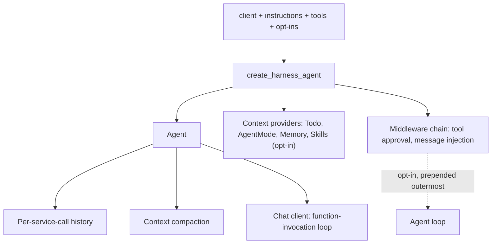
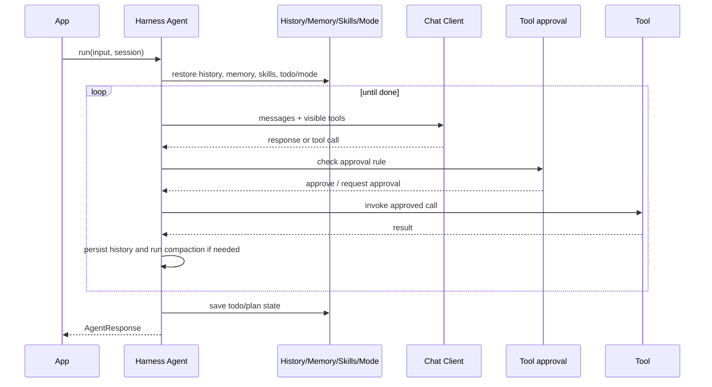
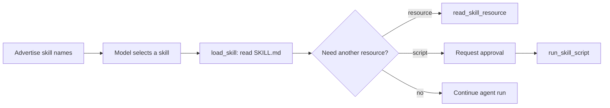
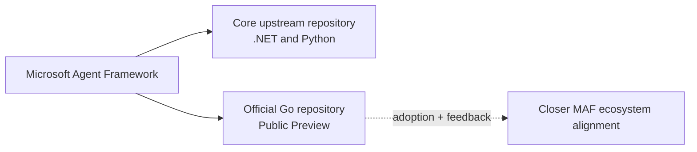

# Microsoft Agent Framework 2026: Python Highlights and the Go Implementation

Python highlights Agent Harness and Agent Skills. The Go section briefly
positions the official Go implementation within the MAF ecosystem.

---

## Part I — Python: Two Capabilities Worth Examining

## 1. Agent Harness

### What Microsoft released
Microsoft defines an agent harness as "the scaffolding that turns a language model into an agent," and describes the shipped Harness as "an opinionated, fully customizable, batteries-included agent that wraps a chat client with a complete agentic pipeline, tuned for long-running, autonomous work such as research, data analysis, and general task automation." Microsoft states the default capability list, each "enabled by default and individually customizable or removable": function invocation (the tool-calling loop with a configurable iteration limit), per-service-call history persistence, compaction, todo and agent-mode providers, file memory, Skills, web search (when the chat client's service provides it), tool approval, and built-in OpenTelemetry telemetry.

Microsoft states that internally the Harness "is just a chat-client agent (`Agent` in Python, `ChatClientAgent` in .NET) with a curated set of Agent Framework features added" — the distinction from a basic `Agent` is this pre-assembled feature set, not a separate runtime. Under its "Coming soon" section, Microsoft states that background agents, file access, looping, and shell tooling (the last "from the alpha-stage tools package") are opt-in features it is "not releasing yet," adding "you will get a warning when opting into these features." (Source: [The Microsoft Agent Framework Harness is now released](https://devblogs.microsoft.com/agent-framework/the-microsoft-agent-framework-harness-is-now-released/).)

<p align="center">
  
</p>

*The official demo shows a Harness-built research agent planning, tracking a todo list, and executing a multi-step task end to end. Source: [The Microsoft Agent Framework Harness is now released](https://devblogs.microsoft.com/agent-framework/the-microsoft-agent-framework-harness-is-now-released/).*

### How the Harness is assembled
Reading `agent_framework/_harness/_agent.py` at `python-1.14.0` confirms the exact `create_harness_agent()` assembly described below.

- **Factory result:** the resulting object is returned as an `Agent`, so it can be passed anywhere an `Agent` is expected. The constructed context providers (todo, agent-mode, file memory, and the opt-in Skills provider), the assembled middleware chain, and the per-service-call history persistence and compaction all attach to that same ordinary `Agent` instance.
- **Context providers:** a `SkillsProvider` is appended only when the caller passes `skills_provider` or `skills_paths` — the source comment states "Skills are opt-in: only added when skills_provider or skills_paths is provided." When the chat client implements `SupportsWebSearchTool`, the client's web search tool is appended to the assembled tool list unless the caller passes `disable_web_search=True`. Web search is therefore opt-out, not opt-in, and is not marked experimental.
- **Middleware and client loop:** the assembled middleware chain is `[ToolApprovalMiddleware, MessageInjectionMiddleware]` plus any user-supplied middleware — message injection is always on, with no opt-out. Only when the caller sets `loop_should_continue` is the opt-in `AgentLoopMiddleware` prepended, so it sits outermost of all and each iteration re-runs the full chain including tool approval. The tool-calling loop itself is not part of this middleware chain: it belongs to the chat client's `FunctionInvocationLayer`, and `Agent.__init__` only logs a warning when the supplied client does not implement it.
- **Defaults and opt-ins:** `background_agents`, `file_access_store`, and `loop_should_continue` are each collected into one `experimental_params` list that triggers a single `ExperimentalWarning` under the `HARNESS` feature id when any of them is set. `shell_executor` is checked separately and, when set, triggers its own distinct `ExperimentalWarning` under a separate `SHELL_TOOLING` feature id — a dedicated label the source comments explain exists "to avoid suppressing unrelated HARNESS warnings."

*Source-derived diagram based on python-1.14.0.*


*Source-derived diagram based on python-1.14.0.*

<details>
<summary><strong>Complete validated example</strong></summary>

```python
import asyncio
import os

from agent_framework import create_harness_agent
from agent_framework.foundry import FoundryChatClient
from azure.identity import AzureCliCredential

async def main() -> None:
    client = FoundryChatClient(
        project_endpoint=os.environ["FOUNDRY_PROJECT_ENDPOINT"],
        model=os.environ["FOUNDRY_MODEL"],
        credential=AzureCliCredential(),
    )
    harness = create_harness_agent(
        client=client,
        agent_instructions="Plan the work, then execute it, and request approval for risky actions.",
    )

    response = await harness.run("Prepare the checklist for this week's deployment.")
    print(response.text)

if __name__ == "__main__":
    asyncio.run(main())
```
</details>

| Component | Default behavior at `python-1.14.0` |
|---|---|
| Function invocation loop | belongs to chat client's `FunctionInvocationLayer`, not part of `create_harness_agent()` assembly |
| Per-service-call history persistence | always wired by the factory (`require_per_service_call_history_persistence=True`); provider is swappable via `history_provider`, but there is no disable flag |
| Compaction | inert by default — automatically disabled unless `max_context_window_tokens`/`max_output_tokens` or a custom `before_compaction_strategy`/`after_compaction_strategy` is supplied; an explicit `disable_compaction` flag forces it off regardless |
| Todo, agent-mode, tool auto-approval | default providers/middleware (`TodoProvider`, `AgentModeProvider`, `ToolApprovalMiddleware`) enabled unless disabled via `disable_todo`, `disable_mode`, `disable_tool_auto_approval` |
| Telemetry (OpenTelemetry) | enabled by default; no disable flag in `create_harness_agent()` |
| Web search | on by default on a supporting chat client; opt out with `disable_web_search=True` |
| Skills | opt-in; added only when `skills_provider` or `skills_paths` is supplied |
| `background_agents`, `file_access_store`, `loop_should_continue` | opt-in; emit one shared `ExperimentalWarning` (`HARNESS`) |
| `shell_executor` | opt-in; emits a separate `ExperimentalWarning` (`SHELL_TOOLING`) |
## 2. Agent Skills

### What Agent Skills provide
Microsoft describes Agent Skills as "reusable bundles of domain expertise (instructions, reference material, and scripts that load only when a task calls for them)," discoverable "on demand" and kept lean through "a four-stage progressive disclosure pattern: advertise skill names → load instructions → read resources → run scripts." Microsoft states the format supports three independent authoring styles — file-based, class-based, and code-defined skills — so teams can author and release skills on their own schedule, and that "the core skills API has no experimental gate" at this release. (Source: [Agent Skills for Python is now released](https://devblogs.microsoft.com/agent-framework/agent-skills-for-python-is-now-released/).)


*Agent Skills package anatomy: `SKILL.md`, references, and scripts loaded progressively as a task requires them. Source: [Give Your Agents Domain Expertise with Agent Skills in Microsoft Agent Framework](https://devblogs.microsoft.com/agent-framework/give-your-agents-domain-expertise-with-agent-skills-in-microsoft-agent-framework/).*

### How Skills are loaded and governed
At `python-1.14.0`, the source confirms the following skill boundaries.

- **Skill sources:** `SkillsProvider.from_paths(...)` builds a provider from one or more skill directories without requiring the caller to hand-assemble a context provider. The provider exposes `load_skill`, `read_skill_resource`, and `run_skill_script` as the three tools that implement progressive disclosure.
- **Approval boundaries:** all three tools are registered with `approval_mode="always_require"` by default. The provider offers explicit opt-outs — for example `disable_load_skill_approval` — to relax individual tools.
- **Harness integration:** inside `create_harness_agent()`, a `SkillsProvider` is added only when the caller supplies `skills_provider` or `skills_paths`. Skills are opt-in inside the Harness, not part of its default assembly.
- **Experimental MCP source:** `MCPSkillsSource` (the Python identifier uses an all-capital `MCP` prefix) discovers skills served over MCP by reading a `skill://index.json` resource. The class is decorated `@experimental(feature_id=ExperimentalFeature.MCP_SKILLS)` in the pinned source.

*Source-derived diagram based on python-1.14.0.*

<details>
<summary><strong>Complete validated example</strong></summary>

```python
import asyncio
import os

from agent_framework import Agent, SkillsProvider
from agent_framework.foundry import FoundryChatClient
from azure.identity import AzureCliCredential

async def main() -> None:
    client = FoundryChatClient(
        project_endpoint=os.environ["FOUNDRY_PROJECT_ENDPOINT"],
        model=os.environ["FOUNDRY_MODEL"],
        credential=AzureCliCredential(),
    )
    skills_provider = SkillsProvider.from_paths("./skills")
    agent = Agent(
        client=client,
        instructions="Load a skill only when the task requires it.",
        context_providers=[skills_provider],
    )

    response = await agent.run("Use the deployment checklist skill to review readiness.")
    print(response.text)

if __name__ == "__main__":
    asyncio.run(main())
```
</details>

### Related: Progressive Tools
Progressive Tools is a related but separate, narrower capability: a tool handler can call `FunctionInvocationContext.add_tools()`/`remove_tools()` to change the visible tool list for the run's next iteration. Both methods are decorated `@experimental(feature_id=ExperimentalFeature.PROGRESSIVE_TOOLS)` at `python-1.14.0`, and it is not selected as a main feature in this brief.

---

## Part II — Go: A New Language Implementation in the MAF Ecosystem


*Official banner from the [Microsoft Agent Framework for Go repository](https://github.com/microsoft/agent-framework-go).*

### Where Go sits today

Microsoft describes this repository as **the Go implementation of Microsoft Agent Framework**. It is therefore part of the official MAF language family, alongside .NET and Python, rather than an unrelated community SDK.

There is one important qualification: Go has not yet been merged into the core upstream repository. The pinned README states that it is in **Public Preview** and is "currently evolving outside the core upstream codebase." Microsoft expects "closer alignment with the broader MAF ecosystem" as adoption and feedback grow.



*Current repository position described by the [Go README](https://github.com/microsoft/agent-framework-go/blob/726b03baa4f8fe5eacd8ec78b08c0b6b37b9c31e/README.md), pinned to 2026-08-14.*

### What is worth noting

- **A new official language implementation:** Go extends MAF's reach to Go teams while retaining the framework's shared Agent, Tool, Middleware, and Workflow concepts.
- **Go-native rather than a direct port:** shared MAF concepts are expressed through Go conventions rather than mirroring the .NET API.
- **Still a preview:** feature coverage and alignment are evolving. Use the official comparison for the current gap list rather than assuming parity with .NET or Python.

### Official resources

- [Microsoft Agent Framework for Go repository](https://github.com/microsoft/agent-framework-go)
- [Go package reference](https://pkg.go.dev/github.com/microsoft/agent-framework-go)
- [.NET and Go SDK feature comparison](https://github.com/microsoft/agent-framework-go/blob/main/docs/dotnet-go-sdk-feature-comparison.md)
- [Microsoft Learn: Agent Framework](https://learn.microsoft.com/agent-framework/)
- [Official Agent Framework introduction video](https://www.youtube.com/watch?v=AAgdMhftj8w)
