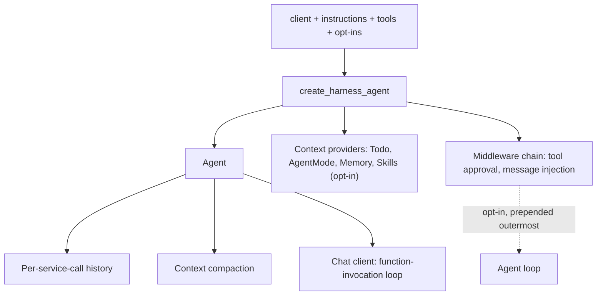
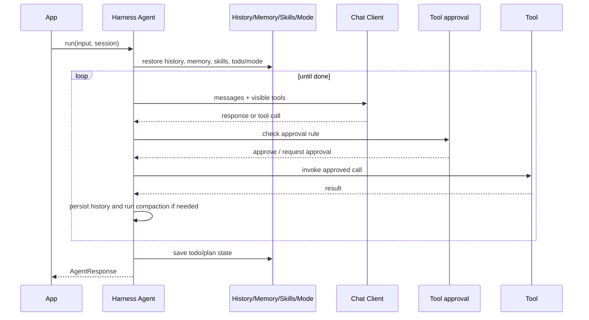
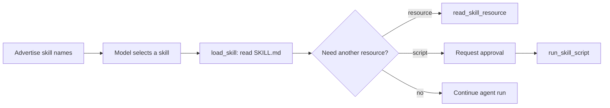
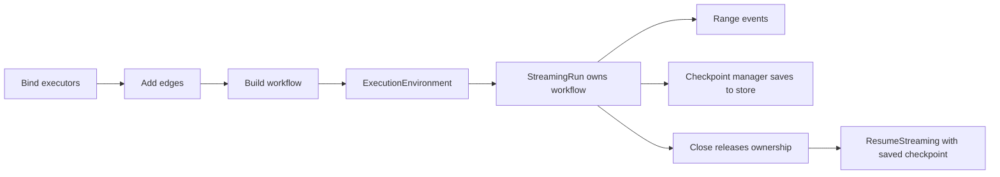

# Microsoft Agent Framework 2026: Python Highlights and the Go Implementation

Python highlights Agent Harness and Agent Skills. The Go section focuses on
construction, execution, typed tools, and workflow runtime.

---

## Part I — Python: Two Capabilities Worth Examining

## 1. Agent Harness

### What Microsoft released
Microsoft defines an agent harness as "the scaffolding that turns a language model into an agent," and describes the shipped Harness as "an opinionated, fully customizable, batteries-included agent that wraps a chat client with a complete agentic pipeline, tuned for long-running, autonomous work such as research, data analysis, and general task automation." Microsoft states the default capability list, each "enabled by default and individually customizable or removable": function invocation (the tool-calling loop with a configurable iteration limit), per-service-call history persistence, compaction, todo and agent-mode providers, file memory, Skills, web search (when the chat client's service provides it), tool approval, and built-in OpenTelemetry telemetry.

Microsoft states that internally the Harness "is just a chat-client agent (`Agent` in Python, `ChatClientAgent` in .NET) with a curated set of Agent Framework features added" — the distinction from a basic `Agent` is this pre-assembled feature set, not a separate runtime. Under its "Coming soon" section, Microsoft states that background agents, file access, looping, and shell tooling (the last "from the alpha-stage tools package") are opt-in features it is "not releasing yet," adding "you will get a warning when opting into these features." (Source: [The Microsoft Agent Framework Harness is now released](https://devblogs.microsoft.com/agent-framework/the-microsoft-agent-framework-harness-is-now-released/).)

<p align="center">
  
</p>

*The official demo shows a Harness-built research agent planning, tracking a todo list, and executing a multi-step task end to end. Source: [The Microsoft Agent Framework Harness is now released](https://devblogs.microsoft.com/agent-framework/the-microsoft-agent-framework-harness-is-now-released/).*

### How the Harness is assembled
Reading `agent_framework/_harness/_agent.py` at `python-1.14.0` confirms the exact `create_harness_agent()` assembly described below.

- **Factory result:** the resulting object is returned as an `Agent`, so it can be passed anywhere an `Agent` is expected. The constructed context providers (todo, agent-mode, file memory, and the opt-in Skills provider), the assembled middleware chain, and the per-service-call history persistence and compaction all attach to that same ordinary `Agent` instance.
- **Context providers:** a `SkillsProvider` is appended only when the caller passes `skills_provider` or `skills_paths` — the source comment states "Skills are opt-in: only added when skills_provider or skills_paths is provided." When the chat client implements `SupportsWebSearchTool`, the client's web search tool is appended to the assembled tool list unless the caller passes `disable_web_search=True`. Web search is therefore opt-out, not opt-in, and is not marked experimental.
- **Middleware and client loop:** the assembled middleware chain is `[ToolApprovalMiddleware, MessageInjectionMiddleware]` plus any user-supplied middleware — message injection is always on, with no opt-out. Only when the caller sets `loop_should_continue` is the opt-in `AgentLoopMiddleware` prepended, so it sits outermost of all and each iteration re-runs the full chain including tool approval. The tool-calling loop itself is not part of this middleware chain: it belongs to the chat client's `FunctionInvocationLayer`, and `Agent.__init__` only logs a warning when the supplied client does not implement it.
- **Defaults and opt-ins:** `background_agents`, `file_access_store`, and `loop_should_continue` are each collected into one `experimental_params` list that triggers a single `ExperimentalWarning` under the `HARNESS` feature id when any of them is set. `shell_executor` is checked separately and, when set, triggers its own distinct `ExperimentalWarning` under a separate `SHELL_TOOLING` feature id — a dedicated label the source comments explain exists "to avoid suppressing unrelated HARNESS warnings."

*Source-derived diagram based on python-1.14.0.*


*Source-derived diagram based on python-1.14.0.*

<details>
<summary><strong>Complete validated example</strong></summary>

```python
import asyncio
import os

from agent_framework import create_harness_agent
from agent_framework.foundry import FoundryChatClient
from azure.identity import AzureCliCredential

async def main() -> None:
    client = FoundryChatClient(
        project_endpoint=os.environ["FOUNDRY_PROJECT_ENDPOINT"],
        model=os.environ["FOUNDRY_MODEL"],
        credential=AzureCliCredential(),
    )
    harness = create_harness_agent(
        client=client,
        agent_instructions="Plan the work, then execute it, and request approval for risky actions.",
    )

    response = await harness.run("Prepare the checklist for this week's deployment.")
    print(response.text)

if __name__ == "__main__":
    asyncio.run(main())
```
</details>

| Component | Default behavior at `python-1.14.0` |
|---|---|
| Function invocation loop | belongs to chat client's `FunctionInvocationLayer`, not part of `create_harness_agent()` assembly |
| Per-service-call history persistence | always wired by the factory (`require_per_service_call_history_persistence=True`); provider is swappable via `history_provider`, but there is no disable flag |
| Compaction | inert by default — automatically disabled unless `max_context_window_tokens`/`max_output_tokens` or a custom `before_compaction_strategy`/`after_compaction_strategy` is supplied; an explicit `disable_compaction` flag forces it off regardless |
| Todo, agent-mode, tool auto-approval | default providers/middleware (`TodoProvider`, `AgentModeProvider`, `ToolApprovalMiddleware`) enabled unless disabled via `disable_todo`, `disable_mode`, `disable_tool_auto_approval` |
| Telemetry (OpenTelemetry) | enabled by default; no disable flag in `create_harness_agent()` |
| Web search | on by default on a supporting chat client; opt out with `disable_web_search=True` |
| Skills | opt-in; added only when `skills_provider` or `skills_paths` is supplied |
| `background_agents`, `file_access_store`, `loop_should_continue` | opt-in; emit one shared `ExperimentalWarning` (`HARNESS`) |
| `shell_executor` | opt-in; emits a separate `ExperimentalWarning` (`SHELL_TOOLING`) |
## 2. Agent Skills

### What Agent Skills provide
Microsoft describes Agent Skills as "reusable bundles of domain expertise (instructions, reference material, and scripts that load only when a task calls for them)," discoverable "on demand" and kept lean through "a four-stage progressive disclosure pattern: advertise skill names → load instructions → read resources → run scripts." Microsoft states the format supports three independent authoring styles — file-based, class-based, and code-defined skills — so teams can author and release skills on their own schedule, and that "the core skills API has no experimental gate" at this release. (Source: [Agent Skills for Python is now released](https://devblogs.microsoft.com/agent-framework/agent-skills-for-python-is-now-released/).)


*Agent Skills package anatomy: `SKILL.md`, references, and scripts loaded progressively as a task requires them. Source: [Give Your Agents Domain Expertise with Agent Skills in Microsoft Agent Framework](https://devblogs.microsoft.com/agent-framework/give-your-agents-domain-expertise-with-agent-skills-in-microsoft-agent-framework/).*

### How Skills are loaded and governed
At `python-1.14.0`, the source confirms the following skill boundaries.

- **Skill sources:** `SkillsProvider.from_paths(...)` builds a provider from one or more skill directories without requiring the caller to hand-assemble a context provider. The provider exposes `load_skill`, `read_skill_resource`, and `run_skill_script` as the three tools that implement progressive disclosure.
- **Approval boundaries:** all three tools are registered with `approval_mode="always_require"` by default. The provider offers explicit opt-outs — for example `disable_load_skill_approval` — to relax individual tools.
- **Harness integration:** inside `create_harness_agent()`, a `SkillsProvider` is added only when the caller supplies `skills_provider` or `skills_paths`. Skills are opt-in inside the Harness, not part of its default assembly.
- **Experimental MCP source:** `MCPSkillsSource` (the Python identifier uses an all-capital `MCP` prefix) discovers skills served over MCP by reading a `skill://index.json` resource. The class is decorated `@experimental(feature_id=ExperimentalFeature.MCP_SKILLS)` in the pinned source.

*Source-derived diagram based on python-1.14.0.*

<details>
<summary><strong>Complete validated example</strong></summary>

```python
import asyncio
import os

from agent_framework import Agent, SkillsProvider
from agent_framework.foundry import FoundryChatClient
from azure.identity import AzureCliCredential

async def main() -> None:
    client = FoundryChatClient(
        project_endpoint=os.environ["FOUNDRY_PROJECT_ENDPOINT"],
        model=os.environ["FOUNDRY_MODEL"],
        credential=AzureCliCredential(),
    )
    skills_provider = SkillsProvider.from_paths("./skills")
    agent = Agent(
        client=client,
        instructions="Load a skill only when the task requires it.",
        context_providers=[skills_provider],
    )

    response = await agent.run("Use the deployment checklist skill to review readiness.")
    print(response.text)

if __name__ == "__main__":
    asyncio.run(main())
```
</details>

### Related: Progressive Tools
Progressive Tools is a related but separate, narrower capability: a tool handler can call `FunctionInvocationContext.add_tools()`/`remove_tools()` to change the visible tool list for the run's next iteration. Both methods are decorated `@experimental(feature_id=ExperimentalFeature.PROGRESSIVE_TOOLS)` at `python-1.14.0`, and it is not selected as a main feature in this brief.

---

## Part II — Go: Implementation Characteristics

## At a glance
| Characteristic | Concrete API |
|---|---|
| Construction | concrete structs, small interfaces, constructors, options |
| Execution | `context.Context`, `ResponseStream`, `iter.Seq2` |
| Typed tools | generics, schema derivation, separate approval |
| Workflow runtime | builder, execution environment, checkpoint ownership |
## 1. Construction Model

### API surface
- The central, stateful objects — `agent.Agent`, `message.Message`, `workflow.Workflow`, and `workflow.Builder` — are concrete structs, not interfaces. `agent.Agent`'s fields are unexported, so a caller cannot build one from an `agent.Agent{...}` literal outside the `agent` package; the only paths to a value are the package-level constructor `agent.New(prov ProviderConfig, cfg Config) *Agent` or a provider constructor such as `foundryprovider.NewAgent(...)`.
- Small interfaces appear only at points where an application is expected to substitute its own implementation: `tool.Tool` requires exactly `Name() string` and `Description() string`, satisfied structurally with no `implements` declaration; `agent.Middleware`/`agent.MiddlewareFunc` wrap the request/response chain; `checkpoint.Store[json.RawMessage]` is the substitution point for a checkpoint backend.
- `AgentTarget`, used by `foundryprovider.NewAgent`, is a different shape: its sole method, `foundryAgentTarget()`, is unexported, making it a sealed, closed interface implemented only by the two defined string types `ModelDeployment` and `ServerAgent` in the same package — a caller selects one of those two values rather than substituting an external implementation. Provider packages (`foundryprovider`, `openaiprovider`, `anthropicprovider`, `geminiprovider`, `copilotprovider`) each expose their own constructor rather than a shared cross-package struct literal.
- Per-run behavior is passed through variadic values conventionally called functional options, but `agent.Option` is a typed interface (`Value() any`) implemented by distinct option types — such as `agent.Stream(true)`, `agent.WithSession(session)`, and `agent.WithTool(t)` — rather than the more common `func(*Config)` closure form; `agent.GetOption(options, agent.WithSession)` looks up a concrete value by its setter function as a key. Generics are used at specific construction points — `functool.New[In, Out any]` and the checkpoint `Store[json.RawMessage]` interface — but `agent.Agent` itself is not a generic type.

| Construct | Verified signature | Package |
|---|---|---|
| Core constructor | `func New(prov ProviderConfig, cfg Config) *Agent` | `agent` |
| Foundry provider constructor | `func NewAgent(endpoint string, credential azcore.TokenCredential, target AgentTarget, config AgentConfig) *agent.Agent` | `provider/foundryprovider` |
| Deployment/server target conversion | `type ModelDeployment string`, `type ServerAgent string` | `provider/foundryprovider` |
| Small substitution interface | `type Tool interface { Name() string; Description() string }` | `tool` |
| Typed tool constructor | `func New[In, Out any](cfg Config, h HandlerFor[In, Out]) (tool.FuncTool, error)` | `tool/functool` |
| Workflow builder constructor | `func NewBuilder(start ExecutorBinding) *Builder` | `workflow` |
## 2. Execution Model

### API surface
The pinned signatures for running an agent are:

```go-signature
func (a *Agent) RunText(ctx context.Context, msg string, options ...Option) ResponseStream
func (a *Agent) Run(ctx context.Context, messages []*message.Message, options ...Option) ResponseStream
func NewText(text string) *Message

type ResponseStream iter.Seq2[*ResponseUpdate, error]
func (r ResponseStream) Collect() (*Response, error)
```

### Execution behavior
- `RunText` builds a single user message with `message.NewText(msg)` and delegates to `Run`. `Run` accepts `context.Context`, a `[]*message.Message`, and variadic `agent.Option` values, and returns a `ResponseStream` — a defined type over `iter.Seq2[*ResponseUpdate, error]`. `Run` itself is not lazy: before it returns, it resolves the configured run options and, unless the caller passed `WithSession`, calls `a.CreateSession`, which invokes the provider's `CreateSession` and can make a provider round-trip before the stream is ever consumed. Only the underlying provider *run* call is deferred — it starts once the caller ranges over the stream or calls `Collect()`.
- `context.Context` is the single path for cancellation, deadlines, and trace propagation; the same `ctx` is threaded through middleware, the provider call, and tool handlers. When ranging directly, each loop iteration yields exactly one of an update or a non-nil error, never both meaningfully at once: a non-nil `err` means that item is an error, not a response fragment, so consuming `update` after an error risks a nil pointer or corrupted text. Returning from inside the loop causes the range's internal `yield` to return `false`, which lets the middleware/provider chain clean up.

### Operational detail
`Collect()` drains the stream, merges the updates, and returns `(*Response, error)`; on error it returns `nil, err` immediately, leaving the error-wrapping decision to the caller.

### Example
<details>
<summary><strong>Complete validated example</strong></summary>

```go
package main

import (
	"context"
	"fmt"
	"log"
	"os"
	"time"

	"github.com/Azure/azure-sdk-for-go/sdk/azidentity"
	"github.com/microsoft/agent-framework-go/agent"
	"github.com/microsoft/agent-framework-go/provider/foundryprovider"
)

func main() {
	endpoint := os.Getenv("FOUNDRY_PROJECT_ENDPOINT")
	model := os.Getenv("FOUNDRY_MODEL")
	if endpoint == "" || model == "" {
		log.Fatal("FOUNDRY_PROJECT_ENDPOINT and FOUNDRY_MODEL are required")
	}
	credential, err := azidentity.NewDefaultAzureCredential(nil)
	if err != nil {
		log.Fatal(err)
	}
	a := foundryprovider.NewAgent(
		endpoint,
		credential,
		foundryprovider.ModelDeployment(model),
		foundryprovider.AgentConfig{
			Instructions: "Answer questions concisely.",
			Config: agent.Config{
				Name: "GuideAgent",
			},
		},
	)
	ctx, cancel := context.WithTimeout(context.Background(), 30*time.Second)
	defer cancel()

	// Collect drains the stream; range iterates it directly.
	resp, err := a.RunText(ctx, "Explain the difference between Agent and Workflow in one sentence.").Collect()
	if err != nil {
		log.Fatal(err)
	}
	fmt.Println(resp.String())

	var streamed string
	for update, err := range a.RunText(ctx, "Give one more sentence.", agent.Stream(true)) {
		if err != nil {
			log.Fatal(fmt.Errorf("stream agent: %w", err))
		}
		streamed += update.String()
	}
	fmt.Println(streamed)
}
```
</details>

## 3. Typed Tools

### API surface
The pinned signatures for `tool/functool` show it builds a `tool.FuncTool` from a generic handler:

```go-signature
type Config struct {
	Name        string
	Description string
}

type HandlerFor[In, Out any] func(context.Context, In) (Out, error)

func New[In, Out any](cfg Config, h HandlerFor[In, Out]) (tool.FuncTool, error)
func MustNew[In, Out any](cfg Config, h HandlerFor[In, Out]) tool.FuncTool
```

### Execution behavior
- `New` derives a JSON schema for `In` (via an internal `jsonformat.Format`) and validates that `Out` can also be normalized into a schema-compatible result, returning a `%w`-wrapped error if either construction fails. `MustNew` panics on the same failure instead of returning an error, which fits package-level initialization where a schema-construction failure is a programming error; `New` is the better choice when a tool is constructed from runtime input, where a returned error can be handled.
- The returned value satisfies `tool.FuncTool` (a `SchemaTool` plus `Call(ctx, args string) (any, error)`). When a model calls the tool, the framework decodes the raw JSON arguments into `In`, validates them against the derived schema, invokes `h(ctx, in)`, and normalizes the handler's `Out` value (via `outputFormat.Normalize`) into the content returned to the provider.

### Operational detail
Approval marking is a separate concern from schema generation and typing: a tool becomes subject to approval only when explicitly wrapped with `tool.ApprovalRequiredFunc(t)`, which makes the provider return a `*message.ToolApprovalRequestContent` instead of an executed result. The application resolves that request and calls `request.CreateResponse(approved, reason)` to build the response content for the next `Run`/`RunMessage` call.

### Example
<details>
<summary><strong>Complete validated example</strong></summary>

```go
package main

import (
	"context"
	"fmt"
	"log"
	"os"

	"github.com/Azure/azure-sdk-for-go/sdk/azidentity"
	"github.com/microsoft/agent-framework-go/agent"
	"github.com/microsoft/agent-framework-go/message"
	"github.com/microsoft/agent-framework-go/provider/foundryprovider"
	"github.com/microsoft/agent-framework-go/tool"
	"github.com/microsoft/agent-framework-go/tool/functool"
)

var weatherTool = functool.MustNew(
	functool.Config{
		Name:        "weather",
		Description: "Get the current weather for a given location",
	},
	func(ctx context.Context, location string) (string, error) {
		if err := ctx.Err(); err != nil {
			return "", err
		}
		return fmt.Sprintf("%s: cloudy, 15C", location), nil
	},
)

func main() {
	endpoint := os.Getenv("FOUNDRY_PROJECT_ENDPOINT")
	model := os.Getenv("FOUNDRY_MODEL")
	if endpoint == "" || model == "" {
		log.Fatal("FOUNDRY_PROJECT_ENDPOINT and FOUNDRY_MODEL are required")
	}
	credential, err := azidentity.NewDefaultAzureCredential(nil)
	if err != nil {
		log.Fatal(err)
	}
	a := foundryprovider.NewAgent(
		endpoint,
		credential,
		foundryprovider.ModelDeployment(model),
		foundryprovider.AgentConfig{
			Instructions: "Use the weather tool when it helps answer the question.",
			Config: agent.Config{
				Tools: []tool.Tool{tool.ApprovalRequiredFunc(weatherTool)},
			},
		},
	)
	ctx := context.Background()
	session, err := a.CreateSession(ctx)
	if err != nil {
		log.Fatal(err)
	}
	resp, err := a.RunText(ctx, "What is the weather in Amsterdam?", agent.WithSession(session)).Collect()
	if err != nil {
		log.Fatal(err)
	}
	fmt.Println(resp.String())
	var responses []message.Content
	for c := range resp.Contents() {
		request, ok := c.(*message.ToolApprovalRequestContent)
		if !ok {
			continue
		}
		// A real service would obtain approval from a person or policy engine here.
		responses = append(responses, request.CreateResponse(true, ""))
	}
	if len(responses) == 0 {
		return
	}
	final, err := a.RunMessage(ctx, message.New(responses...), agent.WithSession(session)).Collect()
	if err != nil {
		log.Fatal(err)
	}
	fmt.Println(final.String())
}
```
</details>

## 4. Workflow Runtime

*Source-derived diagram based on the pinned Go API.*

### API surface
`workflow.NewBuilder(start ExecutorBinding) *Builder` begins a graph; `AddEdge`/`AddDirectEdge`/`AddFanOutEdge`/`AddFanInBarrierEdge` register edges, `WithOutputFrom` designates outputs, and `Build() (*Workflow, error)` validates the graph. Builder methods store errors internally, so only the final `Build()` call's returned error needs checking. `agentworkflow.NewSequentialWorkflowBuilder`, `NewConcurrentWorkflowBuilder`, and `NewGroupChatWorkflowBuilder` are convenience adapters over this same `workflow.Builder`/`ExecutionEnvironment` model, not a separate execution engine.

### Execution behavior
- Execution is owned by `workflow/inproc.ExecutionEnvironment`. The package variable `inproc.Default` (itself equal to `inproc.OffThread`) supplies a default environment, and `(*ExecutionEnvironment).WithCheckpointing(mgr checkpoint.Manager)` returns a new environment with checkpointing attached. `RunStreaming(ctx, wf, msg, opts...)` returns a `*StreamingRun`, whose `WatchStream(ctx)` method yields `workflow.Event` values one at a time. When a super step completes and a checkpoint is produced, it arrives as `workflow.SuperStepCompletedEvent.CompletionInfo.CheckpointInfo`.
- A `*StreamingRun` owns the `*Workflow` it was started from until it is closed: calling `ResumeStreaming` on the same workflow while the first run remains open returns an "already owned by another runner" error. Calling `run.Close(ctx)` releases that ownership; `Close` is implemented as an idempotent compare-and-swap, so calling it a second time (for example from a deferred cleanup after an explicit `Close` on the success path) is safe. Only after that release does `(*ExecutionEnvironment).ResumeStreaming(ctx, wf, savedCheckpoint, opts...)` successfully resume execution from a previously saved `workflow.CheckpointInfo`.

### Operational detail
A checkpoint `Manager` is constructed with `checkpoint.NewInMemoryManager()` or `checkpoint.NewJSONManager(store)`, where `store` is a `checkpoint.Store[json.RawMessage]`. A file-backed store comes from the two-value `checkpoint.NewFileSystemJSONStore(rootDir)`, or an application can supply its own `Store[json.RawMessage]`. This mechanism saves and restores in-process execution state; it is not a durable orchestrator and does not by itself guarantee crash recovery, so surviving a process restart requires a store the application has verified for consistency.

### Example
<details>
<summary><strong>Complete validated example</strong></summary>

```go
package main

import (
	"context"
	"fmt"
	"strings"

	"github.com/microsoft/agent-framework-go/workflow"
	"github.com/microsoft/agent-framework-go/workflow/checkpoint"
	"github.com/microsoft/agent-framework-go/workflow/inproc"
)

func buildPipeline() (*workflow.Workflow, error) {
	uppercase := workflow.NewExecutor("Uppercase", func(input string) string {
		return strings.ToUpper(input)
	}).Bind()
	reverse := workflow.NewExecutor("Reverse", func(input string) string {
		runes := []rune(input)
		for i, j := 0, len(runes)-1; i < j; i, j = i+1, j-1 {
			runes[i], runes[j] = runes[j], runes[i]
		}
		return string(runes)
	}).Bind()

	return workflow.NewBuilder(uppercase).
		AddEdge(uppercase, reverse).
		WithOutputFrom(reverse).
		Build()
}

func main() {
	wf, err := buildPipeline()
	if err != nil {
		fmt.Println(fmt.Errorf("build workflow: %w", err))
		return
	}

	manager := checkpoint.NewInMemoryManager()
	env := inproc.Default.WithCheckpointing(manager)
	ctx := context.Background()
	run, err := env.RunStreaming(ctx, wf, "Hello, World!")
	if err != nil {
		fmt.Println(fmt.Errorf("start streaming run: %w", err))
		return
	}
	defer func() { _ = run.Close(ctx) }()

	var output string
	var checkpoints []workflow.CheckpointInfo
	for evt, err := range run.WatchStream(ctx) {
		if err != nil {
			fmt.Println(fmt.Errorf("watch stream: %w", err))
			return
		}
		switch e := evt.(type) {
		case workflow.SuperStepCompletedEvent:
			if e.CompletionInfo != nil && e.CompletionInfo.CheckpointInfo != nil {
				checkpoints = append(checkpoints, *e.CompletionInfo.CheckpointInfo)
			}
		case workflow.OutputEvent:
			if s, ok := e.Output.(string); ok {
				output = s
			}
		case workflow.ErrorEvent:
			fmt.Println(fmt.Errorf("workflow error event: %w", e.Error))
			return
		case workflow.ExecutorFailedEvent:
			fmt.Println(fmt.Errorf("executor %q failed: %w", e.ExecutorID, e.Error))
			return
		}
	}
	fmt.Println("output:", output)
	// Close is idempotent; ResumeStreaming needs the earlier run's ownership released first.
	if err := run.Close(ctx); err != nil {
		fmt.Println(fmt.Errorf("close initial run: %w", err))
		return
	}
	if len(checkpoints) == 0 {
		return
	}
	resumed, err := env.ResumeStreaming(ctx, wf, checkpoints[0])
	if err != nil {
		fmt.Println(fmt.Errorf("resume from checkpoint: %w", err))
		return
	}
	defer func() { _ = resumed.Close(ctx) }()
	for evt, err := range resumed.WatchStream(ctx) {
		if err != nil {
			fmt.Println(fmt.Errorf("watch resumed stream: %w", err))
			return
		}
		if out, ok := evt.(workflow.OutputEvent); ok {
			fmt.Println("resumed output:", out.Output)
		}
	}
}
```
</details>

Running this example against the pinned commit prints:

```
output: !DLROW ,OLLEH
resumed output: !DLROW ,OLLEH
```
Both lines match because the checkpoint captured after the first run restores the same completed output; the second line only appears if `ResumeStreaming` actually replays the saved graph state rather than returning an empty result.

---

## Go Public Preview constraints

### Current preview limits
The pinned README states that "Microsoft Agent Framework for Go is in public preview and is currently evolving outside the core upstream codebase," and `go.mod` requires Go `1.25.0`. The README's "Preview status" section states that "Declarative agents, RAG, CodeAct, and functional workflows are not yet available." The linked [`docs/dotnet-go-sdk-feature-comparison.md`](https://github.com/microsoft/agent-framework-go/blob/726b03baa4f8fe5eacd8ec78b08c0b6b37b9c31e/docs/dotnet-go-sdk-feature-comparison.md) states that the Harness utility packages (`agent/harness/loop`, `agent/harness/todo`, `agent/harness/agentmode`, `agent/harness/toolapproval`, `agent/harness/toolautocall`) are a partial match against .NET's Harness utilities, and that the Go SDK does not yet include integrated Harness file access, file memory, or file store. The same document states the Go SDK has "No evaluation package" and no DevUI package. (Source: [`README.md`](https://github.com/microsoft/agent-framework-go/blob/726b03baa4f8fe5eacd8ec78b08c0b6b37b9c31e/README.md); [feature comparison](https://github.com/microsoft/agent-framework-go/blob/726b03baa4f8fe5eacd8ec78b08c0b6b37b9c31e/docs/dotnet-go-sdk-feature-comparison.md).)

### Repository status
The absence of a tagged release at this baseline is a GitHub API observation, not a README claim: neither the README nor the feature comparison says anything about releases or tags. A direct query of the GitHub API for `microsoft/agent-framework-go` returns zero entries from both the `/releases` and `/tags` endpoints as of 2026-08-16, so no Git tag and no GitHub Release exist at the pinned commit. This baseline is pinned to commit 726b03baa4f8fe5eacd8ec78b08c0b6b37b9c31e (pseudo-version v0.0.0-20260814094849-726b03baa4f8) and requires Go 1.25.0.

---

## Questions for your framework team
1. Which runtime capabilities does your framework bundle by default, and how can teams inspect or override them?
2. How does your framework package and load reusable expertise without placing all instructions and tools in every initial context?
3. How are cancellation, streaming errors, and per-run options represented in each supported language?
4. What ownership and persistence rules must be satisfied before a workflow can resume from a checkpoint?
