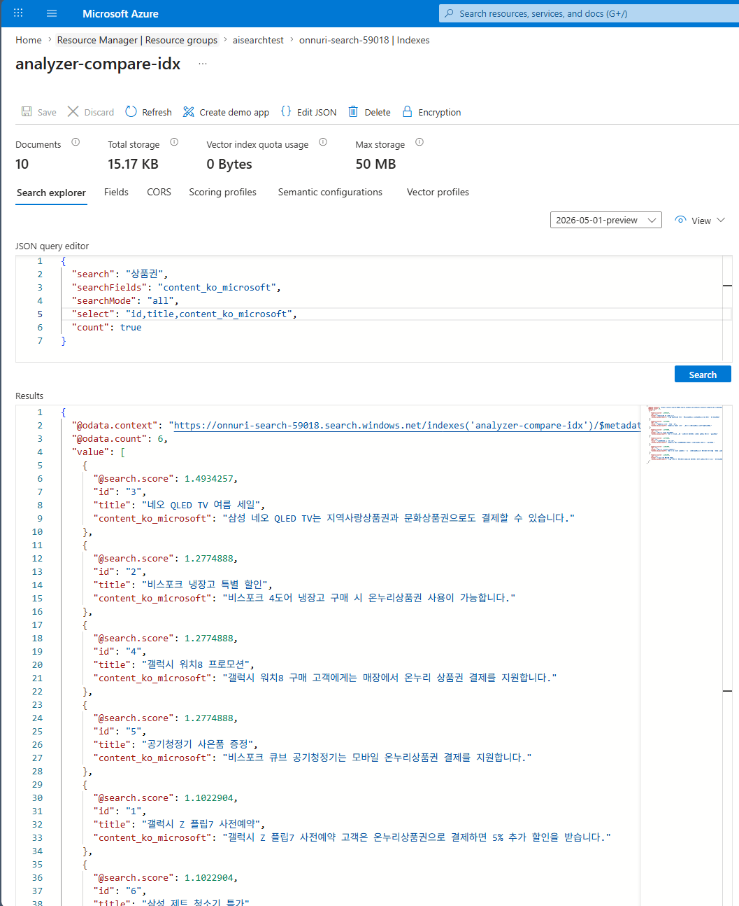
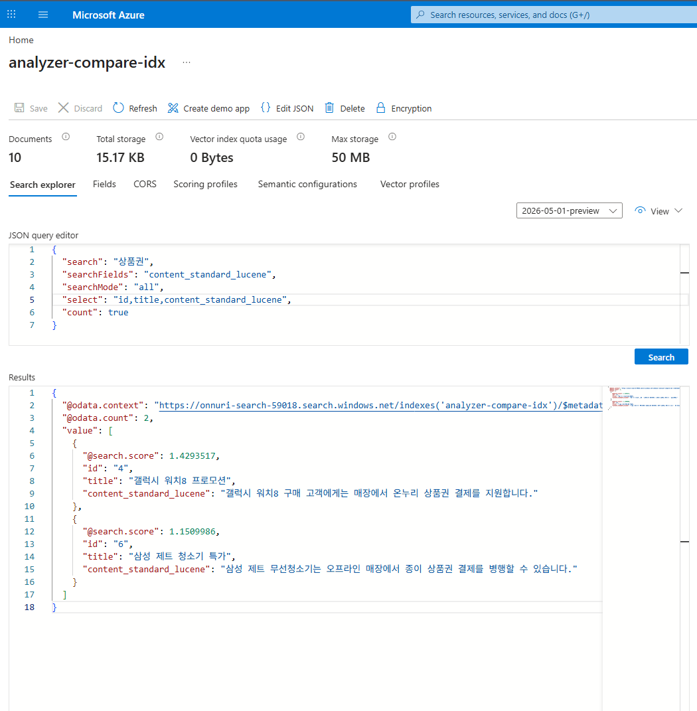

# Azure AI Search 한국어 분석기(Analyzer) 비교 가이드

**필드에 지정하는 분석기(Analyzer)에 따라 한국어 복합명사/조사 검색 성능(recall)이 어떻게 달라지는지 실제 리소스로 재현하고, `ko.microsoft`가 가장 잘 검색되는 것을 정답/오답 데이터로 검증한 가이드**

> **고객 증상 예시**: "특정 한국어 단어(예: `온누리상품권`)가 AI Search에서 검색되지 않는다", "인덱스 필드의 analyzer 설정에 따라 같은 검색어가 되기도 하고 안 되기도 한다". → 원인·해결·검증 절차는 [🛠️ 고객 적용 가이드](#️-고객-적용-가이드-진단--조치--검증) 참고.

---

## 📌 핵심 요약

| 항목 | 내용 |
|------|------|
| 주제 | Azure AI Search **분석기(Analyzer)** 선택이 한국어 검색 품질에 미치는 영향 |
| 결론 | **`ko.microsoft`만** 모든 쿼리 변형에서 기대정답을 완벽 회수(recall 5/5) |
| 근본 원인 | 기본값 `standard.lucene`은 복합명사 미분해 + 조사(은/는/도/과) 미제거 |
| 해결 | 한국어 필드에 `ko.microsoft` 분석기 지정 후 **재색인** |
| 검증 리소스 | RG `aisearchtest` / AI Search `onnuri-search-59018` (Free, koreacentral) |
| 검증 방법 | 정답 6건 + distractor 4건 데이터로 분석기별 recall/precision 비교 |

> `온누리상품권`은 분석기 동작을 보여주기 위한 **샘플 검색 키워드**일 뿐이며, 이 가이드는 AI Search 분석기 기능 자체에 초점을 둔다.

---

## 🔍 배경 및 문제 정의

한국어는 다음 두 특성 때문에 기본 분석기로는 검색 품질이 떨어진다.

1. **복합명사(복합어)**: `온누리상품권` = `온누리` + `상품권`. 사용자는 `상품권`만으로도 찾고 싶어 한다.
2. **조사(助詞)**: `온누리상품권으로`, `온누리상품권은` 처럼 명사에 조사가 붙는다. 형태소 분석 없이는 `온누리상품권` 검색어가 `온누리상품권으로` 토큰과 매칭되지 않는다.

이전 데이터는 **모든 문서에 키워드가 있어** 무엇이 검색되는지 구분이 어려웠다. 그래서 이번에는 **정답 문서(상품권 관련)와 오답 문서(무관 distractor)를 섞어**, 분석기별로 "정답만 정확히 회수하는지"를 검증한다.

---

## 🧩 Azure AI Search 내장 한국어 분석기

| 분석기 | 방식 | 특징 |
|--------|------|------|
| **`ko.microsoft`** | Microsoft 형태소 분석 | 복합명사를 의미 단위로 분해 + 조사 제거. 한국어 전문 검색 1순위 |
| `ko.lucene` | Lucene 한국어 | 2글자 n-gram 기반. recall은 높으나 무의미 토큰(노이즈) + 띄어쓰기 변형에 약함 |
| `standard.lucene` | 표준(기본값) | 언어 비인식. 공백 기준으로만 분리 → 복합명사/조사 처리 안 됨 |
| `keyword` | 단일 토큰 | 필드 전체를 하나의 토큰으로. 전문 검색 부적합 |

---

## 🏗️ 검증 환경

| 구성 요소 | 리소스 | 세부 사항 |
|-----------|--------|-----------|
| Resource Group | `aisearchtest` | koreacentral |
| AI Search | `onnuri-search-59018` | **Free** tier (비용 0) |
| Index | `analyzer-compare-idx` | 동일 텍스트를 4개 분석기 필드로 색인 (모두 retrievable) |
| 샘플 데이터 | `sample_data.json` | 정답 6건 + distractor 4건 = 10건 |
| 테스트 스크립트 | `analyzer_test.py` | 인덱스 생성 → 업로드 → Analyze 비교 → 검색/ recall 비교 |

### 필드 설계 (분석기명을 필드명에 포함)

같은 `content` 텍스트를 **4개 필드**에 넣고 각각 다른 분석기를 지정한다. 필드명에 분석기명을 넣어 혼동을 없앴다.

> ⚠️ Azure AI Search **필드명에는 `.`(점)을 쓸 수 없다**(점은 복합타입 하위필드 경로로 해석됨). 그래서 `content.standard.lucene` 대신 **`_`(밑줄)**로 표기한다.

| 필드명 | 분석기 |
|--------|--------|
| `content_ko_microsoft` | `ko.microsoft` |
| `content_ko_lucene` | `ko.lucene` |
| `content_standard_lucene` | `standard.lucene` |
| `content_keyword` | `keyword` |

### 데이터 (정답/오답)

| id | 제목 | 정답? | content 요지 |
|:--:|------|:----:|------|
| 1 | 갤럭시 Z 플립7 사전예약 | ✅ | **온누리상품권**으로 결제 |
| 2 | 비스포크 냉장고 특별 할인 | ✅ | **온누리상품권** 사용 가능 |
| 3 | 네오 QLED TV 여름 세일 | ✅ | **지역사랑상품권**·**문화상품권** 결제 |
| 4 | 갤럭시 워치8 프로모션 | ✅ | **온누리 상품권**(띄어쓰기) 결제 |
| 5 | 공기청정기 사은품 증정 | ✅ | 모바일 **온누리상품권** 결제 |
| 6 | 삼성 제트 청소기 특가 | ✅ | 종이 **상품권**(단독어) 결제 |
| 7 | 갤럭시 버즈3 프로 번들 | ❌ | "**신상품**"·카드 결제 (상품권 아님 → 함정) |
| 8 | 갤럭시북5 프로 학생 할인 | ❌ | 신용카드 전용 |
| 9 | 비스포크 인덕션 설치 | ❌ | 무료 설치 서비스 |
| 10 | 갤럭시 탭 S10 무이자 할부 | ❌ | 12개월 무이자 할부 |

---

## 🧪 재현 1 — Analyze Text API: 토큰 분해 비교

입력 `온누리상품권` **실측 결과**:

| 분석기 | 토큰 수 | 토큰 |
|--------|:------:|------|
| **ko.microsoft** | 5 | `온누리상품권`, `온누리상품`, `온누리`, `상품권`, `상품` |
| ko.lucene | 5 | `온누`, `누리`, `리상`, `상품`, `품권` |
| standard.lucene | 1 | `온누리상품권` |
| keyword | 1 | `온누리상품권` |

입력 `개인정보보호위원회` (또 다른 긴 복합명사) 실측 결과:

| 분석기 | 토큰 수 | 토큰 |
|--------|:------:|------|
| **ko.microsoft** | 14 | `개인정보보호위원회`, `개인정보보호위원`, …, `보호`, `위원회`, `위원` |
| ko.lucene | 8 | `개인`, `인정`, `정보`, `보보`, `보호`, `호위`, `위원`, `원회` |
| standard.lucene | 1 | `개인정보보호위원회` |
| keyword | 1 | `개인정보보호위원회` |

- `ko.microsoft`: 복합명사를 **의미 있는 부분 명사**로 분해 → 부분어 검색이 잘 된다.
- `ko.lucene`: **2글자 n-gram**으로 쪼갬 → recall은 높지만 `리상`·`보보` 같은 무의미 토큰(노이즈).
- `standard.lucene` / `keyword`: 한국어를 **하나의 덩어리**로 처리 → 부분어·조사 변형 검색 실패.

---

## 🧪 재현 2 — 검색 히트 비교 (매칭 문서 id, `searchMode=all`)

| 쿼리 | ko.microsoft | ko.lucene | standard.lucene | keyword |
|------|-------------|-----------|-----------------|---------|
| `상품권` | 1,2,3,4,5,6 | 1,2,3,4,5,6 | **4,6** | - |
| `온누리상품권` | 1,2,4,5 | **1,2,5** | **2,5** | - |
| `온누리 상품권` | 1,2,4,5 | 1,2,4,5 | **4** | - |
| `온누리` | 1,2,4,5 | 1,2,4,5 | **4** | - |
| `지역사랑상품권` | 3 | 3 | **-** | - |

distractor(7~10)는 **어떤 분석기에서도 오탐되지 않았다**(precision 100%). 즉 문제는 정밀도가 아니라 **정답을 놓치는 recall**이다.

---

## 🎯 핵심 결론 — 쿼리 변형별 recall (기대정답 대비 회수율)

| 쿼리 | 기대정답 | ko.microsoft | ko.lucene | standard.lucene | keyword |
|------|---------|:-----------:|:---------:|:---------------:|:-------:|
| `상품권` | 1,2,3,4,5,6 | **6/6 ✓** | 6/6 ✓ | 2/6 | 0/6 |
| `온누리상품권` | 1,2,4,5 | **4/4 ✓** | 3/4 | 2/4 | 0/4 |
| `온누리 상품권` | 1,2,4,5 | **4/4 ✓** | 4/4 ✓ | 1/4 | 0/4 |
| `온누리` | 1,2,4,5 | **4/4 ✓** | 4/4 ✓ | 1/4 | 0/4 |
| `지역사랑상품권` | 3 | **1/1 ✓** | 1/1 ✓ | 0/1 | 0/1 |
| **완벽(전체 5쿼리)** | | **5/5** | 4/5 | 0/5 | 0/5 |

**→ `ko.microsoft`만 모든 쿼리에서 기대정답을 완벽히 회수한다.**

- `ko.lucene`은 `온누리상품권`(붙여쓴 복합명사) 쿼리에서 **띄어쓴 문서(id 4)를 놓친다** — n-gram `리상`이 `온누리 상품권`에는 존재하지 않기 때문.
- `standard.lucene` / `keyword`는 복합명사에 붙은 `상품권` 자체를 대부분 놓친다(0~2/6).

---

## 🖥️ 포탈에서 확인하기

Azure Portal → `onnuri-search-59018` → **Indexes → `analyzer-compare-idx` → Search explorer** → 우측 상단 **View → `JSON`** 으로 전환하면 JSON query editor가 열린다.

Search explorer는 기본적으로 모든 searchable 필드를 검색하므로, **`searchFields`로 분석기 필드를 지정**해 비교한다. 결과 본문(`content`)까지 보려면 `select`에 해당 필드를 넣는데, **`select`에는 retrievable(=검색결과 반환 허용) 필드만** 넣을 수 있다.

> ⚠️ `Invalid expression: '...' is not a retrievable field` 오류가 나면, 해당 필드가 retrievable이 아니라는 뜻이다. **Fields 탭 → 그 필드의 Retrievable 체크 → 상단 Save** 로 켠다(재색인 불필요, 인덱스 업데이트만으로 즉시 적용). `retrievable`(반환 여부)과 `searchable`(검색 대상)은 **별개 속성**이다.

**① `ko.microsoft` 필드 — 정답 6건 전부 회수 (`@odata.count`=6)**
```json
{
  "search": "상품권",
  "searchFields": "content_ko_microsoft",
  "searchMode": "all",
  "select": "id,title,content_ko_microsoft",
  "count": true
}
```



**② `standard.lucene` 필드 — 같은 검색어인데 2건만 회수 (`@odata.count`=2)**
```json
{
  "search": "상품권",
  "searchFields": "content_standard_lucene",
  "searchMode": "all",
  "select": "id,title,content_standard_lucene",
  "count": true
}
```



`@odata.count`만 비교해도 `content_ko_microsoft`=**6** vs `content_standard_lucene`=**2** 로 차이가 즉시 드러난다. `searchFields`/`select` 값만 바꿔 다른 분석기 필드(`content_ko_lucene`, `content_keyword`)도 동일하게 비교할 수 있다.

> 4개 content 필드는 **같은 원문**을 담고(analyzer만 다름) 있으므로, `searchFields`로 지정한 필드 하나만 `select`에 넣으면 된다. 토큰 분해 결과 화면은 포탈에 없고 Analyze API/스크립트로만 확인된다.
>
> 📷 위 두 이미지는 리포지토리에 포함돼 있지 않으면 렌더되지 않는다. 포탈 스크린샷을 각각 `aisearch-v2/images/portal_ko_microsoft.png`, `aisearch-v2/images/portal_standard_lucene.png` 로 저장하면 표시된다.

---

## 🧪 재현 3 — 동의어(Synonym Map)로 정확도 더 높이기

분석기만으로는 **문서에 아예 없는 표현**(별칭·외래어)이나 **표기 변형**을 잡지 못한다. 이때 **동의어 맵(Synonym Map)** 을 붙이면 검색어를 등가 표현으로 확장해 recall을 더 올릴 수 있다.

### 검증 설계 결정 — 분석기는 "일부만"

동의어 **효과**를 보는 것이 목적이므로 모든 분석기를 나열하지 않고, **최적(`ko.microsoft`) vs 기본값(`standard.lucene`)** 2종만 골라 각각 **동의어 ON/OFF**로 색인했다(2×2 = 4필드). `ko.lucene`(n-gram 노이즈)·`keyword`(검색 부적합)는 동의어 효과를 흐려 제외.

| 인덱스 | `analyzer-compare-idx-v2` |
|--------|---------------------------|
| 동의어 맵 | `promo-synonyms` |
| 필드 | `content_msft`, `content_msft_syn`, `content_standard`, `content_standard_syn` |
| 스크립트 | `synonym_test.py` |

**동의어 규칙(등가 형식)** — 한 줄의 단어들은 서로 완전 동치로 취급:
```
온누리상품권, 온누리 상품권, 온누리
지역사랑상품권, 지역화폐
문화상품권, 컬처랜드
```

### 검색 히트 비교 (매칭 문서 id, `searchMode=all`) — 실측

| 쿼리 | msft | **msft+동의어** | standard | standard+동의어 |
|------|:----:|:--------------:|:--------:|:--------------:|
| `상품권` | 1,2,3,4,5,6 | 1,2,3,4,5,6 | 4,6 | 4,6 |
| `온누리` | 1,2,4,5 | 1,2,4,5 | 4 | 4 |
| `온누리상품권` | 1,2,4,5 | **1,2,3,4,5,6** | 2,5 | 2,5 |
| `지역화폐` (문서에 없는 별칭) | - | **3** | - | **-** |
| `컬처랜드` (분해되는 외래어) | - | - | - | - |

### 핵심 관찰

1. **동의어의 진짜 가치 = 문서에 없는 표현도 회수**: `지역화폐`는 어떤 문서에도 없지만, `지역화폐 ↔ 지역사랑상품권` 동의어 덕분에 `msft+동의어`가 doc 3을 회수한다(**0 → 1**).
2. **동의어는 분석기를 "대체"하지 못하고 "보완"한다**: 같은 `지역화폐`인데 `standard+동의어`는 여전히 0. standard는 문서 토큰 `지역사랑상품권과`(조사 `과` 붙음)를 못 떼어 동의어 대상과 매칭되지 않는다. **조사를 제거하는 `ko.microsoft` 위에서만 동의어가 제대로 발동**한다.
3. **recall 확장**: `온누리상품권` 쿼리에서 `msft+동의어`가 4건 → 6건으로 넓어진다(동의어 그룹이 `상품권` 계열 문서까지 연결).
4. **⚠️ 주의 — 별칭이 형태소로 분해되면 동의어가 안 걸릴 수 있다**: `컬처랜드`는 `ko.microsoft`가 `컬처`/`랜드`로 분해해 **동의어 항목(`컬처랜드` 전체)이 토큰으로 남지 않아** 미발동(0). 동의어 별칭은 되도록 **분해되지 않는 단일 명사 형태**로 등록해야 안정적이다.

> **결론**: 동의어 맵은 표기 변형·별칭·외래어를 흡수하는 강력한 **보완책**이지만, ① **좋은 분석기(`ko.microsoft`) 위**에서 가장 잘 동작하고 ② 별칭은 **분해되지 않는 형태**여야 안정적으로 발동한다. → 권장 조합은 **`ko.microsoft` + 동의어 맵**.

동의어 맵 등록/필드 연결(SDK) 예시:
```python
from azure.search.documents.indexes.models import SynonymMap, SearchableField, SearchFieldDataType

# 1) 동의어 맵 등록
sm = SynonymMap(name="promo-synonyms", synonyms="\n".join([
    "온누리상품권, 온누리 상품권, 온누리",
    "지역사랑상품권, 지역화폐",
]))
index_client.create_or_update_synonym_map(sm)

# 2) 필드에 동의어 맵 연결 (analyzer 와 함께)
SearchableField(
    name="content",
    type=SearchFieldDataType.String,
    analyzer_name="ko.microsoft",
    synonym_map_names=["promo-synonyms"],   # ★ 동의어 적용
)
```

> 동의어 맵은 **쿼리 시점에 적용**되므로, 필드에 연결만 하면 **재색인 없이도** 기존 데이터에 즉시 반영된다(분석기 변경과 다른 점). 단, 필드 정의(`synonymMaps`) 수정은 인덱스 업데이트가 필요하다.

---

## 🛠️ 고객 적용 가이드 (진단 → 조치 → 검증)

아래 절차는 **고객 본인의 기존 인덱스**에 그대로 적용할 수 있다. `{service}`(검색 서비스명), `{index}`(인덱스명), `{admin-key}`(관리 키)를 실제 값으로 바꾼다.

### STEP 1. 진단 — 현재 필드의 분석기 확인

인덱스 정의를 조회해 검색 대상 필드에 `analyzer`가 지정돼 있는지 본다. **`analyzer` 항목이 없으면 기본값 `standard.lucene`** 이 적용된 상태이며, 이번 이슈의 원인일 가능성이 높다.

```bash
# 인덱스 정의 조회 (필드별 analyzer 확인)
curl -s "https://{service}.search.windows.net/indexes/{index}?api-version=2024-07-01" \
  -H "api-key: {admin-key}" | jq '.fields[] | {name, analyzer}'
```

문제가 되는 검색어가 실제로 어떻게 토큰화되는지 **Analyze Text API**로 확인한다(재색인 없이 진단 가능).

```bash
curl -s -X POST "https://{service}.search.windows.net/indexes/{index}/analyze?api-version=2024-07-01" \
  -H "api-key: {admin-key}" -H "Content-Type: application/json" \
  -d '{ "text": "온누리상품권", "analyzer": "ko.microsoft" }' | jq '.tokens[].token'
```

> `analyzer` 값을 `standard.lucene` ↔ `ko.microsoft` 로 바꿔 실행해 토큰 분해 차이를 직접 비교한다.

### STEP 2. 조치 — `ko.microsoft`로 재색인 (무중단 권장)

⚠️ **기존 필드의 analyzer는 변경할 수 없다.** 분석기를 바꾸려면 필드/인덱스를 새로 만들고 **데이터를 다시 색인**해야 한다. 운영 중단을 피하려면 **신규 인덱스 생성 → 재색인 → 별칭(Alias) 전환** 순서로 진행한다.

**① 신규 인덱스 정의** — 한국어 검색 필드에 `"analyzer": "ko.microsoft"` 지정

```jsonc
{
  "name": "{index}-v2",
  "fields": [
    { "name": "id", "type": "Edm.String", "key": true },
    { "name": "content", "type": "Edm.String", "searchable": true, "analyzer": "ko.microsoft" }
  ]
}
```

SDK(Python)로 필드를 정의할 경우:

```python
from azure.search.documents.indexes.models import SearchableField, SearchFieldDataType

SearchableField(
    name="content",
    type=SearchFieldDataType.String,
    analyzer_name="ko.microsoft",   # ★ 핵심
)
```

**② 재색인** — 기존 데이터를 신규 인덱스로 다시 적재
- Push 방식: 애플리케이션에서 문서를 `{index}-v2`에 다시 업로드
- Pull 방식: 기존 데이터소스에 연결된 인덱서를 신규 인덱스 대상으로 실행

**③ 무중단 전환** — [Index Alias](https://learn.microsoft.com/azure/search/search-how-to-alias)로 애플리케이션 코드 변경 없이 대상 인덱스만 교체

```bash
# 별칭이 항상 최신 인덱스를 가리키게 하여, 앱은 별칭 이름만 사용
curl -s -X PUT "https://{service}.search.windows.net/aliases/{index}?api-version=2024-07-01" \
  -H "api-key: {admin-key}" -H "Content-Type: application/json" \
  -d '{ "name": "{index}", "indexes": ["{index}-v2"] }'
```

### STEP 3. 검증 — 검색 결과 비교

조치 전(standard)과 후(ko.microsoft)의 검색 결과 건수를 같은 쿼리로 비교한다.

```bash
curl -s -X POST "https://{service}.search.windows.net/indexes/{index}-v2/docs/search?api-version=2024-07-01" \
  -H "api-key: {admin-key}" -H "Content-Type: application/json" \
  -d '{ "search": "상품권", "count": true, "select": "id" }' | jq '."@odata.count"'
```

`온누리상품권`, `온누리`, `상품권` 등 실제 고객 검색어로 결과가 정상 회수되는지 확인한다.

### 분석기 선택 가이드

| 목적 | 권장 |
|------|------|
| 일반 한국어 전문 검색 (복합명사·조사) | **`ko.microsoft`** (1순위) |
| 재현율 극대화 / 부분 일치 강함 | `ko.lucene` (n-gram, 노이즈·띄어쓰기 취약 감수) |
| 정확 일치(코드/모델명 등)만 | `keyword` 또는 별도 필드 |
| 의미 기반 보완 | 벡터 검색 / 하이브리드 (분석기와 병행) |

---

## ❓ 자주 묻는 질문 (FAQ)

**Q. 분석기만 바꾸면 기존 인덱스에 바로 적용되나요?**
아니요. **필드의 analyzer는 생성 후 변경 불가**입니다. 신규 인덱스/필드를 만들어 **재색인**해야 하며, 무중단이 필요하면 Alias로 전환합니다.

**Q. 색인과 검색에 다른 분석기를 쓸 수 있나요?**
가능합니다. 필드에 `indexAnalyzer` / `searchAnalyzer`를 따로 지정할 수 있습니다. 다만 대부분의 한국어 시나리오는 양쪽 모두 `ko.microsoft`면 충분합니다.

**Q. `ko.microsoft`와 `ko.lucene` 중 무엇을 쓰나요?**
복합명사를 **의미 단위로 정확히 분해**하고 띄어쓰기 변형에도 강한 **`ko.microsoft`가 1순위**입니다. `ko.lucene`은 n-gram이라 recall은 높지만 무의미 토큰(노이즈)과 띄어쓰기 변형(예: `온누리 상품권`)에 취약합니다.

**Q. 그래도 특정 검색어가 안 잡히면?**
① 동의어(Synonym Map)로 표기 변형 흡수, ② 벡터/하이브리드 검색으로 의미 기반 보완, ③ 필요한 도메인 용어는 사용자 사전이 필요한 경우 커스텀 분석기 설계를 검토합니다.

**Q. 동의어 맵을 쓰면 분석기는 안 바꿔도 되나요?**
아니요. 동의어는 분석기를 **대체하지 않고 보완**합니다([재현 3](#-재현-3--동의어synonym-map로-정확도-더-높이기) 참고). 조사를 못 떼는 `standard.lucene` 위에서는 동의어를 붙여도 회수에 실패할 수 있고, `ko.microsoft` 위에서 가장 잘 동작합니다. 또한 동의어 맵은 **쿼리 시점 적용**이라 필드에 연결하면 재색인 없이 반영되지만, 별칭이 형태소로 분해되면(예: `컬처랜드`→`컬처`/`랜드`) 발동하지 않을 수 있어 **분해되지 않는 단일 명사 형태**로 등록하는 것이 안전합니다.

---

## ▶️ 재현 실행 방법

```powershell
# 리소스는 이미 생성됨 (RG aisearchtest / onnuri-search-59018)
# .env.example 을 .env 로 복사하고 SEARCH_ADMIN_KEY 채우기
#   az search admin-key show --service-name onnuri-search-59018 -g aisearchtest --query primaryKey -o tsv

python -m venv .venv
.\.venv\Scripts\python.exe -m pip install -r requirements.txt
.\.venv\Scripts\python.exe analyzer_test.py     # 재현 1·2 (분석기 비교)
.\.venv\Scripts\python.exe synonym_test.py      # 재현 3 (동의어 맵 효과)
```

---

## 🧹 리소스 정리

```powershell
az group delete -n aisearchtest --yes --no-wait
```

---

## 📁 파일 구성

| 파일 | 설명 |
|------|------|
| `analyzer_test.py` | 인덱스 생성·색인·Analyze·검색/recall 비교 통합 스크립트 (재현 1·2) |
| `synonym_test.py` | 동의어 맵(`analyzer-compare-idx-v2`) 효과 비교 스크립트 (재현 3) |
| `sample_data.json` | 정답 6건 + distractor 4건 = 10건 |
| `requirements.txt` | 의존성(버전 고정) |
| `.env.example` | 연결 정보 템플릿 (`.env`로 복사해 사용) |
