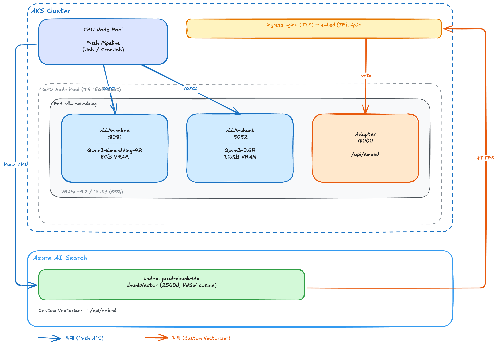

# GPU vLLM RAG 가이드: Push API 대량 적재 + 실시간 하이브리드 검색

**T4 GPU에서 vLLM 임베딩 + PIC 청킹을 통합 서빙하고, Push API로 대량 적재 + Custom Vectorizer로 실시간 하이브리드 검색을 수행하는 구성 가이드**

> 관련 문서: [기본 가이드 (CPU, Indexer)](02_custom_vectorization.md) | [Custom 임베딩 적재 가이드](01_custom_embedding_guide.md) | [청킹 전략 리서치](ref_chunking_strategies_research.md)
>
> 작성일: 2026-05-22

---

## 구성 개요

| 항목 | 내용 |
|------|------|
| GPU | NVIDIA T4 (16GB VRAM) × 1 (Spot) |
| 임베딩 | Qwen3-Embedding-4B (8GB) — vLLM 서빙 |
| 청킹 LLM | Qwen3-0.6B (1.2GB) — vLLM 서빙, PIC 전략 |
| VRAM 사용 | ~9.2GB / 16GB (58%) |
| 적재 방식 | **Push API** (대량), Indexer (증분, 선택적) |
| 쿼리 방식 | **하이브리드 검색** (BM25 + 벡터) + Custom Vectorizer |
| 청킹 전략 | PIC (Pseudo-Instruction Chunking) |
| 전환 방식 | Ingress backend 교체 — AI Search URI 변경 불필요 |

> 모델·엔진·청킹 전략의 선택 근거는 [Appendix A](#appendix-a-모델엔진청킹-선택-근거), 벤치마크 결과는 [Appendix B](#appendix-b-성능-벤치마크) 참고.

---

## 아키텍처

이 구성은 **두 가지 경로**로 동작한다:

1. **적재 (Push API)**: 내 코드가 문서를 읽고 → 청킹 → 임베딩 → AI Search에 직접 Push
2. **검색 (Custom Vectorizer)**: 사용자 쿼리 → AI Search → Custom Vectorizer로 벡터화 → 하이브리드 검색



### 적재 흐름 (Push API)

```
Push Pipeline (Job/CronJob, CPU 노드)
    │
    ├─ 1. 데이터 소스에서 문서 읽기 (Blob SDK / Cosmos SDK / SQL 등)
    ├─ 2. vLLM-chunk (:8082) 호출 → Qwen3-0.6B로 요약 생성 (PIC: 1회/문서)
    ├─ 3. vLLM-embed (:8081) 호출 → 문장별 임베딩, 유사도 change point → 청크 분할
    ├─ 4. vLLM-embed (:8081) 호출 → 각 청크 벡터화
    └─ 5. POST /indexes/{idx}/docs/index → AI Search에 직접 Push
           (요청당 최대 1000건, Semaphore로 동시성 제어)
```

- Push Pipeline이 vLLM API를 직접 호출 → **어댑터 불필요**
- 동시성, 배치 크기, 파이프라이닝 모두 내 코드가 제어
- 인덱서 실행 시간 제한 없음, `degreeOfParallelism` 상한 없음
- 단, Push API 자체 제약은 존재: 요청당 최대 1,000건/16MB, [throttling](https://learn.microsoft.com/en-us/azure/search/search-limits-quotas-capacity#throttling-limits) 적용

### 검색 흐름 (하이브리드 검색)

```
사용자 텍스트 쿼리
    │
    ▼
AI Search
    ├─ 1. Custom Vectorizer → /api/embed → Adapter → vLLM → 쿼리 벡터
    ├─ 2. 벡터 유사도 검색 (HNSW cosine) → top-K 후보
    ├─ 3. BM25 키워드 검색 (ko.microsoft 분석기) → top-K 후보
    ├─ 4. RRF (Reciprocal Rank Fusion)로 후보 병합
    └─ 5. 결과 반환
```

- 쿼리 시점에는 AI Search가 Custom Vectorizer를 호출 → **Adapter 필요** (AI Search 계약 변환)
- 쿼리 1건 벡터화 ~10ms, 병목이 아님

> ⚠️ **Vectorizer는 항상 1건씩 호출한다**: Skill은 `batchSize`로 다수 레코드를 배치 전송하지만, [Vectorizer는 `values` 배열에 항상 1건만 담아 보낸다](https://learn.microsoft.com/en-us/azure/search/vector-search-vectorizer-custom-web-api). 어댑터 코드는 배치를 지원하되 실제 쿼리 시점에는 단건 호출만 받는다.

> ⚠️ **Vectorizer 에러 처리**: Custom Vectorizer 엔드포인트가 에러/경고를 반환해도 [AI Search는 쿼리 응답에 노출하지 않는다](https://learn.microsoft.com/en-us/azure/search/vector-search-vectorizer-custom-web-api). vLLM/Adapter 장애 시 벡터 검색이 조용히 실패하므로, 엔드포인트 헬스체크와 별도 모니터링이 필수다.

---

## 1. 인덱스 생성

Qwen3-Embedding-4B의 출력 차원은 **2560**이다 (BGE-M3는 1024). Custom Vectorizer를 설정하여 **쿼리 시점에 자동으로 텍스트→벡터 변환**이 이루어지도록 한다.

<details>
<summary>인덱스 생성 curl</summary>

```bash
SEARCH_URL="https://ais-aiplay-krc-01.search.windows.net"
KEY="<search-admin-api-key>"

curl -X PUT "$SEARCH_URL/indexes/prod-chunk-idx?api-version=2024-07-01" \
  -H "Content-Type: application/json" -H "api-key: $KEY" \
  -d '{
    "name": "prod-chunk-idx",
    "fields": [
      {"name": "chunk_id", "type": "Edm.String", "key": true, "filterable": true},
      {"name": "parent_id", "type": "Edm.String", "filterable": true},
      {"name": "title", "type": "Edm.String", "searchable": true, "filterable": true},
      {"name": "chunk", "type": "Edm.String", "searchable": true, "analyzer": "ko.microsoft"},
      {"name": "chunkVector", "type": "Collection(Edm.Single)", "searchable": true,
       "dimensions": 2560, "vectorSearchProfile": "qwen3-profile"}
    ],
    "vectorSearch": {
      "algorithms": [{"name": "hnsw-algo", "kind": "hnsw",
        "hnswParameters": {"m": 4, "efConstruction": 400, "efSearch": 500, "metric": "cosine"}}],
      "profiles": [{"name": "qwen3-profile", "algorithm": "hnsw-algo",
        "vectorizer": "qwen3-vectorizer"}],
      "vectorizers": [{
        "name": "qwen3-vectorizer",
        "kind": "customWebApi",
        "customWebApiParameters": {
          "uri": "https://embed.{IP}.nip.io/api/embed",
          "httpMethod": "POST"
        }
      }]
    }
  }'
```

</details>

> - `"analyzer": "ko.microsoft"` — BM25 키워드 검색 시 한국어 형태소 분석 적용
> - `vectorizer: qwen3-vectorizer` — 쿼리 시점에 AI Search가 Adapter를 통해 vLLM에 벡터화 요청
> - Push API로 적재 시에는 Vectorizer가 호출되지 않음 (벡터를 직접 넣으므로)

---

## 2. Push API 파이프라인

인덱서 대신 Push API로 적재한다. 인덱서의 구조적 한계(deg≤10, 순차 배치, 공용 2h/전용 24h 제한)를 우회하여 GPU 활용률을 극대화한다. ([상세 비교](01_custom_embedding_guide.md))

파이프라인 흐름: **데이터 소스 → PIC 청킹(vLLM-chunk) → 임베딩(vLLM-embed) → Push API(AI Search)**

- PIC 청킹: 문서당 vLLM-chunk(:8082)로 요약 1회 → 문장별 임베딩 유사도 → change point 기반 동적 분할
- 임베딩: vLLM-embed(:8081) 호출, Semaphore로 동시성 제어
- 적재: Push API 배치 제한 (요청당 최대 1000건 또는 16MB)
- Fallback: PIC 실패 시 원본 텍스트를 단일 청크로 적재

> Indexer vs Push API의 개념적 비교와 하이브리드 운영 패턴은 [Custom 임베딩 적재 가이드 — 적재 방식](01_custom_embedding_guide.md#2-적재-방식-indexer-vs-push-api) 참고. 실측치(T4 Spot 3대, vLLM 3 replica): 500 docs 적재 147.9s (embed 37.71 c/s). 상세 결과는 [Appendix B](#appendix-b-성능-벤치마크) 참고.

---

## 3. AKS GPU 노드풀

실제 구성: `aks-customvec-krc` 클러스터, `rg-aiplay-krc-01` 리소스 그룹.

<details>
<summary>노드풀 생성 CLI</summary>

```bash
# GPU Spot 노드풀 (T4 × 1)
az aks nodepool add \
  --resource-group rg-aiplay-krc-01 \
  --cluster-name aks-customvec-krc \
  --name gpuspot \
  --node-count 1 \
  --node-vm-size Standard_NC16as_T4_v3 \
  --priority Spot \
  --eviction-policy Delete \
  --spot-max-price -1 \
  --labels workload=gpu-inference \
  --os-type Linux
```

</details>

> Spot VM은 패밀리 쿼터(standardNCadsH100v5Family 등)를 우회하고 `Total Regional Low-priority vCPUs` 쿼터만 소비한다.

### NVIDIA Device Plugin

AKS GPU 노드에 `accelerator: nvidia` 레이블과 Spot taint가 있으므로 DaemonSet에 맞는 toleration이 필요하다:

```bash
kubectl get nodes -l workload=gpu-inference
kubectl describe node <gpu-node> | grep nvidia.com/gpu
# nvidia.com/gpu:  1
```

### GPU Time-Slicing 설정

한 Pod 내 두 컨테이너(vllm-embed, vllm-chunk)가 각각 `nvidia.com/gpu: 1`을 요청하므로, 물리 GPU 1장을 2장으로 광고해야 한다:

```bash
# NVIDIA device plugin ConfigMap (gpu-sharing)
kubectl apply -f - <<'EOF'
apiVersion: v1
kind: ConfigMap
metadata:
  name: nvidia-device-plugin
  namespace: kube-system
data:
  config: |
    version: v1
    sharing:
      timeSlicing:
        resources:
          - name: nvidia.com/gpu
            replicas: 2
EOF

# device plugin DaemonSet 재시작
kubectl rollout restart daemonset -n kube-system nvidia-device-plugin-daemonset
```

재시작 후 노드의 `nvidia.com/gpu` capacity가 2로 변경된다. vLLM이 `--gpu-memory-utilization`으로 VRAM 사용량을 직접 제어하므로 OOM 없이 안전하게 공유된다.

---

## 4. GPU Pod 배포

### VRAM 배분

임베딩 + 청킹 LLM은 같은 T4에 탑재한다.

```
NVIDIA T4 16GB
┌────────────────────────────────────────────────────┐
│  vLLM (Qwen3-Embedding-4B)        8.0 GB          │
│  --gpu-memory-utilization=0.55                     │
├────────────────────────────────────────────────────┤
│  vLLM (Qwen3-0.6B, 청킹 LLM)     1.2 GB          │
│  --gpu-memory-utilization=0.08                     │
├────────────────────────────────────────────────────┤
│  여유 (KV cache, overhead)        6.8 GB          │
└────────────────────────────────────────────────────┘
  Total allocated: ~9.2 GB (58%)
```

> 두 vLLM 인스턴스가 같은 GPU를 공유하려면 `--gpu-memory-utilization` 합이 1.0 미만이어야 한다. `CUDA_VISIBLE_DEVICES=0`으로 동일 설정.

### Deployment + Service

<details>
<summary>Deployment + Service YAML</summary>

```yaml
apiVersion: apps/v1
kind: Deployment
metadata:
  name: vllm-embedding
  labels:
    app: vllm-embedding
spec:
  replicas: 1
  selector:
    matchLabels:
      app: vllm-embedding
  template:
    metadata:
      labels:
        app: vllm-embedding
    spec:
      tolerations:
        - key: kubernetes.azure.com/scalesetpriority
          operator: Equal
          value: spot
          effect: NoSchedule
      nodeSelector:
        workload: gpu-inference
      containers:
        # vLLM — embedding (Qwen3-Embedding-4B, 8GB)
        - name: vllm-embed
          image: vllm/vllm-openai:latest
          args:
            - --model=Qwen/Qwen3-Embedding-4B
            - --task=embed
            - --port=8081
            - --gpu-memory-utilization=0.55
            - --max-num-seqs=64
            - --max-model-len=8192
            - --trust-remote-code
            - --dtype=half
          ports:
            - containerPort: 8081
          env:
            - name: CUDA_VISIBLE_DEVICES
              value: "0"
            - name: HF_HOME
              value: /models
          resources:
            requests:
              cpu: "2"
              memory: "12Gi"
              nvidia.com/gpu: 1
            limits:
              cpu: "4"
              memory: "14Gi"
              nvidia.com/gpu: 1
          volumeMounts:
            - name: model-cache
              mountPath: /models
          readinessProbe:
            httpGet: { path: /health, port: 8081 }
            initialDelaySeconds: 120
            periodSeconds: 10

        # vLLM — chunking LLM (Qwen3-0.6B, 1.2GB, PIC 요약)
        - name: vllm-chunk
          image: vllm/vllm-openai:latest
          args:
            - --model=Qwen/Qwen3-0.6B
            - --port=8082
            - --gpu-memory-utilization=0.08
            - --max-num-seqs=16
            - --max-model-len=4096
            - --trust-remote-code
            - --dtype=half
          ports:
            - containerPort: 8082
          env:
            - name: CUDA_VISIBLE_DEVICES
              value: "0"
            - name: HF_HOME
              value: /models
          resources:
            requests:
              cpu: "1"
              memory: "4Gi"
              nvidia.com/gpu: 1      # time-slicing 필수 (아래 Note 참고)
            limits:
              cpu: "2"
              memory: "8Gi"
              nvidia.com/gpu: 1
          volumeMounts:
            - name: model-cache
              mountPath: /models
          readinessProbe:
            httpGet: { path: /health, port: 8082 }
            initialDelaySeconds: 60
            periodSeconds: 10

        # Adapter — 쿼리 시점 Custom Vectorizer용 (AI Search 계약 변환)
        - name: adapter
          image: acrcustomvec01.azurecr.io/vllm-adapter:latest
          env:
            - name: VLLM_URL
              value: "http://localhost:8081"
            - name: MODEL_NAME
              value: "Qwen/Qwen3-Embedding-4B"
          ports:
            - containerPort: 8000
          resources:
            requests: { cpu: "100m", memory: "128Mi" }
            limits:   { cpu: "500m", memory: "256Mi" }

      volumes:
        - name: model-cache
          emptyDir: { sizeLimit: 20Gi }
---
apiVersion: v1
kind: Service
metadata:
  name: vllm-embedding-svc
spec:
  selector:
    app: vllm-embedding
  ports:
    - name: adapter
      port: 80
      targetPort: 8000
    - name: vllm-embed
      port: 8081
      targetPort: 8081
    - name: vllm-chunk
      port: 8082
      targetPort: 8082
  type: ClusterIP
```

</details>

> - Push Pipeline은 `vllm-embedding-svc:8081` (임베딩)과 `vllm-embedding-svc:8082` (청킹)을 직접 호출 → 어댑터 불필요
> - Custom Vectorizer(쿼리 시점)는 Ingress → Adapter(:8000) → vLLM(:8081) 경로로 AI Search 계약 변환

### Ingress (쿼리 시점 외부 노출)

<details>
<summary>Ingress YAML</summary>

```yaml
apiVersion: networking.k8s.io/v1
kind: Ingress
metadata:
  name: gpu-ingress
  annotations:
    cert-manager.io/cluster-issuer: letsencrypt-prod
    nginx.ingress.kubernetes.io/proxy-body-size: "10m"
    nginx.ingress.kubernetes.io/proxy-read-timeout: "120"
spec:
  ingressClassName: nginx
  tls:
    - hosts:
        - embed.{IP}.nip.io
      secretName: gpu-tls
  rules:
    - host: embed.{IP}.nip.io
      http:
        paths:
          - path: /
            pathType: Prefix
            backend:
              service:
                name: vllm-embedding-svc
                port:
                  number: 80
```

</details>

> Ingress backend만 교체하면 AI Search의 Custom Vectorizer URI 변경 불필요. 기존 `embed.{IP}.nip.io` 그대로 사용.

---

## 5. Adapter: 쿼리 시점 Custom Vectorizer용

Push Pipeline은 vLLM API를 직접 호출하므로 어댑터가 불필요하다. 어댑터는 **쿼리 시점에 AI Search Custom Vectorizer가 호출하는 경로에서만** 필요하다.

<details>
<summary>Adapter 코드 (vllm-adapter/app.py)</summary>

```python
# vllm-adapter/app.py
"""vLLM Adapter — AI Search Custom Vectorizer 계약 변환."""

import os

import httpx
from fastapi import FastAPI
from pydantic import BaseModel

VLLM_URL = os.getenv("VLLM_URL", "http://localhost:8081")
MODEL_NAME = os.getenv("MODEL_NAME", "Qwen/Qwen3-Embedding-4B")

app = FastAPI()
client: httpx.AsyncClient


@app.on_event("startup")
async def startup():
    global client
    client = httpx.AsyncClient(base_url=VLLM_URL, timeout=60.0)


@app.on_event("shutdown")
async def shutdown():
    await client.aclose()


class SkillInput(BaseModel):
    recordId: str
    data: dict


class SkillRequest(BaseModel):
    values: list[SkillInput]


@app.get("/health")
async def health():
    r = await client.get("/health")
    return {"status": "ok", "vllm": r.status_code}


@app.post("/api/embed")
async def embed(req: SkillRequest):
    """AI Search Custom Vectorizer → vLLM /v1/embeddings."""
    texts = [v.data.get("text", "") for v in req.values]
    r = await client.post(
        "/v1/embeddings",
        json={"model": MODEL_NAME, "input": texts},
    )
    r.raise_for_status()
    embeddings = sorted(r.json()["data"], key=lambda x: x["index"])
    return {"values": [
        {
            "recordId": v.recordId,
            "data": {"vector": e["embedding"]},
            "errors": None,
            "warnings": None,
        }
        for v, e in zip(req.values, embeddings)
    ]}
```

</details>

> 이 어댑터는 **JSON 변환만** 수행한다. 모델 로딩 없이 ~50MB 이미지로 동작하며, vLLM과 같은 Pod의 sidecar로 배치한다.

---

## 6. 전환 체크리스트

CPU 기본 구성 → GPU + Push API 전환:

| # | 작업 | 변경 범위 | AI Search 설정 변경 |
|---|------|----------|-------------------|
| 1 | GPU Spot 노드풀 추가 | AKS | 없음 |
| 2 | vLLM-embedding Pod 배포 | K8s | 없음 |
| 3 | vLLM Adapter 이미지 빌드 | ACR | 없음 |
| 4 | Ingress backend 변경 (`vllm-embedding-svc`) | K8s | 없음 |
| 5 | 인덱스 재생성 (dimensions: 1024 → 2560) | AI Search | **변경** |
| 6 | Custom Vectorizer URI 확인 | AI Search | 기존 URI 유지 시 불필요 |
| 7 | Push Pipeline 실행 (대량 적재) | Job/CronJob | 없음 |
| 8 | (선택) 증분용 Indexer 설정 | AI Search | **변경** |

> 임베딩 모델 변경(BGE-M3 1024차원 → Qwen3-4B 2560차원)은 **인덱스 재생성 필수**. 기존 문서를 Push Pipeline으로 재벡터화해야 한다.

### 롤백

Ingress backend를 `bge-m3-embedding`으로 되돌리면 CPU 기반으로 즉시 롤백. 단, 인덱스 차원이 2560이면 1024 차원 인덱스를 별도 유지해야 한다.

---

## 7. 모니터링

### GPU 사용률 확인

<details>
<summary>모니터링 명령어</summary>

```bash
kubectl exec -it deploy/vllm-embedding -c vllm-embed -- nvidia-smi

# vLLM 메트릭 (Prometheus 형식)
kubectl port-forward deploy/vllm-embedding 8081:8081
curl localhost:8081/metrics | grep -E "vllm:(num_requests|gpu_cache)"
```

</details>

### 튜닝 기준

| 지표 | 정상 | 조정 필요 |
|------|------|----------|
| GPU Utilization | 60-80% | >90% → Semaphore 줄임 |
| vLLM queue depth | <10 | >50 → 동시 요청 줄이기 |
| Push API 429 | 0 | 발생 시 → 배치 크기/속도 조절 |
| 쿼리 레이턴시 (p99) | <100ms | >500ms → vLLM replicas 증가 |

---

## ⚠️ 주의사항

| # | 증상 | 원인 | 해결 |
|---|------|------|------|
| 1 | vLLM OOMKilled | `--gpu-memory-utilization` 합이 1.0 초과 | embed(0.55) + chunk(0.08) = 0.63, T4 16GB 기준 |
| 2 | vLLM 시작 ~3분 소요 | 모델 다운로드 + 가중치 로딩 | `readinessProbe.initialDelaySeconds: 120`, emptyDir 캐시 |
| 3 | PIC 요약 품질 낮음 | Qwen3-0.6B가 도메인에 맞지 않음 | 프롬프트 튜닝, 또는 더 큰 모델로 교체 |
| 4 | Push API 429/503 | AI Search 쓰기 부하 초과 | Semaphore 줄이기, 배치 간 딜레이 추가 |
| 5 | 벡터 차원 불일치 | Qwen3-4B는 2560, BGE-M3는 1024 | 인덱스의 `dimensions`를 모델에 맞게 설정 |
| 6 | 두 vLLM이 GPU 경합 | 같은 GPU에서 2개 vLLM 프로세스 | `--gpu-memory-utilization`으로 각각의 최대 할당 제한 |
| 7 | Spot VM 축출 | Azure가 Spot VM을 회수 | Pod 재스케줄링 자동, emptyDir 모델 캐시 재다운로드 필요 |
| 8 | 청킹 실패 시 문서 누락 | PIC LLM 호출 실패 | Pipeline fallback: 원본 텍스트를 단일 청크로 적재 |

---

## 참고

- [Azure AI Search Push API](https://learn.microsoft.com/en-us/azure/search/search-what-is-data-import#pushing-data-to-an-index)
- [Push API — Add/Update/Delete Documents](https://learn.microsoft.com/en-us/rest/api/searchservice/documents)
- [Custom Web API Vectorizer](https://learn.microsoft.com/en-us/azure/search/vector-search-vectorizer-custom-web-api)
- [vLLM Embedding Models](https://docs.vllm.ai/en/latest/models/pooling_models.html)
- [Qwen3-Embedding 모델 라인업](https://huggingface.co/collections/Qwen/qwen3-embedding-67e5253e22bb421b4fa0ed10)
- [PIC — Pseudo-Instruction Chunking](https://aclanthology.org/2025.findings-acl.422/) (ACL-Findings 2025)
- [기본 가이드 (CPU, Indexer)](02_custom_vectorization.md)
- [Custom 임베딩 적재 가이드](01_custom_embedding_guide.md)
- [청킹 전략 리서치](ref_chunking_strategies_research.md)

---

## Appendix A. 모델·엔진·청킹 선택 근거

### 임베딩: vLLM + Qwen3-Embedding-4B

| 대안 | 제외 이유 |
|------|----------|
| TEI + Qwen3-Embedding-4B | 실측 vLLM 대비 21% 느림 (29.65 vs 37.71 c/s). T4에서 Flash Attention OFF, candle의 Qwen3 최적화 부족 |
| vLLM + BGE-M3 | 0.57B 모델에서 PyTorch overhead가 크다 (23.85 c/s) |
| TEI + BGE-M3 | **51.11 c/s로 가장 빠르지만**, MTEB 성능이 Qwen3-4B 대비 낮아 품질·속도 트레이드오프 |
| vLLM + Qwen3-Embedding-8B | 8B(16GB)이면 T4 VRAM 전체를 소비, 청킹 LLM 공간 없음 |
| sentence-transformers | 서버 레벨 dynamic batching 미지원, Python 단일 프로세스 동시성 제한 ([상세](01_custom_embedding_guide.md)) |

vLLM은 PyTorch 기반이라 **Qwen3 아키텍처를 HuggingFace 가중치에서 직접 로딩** 가능하다. TEI(Rust/candle)는 모델별 커널을 별도 구현해야 하므로 신규 아키텍처 지원이 늦다. 단, BERT 계열(BGE-M3)에서는 TEI가 2.1배 빠르다 ([Appendix B](#appendix-b-성능-벤치마크) 참고).

### 청킹: PIC (Pseudo-Instruction Chunking)

[청킹 전략 리서치](ref_chunking_strategies_research.md)에서 분석한 7가지 전략 중 PIC를 선택한 이유:

| 전략 | LLM 호출 | GPU 적합도 | 검색 품질 | 인덱싱 속도 | 선택 |
|------|---------|-----------|----------|-----------|------|
| 고정 길이 분할 | 없음 | ★★★ | 기준선 | 빠름 | |
| Semantic Chunking | 없음 | ★★★ | Recall 91.3% | 빠름 | △ |
| **PIC** | **1회/문서** | **★★★** | **Hits@5 +3.9** | **빠름** | **✅** |
| Contextual Retrieval | N회/청크 | ★★☆ | -67% 실패율 | 보통 | 선택적 |
| Late Chunking | 없음 | ★★☆ | nDCG +3% | 빠름 | |
| Dense X | N회/문서 | ★★☆ | 높음 | 느림 | |
| LumberChunker | 반복/문서 | ★☆☆ | DCG +7.4% | 매우 느림 | |

- **문서당 LLM 1회**로 비용 효율적 (LumberChunker의 반복 호출 vs PIC의 요약 1회)
- LLM(Qwen3-0.6B, 1.2GB)이 GPU에 상주하므로 **외부 API 호출 제로**
- 임베딩 모델이 같은 Pod에 있어 **문장별 유사도 계산에 네트워크 홉 없음**

---

## Appendix B. 성능 벤치마크

> **테스트 환경**: AKS (`aks-customvec-krc`, koreacentral), GPU 노드풀 Standard_NC16as_T4_v3 Spot × 3, AI Search Standard tier. 500개 Azure Docs .md 파일 (평균 ~8KB). Push API는 bench_runner의 section-based chunking, Indexer는 AI Search SplitSkill(pages, 2000자)을 사용하여 **chunk 수가 다를 수 있다**.
>
> **벤치마크 조건**: vLLM `--gpu-memory-utilization=0.95 --max-num-seqs=256 --max-model-len=2048`, GPU당 단독 실행. TEI `turing-latest` (Candle backend).

### Push API vs Indexer

| 방식 | Embedding Backend | chunks | Embed c/s | 비고 |
|------|------------------|--------|-----------|------|
| **Push API** | vLLM (3×T4) | 4,131 | **37.71** | 동시성·배치 직접 제어, GPU 활용률 높음 |
| Indexer | vLLM Custom WebApiSkill (3×T4) | 2,739 | 18.92 | deg≤10, 순차 배치로 GPU 30~40%만 활용 |

- Push API가 Indexer 대비 **2배** 빠르다. Indexer의 `degreeOfParallelism` 상한(10)이 병목.
- Push API는 인덱서 실행 시간 제한(공용 2h / 전용 24h)이 없으므로 대량 적재에 적합하다. 단, 요청당 1,000건/16MB 배치 제한과 throttling은 적용된다.

### 서빙 엔진: vLLM vs TEI

이 가이드는 vLLM을 기본 서빙 엔진으로 선택했지만, **모델 아키텍처에 따라 TEI가 더 빠를 수 있다**.

| 엔진 | 모델 | 아키텍처 | Embed c/s | 비고 |
|------|------|---------|-----------|------|
| **TEI** | **BGE-M3** | XLM-RoBERTa (BERT 계열) | **51.11** | Candle Turing 커널 최적화 |
| vLLM | Qwen3-4B | Qwen3 | 37.71 | chunked prefill + PagedAttention |
| TEI | Qwen3-4B | Qwen3 | 29.65 | 네이티브 커널 없음, vLLM 대비 21% 느림 |
| vLLM | BGE-M3 | XLM-RoBERTa (BERT 계열) | 23.85 | PyTorch overhead, TEI 대비 2.1배 느림 |

**왜 이런 차이가 나는가:**

- **TEI**(Rust/Candle)는 BERT·XLM-RoBERTa 등 전통 아키텍처에 대해 **모델별 최적화 커널**을 갖고 있다. BGE-M3에서 vLLM 대비 2.1배 빠른 이유다.
- **vLLM**(PyTorch)은 HuggingFace 가중치를 직접 로딩하므로 **신규 아키텍처(Qwen3 등)를 즉시 지원**한다. TEI는 커널 구현이 추가되어야 해서 지원이 늦고, Qwen3에서 21% 느리다.
- 즉, **BERT 계열 모델(BGE-M3, E5 등) → TEI**, **신규 아키텍처(Qwen3, Gemma 등) → vLLM**이 최적 조합이다.

> **이 가이드에서 vLLM + Qwen3-4B를 선택한 이유**: TEI + BGE-M3이 1.35배 빠르지만, Qwen3-4B는 MTEB 다국어 점수에서 우위(+4.77)이고 Instruction prefix·동적 차원(256~8192)·32K 컨텍스트를 지원한다. 속도 우선 시나리오(대규모 일괄 인덱싱)에서는 TEI + BGE-M3를 권장한다.
