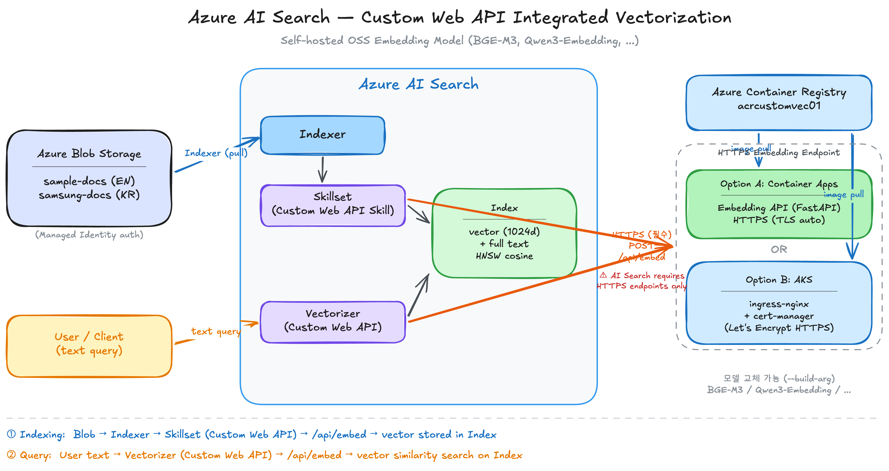

# Azure AI Search Custom Web API를 활용한 외부 임베딩 모델 통합 벡터화 가이드

**Azure OpenAI 없이, 자체 호스팅한 오픈소스 임베딩 모델을 Custom Web API Skill/Vectorizer로 AI Search Integrated Vectorization에 연동하는 방법**

---

## 📌 핵심 요약

| 항목 | 내용 |
|------|------|
| 목적 | Azure OpenAI 없이 AI Search Integrated Vectorization 구현 |
| 검증 모델 | [BAAI/bge-m3](https://huggingface.co/BAAI/bge-m3), [Qwen/Qwen3-Embedding-0.6B](https://huggingface.co/Qwen/Qwen3-Embedding-0.6B) |
| 호스팅 | FastAPI 서버를 Container Apps (TLS 자동) 또는 AKS + cert-manager (Let's Encrypt)로 HTTPS 노출 |
| 핵심 검증 | Custom Web API Skill(인덱싱) + Custom Web API Vectorizer(쿼리) 동작 확인 |
| 모델 비교 | [BGE-M3 vs Qwen3-Embedding-0.6B](bge_m3_vs_qwen3_comparison.md) |
| 인덱서 결과 | 5건 처리 / 0건 실패 |

---

## 🔍 배경 및 문제 정의

Azure AI Search의 [Integrated Vectorization](https://learn.microsoft.com/en-us/azure/search/vector-search-integrated-vectorization)은 인덱싱 시점과 쿼리 시점에 자동으로 텍스트를 벡터로 변환하는 기능이다. 공식 문서에서 지원하는 벡터라이저는 Azure OpenAI, AI Foundry Model Catalog, AML 등이 있지만, **Custom Web API** 옵션을 활용하면 어떤 임베딩 모델이든 연동 가능하다.

이 가이드는 다음 상황에서의 검증을 목적으로 한다:

- Azure OpenAI 리소스가 없거나 사용할 수 없는 구독 환경
- AI Foundry Marketplace 구매가 정책으로 차단된 환경 (MCAPS 등)
- 오픈소스 모델을 직접 호스팅하여 비용을 줄이고 싶은 경우
- 특정 언어/도메인에 최적화된 임베딩 모델을 사용하고 싶은 경우

---

## 🔍 아키텍처



### 데이터 흐름

**인덱싱 시점 (Indexer → Skillset → Index)**

```
Azure Blob Storage    →    Indexer    →    Custom Web API Skill    →    BGE-M3 /api/embed    →    벡터 + 텍스트 인덱스 저장
(sample-docs)              (pull)          (bge-m3-skillset)            (HTTPS)                    (sample-vector-idx)
```

**쿼리 시점 (Vectorizer)**

```
사용자 텍스트 쿼리    →    Custom Web API Vectorizer    →    BGE-M3 /api/embed    →    벡터 유사도 검색
                           (bge-m3-vectorizer)               (HTTPS)                    (HNSW cosine)
```

### 구성 요소

| 구성 요소 | 리소스 | 세부 사항 |
|-----------|--------|-----------|
| AI Search | `ais-aiplay-krc-01` (Standard) | 인덱스, 스킬셋, 인덱서, 벡터라이저 |
| 임베딩 API | FastAPI (`embedding-api/app.py`) | Custom Web API Skill 계약 준수 |
| HTTPS 엔드포인트 (A) | Container Apps `ca-bge-m3-embed` | TLS 자동 적용, 설정 최소 |
| HTTPS 엔드포인트 (B) | AKS Ingress `embed.{IP}.nip.io` | ingress-nginx + cert-manager + Let's Encrypt |
| 컨테이너 레지스트리 | `acrcustomvec01` (Basic) | Docker 이미지 저장소 |
| 스토리지 | `sacustomvecsrc01` | Blob 컨테이너 `sample-docs` (샘플 문서) |
| Region | koreacentral | 모든 리소스 동일 리전 |

---

## 프로젝트 구조

```
aisearch/custom_vectorization/
├── custom_vectorization.md         # 본 문서
├── bge_m3_vs_qwen3_comparison.md   # BGE-M3 vs Qwen3 검색 품질 비교
├── architecture.excalidraw         # 아키텍처 다이어그램 (소스)
├── embedding-api/
│   ├── app.py                     # FastAPI 서버 (Custom Web API Skill 계약 구현)
│   ├── Dockerfile                 # 임베딩 모델을 빌드 타임에 다운로드
│   └── requirements.txt           # Python 의존성
├── k8s/
│   ├── deployment.yaml            # AKS Deployment + Service (ClusterIP) 매니페스트
│   ├── cluster-issuer.yaml        # Let's Encrypt ClusterIssuer
│   └── ingress.yaml               # Ingress + TLS 설정
└── images/
    └── architecture.png           # 아키텍처 다이어그램 (PNG)
```

---

## ✅ 구성 절차

### 1. 임베딩 API 이미지 빌드 및 푸시

ACR Tasks를 사용하여 로컬 Docker 없이 클라우드에서 빌드한다. BGE-M3 모델 가중치(~2.3GB)를 빌드 타임에 다운로드하여 Cold start를 방지한다.

```bash
az acr build --registry acrcustomvec01 \
  --image bge-m3-embedding:latest \
  --file embedding-api/Dockerfile \
  embedding-api/
```

### 2. HTTPS 엔드포인트 구성

AI Search의 [Custom Web API Skill](https://learn.microsoft.com/en-us/azure/search/cognitive-search-custom-skill-web-api#skill-parameters)과 [Custom Web API Vectorizer](https://learn.microsoft.com/en-us/azure/search/vector-search-vectorizer-custom-web-api#vectorizer-parameters) 모두 **HTTPS URI만 허용**한다 (`"Only the https URI scheme is allowed"`). HTTP 엔드포인트를 지정하면 스킬셋/인덱서 실행 시 오류가 발생한다.

- **Container Apps** — 배포 시 TLS가 자동 적용되므로 별도 설정 불필요
- **AKS** — 기본은 HTTP만 노출하므로 **cert-manager + Let's Encrypt**로 TLS 인증서를 자동 발급해야 한다

두 가지 방식 중 선택하여 구성한다.

#### Option A. Container Apps (설정 최소, TLS 자동)

Container Apps는 이미지를 배포하면 HTTPS가 자동 적용된다.

```bash
# Container Apps 환경 생성
az containerapp env create --name cae-customvec \
  --resource-group rg-aiplay-krc-01 --location koreacentral

# 임베딩 API 배포 (외부 HTTPS ingress)
az containerapp create --name ca-bge-m3-embed \
  --resource-group rg-aiplay-krc-01 --environment cae-customvec \
  --image acrcustomvec01.azurecr.io/bge-m3-embedding:latest \
  --registry-server acrcustomvec01.azurecr.io \
  --target-port 8000 --ingress external \
  --cpu 2 --memory 4Gi --min-replicas 1 --max-replicas 1
```

```bash
# FQDN 확인
az containerapp show --name ca-bge-m3-embed \
  --resource-group rg-aiplay-krc-01 \
  --query properties.configuration.ingress.fqdn -o tsv
# ca-bge-m3-embed.icycliff-31a3d588.koreacentral.azurecontainerapps.io
```

#### Option B. AKS + ingress-nginx + cert-manager (Let's Encrypt)

AKS를 이미 운영 중이면 Container Apps 없이 AKS에서 직접 HTTPS를 제공할 수 있다.

```bash
# 앱 배포 (Service는 ClusterIP — Ingress가 외부 트래픽 처리)
kubectl apply -f k8s/deployment.yaml
```

```bash
# ingress-nginx 설치
helm install ingress-nginx ingress-nginx/ingress-nginx \
  --namespace ingress-nginx --create-namespace \
  --set controller.replicaCount=1 \
  --set controller.service.annotations."service\.beta\.kubernetes\.io/azure-load-balancer-health-probe-request-path"="/healthz" \
  --wait
```

```bash
# cert-manager 설치
helm install cert-manager jetstack/cert-manager \
  --namespace cert-manager --create-namespace \
  --set crds.enabled=true --wait
```

```bash
# Let's Encrypt ClusterIssuer + Ingress 적용
kubectl apply -f k8s/cluster-issuer.yaml
```

Ingress LoadBalancer IP를 확인하여 nip.io 도메인을 구성한다. nip.io는 IP 주소를 자동으로 DNS로 매핑하므로 별도 도메인 구매가 불필요하다.

```bash
# Ingress LoadBalancer IP 확인
INGRESS_IP=$(kubectl get svc -n ingress-nginx ingress-nginx-controller \
  -o jsonpath='{.status.loadBalancer.ingress[0].ip}')
echo "Domain: embed.${INGRESS_IP}.nip.io"
# embed.20.249.162.81.nip.io
```

`k8s/ingress.yaml`의 host를 위 도메인으로 설정한 뒤 적용한다.

```bash
kubectl apply -f k8s/ingress.yaml
```

cert-manager가 Let's Encrypt HTTP-01 챌린지를 자동 처리하여 인증서를 발급한다.

```bash
# 인증서 발급 확인 (READY: True)
kubectl get certificate
# NAME         READY   SECRET       AGE
# bge-m3-tls   True    bge-m3-tls   47s
```

#### HTTPS 엔드포인트 확인

선택한 방식에 따라 엔드포인트가 달라진다.

```bash
# Option A (Container Apps)
curl -s https://ca-bge-m3-embed.icycliff-31a3d588.koreacentral.azurecontainerapps.io/health

# Option B (AKS + Let's Encrypt)
curl -s https://embed.20.249.162.81.nip.io/health
# {"status":"ok","model":"BAAI/bge-m3"}
```

#### 비교

| | Container Apps | AKS + cert-manager |
|---|---|---|
| HTTPS | 자동 (TLS 설정 불필요) | ingress-nginx + cert-manager + Let's Encrypt |
| 추가 비용 | Container Apps 과금 | AKS 이미 있으면 추가 비용 없음 |
| 셋업 복잡도 | 낮음 (~5분) | 높음 (Helm + DNS + 인증서 확인) |
| 인증서 관리 | 자동 | cert-manager 자동 갱신 (90일) |

### 3. AI Search 데이터 소스 생성

이후 단계에서 사용할 환경변수를 먼저 설정한다.

```bash
SEARCH_URL="https://<search-service-name>.search.windows.net"
KEY="<search-admin-api-key>"
```

스토리지에 Shared Key Access가 Azure Policy로 차단된 경우, `ResourceId` 형식의 연결 문자열로 Managed Identity 인증을 사용한다.

```bash
# AI Search MI에 Storage Blob Data Reader 역할 부여
az role assignment create \
  --role "Storage Blob Data Reader" \
  --assignee-object-id $(az search service show --name ais-aiplay-krc-01 \
    --resource-group rg-aiplay-krc-01 --query identity.principalId -o tsv) \
  --assignee-principal-type ServicePrincipal \
  --scope $(az storage account show --name sacustomvecsrc01 \
    --resource-group rg-aiplay-krc-01 --query id -o tsv)
```

```bash
# 데이터 소스 생성 (Managed Identity 인증)
curl -X POST "$SEARCH_URL/datasources?api-version=2024-07-01" \
  -H "Content-Type: application/json" -H "api-key: $KEY" \
  -d '{
    "name": "sample-docs-ds",
    "type": "azureblob",
    "credentials": {
      "connectionString": "ResourceId=/subscriptions/{sub}/resourceGroups/rg-aiplay-krc-01/providers/Microsoft.Storage/storageAccounts/sacustomvecsrc01/;"
    },
    "container": {"name": "sample-docs"}
  }'
```

### 4. AI Search 인덱스 생성 (벡터 필드 + Custom Vectorizer)

인덱스에 `contentVector` 벡터 필드(1024차원, HNSW cosine)를 정의하고, Custom Web API Vectorizer를 등록하여 **쿼리 시점에 텍스트 → 벡터 자동 변환**이 이루어지도록 설정한다.

```bash
# Option A: Container Apps FQDN
# EMBED_URL="https://ca-bge-m3-embed.icycliff-31a3d588.koreacentral.azurecontainerapps.io"
# Option B: AKS Ingress
EMBED_URL="https://embed.20.249.162.81.nip.io"

curl -X PUT "$SEARCH_URL/indexes/sample-vector-idx?api-version=2024-07-01" \
  -H "Content-Type: application/json" -H "api-key: $KEY" \
  -d '{
    "name": "sample-vector-idx",
    "fields": [
      {"name": "id", "type": "Edm.String", "key": true, "filterable": true},
      {"name": "content", "type": "Edm.String", "searchable": true},
      {"name": "title", "type": "Edm.String", "searchable": true, "filterable": true},
      {"name": "contentVector", "type": "Collection(Edm.Single)", "searchable": true,
       "dimensions": 1024, "vectorSearchProfile": "bge-m3-profile"}
    ],
    "vectorSearch": {
      "algorithms": [{"name": "hnsw-algo", "kind": "hnsw",
        "hnswParameters": {"m": 4, "efConstruction": 400, "efSearch": 500, "metric": "cosine"}}],
      "profiles": [{"name": "bge-m3-profile", "algorithm": "hnsw-algo",
        "vectorizer": "bge-m3-vectorizer"}],
      "vectorizers": [{
        "name": "bge-m3-vectorizer",
        "kind": "customWebApi",
        "customWebApiParameters": {
          "uri": "'$EMBED_URL'/api/embed",
          "httpMethod": "POST"
        }
      }]
    }
  }'
```

### 5. 스킬셋 생성 (인덱싱 시점 벡터화)

Custom Web API Skill을 통해 인덱서가 문서를 처리할 때 BGE-M3 API를 호출하여 벡터를 생성한다.

```bash
curl -X PUT "$SEARCH_URL/skillsets/bge-m3-skillset?api-version=2024-07-01" \
  -H "Content-Type: application/json" -H "api-key: $KEY" \
  -d '{
    "name": "bge-m3-skillset",
    "skills": [{
      "@odata.type": "#Microsoft.Skills.Custom.WebApiSkill",
      "name": "bge-m3-embedding-skill",
      "uri": "'$EMBED_URL'/api/embed",
      "httpMethod": "POST",
      "timeout": "PT60S",
      "batchSize": 10,
      "context": "/document",
      "inputs": [{"name": "text", "source": "/document/content"}],
      "outputs": [{"name": "vector", "targetName": "contentVector"}]
    }]
  }'
```

### 6. 인덱서 생성 및 실행

데이터 소스 → 스킬셋 → 인덱스를 연결하는 인덱서를 생성한다. 생성 즉시 자동 실행된다.

```bash
curl -X PUT "$SEARCH_URL/indexers/sample-vector-indexer?api-version=2024-07-01" \
  -H "Content-Type: application/json" -H "api-key: $KEY" \
  -d '{
    "name": "sample-vector-indexer",
    "dataSourceName": "sample-docs-ds",
    "targetIndexName": "sample-vector-idx",
    "skillsetName": "bge-m3-skillset",
    "fieldMappings": [
      {"sourceFieldName": "metadata_storage_path", "targetFieldName": "id",
       "mappingFunction": {"name": "base64Encode"}},
      {"sourceFieldName": "metadata_storage_name", "targetFieldName": "title"}
    ],
    "outputFieldMappings": [
      {"sourceFieldName": "/document/contentVector", "targetFieldName": "contentVector"}
    ]
  }'
```

---

## 🧪 검증 결과

### 인덱서 실행 결과

```
Status:          success
Items processed: 5
Items failed:    0
```

5건의 샘플 문서(Azure 서비스 설명)가 Custom Web API Skill을 통해 BGE-M3 임베딩과 함께 인덱싱 완료.

### 벡터 검색 — "How does Azure handle container orchestration?"

쿼리 시점에 텍스트가 Custom Web API Vectorizer를 통해 자동으로 벡터로 변환되어 유사도 검색이 수행된다.

```bash
curl -X POST "$SEARCH_URL/indexes/sample-vector-idx/docs/search?api-version=2024-07-01" \
  -H "Content-Type: application/json" -H "api-key: $KEY" \
  -d '{
    "count": true, "select": "title, content",
    "vectorQueries": [{
      "kind": "text",
      "text": "How does Azure handle container orchestration?",
      "fields": "contentVector", "k": 3
    }]
  }'
```

| 순위 | Score | 문서 | 판단 |
|------|-------|------|------|
| 1 | 0.7421 | azure-kubernetes.txt | ✅ 컨테이너 오케스트레이션의 핵심 서비스 |
| 2 | 0.7404 | azure-container-apps.txt | ✅ 컨테이너 관련 서비스 |
| 3 | 0.7031 | azure-functions.txt | 서버리스이나 컨테이너와 관련성 낮음 |

AKS와 Container Apps가 "container orchestration" 쿼리에 대해 최상위로 정확하게 랭킹되었다.

### 하이브리드 검색 — "serverless event-driven"

키워드 검색과 벡터 검색을 결합한 하이브리드 검색 결과:

```bash
curl -X POST "$SEARCH_URL/indexes/sample-vector-idx/docs/search?api-version=2024-07-01" \
  -H "Content-Type: application/json" -H "api-key: $KEY" \
  -d '{
    "count": true, "search": "serverless event-driven",
    "select": "title, content",
    "vectorQueries": [{
      "kind": "text",
      "text": "serverless event-driven compute",
      "fields": "contentVector", "k": 3
    }]
  }'
```

| 순위 | Score | 문서 | 판단 |
|------|-------|------|------|
| 1 | 0.0333 | azure-functions.txt | ✅ 서버리스 이벤트 드리븐 서비스 |
| 2 | 0.0328 | azure-container-apps.txt | 서버리스 컨테이너 |
| 3 | 0.0161 | azure-cosmos-db.txt | 관련성 낮음 |

Azure Functions가 "serverless event-driven" 쿼리에 1위로 정확히 랭킹되었다.

---

## Custom Web API Skill 계약

`/api/embed` 엔드포인트는 [Azure AI Search Custom Web API Skill 계약](https://learn.microsoft.com/en-us/azure/search/cognitive-search-custom-skill-web-api)을 구현한다. AI Search가 인덱싱/쿼리 시 이 형식으로 호출하고 응답을 기대한다.

**요청:**

```json
{
  "values": [
    {
      "recordId": "1",
      "data": { "text": "Azure Kubernetes Service manages clusters..." }
    }
  ]
}
```

**응답:**

```json
{
  "values": [
    {
      "recordId": "1",
      "data": { "vector": [0.021, -0.013, ...] },
      "errors": null,
      "warnings": null
    }
  ]
}
```

> 📌 `recordId`는 AI Search가 배치 내 각 문서를 추적하는 데 사용한다. 요청의 `recordId`를 응답에 그대로 반환해야 한다.

---

## ⚠️ 주의사항 및 흔한 함정

| # | 증상 | 원인 | 해결 |
|---|------|------|------|
| 1 | 인덱서 생성 시 `Credentials provided in the connection string are invalid` | 스토리지의 `allowSharedKeyAccess: false` (Azure Policy) | `ResourceId=/.../storageAccounts/{name}/;` 형식으로 Managed Identity 인증 사용 |
| 2 | 인덱스 생성 시 `httpHeaders contains headers that cannot be specified` | Vectorizer의 `httpHeaders`에 `Content-Type` 포함 | `httpHeaders` 제거 — AI Search가 자동으로 설정함 |
| 3 | Custom Skill URI가 `http://`면 `Only the https URI scheme is allowed` | AI Search는 Custom Web API Skill/Vectorizer에 **HTTPS만 허용** | Container Apps (TLS 자동) 또는 AKS + cert-manager (Let's Encrypt) 사용 |
| 4 | Container Apps에서 Health probe 실패 후 재시작 반복 | BGE-M3 모델 로딩에 ~7초 소요 | `min-replicas: 1`로 설정하여 항상 Warm 상태 유지 |
| 5 | AKS Ingress에서 NSG가 443 포트를 차단 | MC_ 리소스 그룹의 NSG에 인바운드 규칙이 자동 생성되지 않음 | MC_ 리소스 그룹의 NSG에서 443 포트 인바운드 허용 확인 |

---

## AI Search 오브젝트 구성

| 오브젝트 | 타입 | 설명 |
|----------|------|------|
| `sample-vector-idx` | Index | `id`(key), `title`, `content`, `contentVector`(1024차원 HNSW cosine) |
| `bge-m3-vectorizer` | Vectorizer | 쿼리 시점 텍스트 → 벡터 변환 (Custom Web API) |
| `bge-m3-skillset` | Skillset | 인덱싱 시점 Custom Web API Skill로 벡터 생성 |
| `sample-docs-ds` | Data Source | Azure Blob + Managed Identity 인증 (ResourceId) |
| `sample-vector-indexer` | Indexer | Blob → Skillset → Index 파이프라인 |

---

## 임베딩 API 상세

`embedding-api/app.py`는 단일 파일 FastAPI 애플리케이션이다.

| 항목 | 값 |
|------|-----|
| 모델 | `EMBEDDING_MODEL` 환경변수로 지정 (기본값: `BAAI/bge-m3`) |
| 벡터 차원 | 모델 의존 (BGE-M3: 1024, Qwen3-Embedding-0.6B: 1024) |
| 정규화 | L2 normalized |
| 로드 시간 | ~7초 (CPU, BGE-M3 기준) |
| 엔드포인트 | `GET /health`, `POST /api/embed` |
| 배치 처리 | AI Search `batchSize` 설정에 따라 다수 레코드 동시 처리 |

### Dockerfile

`EMBEDDING_MODEL` build arg로 모델을 지정한다. 빌드 타임에 모델 가중치를 다운로드하여 Cold start를 방지한다.

```dockerfile
FROM python:3.11-slim

ARG EMBEDDING_MODEL=BAAI/bge-m3
ENV EMBEDDING_MODEL=${EMBEDDING_MODEL}

WORKDIR /app
COPY requirements.txt .
RUN pip install --no-cache-dir -r requirements.txt
# 빌드 타임에 모델 다운로드 → Cold start 방지
RUN python -c "from sentence_transformers import SentenceTransformer; SentenceTransformer('${EMBEDDING_MODEL}', trust_remote_code=True)"
COPY app.py .
EXPOSE 8000
CMD ["uvicorn", "app:app", "--host", "0.0.0.0", "--port", "8000"]
```

다른 모델로 빌드하려면 `--build-arg`를 사용한다:

```bash
az acr build --registry acrcustomvec01 \
  --image qwen3-embedding:latest \
  --build-arg EMBEDDING_MODEL=Qwen/Qwen3-Embedding-0.6B \
  --file embedding-api/Dockerfile embedding-api/
```

> 💡 Air-gapped 환경에서도 이 이미지를 사용하면 모델 다운로드 없이 서빙 가능하다.

---

## 📋 관련 문서

- [BGE-M3 vs Qwen3-Embedding-0.6B 비교](bge_m3_vs_qwen3_comparison.md) — 동일 파이프라인에서의 검색 품질 비교 결과

## 📋 참고

- [Azure AI Search Integrated Vectorization](https://learn.microsoft.com/en-us/azure/search/vector-search-integrated-vectorization)
- [Custom Web API Skill 계약](https://learn.microsoft.com/en-us/azure/search/cognitive-search-custom-skill-web-api)
- [Custom Web API Vectorizer](https://learn.microsoft.com/en-us/azure/search/vector-search-vectorizer-custom-web-api)
- [BAAI/bge-m3 모델](https://huggingface.co/BAAI/bge-m3)
- [Qwen/Qwen3-Embedding-0.6B 모델](https://huggingface.co/Qwen/Qwen3-Embedding-0.6B)
- [AI Search Managed Identity로 Blob 연결](https://learn.microsoft.com/en-us/azure/search/search-howto-managed-identities-storage)
