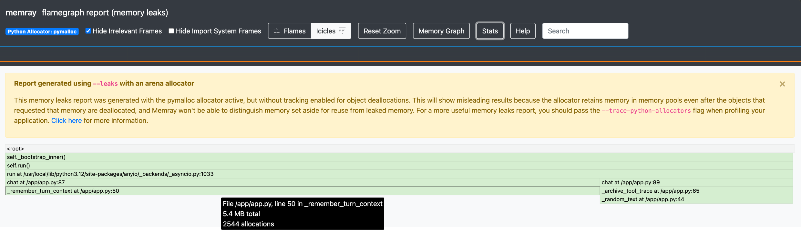

# AKS Python Pod 메모리 누수 — `kubectl debug` + Memray attach

앱 이미지를 건드리지 않고, 재시작 없이, **memray가 설치된 디버그 이미지를
`kubectl debug`(ephemeral container)로 붙여** 누수 지점을 함수/라인 단위로 특정.

- 대상: memray ✗ / gdb ✗ / `SYS_PTRACE` ✗ 인 깨끗한 앱 파드
- 도구: [Memray](https://bloomberg.github.io/memray/) 1.19.3, `kubectl debug --target --profile=sysadmin`
- 흐름: **attach → 타깃 rootfs에 memray 주입 → `memray attach` 60s → `flamegraph --leaks`**
- 예제/재현 환경: [Appendix](#appendix) (AKS 실측 검증 완료)

## 실측 요약

| 항목 | 결과 |
|---|---|
| `kubectl debug` | 디버그 이미지를 ephemeral container로 attach — 파드 스펙 변경 없음, 특수 권한은 임시 컨테이너에만 |
| `memray attach` | 타깃 PID 1에 60s attach — **무중단** (RESTARTS 0, 트래픽 계속 처리) |
| 누수 특정 | 미해제 15.0MB 중 `_remember_turn_context` **74.1%** + `_archive_tool_trace` **24.1%** = **98.2%** |
| 오탐 | 정상 임시 할당(`_synthesize_answer`)은 `--leaks` 리포트 미등장 |

---

## 사전 준비: 디버그 이미지

gdb + procps + memray를 담은 이미지를 레지스트리에 상비 ([debug/Dockerfile](./memray-leak-profiling/debug/Dockerfile)):

```dockerfile
# ⚠️ 베이스는 앱과 동일 Python 버전 — memray attach 는 "타깃 프로세스 안"에서
#    import memray 를 실행하므로 타깃 파이썬 ABI 와 일치해야 함
FROM python:3.12-slim
RUN apt-get update && apt-get install -y --no-install-recommends gdb procps ...
RUN pip install --no-cache-dir "memray>=1.15"
CMD ["sleep", "infinity"]
```

앱 파드 요건:

- 특수 권한 불필요 — `SYS_PTRACE`는 `--profile=sysadmin`이 **임시 컨테이너에만** 부여
- 앱 이미지에 프로파일링 도구 불필요 — 평시 최소 권한/최소 이미지 유지
- 단일 프로세스(uvicorn)면 컨테이너 PID 1 = attach 대상. gunicorn 멀티워커는 `ps -eo pid,comm,rss`로 워커 PID 선택

## Step 1: 디버그 컨테이너 attach

서비스가 부하를 받는 중 그대로 실행:

```bash
POD=$(kubectl get pod -n memray-demo -l app=leaky-agent -o jsonpath='{.items[0].metadata.name}')

kubectl debug -n memray-demo $POD \
  --image=<ACR>.azurecr.io/memray-debug:v1 \
  --target=leaky-agent \
  --profile=sysadmin \
  --container=memray-debug \
  -- sleep infinity
```

| 옵션 | 역할 |
|---|---|
| `--target=<앱 컨테이너>` | PID 네임스페이스 공유 — 디버그 컨테이너에서 앱 프로세스 가시화 |
| `--profile=sysadmin` | 디버그 컨테이너 privileged → gdb 주입용 ptrace 권한. 앱 컨테이너 스펙 불변 |
| `-- sleep infinity` | 컨테이너 유지 → 이후 `kubectl exec -c memray-debug`로 작업 |

```bash
# 타깃 프로세스 확인 → uvicorn 이 PID 1
kubectl exec -n memray-demo $POD -c memray-debug -- ps -eo pid,comm,args
#   PID COMMAND   COMMAND
#     1 uvicorn   /usr/local/bin/python3.12 /usr/local/bin/uvicorn app:app ...
#    24 sleep     sleep infinity
```

## Step 2: ⚠️ memray 패키지를 타깃 rootfs에 주입

바로 `memray attach 1` 실행 시 **실패** (실측):

```
$10 = "/usr/local/lib/python3.12/site-packages/memray/_inject.abi3.so:
       cannot open shared object file: No such file or directory"
```

원인: `memray attach` = gdb로 **타깃 프로세스 안에서** `import memray` 실행.
→ memray 패키지가 **타깃 컨테이너 파일시스템**에 있어야 함.
PID ns 공유 상태에서 `/proc/1/root/` = 타깃 rootfs:

```bash
# memray + 의존성(rich, jinja2, textual, memray.libs 등)을 타깃 site-packages 로 보충 복사
# -n(no-clobber): 타깃 앱의 기존 패키지는 절대 덮어쓰지 않음
kubectl exec -n memray-demo $POD -c memray-debug -- sh -c \
  'cp -rn /usr/local/lib/python3.12/site-packages/* \
          /proc/1/root/usr/local/lib/python3.12/site-packages/ 2>/dev/null; true'

# 타깃 컨테이너에서 import 검증
kubectl exec -n memray-demo $POD -c leaky-agent -- python -c "import memray; print(memray.__version__)"
# 1.19.3
```

실측 주의점:

- `memray/`만 복사하면 부족 — `memray.libs/`(번들 .so) + `rich` 등 **의존성 포함** site-packages 전체를 `-n` 복사
- **복사가 attach보다 먼저** — 복사 전 attach 실패 시 타깃에 어긋난 import 상태 잔존 → 이후 복사해도 계속 실패 (파드 재시작으로만 복구)
- 디버그/앱 이미지 **Python 버전 일치** 필수 (ABI)

## Step 3: attach 추적

```bash
# 타깃 PID 1 에 60초 attach (종료 시 자동 detach)
kubectl exec -n memray-demo $POD -c memray-debug -- \
  memray attach 1 --duration 60 -o /tmp/leak.bin --force
```

- `-o /tmp/leak.bin` = **타깃 프로세스가 쓰는 경로** → 타깃 컨테이너 `/tmp`에 생성.
  디버그 컨테이너에서는 `/proc/1/root/tmp/leak.bin`
- attach 중 트래픽 계속 처리, 종료 후 **RESTARTS 0** — 무중단
- attach는 "attach 시점 이후" 할당만 추적 — **지속 발생**하는 누수엔 충분.
  기동 시 1회성 할당 조사는 `memray run`으로 기동 필요

## Step 4: 리포트 생성 → 추출

리포트 생성도 디버그 컨테이너에서 (앱 컨테이너에 CLI 불필요):

```bash
kubectl exec -n memray-demo $POD -c memray-debug -- sh -c '
  cp /proc/1/root/tmp/leak.bin /tmp/
  memray flamegraph         -o /tmp/leak-flamegraph.html /tmp/leak.bin   # 피크 시점 스냅샷
  memray flamegraph --leaks -o /tmp/leak-leaks.html      /tmp/leak.bin'  # 미해제 = 누수 관점

kubectl cp memray-demo/$POD:/tmp/leak-flamegraph.html reports/leak-flamegraph.html -c memray-debug
kubectl cp memray-demo/$POD:/tmp/leak-leaks.html      reports/leak-leaks.html      -c memray-debug
```

> `--leaks` = "추적 종료 시점까지 해제되지 않은 할당"만 필터 — 누수 조사의 기본 모드.
> 요청 종료 시 해제되는 정상 할당은 전부 제외됨.

## 결과 분석

`memray tree` (미해제 기준) — 앱 누수 2곳 = **98.2%**:

```
▼ 📂 15.307MB (100.00%) <ROOT>
  └── run (uvicorn worker thread) 98.16%
      ├── ▼ 11.342MB (74.10%) chat → _remember_turn_context   ← 누수 1 (세션 컨텍스트)
      └── ▶  3.683MB (24.06%) chat → _archive_tool_trace      ← 누수 2 (툴 트레이스)
```

`--leaks` 플레임그래프 — 프레임 hover 시 파일/라인/크기/횟수 표시
(`_remember_turn_context`, app.py:50 — 5.4MB / 2,544 allocations):



- 원본 HTML(인터랙티브): [`reports/leak-leaks.html`](./memray-leak-profiling/reports/leak-leaks.html) · [`reports/leak-flamegraph.html`](./memray-leak-profiling/reports/leak-flamegraph.html)
- 절대 수치는 캡처 시점/부하에 따라 상이 (tree와 스크린샷은 별도 60s 캡처) — 핵심은 **비율 + 콜스택**
- 대조군 `_synthesize_answer`(요청 종료 시 해제)는 leaks 리포트 **미등장** → 오탐 없음
- 상단 노란 배너 = pymalloc 안내: 소형 객체는 풀 잔류 노이즈 가능 →
  정밀 조사 시 `--trace-python-allocators` 또는 `PYTHONMALLOC=malloc`. 본 데모는 청크가 커서(2KB/16KB) 불필요

**해석 순서**: 가장 넓은 프레임의 콜스택 추적 →
엔드포인트(`chat`) → 함수(`_remember_turn_context`) → 라인(app.py:50) →
`_SESSION_MEMORY.setdefault(...).append(...)` 무만료 축적 확인 →
수정 방향: TTL/LRU 축출, 턴 수 상한, 외부 스토어(Redis) 이관.

## 정리 (임시 컨테이너 제거)

ephemeral container는 제거 API 없음 — rollout restart로 파드 교체:

```bash
kubectl rollout restart deploy/leaky-agent -n memray-demo
```

---

## 운영 관점 정리

| 상황 | 접근 |
|---|---|
| 누수 의심 (지속 증가) | `kubectl debug` attach → `memray attach --duration N` — 재시작 불필요 |
| 기동 직후부터 높음 | `memray run -o out.bin -m uvicorn ...` 기동 — 전체 수명 추적 (이때만 앱 이미지에 memray 필요) |
| 디버그 이미지 관리 | 앱 베이스와 **Python 버전 일치** 이미지를 레지스트리 상비 → 앱 이미지 상시 clean |
| attach 권한 | 앱 파드에 SYS_PTRACE 불필요. 단 RBAC `pods/ephemeralcontainers` + privileged 허용 정책 필요 |
| 멀티워커 (gunicorn) | `ps`로 워커 PID 확인 → 워커별 attach (`--follow-fork`는 run 모드 전용) |
| 오버헤드 | attach 추적 중 수 배 감속 가능 — 카나리아/단일 파드에 짧게 |
| 상시 프로파일링 | memray = 스팟 조사용. 상시는 [Pyroscope](./pyroscope_anf_s3_deployment.md) 등 continuous profiler 병행 |

- **잘 잡는 것**: Python 힙 상주 객체 증가형 누수, C 확장 malloc 누수(`--native`)
- **한계**: macOS는 allocator 패치 불가 → 사실상 Linux 전용 (로컬 재현도 컨테이너에서), attach는 attach 이후 할당만 추적

---

## Appendix

재현 환경 전체 코드: [`memray-leak-profiling/`](./memray-leak-profiling/)

```
memray-leak-profiling/
├── app.py                  # 누수를 심은 가짜 agent (FastAPI, /chat /stats /healthz)
├── loadgen.py              # stdlib-only 부하 생성기 (같은 이미지 재사용)
├── requirements.txt        # fastapi / uvicorn 만 (프로파일링 도구 없음)
├── Dockerfile              # 앱 이미지 — python:3.12-slim, clean
├── debug/Dockerfile        # 디버그 이미지 — 같은 베이스 + gdb + procps + memray
├── k8s/
│   ├── leaky-agent.yaml    # ns + Deployment(mem limit 1Gi, 특수 권한 없음) + ClusterIP
│   └── loadgen.yaml        # in-cluster 부하 Deployment
└── reports/                # 실측 산출물 (flamegraph HTML + 캡처 PNG)
```

<details>
<summary><b>A. 누수 설계 — app.py에 심은 것</b> (펼치기)</summary>

`/chat` 핸들러가 "plan → tool 호출 → 답변 합성"을 모사하며 요청마다:

| 함수 | 동작 | 누수 여부 |
|---|---|---|
| `_remember_turn_context()` | 턴 컨텍스트 ~100KB를 `_SESSION_MEMORY`(전역 dict)에 append | **누수 1** — 만료 없음 |
| `_archive_tool_trace()` | 툴 응답 ~16KB×2를 `_TOOL_TRACE_ARCHIVE`(전역 list)에 append | **누수 2** — 만료 없음 |
| `_synthesize_answer()` | 임시 리스트 32KB 할당 후 반환 → GC 대상 | 정상 (대조군) |

- 요청당 ~160KB 영구 잔류 — 전형적인 "unbounded cache" 패턴
  (agent 서비스에서 대화 메모리/툴 로그 무제한 축적 시 동일 증상)
- `/stats`로 RSS/세션 수/히스토리 수 노출 → 관찰용

앱 이미지는 clean 유지 ([Dockerfile](./memray-leak-profiling/Dockerfile)):

```dockerfile
FROM python:3.12-slim
...
# 단일 프로세스 uvicorn == 컨테이너 PID 1 → attach 대상 명확
CMD ["uvicorn", "app:app", "--host", "0.0.0.0", "--port", "8000"]
```

</details>

<details>
<summary><b>B. 인프라 구성 — RG + ACR + AKS</b> (펼치기)</summary>

```bash
az group create --name rg-memray-demo --location koreacentral

az acr create -g rg-memray-demo --name <ACR> --sku Basic

az aks create -g rg-memray-demo -n aks-memray-demo \
  --node-count 1 --node-vm-size Standard_D2ads_v5 --tier free \
  --generate-ssh-keys --attach-acr <ACR>

az aks get-credentials -g rg-memray-demo -n aks-memray-demo
```

이미지 빌드 — 로컬 docker 불필요, ACR 클라우드 빌드 (Apple Silicon 크로스빌드 이슈도 회피):

```bash
cd aks/memray-leak-profiling
az acr build --registry <ACR> --image leaky-agent:v2  --platform linux/amd64 .        # 24s
az acr build --registry <ACR> --image memray-debug:v1 --platform linux/amd64 ./debug  # 33s
```

</details>

<details>
<summary><b>C. 배포 + 누수 재현 실측</b> (펼치기)</summary>

```bash
kubectl apply -f k8s/leaky-agent.yaml
kubectl rollout status deploy/leaky-agent -n memray-demo

kubectl apply -f k8s/loadgen.yaml    # 4 rps, 세션 20개 순환
```

3분간 30초 간격 `/stats` + `kubectl top` 실측:

```
[22:30:10] {"rss_mb":53.5, "sessions":19, "history_entries":59,  "tool_traces":118}  | top=41Mi
[22:30:40] {"rss_mb":68.9, "sessions":20, "history_entries":175, "tool_traces":350}  | top=41Mi
[22:31:11] {"rss_mb":84.2, "sessions":20, "history_entries":291, "tool_traces":582}  | top=41Mi
[22:31:42] {"rss_mb":99.5, "sessions":20, "history_entries":407, "tool_traces":814}  | top=71Mi
[22:32:12] {"rss_mb":115.1,"sessions":20, "history_entries":525, "tool_traces":1050} | top=71Mi
[22:32:43] {"rss_mb":130.4,"sessions":20, "history_entries":641, "tool_traces":1282} | top=102Mi
```

**누수 시그니처**: 세션 수 20 고정 + RSS ~30MB/분 **선형 증가**.
트래픽 일정 + 메모리 계단 없는 우상향 = 캐시 축적형 누수 의심.
(`kubectl top`은 metrics-server 집계 주기로 앱 RSS보다 지연)

앱 파드가 clean한지 확인:

```bash
kubectl exec -n memray-demo $POD -- sh -c 'which gdb; pip show memray'
# WARNING: Package(s) not found: memray      ← 프로파일링 도구 없음
```

</details>

<details>
<summary><b>D. 끝까지 가면 — OOMKilled 재현</b> (펼치기)</summary>

부하 6배(24rps) → mem limit(1Gi) 도달 실측:

```bash
kubectl scale deploy/loadgen -n memray-demo --replicas=6
kubectl get pods -n memray-demo -w
```

```
[22:38:38] leaky-agent-845977f85b-hxc5r   1/1   Running   0             9m11s   # RSS 557MB 통과
[22:41:09] leaky-agent-845977f85b-hxc5r   1/1   Running   1 (11s ago)   11m     # ← 재시작 발생

$ kubectl describe pod ... | grep -A5 "Last State"
    Last State:     Terminated
      Reason:       OOMKilled
      Exit Code:    137
      Started:      22:29:34   # 기동 후 11분 24초 만에
      Finished:     22:40:58   # 1Gi 도달 → kill
```

운영에서 "주기적 재시작, 원인 불명" 증상의 전형.
`kubectl top` 우상향 + OOMKilled 이벤트 → memray attach로 확정.

</details>

<details>
<summary><b>E. 리소스 정리</b> (펼치기)</summary>

```bash
kubectl delete ns memray-demo          # 워크로드만
az group delete --name rg-memray-demo --yes --no-wait   # 전부
```

</details>
