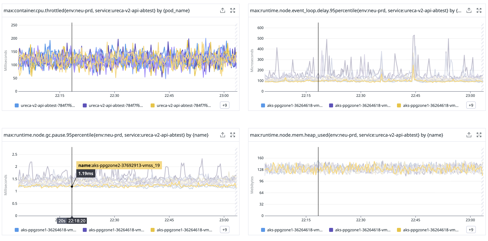
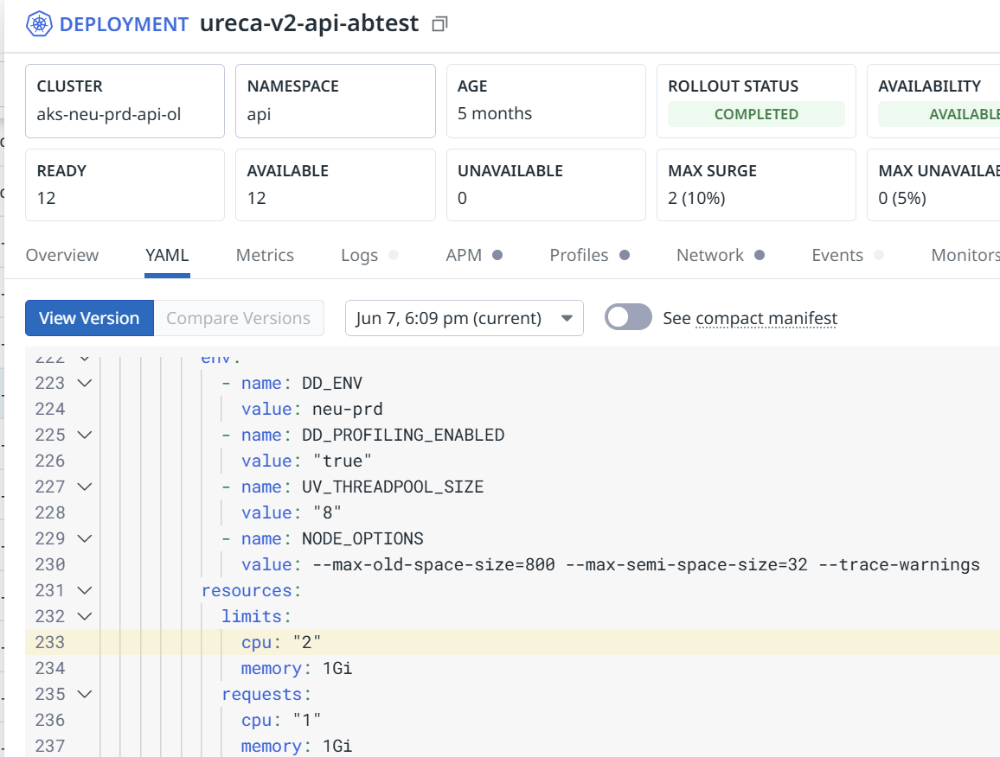
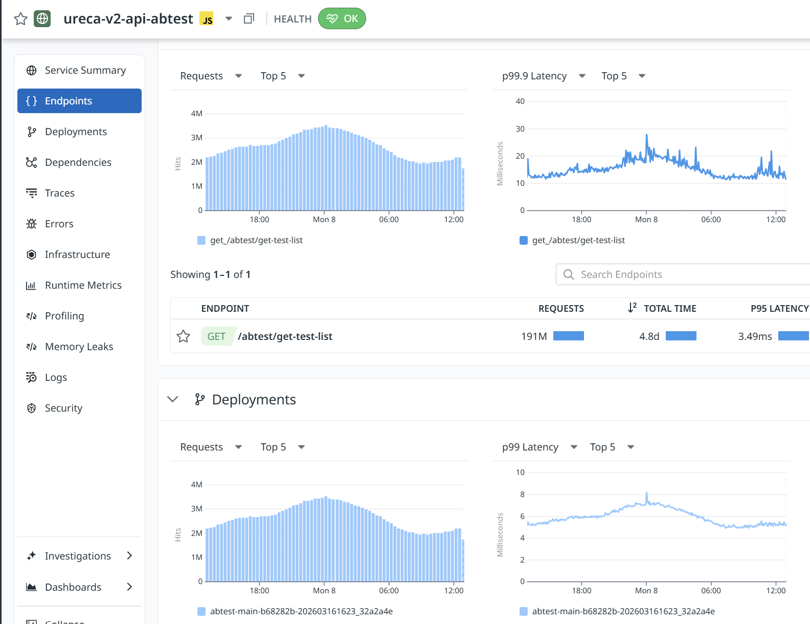
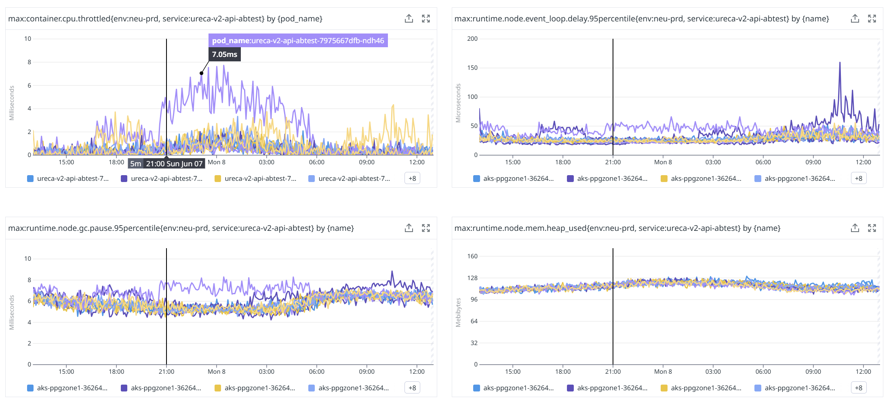

# AKS Pod → Database 쿼리 지연 디버깅

DB 쿼리 응답이 **30ms를 초과하면 fail 처리**되는 시나리오에서,
지연의 원인을 단계별로 좁혀가는 방법.


## 현재 상황: 메트릭 분석

### DB 쿼리 지연


| 메트릭 | 관측 값 | 판단 |
|---|---|---|
| query **P95** | 3.5~6ms | 정상 — 30ms 미만 |
| query **P99** | 20~90ms | **⚠️ 30ms 초과 구간 발생** → fail |
| query **max** | ~300ms | **❌ 10배 초과** |

P95는 SLA 내인데 P99부터 30ms를 넘고, max는 300ms까지 치솟는다.

### Pod 런타임 상태



| 메트릭 | 관측 값 |
|---|---|
| **CPU throttled** | **100~200ms** — 상시 throttling 발생 |
| event loop delay P95 | 100~600μs |
| GC pause P95 | 1~2ms |
| heap used | ~128MB — 안정적 |

CPU throttling이 상시 발생하고 있다. 이것이 원인인지는 아래 단계에서 확인한다.

---

## 디버깅 순서

원인 후보를 하나씩 배제해간다.

### Step 1: CPU throttling 배제

**확인 대상**: CFS throttling이 쿼리 지연에 기여하는지.

Deployment YAML에서 `resources.limits.cpu`를 제거하고 P99를 비교한다.

```yaml
resources:
  requests:
    cpu: 250m      # 유지
    memory: 256Mi
  limits:
    # cpu: 500m    ← 제거
    memory: 512Mi
```

- P99가 내려감 → throttling이 기여하고 있었음. limit 조정 또는 제거로 대응.
- P99가 안 내려감 → throttling은 원인이 아님. **Step 2로.**

> CFS throttling이 평균 CPU가 낮은데도 왜 발생하는지, requests/limits 중 무엇을 조정해야 하는지에 대한 심층 분석은 [Appendix C](#appendix-c-cfs-throttling-심층-분석-nodejs-burst-모델)를 참고.

### Step 2: 커넥션 풀 대기 배제

**확인 대상**: DB connection pool 고갈로 쿼리가 대기큐에서 기다리는지.

앱의 DB client 설정에서 pool size를 늘린다.

```
# Node.js pg Pool
max: 10  →  max: 30

# Java HikariCP
maximumPoolSize: 10  →  maximumPoolSize: 30
```

앱에 `conn_acquire_ms` 같은 커넥션 획득 시간 메트릭이 있으면 먼저 확인 — 이 값이 높으면 pool 부족.

- P99가 내려감 → pool 대기가 기여하고 있었음.
- P99가 안 내려감 → pool은 원인이 아님. **Step 3으로.**

### Step 3: 네트워크 RTT 직접 측정

**확인 대상**: Pod ↔ DB 네트워크 구간에서 30ms 이상 걸리는지.

커널 `tcp_sock.srtt_us`를 읽는다. 앱, GC, throttling과 완전히 독립적인 순수 네트워크 RTT.

#### One-shot

```bash
kubectl debug -it <POD> -n <NS> \
  --image=nicolaka/netshoot --target=<CONTAINER> --profile=general \
  -- ss -ti state established dst <DB_IP>

# 출력 예시:
#   rtt:0.558/0.023 minrtt:0.339
#   (smoothed RTT / RTT variance — 단위: ms)
```

- `rtt` — smoothed RTT (EWMA), 커널이 ACK마다 갱신
- `minrtt` — 관측된 최소 RTT
- 같은 VNet 내라면 보통 sub-ms (0.3~0.7ms)

#### 연속 모니터링

```bash
# 백그라운드 ephemeral container
kubectl debug <POD> -n <NS> \
  --image=nicolaka/netshoot --target=<CONTAINER> --profile=general \
  -- sh -c 'while true; do
    RTT=$(ss -ti state established dst <DB_IP> | grep -o "rtt:[0-9.]*/[0-9.]*" | head -1)
    MIN=$(ss -ti state established dst <DB_IP> | grep -o "minrtt:[0-9.]*" | head -1)
    echo "$(date -u +%Y-%m-%dT%H:%M:%SZ) $RTT $MIN"
    sleep 1
  done'

# ephemeral container 이름 확인
kubectl get pod <POD> -n <NS> \
  -o jsonpath='{.spec.ephemeralContainers[-1:].name}'

# 로그 → 파일 수집
nohup kubectl logs -f <POD> -n <NS> -c debugger-XXXXX \
  >> rtt.log 2>/dev/null &
```

- RTT가 수 ms 이상 → 네트워크 경로 조사 (NSG, UDR, 서브넷 구성 등)
- RTT가 sub-ms → 네트워크는 원인이 아님. 쿼리 자체 또는 DB 서버 쪽 조사.

#### 주의사항

- 앱 컨테이너가 non-root이면 `ss` 설치 불가 → ephemeral container 필수
- Dockerfile에 `RUN apk add --no-cache iproute2` 추가하면 직접 실행 가능
- ephemeral container는 Pod 재시작 시 사라짐

---

## 판정 요약

| Step | 확인 항목 | 결과 → 조치 |
|---|---|---|
| 1 | CPU limit 제거 후 P99 변화 | 내려감 → throttling 대응 |
| 2 | pool 확대 후 P99 변화 | 내려감 → pool 설정 조정 |
| 3 | ss RTT 측정 | 높음 → 네트워크 경로 조사, 정상 → 쿼리/DB 쪽 조사 |

---

## 적용 결과: CPU limit 2 core 상향

Step 1 가설 검증 — `limits.cpu`를 `1` → `2`로 상향하고 `requests.cpu`는 `1` 유지.
QoS는 Guaranteed → **Burstable** 로 강등. Appendix [C.5](#c5-권장-조치) 옵션 A(`req=lim=2`)와 옵션 B(`req=500m / lim=2`)의 중간 형태로, 노드 capacity 부담을 늘리지 않으면서 burst 천장만 2배 확보하는 선택.

```yaml
resources:
  requests:
    cpu: "1"       # 유지
    memory: 1Gi
  limits:
    cpu: "2"       # 1 → 2
    memory: 1Gi
```



### 변화 전후 비교





| 지표 | Before (limit 1 core) | After (limit 2 core) | 판정 |
|---|---|---|---|
| `container.cpu.throttled` (time) | **100~200 ms/s** 상시 | 평상시 **< 2 ms**, 일시 peak 7 ms | 약 30배 감소 |
| query **P99** | 20~90 ms | **5~8 ms** | **30 ms SLA 내** |
| query **P99.9 / max** | ~300 ms | 평상시 10~20 ms, peak ~28 ms | 약 10배 감소 |
| query **P95** | 3.5~6 ms | 3.49 ms | 변화 없음 (원래 정상) |
| event loop delay P95 | 100~600 μs | 20~50 μs | 안정화 |
| GC pause P95 | 1~2 ms | 5~8 ms | **소폭 증가** (아래 참고) |
| heap used | ~128 MB | ~110 MB | 변화 없음 |

P99가 SLA(30 ms) 내로 안정화되고 max도 ~28 ms로 떨어져 **fail 처리 구간이 사라짐**. throttle이 거의 사라졌으므로 Appendix [C.3.2 / C.3.4](#c32-수정된-가설)의 가설 — "burst가 1 core quota를 자주 초과해 큐가 누적되며 tail이 비선형으로 증폭된다" — 가 본 케이스의 지배적 원인이었음이 확인됨.

### 관전 포인트

- **Step 2(connection pool) / Step 3(network RTT) 진행 불필요** — Step 1에서 인과가 확정됨.
- **Burstable로 강등됨** — 노드 압박 시 eviction 우선순위가 Guaranteed보다 낮아짐. 본 환경은 노드 capacity 여유가 충분해 자원 효율을 택한 형태. 노드가 자주 압박 상태가 되는 환경이면 옵션 A(`req=lim=2`)로 Guaranteed 유지가 안전.
- **GC pause P95가 소폭 증가 (1~2 ms → 5~8 ms)** — heap usage는 비슷한데 GC 시간만 늘었다. limit 상향으로 V8 GC worker가 더 적극적으로 CPU를 잡을 수 있게 된 영향으로 보임 (이전엔 GC worker도 quota에 막혀 짧게 잘려 실행되던 것이 풀린 것). tail latency에는 영향 없는 수준이라 무시.
- **CPU throttled가 0이 아님 (peak 7 ms)** — 가끔 burst가 2 core까지도 닿는다는 신호. 현재 SLA에는 무관하지만 추가 부하 증가 시 다시 P99에 영향 줄 수 있어 모니터링 유지 필요.

---

## Appendix A: 기타 도구 — 조건부로 사용 가능한 것과 불가능한 것

### 조건을 맞추면 사용 가능

| 우선순위 | Tool | 제한 | 조건 | 참고 |
|:---:|---|---|---|---|
| 1 | **Inspektor Gadget** `profile_tcprtt` | `--dport` 필터가 connection pool에서 빈 결과 반환. 필터 없으면 노드 전체 TCP가 섞임 | **대상 Pod만 있는 노드를 분리**하면, 포트 필터 없이도 해당 노드의 TCP RTT = Pod↔DB RTT가 됨 (taint/nodeSelector로 격리) | [Docs](https://www.inspektor-gadget.io/docs/latest/) |
| 2 | **Blackbox Exporter** | TCP connect() 시간만 측정. 기존 connection pool의 established RTT는 못 봄 | **네트워크 경로 자체의 RTT를 보는 용도**로는 유효. 새 TCP 연결의 handshake 시간 ≈ 네트워크 RTT. Prometheus 연속 수집 가능 | [GitHub](https://github.com/prometheus/blackbox_exporter) |
| 3 | **Azure Connection Monitor** | 노드 레벨 측정. Pod 네트워크 네임스페이스 아님 | **Azure CNI (overlay 아님)** 환경이면 노드 IP와 Pod IP가 같은 서브넷이므로, 노드 레벨 RTT ≈ Pod 레벨 RTT. 대략적인 기준선으로 활용 가능 | [Docs](https://learn.microsoft.com/en-us/azure/network-watcher/connection-monitor-overview) |

### 근본적으로 불가능

| Tool | 이유 | 참고 |
|---|---|---|
| **Cilium Hubble / ACNS** | TCP 메트릭은 `tcp_flags_total` (SYN/FIN/RST count)뿐. RTT 메트릭 자체가 없음. L7은 HTTP/Kafka만, PostgreSQL 미지원 | [Hubble Metrics](https://docs.cilium.io/en/stable/observability/metrics/) |
| **AKS Network Observability** | drop count, byte count만. latency 메트릭 없음 | [Docs](https://learn.microsoft.com/en-us/azure/aks/network-observability-overview) |
| **Retina** | API server RTT만 측정. Pod→외부 서비스 미지원 | [GitHub](https://github.com/microsoft/retina) |

## Appendix B: ss -ti 출력 필드

```
rtt:0.558/0.023 minrtt:0.339 cwnd:10 mss:1398 pmtu:1500
```

| 필드 | 의미 |
|---|---|
| `rtt:A/B` | A = smoothed RTT (EWMA), B = RTT variance (ms) |
| `minrtt` | 관측된 최소 RTT — 네트워크 물리적 하한 (ms) |
| `cwnd` | congestion window — 혼잡 제어 상태 |
| `mss` | maximum segment size |
| `pmtu` | path MTU |

커널 소스: `tcp_sock.srtt_us` (net/ipv4/tcp.c). Gadget `profile_tcprtt`와 같은 데이터.

---

## Appendix C: CFS Throttling 심층 분석 (Node.js burst 모델)

Step 1에서 CPU throttling을 1순위로 의심하는 이유, 그리고 평균 CPU 사용량이 낮은데도 throttling이 상시 발생하는 메커니즘을 정리한다.

### C.1 관측 데이터 예시

- **설정**: `requests = limits = 1 core` (Guaranteed QoS)
- **노드 CPU 피크**: 50~60% (헤드룸 충분)
- **per-second 정규화 지표**:

| 지표 | 관측값 | 환산 |
|---|---|---|
| `container.cpu.throttled.periods` | pod당 0.2~0.5/s (피크 0.6/s) | **2~6%의 period가 throttle** |
| `container.cpu.throttled` (time) | pod당 20~80 ms/s (피크 100 ms/s) | **시간 기준 2~10%가 강제 stall** |

> 두 지표를 나누면 평균 ~150 ms 수준의 stall impact로 환산되며, 이는 **P99/P99.9 같은 tail latency에만 의미 있는 영향**을 줄 수 있음.
> (실제 CFS는 "period 끝까지 남은 시간만큼" sleep시키므로 stall duration 분포는 균일하지 않음 — 평균은 근사치.)

전형적 패턴: **"평균 사용량 낮음 + 상시 소량 throttle"**.

### C.2 CFS Throttling — 정확한 정의

**CFS (Completely Fair Scheduler)** 는 Linux 커널의 기본 프로세스 스케줄러 (2.6.23부터). 각 task에 "virtual runtime"을 부여해 적게 쓴 task부터 골라 실행하는 방식으로 CPU 시간을 공정 분배한다.

여기에 cgroup 단위 **상한**을 거는 기능이 **CFS bandwidth control** (커널 3.2+). kubelet이 `limits.cpu`를 적용할 때 사용하는 메커니즘이 바로 이것.

- 인터페이스
  - cgroup v1: `cpu.cfs_quota_us`, `cpu.cfs_period_us`
  - cgroup v2: `cpu.max` (`"<quota> <period>"`)
- kubelet의 `limits.cpu` → quota 환산 (`MilliCPUToQuota`):

$$\text{quota}_{\mu s} = \text{milliCPU} \times \frac{\text{period}_{\mu s}}{1000}$$

- **CFS period는 일반적으로 100 ms** (kubelet `cpuCFSQuotaPeriod`로 변경 가능, AKS 기본 100 ms).
- 따라서 `limits.cpu: "1"` → 한 period(100 ms) 안에 cgroup 누적 CPU time **100 ms**까지 허용.
- quota 초과 시 CFS는 **해당 cgroup에 속한 runnable thread 전부를 다음 period 시작까지 강제 sleep** (다른 Pod/cgroup은 영향 없음).

> **핵심**: throttling은 CPU가 부족해서 발생하는 것이 아니라, cgroup 할당량(quota)을 초과했기 때문에 발생한다.
> CPU 사용량을 깎는 동작이 아니라 **wall-clock latency를 늘리는 동작**.
> throttled time 80 ms/s = "매 초 누적 80 ms의 강제 stall이 어떤 요청에 꽂힌다."

### C.3 평균이 낮은데 throttle이 발생하는 이유 (지배적 가설)

평균 CPU 사용량과 throttling은 **다른 지표**. throttling은 CFS period 윈도우 내 **burst**만 본다.

**Node.js의 burst 구조**

먼저 핵심 직관부터.

> `limits.cpu: "1"` 의 진짜 의미는 "**언제나 1개 코어만 쓸 수 있다**"가 아니라
> "**한 CFS period(기본 100 ms) 동안 해당 Pod cgroup에 속한 thread들의 CPU 시간 합계가 최대 100 ms까지 허용된다**" 이다.

즉 같은 Pod 안의 thread 2개가 50 ms씩 **동시에** 실행되면 경과 시간(wall-clock)은 50 ms뿐이지만 그 Pod cgroup의 누적 CPU time은 이미 100 ms quota를 다 소진한다. 같은 period 내 남은 50 ms 동안 그 Pod에 속한 thread들은 강제 sleep — 이것이 throttle.

Node.js는 흔히 "싱글 스레드"라고 부르지만, 그것은 **JS 코드를 실행하는 thread가 하나**라는 뜻일 뿐이다. 프로세스 안에는 OS 입장에서 보면 항상 여러 thread가 떠 있다:

| Thread | 하는 일 | 언제 깨어나나 |
|---|---|---|
| 메인 V8 isolate | JS 코드 실행 (당신이 짠 로직) | 요청 처리 중 항상 |
| V8 GC worker | heap 정리 (concurrent marking/sweeping) | heap이 일정 크기 차면 자동 |
| V8 JIT (TurboFan/Maglev) | hot function을 native 코드로 background 컴파일 | hot function이 감지될 때 |
| libuv 스레드풀 (기본 4개) | 파일 I/O, DNS lookup, crypto(bcrypt/zlib 등) | `fs.*`, `dns.lookup`, `crypto`, `zlib` 호출 시 |

평상시엔 이 thread들이 따로따로 깨어나서 평균 CPU 사용량은 낮게 보인다. 문제는 **우연히 같은 CFS period에 겹쳐 실행되는 순간**:

```
경과 시간 →  0ms ──────────── 100ms (1 CFS period)
메인 JS     ████████████████        (요청 처리, 40ms)
GC          ░░░░████████░░░░        (heap 정리, 30ms)
JIT         ░░░░░░░░████░░░░        (background compile, 20ms)
libuv #1    ░░██████░░░░░░░░        (DB 결과 파싱, 25ms)
libuv #2    ░░░░░░░░░░██████        (다른 요청의 crypto, 25ms)
─────────────────────────
누적 CPU    40 + 30 + 20 + 25 + 25 = 140 ms  ← quota(100ms) 초과
```

경과 시간으로는 100 ms period 하나지만, 5개 thread의 CPU 시간 합계는 140 ms. quota를 40 ms 초과했으므로 **다음 period 시작까지 그 Pod의 thread들은 모두 sleep** (같은 노드의 다른 Pod는 영향 없음). 마침 그 구간에 걸린 DB 쿼리 요청은 응답이 수십 ms 늦어진다 → P99 spike.

평균만 보면 노드 CPU가 50~60%라 한가해 보이지만, 100 ms 단위로 들여다보면 이런 burst가 초당 몇 번씩 발생하고 있는 것.

### C.3.1 본 케이스 적용 — 단순 burst 모델로는 부족하다

위 모델은 직관용 그림이고, 본 케이스의 실제 수치는 단순 burst만으로 깔끔히 설명되지 않는다.

| 지표 | 관측 | 의미 |
|---|---|---|
| `cpu.throttled` (time) | **100~200 ms/s** | 매 초 100~200 ms 동안 Pod cgroup이 강제 stall (10~20% wall-time) |
| GC pause P95 | 1~2 ms | GC는 **안정적**. burst 기여도 미미 |
| event loop delay P95 | 100~600 μs | event loop 자체도 매우 안정 |
| query P99 / max | 20~90 ms / **~300 ms** | tail이 throttle 1회분(<100 ms)을 넘어 max 300 ms |

여기서 두 가지 어긋남을 짚어야 한다.

**(1) GC가 burst 원인이라기엔 너무 안정적이다.**
GC pause가 P95 1~2 ms 수준이면 GC는 burst의 주범이 아니다. 즉 위 5개 thread 모델 중 **"GC + JIT background"가 우연히 겹친다"는 시나리오는 후순위**로 내려가야 한다. 남는 후보는:

- **libuv 스레드풀에서의 동기 작업** — `bcrypt`, `zlib`, 대량 JSON `Buffer` 처리 등 CPU-bound 호출이 여러 요청에서 동시에 풀로 들어가면 thread 4개가 한꺼번에 CPU를 먹는다. 이게 가장 유력.
- **메인 isolate의 동기 핫패스** — 큰 객체 JSON.stringify, 정규식 backtracking, 대용량 배열 가공 등. event loop delay가 P95 600 μs로 잡힌다는 건 평균은 멀쩡하지만 가끔 ms 단위 동기 작업이 있을 수 있음을 배제하지는 않는다 (P99/max를 봐야 정확).
- **요청 수 자체가 burst** — 초당 요청이 균등하지 않고 spike가 있으면, spike 구간 100 ms 동안 동시 처리량이 평균의 몇 배가 된다.

**(2) throttle 1회로는 max 300 ms를 설명할 수 없다.**
한 번의 throttle stall 최대치는 "남은 period" 즉 100 ms 미만이다. 그런데 query max가 300 ms라는 건:

- 한 요청이 **여러 period에 걸쳐 연속으로 throttle을 맞고 있다** — quota 초과가 1회로 끝나지 않고 2~3 period 연속 발생 (지속적인 CPU 압박)
- 또는 throttle + 다른 요인(예: 그 시점의 DB 측 spike, network jitter)이 **겹쳐서** 누적

200 ms/s throttled time(= wall-time의 20%)이 상시라는 것은 단발성 burst가 아니라 **거의 항상 quota 근처에서 돌고 있다**는 신호에 가깝다. 평균 CPU 사용량이 낮게 보이는 것은 throttle 자체가 사용량을 깎기 때문 — quota에 자주 막히면 그래프상 utilization은 quota 직전에서 평평하게 잘려 보인다.

### C.3.2 수정된 가설

> 평균은 낮아 보이지만 실제 demand는 자주 1 core를 넘어선다. libuv 풀의 동시 동기 작업 + 요청 도착 burst가 결합해 cgroup이 매 초 100~200 ms씩 quota에 막히고 있으며, 일부 요청은 연속된 throttle 구간에 갇혀 300 ms급 tail로 튄다.

이 가설을 검증/구분하려면:

- `node --prof` 또는 clinic.js / 0x 로 **CPU profile** — 동기 핫패스, libuv 작업 식별
- libuv 스레드풀 사용량: `UV_THREADPOOL_SIZE` 환경변수, `process._getActiveHandles()` / async_hooks 로 큐잉 관찰
- event loop delay **P99/max** 도 같이 — P95만 보면 안 됨
- 요청 RPS의 100 ms 분해능 그래프 (burst 여부 직접 확인)
- 그리고 가장 빠른 검증: **C.5의 limit 상향으로 throttled time 그래프가 0 근처로 떨어지는지** — 떨어지면 적어도 throttle은 원인 맞음, 안 떨어지면 limit 자체가 부족했던 것이 아니라 다른 자원

### C.3.3 보조 가설들 (확률 낮지만 배제 X)

- pure CPU busy loop / 동기 핫패스
- runqueue 경쟁, noisy neighbor
- kernel-side I/O completion 폭주

### C.3.4 큐잉 관점 — 왜 throttle 200 ms/s 가 300 ms tail로 증폭되는가

지금까지는 "한 요청이 stall 구간에 걸리면 그만큼 늦어진다"는 단순 모델로 봤지만, 실제로 throttle이 latency tail을 만드는 메커니즘은 **queueing**이다. throttle이 진행 중인 동안에도 새 요청은 계속 도착하므로, stall 직후의 요청은 자기 처리 시간 + **앞에 쌓인 요청을 다 처리할 때까지의 대기 시간**을 같이 부담한다.

> **모델 사용에 대한 주의**
> 아래에서 쓰는 Little's Law는 본래 **정상 상태(steady-state) 또는 장기 평균**에 대한 관계이고, M/M/1은 **도착이 Poisson, service time이 지수분포**라는 강한 가정을 둔다. throttle stall은 본질적으로 **과도 상태(transient)** 현상이고 실제 요청 도착도 Poisson과 정확히 일치하지는 않는다. 여기서의 사용은 엄밀한 정량 예측이 아니라, **"throttle 비율과 utilization이 결합되면 tail이 비선형으로 증폭된다"는 직관을 전달하기 위한 근사 모델**임을 전제로 본다.

**Little's Law (장기 평균 관계)**

정상 상태에서 시스템 안에 있는 요청 수 $L$, 도착률 $\lambda$, 평균 응답시간 $W$ 사이에는

$$L = \lambda \cdot W$$

이 성립한다. throttle 구간 자체는 정상 상태가 아니지만, throttle이 "초당 일정 비율 $f$ 로 반복되는 현상"이라고 보면 **장기 평균 service rate가 $\mu(1-f)$ 로 깎인 시스템**으로 근사할 수 있다 — 이 평균 관점에서 Little's Law를 적용하는 것.

**Stall 1회의 queue buildup (과도 해석)**

엄밀히는 transient 분석이지만 직관용으로: 도착률 $\lambda$ = 100 req/s, 평균 service time 5 ms (= $\mu$ = 200 req/s) 인 Pod에서 한 번에 80 ms throttle stall이 발생하면 — stall 동안 service rate가 0이라고 가정 시:

- stall 동안 도착하는 요청 수 (Poisson 평균): $100 \times 0.08 = 8$ 개 → 큐에 쌓임
- stall 종료 후 큐 해소까지 평균 시간: $\dfrac{8}{\mu - \lambda} = \dfrac{8}{200-100} = 80\ \text{ms}$
- 그 80 ms 동안 도착한 요청들도 큐 잔량의 영향을 받음

즉 **stall 시간만큼 latency가 추가되는 게 아니라, stall 시간 × utilization factor 만큼 tail이 늘어진다** — 실제 분포는 더 복잡하지만 방향은 이렇다. utilization $\rho = \lambda / \mu$ 가 1에 가까울수록 해소가 느려지고, $\rho \geq 1$ 이면 큐는 영원히 줄지 않는다.

**Tail latency amplification (M/M/1 근사 직관)**

M/M/1 정상 상태에서 평균 응답시간은

$$W = \frac{1}{\mu - \lambda} = \frac{1/\mu}{1 - \rho}$$

throttle을 "장기 평균 service rate를 깎는 효과"로 근사하면 $\mu_{\text{eff}} = \mu \cdot (1 - f)$, $f$ = throttled fraction. 본 케이스 $f$ = 0.10~0.20:

| $\rho$ (원래) | $\rho_{\text{eff}}$ ($f$=0.2) | $W / W_0$ 증가 배수 |
|---|---|---|
| 0.5 | 0.625 | 1.33× |
| 0.7 | 0.875 | **2.4×** |
| 0.8 | 1.0 | **∞** (큐 발산) |
| 0.9 | 1.125 | 발산 |

평균이 이 정도면 **P99/max는 훨씬 더 비선형으로 튄다**. M/M/1 응답시간 분포는 지수분포라 P99 ≈ $W \cdot \ln(100)$ ≈ $4.6 W$ (이 역시 분포 가정에 의존한 근사). 평균 5 ms 짜리 service가 utilization 0.7 + throttle 20% 조합으로 평균 W ≈ 40 ms가 되면 P99 ≈ 180 ms, max는 그 위 — **본 케이스 max 300 ms가 이 모델의 자릿수 범위 안**에 들어온다. 정확한 수치보다 "한계점 근처에서 작은 추가 부하가 tail을 크게 늘린다"는 정성적 결론이 본질.

> 즉 "throttle 1회 stall < 100 ms 인데 max는 300 ms" 라는 어긋남의 해답은 **queueing amplification**.
> stall 자체가 길어서가 아니라, stall 동안 쌓인 큐를 다음 stall이 오기 전에 다 해소하지 못하고 누적되기 때문.

**실측 가능한 신호**

- 도착률 $\lambda$ (RPS)과 service time $1/\mu$ 으로부터 $\rho$ 계산 → 0.7 이상이면 위험
- in-flight 요청 수(= Node.js 의 `process._getActiveRequests().length` 또는 APM의 active span 수)가 throttle 직후 spike → queue buildup 직접 관측
- application-level queue: HTTP server `agent`/`keepAlive` 큐, libuv pool pending, Express 내부 등 — 각 단계마다 Little's Law가 독립적으로 적용됨

**이 관점이 권장 조치에 주는 함의**

- **limit 상향**은 단순히 "stall 줄이기"가 아니라 **$\mu_{\text{eff}}$ 회복** → $\rho_{\text{eff}}$ 가 1보다 충분히 낮은 영역으로 복귀시키는 효과. 한계점 근처(`ρ` ≈ 0.8)에서는 작은 limit 조정도 P99에 큰 영향.
- **수평 확장 (replica 증가)** 도 같은 효과 — 동일 $\lambda$ 를 N개 서버가 나눠 받으므로 per-pod $\rho$ 감소.
- 반대로 limit를 그대로 두고 concurrency만 늘리면(예: keepAlive 풀, libuv 풀 확대) $\lambda$ 만 늘어 $\rho$ 가 더 올라가 **tail이 악화**될 수 있다.

### C.4 requests vs limits — throttling에 무엇이 영향을 주는가

| 조정 | cgroup 영향 | throttling 효과 |
|---|---|---|
| `requests` ↑ | `cpu.shares`(가중치)만 변화 | **없음** (단, 노드가 CPU contention 상태면 `cpu.shares`가 실제 실행 비율에 영향) |
| `limits` ↑ / 제거 | `cpu.cfs_quota_us` 변화 | **직접적**. burst 천장이 늘어나 quota 초과가 줄어듦 |

→ 직접 처방은 **limit 상향**. requests 상향은 throttling 해소가 아니라 스케줄링 / HPA / QoS 관점의 별개 결정.

### C.5 권장 조치

현재 Guaranteed QoS(`req=lim=1`)를 유지할지, 자원 효율을 우선할지로 갈림.

**옵션 A — Guaranteed 유지 (운영 안정성 우선, 권장 1순위)**

```yaml
resources:
  requests: { cpu: "2" }
  limits:   { cpu: "2" }
```

- burst 천장 2배 → throttling 거의 사라질 것으로 예상
- 노드 capacity 부담 2배 (스케줄 reserve)

**옵션 B — Burstable 전환 (자원 효율 우선)**

```yaml
resources:
  requests: { cpu: "500m" }
  limits:   { cpu: "2" }   # 또는 4
```

- 평균이 낮으니 노드 실제 사용량은 거의 그대로
- QoS Burstable로 강등 → 노드 압박 시 eviction 우선순위 주의

### C.6 검증 절차 (Runbook)

1. 변경 적용 (옵션 A 또는 B)
2. cgroup 값 직접 확인

   ```bash
   kubectl exec <pod> -- cat /sys/fs/cgroup/cpu.max
   # 예: "200000 100000"  ← quota 200 ms / period 100 ms = 2 core
   ```

3. throttling 지표 재확인 — `container.cpu.throttled.periods`, `container.cpu.throttled` 모두 0 근처로 떨어지는지.
4. CPU usage(p95/p99) 동시 확인 — limit 상승 이후 실제 CPU saturation 여부 검증 (실사용이 새 limit에 다시 닿는다면 vertical scale이 더 필요).
5. DB 쿼리 P99 비교
   - 같이 내려감 → throttling이 진짜 기여 원인. 종료.
   - 안 내려감 → throttling은 latency의 지배 원인이 아니었음. 본문 Step 2 (connection pool) / Step 3 (RTT)로 진행.

### C.7 핵심 요약

- CFS quota는 평균이 아닌 **CFS period(보통 100 ms) 단위 누적 burst**를 본다.
- throttle = CPU 절약이 아니라 **강제 sleep** → P99 latency 증가.
- 평균 낮음 + 상시 소량 throttle 패턴은 **internal-thread overlap으로 인한 burst 모델**이 가장 유력 (지배적 가설).
- `requests`는 throttling에 무관, `limits`만 효과. Guaranteed 유지면 `req=lim=2`, 효율 우선이면 `req=500m / lim=2`.
- 변경 후 throttle 그래프 + CPU usage + DB P99를 함께 보고 인과 확정.

### C.8 참고 문서

- Kubernetes: [Resource Management for Pods and Containers — CPU resource units](https://kubernetes.io/docs/concepts/configuration/manage-resources-containers/#meaning-of-cpu) — `requests`/`limits`가 cgroup `cpu.shares` / `cpu.cfs_quota_us`에 매핑되는 방식
- Kubernetes: [Pod Quality of Service Classes](https://kubernetes.io/docs/concepts/workloads/pods/pod-qos/) — Guaranteed / Burstable / BestEffort 정의와 eviction 우선순위
- Kubernetes: [CPU Management Policies](https://kubernetes.io/docs/tasks/administer-cluster/cpu-management-policies/) — `static` 정책으로 CPU pinning이 필요한 경우
- Kubernetes: [Disable CPU CFS quota enforcement](https://kubernetes.io/docs/reference/config-api/kubelet-config.v1beta1/) — kubelet `cpuCFSQuota`, `cpuCFSQuotaPeriod` 옵션
- AKS: [CPU 관리 정책 구성](https://learn.microsoft.com/azure/aks/cpu-manager-policy) — AKS에서 CPU manager 설정 방법
- Linux 커널: [CFS Bandwidth Control](https://docs.kernel.org/scheduler/sched-bwc.html) — quota / period / throttling 동작 원본 문서
- 배경 글: [Kubernetes CPU Limits and Throttling (Datadog)](https://www.datadoghq.com/blog/kubernetes-cpu-requests-limits/) — 본 문서와 같은 burst 모델 사례 분석
