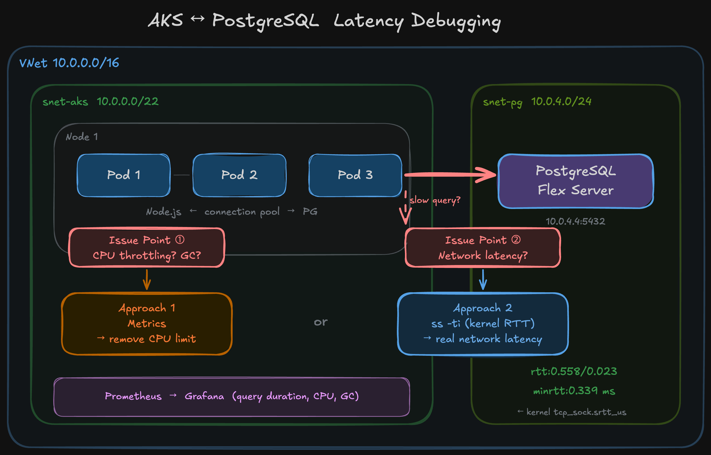
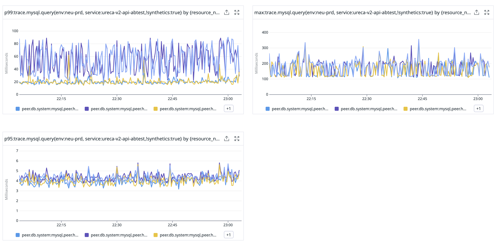

# AKS Pod → Database 쿼리 지연 디버깅

DB 쿼리 응답이 **30ms를 초과하면 fail 처리**되는 시나리오에서,
지연의 원인을 단계별로 좁혀가는 방법.



## 현재 상황: 메트릭 분석

### DB 쿼리 지연



| 메트릭 | 관측 값 | 판단 |
|---|---|---|
| query **P95** | 3.5~6ms | 정상 — 30ms 미만 |
| query **P99** | 20~90ms | **⚠️ 30ms 초과 구간 발생** → fail |
| query **max** | ~300ms | **❌ 10배 초과** |

P95는 SLA 내인데 P99부터 30ms를 넘고, max는 300ms까지 치솟는다.

### Pod 런타임 상태


| 메트릭 | 관측 값 |
|---|---|
| **CPU throttled** | **100~200ms** — 상시 throttling 발생 |
| event loop delay P95 | 100~600μs |
| GC pause P95 | 1~2ms |
| heap used | ~128MB — 안정적 |

CPU throttling이 상시 발생하고 있다. 이것이 원인인지는 아래 단계에서 확인한다.

---

## 디버깅 순서

원인 후보를 하나씩 배제해간다.

### Step 1: CPU throttling 배제

**확인 대상**: CFS throttling이 쿼리 지연에 기여하는지.

Deployment YAML에서 `resources.limits.cpu`를 제거하고 P99를 비교한다.

```yaml
resources:
  requests:
    cpu: 250m      # 유지
    memory: 256Mi
  limits:
    # cpu: 500m    ← 제거
    memory: 512Mi
```

- P99가 내려감 → throttling이 기여하고 있었음. limit 조정 또는 제거로 대응.
- P99가 안 내려감 → throttling은 원인이 아님. **Step 2로.**

### Step 2: 커넥션 풀 대기 배제

**확인 대상**: DB connection pool 고갈로 쿼리가 대기큐에서 기다리는지.

앱의 DB client 설정에서 pool size를 늘린다.

```
# Node.js pg Pool
max: 10  →  max: 30

# Java HikariCP
maximumPoolSize: 10  →  maximumPoolSize: 30
```

앱에 `conn_acquire_ms` 같은 커넥션 획득 시간 메트릭이 있으면 먼저 확인 — 이 값이 높으면 pool 부족.

- P99가 내려감 → pool 대기가 기여하고 있었음.
- P99가 안 내려감 → pool은 원인이 아님. **Step 3으로.**

### Step 3: 네트워크 RTT 직접 측정

**확인 대상**: Pod ↔ DB 네트워크 구간에서 30ms 이상 걸리는지.

커널 `tcp_sock.srtt_us`를 읽는다. 앱, GC, throttling과 완전히 독립적인 순수 네트워크 RTT.

#### One-shot

```bash
kubectl debug -it <POD> -n <NS> \
  --image=nicolaka/netshoot --target=<CONTAINER> --profile=general \
  -- ss -ti state established dst <DB_IP>

# 출력 예시:
#   rtt:0.558/0.023 minrtt:0.339
#   (smoothed RTT / RTT variance — 단위: ms)
```

- `rtt` — smoothed RTT (EWMA), 커널이 ACK마다 갱신
- `minrtt` — 관측된 최소 RTT
- 같은 VNet 내라면 보통 sub-ms (0.3~0.7ms)

#### 연속 모니터링

```bash
# 백그라운드 ephemeral container
kubectl debug <POD> -n <NS> \
  --image=nicolaka/netshoot --target=<CONTAINER> --profile=general \
  -- sh -c 'while true; do
    RTT=$(ss -ti state established dst <DB_IP> | grep -o "rtt:[0-9.]*/[0-9.]*" | head -1)
    MIN=$(ss -ti state established dst <DB_IP> | grep -o "minrtt:[0-9.]*" | head -1)
    echo "$(date -u +%Y-%m-%dT%H:%M:%SZ) $RTT $MIN"
    sleep 1
  done'

# ephemeral container 이름 확인
kubectl get pod <POD> -n <NS> \
  -o jsonpath='{.spec.ephemeralContainers[-1:].name}'

# 로그 → 파일 수집
nohup kubectl logs -f <POD> -n <NS> -c debugger-XXXXX \
  >> rtt.log 2>/dev/null &
```

- RTT가 수 ms 이상 → 네트워크 경로 조사 (NSG, UDR, 서브넷 구성 등)
- RTT가 sub-ms → 네트워크는 원인이 아님. 쿼리 자체 또는 DB 서버 쪽 조사.

#### 주의사항

- 앱 컨테이너가 non-root이면 `ss` 설치 불가 → ephemeral container 필수
- Dockerfile에 `RUN apk add --no-cache iproute2` 추가하면 직접 실행 가능
- ephemeral container는 Pod 재시작 시 사라짐

---

## 판정 요약

| Step | 확인 항목 | 결과 → 조치 |
|---|---|---|
| 1 | CPU limit 제거 후 P99 변화 | 내려감 → throttling 대응 |
| 2 | pool 확대 후 P99 변화 | 내려감 → pool 설정 조정 |
| 3 | ss RTT 측정 | 높음 → 네트워크 경로 조사, 정상 → 쿼리/DB 쪽 조사 |

---

## Appendix A: 기타 도구 — 조건부로 사용 가능한 것과 불가능한 것

### 조건을 맞추면 사용 가능

| 우선순위 | Tool | 제한 | 조건 | 참고 |
|:---:|---|---|---|---|
| 1 | **Inspektor Gadget** `profile_tcprtt` | `--dport` 필터가 connection pool에서 빈 결과 반환. 필터 없으면 노드 전체 TCP가 섞임 | **대상 Pod만 있는 노드를 분리**하면, 포트 필터 없이도 해당 노드의 TCP RTT = Pod↔DB RTT가 됨 (taint/nodeSelector로 격리) | [Docs](https://www.inspektor-gadget.io/docs/latest/) |
| 2 | **Blackbox Exporter** | TCP connect() 시간만 측정. 기존 connection pool의 established RTT는 못 봄 | **네트워크 경로 자체의 RTT를 보는 용도**로는 유효. 새 TCP 연결의 handshake 시간 ≈ 네트워크 RTT. Prometheus 연속 수집 가능 | [GitHub](https://github.com/prometheus/blackbox_exporter) |
| 3 | **Azure Connection Monitor** | 노드 레벨 측정. Pod 네트워크 네임스페이스 아님 | **Azure CNI (overlay 아님)** 환경이면 노드 IP와 Pod IP가 같은 서브넷이므로, 노드 레벨 RTT ≈ Pod 레벨 RTT. 대략적인 기준선으로 활용 가능 | [Docs](https://learn.microsoft.com/en-us/azure/network-watcher/connection-monitor-overview) |

### 근본적으로 불가능

| Tool | 이유 | 참고 |
|---|---|---|
| **Cilium Hubble / ACNS** | TCP 메트릭은 `tcp_flags_total` (SYN/FIN/RST count)뿐. RTT 메트릭 자체가 없음. L7은 HTTP/Kafka만, PostgreSQL 미지원 | [Hubble Metrics](https://docs.cilium.io/en/stable/observability/metrics/) |
| **AKS Network Observability** | drop count, byte count만. latency 메트릭 없음 | [Docs](https://learn.microsoft.com/en-us/azure/aks/network-observability-overview) |
| **Retina** | API server RTT만 측정. Pod→외부 서비스 미지원 | [GitHub](https://github.com/microsoft/retina) |

## Appendix B: ss -ti 출력 필드

```
rtt:0.558/0.023 minrtt:0.339 cwnd:10 mss:1398 pmtu:1500
```

| 필드 | 의미 |
|---|---|
| `rtt:A/B` | A = smoothed RTT (EWMA), B = RTT variance (ms) |
| `minrtt` | 관측된 최소 RTT — 네트워크 물리적 하한 (ms) |
| `cwnd` | congestion window — 혼잡 제어 상태 |
| `mss` | maximum segment size |
| `pmtu` | path MTU |

커널 소스: `tcp_sock.srtt_us` (net/ipv4/tcp.c). Gadget `profile_tcprtt`와 같은 데이터.
