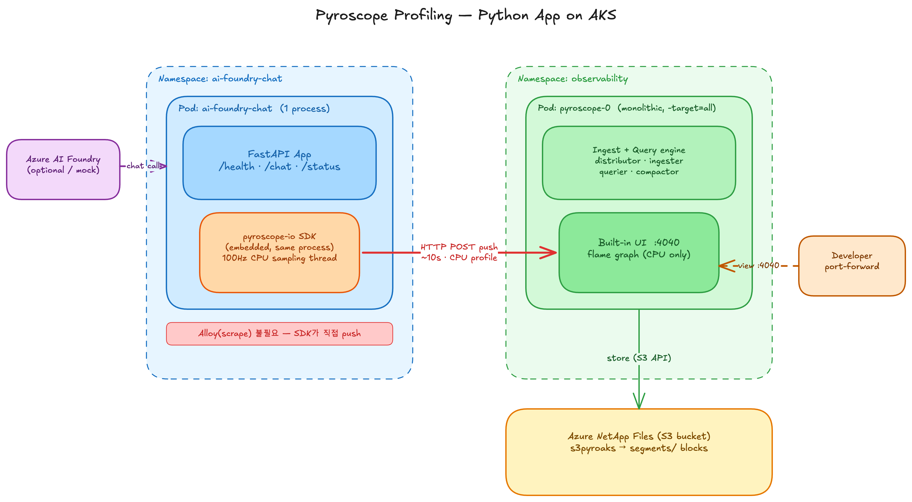
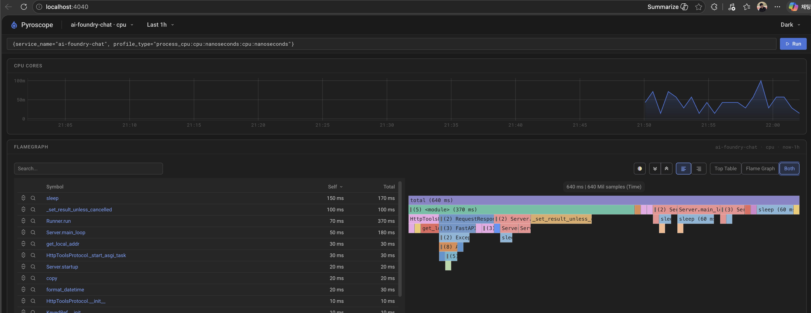
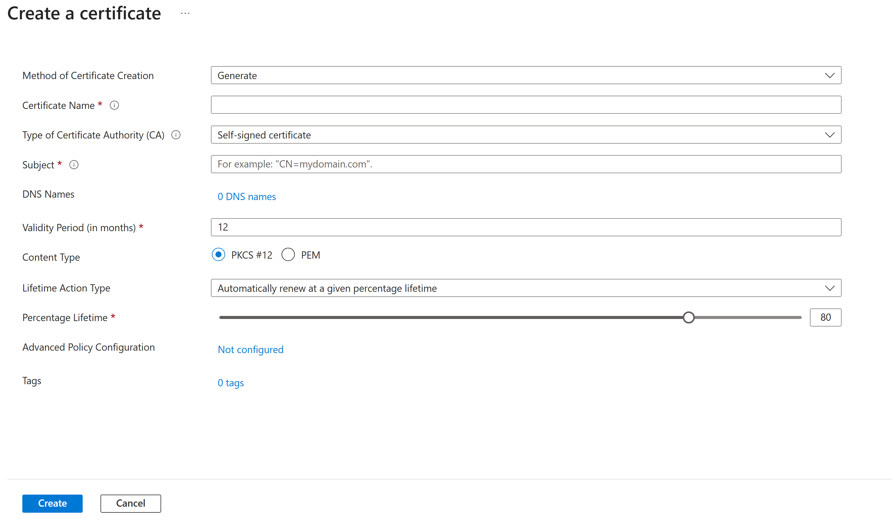
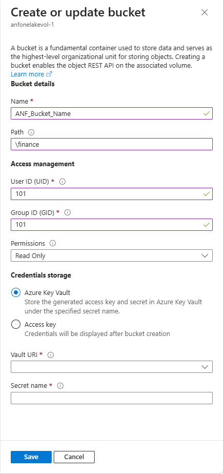

# Pyroscope을 AKS에 배포하기 (S3 백엔드를 Azure NetApp Files로)

> **Pyroscope란?** Grafana의 오픈소스 지속프로파일링(continuous profiling) 플랫폼입니다.
> 애플리케이션의 CPU·메모리 등 리소스 사용을 상시 샘플링해 **flame graph**로 보여주고,
> 수집된 프로파일을 압축·색인해 S3 호환 오브젝트 스토리지에 장기 보관합니다. 어디서 CPU를
> 많이 쓰는지(bottleneck)를 코드 레벨로 파악할 때 쓰입니다.

> Pyroscope는 프로파일을 저장할 **S3 호환 오브젝트 스토리지**가 필요합니다.
> 이 가이드의 핵심은 그 S3 백엔드를 별도 MinIO 운영 없이 **Azure NetApp Files의
> S3 호환 API**로 구현하는 것입니다. (프로파일링 대상 예시로 Python pod를 사용)

## 목차
0. [목표 & 시나리오](#목표--시나리오)
1. [아키텍처 개요](#아키텍처-개요)
2. [필수 사전 조건](#필수-사전-조건)
3. [1단계: ANF 구성 (S3 백엔드)](#1단계-anf-구성-s3-백엔드)
4. [2단계: ANF S3 Bucket 설정](#2단계-anf-s3-bucket-설정)
5. [3단계: Pyroscope 배포](#3단계-pyroscope-배포)
6. [4단계: 검증](#4단계-검증)
7. [5단계: 애플리케이션 프로파일링 (예제)](#5단계-애플리케이션-프로파일링-예제)
8. [프로파일 수집 방식 & 언어별 지원](#프로파일-수집-방식--언어별-지원)
9. [설정값 정리](#설정값-정리)

---

## 목표 & 시나리오

- **핵심**: Pyroscope의 S3 스토리지 백엔드를 **MinIO 대신 Azure NetApp Files(S3 호환 API)**로 구성한다.
  - Pyroscope 기본 차트는 MinIO를 띄우지만, 이를 `minio.enabled: false`로 끄고
    ANF S3 버킷을 `endpoint`/`accessKey`/`secretKey`로 직접 연결한다.
  - 자체 오브젝트 스토리지(MinIO)를 운영·백업·확장할 필요가 없어진다.
- **용도**: 배포된 Pyroscope로 AKS의 Python pod를 프로파일링한다 (앱에 SDK 임베드 → push).
- **결과물**: `http://localhost:4040`에서 flame graph 확인 + 프로파일 segments가 ANF S3에 영구 저장.

전체 흐름:

```text
Python Pod (앱 + SDK)  ──push──▶  Pyroscope Server  ──S3 API──▶  Azure NetApp Files (S3)
   프로파일 생성·전송            수집 · 질의 · UI(:4040)        MinIO 대신 ANF 버킷에 저장
```

> **왜 ANF인가**: MinIO 운영 불필요, ANF 용량으로 자동 스케일, 엔터프라이즈 SLA·스냅샷·3-way replica.
> **이미 떠있는 앱 프로파일링**은 이미지 재빌드 없이 SDK 초기화 몇 줄만 추가 → [5단계](#5단계-애플리케이션-프로파일링-예제).

---

## 아키텍처 개요



**핵심 포인트:**
- MinIO 제거: `enabled: false`
- S3 저장소: Azure NetApp Files S3-compatible API
- 네트워킹: Private HTTPS (self-signed cert)
- 자격증명: AWS SigV4 (AccessKey + SecretKey)
- 애플리케이션 프로파일: SDK가 Pyroscope로 직접 push (Python 예제는 [5단계](#5단계-애플리케이션-프로파일링-예제) 참고)

Pyroscope UI 플레임그래프 예시:



---

## 필수 사전 조건

- **AKS 클러스터** — 이미 떠있다고 가정 (`kubectl`로 접근 가능).
- **Azure NetApp Files 사용 등록** — 구독에서 `Microsoft.NetApp` 리소스 공급자 등록 및 ANF 프로비저닝 승인.
- **ANF용 Delegated Subnet** — VNet에 `Microsoft.NetApp/volumes`로 위임된 서브넷 (AKS와 동일 VNet 권장).
- **CLI 도구** — `az`, `kubectl`, `helm`, `curl`.

```bash
# 공통 컴포넌트 준비
helm repo add grafana https://grafana.github.io/helm-charts && helm repo update
kubectl create namespace observability
```

> 이하 명령어의 리소스명·구독ID·IP·자격증명은 모두 **예시 플레이스홀더**입니다. 환경에 맞게 교체하세요.

---

## 1단계: ANF 구성 (S3 백엔드)

AKS는 이미 있다고 가정하고, Pyroscope의 S3 백엔드가 될 **ANF 계정 → 풀 → 볼륨**을 만듭니다.

### 1.1 Azure NetApp Files 계정 생성
```bash
az netappfiles account create \
  --resource-group <RESOURCE_GROUP> \
  --account-name <ANF_ACCOUNT> \
  --location <LOCATION>
```

### 1.2 용량 풀 생성 (Premium)
### 1.2 용량 풀 생성

> **Service level은 Premium 전용이 아닙니다.** Object REST API(버킷)는 service level
> (Standard/Premium/Ultra) 제한이 없으며, 성능 요구에 맞게 고르면 됩니다. 아래는 Premium 예시이고
> 비용을 줄이려면 `--service-level Standard`로 충분합니다.
> 단, 버킷은 **cache 볼륨에선 미지원**이고 **빈 볼륨이 아닌(데이터가 있는) 볼륨**이어야 합니다.

```bash
az netappfiles pool create \
  --resource-group <RESOURCE_GROUP> \
  --account-name <ANF_ACCOUNT> \
  --pool-name <POOL_NAME> \
  --size 4 \
  --service-level Premium \
  --location <LOCATION>
```

### 1.3 Delegated Subnet 생성
```bash
az network vnet subnet create \
  --resource-group <RESOURCE_GROUP> \
  --vnet-name <VNET_NAME> \
  --name anf-subnet \
  --address-prefixes <SUBNET_CIDR> \
  --delegations "Microsoft.NetApp/volumes"
```

### 1.4 NFS 볼륨 생성

> **왜 NFS 볼륨을 만드는가 (헷갈리는 부분)**: ANF의 S3 버킷은 독립 스토리지가 아니라
> 이 NFS 볼륨의 디렉터리를 **S3 프로토콜로 노출해주는 어댑터**일 뿐입니다.
> 즉 동일한 볼륨을 NFS(파일)로도, S3(오브젝트)로도 접근할 수 있고, 버킷이 올라갈 원본 볼륨이
> 먼저 있어야 합니다 (2단계 bucket 생성 경로가 `.../volumes/<VOLUME>/buckets/...`인 이유).
>
> **중요**: Pyroscope는 이 볼륨을 NFS로 마운트하지 않습니다. Pyroscope는 오직 같은 IP의
> **S3 HTTPS 엔드포인트(443)**로만 통신합니다. NFS 마운트는 런타임 경로가 아닙니다.

```bash
az netappfiles volume create \
  --resource-group <RESOURCE_GROUP> \
  --account-name <ANF_ACCOUNT> \
  --pool-name <POOL_NAME> \
  --volume-name <VOLUME_NAME> \
  --location <LOCATION> \
  --subnet-id <ANF_SUBNET_ID> \
  --file-path <VOLUME_PATH> \
  --size-tb 1 \
  --unix-read-write-permissions
```

---

## 2단계: ANF S3 Bucket 설정

버킷 생성·인증서·자격증명은 **포털에서 모두 가능**합니다. 일회성 구성이면 포털(2.A)이 가장 간단하고,
파이프라인/반복 자동화가 필요하면 ARM REST API(2.B)를 사용합니다.

### 2.A 포털로 생성 (권장)

ANF는 버킷을 NFS/SMB 볼륨 위에 얹고 S3 접근에 self-signed 인증서를 요구합니다.
포털 UI가 인증서·UID/GID·자격증명을 함께 처리해줍니다.

1. **(최초 1회) 인증서 준비** — 버킷 IP/FQDN을 CN으로 하는 self-signed 인증서를 Key Vault에 등록(권장)
   하거나 PEM 파일로 준비. Key Vault 사용 시 ANF 서비스에 Certificates `Get/List`, Secrets `Get/List/Set` 권한 부여.
2. **버킷 생성** — ANF 볼륨 → **Buckets** → **+ Create or update bucket**
   - **Name**: 버킷 이름
   - **Path**: 전체 볼륨은 비우거나 `/` (지정 디렉터리는 볼륨에 미리 존재해야 함)
   - **Protocol access (NFS)**: UID `1000`, GID `1000`
   - **Permissions**: Read and write
   - **Certificate**: FQDN + Key Vault(Vault URI/Secret) 또는 PEM 업로드
3. **자격증명 생성** — 생성된 버킷 → **Generate credentials** → 키 수명(일) 지정
   - Access key 방식: accessKey/secretKey가 **1회만** 표시되므로 즉시 복사·보관
   - Key Vault 방식: 키가 Key Vault Secret에 저장됨 (포털에 표시 안 됨)

**포털 화면 (출처: Microsoft Learn 공식 문서):**

인증서 생성 옵션:



버킷 생성 메뉴 (Name / Path / UID·GID / Permissions / Certificate):



> 위 스크린샷은 Microsoft Learn 문서
> [Configure object REST API in Azure NetApp Files](https://learn.microsoft.com/en-us/azure/azure-netapp-files/object-rest-api-access-configure)
> (최종 갱신 2026-05-20)에서 인용했습니다. 최신 UI는 원문을 참고하세요.

> 포털 가이드: [Configure object REST API in Azure NetApp Files](https://learn.microsoft.com/en-us/azure/azure-netapp-files/object-rest-api-access-configure)
> 여기서 얻은 `endpoint`(`https://<ANF_MOUNT_IP 또는 FQDN>`), `accessKey`, `secretKey`를 [3단계](#3단계-pyroscope-배포)에 사용합니다.

### 2.B ARM REST API로 생성 (자동화용 대안)

Azure CLI에는 bucket 전용 명령어가 없으므로, 스크립트 자동화 시에는 ARM REST API를 사용합니다.

```bash
#!/bin/bash
set -e

# 변수 설정
SUBSCRIPTION_ID="<SUBSCRIPTION_ID>"
RESOURCE_GROUP="<RESOURCE_GROUP>"
VOLUME_GROUP="<ANF_ACCOUNT>"
POOL_NAME="<POOL_NAME>"
VOLUME_NAME="<VOLUME_NAME>"
BUCKET_NAME="<BUCKET_NAME>"
ACCESS_TOKEN=$(az account get-access-token --query accessToken -o tsv)

# S3 Bucket 생성 API
curl -X PUT \
  -H "Authorization: Bearer $ACCESS_TOKEN" \
  -H "Content-Type: application/json" \
  -d '{
    "properties": {
      "bucketName": "'$BUCKET_NAME'",
      "fileSystemUser": "1000:1000"
    }
  }' \
  "https://management.azure.com/subscriptions/$SUBSCRIPTION_ID/resourceGroups/$RESOURCE_GROUP/providers/Microsoft.NetApp/netAppAccounts/$VOLUME_GROUP/capacityPools/$POOL_NAME/volumes/$VOLUME_NAME/buckets/$BUCKET_NAME?api-version=2026-04-01"

echo "Bucket 생성 완료: $BUCKET_NAME"
```

자격증명 생성:

```bash
# 자격증명 생성
curl -X POST \
  -H "Authorization: Bearer $ACCESS_TOKEN" \
  -H "Content-Type: application/json" \
  "https://management.azure.com/subscriptions/$SUBSCRIPTION_ID/resourceGroups/$RESOURCE_GROUP/providers/Microsoft.NetApp/netAppAccounts/$VOLUME_GROUP/capacityPools/$POOL_NAME/volumes/$VOLUME_NAME/buckets/$BUCKET_NAME/generateObjectStoreAccessKeys?api-version=2026-04-01"

# 응답:
# {
#   "accessKey": "<ACCESS_KEY>",
#   "secretKey": "<SECRET_KEY>",
#   "expiryDate": "<EXPIRY_DATE>"
# }
```

### 2.C 백킹 디렉터리 권한 (선택, 관리자 1회성)

> Pyroscope 동작에는 필요 없고, **버킷 Path가 루트(`/`)가 아닌 서브디렉터리일 때**만 해당합니다.

버킷의 `fileSystemUser`(uid 1000)가 백킹 디렉터리와 그 상위 경로를 traverse할 수 있어야 합니다.
버킷 Path를 루트(`/`)로 두면 이 단계는 불필요합니다. 서브디렉터리를 쓸 때만, 관리용
jumpbox/임시 Pod에서 볼륨을 NFS로 잠시 마운트해 POSIX 권한만 맞추고 언마운트합니다 (일회성).

```bash
# (선택) 관리용 jumpbox에서만 수행 — Pyroscope와 무관
# sudo mount -t nfs <ANF_MOUNT_IP>:<VOLUME_PATH> /mnt/anf
chmod 755 /mnt/anf            # 버킷 백킹 디렉터리 traverse 허용
# sudo umount /mnt/anf
```

---

## 3단계: Pyroscope 배포

### 3.1 Helm Values 파일 작성

**이 가이드의 핵심 단계** — Pyroscope 기본 차트의 MinIO를 끄고, S3 백엔드를 ANF 버킷으로 지정합니다.

파일: `/tmp/pyroscope-anf-s3-values.yaml`

```yaml
# MinIO 비활성화 (자체 오브젝트 스토리지 대신 ANF S3 사용)
minio:
  enabled: false

# Pyroscope 설정
pyroscope:
  server:
    storage:
      type: s3
      s3:
        bucket: <BUCKET_NAME>
        endpoint: https://<ANF_MOUNT_IP>  # ANF 볼륨 IP = S3 HTTPS 엔드포인트 (NFS 마운트 아님)
        accessKey: <ACCESS_KEY>
        secretKey: <SECRET_KEY>
        insecureSkipVerify: true      # Self-signed cert
        useSSL: true

# Grafana Alloy: Profile 수집
alloy:
  enabled: true
  config:
    profiles:
      enabled: true
```

**설정값 설명:**
| 필드 | 값 | 설명 |
|------|-----|------|
| `bucket` | `<BUCKET_NAME>` | ANF S3 bucket 이름 |
| `endpoint` | `https://<ANF_MOUNT_IP>` | ANF 볼륨 IP의 S3 HTTPS 엔드포인트 (Private) |
| `accessKey` | ARM API에서 생성 | 20자 문자열 |
| `secretKey` | ARM API에서 생성 | 40자 문자열 |
| `insecureSkipVerify` | `true` | Self-signed certificate 무시 |
| `useSSL` | `true` | HTTPS 사용 |

### 3.2 Pyroscope 설치

```bash
# 1. Helm 차트 추가 (처음 한 번)
helm repo add grafana https://grafana.github.io/helm-charts
helm repo update

# 2. 완전히 새로 설치 (기존이 있으면 제거)
helm uninstall pyroscope -n observability --ignore-not-found
sleep 10

# 3. 새로 설치
helm install pyroscope grafana/pyroscope \
  -n observability \
  -f /tmp/pyroscope-anf-s3-values.yaml \
  --wait \
  --timeout 3m

# 또는 업그레이드 (기존이 있을 때)
helm upgrade --install pyroscope grafana/pyroscope \
  -n observability \
  -f /tmp/pyroscope-anf-s3-values.yaml \
  --wait
```

---

## 4단계: 검증

### 4.1 Pod 상태 확인

```bash
# Pod 상태 확인
kubectl get pods -n observability

# 기대 결과:
# NAME                READY   STATUS    RESTARTS   AGE
# pyroscope-0         1/1     Running   0          2m
# pyroscope-alloy-0   2/2     Running   0          2m
```

### 4.2 S3 연결 로그 확인

```bash
# Pyroscope 로그에서 "bucket health check" 확인
kubectl logs -n observability pyroscope-0 | grep -i "bucket\|health"

# 기대 결과:
# msg="starting bucket health check" timeout=10s
# msg="bucket health check succeeded"
```

### 4.3 데이터 저장 확인

```bash
# 실시간으로 segments 업로드 확인
kubectl logs -n observability pyroscope-0 -f | grep "uploaded block"

# 기대 결과:
# msg="uploaded block" path=segments/3/anonymous/01KVDB6YTHCX7F09B1E9AHEGPZ/block.bin
```

### 4.4 Pyroscope UI 접근

```bash
# Port forward (localhost:4040)
kubectl port-forward -n observability svc/pyroscope 4040:4040

# 브라우저: http://localhost:4040
```

---

## 5단계: 애플리케이션 프로파일링 (예제)

이 단계가 이 가이드의 **핵심 목적** — AKS의 Python pod를 실제로 프로파일링하는 부분입니다.

**이미 떠있는 Python 앱에 적용**하려면 이미지 재빌드 없이 두 가지만 하면 됩니다:

1. `pyroscope-io` 패키지 설치 (initContainer 또는 이미지에 추가)
2. 앱 시작 시 `pyroscope.configure(...)` 호출 (아래 5.1 코드) — `server_address`만
   클러스터의 Pyroscope 서비스(`pyroscope.observability.svc.cluster.local.:4040`)로 지정

아래는 동작을 바로 확인할 수 있는 **데모**입니다. Azure AI Foundry를 호출하는 FastAPI 앱에
Pyroscope Python SDK를 붙여 콜스택을 수집합니다.

> 예제 코드: [pyroscope-chat-profiling/](pyroscope-chat-profiling/)
> ([app.py](pyroscope-chat-profiling/app.py) · [deployment.yaml](pyroscope-chat-profiling/deployment.yaml) · [deploy.sh](pyroscope-chat-profiling/deploy.sh) · [test.py](pyroscope-chat-profiling/test.py))

<details>
<summary><b>5.1 핵심 동작</b> (펼치기)</summary>

- **Python은 SDK push 방식** — `pyroscope.configure()`가 백그라운드 스레드에서 100Hz로
  콜스택을 샘플링하고 ~10초마다 Pyroscope 서버로 HTTP POST 합니다.
- **Alloy(scrape) 불필요** — `profiles.grafana.com/*.scrape` 어노테이션은 pprof/eBPF 대상이며,
  Python 앱에는 pprof 엔드포인트가 없어 무시됩니다. SDK push만 사용합니다.
- **커스텀 이미지 불필요** — `python:3.11-slim` + initContainer(pip install) + ConfigMap 마운트
  패턴으로 로컬 Docker 없이 배포합니다.

```python
# app.py — 계측은 모듈 로드 시 1회
import pyroscope

pyroscope.configure(
    application_name="ai-foundry-chat",
    server_address="http://pyroscope.observability.svc.cluster.local.:4040",
    sample_rate=100,                       # 100 Hz CPU 샘플링
    tags={"service": "ai-foundry-chat", "env": "aks"},
)
```

</details>

<details>
<summary><b>5.2 배포 & 부하 생성</b> (펼치기)</summary>

```bash
cd pyroscope-chat-profiling

# 배포 (ConfigMap from app.py + Deployment + Service)
./deploy.sh
kubectl get pods -n ai-foundry-chat

# 부하 생성 → 프로파일 데이터 발생
kubectl port-forward -n ai-foundry-chat svc/ai-foundry-chat 8080:8080 &
python test.py --url http://localhost:8080 --requests 30
```

</details>

<details>
<summary><b>5.3 프로파일 확인</b> (펼치기)</summary>

```bash
kubectl port-forward -n observability svc/pyroscope 4040:4040
# → http://localhost:4040  (service: ai-foundry-chat)
```


**플레임그래프 읽는 법 (분석):**
- 가로 폭 = 해당 함수가 점유한 CPU 시간 비율. **넓은 박스 = bottleneck 후보**.
- `Server.serve → WorkerThread → chat` 콜스택을 따라 내려가며 self time이 큰 프레임을 찾습니다.
- 상단 검색창에 함수명을 넣어 특정 경로만 강조하거나, 좌측에서 서비스/기간을 바꿔 비교합니다.
- 두 시점을 비교하려면 **Diff** 뷰에서 before/after를 선택해 회귀(regression) 구간을 식별합니다.

</details>

<details>
<summary><b>5.4 실제 AI Foundry 연동 (선택)</b> (펼치기)</summary>

기본은 mock 모드입니다. Secret을 생성하면 실제 AI Foundry를 호출합니다.

```bash
kubectl create secret generic ai-foundry-creds \
  -n ai-foundry-chat \
  --from-literal=endpoint="https://<your-foundry>.services.ai.azure.com/models" \
  --from-literal=api_key="<your-api-key>"

kubectl rollout restart deployment/ai-foundry-chat -n ai-foundry-chat
```

</details>

---

## 프로파일 수집 방식 & 언어별 지원

### 수집 방식 3가지

| 방식 | 동작 | 코드 수정 | 대상 |
|------|------|-----------|------|
| **Push (SDK)** | 앱에 SDK 임베드 → 앱이 서버로 POST | 필요 (SDK init 1줄) | 모든 언어 |
| **Pull/eBPF (Alloy)** | Alloy 에이전트가 커널 eBPF로 시스템 전역 CPU 샘플 | **불필요** | CPU 한정, 컴파일 언어 심볼 우수 |
| **Agent 주입** | 런타임 에이전트를 env로 주입 (`-javaagent`, CLR profiler) | **불필요** | Java / .NET |

> 이 예제(Python)는 **Push(SDK)** 방식입니다. eBPF/Agent는 코드 수정이 없는 대신 제약이 있습니다.

### 언어별 프로파일 타입 지원 매트릭스

| 언어 | CPU/Wall | Memory/Heap | Lock/Block | 코드 수정 없이 주입 | 비고 |
|------|:--------:|:-----------:|:----------:|---------------------|------|
| **Go** | ✅ | ✅ alloc/inuse | ✅ mutex/block/goroutine | ⚠️ eBPF는 CPU만 (pprof는 코드 필요) | 가장 풍부 |
| **Java** | ✅ | ✅ alloc | ✅ lock | ✅ `-javaagent` (`JAVA_TOOL_OPTIONS`) | async-profiler 기반, 진짜 zero-code |
| **.NET** | ✅ | ✅ alloc | ✅ | ✅ CLR profiler env (`CORECLR_*`) | env만으로 주입 |
| **Node.js** | ✅ | ✅ heap | — | ⚠️ SDK `require` 필요 / eBPF는 CPU만 | |
| **Python** | ✅ | ❌ | ❌ | ⚠️ eBPF는 CPU만 | **본 예제 — CPU 한정** |
| **Ruby** | ✅ | ❌ | ❌ | ⚠️ eBPF는 CPU만 | |
| **Rust** | ✅ | ❌ | ❌ | ⚠️ eBPF는 CPU만 | pprof-rs |
| **eBPF (Alloy/Beyla)** | ✅ | ❌ | ❌ | ✅ (에이전트 자체) | 시스템 전역, **메모리 불가** |

### ⚠️ Python은 CPU(wall) 프로파일만 지원

- `pyroscope-io` SDK는 **CPU/wall-clock 콜스택만** 샘플링합니다. 메모리/heap 프로파일 기능이 없습니다.
- `pyroscope.configure()`에 메모리 관련 옵션이 없고, UI의 profile type에는 `process_cpu`만 노출됩니다.
- eBPF(Alloy)로 코드 수정 없이 수집해도 **여전히 CPU만** 가능합니다 (메모리는 eBPF 미지원).

**Python 메모리를 봐야 한다면 (Pyroscope 밖의 별도 도구):**

| 목적 | 도구 | 보는 곳 |
|------|------|---------|
| CPU 콜스택 | `pyroscope-io` SDK | Pyroscope UI |
| Python 메모리 할당 | [memray](https://github.com/bloomberg/memray) | memray HTML 플레임그래프 (별도) |
| 컨테이너 메모리 추세 | Prometheus `container_memory_working_set_bytes` | Grafana |

> memray / tracemalloc은 자체 뷰어를 쓰므로 **Pyroscope UI에는 나타나지 않습니다.**
> "한 화면에서 CPU+메모리"가 꼭 필요하면 Go/Java/.NET 같은 언어를 쓰거나, 메모리를
> pprof로 변환해 `/ingest` API에 직접 push하는 커스텀 통합이 필요합니다 (유지보수 부담 큼).

---

## 설정값 정리

### 구성 항목 (값은 환경에 맞게 교체)

```
구독: <SUBSCRIPTION_ID>
리소스그룹: <RESOURCE_GROUP> (<LOCATION>)

AKS: (이미 존재) — kubectl 접근 가능한 클러스터

Azure NetApp Files:
  계정: <ANF_ACCOUNT>
  풀: <POOL_NAME> (Premium)
  볼륨: <VOLUME_NAME> (mount IP: <ANF_MOUNT_IP>, path: <VOLUME_PATH>)

S3 Bucket:
  이름: <BUCKET_NAME>
  엔드포인트: https://<ANF_MOUNT_IP>
  POSIX 권한: uid=1000, gid=1000

Kubernetes:
  Namespace: observability
  Pyroscope: statefulset/pyroscope (1/1 Ready)
  Alloy: statefulset/pyroscope-alloy (2/2 Ready)
```

### 주요 환경변수

```bash
# 자격증명 (ARM API에서 생성한 값으로 교체)
export AWS_ACCESS_KEY_ID="<ACCESS_KEY>"
export AWS_SECRET_ACCESS_KEY="<SECRET_KEY>"
export AWS_REGION="us-east-1"

# ANF S3 엔드포인트
export S3_ENDPOINT="https://<ANF_MOUNT_IP>"
export S3_BUCKET="<BUCKET_NAME>"
```

---

## 문제 해결

### 증상 1: Pod이 Pending 상태
```bash
# 원인: AKS의 disk 부족
kubectl describe pod -n observability pyroscope-0

# 해결: 노드 추가 또는 disk 확장
az aks scale -g $RESOURCE_GROUP -n $CLUSTER_NAME --node-count 4
```

### 증상 2: "bucket health check failed"
```bash
# 원인 1: S3 자격증명 오류
# 해결: 새 자격증명 생성 및 values 파일 업데이트

# 원인 2: ANF 볼륨의 POSIX 권한 오류
# 해결:
chmod 755 /mnt/anf
chmod 755 /mnt/anf/seed
```

### 증상 3: ConfigMap이 비어있음 (구 버전에서 발생)
```bash
# 원인: Helm chart의 configmap이 serverConfig를 인식하지 못함
# 해결: 완전히 제거하고 재설치
helm uninstall pyroscope -n observability
sleep 10
helm install pyroscope grafana/pyroscope \
  -n observability \
  -f /tmp/pyroscope-anf-s3-values.yaml \
  --wait
```

---

## 요약

| 단계 | 명령어 | 소요시간 |
|------|-------|--------|
| ANF 생성 (계정/풀/볼륨) | `az netappfiles ...` | 5-10분 |
| S3 Bucket 생성 | ARM REST API | 1분 |
| Pyroscope 배포 | `helm install` | 2-3분 |
| **총 소요시간** | (AKS 제외) | **10-15분** |

**MinIO 대비 장점:**
- ✅ 자체 저장소 관리 불필요
- ✅ 자동 스케일링 (ANF 용량 조정)
- ✅ 엔터프라이즈 SLA (99.95% 가용성)
- ✅ 데이터 중복화 (3-way replica)
- ✅ Snapshot & 백업 통합

**주의사항:**
- Self-signed certificate 사용 중이므로 프로덕션에서는 신뢰할 수 있는 CA 인증서 발급 필요
- S3 자격증명은 7일 주기로 갱신 필요
- ANF 비용: Premium (4TB, 256 MiB/s) ≈ $1200/월

---

## 참조 문서

### Pyroscope
- [Pyroscope 공식 문서 (Grafana)](https://grafana.com/docs/pyroscope/latest/)
- [Pyroscope Helm 차트](https://github.com/grafana/pyroscope/tree/main/operations/pyroscope/helm)
- [Pyroscope Python SDK (pyroscope-io)](https://grafana.com/docs/pyroscope/latest/configure-client/language-sdks/python/)
- [지원 언어별 프로파일 타입](https://grafana.com/docs/pyroscope/latest/configure-client/)

### Azure NetApp Files · Object REST API (S3)
- [Understand object REST API in Azure NetApp Files](https://learn.microsoft.com/en-us/azure/azure-netapp-files/object-rest-api-introduction)
- [Configure object REST API in Azure NetApp Files (포털 가이드)](https://learn.microsoft.com/en-us/azure/azure-netapp-files/object-rest-api-access-configure)
- [Azure NetApp Files 문서 홈](https://learn.microsoft.com/en-us/azure/azure-netapp-files/)
- [ANF REST API 레퍼런스](https://learn.microsoft.com/en-us/rest/api/netapp/)
