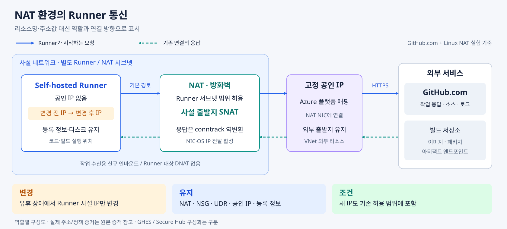
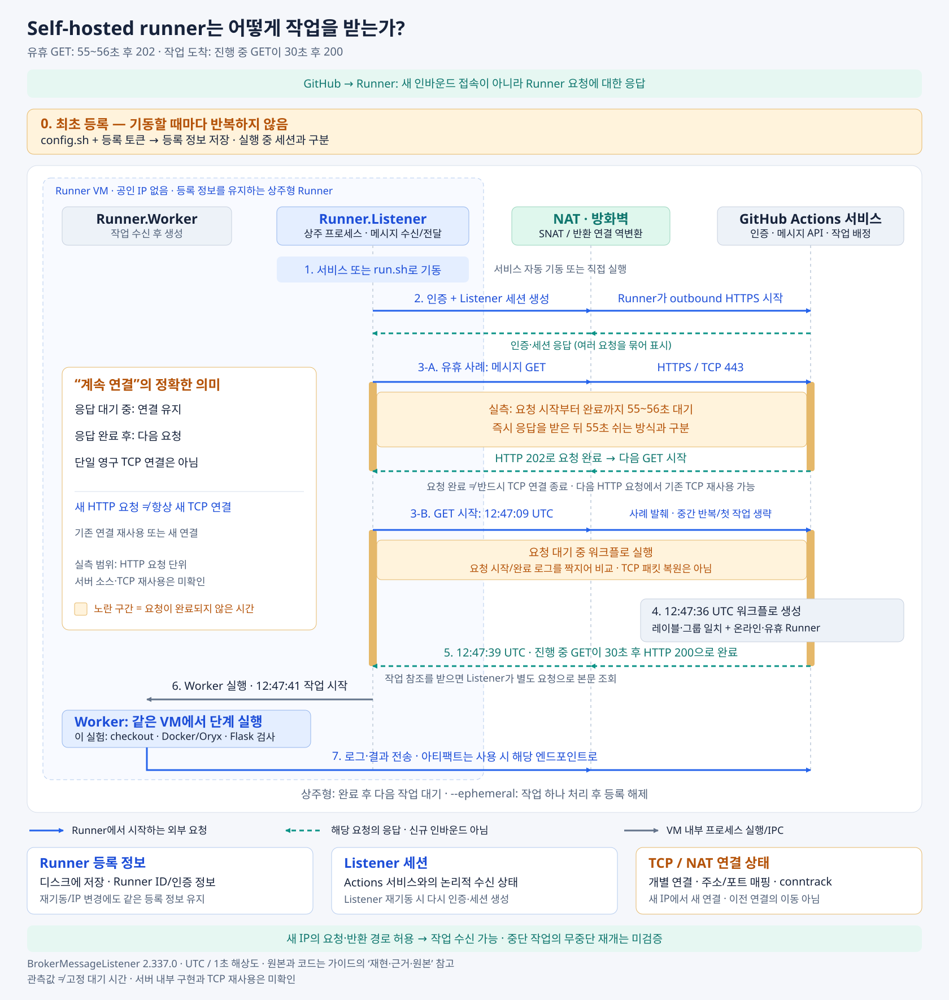
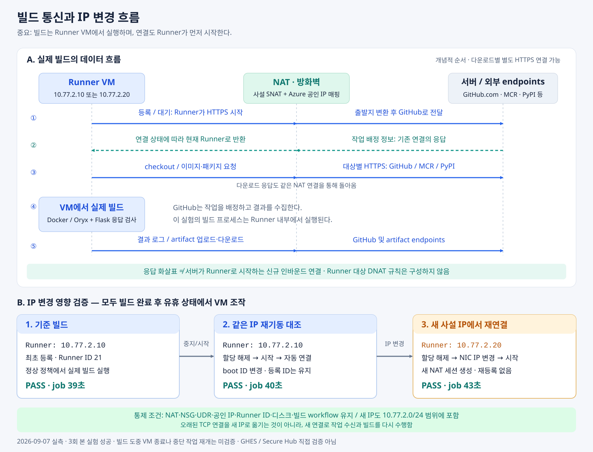
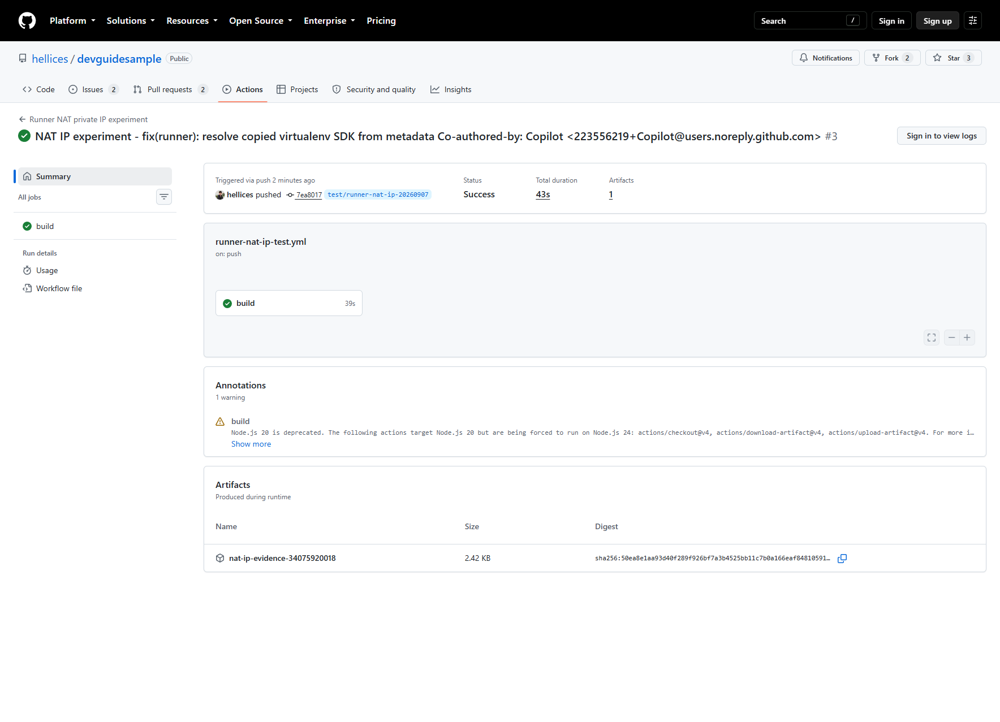
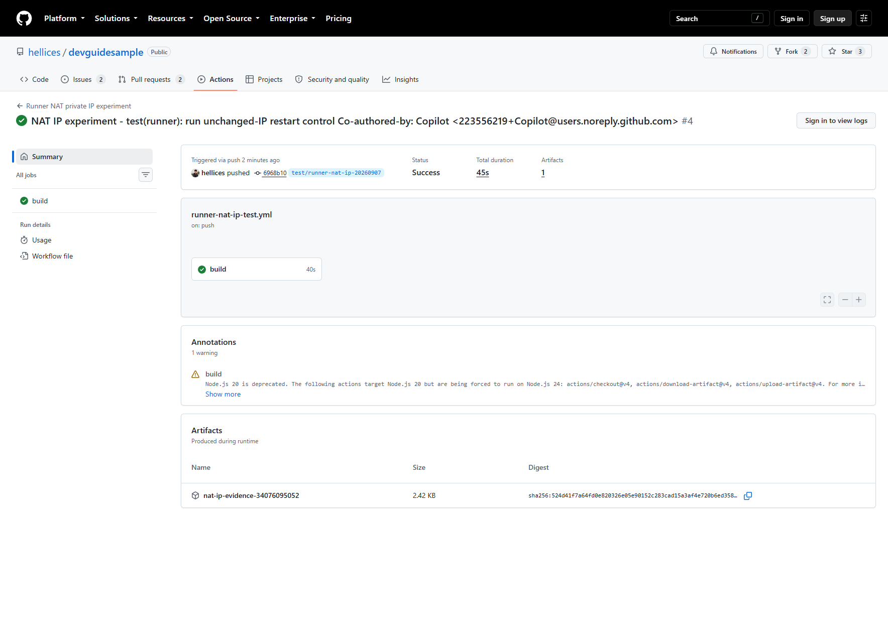
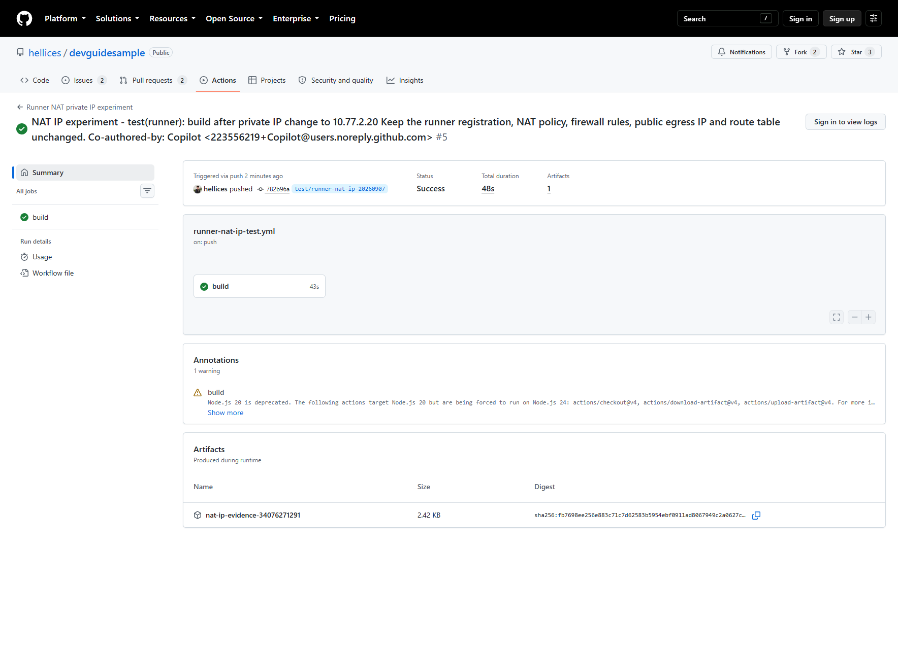

# GitHub Actions Self-hosted Runner - NAT 환경의 사설 IP 변경 검증

> 검증일: 2026-09-07 · GitHub.com / Linux 상주형 Runner

**사설 IP 변경 후에도 재등록이나 NAT·방화벽 규칙 수정 없이 작업 수신과 빌드에 성공했다.**

**적용 조건:** 새 IP도 기존 허용 범위에 포함 · 빌드가 끝난 유휴 상태에서 변경 · 등록 정보와 네트워크 정책 유지

## 1. 구성



## 2. 작업 수신 방식



## 3. 검증 결과

| 시나리오 | 등록·정책 변경 | 빌드 결과 |
|---|---|---|
| 기준 빌드 | 최초 등록 | 성공 · 39초 |
| 같은 IP로 재기동 | 없음 | 성공 · 40초 |
| 사설 IP 변경 후 기동 | 없음 | 성공 · 43초 |

검사 항목: **코드 체크아웃 · Oryx 빌드 · Flask 응답 · 아티팩트 업로드/다운로드**

<details>
<summary>빌드 흐름과 성공 화면</summary>



**기준 빌드**



**같은 IP 재기동**



**사설 IP 변경**



작업 소요 시간 기준이며, 화면의 전체 워크플로 시간과는 집계 범위가 다를 수 있다. 원본 화면에는 실험 환경 정보가 포함된다.

</details>

## 4. 적용 전 확인

| 확인 항목 | 판단 기준 |
|---|---|
| 새 IP의 허용 범위 | NAT·NSG·UDR·반환 경로 확인. 이전 IP만 허용하는 `/32` 정책은 별도 수정 필요 |
| 연결과 세션 | 등록 정보는 유지 가능. 기존 TCP 연결이나 중단된 작업이 그대로 재개되는 것은 아님 |
| 실측의 한계 | 롱 폴링과 일치하는 요청·응답 관측. **서버 내부 구현·고정 대기 시간·TCP 재사용은 미확인** |
| 다른 환경 | GHES·Secure Hub·TLS 검사·ARC/임시 Runner·장애/부하 상황은 별도 검증 |
| 종료·비용 | 점검 후 VM 할당 해제·Runner 오프라인 확인. 디스크·고정 공인 IP 비용은 별도 |

<details>
<summary>미확인 사항과 추가 점검 목록</summary>

- **서버 구현:** 공개 소스에서 `/message` 서버 핸들러를 찾지 못함. 반복문·`await`·긴 타임아웃만으로 서버의 응답 보류를 입증할 수 없음.
- **대기 시간:** 55~56초는 관측값이지 고정 설정이나 SLA가 아님. 작업 수신 제한 60초와도 구분.
- **연결:** HTTP 버전, TCP 연결·TLS 세션 재사용, 재연결 지연 미측정.
- **오류·복구:** 취소·재시도 지연·종료 분기는 코드에 존재. 네트워크 단절·인증 만료 시 실제 복구는 미검증.
- **배포 환경:** 기존 MessageListener 경로, GHES API·저장소·사설 CA, VPN·ExpressRoute, 캐시·아티팩트 액션의 호환성 확인 필요.
- **방화벽:** Azure Firewall 애플리케이션 규칙·TLS 검사·유휴 연결 제한·SNAT 포트 용량 미검증.
- **변경·부하:** 별도 DNAT/SSH/웹후크, 빌드 중 IP 변경·VM 종료, 중단 작업 재개, NAT 장비 장애·대규모/장시간 부하 미검증.
- **노출 범위:** 구성도는 역할 중심으로 표시. 원본 증적·실험 스크립트에는 실제 주소와 리소스 식별 정보가 남아 있음.

</details>

## 5. 재현·근거·원본

| 핵심 근거 | 확인할 부분 |
|---|---|
| [BrokerMessageListener](https://github.com/actions/runner/blob/397b032cbf865e9c3ddfab89d533ec19325e1273/src/Runner.Listener/BrokerMessageListener.cs#L275-L319) | 반복문 → 메시지 요청 → 결과가 없으면 재요청 |
| [MessageListener](https://github.com/actions/runner/blob/397b032cbf865e9c3ddfab89d533ec19325e1273/src/Runner.Listener/MessageListener.cs#L233-L416) | 기존 경로의 반복 수신과 재시도 지연 |
| [실측 JSON](runner-nat-lab/evidence/message-receive-timing.json) | 유휴 요청 55~56초·202, 작업 도착 시 진행 중 요청 30초·200 |
| [공식 설계](https://github.com/actions/runner/blob/397b032cbf865e9c3ddfab89d533ec19325e1273/docs/design/auth.md?plain=1#L14-L48) · [RFC 6202](https://www.rfc-editor.org/rfc/rfc6202.html#section-2.1) | 설계의 `HTTP long poll` 명시와 일반 HTTP 원리. 실행 코드·실측과 구분 |

<details>
<summary>재현 체크리스트와 IP 변경 명령</summary>

**전제:** 전용 테스트 환경 · 신뢰할 수 있는 워크플로 · 저장소 루트에서 실행

1. [Bicep](../infra/runner-nat-lab/main.bicep)·[NAT 설정](../infra/runner-nat-lab/nat-cloud-init.yml) 검토 후 배포.
2. NAT 방화벽·IP 전달 확인 → [Runner 준비](runner-nat-lab/prepare-runner.sh) → [보호된 토큰으로 등록](runner-nat-lab/register-runner.ps1). [Linux 등록 스크립트](runner-nat-lab/register-runner.sh)도 참고.
3. [테스트 워크플로](../.github/workflows/runner-nat-ip-test.yml)·[시나리오 설정](runner-nat-lab/case.json)의 브랜치·레이블·기대 IP 일치 확인.
4. `baseline` → `restart-control` → `private-ip-changed` 순서로 실행. VM 조작은 직전 빌드가 끝난 유휴 상태에서만 수행.
5. 등록 ID·부팅 ID·출발지 IP·정책 해시·이미지 다이제스트와 빌드 결과 비교. [NAT 증적 수집](runner-nat-lab/capture-nat.sh) 사용.
6. 점검 후 원래 서비스와 VM 상태 복원. 완전 폐기 시에만 Runner 등록·리소스 그룹 삭제.

**스크립트는 기존 실험용이다.** 새 환경에서는 리소스명뿐 아니라 주소·저장소·브랜치·레이블 등 고정값을 함께 검토해야 한다. 기존 Runner의 재기동에는 준비·등록 스크립트를 재실행하지 않는다.

아래는 **IP 변경 부분만** 일반화한 예시다. 값은 대상 환경에 맞게 입력한다.

```powershell
$subscription = '<subscription-id>'
$rg = '<resource-group>'
$runnerVm = '<runner-vm>'
$runnerNic = '<runner-nic>'
$ipConfig = '<ip-configuration>'
$newIp = '<private-ip-in-allowed-range>'

az vm deallocate --subscription $subscription -g $rg -n $runnerVm
az network nic ip-config update --subscription $subscription -g $rg `
  --nic-name $runnerNic --name $ipConfig --private-ip-address $newIp
az vm start --subscription $subscription -g $rg -n $runnerVm
```

- **주의:** 실험 도중 Bicep 재배포 금지. 템플릿의 초기 IP로 되돌아갈 수 있음.
- **등록:** 토큰은 `protectedParameters`로 전달. 소스·워크플로·일반 매개변수·증적에 저장 금지.
- **성공 판정:** CLI 종료뿐 아니라 Run Command의 출력과 `instanceView.exitCode = 0` 확인.
- **보안:** 전용 브랜치·레이블은 완전한 보안 경계가 아님. 불특정 PR에 재사용 금지.

**초기 구성 문제**

| 증상 | 조치 |
|---|---|
| CRLF 스크립트의 `bash\r` 오류 | Linux 스크립트와 전송 줄바꿈을 LF로 통일 |
| Python의 `libpython3.11.so.1.0` 탐색 실패 | Oryx의 `venv --copies` 확인 후 `pyvenv.cfg`의 SDK 경로 사용 |
| BCP081·Node 20 사용 중단 경고 | ARM 검증·배포·실제 빌드 성공 여부를 경고와 구분 |

</details>

<details>
<summary>요청·응답 측정 방법과 상세 기록</summary>

- 관측 경로: **BrokerMessageListener · Runner 2.337.0**
- 진단 설정: `GITHUB_ACTIONS_RUNNER_TRACE=1`, `GITHUB_ACTIONS_RUNNER_HTTPTRACE=false`
- 수집 방법: VM 안에서 같은 URL의 `Started`·`Finished` 연결 → 취소 요청 제외 → 시각·상태·정규화한 엔드포인트만 출력.
- 수집 제외: 인증 정보·URL 쿼리·세션 ID·헤더·본문. TLS 복호화나 인증서 검증 해제 없음.
- 검증 실행: 기존 워크플로 2회 성공. 요청 시작 후 작업을 등록해 진행 중 요청의 응답과 비교.

시각은 **UTC**, 시간 해상도는 **1초**다. 경과 시간은 클라이언트 로그 기준이며 서버 처리 시간만을 분리한 값은 아니다.

| 요청 시작 | 완료 | 경과 | HTTP 상태 |
|---|---|---:|---:|
| 12:42:44 | 12:43:40 | 56초 | 202 |
| 12:43:40 | 12:44:35 | 55초 | 202 |
| 12:44:35 | 12:45:30 | 55초 | 202 |
| 12:45:30 | 12:46:26 | 56초 | 202 |
| 12:46:26 | 12:46:27 | 1초 | 200 |
| 12:47:09 | 12:47:39 | 30초 | 200 |

- 두 번째 워크플로 생성 **12:47:36** → 대기 중 요청 완료 **12:47:39** → 작업 실행 **12:47:41**.
- 완료 요청 **6개**, 취소 이벤트 **2개**, 수집 시 미완료 요청 **1개**. 중복 시작·짝 없는 완료 이벤트 **0개**.
- 첫 작업 실행: **12:46:29**. 네 번째 202 응답은 첫 워크플로 생성 시점과 인접.
- **12:52:07 UTC:** 임시 진단 서비스 종료·원래 서비스 복원 후 두 VM 할당 해제, Runner 오프라인·`busy=false` 확인.

[추출 스크립트](runner-nat-lab/capture-runner-timing.sh)의 `--self-test`는 이벤트 연결·취소 제외·민감정보 출력 제외 검사다. 롱 폴링 동작은 위의 실제 요청·응답으로 확인한다. 기본 Info 로그만 있으면 추출이 실패하므로 버전별 로그 형식과 Verbose 설정을 점검한다. 같은 등록의 Listener 두 개를 동시에 실행하지 않는다.

</details>

<details>
<summary>실행 결과와 원본 증적 — 실제 환경 정보 포함</summary>

| 구분 | 원본 |
|---|---|
| 빌드 실행 | [기준](https://github.com/hellices/devguidesample/actions/runs/34075920018) · [같은 IP 재기동](https://github.com/hellices/devguidesample/actions/runs/34076095052) · [IP 변경](https://github.com/hellices/devguidesample/actions/runs/34076271291) |
| 수신 관측 실행 | [1차](https://github.com/hellices/devguidesample/actions/runs/34123696361) · [2차](https://github.com/hellices/devguidesample/actions/runs/34123808131) |
| NAT·정책 | [변경 전](runner-nat-lab/evidence/before-ip-change-nat.txt) · [변경 후](runner-nat-lab/evidence/after-ip-change-nat.txt) · [NSG·UDR·공인 IP 비교](runner-nat-lab/evidence/control-comparison.json) |
| VM·Runner | [IP 변경 이력](runner-nat-lab/evidence/private-ip-change-lifecycle.json) · [재기동 이력](runner-nat-lab/evidence/restart-control-lifecycle.json) · [OS·서비스 상태](runner-nat-lab/evidence/runner-final-online.txt) |
| 실행별 식별 기록 | [기준](runner-nat-lab/evidence/baseline/runner.json) · [재기동](runner-nat-lab/evidence/restart-control/runner.json) · [IP 변경](runner-nat-lab/evidence/private-ip-changed/runner.json) |
| 종료 상태 | [VM](runner-nat-lab/evidence/final-vm-states.json) · [Runner](runner-nat-lab/evidence/final-runner-state.json) · 수신 관측 후 상태는 위 실측 JSON 참조 |
| 빌드 대상·초기 오류 | [샘플 애플리케이션](../oryx-test) · [초기 실패 1](https://github.com/hellices/devguidesample/actions/runs/34075637562) · [초기 실패 2](https://github.com/hellices/devguidesample/actions/runs/34075798758) |

NAT 패킷 증적은 사설 주소의 SNAT 전후를 보여 준다. Azure 공인 IP 변환의 외부 캡처나 TLS 내부 메시지 기록은 아니다. 정책·이미지 해시는 원본에 유지했으며, 저장소의 사본은 GitHub 아티팩트 보관 기간(7일)과 별개다.

</details>

<details>
<summary>HTTP 요청·세션·실행 코드와 공식 참고 문서</summary>

코드 링크는 관측 버전 `v2.337.0`의 커밋에 고정했다.

| 확인 대상 | 근거 |
|---|---|
| 메시지 GET | [BrokerHttpClient](https://github.com/actions/runner/blob/397b032cbf865e9c3ddfab89d533ec19325e1273/src/Sdk/WebApi/WebApi/BrokerHttpClient.cs#L59-L112) · [기존 SDK](https://github.com/actions/runner/blob/397b032cbf865e9c3ddfab89d533ec19325e1273/src/Sdk/DTGenerated/Generated/TaskAgentHttpClientBase.cs#L458-L511): 전용 롱 폴링 대기 매개변수 없음 |
| 세션·작업 전달 | [Runner.cs](https://github.com/actions/runner/blob/397b032cbf865e9c3ddfab89d533ec19325e1273/src/Runner.Listener/Runner.cs#L393-L762) · [JobDispatcher.cs](https://github.com/actions/runner/blob/397b032cbf865e9c3ddfab89d533ec19325e1273/src/Runner.Listener/JobDispatcher.cs#L473-L505): Listener 선택·세션 생성·Worker 실행·IPC |
| 요청 취소 제한 | [VssUtil](https://github.com/actions/runner/blob/397b032cbf865e9c3ddfab89d533ec19325e1273/src/Runner.Sdk/Util/VssUtil.cs#L135-L155) · [RawHttpMessageHandler](https://github.com/actions/runner/blob/397b032cbf865e9c3ddfab89d533ec19325e1273/src/Sdk/Common/Common/RawHttpMessageHandler.cs#L140-L144): 기본 100초와 `CancelAfter`. 서버의 응답 보류 명령이 아님 |
| 진단 설정 | [TraceSetting](https://github.com/actions/runner/blob/397b032cbf865e9c3ddfab89d533ec19325e1273/src/Runner.Common/TraceSetting.cs#L11-L22) · [HostContext](https://github.com/actions/runner/blob/397b032cbf865e9c3ddfab89d533ec19325e1273/src/Runner.Common/HostContext.cs#L727-L779) |
| 시각 기록 위치 | [VssHttpEventSource](https://github.com/actions/runner/blob/397b032cbf865e9c3ddfab89d533ec19325e1273/src/Sdk/Common/Common/Diagnostics/VssHttpEventSource.cs#L521-L779) · [RawHttpClientBase](https://github.com/actions/runner/blob/397b032cbf865e9c3ddfab89d533ec19325e1273/src/Sdk/WebApi/WebApi/RawHttpClientBase.cs#L240-L275) |
| Runner 운영 | [GitHub.com 요구사항](https://docs.github.com/en/actions/reference/runners/self-hosted-runners) · [서비스 기동](https://docs.github.com/en/actions/how-tos/manage-runners/self-hosted-runners/configure-the-application) · [GHES 통신 요구사항](https://docs.github.com/en/enterprise-server@3.18/actions/reference/runners/self-hosted-runners#communication) |
| Azure 참고 | [사설 IP](https://learn.microsoft.com/en-us/azure/virtual-network/ip-services/private-ip-addresses) · [Firewall SNAT](https://learn.microsoft.com/en-us/azure/firewall/snat-private-range) · [Managed Run Command](https://learn.microsoft.com/en-us/azure/virtual-machines/linux/run-command-managed) |

</details>
