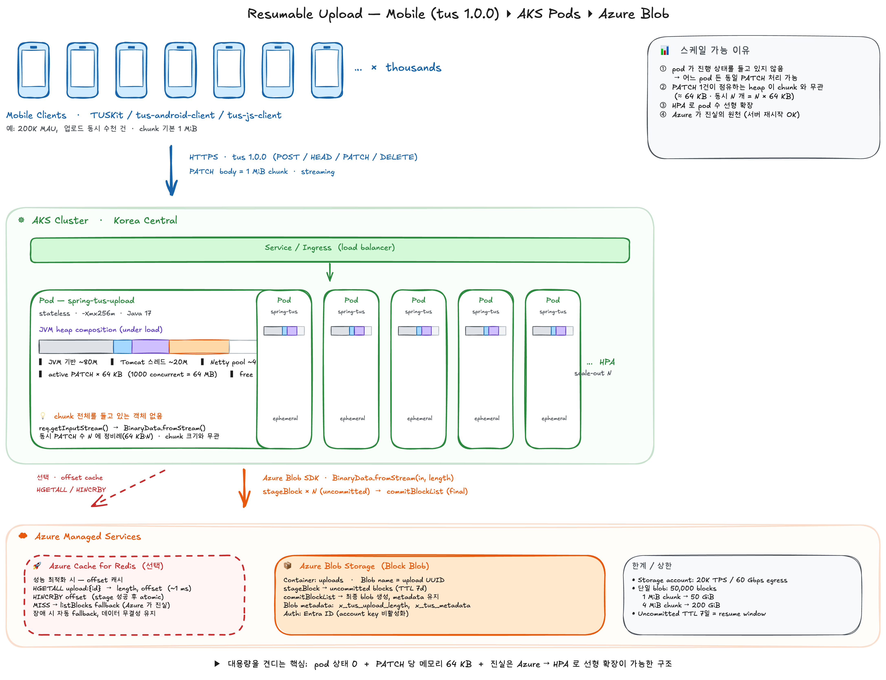

# Spring Boot Resumable Upload — tus.io ↔ Azure Block Blob

모바일 사용자 약 20만 명 규모, 일반 50 MB · 최대 200 MB 파일을 끊김 후 이어 올리되, 파드 OOM 없이 Azure Block Blob 으로 자연스럽게 흘려가게 만든 샘플.

## 요건

- **사용자 규모**: 모바일 사용자 약 20만 명. 다수가 동시에 업로드 시도 — 파드당 수십~수백 동시 PATCH 가능성
- **파일 크기**: 일반 50 MB, 최대 200 MB. 모바일 업로드 패턴상 1 MiB chunk 구조면 50~200개 PATCH/파일
- **모바일 끊김 / 이어 올리기**: 셀룰러↔WiFi 전환, 백그라운드 진입, OS suspend, 앱 강제 종료가 발생해도 처음부터 다시 보내지 않고 끊긴 지점부터 이어 올린다. iOS / Android 표준 SDK 그대로 사용 (클라이언트 커스텀 구현 회피)
- **파드 OOM 방지**: 동시 N 개의 PATCH 가 들어와도 chunk 전체(수 MB~수십 MB)를 힙에 들고 있지 않아야 함. JVM 메모리는 동시 접속 수와 무관하게 작은 자구만 유지
- **Azure Blob 으로 자연스러운 업로드**: 서버가 chunk 를 임시 버퍼링으로 재조립하지 않고, 클라이언트 chunk 가 그대로 Blob block 으로 1:1 매핑되어 흘러가야 함
- **무상태 서버**: 진행 상태를 서버 메모리/디스크나 별도 세션 저장소(Redis 등)에 두지 않음 — 파드 재시작·교체 / HPA scale / 업로드 중 다른 파드로 라우팅 되어도 손실 없음
- **Entra ID 전용**: Storage Account key 사용 금지 — AKS 에서는 Workload Identity, 로컬 개발에서는 `az login`

## 해결책 (한 줄씩)

- **HTTP**: **tus.io 1.0.0 프로토콜**. TUSKit / tus-android-client / tus-js-client 가 백그라운드 task·재시도·망 전환·재부팅 후 resume 까지 다 처리. 서버는 사양만 맞추면 됨
- **스토리지**: Azure Block Blob 의 **stage block + commit block list**. tus 의 "chunk → finalize" 와 1:1 대응 — 별도 변환 레이어 불필요
- **무상태 서버**: 외부 세션 저장소(Redis 등) 없음. PATCH 1개 = staged block 1개. 진행 offset 은 매 요청마다 `listBlocks(UNCOMMITTED)` 로 Azure 에서 다시 계산. 어떤 파드가 받든 동일 결과 → 시나리오 C 가 다른 JVM 으로 검증
- **End-to-end streaming**: `req.getInputStream()` → `BinaryData.fromStream(in, length)` 그대로 SDK 에 전달. chunk 전체를 들고 있는 객체가 경로상 **없음**. 동시 PATCH N 개라도 힙 ≈ N × ~64 KB (Tomcat read buffer + Netty pooled chunk)
- **재시도 위치 이동**: stream 이 non-replayable 이라 Azure SDK 의 transient retry 는 꺼지지만, 그게 정확히 **클라이언트의 HEAD → PATCH 루프**가 담당하는 일 — 시나리오 D 로 검증
- **인증**: `DefaultAzureCredential`. 로컬 개발은 `AzureCliCredential`, AKS 에선 Workload Identity 가 자동으로 끼워짐. Storage Account 는 `--allow-shared-key-access false` 로 키 자체를 막아둠


## 아키텍처



편집 원본: [spring-resumable-upload/architecture.excalidraw](spring-resumable-upload/architecture.excalidraw)

샘플 코드 위치: [spring-resumable-upload/](spring-resumable-upload/)

## 왜 tus 인가

모바일 업로드의 어려운 부분(백그라운드 진입, 셀룰러↔WiFi 전환, OS suspend, 부분 재전송 자체)은 클라이언트 SDK 영역이다. **TUSKit (iOS)** 과 **tus-android-client + WorkManager** 가 그걸 이미 다 풀어두었으므로, 서버를 tus 사양에 맞추면 안드/iOS 양쪽 모바일팀이 SDK를 그대로 가져다 쓸 수 있다.

내부 매핑은 자연스럽다 — tus의 "stage chunk + finalize" 흐름이 Azure Block Blob의 "stage block + commit block list" 모델과 1:1로 대응한다.

## 프로토콜 요약 (구현된 부분)

| HTTP | 경로 | 동작 | Azure 호출 |
|---|---|---|---|
| `OPTIONS` | `/files` | 지원 버전·확장 광고 | (없음) |
| `POST` | `/files` | `Upload-Length`, `Upload-Metadata` 받아 upload id 생성 | `uploadWithResponse(empty, metadata)` — 빈 blob에 메타데이터 저장 |
| `HEAD` | `/files/{id}` | 현재 `Upload-Offset` 반환 (이어 올릴 지점) | `getProperties` + `listBlocks(UNCOMMITTED)` |
| `PATCH` | `/files/{id}` | body=chunk를 누적 offset에 append. 누적이 length 도달 시 commit | `stageBlock`, 마지막엔 `commitBlockListWithResponse(metadata 유지)` |
| `DELETE` | `/files/{id}` | upload 폐기 | `delete()` |

구현된 확장: `creation`, `termination`. 미구현: `expiration`, `checksum`, `concatenation`.

서버에 in-memory session 보관 없음. id가 곧 blob 이름이며, 진행 상태는 항상 Azure에서 읽는다.

### Block ID 매핑

각 PATCH = 1개 staged block. block id = `base64("block-" + 8자리 zero-padded index)`. 모든 block id 길이가 동일해야 한다는 Azure 제약을 충족.

### Edge cases

- `Upload-Offset` 가 서버 현재 offset과 다르면 → **409 Conflict**
- `Content-Length` 없거나 chunked transfer-encoding이면 → **411 Length Required**
- 클라이언트가 PATCH body를 끝까지 안 보내면 → Azure가 Content-Length 불일치로 거부하고 SDK exception 발생, block은 stage 되지 않으므로 offset 변화 없음
- `Tus-Resumable` 헤더 누락/불일치 → **412 Precondition Failed** (`Tus-Version` 으로 지원 버전 알려줌)

### 데이터 흐름 (end-to-end streaming)

<details>
<summary>PATCH 한 건이 힙을 거치지 않고 Azure 까지 흘러가는 경로</summary>

```
Mobile client
    │  PATCH /files/{id}  Content-Length=1048576
    │  body = 1 MiB chunk
    ▼
TusController.patch()                  ← byte[] 할당 없음
    │  req.getInputStream()             ← Tomcat 8 KB 링버퍼
    ▼
TusUploadService.appendChunk(...,InputStream,length)
    │  BinaryData.fromStream(in, length) ← non-replayable, SDK retry off
    ▼
BlockBlobClient.stageBlock(blockId, BinaryData)
    │  Netty가 8 KB 단위로 socket→socket relay
    ▼
Azure Storage (block staged, not yet committed)
```

</details>

전체 경로에서 chunk 1개를 한 번에 들고 있는 객체가 **없다**. PATCH가 동시 N개 들어와도 힙 점유는 N × (Tomcat read buffer + Netty pooled chunks) ≈ N × ~64 KB.

## 사전 준비

### 1. Storage Account (Entra ID 전용)

<details>
<summary>Storage Account 생성 + RBAC 부여</summary>

```bash
az login

RG=rg-resumable-upload
ACCT=stresumableup$RANDOM
LOC=koreacentral

az group create -n $RG -l $LOC
az storage account create -n $ACCT -g $RG -l $LOC --sku Standard_LRS \
    --allow-blob-public-access false \
    --allow-shared-key-access false                 # account key 사용 자체를 막음

SCOPE=$(az storage account show -n $ACCT -g $RG --query id -o tsv)
ME=$(az ad signed-in-user show --query id -o tsv)
az role assignment create --assignee-object-id "$ME" \
    --assignee-principal-type User \
    --role "Storage Blob Data Contributor" \
    --scope "$SCOPE"

sleep 60   # role propagation
```

</details>

### 2. 환경 변수

<details>
<summary>env</summary>

```bash
export AZURE_STORAGE_ACCOUNT=$ACCT
export AZURE_STORAGE_CONTAINER=uploads
```

</details>

`DefaultAzureCredential` 이 `az login` 컨텍스트(`AzureCliCredential`) 를 자동으로 집어간다.

### 3. Python deps

<details>
<summary>pip install</summary>

```bash
pip install requests
```

</details>

## 빌드 & 실행

<details>
<summary>build &amp; run</summary>

```bash
cd azureblob/spring-resumable-upload
mvn -DskipTests package
java -jar target/spring-resumable-upload-0.1.0.jar
# or: mvn spring-boot:run
```

</details>

8080 포트에서 listen.

## 테스트 시나리오

### 0. 테스트 파일

<details>
<summary>50 MB 테스트 파일 생성</summary>

```bash
cd spring-resumable-upload/scripts
./make-test-file.sh test-50mb.bin 50
```

</details>

### 시나리오 A — 정상 streaming 업로드

50 MB 파일을 1 MiB chunk × 50번의 PATCH로 올린다. 마지막 PATCH에서 서버가 자동으로 `commitBlockList` 호출.

<details>
<summary>실행</summary>

```bash
python3 tus_client.py upload --file test-50mb.bin
# 출력 마지막 줄에 upload id가 찍힘
./verify-blob.sh test-50mb.bin <printed-upload-id>
```

</details>

확인 포인트:
- 서버 로그: `POST /files` 1회, `PATCH /files/{id}` 50회
- 클라이언트 출력: `PATCH #1` ~ `PATCH #50`, 마지막에 `committed blob ...`
- 서버 JVM 힙: PATCH 1개당 ~64 KB 만 점유 (Tomcat read buffer + Netty pooled chunk). `-Xmx256m` 으로 가동해도 RSS 누적 없음 (실측: 50개 PATCH 처리 중 RSS 오히려 8 MB 감소).

### 시나리오 B — 모바일 앱이 강제 종료된 후 같은 업로드 재개 (핵심)

목적: 모바일 환경의 표준 케이스. 앱이 백그라운드에서 OS에 의해 kill 되어도 다음 실행 때 정확히 이어 올림.

<details>
<summary>stop-after → HEAD → resume → verify</summary>

```bash
# 1) 20개 chunk만 PATCH 후 종료. upload-id 출력됨.
python3 tus_client.py upload --file test-50mb.bin --stop-after 20
# → 마지막 줄: "to resume: --id <UUID>"

# 2) 서버에 어디까지 받았는지 직접 묻기 (모바일 SDK가 부팅 시 하는 일)
python3 tus_client.py head --id <UUID>
# → offset=20971520 length=52428800 progress=40.0%

# 3) 같은 id로 재실행 → HEAD로 offset 확인 후 21번째 chunk부터 PATCH
python3 tus_client.py upload --file test-50mb.bin --id <UUID>
# → "server offset=20971520/52428800 (40.0%)"
# → PATCH #1 offset=20971520 ... (남은 30개만)

# 4) 바이트 정확성 검증
./verify-blob.sh test-50mb.bin <UUID>
```

</details>

### 시나리오 C — 서버 프로세스 재시작 후에도 재개 가능 (무상태성 증명)

목적: 서버에 in-memory 세션 상태가 없음을 확인. 진행 상태는 Azure에만 있다.

<details>
<summary>서버 재시작 후 같은 upload id로 재개</summary>

```bash
# 터미널 1 (클라이언트)
python3 tus_client.py upload --file test-50mb.bin --stop-after 25
# id 메모

# 터미널 2 (서버)
#   Ctrl-C 로 종료 → 다시 `mvn spring-boot:run`

# 터미널 1 (클라이언트, 서버 재시작 후)
python3 tus_client.py head --id <UUID>
# → 여전히 offset=20971520 (서버는 처음 보지만 Azure가 기억)

python3 tus_client.py upload --file test-50mb.bin --id <UUID>
./verify-blob.sh test-50mb.bin <UUID>
```

</details>

### 시나리오 D — PATCH 단위 실패 + 자동 재시도 (모바일 망 불안정 시뮬)

목적: 임의의 한 chunk 전송이 실패해도 클라이언트가 HEAD로 권위 있는 offset을 다시 받아서 그 지점부터 이어 올리는, 모바일 SDK의 표준 retry 패턴을 검증.

<details>
<summary>실행</summary>

```bash
# 10번째 PATCH 시도 시 강제로 망 끊김 시뮬레이션 (chunk 미전송)
python3 tus_client.py upload --file test-50mb.bin --fail-on-patch 10
```

</details>

<details>
<summary>기대 출력 (요약)</summary>

```
PATCH #9  offset=8388608 size=1048576 -> new_offset=9437184
PATCH #10 offset=9437184: INJECTED FAULT (chunk not sent)
PATCH failed (fail-on-patch), HEAD to re-sync
server says offset=9437184, resuming
PATCH #11 offset=9437184 size=1048576 -> new_offset=10485760
...
done: sent 50 chunk(s) over 51 attempt(s)
committed blob id=<UUID> size=52428800
```

</details>

핵심: **fault 직후 HEAD가 마지막 성공 offset을 반환** — 서버는 실패한 chunk를 기록하지도, 잘못 기록하지도 않았다. 재시도 시 동일 offset으로 다시 PATCH하면 새 block index에 stage 되어 정상 commit.

## 검증 결과 요약

| 항목 | 동작 | 실측 (50 MB / 1 MiB chunk / `-Xmx256m`) |
|---|---|---|
| 메모리 streaming | PATCH body가 힙에 누적되지 않음 | 50개 PATCH 동안 RSS 변화 -8 MB (누적 0) |
| chunk 단위 resume | 받은 chunk는 다시 안 받음 | stop-after 20 → resume 시 PATCH 30개만 전송 |
| 서버 무상태 | 서버 재시작·교체에도 진행 상태 보존 | PID 41650 → 45078 (다른 JVM)에서 offset 26214400부터 이어 올림 |
| 자동 재시도 | client가 HEAD로 권위 offset 재동기화 후 같은 chunk 재전송 | fail-on-patch 10 → "50 chunks over 51 attempts" |
| 표준 프로토콜 | TUSKit / tus-android-client / tus-js-client 같은 기성 SDK와 무조건 호환 | — |
| Entra ID 전용 | account key 비활성화 (`--allow-shared-key-access false`) 상태 동작 | DefaultAzureCredential → AzureCliCredential |
| 바이트 정확성 | commit 후 `verify-blob.sh` 의 `cmp` 통과 | 4 시나리오 모두 통과 |

## 알아둘 점

- **Uncommitted block TTL은 7일.** 그 사이 commit이 없으면 staged block GC. 즉 resume window가 7일.
- **단일 blob 최대 50,000 blocks.** 1 MiB chunk면 ~50 GiB, 4 MiB chunk면 ~200 GiB까지 1 blob 가능. 50 MB 테스트는 신경 쓸 일 없음.
- **Concurrent PATCH on same upload는 지원하지 않음** — tus 사양상 PATCH는 순차다. 동일 upload-id에 동시 PATCH 두 개가 들어오면 offset 충돌(409)이 난다. 동일 파일을 병렬화하려면 `concatenation` 확장이 필요한데 이 샘플엔 없음.
- **PATCH는 end-to-end streaming.** `req.getInputStream()` 을 그대로 `BinaryData.fromStream(in, length)` 로 SDK에 넘긴다. chunk 전체를 들고 있는 객체는 없음. 대신 stream이 non-replayable 이므로 Azure SDK의 transient retry 가 비활성화된다 — **재시도는 클라이언트의 HEAD→PATCH 루프가 담당**한다 (시나리오 D가 정확히 이 경로를 검증).
- **chunk 크기 선택.** 기본 1 MiB는 모바일 셀룰러 환경(끊김 시 손실 최소화)에 맞춘 값. WiFi/유선 환경이면 `--chunk-size $((4*1024*1024))` 같이 늘리면 PATCH 횟수가 줄어 throughput이 올라간다. block 수 제한(50,000)과 끊김 손실의 trade-off.
- **메타데이터 보존**: `commitBlockList` 는 metadata를 덮어쓰므로, 최종 commit 시 POST에서 저장해둔 `x_tus_*` 메타를 다시 넘겨준다 (TusUploadService.appendChunk).
- **TLS / 인증 / CORS**: 이 샘플은 평문 HTTP, 익명 접근. 운영에서는 HTTPS + Spring Security + 모바일 앱 인증(Entra ID, Firebase Auth, JWT 등) 필요.
- **다중 파드 확장**: 외부 상태(Redis 등) 불필요. id가 곧 blob 이름이고 진행 상태는 Azure가 보관 — 어떤 파드가 PATCH를 받든 `listBlocks(UNCOMMITTED)` 로 오프셋을 다시 계산한다. 시나리오 C가 "다른 JVM" 케이스로 이를 입증.
- **성능 최적화 옵션 — Redis 캐시 도입.** 정확성/단순성 측면에선 현재 설계로 충분하지만, 대규모(예: 200K MAU 수준)에서 latency·storage transaction 비용을 더 줄이려면 Redis를 **캐시 계층**으로 끼울 수 있다.
  - 현재: HEAD/PATCH 1회당 `getProperties` + `listBlocks` (Azure RTT 2회, p99 30~50 ms)
  - Redis 추가 시: `HGETALL upload:{id}` 1 RTT(~1 ms) + 성공 후 `HINCRBY offset`. Azure metadata 호출 1회 절감
  - 200K MAU × 1.5 업로드/일 × 50 chunk 기준 storage transaction 비용 ~$400/월 → ~$0 (Redis Basic C1 ~$50/월 추가)
  - **단 source of truth는 그대로 Azure로 두고 Redis는 캐시로만 사용.** MISS 시 `listBlocks`로 fallback해서 Redis에 재적재. Redis 장애가 데이터 무결성을 깨지 않음. 시나리오 C(서버 재시작)도 그대로 작동
  - 코드 변경 폭은 작음 — `TusUploadService.status` / `appendChunk` 에 HGETALL / HINCRBY 두 줄과 try-fallback만 추가

## 모바일 SDK 연동 참고

| 플랫폼 | SDK | 핵심 사용법 |
|---|---|---|
| iOS | [TUSKit](https://github.com/tus/TUSKit) | `let tusClient = TUSClient(server: URL(...), sessionIdentifier: "uploads", storageDirectory: ...)` |
| Android | [tus-android-client](https://github.com/tus/tus-android-client) | `TusUpload upload = new TusUpload(file); TusUploader uploader = tusClient.resumeOrCreateUpload(upload);` |
| RN/웹 | [tus-js-client](https://github.com/tus/tus-js-client) | `new tus.Upload(file, { endpoint, retryDelays: [0, 3000, 5000, 10000, 20000], chunkSize, onProgress, onSuccess })` |

세 SDK 모두 백그라운드 task, 망 전환, 재부팅 후 resume까지 자동으로 처리한다. 서버는 이 샘플 그대로면 호환.
