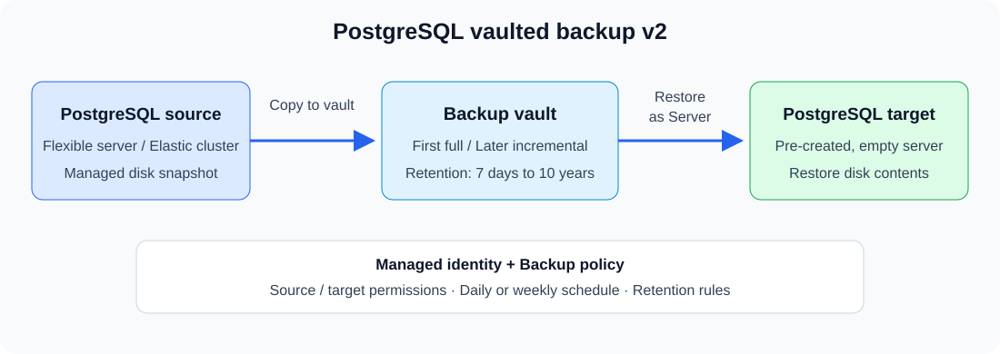
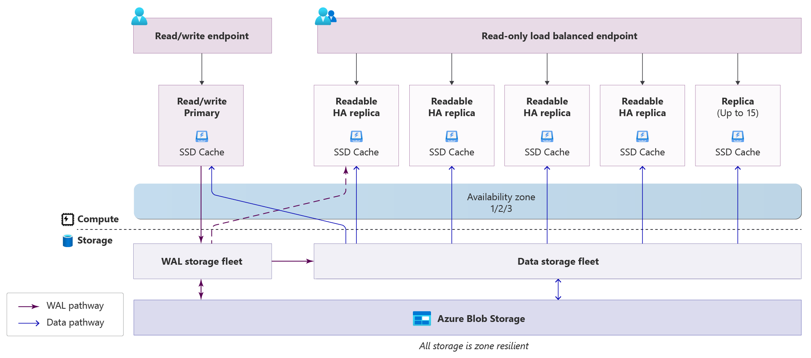

# Azure 일일 업데이트 브리핑 — 2026-10-06

**PostgreSQL 백업 v2**는 대용량 서버·elastic cluster를 snapshot으로 백업하고
서버에 직접 복원하는 기능입니다. **HorizonDB는 프리뷰 리전을 확대**했으며,
**Application Gateway WAF는 IPv6 트래픽 보호**를 프리뷰로 제공합니다.
Fabric에는 개별 table을 찾는 OneLake Catalog 검색이 예고됐습니다.

**이번 보고서의 업데이트**

- **AI & Apps:** [Fabric — OneLake Catalog table 검색](#onelake-table-search)
- **Infra:** [Application Gateway WAF — IPv6 보호](#waf-ipv6)
- **Database:** [PostgreSQL 백업 v2](#postgresql-backup-v2) ·
  [HorizonDB 리전 확대](#horizondb-regions) ·
  [SQL Server on Azure VM — Azure Bleu GA](#azure-bleu)

## 주요 업데이트

### Azure Backup for PostgreSQL v2 — Public Preview { #postgresql-backup-v2 }

**`pg_dump` 대신 disk snapshot으로 백업하고, PostgreSQL 서버에 직접 복원**

PostgreSQL의 데이터를 장기간 보존하려면 운영 서버와 분리된 복구 지점이 필요합니다.
기존 Azure Backup v1은 `pg_dump` 기반 논리 백업을 주 1회 수행하고,
복원 시 storage container에 받은 파일을 수동으로 import하는 방식이었습니다.

이번 v2는 **managed disk snapshot 기반 physical backup**으로 전환합니다.
보호 대상을 flexible server에서 elastic cluster까지 넓히고, 대용량 데이터의
증분 백업과 **Restore as Server**를 제공합니다.

*Microsoft Learn [백업 v2 개요](https://learn.microsoft.com/azure/backup/backup-azure-postgresql-flex-server-elastic-cluster-v2-overview)의
backup·restore flow를 바탕으로 새로 그린 개념도입니다.*

**백업·복원 동작**

1. Backup vault의 Managed identity 권한과 백업 주기·보존 정책을 설정합니다.
2. Azure Backup이 PostgreSQL Resource provider에 disk snapshot 생성을 요청합니다.
   첫 백업은 전체 disk 데이터를, 이후에는 이전 snapshot과의 **변경 block만** vault로 전송합니다.
3. vault에 복사가 끝나면 복구 지점이 생성됩니다. daily·weekly 백업과 on-demand
   백업을 지원하며, daily·weekly·monthly·yearly 복구 지점의 보존 기간을
   **7일에서 10년까지** 각각 설정할 수 있습니다.
4. 복원은 **미리 만든 빈 target server 또는 cluster**의 disk에 직접 수행합니다.
   중간 storage account나 수동 `pg_restore`가 필요하지 않습니다.

**기존 v1과 달라지는 점**

- **규모:** v1의 최대 1 TB에서 Premium SSD v1 **32 TB**, Premium SSD v2
  **64 TB**까지 확대됩니다.
- **빈도:** 주 1회 full backup에서 daily·weekly 증분 백업으로 바뀝니다.
  목표 RPO는 1일이지만, 큰 initial backup이나 변경량이 많은 서버에서는 보장되지 않습니다.
- **보존 보호:** vault의 soft delete·Multi-user authorization과 WORM immutability를
  적용할 수 있습니다. immutability를 잠그면 관리자도 보존 기간 전에 복구 지점을 삭제할 수 없습니다.
- **복원 단위:** 개별 database·table이 아니라 **전체 server 또는 cluster**입니다.
  target은 source와 같은 PostgreSQL major version·disk type·disk size를 사용하고,
  HA·geo-replica가 구성되지 않은 빈 서버여야 합니다.

**지원 범위:** PostgreSQL **15 이상**, General Purpose·Memory Optimized의
primary server를 지원합니다. 대부분의 public region에서 제공되며,
공식 [지원 목록의 제외 리전](https://learn.microsoft.com/azure/backup/backup-azure-postgresql-flex-server-elastic-cluster-v2-support-matrix#supported-regions-for-azure-postgresql-flex-server-and-elastic-cluster-vaulted-backup-v2)은
Austria East·Belgium Central·Chile Central·Indonesia Central·Israel Northwest·
Malaysia South·Malaysia West·Mexico Central·Qatar Central·South Central US 2·
Southeast US·Southeast US 3·Southeast US 5·Southwest US·West India입니다.
Backup vault는 datasource와 같은 리전에 둡니다.
공지에 따르면 **2026-10-15부터 과금**이 시작됩니다.

**공식 자료:**
[프리뷰 발표](https://azure.microsoft.com/updates?id=573425) ·
[구조·백업·복원 동작](https://learn.microsoft.com/azure/backup/backup-azure-postgresql-flex-server-elastic-cluster-v2-overview) ·
[지원 범위·제한](https://learn.microsoft.com/azure/backup/backup-azure-postgresql-flex-server-elastic-cluster-v2-support-matrix)

### Azure HorizonDB — 프리뷰 리전 확대 { #horizondb-regions }

**Compute와 storage를 분리한 PostgreSQL 서비스의 배치 선택지 확대**

HorizonDB는 PostgreSQL 기반의 fully managed database입니다.
Compute replica마다 데이터 전체를 별도로 복제하는 대신,
**여러 compute replica가 zone-resilient storage를 공유**하도록 설계됐습니다.
이번 공지는 새로운 GA 발표가 아니라 **Public Preview 서비스의 리전 확대**입니다.

*출처: Microsoft Learn,
[What is Azure HorizonDB? — Architecture](https://learn.microsoft.com/azure/horizondb/overview#architecture-of-azure-horizondb).
그림을 선택하면 원본 크기로 볼 수 있습니다.*

**구조와 동작**

- **Compute:** PostgreSQL engine이 query·transaction을 처리합니다.
  하나의 primary가 쓰기를 담당하고, readable standby replica는 읽기와 failover에 사용됩니다.
  Read-write endpoint는 primary를, read-only endpoint는 readable replica들을 가리킵니다.
- **WAL service:** primary가 변경 사항을 Write-ahead log로 durable log service에
  기록한 뒤 client에 응답합니다. Compute가 data page를 storage에 직접 쓰는 방식이 아닙니다.
- **Data storage:** 해당 shard의 WAL을 적용해 data page를 구성하고,
  Azure Blob Storage가 데이터·WAL의 내구성을 제공합니다.
- **확장:** Compute와 storage를 독립적으로 확장합니다. Read replica가 같은
  storage를 공유하므로 replica를 추가할 때 전체 데이터를 새로 복제하지 않습니다.

**지원 리전**

- **미주:** Canada Central, Central US, East US, West US 2, West US 3.
- **유럽:** Germany West Central, Sweden Central.
- **아시아·태평양:** Australia East, **Korea Central**.
  Korea South는 공식 목록에 없습니다.

공지는 추가된 리전을 개별적으로 열거하지 않습니다. 위 목록은 Microsoft Learn의
공식 가용 목록이며, 일부 리전은 신규 배포가 제한될 수 있습니다.
리전 확대와 별개로 **cross-region read replica·DR replication은 아직 지원하지 않으며**,
backup retention은 7일로 고정돼 있습니다.

**공식 자료:**
[리전 확대 발표](https://azure.microsoft.com/updates?id=572940) ·
[구조·리전·프리뷰 제한](https://learn.microsoft.com/azure/horizondb/overview)

### Application Gateway WAF — IPv6 보호 Public Preview { #waf-ipv6 }

**IPv4와 IPv6 요청에 WAF inspection·enforcement·diagnostics 적용**

Dual-stack 애플리케이션은 IPv4와 IPv6를 모두 받습니다.
이번 기능은 IPv6 frontend로 들어오는 요청에도 WAF의 managed rule set·
custom rule·diagnostics를 적용해, 주소 체계가 달라도 같은 보호 기능을 쓰도록 합니다.
**IPv6 backend 지원이 추가된 것은 아닙니다.**

**요청 처리와 규칙**

- **Frontend:** dual-stack Application Gateway v2가 IPv4·IPv6 client 요청을 받습니다.
  WAF가 검사·정책 적용을 수행하고, 허용된 요청은 IPv4 backend로 전달됩니다.
- **기본 보호:** managed rule set 검사, non-geo custom rule, logging·diagnostics는
  별도 preview feature 등록 없이 사용할 수 있습니다.
- **Geo-based rule:** IPv6 주소의 국가·지역을 평가하려면 subscription에
  `Microsoft.Network/AllowAppGwWafIpv6Geo`를 등록합니다.
  WAF policy는 IPv6 geo 평가를 지원하는 dual-stack gateway에 연결해야 합니다.

**지원 범위:** WAF IPv6 보호는 Public Preview입니다.
기반인 IPv6 Application Gateway는 v2가 지원되는 모든 public region과
Azure Government·Microsoft Azure operated by 21Vianet에서 제공됩니다.
기존 IPv4-only gateway는 dual-stack으로 변환할 수 없어 새 gateway가 필요하며,
IPv6-only gateway·IPv6 backend·IPv6 Private Link·AGIC의 IPv6 구성은 지원하지 않습니다.

**공식 자료:**
[프리뷰 발표](https://azure.microsoft.com/updates?id=573861) ·
[IPv6 WAF 규칙·등록 범위](https://learn.microsoft.com/azure/web-application-firewall/ag/custom-rules-geo-based-ipv6) ·
[Dual-stack frontend 구성](https://learn.microsoft.com/azure/application-gateway/ipv6-application-gateway-portal)

### Microsoft Fabric — OneLake Catalog table 검색 { #onelake-table-search }

**Item 안의 table을 개별 검색 결과로 발견**

OneLake Catalog는 Fabric의 데이터 항목을 찾아 이해하는 검색·탐색 경험입니다.
이번 table discovery 프리뷰는 semantic model·lakehouse·mirrored database 안의
table까지 **개별 검색 결과**로 노출합니다.
Table 이름·설명으로 찾거나 **정확히 일치하는 column 이름**으로 table을 찾을 수 있습니다.

**2026-10-15부터** global search·OneLake Catalog UI·Search API뿐 아니라
Fabric MCP server의 검색, Fabric CLI의 `/find`, discovery skill에도 적용됩니다.

**검색 가능 여부와 데이터 접근은 다릅니다.**
Parent item에 Read 이상 권한이 있으면 query 권한이 없는 table도 검색에 보일 수 있지만,
검색이 데이터 접근 권한을 새로 부여하지는 않습니다.
Object-level security로 보호된 semantic model table은 검색에서 제외됩니다.
관리자는 기본 활성화된 **Users can find objects in search** tenant 설정으로
table 검색 노출 여부를 제어할 수 있습니다.

**공식 자료:**
[적용 일정·검색 권한 발표](https://azure.microsoft.com/updates?id=573875) ·
[Fabric 신규 기능](https://learn.microsoft.com/fabric/fundamentals/whats-new) ·
[OneLake Catalog 개요](https://learn.microsoft.com/fabric/governance/onelake-catalog-overview)

## 기타 업데이트

### SQL Server on Azure VM — Azure Bleu GA { #azure-bleu }

프랑스 sovereign cloud 환경인 Azure Bleu에서 SQL Server on Azure VM을
배포·관리할 수 있게 됐습니다. 일반 public cloud 리전 추가가 아니라
해당 sovereign cloud의 서비스 가용성 확대입니다.
[발표](https://azure.microsoft.com/updates?id=571499) ·
[SQL Server on Azure VM 개요](https://learn.microsoft.com/azure/azure-sql/virtual-machines/windows/sql-server-on-azure-vm-iaas-what-is-overview)
