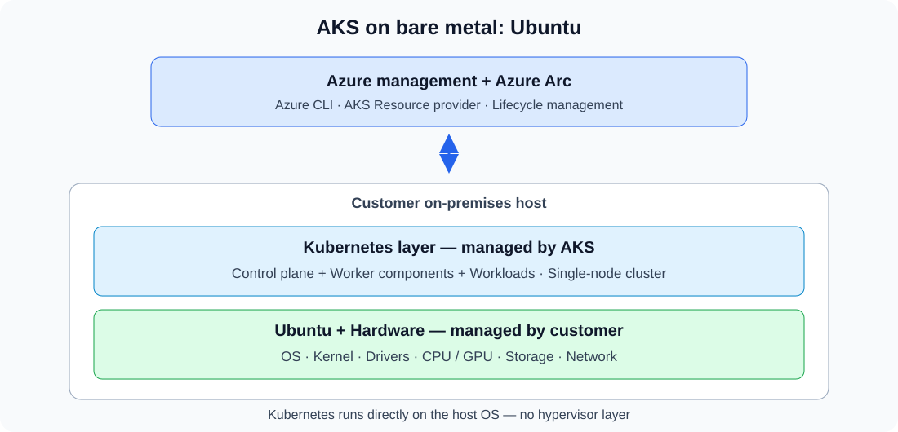
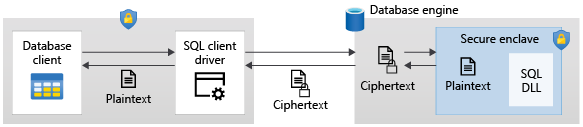

# Azure 일일 업데이트 브리핑 — 2026-10-07

**AKS on bare metal의 Ubuntu 옵션**이 Public Preview로 공개됐습니다.
고객 하드웨어에서 hypervisor 없이 Kubernetes를 실행하고 Azure Arc로 관리합니다.
지원 종료 공지는 **Azure SQL의 SGX enclave, AKS pod 메트릭, App Service**에
영향을 주므로 기능 소개와 별도로 대응 일정을 정리했습니다.

**이번 보고서의 업데이트**

- **AI & Apps:** [App Service — Java 8·11·17 지원 종료](#app-service-java) ·
  [Azure Stack Hub의 App Service 종료](#stack-hub-app-service)
- **Infra:** [AKS on bare metal — Ubuntu 프리뷰](#aks-bare-metal-ubuntu) ·
  [AKS platform metrics — Pod name dimension 종료](#aks-pod-metrics)
- **Database:** [Always Encrypted — Intel SGX 종료·VBS 전환](#always-encrypted-sgx)

## 주요 업데이트

### AKS on bare metal — Ubuntu Public Preview { #aks-bare-metal-ubuntu }

**기존 Ubuntu 서버에 Kubernetes를 직접 설치하고 Azure에서 관리**

온프레미스·edge에서 Kubernetes를 실행할 때는 로컬 데이터와 CPU·GPU,
driver·runtime을 유지하면서 클러스터 관리 방식도 일관되게 가져갈 필요가 있습니다.
AKS on bare metal은 **hypervisor 없이 host OS와 하드웨어에서
Control plane·worker component를 직접 실행**하는 배포 모델입니다.

이번 Ubuntu 옵션은 고객이 보유한 하드웨어에 Azure CLI로 AKS를 추가합니다.
Azure Local의 검증된 하드웨어와 Azure Linux를 사용하는 옵션과 달리,
**Ubuntu host를 다시 이미징하지 않고 기존 인프라를 활용**할 수 있습니다.
Kubernetes는 AKS가 관리하고, Ubuntu OS·kernel·driver·하드웨어는 고객이 관리합니다.

*Microsoft Learn [AKS on bare metal 개요](https://learn.microsoft.com/azure/aks-hybrid-edge/bare-metal/aks-bare-metal-overview)의
세 계층과 host 관리 책임 설명을 바탕으로 새로 그린 개념도입니다.*

**구조와 동작**

- **Azure management·Azure Arc:** host와 Kubernetes cluster를 Azure에 연결합니다.
  Kubernetes lifecycle을 Azure와 AKS Resource provider를 통해 관리합니다.
- **Kubernetes layer:** Control plane과 worker component가 host에서 실행합니다.
  워크로드는 표준 Kubernetes API·도구로 관리하고, networking은 Cilium CNI를 사용합니다.
- **Ubuntu host:** 고객이 CPU·GPU 하드웨어와 소프트웨어 stack을 선택하고 유지합니다.
  워크로드·데이터를 온프레미스에 두면서 Azure의 관리 모델을 연결하는 구조입니다.

**프리뷰에서 제공하는 범위**

- **Ubuntu 24.04.3 LTS·24.04.4 LTS**, x86_64 하드웨어를 지원합니다.
  현재는 host당 **single-node cluster 하나**이며 multi-node 확장은 지원하지 않습니다.
- Cluster 생성·관리·patch upgrade는 **Azure CLI**로 수행합니다.
  Ubuntu 옵션의 Azure portal은 상태 조회용이며, portal·ARM·Bicep으로 생성하지 않습니다.
- 기본 Kubernetes 버전은 **1.33.3**이고, 현재는 patch-version upgrade만 지원합니다.
- Azure 리소스 가용 리전은 **East US만**입니다.
  Korea Central·Korea South는 아직 지원 목록에 없습니다.
  이는 온프레미스 실행 위치와 별개인 Azure 관리 리소스의 리전 범위입니다.

!!! note "Public Preview 범위"
    SLA에서 제외되며 production용 기능이 아닙니다.
    GA로 전환할 때 in-place upgrade가 지원되지 않아 cluster를 다시 만들어야 할 수 있습니다.

**공식 자료:**
[Ubuntu 프리뷰 발표](https://azure.microsoft.com/updates?id=573782) ·
[배포 구조·host 관리 책임](https://learn.microsoft.com/azure/aks-hybrid-edge/bare-metal/aks-bare-metal-overview) ·
[프리뷰 지원 범위](https://learn.microsoft.com/azure/aks-hybrid-edge/bare-metal/aks-bare-metal-preview-limitations)

## 대응이 필요한 업데이트

### Always Encrypted — Intel SGX 종료·VBS 전환 { #always-encrypted-sgx }

**종료일: 2027-10-31 · 대상: Azure SQL Database의 DC-series·Intel SGX enclave**

Always Encrypted는 client에서 민감 데이터를 암호화합니다.
일반 Database Engine에는 복호화 key를 노출하지 않으므로 암호화된 column의
서버 측 연산이 제한됩니다. **Secure enclave**는 보호된 메모리 영역 안에서만
데이터를 복호화·계산해 더 풍부한 query와 in-place 암호화 작업을 가능하게 합니다.

이번 종료 대상은 Always Encrypted 전체가 아니라,
**DC-series 하드웨어에서 사용하는 Intel SGX enclave**입니다.
Azure SQL Database에 남으려면 지원되는 non-DC compute와
**Virtualization-Based Security(VBS) enclave**로 전환합니다.

*출처: Microsoft Learn,
[Always Encrypted with secure enclaves](https://learn.microsoft.com/sql/relational-databases/security/encryption/always-encrypted-enclaves).
SGX·VBS의 공통 enclave 처리 흐름이며, 그림을 선택하면 원본 크기로 볼 수 있습니다.*

**Enclave에서 처리하는 방식**

1. Client driver가 연산에 필요한 column encryption key를 enclave에 안전한 채널로 전달합니다.
2. Database Engine이 암호화 연산·암호화된 column의 계산을 enclave에 위임합니다.
3. 복호화된 데이터와 key는 enclave 밖의 Database Engine에 평문으로 노출되지 않습니다.

**SGX에서 VBS로 바뀌는 부분**

- **실행 기반:** SGX는 DC-series의 하드웨어 기반 enclave,
  VBS는 Windows hypervisor 기반이며 특수 하드웨어가 필요하지 않습니다.
- **Attestation:** SGX는 Microsoft Azure Attestation이 필수입니다.
  Azure SQL Database의 VBS는 attestation을 지원하지 않으므로
  client의 protocol을 `None`으로 바꾸고 SGX attestation URL을 제거합니다.
- **보호 경계:** 두 방식은 동등하지 않습니다. VBS는 VM 내부 공격에 대한
  보호를 제공하지만 host의 privileged account에서 시작하는 공격은 보호하지 않습니다.
  Host 격리가 필요한 경우 공식 가이드의 **SQL Server on Azure confidential VM** 대안과
  보안 차이를 검토해야 합니다.
- **리전:** VBS는 **Jio India Central을 제외한 모든 Azure SQL Database 리전**에서 제공됩니다.

**필요한 전환**

DC-series standalone database와 elastic pool을 식별해 지원되는 standard-series로
옮기고, database 또는 pool의 **VBS enclave를 명시적으로 활성화**합니다.
VBS를 지원하는 client driver와 연결 설정으로 바꾼 뒤 enclave query를 검증합니다.
**Compute만 변경하면 수동 전환이 끝나는 것은 아닙니다.**

Microsoft Learn은 종료일 이후 남은 DC-series database를 Azure가 non-DC compute로
자동 이동하고 VBS를 활성화한다고 설명합니다. 이 자동 변경과 별개로 애플리케이션의
driver·connection string·보안 요구사항은 **2027-10-31 전에** 전환·검증해야 합니다.

**공식 자료:**
[종료 발표](https://azure.microsoft.com/updates?id=569236) ·
[Enclave 동작·보호 경계](https://learn.microsoft.com/sql/relational-databases/security/encryption/always-encrypted-enclaves) ·
[SGX migration guide](https://learn.microsoft.com/sql/relational-databases/security/encryption/always-encrypted-enclaves-migration) ·
[VBS 활성화](https://learn.microsoft.com/azure/azure-sql/database/always-encrypted-enclaves-enable)

### AKS platform metrics — Pod name dimension 종료 { #aks-pod-metrics }

**종료일: 2027-09-30 · 대상: Pod name으로 필터링·그룹화·알림을 구성한 모니터링**

Azure Monitor의 AKS platform metrics가 개별 Pod 이름에 따른 시계열에서
**집계 Pod counter**로 전환됩니다. 대상은 다음 두 메트릭입니다.

- `kube_pod_status_phase` — phase별 Pod 수.
- `kube_pod_status_ready` — Ready 상태의 Pod 수.

Metric 이름과 aggregate count·namespace 수준 모니터링은 유지되지만,
**Pod name dimension을 이용한 필터·그룹·알림은 사용할 수 없게 됩니다.**
유예 기간에는 기존 방식과 집계 방식이 함께 제공됩니다.

Pod 이름을 참조하는 dashboard·workbook·alert·automation은 종료 전에 수정해야 합니다.
개별 Pod 관측·문제 해결에는 공식 권장인 **Azure Monitor Managed Prometheus와
Kubernetes-native Pod metrics**를 사용합니다.
이 종료는 platform metrics의 dimension 변경이지, 같은 이름의
Prometheus Pod metrics까지 폐지하는 것이 아닙니다.
집계 Pod 수만 사용한다면 별도 대응이 필요하지 않습니다.

**공식 자료:**
[대상 메트릭·전환 일정](https://azure.microsoft.com/updates?id=570232) ·
[AKS platform metrics 참조](https://learn.microsoft.com/azure/aks/monitor-aks-reference#category-pods) ·
[Prometheus 기본 수집 메트릭](https://learn.microsoft.com/azure/azure-monitor/containers/prometheus-metrics-scrape-default#kube-state)

### App Service — Java 8·11·17 지원 종료 { #app-service-java }

**종료일: 2027-09-01 · 대상: App Service에서 Java 8·11·17로 실행하는 앱**

종료 후에도 앱은 실행되지만 해당 Java 버전의 **보안 업데이트와 고객 지원은
제공되지 않습니다.** 즉시 실행 중단이 아니라 지원·보안 유지 범위의 변경입니다.
공지의 권장 대상은 **Java 25**이며, 종료 전에 앱·의존성의 호환성을 확인하고
runtime을 업그레이드해야 합니다.

**공식 자료:**
[종료 일정·Java 25 업그레이드 안내](https://azure.microsoft.com/updates?id=568585) ·
[App Service runtime 지원 정책](https://learn.microsoft.com/azure/app-service/language-support-policy)

### Azure Stack Hub의 App Service 종료 { #stack-hub-app-service }

**신규 설치·새 릴리스 중단: 2026-09-30 · 서비스 지원 종료: 2029-09-30**

대상은 **Azure Stack Hub 위의 App Service**이며, public Azure App Service나
Azure Stack Hub 전체의 종료 공지가 아닙니다.
기존 지원 대상 배포는 종료일까지 실행하고 마지막 가용 릴리스로 업그레이드할 수 있지만,
새 제품 릴리스·기능·개선은 제공되지 않습니다.

공식 권장은 **Azure App Service로의 이전**입니다.
이전 시 앱 runtime뿐 아니라 database·file share·인증·내부 API·네트워크 의존성의
위치도 함께 결정합니다. COM·registry·custom runtime 등 Windows 의존성이 큰 앱은
공식 migration guide에서 **Managed Instance on Azure App Service**를 대안으로 제시합니다.

**공식 자료:**
[중단·종료 일정](https://azure.microsoft.com/updates?id=568178) ·
[Azure App Service 이전 계획](https://learn.microsoft.com/azure-stack/operator/app-service-planning-migrate-to-azure)
