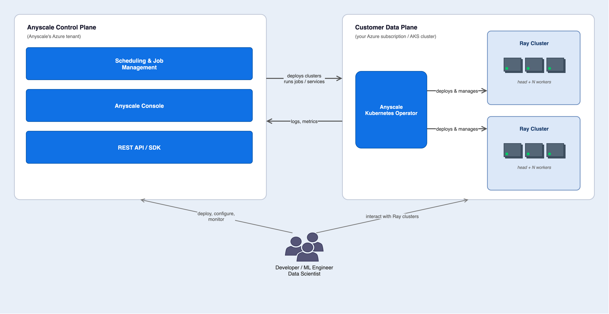
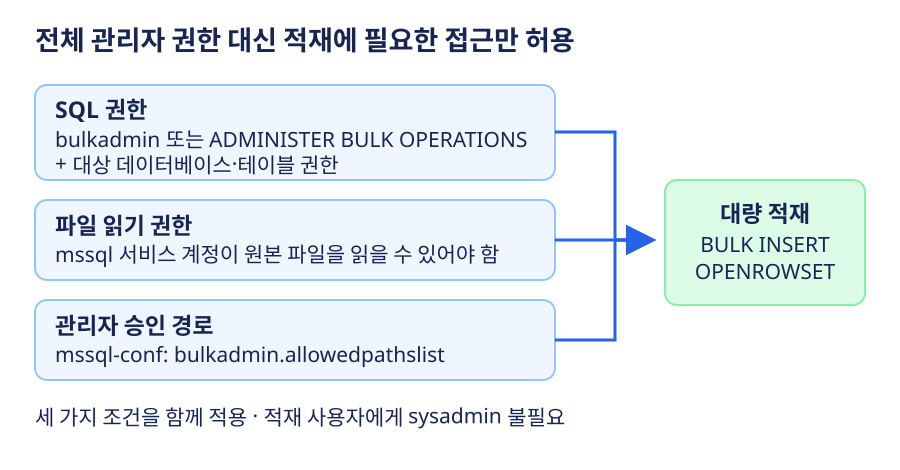

# Azure 일일 업데이트 브리핑 — 2026-10-08

**Anyscale on Azure GA** — 고객 AKS에서 Ray 기반 분산 Python을 실행하고,
Anyscale이 작업·클러스터 관리를 담당하는 플랫폼입니다.
Linux용 SQL Server에는 **전체 관리자 권한 없이 대량 적재하는 기능**이 추가됐습니다.

## 주요 업데이트

### Anyscale on Azure — GA

**데이터 준비부터 학습·추론까지, CPU·GPU 클러스터를 하나의 Python 실행 환경으로 활용**

Ray는 여러 CPU·GPU에 Python 작업을 분산하는 실행 런타임입니다.
Anyscale on Azure는 이를 고객 구독의 AKS에서 운영하는 관리형 플랫폼으로,
데이터 준비·분산 학습·미세 조정·강화 학습·추론·에이전트 실행을 지원합니다.
이번 발표는 **Anyscale의 Azure 통합 플랫폼 GA**이며, Ray나 AKS 자체의 새 GA 발표가 아닙니다.

*출처: Microsoft Learn,
[Anyscale on Azure architecture overview](https://learn.microsoft.com/azure/anyscale-on-azure/architecture#architecture-diagram-overview).
그림을 선택하면 원본 크기로 볼 수 있습니다.*

**구조와 동작**

- **제어 평면:** Anyscale이 Azure에서 운영하며 작업 스케줄링, 모니터링,
  작업·클러스터 관리를 제공합니다. 사용자는 Anyscale 콘솔·CLI·SDK로 작업을 관리합니다.
- **AKS Operator:** 고객 클러스터에서 제어 평면을 폴링해 작업 지시를 가져옵니다.
  Ray 실행에 필요한 Pod·Service·Ingress를 만들고, 클러스터 상태·메트릭을 보고합니다.
  제어 평면이 고객 AKS 노드에 직접 접속해 실행하는 구조가 아닙니다.
- **Ray 실행 환경:** 실제 Python 워크로드는 고객 AKS에서 실행합니다.
  컨테이너 이미지는 ACR, 데이터셋·실행 산출물은 Blob Storage·ADLS와 연동합니다.
- **접근과 인증:** Azure Load Balancer를 통해 Ray 클러스터에 접근하고,
  사용자는 Microsoft Entra ID로 로그인합니다. Azure 자원 접근은 관리 ID로 제어합니다.

**무엇을 제공하나**

- Ray 클러스터의 생성·관리를 Operator가 담당하고, 작업 관리·관측 기능은
  Anyscale 플랫폼에서 제공합니다.
- 별도 실행 플랫폼으로 데이터를 옮기는 대신, 기존 Azure 구독의 컴퓨팅·스토리지·
  이미지 저장소와 연결해 분산 Python 워크로드를 운영합니다.
- CPU·GPU를 활용하는 여러 AI 처리 단계를 하나의 Python 프로그램으로 구성할 수 있습니다.

**한국 활용 시 알아둘 점**

- 공식 지원 목록에는 **Southeast Asia가 포함되지만 한국 리전은 없습니다.**
- 워크로드·데이터는 선택한 리전의 고객 구독에 두지만, **제어 평면은 미국에서 운영**됩니다.
  시스템 로그·메트릭·클러스터 상태가 전달되며, 로그 수집을 켜면 구조화된 애플리케이션
  로그도 전달됩니다. 데이터가 모두 선택 리전에만 머문다고 해석하면 안 됩니다.

**공식 자료:**
[GA 발표](https://azure.microsoft.com/updates?id=573744) ·
[기능 개요](https://learn.microsoft.com/azure/anyscale-on-azure/overview) ·
[아키텍처](https://learn.microsoft.com/azure/anyscale-on-azure/architecture) ·
[지원 리전·데이터 위치](https://learn.microsoft.com/azure/anyscale-on-azure/supported-regions)

### SQL Server on Linux — 대량 적재 권한 분리 GA

**`sysadmin` 대신 대량 적재에 필요한 권한만 부여**

기존에는 Linux에서 `BULK INSERT`와 `OPENROWSET(BULK...)`를 실행하려면
`sysadmin`이 필요했습니다. 이제 **`bulkadmin` 역할 또는
`ADMINISTER BULK OPERATIONS` 권한**으로 실행할 수 있어,
적재 계정에 전체 관리자 권한을 부여하지 않아도 됩니다.

*Microsoft Learn [대량 적재 구성 문서](https://learn.microsoft.com/sql/linux/security/bulk-operations?view=sql-server-ver17)의
권한·파일 접근·경로 승인 설명을 바탕으로 새로 그린 개념도입니다.*

**권한이 적용되는 방식**

- **SQL 권한:** 적재 사용자에게 `bulkadmin` 또는 `ADMINISTER BULK OPERATIONS`를
  부여하고, 대상 데이터베이스·테이블에 필요한 권한을 설정합니다.
- **파일 접근:** 데이터를 읽는 `mssql` 서비스 계정에 Linux 파일 읽기 권한이 필요합니다.
- **경로 승인:** 관리자가 `mssql-conf`의 `bulkadmin.allowedpathslist`로
  읽을 디렉터리를 허용합니다. SQL 권한만 부여해서 모든 파일을 읽게 되는 것은 아닙니다.

**지원 버전:** Linux용 **SQL Server 2022 CU27 이상 / SQL Server 2025 CU9 이상**.
온프레미스·Azure VM·컨테이너 배포에 적용됩니다.

**공식 자료:**
[GA 발표](https://azure.microsoft.com/updates?id=573443) ·
[권한·파일 접근·허용 경로 구성](https://learn.microsoft.com/sql/linux/security/bulk-operations?view=sql-server-ver17)

## 기타 업데이트

- **Microsoft Marketplace — Multiparty private offers 홍콩 확대:**
  소프트웨어 회사·채널 파트너가 공동 판매하는 private offer의 지원 시장에
  Hong Kong SAR가 추가됐습니다. 고객의 청구 계정과 파트너의 세금 프로필에
  관한 지원이며, Azure 컴퓨팅 리전 확대는 아닙니다.
  [발표](https://azure.microsoft.com/updates?id=571831) ·
  [구매 흐름·지원 국가](https://learn.microsoft.com/partner-center/marketplace-offers/multiparty-private-offers-overview)
