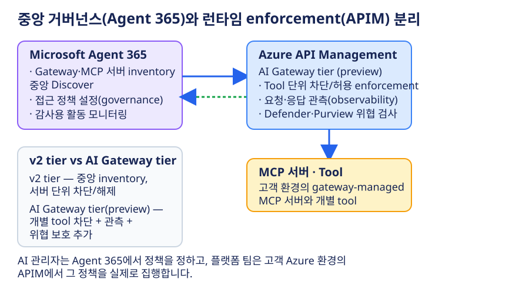
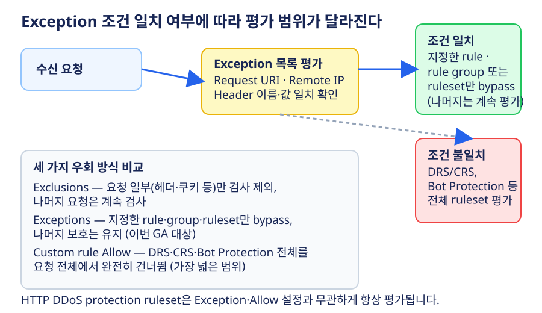
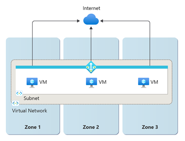

# Azure 일일 업데이트 브리핑 — 2026-10-09

**Microsoft Agent 365와 Azure API Management가 MCP 서버 거버넌스에서 연동**되어, 중앙 정책 설정과 런타임 enforcement를 분리해 운영할 수 있게 됐습니다.
**Application Gateway·Front Door의 WAF Exceptions**가 GA로 전환돼 특정 rule만 선택적으로 우회할 수 있고, **AKS의 managed NAT Gateway는 StandardV2가 기본값**이 되어 zone 중복성과 IPv6 outbound를 기본 제공합니다.
Microsoft Dev Box와 Azure Deployment Environments는 종료 일정이 확정되어 전환 계획이 필요합니다.

**이번 보고서의 업데이트**

- **AI & Apps:**
  [Microsoft Agent 365 — Azure API Management MCP 거버넌스 연동 Public Preview](#agent365-apim-mcp) ·
  [Microsoft Dev Box·Azure Deployment Environments 서비스 종료](#devtools-retirement)
- **Infra:**
  [Application Gateway·Front Door — WAF Exceptions GA](#waf-exceptions-ga) ·
  [AKS — Managed StandardV2 NAT Gateway 기본값 GA](#aks-natgw-standardv2)
- **Database:**
  [Azure Database for PostgreSQL 유연 서버 — East US 3 리전 추가](#pg-eastus3)

## 주요 업데이트

### Microsoft Agent 365 — Azure API Management MCP 거버넌스 연동 Public Preview { #agent365-apim-mcp }

**조직 전체 agent 거버넌스와 gateway 단의 실행 통제를 하나로 연결**

조직에서 여러 팀이 MCP(Model Context Protocol) 서버와 tool을 만들면, 어떤 agent가 어떤 tool에 접근하는지 한눈에 파악하기 어려워집니다. Azure API Management(APIM)는 이미 MCP 서버를 등록하고 인증·호출 정책을 적용하는 gateway 기능을 제공해 왔지만, 이 정책은 APIM 운영팀이 gateway 단위로 관리하는 것이었고, 조직 전체의 agent 활동을 감사하거나 중앙에서 통제하는 체계와는 분리돼 있었습니다. **Microsoft Agent 365**는 조직의 agent를 관찰·보안·거버넌스하는 control plane으로, 이번 프리뷰는 이 Agent 365가 APIM이 관리하는 MCP gateway·서버 목록을 직접 들여다보고 접근 정책을 설정할 수 있게 연동한 것입니다.

*공식 문서 기반 재구성. 근거: [Azure Updates GA 발표](https://azure.microsoft.com/updates?id=574204),
[Overview of MCP servers in Azure API Management](https://learn.microsoft.com/azure/api-management/mcp-server-overview),
[AI Gateway tier (preview) overview](https://learn.microsoft.com/azure/api-management/ai-gateway-overview).*

**연동이 제공하는 기능**

- **중앙 inventory:** Agent 365가 APIM의 gateway와 MCP 서버 목록을 자동으로 Discover해 하나의 목록으로 관리합니다.
- **서버 단위 접근 통제:** Agent 365에서 MCP 서버 접근을 제어하면, 실제 차단·허용은 APIM이 런타임에 적용합니다.
- **Tool 단위 차단:** APIM **AI Gateway tier**(프리뷰)를 사용하면 MCP 서버 전체가 아니라 개별 tool만 선택적으로 막을 수 있습니다.
- **활동 모니터링:** tool 호출 이력을 감사·운영 가시성·사고 조사에 활용합니다.
- **위협·정보 보호:** Microsoft Defender·Purview가 tool 요청·응답을 검사해 보안 위협과 민감정보 노출 위험을 평가합니다.

이 구조로 AI 관리자는 Agent 365에서 조직 공통 정책을 정하고, 플랫폼 팀은 고객 자신의 Azure 환경에 있는 APIM에서 그 정책을 실제로 집행하는 역할 분리가 가능해집니다. 저장소의 [Azure MCP 구성 — APIM·Toolbox·IQ의 활용과 선택 기준](../../services/azure-architecture/mcp-configuration/index.md) 가이드에서 다루는 "APIM으로 MCP 접근을 관리하는 이유"에 이번 연동으로 조직 차원의 중앙 거버넌스 계층이 추가된 것으로 볼 수 있습니다.

**지원 조건**

- 중앙 inventory·서버 단위 차단은 APIM **v2 tier**에서 동작하며 v2 tier는 여러 리전에서 일반적으로 사용할 수 있습니다.
- **Tool 단위 차단·관측·위협 보호**는 APIM **AI Gateway tier(프리뷰)**가 필요하며, 이 tier는 프리뷰 기간 동안 **East US 2**, **Sweden Central** 두 리전에서만 제공됩니다. **Korea Central·Korea South는 AI Gateway tier 프리뷰 지원 리전에 없습니다.**

**공식 자료:**
[Public Preview 발표](https://azure.microsoft.com/updates?id=574204) ·
[MCP 서버 개요](https://learn.microsoft.com/azure/api-management/mcp-server-overview) ·
[AI gateway 기능](https://learn.microsoft.com/azure/api-management/genai-gateway-capabilities) ·
[AI Gateway tier 리전](https://learn.microsoft.com/azure/api-management/ai-gateway-overview) ·
[Microsoft Agent 365 개요](https://learn.microsoft.com/microsoft-agent-365/)

### Application Gateway·Front Door — WAF Exceptions 평가 GA { #waf-exceptions-ga }

**managed rule 전체가 아니라 문제가 된 rule 하나만 선택적으로 우회**

Web Application Firewall(WAF)은 Default/Core Rule Set 같은 managed ruleset으로 알려진 공격 패턴을 검사합니다. 그런데 정상적인 애플리케이션 요청이 특정 rule과 우연히 일치해 차단되는 false positive가 자주 발생합니다. 기존에는 요청의 일부(헤더·쿠키 등)를 검사에서 제외하는 **Exclusions**나, 요청 전체를 모든 managed ruleset에서 완전히 건너뛰는 **custom rule Allow** 방식으로 대응해야 했는데, 둘 다 세밀한 조정이 어려웠습니다. 저장소의 [Application Gateway WAF 경로 기반 IP 허용 가이드](../../services/azure-application-gateway/waf-path-ip-allowlist/index.md)도 이런 상황에서 custom rule을 직접 작성해 특정 경로의 IP만 허용하는 우회 구성을 다룹니다. 이번에 GA된 **Exceptions**는 Request URI·Remote IP·요청 헤더 조건에 맞는 요청만 지정한 rule·rule group·전체 ruleset에서 선택적으로 bypass하는 세 번째 방식입니다.

*공식 문서 기반 재구성. 근거: [Azure Application Gateway WAF Exceptions List](https://learn.microsoft.com/azure/web-application-firewall/ag/application-gateway-exceptions).*

**세 가지 우회 방식 비교**

| 방식 | 우회 범위 | 적합한 상황 |
|---|---|---|
| **Exclusions** | 요청 일부(헤더·쿠키 등)만 검사 제외 | 특정 필드가 반복적으로 오탐을 유발할 때 |
| **Exceptions(이번 GA)** | 지정한 rule·rule group·ruleset만 bypass, 나머지는 계속 평가 | 문제가 된 rule 하나만 정밀하게 우회할 때 |
| **Custom rule Allow** | DRS·CRS·Bot Protection 전체를 요청 전체에서 건너뜀 | 신뢰할 수 있는 출처의 트래픽을 통째로 허용할 때 |

**핵심 동작**

- 일치 조건은 **Equals·Starts with·Ends with·Contains·IP Match** 연산자로 정의합니다.
- 하나의 exception에는 최대 **IP 600개, URI 10개, 헤더 10개**까지 지정할 수 있습니다.
- WAF 정책당 최대 **60개**, Application Gateway 전체로는 연결된 모든 정책을 합쳐 **60개**까지 허용됩니다.
- **HTTP DDoS protection ruleset은 exception·allow 설정과 무관하게 항상 평가**됩니다.

**지원 조건:** next-gen WAF 엔진에서만 지원하며, managed ruleset 버전이 **CRS 3.2 또는 DRS 2.1 이상**이어야 합니다. Application Gateway는 **v2 SKU**, Front Door는 **Premium**에 적용됩니다.

**공식 자료:**
[GA 발표](https://azure.microsoft.com/updates?id=574343) ·
[Application Gateway Exceptions](https://learn.microsoft.com/azure/web-application-firewall/ag/application-gateway-exceptions) ·
[Front Door Exceptions](https://learn.microsoft.com/azure/web-application-firewall/afds/front-door-exceptions)

### AKS — Managed StandardV2 NAT Gateway 기본값 GA { #aks-natgw-standardv2 }

**클러스터 outbound 경로가 기본적으로 zone 중복성과 IPv6를 지원**

AKS에서 managed NAT Gateway를 outbound 경로로 쓰면 클러스터 노드가 인터넷으로 나가는 트래픽을 AKS가 대신 생성·관리합니다. 기존 managed NAT Gateway는 **Standard SKU**만 지원했는데, 이 SKU는 단일 availability zone에서만 동작해 해당 zone에 장애가 생기면 outbound 연결이 끊길 수 있었고, IPv6 outbound도 지원하지 않았습니다. 이번 GA로 **API 버전 `2026-06-01` 이상에서 managed NAT Gateway의 기본 SKU가 StandardV2로 바뀌었습니다**. 프리뷰 기간에는 `managedNATGatewayV2`라는 별도 outbound type으로 제공됐지만, 이제는 기존 `managedNATGateway` outbound type 안에서 `natGatewayProfile.sku: StandardV2`로 노출됩니다.

*출처: Microsoft Learn,
[What Is Azure NAT Gateway?](https://learn.microsoft.com/azure/nat-gateway/nat-overview).
그림을 선택하면 원본 크기로 볼 수 있습니다.*

**StandardV2가 제공하는 기능**

- **Zone 중복성:** 단일 zone이 아니라 리전의 모든 availability zone에서 outbound 연결을 유지합니다.
- **더 높은 처리량:** NAT Gateway당 최대 **100 Gbps**(Standard는 50 Gbps)까지 처리합니다.
- **IPv6 outbound 지원:** Azure 관리형·고객 지정 IPv6 주소·prefix를 모두 사용할 수 있습니다(Standard는 IPv4만 지원).
- **신규 클러스터 기본값:** SKU를 지정하지 않으면 지원 리전에서 자동으로 StandardV2를 사용하고, 미지원 리전에서는 Standard로 동작합니다.
- **기존 클러스터는 영향 없음:** 기존 Standard 클러스터는 그대로 유지되며, 업그레이드는 선택 사항입니다. 단 **StandardV2로 업그레이드하면 다시 Standard로 내릴 수는 없습니다.**

**전제 조건:** StandardV2는 **StandardV2 public IP 주소·prefix**가 필요하며 기존 Standard public IP와 호환되지 않습니다. 클러스터의 `type: LoadBalancer` Service가 쓰는 load balancer는 계속 Standard SKU public IP를 사용하므로, 두 SKU의 IP 재고를 함께 계획해야 합니다.

**지원 리전:** Canada East, India South Central, Sweden South, West India에서는 StandardV2를 지원하지 않습니다. 이 네 리전을 제외한 나머지 공개 리전에서 사용할 수 있으며, **Korea Central·Korea South는 이 미지원 목록에 포함되지 않습니다.**

**공식 자료:**
[GA 발표](https://azure.microsoft.com/updates?id=574430) ·
[AKS managed NAT gateway 구성](https://learn.microsoft.com/azure/aks/nat-gateway) ·
[NAT Gateway 개념·SKU 비교](https://learn.microsoft.com/azure/nat-gateway/nat-overview)

## 대응 필요 항목

> **closing-down 기간이 이미 시작됐습니다.** 두 서비스 모두 **2026년 9월 14일**부터 closing-down 절차에 들어갔습니다. 기존 배포는 계속 쓸 수 있지만 신규 기능 개발은 없고, 최종 종료 전까지 전환 계획을 세워야 합니다.

### Microsoft Dev Box·Azure Deployment Environments 서비스 종료 { #devtools-retirement }

같은 날 발표된 두 개발자 도구 서비스의 종료 소식입니다. 이 저장소에서는 Microsoft Dev Box·Azure Deployment Environments 사용 근거를 찾지 못했으며, **관련 프로젝트 사용 여부 확인이 필요**합니다.

- **Microsoft Dev Box:** 최종 종료는 **2028년 9월 18일 17:00 UTC**. 현재 maintenance mode이며 신규 기능 투자는 없습니다. 권장 전환 대상은 **Windows 365**(Cloud PC)이며, 16·32 vCPU·GPU 옵션을 제공합니다. [종료 가이드](https://learn.microsoft.com/azure/dev-box/dev-box-retirement-guide)
- **Azure Deployment Environments(ADE):** 최종 종료는 **2027년 2월 22일**. 모든 워크로드에 대응하는 단일 대체재는 없으며, Microsoft는 **Azure Resource Manager·Bicep 직접 배포**, **Azure Verified Modules**, **Azure DevOps·GitHub 워크플로**로의 전환을 검토하도록 안내합니다. [종료 가이드](https://learn.microsoft.com/azure/deployment-environments/deployment-environments-retirement-guide)
- Dev Center를 Dev Box와 ADE가 함께 쓰는 경우, ADE 전환을 마쳤더라도 **Dev Box 종속성이 남아 있는 동안은 공유 Dev Center 리소스를 삭제하지 말아야 합니다.**

**공식 자료:**
[Dev Box 종료 발표](https://azure.microsoft.com/updates?id=567933) ·
[ADE 종료 발표](https://azure.microsoft.com/updates?id=567934) ·
[Dev Box 종료 가이드](https://learn.microsoft.com/azure/dev-box/dev-box-retirement-guide) ·
[ADE 종료 가이드](https://learn.microsoft.com/azure/deployment-environments/deployment-environments-retirement-guide)

## 기타 업데이트

- **Azure Database for PostgreSQL 유연 서버 — GA(East US 3 리전 추가):** 지원 리전 목록에 East US 3가 추가됐습니다. 신규 기능이나 서비스 동작 변경은 아닙니다.
  [GA 발표](https://azure.microsoft.com/updates?id=573691) ·
  [지원 리전 목록](https://learn.microsoft.com/azure/postgresql/flexible-server/overview#azure-regions)
