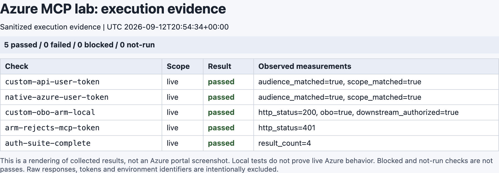
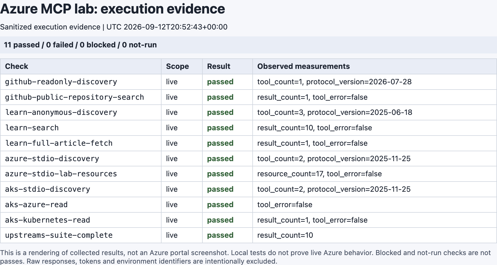
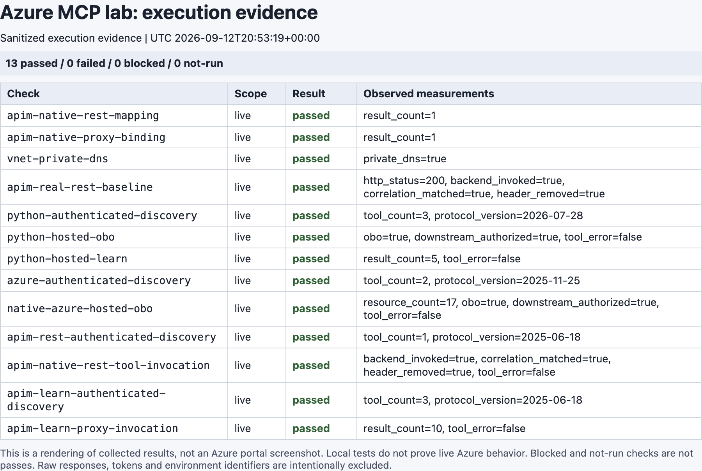
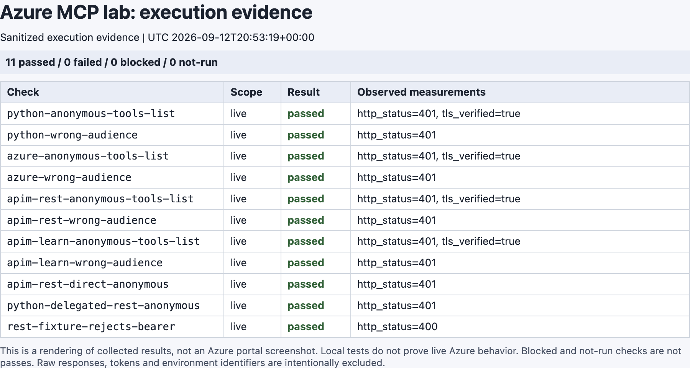
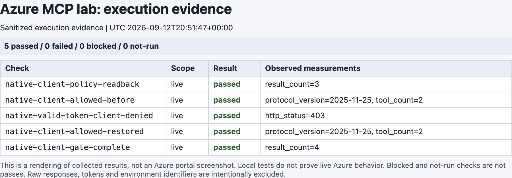

# Azure MCP 실증 기록 — Entra OBO와 APIM REST 도구 변환의 실제 응답

## 환경과 범위

실행일은 **2026-09-13 KST**입니다. 원본 증거의 시각은 UTC이며, 아래 JSON의 실행 시각을 기준으로 합니다.

| 항목 | 이번 실행 |
|---|---|
| Azure | 기존에 로그인한 사용자의 Azure public cloud 구독, Korea Central |
| 직접 만든 범위 | 새 실습 RG 하나; 기존 RG를 재사용하지 않음 |
| 별도 수명주기 | AKS node RG, ACA managed RG, Entra 앱·서비스 주체 |
| APIM | Developer 1개, internal VNet, private DNS |
| Container Apps | Internal workload-profiles 환경, Consumption profile, Python MCP와 공식 Azure MCP |
| AKS | 1.35, Free 제어 평면, `Standard_D4as_v5` 노드 1개, Entra·Azure RBAC, local account 비활성화 |
| 이미지 | ACR Tasks 원격 빌드, 이미지 digest 고정; 로컬 Docker daemon 사용 안 함 |
| Identity | Public client, custom API, native Azure MCP API의 세 등록 |
| Consent | 현재 운영자에 한정한 ARM `user_impersonation`, `Principal` grant |

실제 subscription·tenant·사용자·resource ID, hostname, token과 private kubeconfig는 공개하지 않았습니다. 공개 JSON은 수집기가 허용한 값만 포함합니다. **실습 RG 삭제만으로 Entra 객체가 정리되는 것은 아닙니다.**

## 결과 요약

실제 서비스 호출·제어 평면 검사 **62항목**과 **완료 마커 4개**가 통과했습니다. 완료 마커를 개별 기능 검사로 세지 않았습니다.

| 증거 | UTC 수집 시각 | 결과 |
|---|---|---|
| [로컬 코드의 실제 Entra/ARM 교환](https://github.com/hellices/devguidesample/blob/main/samples/azure-api-management/mcp-entra-lab/evidence/auth-local-live.json) | 2026-09-12 20:54:34 | 4항목 + 완료 마커 |
| [네 upstream MCP](https://github.com/hellices/devguidesample/blob/main/samples/azure-api-management/mcp-entra-lab/evidence/upstreams.json) | 2026-09-12 20:52:43 | 10항목 + 완료 마커 |
| [내부 hosted MCP와 APIM](https://github.com/hellices/devguidesample/blob/main/samples/azure-api-management/mcp-entra-lab/evidence/cloud.json) | 2026-09-12 20:53:19 | 44항목 + 완료 마커 |
| [Native caller-ID gate](https://github.com/hellices/devguidesample/blob/main/samples/azure-api-management/mcp-entra-lab/evidence/native-client-gate.json) | 2026-09-12 20:51:47 | 4항목 + 완료 마커 |

캡처는 **실제로 수집한 JSON의 정규화 화면**입니다. Azure Portal 화면을 흉내 낸 이미지가 아니며, 운영 화면·token·개인정보를 담은 원본 로그를 게시하지 않았습니다.

### Token 발급과 OBO

- 두 API용 token은 JWKS로 signature·issuer·audience를 검증했습니다.
- Custom API의 OBO token으로 새 RG 조회가 **200**이었습니다.
- 원래 MCP-audience token으로 같은 ARM API를 호출하면 **401**이었습니다.
- 이는 로컬 코드의 실제 클라우드 교환입니다. 이 결과만으로 hosted MCP나 IDE의 PKCE 성공을 주장하지 않았습니다.

### 실제 upstream 연결

| 서버 | 실제 protocol revision | 관측 |
|---|---|---|
| GitHub hosted MCP | `2026-07-28` | read-only로 선택한 도구 1개, 공개 실습 저장소 검색 결과 1개 |
| Learn MCP | `2025-06-18` | 도구 3개, 검색 및 원문 fetch 성공 |
| Azure MCP 2.0.5 stdio | `2025-11-25` | group 도구 2개, 지정 RG의 resource list 성공 |
| AKS MCP 0.0.20 stdio | `2025-11-25` | `call_az`, `call_kubectl`; 새 클러스터와 `mcp-lab` namespace 읽기 성공 |

Azure 로컬 실행에서는 `AZURE_TOKEN_CREDENTIALS=AzureCliCredential`을 명시했습니다. 기본 개발 credential chain으로 시작한 호출이 지연되어 제한 시간 안에 중단한 뒤, 명시적 CLI 자격 증명과 bounded timeout으로 다시 확인했습니다. 이 로컬 경로를 OBO라고 부르지 않습니다.

AKS는 공식 release의 macOS arm64 바이너리 SHA-256을 확인한 뒤 실행했습니다. 기본 kubeconfig는 사용·변경하지 않았습니다.

### Hosted MCP와 APIM의 실제 호출

| 경로 | 실제 revision / 도구 수 | 성공 근거 |
|---|---|---|
| Python SDK 2.2.0 MCP | `2026-07-28` / 3개 | hosted OBO의 RG 존재·provisioning 결과, 실제 Learn 검색 |
| 공식 Azure MCP 2.0.5 | `2025-11-25` / 2개 | HTTP 사용자 요청에서 OBO로 지정 RG resource list |
| APIM REST-to-MCP | `2025-06-18` / 1개 | `getInventory` → 실제 REST operation → 새 invocation marker와 probe ID |
| APIM Learn 프록시 | `2025-06-18` / 3개 | 실제 Learn 도구 목록 및 검색 결과 |

Resource count는 해당 호출 시점의 반환값입니다. 모든 ARM child resource·역할 할당·관리형 RG 자원의 총수를 의미하지 않으며, 운영 중인 목록이 고정된다는 보장도 아닙니다.

**REST-to-MCP는 별도로 증명했습니다.** 먼저 APIM의 기존 REST URL을 호출해 기준 응답을 확인했습니다. 이후 native MCP의 `getInventory`를 호출했고, 같은 가상 재고이지만 다른 `invocation_id`와 요청에 일치하는 `probe_id`를 받았습니다. 정적 `tools/call` mock이나 기존 MCP 서버 프록시로 대체하지 않았습니다.

REST fixture에 bearer가 도착하면 값을 반사하지 않고 **400**으로 거부하도록 보강했습니다. APIM을 통한 REST·MCP 성공 응답에서는 `authorization_present: false`도 확인했습니다. 따라서 REST 경로의 header 제거는 정책 문자열뿐 아니라 실제 backend 결과로 검증했습니다.

### 인증 거부와 private 경로

- 네 hosted 경로의 익명 `initialize`, `tools/list`, `tools/call`이 모두 **401**이었습니다.
- 유효한 ARM token을 MCP에 제출한 wrong-audience 요청도 모두 **401**이었습니다.
- APIM의 원래 REST URL과 Python의 보호된 delegated REST URL도 무인증으로 접근할 수 없었습니다.
- Probe에서 지정한 세 hostname이 VNet 안에서 private 주소로 해석되었습니다. TLS certificate 검증은 끄지 않았습니다.
- APIM Learn 경로의 `Authorization` 제거는 **배포 정책 read-back**으로 확인했습니다. 이를 upstream 서버에서 수집한 packet/header 캡처라고 표현하지 않습니다.

Private 접근은 새 AKS의 전용 HTTPS CONNECT probe와 loopback port-forward로 수행했습니다. **공개 AKS 관리 API의 인증된 터널**을 사용했으며, 사내 VPN 또는 모든 관리 경로의 private 구성을 검증한 것은 아닙니다.

### Native caller-ID gate

사전 승인 목록은 caller ACL이 아니므로 native Azure MCP 앞에 Container Apps authentication의 `allowedApplications`를 추가했습니다. **같은 정상 사용자 token**을 사용하여 허용 상태에서 도구 2개를 확인하고, 실습 중 Azure CLI client만 allowlist에서 제외했을 때 **403**을 확인한 뒤 원래 목록을 복구했습니다. 복구 후 도구 2개가 다시 조회되었습니다.

이 검사는 client-ID 경계를 분리해서 확인한 것이며, 다른 사용자·다른 RBAC를 검증한 것은 아닙니다. 검증 후 원래 caller 정책을 유지했습니다.

## 조사·해결 이력

### 1. 배포 전 계산할 수 없는 ACA DNS 이름

환경에서 생성되는 `defaultDomain`을 같은 배포의 DNS zone 이름으로 쓰면 Bicep의 deployment-start 계산 제약과 what-if의 `Unsupported`를 만났습니다.

기반 환경을 먼저 만든 다음 실제 domain·private 주소를 parameter로 주어 DNS를 생성하도록 분리했습니다. 초기 배포의 what-if를 create-only로 검증했으며, `Unsupported`를 성공으로 무시하지 않았습니다.

### 2. Azure CLI token selector

`az account get-access-token`에 `--tenant`와 `--subscription`을 함께 주면 CLI가 거부했습니다. Token 획득은 `--tenant`와 명시적 scope를 사용하고, ARM 배포 작업은 별도로 subscription을 지정하도록 고쳤습니다.

### 3. Repository root에서 ACR Dockerfile 탐색

원격 build context를 지정했더라도 이 실행의 CLI는 상대 `Dockerfile`을 repository root에서 찾다가 실패했습니다. Dockerfile의 절대 경로를 넘기도록 고친 뒤 실제 ACR build가 성공했습니다. Build context는 Dockerfile·requirements·service 코드만 포함하도록 제한했습니다.

### 4. APIM metadata API의 URL suffix

API suffix를 `.well-known/oauth-protected-resource`로 지정한 요청은 실제 APIM에서 `Invalid value of the Web API URL suffix`로 거부되었습니다.

`oauth-metadata`라는 별도 API를 만들고, MCP의 **401 `WWW-Authenticate.resource_metadata`가 그 정확한 URL을 가리키도록** 구성했습니다. 클라이언트가 metadata 위치를 고정 경로로 추측하지 않도록 했습니다.

### 5. 생성은 성공했지만 Learn 도구 목록이 비어 있었다

MCP API에 `serviceUrl`과 transport만 지정한 첫 구성이 생성되었지만 `tools/list`는 빈 목록을 반환했고, 호출은 JSON-RPC `-32603`으로 실패했습니다.

공식 관리 문서를 Learn MCP로 다시 전체 fetch하고, **공식 AI-Gateway 샘플**과 실제 API의 read-back을 비교했습니다.

| 항목 | 문서·타입과 실행의 차이 |
|---|---|
| Backend 연결 | 실제 native proxy에는 backend 리소스와 `backendId`가 필요했음 |
| Endpoint | 배열은 dictionary 역직렬화 오류로 거부됨 |
| 실행한 형식 | `endpoints: { message: { uriTemplate: '/mcp' } }` |
| Bicep 타입 | 확인한 버전에서 `backendId`와 keyed endpoint에 국소적인 타입 불일치 |

샘플의 설명과 runtime 계약에 맞춰 변경한 뒤 **도구 3개 및 실제 검색 호출**이 성공했습니다. 관련 Bicep 진단만 국소적으로 다루며 다른 오류를 숨기는 예외로 사용하지 않습니다. 공개 문서·타입과 실제 계약의 차이는 남아 있으므로 source review 상태는 `needs-review`입니다.

### 6. Policy read-back의 content negotiation

APIM policy 조회에서 JSON을 기대했지만 XML/BOM 응답이 반환된 경로가 있었습니다. `Accept=application/json`을 명시하고 JSON 안의 XML policy를 파싱했습니다. JSON 오류를 빈 정책이나 성공으로 대체하지 않았습니다.

### 7. Entra scope 표기는 하나가 아니었다

Native Azure MCP는 `<CLIENT_ID>/Mcp.Tools.ReadWrite`를 광고했고, custom API는 `api://<CLIENT_ID>/Mcp.Access`를 광고했습니다.

두 표기를 단순 문자열로 같다고 가정하지 않았습니다. **광고된 정확한 scope로 실제 token을 발급받아 signature·issuer·audience·`scp`를 확인하고, 그 token으로 MCP를 호출**했습니다. 이를 모든 OAuth 클라이언트의 대화형 PKCE 성공으로 확대 해석하지 않습니다.

### 8. 최종 리뷰 후 보강한 경계

- Auth probe도 시작 시 이전 성공 결과를 무효화하고, 네 검사가 모두 끝난 뒤에만 완료 마커를 씁니다.
- Python API의 빈 client allowlist는 더 이상 허용하지 않습니다.
- Native Azure MCP의 caller 제한은 앱 등록 사전 승인이 아닌 hosting auth 정책으로 집행합니다.
- REST fixture는 bearer 유입을 거부하고, REST API 정책도 별도로 read-back합니다.
- AKS Azure 조회에는 기록된 subscription을 명시하고 반환된 cluster resource ID까지 비교합니다. 활성 CLI 구독이 바뀌어도 다른 클러스터를 성공으로 오인하지 않습니다.

## 단위 테스트와 재현

공개 샘플은 실제 MCP SDK의 ASGI transport·lifespan을 사용한 로컬 테스트를 포함합니다. 가상 RSA key와 fake downstream을 사용하는 테스트는 **실제 Azure 검증과 별도**입니다.

- 잘못된 서명·issuer·tenant·audience·시간·scope·client.
- App-only token의 `oid`가 있어도 delegated scope 없이 통과하지 않음.
- 최신 per-request 모드와 legacy 모드의 인증 경계.
- OBO token 교체, 실패의 명시적 표면화, Learn으로의 bearer 미전달.
- 부정확한 결과 구조를 성공으로 포장하지 않는 parser.
- Inventory correlation, private-state·배포 범위·cleanup guard.

실행 명령과 고정 dependency는 [샘플 README](https://github.com/hellices/devguidesample/blob/main/samples/azure-api-management/mcp-entra-lab/README.md), 전체 순서는 [실습](../../../labs/azure-api-management/mcp-rest-and-upstream/index.md)을 사용합니다. 공개 JSON에는 필드 allowlist와 완료 마커를 적용했습니다.

## 확인하지 않은 것과 남긴 자원

| 항목 | 상태 |
|---|---|
| 두 번째 사용자의 다른 RBAC와 multi-user 비교 | 실행하지 않음 |
| 모든 Conditional Access·claims 재인증 조합 | 실행하지 않음 |
| 각 IDE의 자동 discovery·PKCE·token 갱신 UI | 실행하지 않음 |
| 회사 LAN/VPN/ExpressRoute 연결 | 실행하지 않음 |
| App Service·Functions 대안 배포 | 리서치만 수행 |
| Cleanup | 소유권 preview와 unit guard만 확인; 실제 삭제하지 않음 |

리소스와 Entra 객체는 검토를 위해 유지했습니다. **비용은 계속 발생하고 expiry tag나 PR merge가 자동으로 정리하지 않습니다.** Private state와 짧은 수명의 secret은 저장소 밖에 있습니다. 검토 이후에는 [정리 절차](../../../labs/azure-api-management/mcp-rest-and-upstream/index.md)를 실행해야 합니다.
