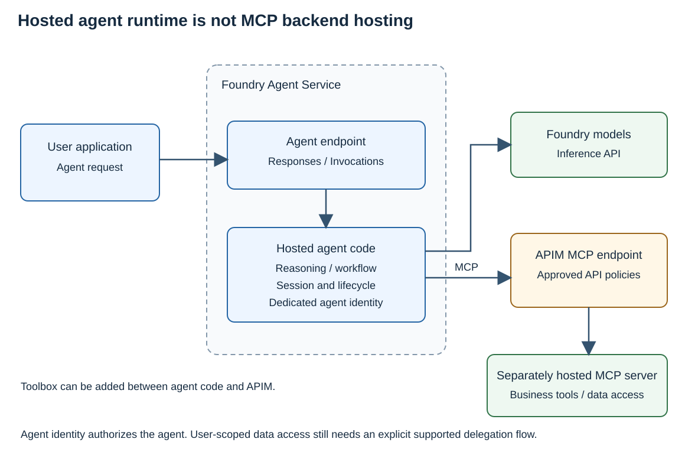
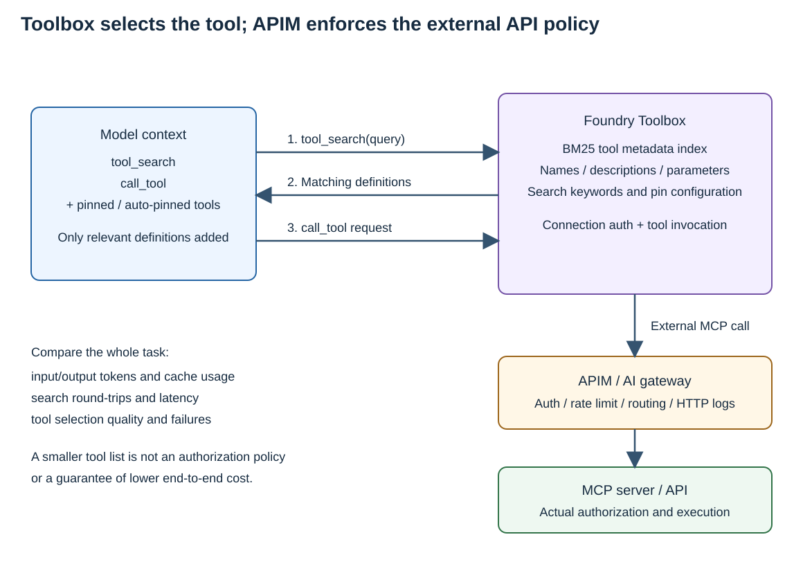

# Azure MCP 운영 아키텍처 — APIM·Foundry·Toolbox와 인증

조직의 MCP endpoint를 개발 도구와 AI agent에 제공하려면 **어디에서 접근 정책을 적용하고, 누구의 권한으로 도구를 실행할지** 정해야 합니다. 이 가이드는 APIM을 공유 MCP/API의 정책 집행 지점으로 사용하고, Foundry hosted agent와 Toolbox를 필요에 따라 연결하는 참조 구성을 설명합니다.

**MCP 관리와 MCP 호스팅은 다른 역할입니다.** APIM은 MCP 요청을 받아 인증·트래픽·라우팅 정책을 적용합니다. MCP 서버의 실제 업무 코드는 그 뒤의 Container Apps, App Service, Functions, AKS 등에서 실행됩니다. Hosted agent는 이 도구들을 사용하는 agent runtime이고, Toolbox는 agent에 제공할 도구 구성과 탐색을 관리합니다.

본문의 권고는 아래 Microsoft Learn 문서에서 확인한 기능과 지원 범위를 조합한 참조 설계입니다. 배포 명령, 예제 서버 연결과 실제 응답은 마지막의 [Samples](#samples)에 따로 정리했습니다.

## 구성 요소와 역할

| 구성 요소 | 담당하는 역할 | 대신하지 않는 역할 |
|---|---|---|
| APIM / AI gateway | 공유 MCP/API endpoint, 인증·인가 정책, rate limit, routing, gateway 로그 | Agent의 reasoning·실행, 임의의 MCP server code 호스팅 |
| Foundry hosted agent | Agent code, model 호출, 업무 흐름, session과 agent identity | 조직의 모든 MCP/API에 대한 gateway 정책 집행 |
| Foundry Toolbox | Tool 구성·connection 인증·version 관리, Tool search를 통한 도구 탐색 | MCP backend code의 실행 환경, 모든 traffic에 대한 APIM 정책 |
| MCP server와 API backend | 실제 업무 도구 실행, 데이터 접근, 필요할 때 OBO 수행 | Gateway의 공통 traffic 정책이나 agent runtime |
| Entra ID와 데이터 서비스 | Token 발급, identity·consent, 데이터 접근 권한 검사 | 네트워크 경로와 API routing |

로컬 개발자가 공유 MCP를 사용하는 경우에는 **client → APIM → MCP server**로 시작할 수 있습니다. Agent를 서비스로 운영할 필요가 생기면 Foundry hosted agent를 추가하고, 도구 집합이 커지면 Toolbox와 Tool search를 추가합니다. 세 구성을 서로 배타적인 제품 선택지로 보지 않습니다.

## 1. APIM(AI gateway)으로 MCP 접근 관리

### 공유 MCP endpoint와 정책

APIM은 [기존 remote MCP 서버](https://learn.microsoft.com/azure/api-management/expose-existing-mcp-server)를 gateway endpoint로 노출할 수 있습니다. 개발 도구와 agent에는 backend의 원래 주소 대신 APIM 주소를 제공합니다.

| 관리 항목 | 설계 기준 |
|---|---|
| 인증 | Entra token의 issuer·audience·유효 시간 검사 |
| 인가 | 허용 client와 scope/role, 업무별 API 접근 범위 |
| 사용량 | 사용자·agent·프로젝트에 맞는 rate-limit key와 quota |
| Routing | 승인된 MCP backend만 연결하고 환경·버전별 경로 관리 |
| 운영 | HTTP status·latency·policy 차단·correlation 정보를 gateway 로그에서 확인 |
| Backend 보호 | 직접 접근으로 gateway 정책을 우회하지 않도록 네트워크·backend 접근 제어 구성 |

여러 사용자의 요청이 하나의 agent나 proxy를 거치면 source IP가 같을 수 있습니다. 이 경우 IP만으로 사용자별 quota를 구분하지 않고, 검증된 identity나 관리 대상 프로젝트에 맞춰 정책 key를 설계합니다.

APIM의 [모델 token limit·quota](https://learn.microsoft.com/azure/api-management/llm-token-limit-policy)는 지원되는 LLM API schema의 **사용량을 제한하는 기능**입니다. 임의의 MCP 요청을 model token 단위로 제한하거나 Toolbox의 Tool search처럼 tool definition을 줄이는 기능은 아닙니다. MCP 호출 수 제한, model token 사용량, 도구 결과 크기를 각각 관리해야 합니다.

### REST API wrapping

[APIM REST-to-MCP](https://learn.microsoft.com/azure/api-management/export-rest-mcp-server)는 이미 관리 중인 REST API operation을 MCP tool로 제공하는 부가 기능입니다.

- 기존 MCP server: APIM이 그 서버의 MCP endpoint를 노출합니다.
- 기존 REST API: APIM이 선택한 operation을 MCP tool로 연결합니다.

둘 다 공통 gateway 정책을 적용할 수 있지만, REST wrapping이 backend 인증을 자동으로 사용자 OBO로 바꾸는 것은 아닙니다. Backend가 요구하는 인증과 데이터 권한은 별도로 구성합니다.

### MCP server 호스팅

Gateway 뒤에서 직접 작성한 MCP server를 실행할 때만 호스팅 서비스를 선택합니다.

| 실행 환경 | 간단한 선택 기준 |
|---|---|
| Container Apps | Container 기반 MCP 서비스와 관리형 확장 |
| App Service | 기존 웹 앱과 MCP endpoint를 함께 운영 |
| Functions | 함수 기반 tool 또는 지원되는 SDK hosting 방식 |
| AKS | 기존 Kubernetes 운영 체계·custom networking이 필요한 경우 |

세부 비교는 [Azure MCP hosting 문서](https://learn.microsoft.com/azure/container-apps/mcp-choosing-azure-service)를 참고합니다. 이 선택은 **MCP 업무 코드의 실행 위치**를 결정하는 것이며, APIM의 관리 역할이나 Toolbox의 도구 탐색 역할을 대체하지 않습니다.

## 2. Foundry hosted agent에서 MCP 사용

Hosted agent는 custom agent code를 Foundry Agent Service에서 실행하는 방식입니다. Platform이 agent endpoint, agent identity, compute와 session lifecycle을 관리하고, agent code는 model과 tool을 호출합니다. [Hosted agents 문서](https://learn.microsoft.com/azure/foundry/agents/concepts/hosted-agents)가 이 책임 분담을 설명합니다.

사용자 애플리케이션이 hosted agent에 보내는 **Responses/Invocations 요청**과 hosted agent가 tool에 보내는 **MCP 요청**은 다른 통신입니다. Agent를 Foundry에 배포했다고 그 agent가 사용하는 MCP server까지 Foundry에 호스팅되는 것은 아닙니다.

### APIM과 연결하는 두 경로

| 경로 | 적용 방법 | 확인해야 할 범위 |
|---|---|---|
| Foundry AI gateway 연계 | Foundry resource에 APIM을 연결하고 지원되는 MCP tool 생성 | Portal 자동 routing의 현재 지원 범위 |
| 명시적인 MCP endpoint 구성 | Hosted agent 또는 Toolbox connection의 MCP 대상 URL을 APIM으로 지정 | 일반 APIM MCP 경로의 인증·network·policy 적용 |

두 번째 경로를 구성했다고 첫 번째 preview 통합 기능까지 사용한 것으로 기록하지 않습니다.

### Foundry portal 자동 연계의 제한

[Govern MCP tools by using an AI gateway](https://learn.microsoft.com/azure/foundry/agents/how-to/tools/governance)는 다음 조건을 명시합니다.

- 이 MCP governance 연계는 **preview**입니다.
- Gateway를 연결한 후 **Foundry portal에서 새로 생성한 MCP tool** 중 managed OAuth를 사용하지 않는 대상에 적용됩니다.
- 기존 tool은 자동으로 gateway를 경유하도록 변경되지 않습니다.
- Code-first MCP, managed OAuth, OpenAPI 및 일부 Foundry 내장 도구는 이 자동 연계의 지원 범위가 아닙니다.
- Gateway는 HTTP metrics·logs를 제공하며, 이 연계가 agent의 **tool trace 전체를 기록하지는 않습니다**.

따라서 “Foundry에서 gateway를 켜면 모든 tool 호출이 자동으로 APIM을 통과한다”는 전제로 설계하지 않습니다. Tool 설정에 실제 APIM URL이 들어 있는지, 호출 시 APIM 로그가 발생하는지를 확인합니다. 자동 연계가 지원하지 않는 도구는 명시적 routing의 지원 가능성을 검토하거나 별도 governance 대상으로 관리합니다.

[Foundry portal에서 기존 APIM을 선택하는 절차](https://learn.microsoft.com/azure/foundry/configuration/enable-ai-api-management-gateway-portal)에는 **동일 tenant·subscription의 v2 tier**라는 조건도 있습니다. Private 구성은 해당 v2 SKU의 private endpoint/VNet 지원을 함께 확인합니다. Sample의 Developer SKU 수동 MCP proxy와 이 portal 연계를 같은 구성으로 취급하지 않습니다.

### Hosted agent identity와 사용자 권한

Agent identity는 agent가 model·Toolbox·외부 서비스를 호출할 때 쓰는 workload identity입니다. 이것만으로 모든 tool이 최종 사용자의 권한으로 동작하지는 않습니다.

- 서비스 권한으로 실행할 작업: agent identity 또는 project managed identity를 사용하고 최소 권한을 부여합니다.
- 사용자별 데이터 권한이 필요한 작업: 지원되는 사용자 OAuth connection과 consent를 구성하거나, 올바른 사용자 token을 받는 MCP server에서 OBO를 수행합니다.
- User OBO 전용 MCP server에 app-only token을 넣어 사용자 호출처럼 처리하지 않습니다.

## 3. Toolbox로 도구 탐색과 토큰 사용 최적화

Toolbox는 여러 MCP·API·검색 도구의 구성과 connection을 versioned toolset으로 관리합니다. Hosted agent뿐 아니라 다른 MCP-compatible client에서도 소비할 수 있습니다. APIM과 공존할 때 **Toolbox는 필요한 도구를 찾고, APIM은 선택된 MCP/API 요청에 정책을 적용**합니다.

### Tool search가 줄이는 것

도구가 많아지면 매번 전체 tool definition을 model context에 넣는 비용이 커집니다. [Tool search 문서](https://learn.microsoft.com/azure/foundry/agents/how-to/tools/tool-search)는 도구가 약 10–15개를 넘거나, 작업별로 필요한 도구가 다를 때 이를 검토하도록 안내합니다. 이 수치는 hard limit가 아닙니다.

Tool search를 켜면 기본 도구 목록 대신 다음 meta-tool을 사용합니다.

1. `tool_search`: 수행할 작업을 설명해 관련 tool definition을 검색합니다.
2. `call_tool`: 검색한 tool을 실제로 호출합니다.

검색은 tool 이름·description·parameter metadata를 대상으로 하는 **BM25** 기반입니다. 기본 검색 결과 수는 5개, 최대 10개이며 같은 turn에서 여러 번 검색할 수 있습니다. 이미 찾은 도구를 다시 사용할 때 매번 검색할 필요는 없습니다.

Pinned tool과 사용자별 auto-pinning으로 노출된 도구는 초기 목록에 추가될 수 있습니다. 따라서 `tools/list`가 항상 정확히 두 개라고 가정하지 않습니다.

### 최적화 적용 순서

| 단계 | 적용 기준 |
|---|---|
| 도구 집합 정리 | 업무·권한 단위로 필요한 도구만 Toolbox에 포함 |
| Tool search 적용 | 작업마다 도구 subset이 달라지는 큰 catalog에 우선 적용 |
| Pin 최소화 | 거의 매 turn 필요한 핵심 도구만 pin하여 검색 round-trip 절약 |
| Metadata 개선 | 명확한 description과 업무 용어를 작성. `additional_search_text`는 검색 ranking에만 사용 |
| Version 확인 | Version-specific endpoint에서 도구 검색·호출을 확인한 뒤 default version 선택 |
| 비교 측정 | 같은 model·업무 요청·권한·도구 버전으로 input tokens, latency, 호출 정확도 비교 |

`additional_search_text`는 model의 tool schema에 추가되지 않으므로, 모델에 보이는 description을 불필요하게 길게 만들지 않고 검색어를 보강할 수 있습니다.

**전체 agent 비용이 일정해지거나 특정 비율만큼 감소한다고 보장하지는 않습니다.** 초기 tool-definition context는 줄어들 수 있지만, 검색 결과·tool 결과·추가 model turn도 tokens와 latency를 사용합니다. 도구가 적거나 항상 같은 도구를 호출하는 경우에는 직접 노출하거나 pin하는 편이 단순할 수 있습니다.

측정할 때는 초기 요청 한 번이 아니라 업무 완료까지의 누적 model input/output tokens, cache 적용, `tool_search` 호출 수, task latency와 실패·재시도를 함께 봅니다. 큰 tool 결과는 Tool search와 별개로 필요한 필드·건수·페이지 범위를 제한합니다.

### APIM과 함께 운영할 때

- Governance 대상 외부 MCP tool의 connection URL을 승인된 APIM endpoint로 관리합니다.
- Toolbox의 도구 숨김·검색·pin 설정을 접근 권한으로 사용하지 않습니다. APIM과 backend가 매 요청을 인가해야 합니다.
- Foundry 내장 도구까지 모두 APIM을 통과한다고 가정하지 않습니다. 도구 유형별 routing과 Foundry 정책을 별도로 확인합니다.
- Backend credential의 소유 위치를 정합니다. Toolbox가 사용자 OAuth를 관리하는 경로에서 APIM이 사용자 token을 다른 managed-identity token으로 덮어쓰지 않도록 합니다.
- Toolbox version, APIM API/policy, MCP backend version을 함께 변경 관리합니다.

## 4. 인증 설계 — MCP OAuth와 Entra OBO

MCP의 HTTP authorization은 **client가 MCP API를 사용할 권한을 얻는 절차**입니다. Entra OBO는 인증된 MCP API가 **다른 API를 사용자 권한으로 호출하기 위한 token 교환**입니다. 두 흐름을 연결하되 같은 기능으로 취급하지 않습니다.

### Client가 MCP API에 접근하는 과정

1. 인증이 필요한 MCP endpoint의 challenge 또는 well-known URI에서 protected-resource metadata(PRM)를 확인합니다.
2. PRM이 안내한 authorization server와 scope/resource를 사용해 OAuth 로그인을 진행합니다.
3. Authorization code 흐름에서 PKCE 지원을 확인하고 사용합니다. 발급된 access token을 MCP 요청의 `Authorization` header로 전달합니다.
4. APIM과 MCP API가 의도한 issuer·audience·유효 시간·client·scope/role을 확인합니다.

Entra에서는 client registration·consent와 API의 resource 설정이 필요합니다. PRM을 제공한다고 client 등록이나 모든 IDE의 로그인·갱신 동작이 자동으로 완성되는 것은 아닙니다. 구체적인 protocol 요구사항은 Appendix에 정리합니다.

### MCP API가 downstream API를 호출하는 과정

사용자 위임이 필요한 경우 [Entra OBO](https://learn.microsoft.com/entra/identity-platform/v2-oauth2-on-behalf-of-flow)는 다음 흐름을 사용합니다.

| Token | 발급 대상 | 사용 위치 |
|---|---|---|
| 사용자 token A | MCP API | Client 또는 사용자 OAuth connection → APIM/MCP API |
| Downstream token B | ARM·Graph·업무 API | MCP API → 해당 데이터 서비스 |

MCP API는 token A를 user assertion으로 사용하고 자신의 confidential-client 자격 증명으로 token B를 발급받습니다. Downstream delegated permission·consent와 사용자의 데이터 권한이 필요합니다.

APIM과 backend가 **같은 논리적 MCP 보호 리소스**를 구현하도록 설계된 reverse proxy 구성이라면, 그 리소스용 token을 backend에서도 검증할 수 있습니다. 내부 전달 구간의 기밀성도 보호해야 합니다. 이는 [RFC 6750 — The OAuth 2.0 Authorization Framework: Bearer Token Usage, §5.2](https://www.rfc-editor.org/rfc/rfc6750.html#section-5.2)의 다계층 리소스 서버 배포에 따른 설명이며, MCP 명세에 임의의 token 전달을 허용하는 proxy 예외가 있다는 뜻은 아닙니다.

Gateway 전용 token과 별도 backend API token처럼 audience가 다르다면 해당 hop의 token 획득·교환을 추가로 설계해야 합니다. 다른 리소스용 token을 MCP token처럼 수락하거나, 받은 MCP token을 별도 API에 그대로 재사용해서는 안 됩니다. 단순히 여러 API의 `aud` 문자열을 같게 설정하는 것으로 이 구분을 없애지 않습니다.

### Toolbox connection을 사용하는 경우

[Toolbox authentication 문서](https://learn.microsoft.com/azure/foundry/agents/how-to/tools/tool-authentication)는 Toolbox 접근 identity와 downstream 데이터 호출 identity를 구분합니다.

| 인증 대상 | 설계 |
|---|---|
| Agent/client → Toolbox | Foundry 접근용 credential과 project RBAC |
| Connection `agentic-identity` / `project-managed-identity` | Agent/project의 서비스 권한 사용 |
| Connection `oauth2` | OAuth를 완료한 사용자의 backend 권한 사용 |
| Connection `user-entra-token` | 지원하는 Microsoft 서비스에 audience별 사용자 token 제공 |
| Key / anonymous connection | 저장된 backend key 또는 익명 호출. 사용자 OBO가 아님 |

사용자 OAuth와 token lifecycle을 Toolbox connection에서 관리하면 agent마다 token cache·refresh 로직을 반복 구현하지 않을 수 있습니다. 다만 사용자 context·consent·backend 지원 auth type은 필요한 조건입니다. Agent identity를 받는다는 이유만으로 downstream도 사용자 권한이라고 설명하지 않습니다.

인증 오류나 추가 consent·Conditional Access 요구는 지원되는 client 흐름으로 처리합니다. 같은 실패 token을 반복 사용하거나 app-only identity로 조용히 전환하면 사용자 권한 모델이 달라집니다.

## 5. Governance를 고려한 권장 적용 순서

| 단계 | 권장 구성 | 확인 기준 |
|---|---|---|
| 공유 MCP 시작 | Client → APIM → MCP server/API | 승인 endpoint, 인가 정책, backend 직접 접근 제어 |
| Agent 서비스 운영 | Foundry hosted agent → 승인된 APIM MCP endpoint | Agent identity와 사용자 위임 구분, 실제 gateway 경유 |
| 도구 집합 확장 | Hosted agent/client → Toolbox + Tool search → APIM → 외부 MCP/API | 검색 품질·token/latency 측정, credential 소유 위치, version 관리 |

이 순서는 제품을 모두 도입하라는 뜻이 아닙니다. 로컬 개발과 공유 endpoint가 주된 용도라면 첫 단계로 시작하고, agent runtime이나 큰 도구 catalog가 필요한 시점에 해당 구성 요소를 추가합니다.

### 배포 전 확인 사항

- **Routing:** MCP 설정의 URL과 APIM 로그로 실제 경로를 확인합니다. 등록되었다는 사실만으로 gateway 경유를 판단하지 않습니다.
- **지원 범위:** Foundry 자동 gateway 연계의 preview·SKU·tool 생성 시점·auth type 조건을 확인합니다.
- **인가:** Gateway와 backend의 audience·scope/role을 정하고 사용자별·agent별 권한 차이를 확인합니다.
- **Network:** MCP hosting과 Foundry project의 route·private DNS·접근 제어를 구성합니다. Toolbox 자체가 별도 VNet을 만드는 것은 아닙니다.
- **관측:** APIM HTTP logs, agent/tool trace, MCP server logs를 연결합니다. Token이나 민감한 tool payload는 로그에 남기지 않습니다.
- **변경 관리:** Gateway policy와 Toolbox default version, backend release의 변경·rollback 절차를 함께 관리합니다.

Toolbox의 MCP·OpenAPI traffic은 [Foundry project의 delegated subnet](https://learn.microsoft.com/azure/foundry/agents/how-to/tools/toolbox-network-isolation)을 사용할 수 있습니다. Consumer private endpoint 접속과 backend 연결은 각각 확인해야 하며, Foundry 내장 도구는 유형별 network 지원이 다릅니다.

## Samples

예제 서버는 연결·인증·도구 호출을 보여주기 위한 대상입니다. GitHub MCP, Azure MCP, AKS MCP, Learn MCP를 고객이 선택해야 할 운영 전략으로 비교하지 않습니다.

| Sample | 확인할 내용 |
|---|---|
| [APIM + MCP hosting/OBO 실행 예제](https://github.com/hellices/devguidesample/blob/main/samples/azure-api-management/mcp-entra-lab/walkthrough.md) | azd 배포, REST wrapping, MCP proxy, 직접 OBO 호출과 401/403 |
| [Foundry Toolbox와 Tool search](https://github.com/hellices/devguidesample/tree/main/samples/microsoft-foundry/mcp-toolbox) | Toolset 구성, 연결 인증, 일반 목록과 Tool search 비교, version 관리 |
| [Foundry hosted agent의 Toolbox 소비](https://github.com/hellices/devguidesample/blob/main/samples/microsoft-foundry/mcp-toolbox/hosted-agent.md) | 공식 hosted-agent sample을 기준으로 agent runtime과 Toolbox 연결 |

2026-09-13의 [실제 실행 기록](../../../cases/azure-api-management/mcp-entra-validation/index.md)은 APIM·Container Apps 예제의 결과입니다. Foundry hosted agent + Toolbox + gateway 전체 참조 구성을 실증한 결과로 확대해 해석하지 않습니다.

## Appendix. “MCP 2.0”과 실제 protocol 변경

**2026-09-13 확인 기준** 공식 Current MCP protocol은 [`2026-07-28`](https://modelcontextprotocol.io/docs/2026-07-28/learn/versioning)입니다. Protocol은 날짜형 revision을 사용합니다. **JSON-RPC 2.0**, Python SDK `2.x`, Azure MCP 제품 `2.x`는 서로 다른 버전 축입니다. Hosted agent의 Responses protocol 버전도 MCP revision이 아닙니다.

### `2025-11-25`와 `2026-07-28` 비교

[이전 lifecycle](https://modelcontextprotocol.io/specification/2025-11-25/basic/lifecycle), [이전 transport](https://modelcontextprotocol.io/specification/2025-11-25/basic/transports), [현재 변경 목록](https://modelcontextprotocol.io/specification/2026-07-28/changelog)을 기준으로 비교합니다.

| 항목 | `2025-11-25` | `2026-07-28` |
|---|---|---|
| 시작 절차 | `initialize` → `notifications/initialized` | Handshake 제거, 요청별 version·capability 선언 |
| Protocol session | 서버가 선택적으로 session ID 발급 | Protocol session과 `Mcp-Session-Id` 제거 |
| 서버 정보 | 초기화 결과의 정보·capability | `server/discover`로 조회. 서버 구현은 필수, client의 선행 호출은 선택 |
| HTTP 요청·응답 | POST 요청, JSON 또는 SSE 응답 | POST 요청과 JSON/SSE 응답 유지 |
| 독립 알림 스트림 | 선택적 GET SSE | GET 제거, `subscriptions/listen`의 POST 응답 스트림 |
| 추가 입력 요청 | 서버가 독립 JSON-RPC 요청을 전달 가능 | Multi-Round Trip Requests(MRTR)의 `input_required` 결과와 후속 요청 |
| 결과 구분 | `resultType` 없음 | `resultType` 필수. 구형 응답의 생략 값은 `complete`로 해석 |
| SSE 재개·취소 | 재개를 선택적으로 지원, 단절 자체는 취소가 아님 | `Last-Event-ID` 재개 제거, 응답 스트림 종료로 해당 요청 취소 |

**SSE가 없어졌다는 뜻이 아닙니다.** 독립 GET 스트림과 session 계약이 바뀌었으며 POST의 SSE 응답은 유지됩니다. 이전 구현도 session과 GET 스트림을 반드시 제공해야 했던 것은 아닙니다.

### 요청별 metadata와 HTTP header

아래는 현재 [기본 메시지 계약](https://modelcontextprotocol.io/specification/2026-07-28/basic)과 [Streamable HTTP](https://modelcontextprotocol.io/specification/2026-07-28/basic/transports/streamable-http)의 **RPC 요청** 요구사항입니다.

| 위치 | 요구사항 |
|---|---|
| `params._meta["io.modelcontextprotocol/protocolVersion"]` | 매 요청 필수 |
| `params._meta["io.modelcontextprotocol/clientCapabilities"]` | 매 요청 필수. 선택적 capability가 없으면 `{}` |
| `params._meta["io.modelcontextprotocol/clientInfo"]` | 매 요청 권고 |
| `result._meta["io.modelcontextprotocol/serverInfo"]` | 매 결과 권고 |
| `MCP-Protocol-Version` | 본문의 protocol version과 일치해야 함 |
| `Mcp-Method` | 본문의 JSON-RPC `method`와 일치해야 함 |
| `Mcp-Name` | `tools/call`, `resources/read`, `prompts/get`에서 필수. 해당 `params.name` 또는 `params.uri` 사용 |
| `Accept` | `application/json`과 `text/event-stream`을 모두 포함 |

`clientInfo`와 `serverInfo`는 자체 신고 정보이지 인증된 identity가 아닙니다. `Mcp-Name`을 안전한 ASCII header 값으로 표현할 수 없다면 명세의 Base64 sentinel 인코딩을 적용합니다. HTTP POST에는 단일 JSON-RPC request 또는 notification을 보내며 client가 JSON-RPC response를 보내지는 않습니다. 현재 core에는 client→server HTTP notification이 없으므로 RPC header 요구사항을 notification에 임의로 확장하지 않습니다.

### Discovery와 오류 처리

[`server/discover`](https://modelcontextprotocol.io/specification/2026-07-28/server/discover)의 정상 응답은 `result.supportedVersions`를 사용합니다. 지원하지 않는 버전 오류는 `error.data.supported`와 `error.data.requested`를 사용합니다. OAuth authorization server discovery와는 다른 기능입니다.

| 상황 | 현재 HTTP / JSON-RPC 계약 |
|---|---|
| 지원하지 않는 revision | `400` / `-32022` |
| 필수 본문 metadata 누락 | `400` / `-32602` |
| 필요한 client capability 누락 | `400` / `-32021` |
| 필수 header 누락·형식 오류·본문과 불일치 | `400` / `-32020` |
| 구현하지 않은 RPC method | `404` / `-32601` |
| Modern-only endpoint의 GET/DELETE | `405` 권고 |
| Access token 부재·무효 / 권한 부족 | 각각 `401` / `403` |

구형 session의 `404`는 재초기화를 의미할 수도 있었습니다. [버전 호환 처리](https://modelcontextprotocol.io/specification/2026-07-28/basic/versioning)는 상태 코드만 보지 않고 구조화된 오류를 검사합니다. 특히 `401/403`을 protocol downgrade로 처리하거나, modern header 오류를 무조건 `initialize` 재시도로 바꾸지 않습니다. Notification의 `202 Accepted`·빈 본문을 일반 tool 실행 완료 응답으로 해석하지 않습니다.

### HTTP authorization의 protocol 요구사항

MCP authorization 자체는 선택적이며, 다음은 [HTTP authorization을 채택하는 경우](https://modelcontextprotocol.io/specification/2026-07-28/basic/authorization)의 계약입니다.

| 항목 | 현재 요구사항 |
|---|---|
| Protected resource | RFC 9728 metadata와 하나 이상의 `authorization_servers` 제공 |
| Metadata 위치 | 서버는 401 challenge의 `resource_metadata` 또는 well-known 방식 제공. Client는 둘 다 지원하고 challenge URL 우선 |
| Authorization server | RFC 8414 또는 OIDC Discovery 지원. Client는 두 방식과 발견된 `issuer`의 일치 여부 확인 |
| 대상 리소스 | Authorization·token 요청 모두에 RFC 8707 `resource` 포함. 대상 MCP 서버의 canonical URI 사용 |
| PKCE | 구현과 서버 지원 확인 필수. 기술적으로 가능하면 `S256` 사용 |
| Client 등록 | Client ID는 필요하지만 DCR은 필수가 아님. 사전 등록 옵션·CIMD 지원은 권고, DCR은 현재 선택적·deprecated |
| Token | 대상 리소스·유효성·필요 권한을 검증. `resource`를 보냈다는 사실이 서버 검증을 대신하지 않음 |

세부 요구사항은 [authorization server discovery](https://modelcontextprotocol.io/specification/2026-07-28/basic/authorization/authorization-server-discovery), [client registration](https://modelcontextprotocol.io/specification/2026-07-28/basic/authorization/client-registration), [security considerations](https://modelcontextprotocol.io/specification/2026-07-28/basic/authorization/security-considerations)를 따릅니다. Metadata에 `code_challenge_methods_supported`가 없으면 PKCE 지원을 확인하지 못한 상태로 authorization을 진행하지 않습니다. 사전 등록·DCR credential은 issuer별로 관리합니다. CIMD의 참조 규격은 현재 IETF draft입니다.

이 protocol 요구사항이 Entra·모든 IDE·모든 gateway의 동일 기능 지원을 보장하지는 않습니다. Sample의 수동 token 발급·호출 결과를 각 IDE의 interactive OAuth 전체 흐름을 검증한 것으로 해석하지 않습니다.

### Gateway를 사이에 둘 때

Client→gateway와 gateway→MCP backend의 실제 revision을 각각 확인합니다. 헤더를 추가하거나 session header만 제거하는 것으로 신·구 protocol 변환이 끝나지 않습니다. JSON/SSE 보존, buffering·timeout과 취소 동작도 확인합니다.

단절된 요청을 재실행하려면 새 request ID를 사용하지만, 이미 발생한 업무 부작용이 롤백되었다는 뜻은 아닙니다. 쓰기 도구의 자동 재시도는 별도의 멱등성 정책이 필요합니다. Protocol의 session 제거는 token audience를 없애거나 Entra OBO를 자동으로 제공하는 변경이 아닙니다.
