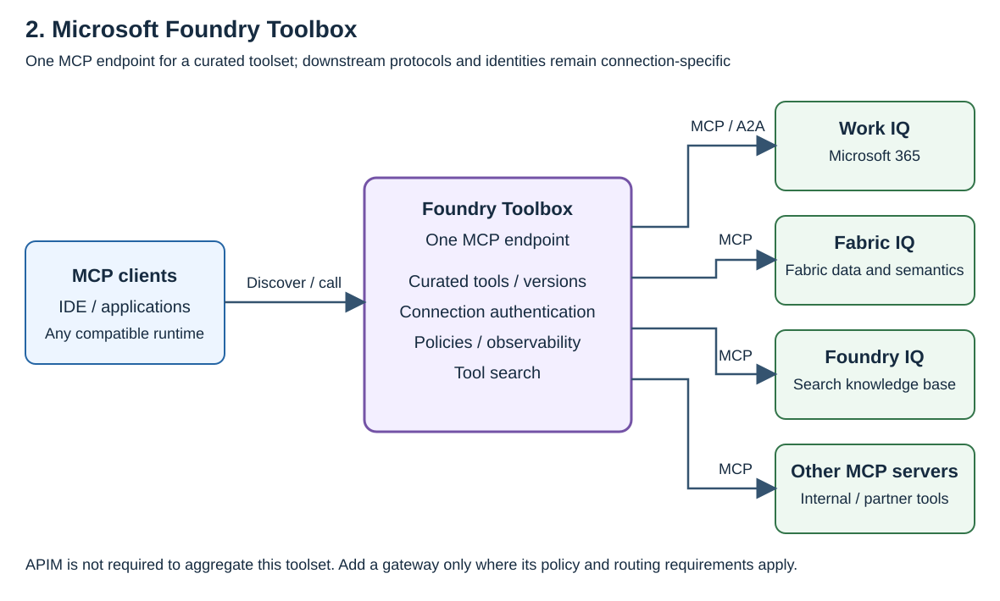
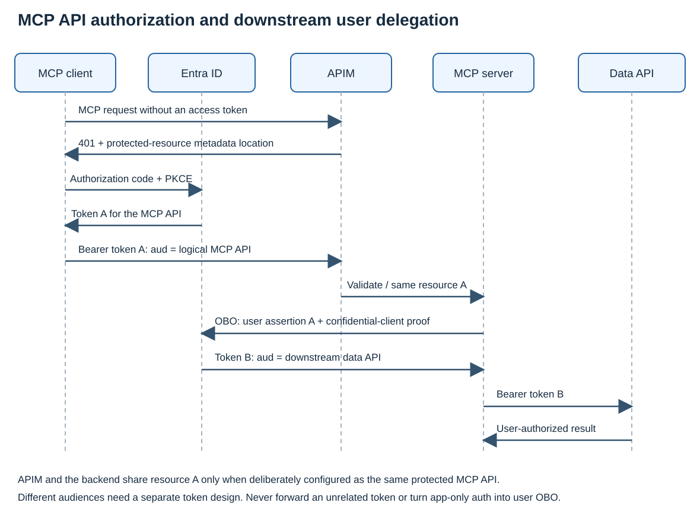

# Azure MCP 구성 — APIM·Toolbox·IQ와 사용자 인증

**Azure API Management(APIM)**는 사내·외부 MCP와 REST API에 공통 접근 정책을 적용하는 API gateway입니다. **Microsoft Foundry Toolbox**는 여러 도구의 설정과 인증을 관리하고 하나의 MCP-compatible endpoint로 제공합니다. Toolbox에는 일반 MCP 서버뿐 아니라 Microsoft 365·Fabric·기업 지식에 접근하는 IQ 도구도 포함할 수 있습니다.

두 서비스의 핵심 기능과 공식 지원 범위를 먼저 비교한 뒤, IQ 연결, Toolbox 통합, 사용자 인증과 OBO를 설명합니다. 직접 따라 하는 배포 명령과 실제 응답은 마지막의 [실행 예제와 확인 결과](#7)에 연결합니다.

## 소개하는 서비스

| 서비스 | 핵심 기능 | 공식 문서 |
|---|---|---|
| **Azure API Management / AI gateway** | Remote MCP에 인증·인가·트래픽 정책 적용, REST operation을 MCP tool로 제공, 요청 telemetry와 backend credential 관리 | [기존 MCP 연결](https://learn.microsoft.com/azure/api-management/expose-existing-mcp-server), [REST-to-MCP](https://learn.microsoft.com/azure/api-management/export-rest-mcp-server), [인증](https://learn.microsoft.com/azure/api-management/secure-mcp-servers) |
| **Microsoft Foundry Toolbox** | 도구 집합을 하나의 MCP endpoint로 제공, connection 인증·version·정책 관리, Tool search로 필요한 도구 검색 | [Toolbox 개요](https://learn.microsoft.com/azure/foundry/agents/concepts/toolbox-overview), [인증](https://learn.microsoft.com/azure/foundry/agents/how-to/tools/tool-authentication), [Tool search](https://learn.microsoft.com/azure/foundry/agents/how-to/tools/tool-search) |
| **Work IQ·Fabric IQ·Foundry IQ** | 각각 Microsoft 365 업무 context, Fabric의 업무 데이터·의미 모델, 기업 문서 knowledge base를 도구로 제공 | [Work IQ](https://learn.microsoft.com/azure/foundry/agents/how-to/tools/work-iq), [Fabric IQ](https://learn.microsoft.com/azure/foundry/agents/how-to/tools/fabric-iq), [Foundry IQ](https://learn.microsoft.com/azure/foundry/agents/concepts/what-is-foundry-iq) |

### MCP protocol·인증 지원 범위

**2026-09-13 기준**입니다. “MCP 2.0”이라는 제품 공통 지원 등급은 사용하지 않습니다. 공식 MCP revision은 [`2026-07-28`](https://modelcontextprotocol.io/docs/2026-07-28/learn/versioning)이며, JSON-RPC 2.0이나 SDK·제품 `2.x`와 다릅니다.

다음 표는 제품 문서의 **명시된 범위·미기재·문서 상충**을 구분합니다. **미기재는 미지원 판정이 아니며**, 반대로 일반적인 “MCP 지원” 문구를 최신 revision의 모든 기능을 검증한 결과로 확대하지 않습니다.

| 확인 항목 | APIM | Foundry Toolbox |
|---|---|---|
| MCP 연결·endpoint | 기존 remote MCP proxy와 REST-to-MCP 제공 | 하나의 MCP-compatible consumer endpoint 제공 |
| 전송·revision | 외부 서버에 `2025-06-18` 이상 및 Streamable HTTP 또는 SSE 요구 | Streamable HTTP client 예제 제공. [REST 호출 예제](https://learn.microsoft.com/azure/foundry/agents/how-to/tools/toolbox)는 `initialize`와 `2025-03-26` 사용. 지원 가능한 전체 revision 목록은 아님 |
| `tools/list`·`tools/call` | 도구 노출과 정책 적용 문서화 | 도구 발견·호출 문서화. 비스트리밍 `tools/call` 미지원 제한 명시 |
| `resources` | **문서 상충:** [개요](https://learn.microsoft.com/azure/api-management/mcp-server-overview)는 미지원, [기존 MCP 연결](https://learn.microsoft.com/azure/api-management/expose-existing-mcp-server)은 외부 MCP resources 지원이라고 설명 | Skills를 MCP resources로 제공하고 `resources/list`로 확인하는 절차 문서화. 일반 remote resources 전체 중계는 미기재 |
| `prompts` | 미지원 명시 | `prompts/list` 미구현과 500 응답을 [문제 해결](https://learn.microsoft.com/azure/foundry/agents/how-to/tools/toolbox#troubleshoot)에 명시 |
| `2026-07-28`의 discovery·metadata·MRTR·subscriptions | 확인한 제품 문서에 항목별 지원 목록 없음 | 확인한 제품 문서에 항목별 지원 목록 없음 |
| MCP 접근 인증 | Entra token 검증 정책과 PRM authorization sample 안내 | Foundry 접근 credential·권한과 tool connection의 인증을 분리 |
| PRM·PKCE·client 등록 전체 흐름 | Token 검증만으로 전체 OAuth 흐름이 완성되는 것은 아님 | 확인한 개요·인증 문서는 최신 MCP OAuth 요구사항 전체의 conformance 목록이 아님 |
| Backend OAuth | Credential manager의 공유/service connection과 attended(user-delegated) connection, token 취득·cache·갱신·주입 문서화 | `oauth2` connection의 사용자 authorization·token lifecycle 관리 |
| 사용자별 Entra token·OBO | MCP 등록이나 token 검증 정책이 임의의 backend에 OBO를 자동 구성한다고 명시하지 않음 | `user-entra-token`은 지원되는 서비스용 audience-specific 사용자 token. Work IQ의 A2A 경로는 OBO를 명시하며, 모든 MCP connection에 같은 내부 구현을 보장하는 것은 아님 |

MCP의 HTTP authorization은 client, MCP protected resource, authorization server가 함께 구현하는 계약입니다. PKCE와 client 등록을 gateway의 JWT 검증 옵션 하나로 판단할 수는 없습니다. **OBO가 성공하는지와 최신 MCP 통신 규격을 지원하는지는 별도로 확인**해야 합니다. 규격의 세부 요구사항은 Appendix에 정리합니다.

APIM resources 지원은 상충하는 두 문서만으로 확정하지 않습니다. 아래 설명과 실행 예제는 tools 호출을 중심으로 하며, resources가 필요하다면 대상 환경에서 별도 확인해야 합니다. Toolbox의 `stream=False` 제한은 해당 client 사용 지침을 따라 처리하며, 이것을 “SSE만 사용하므로 최신 MCP 전체 미지원” 같은 판정으로 바꾸지 않습니다.

## 1. APIM / AI gateway로 MCP 접근 관리

개발 도구에는 승인된 APIM MCP 주소를 제공하고, APIM에서 backend별 접근 정책을 적용합니다. Backend는 Azure에 직접 배포한 MCP일 수도 있고, 호환되는 타사 SaaS의 remote MCP일 수도 있습니다. Transport·인증·network 지원은 각 서버에 맞춰 확인합니다.

### 기존 MCP와 REST API

- **기존 MCP:** APIM에 remote MCP endpoint를 연결하고 정책을 적용합니다.
- **기존 REST API:** 선택한 REST operation을 MCP tool로 제공합니다. 별도 MCP 업무 서버 코드를 작성하지 않고 기존 API를 도구로 사용할 수 있습니다.

APIM에서 여러 MCP를 관리한다는 것이 모든 도구를 자동으로 합친 단일 catalog endpoint를 의미하지는 않습니다. MCP API별 endpoint와 정책을 관리하는 구성과, Toolbox가 하나의 toolset을 제공하는 구성을 구분합니다.

### 사용자별 접근과 감사 기록

[`validate-azure-ad-token`](https://learn.microsoft.com/azure/api-management/validate-azure-ad-token-policy)으로 검증한 token의 identity와 scope/role을 정책 판단에 사용할 수 있습니다. Client가 임의로 보낸 `user-id`나 `agent-id` header만으로 감사 주체를 확정하지 않습니다. Agent의 app-only token만 도착했다면 최종 사용자도 자동으로 식별되는 것은 아닙니다.

APIM은 공통 정책과 요청 기록을 적용하기 좋은 지점이지만 **gateway HTTP 로그와 실제 tool 실행 기록은 다릅니다**. 감사 요건이 있다면 검증된 호출 주체, 대상 도구, 실행 결과, correlation ID를 연결하고 수집 누락·보관 기간·접근 통제를 설계합니다. Token과 민감한 tool payload를 그대로 저장하지 않습니다.

[Microsoft Learn은 Application Insights가 감사 시스템을 목적으로 하지 않는다고 명시](https://learn.microsoft.com/azure/api-management/api-management-howto-app-insights#performance-implications-and-log-sampling)합니다. Sampling된 성능 telemetry만으로 모든 사용자 행위에 대한 감사 기록이 완성되었다고 판단하지 않습니다.

## 2. IQ 도구와 MCP는 어떻게 연결되는가

IQ는 MCP protocol의 기능 이름이 아니라 **업무 데이터와 지식을 제공하는 서비스**입니다. MCP는 그 기능을 client가 호출할 수 있게 연결하는 방식 중 하나입니다. IQ별로 제공 endpoint와 인증 경로가 다릅니다.

| IQ | 제공하는 기능 | MCP·Toolbox 연결 |
|---|---|---|
| **Work IQ** | Microsoft 365의 메일·회의·파일·채팅 등 업무 context | Work IQ Chat은 A2A를 사용하며 해당 경로의 OBO를 명시. 다른 선택 항목은 MCP endpoint 사용. Toolbox는 선택한 도구를 자신의 MCP endpoint로 제공 |
| **Fabric IQ** | Ontology, Power BI semantic model, Fabric data agent를 통한 업무 데이터 조회·추론 | Fabric item 유형별 MCP endpoint 제공. 연결 identity와 인증 방식은 item·connection 경로에 따라 다름 |
| **Foundry IQ** | Azure AI Search 기반 knowledge base에서 여러 source를 검색하고 근거 있는 결과 반환 | Knowledge base의 MCP endpoint를 Toolbox connection으로 연결하는 [공식 예제](https://learn.microsoft.com/azure/foundry/agents/quickstarts/quickstart-foundry-iq-hosted-agent#step-3-provision-azure-resources-and-the-knowledge-base) 제공 |

Work IQ·Fabric IQ 연결 문서는 preview 범위를 포함합니다. Foundry IQ는 일부 기능이 GA이지만 [MCP 연결 문서](https://learn.microsoft.com/azure/foundry/agents/how-to/foundry-iq-connect)의 예제는 preview API를 사용합니다. 각 서비스의 비용·라이선스와 데이터 처리 위치를 확인합니다.

**MCP로 연결했다는 사실만으로 원본 데이터의 사용자 권한 검사가 완성되지는 않습니다.** Foundry IQ의 사용자별 문서 필터링은 source별 ACL 구성과 사용자 token 전달 설정을 확인해야 합니다. 위 Toolbox 연결 예제는 `agentic-identity`를 사용하므로 그 자체가 사용자 OBO 예제는 아닙니다. Work IQ Chat의 A2A 호출과 다른 Work IQ MCP 호출도 같은 protocol 경로라고 설명하지 않습니다.

## 3. Toolbox로 IQ와 MCP를 하나의 endpoint에 구성

Toolbox에 사용할 도구와 connection을 등록하면 client는 각 서버를 따로 구성하는 대신 **하나의 Toolbox MCP endpoint**를 사용합니다. Connection별 credential, 도구 version, 정책을 중앙에서 관리할 수 있습니다. Foundry 밖의 MCP-compatible client에서도 사용할 수 있습니다.

Toolbox는 [Build·Discover·Consume·Govern](https://learn.microsoft.com/azure/foundry/agents/concepts/toolbox-overview)을 다룹니다. 단순히 token을 줄이는 검색 기능만 제공하는 것은 아닙니다.

- **도구 구성과 공유:** 업무에 필요한 도구를 모아 여러 client가 재사용합니다.
- **Connection 인증:** 도구에 맞는 OAuth·사용자 token·서비스 identity·key를 구성합니다.
- **Version과 정책:** 도구 집합을 version으로 관리하고 인증·인가·guardrail·관측 설정을 적용합니다.
- **Tool search:** 큰 도구 집합에서 해당 요청에 필요한 tool definition을 찾습니다.

### Tool search와 토큰 절감 데모

도구 정의를 모두 model context에 전달하는 대신 `tool_search`로 필요한 도구를 찾고 `call_tool`로 실행합니다. 검색은 이름·description·parameter metadata의 BM25 검색을 사용합니다. Pin·auto-pin으로 일부 도구는 처음부터 노출될 수 있으므로 초기 목록이 항상 정확히 두 개라고 가정하지 않습니다.

Microsoft Learn의 [Toolbox 개요](https://learn.microsoft.com/azure/foundry/agents/concepts/toolbox-overview)에 삽입된 **[Toolboxes in Microsoft Foundry 영상](https://www.youtube.com/watch?v=7bBvmifVMew)**에서 이 차이를 보여줍니다.

| 영상 위치 | 확인할 내용 |
|---|---|
| [3:22부터](https://www.youtube.com/watch?v=7bBvmifVMew&t=202s) | Work IQ 도구 추가와 connection 인증 |
| [6:05부터](https://www.youtube.com/watch?v=7bBvmifVMew&t=365s) | 전체 도구 정의가 context를 차지하는 문제와 필요한 도구만 찾는 방식 |
| [8:34–9:13](https://www.youtube.com/watch?v=7bBvmifVMew&t=514s) | 같은 상품 catalog 질문에 대해 발표자가 제시한 input token 비교 |

영상의 설명과 공개 자막에서 제시하는 값은 다음과 같습니다.

| 해당 데모 | Input tokens |
|---|---:|
| 전체 도구 정의를 사용하는 비교 대상 | 4,676 |
| 필요한 도구를 검색해 사용하는 비교 대상 | 467 |

약 **90% 감소, 기존의 약 1/10**에 해당합니다. 이는 **영상의 특정 질문·도구 집합에서 제시한 값**이며 이 저장소에서 측정한 결과나 일반적인 절감률 보장이 아닙니다. Model, 도구 정의, 검색 횟수, 결과 크기와 cache가 달라지면 결과도 달라집니다.

실제 도입 시에는 초기 schema 크기만 보지 않고 업무 완료까지의 model input/output tokens, 검색 round-trip, latency, 실패·재시도를 같은 조건으로 비교합니다. 설정 방법은 [Tool search 공식 문서](https://learn.microsoft.com/azure/foundry/agents/how-to/tools/tool-search)와 [Toolbox sample](https://github.com/hellices/devguidesample/tree/main/samples/microsoft-foundry/mcp-toolbox)에 있습니다.

## 4. MCP authorization과 OBO를 함께 설계하기

MCP의 HTTP authorization은 **client가 MCP API에 접근할 token을 얻고 사용하는 절차**입니다. Entra OBO는 **그 API가 별도 데이터 API를 사용자 권한으로 호출할 token을 얻는 절차**입니다. 둘은 다음처럼 연결되지만 같은 기능은 아닙니다.

[MCP authorization 보안 요구사항](https://modelcontextprotocol.io/specification/2026-07-28/basic/authorization/security-considerations)은 token의 대상 리소스를 검증하고, MCP에 들어온 token을 별도 API에 그대로 재사용하지 않도록 요구합니다. **Entra 기반 MCP가 ARM·Graph 같은 별도 API를 사용자 권한으로 호출할 때 OBO는 이 token 분리를 구현하는 방법**입니다. 이것이 MCP 인증과 OBO를 함께 설명할 이유이며, OBO가 MCP 전체 규격의 필수 기능이라는 뜻은 아닙니다.

1. Client는 MCP protected-resource metadata와 authorization server 정보를 확인합니다.
2. Authorization code + PKCE, client 등록과 consent를 통해 MCP API용 token A를 받습니다.
3. MCP API는 token A의 대상·유효성·필요 권한을 검사합니다.
4. 사용자 위임이 필요한 중간 API는 자신의 자격 증명과 token A를 assertion으로 제출해 downstream용 token B를 받습니다.
5. Downstream API에는 token B를 제시합니다. App-only token을 사용자 OBO assertion으로 대체하지 않습니다.

OBO는 APIM이 없어도 구현할 수 있습니다. 또한 `server/discover`, transport와 요청 metadata를 구현했다고 OBO가 자동 구성되는 것도 아닙니다.

### APIM을 사용하는 경우

[APIM의 MCP 인증 문서](https://learn.microsoft.com/azure/api-management/secure-mcp-servers)는 inbound token 검증과 outbound 인증을 따로 설명합니다.

- **Inbound:** Entra token과 필요한 claim을 정책으로 검사합니다.
- **Outbound:** Credential manager와 정책으로 backend connection의 OAuth token을 가져와 주입할 수 있습니다.
- **사용자 OBO:** 앞의 두 기능을 켰다는 이유만으로 임의의 MCP backend에 사용자 OBO가 구성되었다고 판단하지 않습니다. 실제 token 교환의 주체와 downstream audience·permission·consent를 확인합니다.

[Credential manager](https://learn.microsoft.com/azure/api-management/credentials-overview#attended-user-delegated-scenario)는 사용자 context에 맞는 **attended(user-delegated) connection**도 제공합니다. 반면 기본 unattended connection은 호출 사용자와 연결되지 않은 공통 credential을 사용할 수 있습니다. 사용자별 OAuth connection을 제공한다는 사실과 Entra OBO grant로 incoming token을 교환한다는 사실은 구분합니다.

이 저장소의 Azure MCP·Python MCP 예제에서는 **MCP 서버가 ARM용 OBO를 수행**했습니다. APIM의 자동 OBO 기능을 검증한 예제가 아닙니다.

Gateway와 backend가 하나의 논리적 MCP protected resource를 구현하도록 설계된 경우의 내부 token 전달과, MCP 서버가 별도 API를 호출하는 흐름도 구분합니다. 전자는 token 검증과 내부 전달 구간의 기밀성이 필요하고, 후자는 대상 API용 별도 token이 필요합니다. [RFC 6750 §5.2](https://www.rfc-editor.org/rfc/rfc6750.html#section-5.2)는 다계층 리소스 서버의 token 보호를 설명하며, 임의의 cross-audience 전달을 허용하는 예외는 아닙니다.

### Toolbox를 사용하는 경우

[Toolbox authentication](https://learn.microsoft.com/azure/foundry/agents/how-to/tools/tool-authentication)은 **Toolbox 접근 인증**과 **tool의 데이터 접근 인증**을 구분합니다.

| Connection 설정 | 공식 문서가 설명하는 동작 |
|---|---|
| `oauth2` | 사용자가 OAuth authorization을 완료하고 Foundry가 해당 credential의 취득·갱신·주입을 관리 |
| `user-entra-token` | 이를 지원하는 Microsoft 서비스에 대상 audience의 사용자 Entra token 제공 |
| `agentic-identity` / `project-managed-identity` | Agent 또는 project의 서비스 identity 사용 |
| `custom-keys` / `none` | 저장된 key/header 또는 익명 호출 |

`oauth2`나 `user-entra-token`이라는 이름만으로 모든 connection이 Entra OBO grant를 사용한다고 단정하지 않습니다. 반면 **Work IQ Chat의 A2A 경로는 [공식 문서에서 OBO를 명시](https://learn.microsoft.com/azure/foundry/agents/how-to/tools/work-iq#how-it-works)**합니다. 이것은 특정 tool 연결에 대한 근거이지 Toolbox 전체의 최신 MCP protocol 준수 증명은 아닙니다.

Toolbox에서 사용자 OAuth를 관리하는 경로라면, 뒤의 gateway가 이를 서비스 identity token으로 덮어쓰지 않도록 credential 소유 위치를 정합니다. 타사 MCP의 OAuth와 Entra OBO도 구분하며, 지원되지 않는 위임 흐름을 공유 credential로 조용히 바꾸지 않습니다.

## 5. MCP 서버를 준비하는 방법

| 방법 | 사용할 때 | 구현·확인 위치 |
|---|---|---|
| SDK로 MCP 서버 작성 | 자체 업무 로직과 데이터 접근을 tool로 구현 | Container Apps·App Service·Functions·AKS 등에서 실행. [Azure hosting 비교](https://learn.microsoft.com/azure/container-apps/mcp-choosing-azure-service) |
| 기존 REST API 변환 | 이미 운영하는 API operation을 tool로 제공 | APIM REST-to-MCP 또는 지원되는 Toolbox OpenAPI 도구 구성 |
| 기존 remote MCP 연결 | 사내·타사에서 제공하는 도구 재사용 | 원래 endpoint의 protocol·인증·network 조건을 확인해 직접 또는 gateway/Toolbox를 통해 연결 |

서버 코드를 어디에서 실행할지, 여러 도구를 어떻게 묶을지, 공통 접근 정책을 어디에서 적용할지는 별도의 선택입니다. 기존 remote MCP를 사용하기 위해 그 서버를 Azure에 다시 배포할 필요는 없습니다.

## 6. 엔터프라이즈 구성에 적용할 때의 판단

이 절은 앞의 공식 지원 표와 구분한 **설계 제안**입니다.

- **몇 개의 MCP·IQ 도구를 한 주소로 제공하려는 경우:** Toolbox 단독 구성을 먼저 검토합니다. Toolset·connection 인증·version 관리가 요구사항에 맞는지 확인합니다.
- **여러 팀의 MCP와 기존 API에 공통 정책을 적용하려는 경우:** APIM을 중앙 관리 지점으로 검토합니다. 사내·타사별 인증, 호출 제한, 승인 endpoint와 감사 이벤트 정책을 일관되게 운영할 수 있는지가 판단 기준입니다.
- **Toolbox와 APIM을 함께 사용하는 경우:** 설정 가능한 custom MCP connection에서 승인된 APIM endpoint를 대상으로 하는 구성을 검토할 수 있습니다. 모든 IQ·managed OAuth·내장 도구가 같은 경로를 지원한다고 가정하지 말고 실제 URL·인증 주체·요청 로그로 확인합니다.
- **사용자별 데이터 권한이 중요한 경우:** 제품 이름보다 실제 token의 대상과 사용자 context, consent, backend 권한 검사를 확인합니다. OBO 성공 여부와 MCP protocol 호환성은 각각 검증합니다.

내부망에서는 client의 private endpoint 접근과 gateway/Toolbox의 backend 연결을 따로 확인합니다. [Toolbox network isolation](https://learn.microsoft.com/azure/foundry/agents/how-to/tools/toolbox-network-isolation)은 Foundry project network를 따르며, 도구 유형별 지원 조건이 다릅니다. Entra 로그인이나 같은 VNet에 있다는 사실만으로 필요한 route·DNS·접근 제어가 완성되지는 않습니다.

## 7. 실행 예제와 확인 결과

GitHub·Azure·AKS·Learn MCP는 아래 실행 절차에서 연결과 인증을 확인하기 위해 사용한 예제 서버입니다. 테스트 프레임워크 대신 `azd`, 공식 MCP Inspector, `curl`, `kubectl`을 단계별로 실행했습니다.

| 확인한 내용 | 실행 방법과 관측 결과 | 따라 하기·기록 |
|---|---|---|
| Azure 배포 | Native `azd up`으로 provisioning·ACR remote build·앱 배포, 33분 26초 | [배포 절차](https://github.com/hellices/devguidesample/blob/main/samples/azure-api-management/mcp-entra-lab/walkthrough.md#1-azd로-환경-배포), [실행 이력](../../../cases/azure-api-management/mcp-entra-validation/index.md#_2) |
| REST-to-MCP | 원래 REST 응답과 MCP `getInventory` 결과의 가상 재고 비교 | [REST/MCP 호출 절차](https://github.com/hellices/devguidesample/blob/main/samples/azure-api-management/mcp-entra-lab/walkthrough.md#5-rest-api를-apim-mcp-tool로-호출), [응답·캡처](../../../cases/azure-api-management/mcp-entra-validation/index.md#apim-rest-to-mcp) |
| 사용자 OBO | Native Azure MCP와 Python MCP의 도구 호출로 ARM resource group 조회 | [OBO 호출 절차](https://github.com/hellices/devguidesample/blob/main/samples/azure-api-management/mcp-entra-lab/walkthrough.md#6-azure-mcp에서-obo로-azure-조회), [관측 결과](../../../cases/azure-api-management/mcp-entra-validation/index.md#azure-python-mcp-obo) |
| 기존 remote MCP proxy | APIM을 통해 Learn의 도구 목록과 검색 결과 확인 | [Proxy 호출 절차](https://github.com/hellices/devguidesample/blob/main/samples/azure-api-management/mcp-entra-lab/walkthrough.md#7-apim을-통해-기존-learn-mcp-호출), [실행 기록](../../../cases/azure-api-management/mcp-entra-validation/index.md#learn-mcp) |
| 인증 실패·복구 | 무인증·wrong audience의 401, 허용 client 제외 시 403, 복구 후 정상 조회 | [401/403 절차](https://github.com/hellices/devguidesample/blob/main/samples/azure-api-management/mcp-entra-lab/walkthrough.md#8-401과-403-확인), [응답 기록](../../../cases/azure-api-management/mcp-entra-validation/index.md#_3) |
| 로컬 MCP 연결 | Inspector로 GitHub·Azure·Learn 도구 호출, AKS MCP로 pod 조회 | [로컬 연결과 내부망 접속](https://github.com/hellices/devguidesample/blob/main/samples/azure-api-management/mcp-entra-lab/walkthrough.md#2-로컬-mcp-서버-연결) |
| Toolbox·Tool search | 공식 문서·CLI와 azd service 구성을 확인한 수동 시나리오. **실제 Foundry 배포·토큰 절감 실측은 수행하지 않음** | [Toolbox sample과 확인 범위](https://github.com/hellices/devguidesample/tree/main/samples/microsoft-foundry/mcp-toolbox) |

실제 실행 기록은 **2026-09-13의 APIM·Container Apps 예제**에 해당합니다. IQ의 실데이터 권한, Toolbox의 사용자 OAuth, 최신 MCP 모든 기능의 상호운용성을 이 결과로 검증했다고 확대하지 않습니다. API별 관측한 protocol revision과 환경 정리 절차도 연결된 sample·사례에 남겼습니다.

## Appendix. “MCP 2.0”과 실제 protocol 변경

**2026-09-13 확인 기준** 공식 Current MCP protocol은 [`2026-07-28`](https://modelcontextprotocol.io/docs/2026-07-28/learn/versioning)입니다. Protocol은 날짜형 revision을 사용합니다. **JSON-RPC 2.0**, Python SDK `2.x`, Azure MCP 제품 `2.x`는 서로 다른 버전 축입니다.

### `2025-11-25`와 `2026-07-28` 비교

[이전 lifecycle](https://modelcontextprotocol.io/specification/2025-11-25/basic/lifecycle), [이전 transport](https://modelcontextprotocol.io/specification/2025-11-25/basic/transports), [현재 변경 목록](https://modelcontextprotocol.io/specification/2026-07-28/changelog)을 기준으로 비교합니다.

| 항목 | `2025-11-25` | `2026-07-28` |
|---|---|---|
| 시작 절차 | `initialize` → `notifications/initialized` | Handshake 제거, 요청별 version·capability 선언 |
| Protocol session | 서버가 선택적으로 session ID 발급 | Protocol session과 `Mcp-Session-Id` 제거 |
| 서버 정보 | 초기화 결과의 정보·capability | `server/discover`로 조회. 서버 구현은 필수, client의 선행 호출은 선택 |
| HTTP 요청·응답 | POST 요청, JSON 또는 SSE 응답 | POST 요청과 JSON/SSE 응답 유지 |
| 독립 알림 스트림 | 선택적 GET SSE | GET 제거, `subscriptions/listen`의 POST 응답 스트림 |
| 추가 입력 요청 | 서버가 독립 JSON-RPC 요청을 전달 가능 | Multi-Round Trip Requests(MRTR)의 `input_required` 결과와 후속 요청 |
| 결과 구분 | `resultType` 없음 | `resultType` 필수. 구형 응답의 생략 값은 `complete`로 해석 |
| SSE 재개·취소 | 재개를 선택적으로 지원, 단절 자체는 취소가 아님 | `Last-Event-ID` 재개 제거, 응답 스트림 종료로 해당 요청 취소 |

**SSE가 없어졌다는 뜻이 아닙니다.** 독립 GET 스트림과 session 계약이 바뀌었으며 POST의 SSE 응답은 유지됩니다. 이전 구현도 session과 GET 스트림을 반드시 제공해야 했던 것은 아닙니다.

### 요청별 metadata와 HTTP header

아래는 현재 [기본 메시지 계약](https://modelcontextprotocol.io/specification/2026-07-28/basic)과 [Streamable HTTP](https://modelcontextprotocol.io/specification/2026-07-28/basic/transports/streamable-http)의 **RPC 요청** 요구사항입니다.

| 위치 | 요구사항 |
|---|---|
| `params._meta["io.modelcontextprotocol/protocolVersion"]` | 매 요청 필수 |
| `params._meta["io.modelcontextprotocol/clientCapabilities"]` | 매 요청 필수. 선택적 capability가 없으면 `{}` |
| `params._meta["io.modelcontextprotocol/clientInfo"]` | 매 요청 권고 |
| `result._meta["io.modelcontextprotocol/serverInfo"]` | 매 결과 권고 |
| `MCP-Protocol-Version` | 본문의 protocol version과 일치해야 함 |
| `Mcp-Method` | 본문의 JSON-RPC `method`와 일치해야 함 |
| `Mcp-Name` | `tools/call`, `resources/read`, `prompts/get`에서 필수. 해당 `params.name` 또는 `params.uri` 사용 |
| `Accept` | `application/json`과 `text/event-stream`을 모두 포함 |

`clientInfo`와 `serverInfo`는 자체 신고 정보이지 인증된 identity가 아닙니다. `Mcp-Name`을 안전한 ASCII header 값으로 표현할 수 없다면 명세의 Base64 sentinel 인코딩을 적용합니다. HTTP POST에는 단일 JSON-RPC request 또는 notification을 보내며 client가 JSON-RPC response를 보내지는 않습니다. 현재 core에는 client→server HTTP notification이 없으므로 RPC header 요구사항을 notification에 임의로 확장하지 않습니다.

### Discovery와 오류 처리

[`server/discover`](https://modelcontextprotocol.io/specification/2026-07-28/server/discover)의 정상 응답은 `result.supportedVersions`를 사용합니다. 지원하지 않는 버전 오류는 `error.data.supported`와 `error.data.requested`를 사용합니다. OAuth authorization server discovery와는 다른 기능입니다.

| 상황 | 현재 HTTP / JSON-RPC 계약 |
|---|---|
| 지원하지 않는 revision | `400` / `-32022` |
| 필수 본문 metadata 누락 | `400` / `-32602` |
| 필요한 client capability 누락 | `400` / `-32021` |
| 필수 header 누락·형식 오류·본문과 불일치 | `400` / `-32020` |
| 구현하지 않은 RPC method | `404` / `-32601` |
| Modern-only endpoint의 GET/DELETE | `405` 권고 |
| Access token 부재·무효 / 권한 부족 | 각각 `401` / `403` |

구형 session의 `404`는 재초기화를 의미할 수도 있었습니다. [버전 호환 처리](https://modelcontextprotocol.io/specification/2026-07-28/basic/versioning)는 상태 코드만 보지 않고 구조화된 오류를 검사합니다. 특히 `401/403`을 protocol downgrade로 처리하거나, modern header 오류를 무조건 `initialize` 재시도로 바꾸지 않습니다. Notification의 `202 Accepted`·빈 본문을 일반 tool 실행 완료 응답으로 해석하지 않습니다.

### HTTP authorization의 protocol 요구사항

MCP authorization 자체는 선택적이며, 다음은 [HTTP authorization을 채택하는 경우](https://modelcontextprotocol.io/specification/2026-07-28/basic/authorization)의 계약입니다.

| 항목 | 현재 요구사항 |
|---|---|
| Protected resource | RFC 9728 metadata와 하나 이상의 `authorization_servers` 제공 |
| Metadata 위치 | 서버는 401 challenge의 `resource_metadata` 또는 well-known 방식 제공. Client는 둘 다 지원하고 challenge URL 우선 |
| Authorization server | RFC 8414 또는 OIDC Discovery 지원. Client는 두 방식과 발견된 `issuer`의 일치 여부 확인 |
| 대상 리소스 | Authorization·token 요청 모두에 RFC 8707 `resource` 포함. 대상 MCP 서버의 canonical URI 사용 |
| PKCE | 구현과 서버 지원 확인 필수. 기술적으로 가능하면 `S256` 사용 |
| Client 등록 | Client ID는 필요하지만 DCR은 필수가 아님. 사전 등록 옵션·CIMD 지원은 권고, DCR은 현재 선택적·deprecated |
| Token | 대상 리소스·유효성·필요 권한을 검증. `resource`를 보냈다는 사실이 서버 검증을 대신하지 않음 |

세부 요구사항은 [authorization server discovery](https://modelcontextprotocol.io/specification/2026-07-28/basic/authorization/authorization-server-discovery), [client registration](https://modelcontextprotocol.io/specification/2026-07-28/basic/authorization/client-registration), [security considerations](https://modelcontextprotocol.io/specification/2026-07-28/basic/authorization/security-considerations)를 따릅니다. Metadata에 `code_challenge_methods_supported`가 없으면 PKCE 지원을 확인하지 못한 상태로 authorization을 진행하지 않습니다. 사전 등록·DCR credential은 issuer별로 관리합니다. CIMD의 참조 규격은 현재 IETF draft입니다.

이 protocol 요구사항이 Entra·모든 IDE·모든 gateway의 동일 기능 지원을 보장하지는 않습니다. Sample의 수동 token 발급·호출 결과를 각 IDE의 interactive OAuth 전체 흐름을 검증한 것으로 해석하지 않습니다.

### Gateway를 사이에 둘 때

Client→gateway와 gateway→MCP backend의 실제 revision을 각각 확인합니다. 헤더를 추가하거나 session header만 제거하는 것으로 신·구 protocol 변환이 끝나지 않습니다. JSON/SSE 보존, buffering·timeout과 취소 동작도 확인합니다.

단절된 요청을 재실행하려면 새 request ID를 사용하지만, 이미 발생한 업무 부작용이 롤백되었다는 뜻은 아닙니다. 쓰기 도구의 자동 재시도는 별도의 멱등성 정책이 필요합니다. Protocol의 session 제거는 token audience를 없애거나 Entra OBO를 자동으로 제공하는 변경이 아닙니다.
