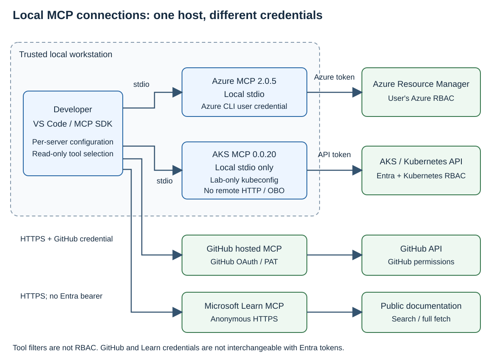
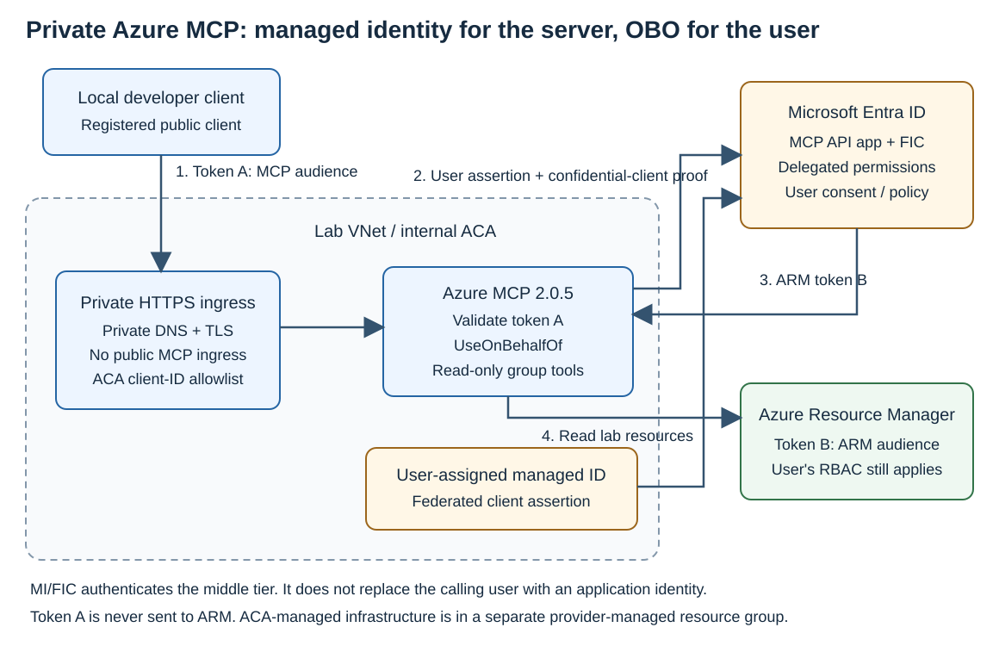
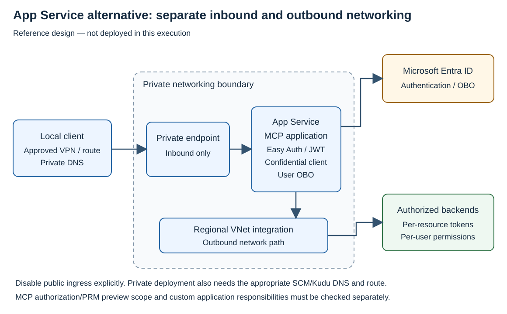
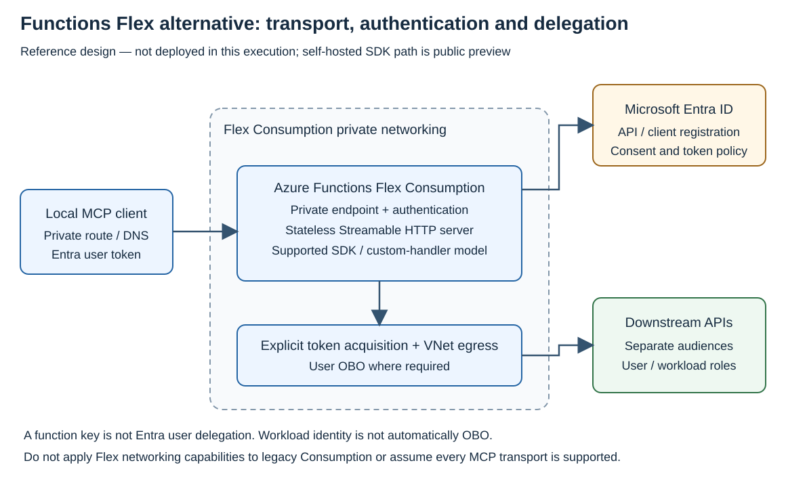

# MCP 서버별 인증과 Azure 호스팅 옵션 비교

Azure 리소스를 사용자의 권한으로 조회하려면 Azure MCP와 Entra OBO를 사용할 수 있습니다. 기존 REST API를 MCP tool로 제공하려면 APIM의 REST-to-MCP가, 이미 운영 중인 MCP 서버 앞에 인증 정책을 적용하려면 APIM의 기존 MCP 프록시가 적합합니다.

**처음 구성할 때는 [Azure MCP 통합 가이드](../../../labs/azure-api-management/mcp-rest-and-upstream/index.md)를 따르세요.** 구성 선택부터 azd 배포·호출·결과 확인까지 한 페이지에서 진행할 수 있습니다. 아래는 **2026-09-13** 기준의 선택 근거와 지원 범위를 정리한 참고 자료입니다. App Service와 Functions는 공식 문서에 따른 대안이며, 통합 가이드의 배포 대상은 아닙니다.

## MCP protocol과 패키지 버전

“MCP 2.0”만으로는 어떤 버전을 사용하는지 알 수 없습니다. protocol revision, SDK, 서버 패키지를 각각 지정해야 연결 방식을 비교할 수 있습니다.

| 구분 | 비교에 사용한 값 | 의미 |
|---|---|---|
| MCP protocol revision | `2026-07-28` | 날짜로 구분하는 MCP 사양 |
| Python SDK | `mcp==2.2.0` | SDK 패키지 버전 |
| 메시지 형식 | JSON-RPC `2.0` | MCP 요청·응답의 RPC 형식 |
| 인증 표준 | OAuth `2.0` / `2.1` | access token 발급과 사용에 관한 표준 |
| Azure MCP Server | `2.0.5` | Azure MCP 서버 패키지 버전 |

Python SDK v2는 최신 사양과 이전 revision을 함께 지원합니다. SDK를 업데이트해도 연결한 서버가 사용하는 protocol revision까지 바뀌지는 않습니다. Learn MCP 연결에서 확인한 revision은 `2025-06-18`이며, Azure MCP 패키지 `2.0.5` 역시 “MCP protocol 2.0”을 뜻하지 않습니다.

`2026-07-28` 사양은 `server/discover`와 요청별 metadata를 사용하며 protocol session과 GET stream을 제거했습니다. 이전 revision의 연결에서는 `initialize`와 해당 revision의 세션 규칙을 사용합니다. HTTP POST에 대한 SSE 응답은 최신 사양에도 있으므로 “SSE를 모두 제거했다”는 설명은 맞지 않습니다. 자세한 차이는 [versioning](https://modelcontextprotocol.io/specification/2026-07-28/basic/versioning)과 [Streamable HTTP](https://modelcontextprotocol.io/specification/2026-07-28/basic/transports/streamable-http)에 있습니다.

MCP의 `server/discover`는 서버 기능을 확인하는 요청입니다. OAuth의 protected-resource metadata(PRM)는 클라이언트가 사용할 authorization server와 scope를 알려주는 문서로, 목적이 다릅니다.

## Azure·AKS·GitHub·Learn의 인증 방식

| MCP 서버 | 연결 방식 | 사용하는 자격 증명과 권한 |
|---|---|---|
| Azure MCP `2.0.5` | 로컬 stdio 또는 원격 HTTP | 로컬에서는 Azure 자격 증명, 원격에서는 Entra access token과 OBO 또는 호스팅 환경의 자격 증명 |
| AKS MCP `v0.0.20` | **로컬 stdio만 지원** | 로컬 사용자의 Azure CLI 로그인과 kubeconfig, Azure·Kubernetes RBAC |
| GitHub MCP | GitHub hosted 또는 로컬 서버 | GitHub OAuth 또는 PAT, 해당 GitHub 사용자의 repository 권한 |
| Microsoft Learn MCP | 공개 HTTP endpoint | 인증 없이 공개 문서 검색·조회 |

### Azure MCP의 OBO와 read-only 설정

Azure MCP `2.0.5`의 incoming delegated scope는 `Mcp.Tools.ReadWrite`입니다. `--read-only`를 사용해도 scope 이름은 바뀌지 않습니다. 도구의 읽기 전용 설정과 사용자의 Azure RBAC를 함께 적용합니다.

`--outgoing-auth-strategy UseOnBehalfOf`는 로그인한 사용자 대신 Azure 서비스를 호출합니다. `UseHostingEnvironmentIdentity`는 서버가 실행되는 환경의 자격 증명을 사용합니다. 이때 로컬에서는 Azure CLI 사용자, Azure에서는 managed identity가 사용될 수 있으므로 사용자별 권한이 필요한 서비스에는 OBO 여부를 명확히 설정해야 합니다.

연결 예제는 Azure MCP `2.0.5`와 Python SDK `2.2.0`을 기준으로 합니다. 서버를 업그레이드할 때는 패키지 버전뿐 아니라 protocol revision, 요구 scope, 사용할 도구도 함께 확인합니다.

### AKS MCP v0.0.20의 지원 범위

[v0.0.20 release](https://github.com/Azure/aks-mcp/releases/tag/v0.0.20)는 HTTP/SSE, browser-facing OAuth/OBO, token forwarding, container image·Helm·원격 배포를 제거했습니다. MCP 클라이언트가 로컬 binary를 stdio subprocess로 실행하는 방식만 지원합니다. `--access-level readonly`는 도구를 제한하는 옵션이며 Azure·Kubernetes RBAC를 대체하지 않습니다.

확인일의 [AKS Learn 문서](https://learn.microsoft.com/azure/aks/aks-model-context-protocol-server)에는 아직 원격 모드와 `--transport` 예제가 남아 있습니다. **v0.0.20에는 release의 로컬 stdio 구성을 적용합니다.** 해당 버전을 APIM 뒤에 원격 배포하는 예제로 사용하지 않습니다.

### GitHub OAuth와 익명 Learn 호출

Entra ID로 내부 MCP를 보호해도 GitHub API를 호출할 때는 GitHub OAuth 또는 PAT가 필요합니다. Entra OBO로 GitHub access token이 발급되는 것은 아닙니다.

Learn은 익명으로 호출합니다. APIM에서 Entra 인증을 추가하더라도 backend Learn 요청에는 incoming `Authorization` header를 전달하지 않습니다. 이 구성은 내부 사용자의 APIM 접근을 제한하는 것이며, 공개 GitHub·Learn endpoint 자체를 private endpoint로 바꾸지는 않습니다.

## Azure 호스팅 옵션

| 선택지 | 적합한 상황 | 내부망 접속 | 인증·OBO 구성 |
|---|---|---|---|
| Container Apps | 공식 Azure MCP나 자체 MCP를 container로 운영 | Internal environment와 private DNS | 앱의 JWT 검증·Container Apps authentication, 서버의 OBO |
| APIM | 기존 REST API를 tool로 제공하거나 기존 MCP에 정책 적용 | SKU에 따른 internal VNet 또는 private endpoint | Gateway에서 token 검사, backend 인증은 별도 설정 |
| App Service | 기존 웹 앱 운영 방식으로 자체 MCP 배포 | Inbound private endpoint, outbound VNet integration | Easy Auth 또는 앱 middleware, 별도 OBO 구현 |
| Functions Flex Consumption | SDK 기반 stateless MCP 호스팅 | Private endpoint와 VNet integration | Built-in auth 또는 서버 코드, 별도 OBO 구현 |

로컬 PC가 private endpoint나 internal VNet의 MCP에 접속하려면 private IP까지의 VPN/ExpressRoute 경로와 DNS가 필요합니다. 그 연결 위에서 전달한 HTTP 요청을 Entra access token으로 인증합니다.

### 1. Container Apps에서 Azure MCP OBO 사용

요청은 다음 순서로 처리됩니다.

1. 로컬 클라이언트가 Azure MCP API를 대상으로 access token을 받습니다.
2. Container Apps authentication이 허용 client ID를 검사하고, Azure MCP가 tenant·audience·scope를 검사합니다.
3. Azure MCP가 managed identity와 FIC로 confidential client를 인증하고, 사용자 token을 OBO user assertion으로 제출합니다.
4. ARM용 access token으로 Azure 리소스를 조회합니다. 조회 범위는 사용자의 Azure RBAC에 따릅니다.

Managed identity와 FIC는 이 흐름에서 **서버 앱의 인증 수단**입니다. ARM의 리소스 권한은 OBO를 통해 전달한 사용자에게 적용됩니다.

Native Azure MCP의 허용 클라이언트는 Container Apps `authConfigs`의 `identityProviders.azureActiveDirectory.validation.defaultAuthorizationPolicy.allowedApplications`로 제한합니다. 앱 등록의 `preAuthorizedApplications`는 consent 설정이므로 이 ACL을 대신하지 않습니다.

Internal Container Apps 환경의 앱 ingress `external: true`는 VNet에서 앱으로 접근할 수 있게 합니다. 인터넷 공개 설정이 아닙니다. 환경의 private DNS와 개발 PC의 DNS 전달 경로도 구성해야 합니다.

### 2. APIM에서 REST API를 MCP tool로 제공

APIM이 관리하는 REST API operation을 선택하면 MCP tool로 노출할 수 있습니다. 별도 MCP 서버 프로세스 없이 APIM이 MCP 요청을 REST 호출로 연결합니다.

샘플은 가상 inventory REST API를 사용합니다. [실습](../../../labs/azure-api-management/mcp-rest-and-upstream/index.md)에서는 inventory를 REST로 조회하고, MCP 도구 목록을 확인한 뒤 같은 항목을 tool로 조회합니다. Tool 리소스의 **`operationId`가 실제 REST operation의 리소스 ID를 가리켜야** 이 호출이 연결됩니다.

이 기능 자체가 REST backend의 인증을 OBO로 바꾸지는 않습니다. 업무 API를 연결할 때는 그 API의 access token, managed identity 또는 다른 인증 방식을 별도로 구성합니다. Python MCP의 resource group OBO 조회는 이 REST inventory 경로와 별개의 MCP 도구입니다.

### 3. APIM으로 기존 Learn MCP 프록시

이 방식은 기존 MCP 서버가 이미 제공하는 도구를 APIM을 통해 호출합니다. REST-to-MCP의 `operationId` 연결과 달리, MCP API에 **backend 리소스, `backendId`, `message` endpoint**를 연결합니다. Learn 요청에서는 APIM이 incoming Entra token을 검사한 뒤 `Authorization` header를 제거합니다.

APIM의 `2025-09-01-preview` 관리 문서·Bicep 타입과 실제 API·공식 AI-Gateway 샘플 사이에는 차이가 있습니다. 문서의 endpoint 배열 대신 실제 구성은 `message`를 key로 둔 `endpoints` object와 `backendId`를 사용합니다. 이 차이는 [사례 기록](../../../cases/azure-api-management/mcp-entra-validation/index.md)에 정리했으며, 관리 API 버전을 바꿀 때 다시 확인해야 합니다.

### 4. App Service 대안

기존 App Service 운영 환경에서 자체 MCP 서버를 웹 앱으로 제공할 때 고려할 수 있습니다.

Private endpoint는 앱으로 들어오는 요청에 사용하고, VNet integration은 앱이 private backend를 호출할 때 사용합니다. Private endpoint를 추가하는 것만으로 public access가 비활성화되지는 않습니다. 앱의 public access 설정과 SCM/Kudu용 private DNS도 함께 구성해야 합니다.

App Service의 MCP authorization과 PRM 지원은 확인일 기준 **preview**입니다. Easy Auth를 적용하더라도 ARM 등 다른 API를 사용자 권한으로 호출하려면 앱의 OBO 구현과 delegated permission·consent가 필요합니다.

### 5. Functions Flex Consumption 대안

SDK 기반 MCP 서버를 self-hosted/custom-handler 방식으로 호스팅하는 옵션입니다. [공식 문서](https://learn.microsoft.com/azure/azure-functions/self-hosted-mcp-servers)의 지원 범위는 **public preview, Flex Consumption, stateless Streamable HTTP**입니다.

Flex Consumption은 private endpoint와 VNet integration을 지원하지만 legacy Consumption은 같은 네트워크 기능을 제공하지 않습니다. Function key는 사용자 access token이 아니므로, Entra 사용자 인증과 OBO가 필요하다면 built-in auth 또는 서버 코드에서 별도로 처리해야 합니다.

## azd 기반 실습 구성

[샘플](https://github.com/hellices/devguidesample/tree/main/samples/azure-api-management/mcp-entra-lab)은 internal Container Apps와 APIM Developer를 사용합니다. `azure.yaml`의 `mcp` service는 `project: .`의 Python 앱을 `python-app` module로 배포하고, `infra/main.bicep`은 공통 Azure 리소스를 구성합니다. Image build는 `docker.remoteBuild: true`를 통해 ACR에서 수행합니다. Entra 앱 준비는 `preup` hook, managed identity와 FIC 연결은 `postprovision` hook에서 처리합니다.

Preview 전에는 `python3 scripts/identity.py prepare`로 필요한 Entra 앱 ID를 준비합니다. 수동 MCP 호출에는 공식 **MCP Inspector 2.5.0 CLI**를 사용하며, 샘플의 Node.js 요구 버전은 22.19 이상입니다.

실습은 다음 순서로 진행합니다.

1. Azure·Entra 권한과 로컬 도구를 준비하고, 배포 preview를 확인한 뒤 `azd up`으로 환경을 배포합니다.
2. Azure·AKS·GitHub·Learn의 로컬 MCP 연결을 각각 확인합니다.
3. 개발 PC에서 내부 MCP hostname으로 접속하고 Entra access token을 사용합니다.
4. APIM의 REST inventory tool을 `curl`로 호출합니다.
5. Inspector CLI로 공식 Azure MCP와 Python MCP에 연결해 resource group을 OBO로 조회합니다.
6. Inspector CLI로 APIM의 Learn MCP 프록시에 연결해 문서를 검색합니다.
7. Azure 리소스와 Entra 앱 객체를 정리합니다.

명령과 비용·정리 절차는 [실습 문서](../../../labs/azure-api-management/mcp-rest-and-upstream/index.md)를 따릅니다. App Service와 Functions로 변경한다면 각 제품의 preview 범위, 네트워크 구성, 사용자별 OBO 흐름을 별도로 확인해야 합니다.

## APIM SKU 선택

| SKU | MCP와 private network 구성 시 고려할 점 |
|---|---|
| Consumption | 현재 native MCP 지원 SKU 목록에 없음 |
| Developer | Internal VNet 연결이 가능해 실습에 사용. 비운영용이며 SLA 없음 |
| Basic / Standard classic | Inbound private endpoint를 지원하지만 private backend 연결 기능은 별도로 확인 필요 |
| Basic v2 | MCP 지원 여부와 필요한 private networking 지원 여부를 각각 확인 |
| Standard v2 | Inbound private endpoint와 outbound VNet integration을 함께 구성 |
| Premium / Premium v2 | 세대별 VNet injection 지원 범위와 비용을 비교 |

세부 기능은 [APIM 기능 비교표](https://learn.microsoft.com/azure/api-management/api-management-features)와 [VNet 구성 문서](https://learn.microsoft.com/azure/api-management/virtual-network-concepts)를 기준으로 선택합니다. 개발 PC가 내부 APIM에 접속하는 요구와 APIM이 private backend를 호출하는 요구를 모두 만족해야 합니다.

## OBO에 필요한 token과 권한

OBO의 입력은 중간 MCP API를 대상으로 발급한 **사용자 access token**입니다. v2 token의 `aud`는 중간 API의 client ID(GUID)여야 하며, ARM용 token이나 app-only token을 입력으로 사용할 수 없습니다.

중간 API는 confidential client로 인증한 뒤 별도의 ARM access token을 받습니다. API 앱의 delegated permission·consent와 사용자의 Azure RBAC가 모두 필요합니다. Scope URI, JWT의 `scp`, PRM의 `resource` URL은 용도가 다른 값입니다.

실제 앱 등록과 APIM 정책은 [Entra 인증 가이드](../../../guides/azure-api-management/mcp-entra-private-access/index.md)에 있습니다. 다른 IDE나 사용자를 연결할 때는 client ID·redirect URI·consent·Conditional Access와 해당 사용자의 RBAC를 적용해 같은 호출 순서로 확인할 수 있습니다.
