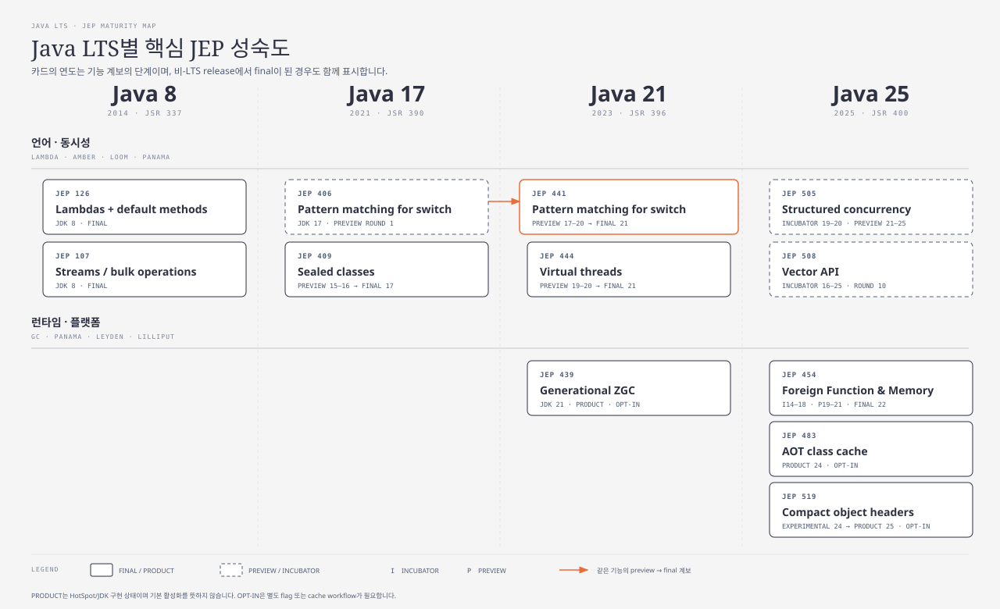

---
services:
- application-development
official_sources:
- title: Support roadmap for the Microsoft Build of OpenJDK
  url: https://learn.microsoft.com/en-us/java/openjdk/support
- title: JDK 8 Project
  url: https://openjdk.org/projects/jdk8/
- title: JDK 17 Project
  url: https://openjdk.org/projects/jdk/17/
- title: JDK 21 Project
  url: https://openjdk.org/projects/jdk/21/
- title: JDK 25 Project
  url: https://openjdk.org/projects/jdk/25/
- title: JEP 11 - Incubator Modules
  url: https://openjdk.org/jeps/11
- title: JEP 12 - Preview Language and VM Features
  url: https://openjdk.org/jeps/12
- title: JEP 126 - Lambda Expressions and Virtual Extension Methods
  url: https://openjdk.org/jeps/126
- title: JEP 107 - Bulk Data Operations for Collections
  url: https://openjdk.org/jeps/107
- title: JEP 395 - Records
  url: https://openjdk.org/jeps/395
- title: JEP 409 - Sealed Classes
  url: https://openjdk.org/jeps/409
- title: JEP 440 - Record Patterns
  url: https://openjdk.org/jeps/440
- title: JEP 441 - Pattern Matching for switch
  url: https://openjdk.org/jeps/441
- title: JEP 431 - Sequenced Collections
  url: https://openjdk.org/jeps/431
- title: JEP 456 - Unnamed Variables and Patterns
  url: https://openjdk.org/jeps/456
- title: JEP 511 - Module Import Declarations
  url: https://openjdk.org/jeps/511
- title: JEP 513 - Flexible Constructor Bodies
  url: https://openjdk.org/jeps/513
- title: JEP 444 - Virtual Threads
  url: https://openjdk.org/jeps/444
- title: JEP 506 - Scoped Values
  url: https://openjdk.org/jeps/506
- title: JEP 505 - Structured Concurrency
  url: https://openjdk.org/jeps/505
- title: JEP 454 - Foreign Function and Memory API
  url: https://openjdk.org/jeps/454
- title: JEP 484 - Class-File API
  url: https://openjdk.org/jeps/484
- title: JEP 485 - Stream Gatherers
  url: https://openjdk.org/jeps/485
- title: JEP 508 - Vector API
  url: https://openjdk.org/jeps/508
- title: JEP 470 - PEM Encodings of Cryptographic Objects
  url: https://openjdk.org/jeps/470
- title: JEP 502 - Stable Values
  url: https://openjdk.org/jeps/502
- title: JEP 507 - Primitive Types in Patterns, instanceof, and switch
  url: https://openjdk.org/jeps/507
- title: JEP 483 - Ahead-of-Time Class Loading and Linking
  url: https://openjdk.org/jeps/483
- title: JEP 514 - Ahead-of-Time Command-Line Ergonomics
  url: https://openjdk.org/jeps/514
- title: JEP 515 - Ahead-of-Time Method Profiling
  url: https://openjdk.org/jeps/515
- title: JEP 519 - Compact Object Headers
  url: https://openjdk.org/jeps/519
- title: JEP 450 - Compact Object Headers
  url: https://openjdk.org/jeps/450
- title: JEP 333 - ZGC
  url: https://openjdk.org/jeps/333
- title: JEP 377 - ZGC - A Scalable Low-Latency Garbage Collector
  url: https://openjdk.org/jeps/377
- title: JEP 439 - Generational ZGC
  url: https://openjdk.org/jeps/439
- title: JEP 474 - ZGC - Generational Mode by Default
  url: https://openjdk.org/jeps/474
- title: JEP 490 - ZGC - Remove the Non-Generational Mode
  url: https://openjdk.org/jeps/490
- title: JEP 379 - Shenandoah - A Low-Pause-Time Garbage Collector
  url: https://openjdk.org/jeps/379
- title: JEP 404 - Generational Shenandoah
  url: https://openjdk.org/jeps/404
- title: JEP 521 - Generational Shenandoah
  url: https://openjdk.org/jeps/521
- title: JEP 189 - Shenandoah - A Low-Pause-Time Garbage Collector
  url: https://openjdk.org/jeps/189
- title: JEP 261 - Module System
  url: https://openjdk.org/jeps/261
- title: JEP 403 - Strongly Encapsulate JDK Internals
  url: https://openjdk.org/jeps/403
- title: JEP 321 - HTTP Client API
  url: https://openjdk.org/jeps/321
- title: JEP 486 - Permanently Disable the Security Manager
  url: https://openjdk.org/jeps/486
- title: JEP 491 - Synchronize Virtual Threads without Pinning
  url: https://openjdk.org/jeps/491
document_type: guide
status: current
verification_status: verified
sources_checked_at: 2026-09-16
last_verified: 2026-09-16
review_cycle_days: 180
applies_to:
- Java SE 8, 17, 21, 25
title: Java 8·17·21·25 LTS 주요 기능과 JEP 계보
description: Java 주요 LTS에서 핵심 JEP가 preview와 incubator를 거쳐 final 또는 product 기능으로 발전한 흐름을 정리합니다.
technologies:
- java
tags:
- evaluate
- migrate
- optimize
---

# Java 8·17·21·25 LTS 주요 기능과 JEP 계보

Java SE의 플랫폼 명세는 버전별 JSR로 정의되지만, 개별 기능의 제안과
구현·실험·확정 과정은 JEP가 기록한다. 이 글은 Java 8, 17, 21, 25에서
어떤 기능이 들어왔는지만 나열하지 않고, 핵심 JEP가 어떤 문제에서
출발해 `incubator`·`preview`·`experimental` 단계를 거쳤으며 어느
릴리스에서 영구 기능이 됐는지를 따라간다.

## Microsoft Build of OpenJDK 지원 종료 일정

LTS와 EOS는 Java 버전 자체의 공통 속성이 아니라 JDK 배포판의 지원
정책이다. 아래 날짜는 **Microsoft Build of OpenJDK**에만 적용한다.

| Java | Microsoft 지원 분류 | 최초 지원 종료 예정일 | 범위 |
|---|---|---|---|
| **8** | Microsoft Build LTS 대상 아님 | 해당 없음 | 일부 Azure 시나리오는 Eclipse Temurin 8을 사용하므로 해당 배포판 정책을 별도로 확인한다. |
| **17** | Microsoft Build of OpenJDK LTS | **2027년 9월** | Microsoft 지원 수명주기 안에서 최신 분기 업데이트를 유지해야 한다. |
| **21** | Microsoft Build of OpenJDK LTS | **2028년 9월** | Microsoft 지원 수명주기 안에서 최신 분기 업데이트를 유지해야 한다. |
| **25** | Microsoft Build of OpenJDK LTS | **2030년 9월** | Microsoft 지원 수명주기 안에서 최신 분기 업데이트를 유지해야 한다. |

이 날짜는 2026-09-16에 확인한 **최초 종료 목표**이며 Microsoft가 연장할
수 있다. 다른 공급자의 같은 Java 버전은 종료 일정, 지원 운영체제와
상용 지원 조건이 다를 수 있다.

## Java LTS별 핵심 JEP 성숙도

그림은 전체 JEP 목록이 아니라 계보를 이해하는 데 필요한 12개 이정표를
고른 것이다. Java 25 열의 JEP 454와 JEP 483처럼 비-LTS 릴리스에서 먼저
확정된 기능은 `FINAL 22`, `PRODUCT 24`처럼 실제 도입 버전을 표시했다.

상태 용어는 서로 바꿔 쓸 수 없다.

| 상태 | 의미 |
|---|---|
| **Final / standard** | Java 언어 또는 Java SE API의 영구 기능이다. |
| **Product** | 실험 단계를 벗어난 HotSpot/JDK 구현 기능이다. 기본 활성화를 뜻하지는 않는다. |
| **Preview** | 완전히 명세되고 구현됐지만 아직 영구적이지 않은 언어·VM 기능이다. 기본적으로 비활성화된다. |
| **Incubator** | 최종화 전 피드백을 받는 API·도구다. 보통 `jdk.incubator.*` 모듈에 있고 기본 module graph에 포함되지 않는다. |
| **Experimental** | experimental JVM option을 풀어야 하는 HotSpot 기능이다. |
| **Opt-in** | 성숙도와 별개의 실행 방식이다. final 또는 product 기능도 flag나 cache workflow를 명시적으로 켜야 할 수 있다. |

## LTS별 기능 스냅샷

| LTS | Final·standard 또는 product 상태 | 아직 영구 기능이 아닌 항목 |
|---|---|---|
| **Java 8** | Lambda, method reference, default method, Stream, `java.time`, `CompletableFuture` | 당시에는 현재 형태의 preview language feature 제도가 없었다. |
| **Java 17** | Module System, 표준 HTTP Client, switch expression, text block, `instanceof` pattern, record, sealed class, production ZGC·Shenandoah | Pattern matching for `switch`는 첫 preview, FFM API와 Vector API는 incubator였다. |
| **Java 21** | Record pattern, pattern matching for `switch`, virtual thread, sequenced collection, generational ZGC product 기능 | Scoped Value와 Structured Concurrency는 첫 preview, FFM API는 third preview, Vector API는 sixth incubator였다. |
| **Java 25** | FFM API, unnamed variable·pattern, Class-File API, Stream Gatherer, Scoped Value, module import, flexible constructor body, AOT cache·profile, compact object header product 기능 | Structured Concurrency는 fifth preview, Vector API는 tenth incubator다. Primitive pattern, Stable Value, PEM encoding도 preview다. |

## 핵심 JEP 계보

### Project Lambda: 동작을 값처럼 전달하고 컬렉션이 반복을 소유한다

Java 8 이전에는 작은 동작도 anonymous class로 감싸야 했고, 컬렉션 순회는
호출자가 제어하는 외부 반복이 중심이었다. 기존 interface에 메서드를
추가하는 일도 구현체 호환성을 깨뜨렸다.

JEP 126은 lambda가 functional interface를 대상으로 동작하게 하고,
구현에서는 고정된 anonymous class 변환 대신 `invokedynamic`과 method
handle을 활용할 수 있게 했다. 당시 “virtual extension method”라고 부른
default method는 interface가 기존 구현체와의 호환성을 유지하며 진화할
수 있게 했다. JEP 107의 Stream은 lazy intermediate operation과 terminal
operation으로 구성된 내부 반복 pipeline을 제공하고, 필요하면 병렬 실행을
선택한다.

| 기능 | JEP 계보 | LTS 상태 |
|---|---|---|
| Lambda·default method | [JEP 126](https://openjdk.org/jeps/126), JDK 8에 바로 delivered | 8부터 final |
| Stream·bulk operation | [JEP 107](https://openjdk.org/jeps/107), JDK 8에 바로 delivered | 8부터 standard API |

두 기능은 preview나 incubator 단계를 거치지 않았다. Java SE 8의 Lambda
명세 작업인 JSR 335와 OpenJDK 구현 작업인 JEP 126·107은 관련돼 있지만
같은 문서는 아니다.

### Project Amber: 데이터 모델 선언과 해체를 언어가 이해한다

Amber의 핵심 흐름은 data carrier를 record로 선언하고, 허용된 subtype
집합을 sealed type으로 닫으며, pattern이 검사와 값 추출을 함께 수행하게
하는 것이다. Compiler는 이를 바탕으로 pattern scope, case dominance와
exhaustiveness를 검사한다. Text block, unnamed binding, module import와
flexible constructor body는 같은 프로젝트에서 언어 ceremony를 줄이는
별도 흐름이다.

| 기능 | Preview 계보 | Final |
|---|---|---|
| Switch expression | [JEP 325](https://openjdk.org/jeps/325) (12) → [JEP 354](https://openjdk.org/jeps/354) (13) | [JEP 361](https://openjdk.org/jeps/361), JDK 14 |
| Text block | [JEP 355](https://openjdk.org/jeps/355) (13) → [JEP 368](https://openjdk.org/jeps/368) (14) | [JEP 378](https://openjdk.org/jeps/378), JDK 15 |
| Pattern matching for `instanceof` | [JEP 305](https://openjdk.org/jeps/305) (14) → [JEP 375](https://openjdk.org/jeps/375) (15) | [JEP 394](https://openjdk.org/jeps/394), JDK 16 |
| Record | [JEP 359](https://openjdk.org/jeps/359) (14) → [JEP 384](https://openjdk.org/jeps/384) (15) | [JEP 395](https://openjdk.org/jeps/395), JDK 16 |
| Sealed class | [JEP 360](https://openjdk.org/jeps/360) (15) → [JEP 397](https://openjdk.org/jeps/397) (16) | [JEP 409](https://openjdk.org/jeps/409), JDK 17 |
| Record pattern | [JEP 405](https://openjdk.org/jeps/405) (19) → [JEP 432](https://openjdk.org/jeps/432) (20) | [JEP 440](https://openjdk.org/jeps/440), JDK 21 |
| Pattern matching for `switch` | [JEP 406](https://openjdk.org/jeps/406) (17) → [JEP 420](https://openjdk.org/jeps/420) (18) → [JEP 427](https://openjdk.org/jeps/427) (19) → [JEP 433](https://openjdk.org/jeps/433) (20) | [JEP 441](https://openjdk.org/jeps/441), JDK 21 |
| Unnamed variable·pattern | [JEP 443](https://openjdk.org/jeps/443), JDK 21 | [JEP 456](https://openjdk.org/jeps/456), JDK 22 |
| Module import declaration | [JEP 476](https://openjdk.org/jeps/476) (23) → [JEP 494](https://openjdk.org/jeps/494) (24) | [JEP 511](https://openjdk.org/jeps/511), JDK 25 |
| Flexible constructor body | [JEP 447](https://openjdk.org/jeps/447) (22) → [JEP 482](https://openjdk.org/jeps/482) (23) → [JEP 492](https://openjdk.org/jeps/492) (24) | [JEP 513](https://openjdk.org/jeps/513), JDK 25 |

Java 17에서는 record와 sealed class까지 영구 기능이고 pattern `switch`는
첫 preview다. Java 21에서 record pattern과 pattern `switch`가 final이
되면서 닫힌 데이터 모델을 해체하고 exhaustively 분기하는 언어 흐름이
완성됐다. Java 25에서는 표의 항목이 모두 final 상태다.

### Project Loom: thread-per-task 모델을 더 가볍고 구조적으로 만든다

Platform thread를 요청마다 하나씩 점유하면 blocking I/O가 많은 서비스의
동시성 규모가 OS thread 비용에 묶인다. Callback·reactive 방식은 thread
수를 줄이지만 제어 흐름, stack trace, error propagation과 cancellation을
분산시킨다.

Virtual thread는 실행 중 platform carrier thread에 mount되고, 지원되는
blocking 지점에서 unmount된 뒤 다른 carrier에서 재개될 수 있다. Scoped
Value는 mutable `ThreadLocal` 대신 bounded dynamic scope 안에서 immutable
context를 공유한다. Structured Concurrency는 parent task와 child task의
join, cancellation, failure와 lifetime을 하나의 lexical unit으로 묶는다.

| 기능 | Incubator·preview 계보 | 현재 상태 |
|---|---|---|
| Virtual thread | [JEP 425](https://openjdk.org/jeps/425) (19) → [JEP 436](https://openjdk.org/jeps/436) (20) | [JEP 444](https://openjdk.org/jeps/444), JDK 21 final |
| Scoped Value | [JEP 429](https://openjdk.org/jeps/429) I20 → [JEP 446](https://openjdk.org/jeps/446) P21 → [JEP 464](https://openjdk.org/jeps/464) P22 → [JEP 481](https://openjdk.org/jeps/481) P23 → [JEP 487](https://openjdk.org/jeps/487) P24 | [JEP 506](https://openjdk.org/jeps/506), JDK 25 final |
| Structured Concurrency | [JEP 428](https://openjdk.org/jeps/428) I19 → [JEP 437](https://openjdk.org/jeps/437) I20 → [JEP 453](https://openjdk.org/jeps/453) P21 → [JEP 462](https://openjdk.org/jeps/462) P22 → [JEP 480](https://openjdk.org/jeps/480) P23 → [JEP 499](https://openjdk.org/jeps/499) P24 | [JEP 505](https://openjdk.org/jeps/505), JDK 25 fifth preview |

JDK 24의 [JEP 491](https://openjdk.org/jeps/491)은 virtual thread가
`synchronized` 안에서 blocking될 때 생기던 pinning을 대부분 제거했다.
Virtual thread가 final인 것과 Structured Concurrency가 preview인 것은
서로 독립된 상태다.

### Project Panama: native interop와 SIMD를 안전한 API로 올린다

JNI는 Java 선언 외에 C glue와 별도 toolchain을 요구하고, `ByteBuffer`와
`Unsafe`는 off-heap memory를 안전하게 모델링하기 어렵다. FFM API는
`MemorySegment`, memory layout, lifetime을 관리하는 arena, symbol lookup과
linker를 결합해 native memory와 foreign function을 Java API에서 다룬다.

Vector API는 lane 단위 연산을 명시해 JIT가 지원 CPU의 SIMD instruction으로
내리고, intrinsic을 만들 수 없는 경우에도 기능적으로 동작하도록 설계됐다.

| 기능 | Incubator·preview 계보 | 현재 상태 |
|---|---|---|
| Foreign Function & Memory | Memory access [JEP 370](https://openjdk.org/jeps/370) I14 → [JEP 383](https://openjdk.org/jeps/383) I15 → [JEP 393](https://openjdk.org/jeps/393) I16, linker [JEP 389](https://openjdk.org/jeps/389) I16, 통합 API [JEP 412](https://openjdk.org/jeps/412) I17 → [JEP 419](https://openjdk.org/jeps/419) I18 → [JEP 424](https://openjdk.org/jeps/424) P19 → [JEP 434](https://openjdk.org/jeps/434) P20 → [JEP 442](https://openjdk.org/jeps/442) P21 | [JEP 454](https://openjdk.org/jeps/454), JDK 22 final |
| Vector API | [JEP 338](https://openjdk.org/jeps/338) I16 → [JEP 414](https://openjdk.org/jeps/414) I17 → [JEP 417](https://openjdk.org/jeps/417) I18 → [JEP 426](https://openjdk.org/jeps/426) I19 → [JEP 438](https://openjdk.org/jeps/438) I20 → [JEP 448](https://openjdk.org/jeps/448) I21 → [JEP 460](https://openjdk.org/jeps/460) I22 → [JEP 469](https://openjdk.org/jeps/469) I23 → [JEP 489](https://openjdk.org/jeps/489) I24 | [JEP 508](https://openjdk.org/jeps/508), JDK 25 tenth incubator |

Java 17의 FFM은 incubator, Java 21에서는 third preview이며 Java 25에서
보면 JDK 22부터 final이다. Vector API는 Java 17·21·25 모두 incubator로
남아 있다.

### Project Leyden과 Lilliput: startup·warm-up과 object layout을 바꾼다

Java의 dynamic class loading, linking과 profile 기반 JIT는 peak
performance를 가능하게 하지만 매 startup에서 같은 준비 작업을 반복한다.
Leyden의 AOT cache는 training run에서 관측한 class를 loaded·linked
상태로 저장한다. JDK 25는 cache 생성 절차를 단순화하고 method execution
profile도 저장해 JIT가 유용한 method를 더 일찍 최적화하게 한다. 이는
native-image compilation이 아니다.

| JEP | 릴리스 | 상태와 역할 |
|---|---|---|
| [JEP 483](https://openjdk.org/jeps/483) | JDK 24 | AOT class loading·linking product 기능. 명시적 training·cache workflow를 사용한다. |
| [JEP 514](https://openjdk.org/jeps/514) | JDK 25 | 일반적인 cache 생성·사용 command line을 단순화한다. |
| [JEP 515](https://openjdk.org/jeps/515) | JDK 25 | Training profile을 cache에 저장해 JIT warm-up을 앞당긴다. |

Lilliput은 64-bit HotSpot에서 일반적으로 12 또는 16 byte인 object header를
64-bit header로 압축해 작은 객체가 많은 heap의 밀도를 높이려 한다.
[JEP 450](https://openjdk.org/jeps/450)은 JDK 24 experimental 기능이었고,
[JEP 519](https://openjdk.org/jeps/519)은 JDK 25에서 product 기능으로
승격했다. 그러나 기본 object-header layout은 아니며 명시적으로 켜야 한다.

### ZGC와 Shenandoah: low-pause collector에 generation을 더한다

Concurrent collector는 큰 heap에서도 긴 stop-the-world compaction을
피하려 하지만, non-generational 방식은 오래 살아남은 객체도 반복해서
추적하는 비용이 있다. ZGC는 region, colored pointer와 barrier를 이용해
mark·relocation의 대부분을 application thread와 concurrent하게 수행한다.
Shenandoah도 marking과 evacuation을 concurrent하게 수행한다. 두 collector의
generational mode는 young·old generation을 분리해 young object를 더 자주
수집한다.

| Collector | 계보 | Java 21·25에서의 의미 |
|---|---|---|
| **ZGC** | [JEP 333](https://openjdk.org/jeps/333) X11 → [JEP 377](https://openjdk.org/jeps/377) product 15 → [JEP 439](https://openjdk.org/jeps/439) generational product·opt-in 21 → [JEP 474](https://openjdk.org/jeps/474) generational mode default 23 → [JEP 490](https://openjdk.org/jeps/490) non-generational mode 제거 24 | Java 21에서는 ZGC와 generational mode를 명시적으로 선택한다. Java 25의 ZGC는 generational mode만 제공한다. |
| **Shenandoah** | [JEP 189](https://openjdk.org/jeps/189) experimental 12 → [JEP 379](https://openjdk.org/jeps/379) product 15 → [JEP 404](https://openjdk.org/jeps/404) generational experimental 24 → [JEP 521](https://openjdk.org/jeps/521) generational product 25 | JDK 25에서도 Shenandoah의 기본 mode는 single-generation이며 generational mode는 opt-in이다. |

## 플랫폼 경계의 변화

| JEP | 변화 | LTS에 미치는 경계 |
|---|---|---|
| [JEP 261](https://openjdk.org/jeps/261) | JDK 9의 Java Platform Module System | Java 8 이후 module path, reliable configuration과 explicit export 경계가 생겼다. |
| [JEP 403](https://openjdk.org/jeps/403) | JDK 17의 JDK internal 강한 캡슐화 | Internal API와 불법 reflection 의존성이 업그레이드 경계로 드러난다. |
| [JEP 321](https://openjdk.org/jeps/321) | JDK 11의 표준 HTTP Client | JDK 9·10 incubator API를 `java.net.http`의 영구 API로 확정했다. |
| [JEP 486](https://openjdk.org/jeps/486) | JDK 24의 Security Manager 영구 비활성화 | JDK 25에도 API는 남아 있지만 새 Security Manager를 설치할 수 없다. “제거”와 “비활성화”를 구분해야 한다. |

## 성능 기능을 읽는 기준

새 JEP가 성능 개선을 목표로 해도 모든 application이 같은 결과를 얻는 것은
아니다.

- Virtual thread는 blocking I/O 동시성 비용을 낮추지만 CPU-bound 연산을
  더 빠르게 만들지는 않는다.
- Low-pause GC는 pause 목표와 heap 규모에 따라 이점이 달라지며 throughput
  중심 workload에서는 다른 collector가 더 적합할 수 있다.
- AOT cache는 대표성 있는 training run이 있어야 startup·warm-up 개선을
  평가할 수 있다.
- Compact object header는 기본으로 켜지지 않으며 object 구성과 identity
  hash 사용에 따라 효과가 달라진다.
- Vector API는 JDK 25에서도 incubator이므로 영구 API를 전제로 한 library
  contract와 분리해야 한다.

비교할 때는 application artifact, dependency, JVM option, CPU·memory
limit, traffic과 warm-up 조건을 같게 유지하고 throughput, p95·p99 latency,
startup, CPU, RSS, allocation rate와 GC pause를 함께 측정한다.

## 제약 사항

- 그림과 본문은 핵심 계보를 고른 것이며 Java 8 이후 모든 JEP의 목록이
  아니다.
- LTS 열에 놓인 카드는 해당 LTS에서 관찰되는 상태다. JEP 454처럼 실제
  final 릴리스가 중간 비-LTS 버전인 경우 그 버전을 별도로 표시한다.
- Downstream JDK 배포판은 upstream 기능을 backport할 수 있으므로 실제
  binary의 기능과 지원 여부는 공급자 release note도 확인해야 한다.
- Preview·incubator API는 다음 릴리스에서 바뀌거나 제거될 수 있다.

## 공식 참고 자료

- [Microsoft Build of OpenJDK 지원
  로드맵](https://learn.microsoft.com/en-us/java/openjdk/support)
- [JEP의 preview 정의](https://openjdk.org/jeps/12)와 [incubator module
  정의](https://openjdk.org/jeps/11)
- [JDK 8](https://openjdk.org/projects/jdk8/), [JDK
  17](https://openjdk.org/projects/jdk/17/), [JDK
  21](https://openjdk.org/projects/jdk/21/), [JDK
  25](https://openjdk.org/projects/jdk/25/) 프로젝트
- [Project Amber](https://openjdk.org/projects/amber/), [Project
  Loom](https://openjdk.org/projects/loom/), [Project
  Panama](https://openjdk.org/projects/panama/), [Project
  Leyden](https://openjdk.org/projects/leyden/), [Project
  Lilliput](https://openjdk.org/projects/lilliput/) 문서
