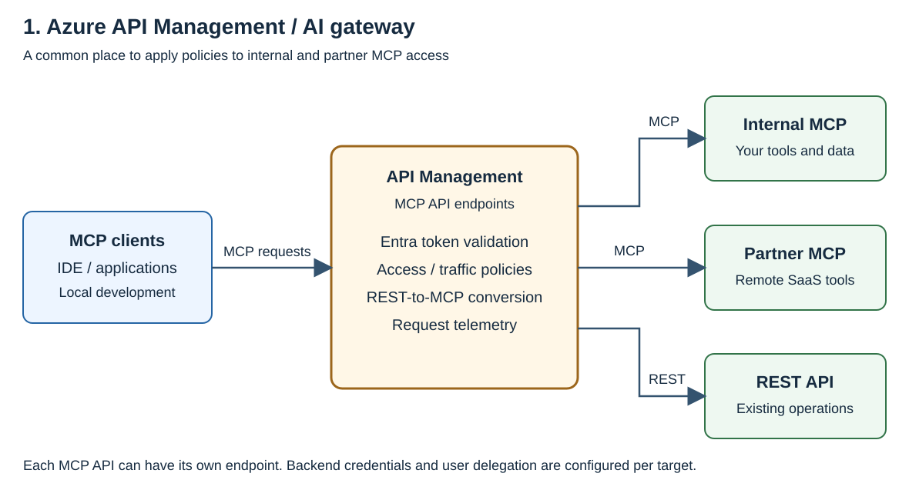
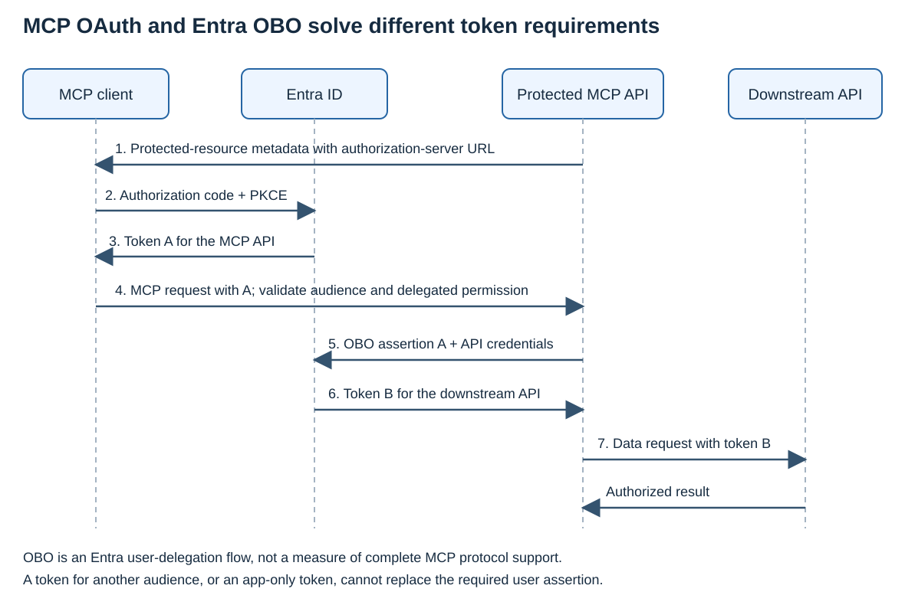

# Azure MCP 구성 — APIM·Toolbox·IQ와 사용자 인증

**APIM은 MCP/API의 공통 접근 정책**, **Toolbox는 IQ를 포함한 도구 집합과 단일 MCP endpoint**를 제공합니다.

## 이 문서의 범위와 읽는 순서

대상은 **HTTP 기반 MCP tool의 제공·호출, Entra 인증, 사용자 위임과 내부망 접속**입니다. `tools/list`와 `tools/call`을 중심으로 설명합니다.

| 목적 | 읽을 곳 | 결정하거나 완성할 것 |
|---|---|---|
| 솔루션 선택 | 아래 서비스 표 → 1–3장 → [6장](#6) | APIM 관리, Toolbox 통합 또는 두 서비스 조합 선택 |
| 인증 구성 | [4장](#4-mcp-authorization-obo) → [인증 상세](authentication/index.md) | 앱·scope·PRM·JWT 정책과 사용자/서비스 권한 설정 |
| 자체 MCP 서버 배포 | [5장](#5-mcp) → [호스팅 참고](hosting-reference/index.md) | 실행 환경·private network·배포 방식 선택 |
| 명령 실행과 결과 비교 | [7장](#7) → sample·[실행 사례](validation/index.md) | 배포·도구 호출·인가 확인·리소스 정리 |

SDK나 gateway의 wire 동작을 구현·진단할 때는 Appendix를 읽습니다. 제품 전체의 MCP 적합성 인증이나 모든 protocol primitive의 비교는 이 가이드의 범위가 아닙니다.

## 소개하는 서비스

| 서비스 | 핵심 기능 | 공식 문서 |
|---|---|---|
| **Azure API Management / AI gateway** | Remote MCP에 인증·인가·트래픽 정책 적용, REST operation을 MCP tool로 제공, 요청 telemetry와 backend credential 관리 | [기존 MCP 연결](https://learn.microsoft.com/azure/api-management/expose-existing-mcp-server), [REST-to-MCP](https://learn.microsoft.com/azure/api-management/export-rest-mcp-server), [인증](https://learn.microsoft.com/azure/api-management/secure-mcp-servers) |
| **Microsoft Foundry Toolbox** | 도구 집합을 하나의 MCP endpoint로 제공, connection 인증·version·정책 관리, Tool search로 필요한 도구 검색 | [Toolbox 개요](https://learn.microsoft.com/azure/foundry/agents/concepts/toolbox-overview), [인증](https://learn.microsoft.com/azure/foundry/agents/how-to/tools/tool-authentication), [Tool search](https://learn.microsoft.com/azure/foundry/agents/how-to/tools/tool-search) |
| **Work IQ·Fabric IQ·Foundry IQ** | 각각 Microsoft 365 업무 context, Fabric의 업무 데이터·의미 모델, 기업 문서 knowledge base를 도구로 제공 | [Work IQ](https://learn.microsoft.com/azure/foundry/agents/how-to/tools/work-iq), [Fabric IQ](https://learn.microsoft.com/azure/foundry/agents/how-to/tools/fabric-iq), [Foundry IQ](https://learn.microsoft.com/azure/foundry/agents/concepts/what-is-foundry-iq) |

### 인증 지원 요약

| 인증 대상 | APIM 구성 | Toolbox 구성 |
|---|---|---|
| **공유 endpoint 접근** | Entra token 검증 정책과 MCP PRM 제공. Issuer·audience·scope·허용 client 검사 | Foundry용 credential/token과 project 권한으로 consumer endpoint 접근 |
| **사용자 권한의 backend 호출** | Credential manager의 attended OAuth connection 또는 MCP API의 Entra OBO 구현 | `oauth2` connection, 지원 서비스의 `user-entra-token` |
| **서비스 권한의 backend 호출** | Managed identity 정책 또는 서비스용 credential connection | `project-managed-identity`, `agentic-identity`, `custom-keys` |

**Authorization Code + PKCE는 client와 Entra 사이에서 수행**합니다. MSAL Python의 [`acquire_token_interactive`](https://learn.microsoft.com/entra/msal/python/getting-started/acquiring-tokens#acquire-token-interactive)는 PKCE를 자동 적용합니다. PRM 제공과 JWT 검증은 APIM/MCP Server에 구성합니다.

## 1. APIM / AI gateway로 MCP 접근 관리

개발 도구는 APIM MCP 주소로 접속합니다. APIM이 사내·타사 backend별 인증·트래픽 정책을 적용합니다.

### 기존 MCP와 REST API

- **기존 MCP:** APIM에 remote MCP endpoint를 연결하고 정책을 적용합니다.
- **기존 REST API:** 선택한 REST operation을 MCP tool로 제공합니다. 별도 MCP 업무 서버 코드를 작성하지 않고 기존 API를 도구로 사용할 수 있습니다.

**APIM의 여러 API 관리 ≠ 모든 도구의 자동 단일 catalog 통합**입니다. 도구 집합 통합은 Toolbox 장에서 다룹니다.

### 사용자별 접근과 감사 기록

| 확인할 것 | 적용 기준 |
|---|---|
| 호출 주체 | [`validate-azure-ad-token`](https://learn.microsoft.com/azure/api-management/validate-azure-ad-token-policy)으로 검증한 identity·scope/role 사용. 임의의 사용자 header는 신원 증거가 아님 |
| 최종 사용자 | App-only token만으로 최종 사용자를 식별할 수 없음 |
| 실행 증거 | Gateway HTTP 로그와 tool 실행 결과를 correlation ID로 연결 |
| 보관·보호 | 수집 누락·보관 기간·접근 통제 설계. Token·민감 payload 원문 저장 금지 |
| Telemetry와 감사 | [Application Insights는 감사 시스템이 아님](https://learn.microsoft.com/azure/api-management/api-management-howto-app-insights#performance-implications-and-log-sampling). Sampling 로그만으로 전수 감사를 보장하지 않음 |

## 2. IQ 도구와 MCP는 어떻게 연결되는가

IQ는 **업무 데이터·지식을 제공하는 서비스**이며, MCP는 연결 방식입니다.

| IQ | 제공하는 기능 | MCP·Toolbox 연결 |
|---|---|---|
| **Work IQ** | Microsoft 365의 메일·회의·파일·채팅 등 업무 context | Work IQ Chat은 A2A를 사용하며 해당 경로의 OBO를 명시. 다른 선택 항목은 MCP endpoint 사용. Toolbox는 선택한 도구를 자신의 MCP endpoint로 제공 |
| **Fabric IQ** | Ontology, Power BI semantic model, Fabric data agent를 통한 업무 데이터 조회·추론 | Fabric item 유형별 MCP endpoint 제공. 연결 identity와 인증 방식은 item·connection 경로에 따라 다름 |
| **Foundry IQ** | Azure AI Search 기반 knowledge base에서 여러 source를 검색하고 근거 있는 결과 반환 | Knowledge base의 MCP endpoint를 Toolbox connection으로 연결하는 [공식 예제](https://learn.microsoft.com/azure/foundry/agents/quickstarts/quickstart-foundry-iq-hosted-agent#step-3-provision-azure-resources-and-the-knowledge-base) 제공 |

| 주의점 | 확인 |
|---|---|
| 지원 상태 | Work IQ·Fabric IQ 연결은 preview 포함. Foundry IQ 일부는 GA지만 [MCP 연결 예제](https://learn.microsoft.com/azure/foundry/agents/how-to/foundry-iq-connect)는 preview API 사용 |
| 데이터 권한 | Source ACL·사용자 token 전달 설정 확인. MCP 연결 자체가 데이터 권한 검사를 완성하지 않음 |
| Identity | 위 Foundry IQ 예제는 `agentic-identity`이며 사용자 OBO 예제가 아님 |
| 운영 조건 | 서비스별 비용·라이선스·데이터 처리 위치 확인 |

## 3. Toolbox로 IQ와 MCP를 하나의 endpoint에 구성

Client는 **하나의 Toolbox MCP endpoint**를 사용하고, Toolbox가 connection별 인증·도구 version·정책을 관리합니다. Foundry 밖의 MCP-compatible client도 사용할 수 있습니다.

핵심 기능은 [Build·Discover·Consume·Govern](https://learn.microsoft.com/azure/foundry/agents/concepts/toolbox-overview)입니다.

- **도구 구성과 공유:** 업무에 필요한 도구를 모아 여러 client가 재사용합니다.
- **Connection 인증:** 도구에 맞는 OAuth·사용자 token·서비스 identity·key를 구성합니다.
- **Version과 정책:** 도구 집합을 version으로 관리하고 인증·인가·guardrail·관측 설정을 적용합니다.
- **Tool search:** 큰 도구 집합에서 해당 요청에 필요한 tool definition을 찾습니다.

### Tool search와 토큰 절감 데모

| 동작 | 내용 |
|---|---|
| 검색 | `tool_search`가 이름·description·parameter metadata를 BM25로 검색 |
| 실행 | `call_tool`로 선택한 도구 호출 |
| 초기 노출 | Pin·auto-pin 도구가 추가될 수 있어 항상 두 개만 노출되는 것은 아님 |

Microsoft Learn의 [Toolbox 개요](https://learn.microsoft.com/azure/foundry/agents/concepts/toolbox-overview)에 삽입된 **[Toolboxes in Microsoft Foundry 영상](https://www.youtube.com/watch?v=7bBvmifVMew)**에서 이 차이를 보여줍니다.

| 영상 위치 | 확인할 내용 |
|---|---|
| [3:22부터](https://www.youtube.com/watch?v=7bBvmifVMew&t=202s) | Work IQ 도구 추가와 connection 인증 |
| [6:05부터](https://www.youtube.com/watch?v=7bBvmifVMew&t=365s) | 전체 도구 정의가 context를 차지하는 문제와 필요한 도구만 찾는 방식 |
| [8:34–9:13](https://www.youtube.com/watch?v=7bBvmifVMew&t=514s) | 같은 상품 catalog 질문에 대해 발표자가 제시한 input token 비교 |

| 해당 데모 | Input tokens |
|---|---:|
| 전체 도구 정의를 사용하는 비교 대상 | 4,676 |
| 필요한 도구를 검색해 사용하는 비교 대상 | 467 |

영상의 **상품 catalog 조회 시연에서는 input tokens가 약 90% 감소**했습니다. 결과는 model·도구·질문·cache 조건에 따라 달라집니다.

- 같은 model·도구·질문 조건에서 업무 완료까지의 input/output tokens, cache, 검색 횟수, latency·재시도를 비교합니다.
- 설정: [Tool search 공식 문서](https://learn.microsoft.com/azure/foundry/agents/how-to/tools/tool-search) · [Toolbox sample](https://github.com/hellices/devguidesample/tree/main/docs/services/azure-architecture/mcp-configuration/samples/toolbox)

## 4. MCP authorization과 OBO를 함께 설계하기

### PRM과 authorization server의 구분

| 항목 | 제공·처리 주체 | 내용 |
|---|---|---|
| **PRM (RFC 9728)** | **MCP Server / APIM** | 보호할 `resource`, `authorization_servers`, scopes 안내 |
| **AS metadata / OIDC discovery** | **Entra ID** | Authorization·token·JWKS endpoint 안내 |
| **Authorization Code + PKCE** | **Client/MSAL ↔ Entra ID** | Client가 verifier/challenge를 사용하고 Entra가 code 교환 시 검증 |
| **JWT 검증** | **APIM / MCP Server** | 발급된 access token의 issuer·audience·유효 시간·권한 검사 |

v2 token을 사용하는 이 예제의 PRM은 Entra issuer를 `https://login.microsoftonline.com/<tenant-id>/v2.0`으로 안내합니다. **Entra가 MCP의 PRM을 제공하는 구조가 아닙니다.**

### 설정 순서: API 앱과 client 앱

| 설정 | 적용할 값·위치 |
|---|---|
| **MCP API 앱 등록** | API의 Application ID URI와 delegated scope 정의. 이 실습은 `api://<api-app-client-id>/Mcp.Access`와 v2 access token 사용 |
| **MCP client 등록·구성** | 사용할 client ID·redirect URI를 client의 지원 방식에 맞춰 설정. API의 delegated permission과 필요한 consent 부여 |
| **APIM PRM 제공** | 보호 resource·Entra issuer·scope 안내. Metadata 요청은 token 없이 조회되도록 구성 |
| **APIM JWT·scope 검증** | API audience와 필요한 scope 검사. `required-claims`는 [JWT 검증 정책 내부](https://learn.microsoft.com/azure/api-management/validate-jwt-policy)에 배치 |
| **MCP 요청 전달** | 검증 후 backend로 전달. 같은 protected resource의 token 전달과 별도 backend용 credential 사용을 구분 |

**두 앱의 ID를 혼동하지 않습니다.** [v2 token 기준](https://learn.microsoft.com/entra/identity-platform/access-token-claims-reference#payload-claims)으로 `aud`는 **MCP API 앱 ID**, `azp`는 **호출 client 앱 ID**, `scp`는 **허용 scope 이름**입니다. `api://.../Mcp.Access` 전체 문자열을 `aud`나 `scp`에 그대로 넣지 않습니다.

| 인증 구간 | 필요한 token |
|---|---|
| Client → MCP API | **A:** MCP API용 access token. MCP HTTP authorization의 대상 |
| MCP API → ARM·Graph 등 | **B:** 별도 데이터 API용 token. 사용자 위임이면 Entra OBO를 사용할 수 있음 |

### 인증 구성의 완료 기준

사용할 연결 방식에 해당하는 행을 확인합니다. APIM의 PRM/OAuth 구성과 Toolbox의 Foundry credential 연결을 동일한 설정으로 취급하지 않습니다.

| 대상 | 설정·확인할 것 | 완료 기준 |
|---|---|---|
| **APIM/MCP의 PRM** | Resource·Entra issuer·scope와 challenge URL | PRM은 token 없이 조회되고, 보호된 tool 요청은 token이 없으면 거부됨 |
| **Entra client 로그인** | Client ID·redirect URI·scope·consent, Authorization Code + PKCE | 선택한 client가 API용 token을 취득하고 MCP에 연결 |
| **Resource·token 검증** | [Resource URI 정렬](https://learn.microsoft.com/entra/agent-id/secure-mcp-server-with-entra-id#step-3-set-the-application-id-uri-to-your-mcp-server-url), issuer·audience·유효 시간·권한 | 올바른 token은 허용하고 다른 audience·부족한 권한은 거부 |
| **Toolbox 연결** | Foundry credential·project 권한·tool connection | 기대한 tool 목록이 보이고 선택한 도구 호출이 성공 |
| **사용자 위임 도구** | Connection의 사용자 OAuth 또는 MCP API의 OBO·downstream 권한 | 원본 서비스가 사용자에게 허용한 데이터·작업 범위로 실행 |
| **실제 도구 실행** | `tools/list` → `tools/call`과 반환 결과 | HTTP status뿐 아니라 MCP의 error·`isError`와 업무 결과 확인 |

배포별 응답과 문제 진단 절차는 [인증 확인 sample](https://github.com/hellices/devguidesample/blob/main/docs/services/azure-architecture/mcp-configuration/samples/apim-entra-lab/authentication-checks.md)과 [실행 사례](validation/index.md#oauth)에 있습니다.

### 연결된 tool의 인증: APIM과 Toolbox 비교

| 데이터 호출 방식 | APIM | Toolbox |
|---|---|---|
| 공유·서비스 credential | Credential manager의 unattended connection 또는 backend 인증 정책 | `custom-keys`, `project-managed-identity`, `agentic-identity` |
| 사용자별 OAuth connection | [Attended(user-delegated) connection](https://learn.microsoft.com/azure/api-management/credentials-overview#attended-user-delegated-scenario)으로 사용자 credential 관리·갱신·주입 | [`oauth2`](https://learn.microsoft.com/azure/foundry/agents/how-to/tools/tool-authentication)로 사용자 authorization·token lifecycle 관리 |
| 대상 서비스용 사용자 Entra token | 선택한 backend 인증/위임 구현에 따라 구성 | 지원 서비스의 `user-entra-token` |
| **Entra OBO** | MCP API가 사용자 token을 assertion으로 제출해 downstream API용 token 취득 | [Work IQ Chat A2A 경로](https://learn.microsoft.com/azure/foundry/agents/how-to/tools/work-iq#how-it-works)에서 OBO 사용. 일반 도구는 해당 connection의 인증 방식 적용 |

- 같은 논리적 MCP resource 내부 전달: token 검증과 [내부 구간 기밀성](https://www.rfc-editor.org/rfc/rfc6750.html#section-5.2) 유지.
- 다른 데이터 API 호출: [그 API용 별도 token](https://modelcontextprotocol.io/specification/2026-07-28/basic/authorization/security-considerations) 사용. 사용자 OBO에 app-only token을 넣지 않음.
- 사용자 OAuth를 공유/service credential로 조용히 바꾸지 않으며, Toolbox와 gateway가 서로 token을 덮어쓰지 않도록 소유 위치를 정함.

## 5. MCP 서버를 준비하는 방법

| 방법 | 사용할 때 | 구현·확인 위치 |
|---|---|---|
| SDK로 MCP 서버 작성 | 자체 업무 로직과 데이터 접근을 tool로 구현 | Container Apps·App Service·Functions·AKS 등에서 실행. [Azure hosting 비교](https://learn.microsoft.com/azure/container-apps/mcp-choosing-azure-service) |
| 기존 REST API 변환 | 이미 운영하는 API operation을 tool로 제공 | APIM REST-to-MCP 또는 지원되는 Toolbox OpenAPI 도구 구성 |
| 기존 remote MCP 연결 | 사내·타사에서 제공하는 도구 재사용 | 원래 endpoint의 protocol·인증·network 조건을 확인해 직접 또는 gateway/Toolbox를 통해 연결 |

- 기존 remote MCP는 Azure에 다시 배포하지 않고 연결할 수 있습니다.
- 서버 실행 위치, toolset 통합, 공통 정책 적용 위치는 따로 선택합니다.

## 6. 엔터프라이즈 구성에 적용할 때의 판단

**설계 제안**이며 제품 지원 판정과 구분합니다.

| 요구사항 | 우선 검토 | 추가 확인 |
|---|---|---|
| 여러 MCP·IQ를 한 주소로 제공 | Toolbox 단독 | Connection 인증·version·필요 도구 지원 |
| 여러 팀과 기존 API의 공통 통제 | APIM | 승인 endpoint, 호출 제한, 감사 이벤트 정책 |
| 두 서비스 병행 | Custom MCP connection의 대상으로 APIM endpoint 구성 | 실제 호출 URL·인증 주체·정책 적용 경로를 명시 |
| 사용자별 데이터 권한 | 실제 identity·audience·consent 확인 | OBO와 MCP 자동 OAuth를 각각 검증 |
| 내부망 접근 | Client→entry와 entry→backend를 각각 점검 | Route·DNS·접근 제어와 [도구별 network 지원](https://learn.microsoft.com/azure/foundry/agents/how-to/tools/toolbox-network-isolation) |

### 적용 시 명시적인 제약

| 항목 | 적용할 조건 |
|---|---|
| APIM의 remote MCP 연결 | [공식 연결 조건](https://learn.microsoft.com/azure/api-management/expose-existing-mcp-server)에 맞는 `2025-06-18` 이상 서버와 Streamable HTTP 또는 SSE transport 사용 |
| APIM Developer | 비운영·평가용 tier이며 SLA 없음. 운영 환경의 private network는 [SKU별 기능](hosting-reference/index.md#apim-sku)으로 선택 |
| MCP streaming | APIM에서 response body를 읽어 buffering을 유발하지 않도록 구성 |
| Toolbox tool 호출 | [비스트리밍 `tools/call` 미지원](https://learn.microsoft.com/azure/foundry/agents/how-to/tools/toolbox#troubleshoot). 지원되는 streaming client 방식 사용 |
| Client의 부가 기능 로드 | APIM은 prompts 미지원, Toolbox는 `prompts/list` 미구현. Tools를 사용할 client에서 prompts 자동 로드가 필요 없다면 해제 |

## 7. 실행 예제와 확인 결과

**명령·정리는 sample**, **실행 환경·응답·캡처는 사례**에서 확인합니다. GitHub·Azure·AKS·Learn MCP를 예제 대상으로 사용합니다.

| 할 일 | 실행 자료 | 결과를 볼 곳 |
|---|---|---|
| `azd` 배포와 내부망 접속 | [Walkthrough 1–3](https://github.com/hellices/devguidesample/blob/main/docs/services/azure-architecture/mcp-configuration/samples/apim-entra-lab/walkthrough.md#1-azd로-환경-배포) | [배포·연결 기록](validation/index.md) |
| APIM REST wrapping·MCP proxy·OBO·인가 확인 | [Walkthrough 4–8](https://github.com/hellices/devguidesample/blob/main/docs/services/azure-architecture/mcp-configuration/samples/apim-entra-lab/walkthrough.md#4-entra-access-token-준비) | [도구 호출과 인증 응답](validation/index.md#apim-rest-to-mcp) |
| PRM·앱 등록·token 오류 진단 | [인증 확인 절차](https://github.com/hellices/devguidesample/blob/main/docs/services/azure-architecture/mcp-configuration/samples/apim-entra-lab/authentication-checks.md) | [단계별 관측](validation/index.md#oauth) |
| Toolbox 구성·Tool search·version 관리 | [Toolbox sample](https://github.com/hellices/devguidesample/tree/main/docs/services/azure-architecture/mcp-configuration/samples/toolbox) | Sample의 확인 방법과 앞의 공식 데모 |
| 실습 종료 | [Walkthrough 9](https://github.com/hellices/devguidesample/blob/main/docs/services/azure-architecture/mcp-configuration/samples/apim-entra-lab/walkthrough.md#9-환경-정리) | ARM 리소스와 Entra 앱 정리 |

## Appendix. “MCP 2.0”과 실제 protocol 변경

**2026-09-13 확인 기준** 공식 Current MCP protocol은 [`2026-07-28`](https://modelcontextprotocol.io/docs/2026-07-28/learn/versioning)입니다. Protocol은 날짜형 revision을 사용합니다. **JSON-RPC 2.0**, Python SDK `2.x`, Azure MCP 제품 `2.x`는 서로 다른 버전 축입니다.

이 부록은 **자체 MCP server·SDK·gateway의 wire 호환성을 구현하거나 진단할 때** 사용합니다. 아래 규격 설명을 제품별 지원표로 해석하지 않습니다.

### `2025-11-25`와 `2026-07-28` 비교

[이전 lifecycle](https://modelcontextprotocol.io/specification/2025-11-25/basic/lifecycle), [이전 transport](https://modelcontextprotocol.io/specification/2025-11-25/basic/transports), [현재 변경 목록](https://modelcontextprotocol.io/specification/2026-07-28/changelog)을 기준으로 비교합니다.

| 항목 | `2025-11-25` | `2026-07-28` |
|---|---|---|
| 시작 절차 | `initialize` → `notifications/initialized` | Handshake 제거, 요청별 version·capability 선언 |
| Protocol session | 서버가 선택적으로 session ID 발급 | Protocol session과 `Mcp-Session-Id` 제거 |
| 서버 정보 | 초기화 결과의 정보·capability | `server/discover`로 조회. 서버 구현은 필수, client의 선행 호출은 선택 |
| HTTP 요청·응답 | POST 요청, JSON 또는 SSE 응답 | POST 요청과 JSON/SSE 응답 유지 |
| 독립 알림 스트림 | 선택적 GET SSE | GET 제거, `subscriptions/listen`의 POST 응답 스트림 |
| 추가 입력 요청 | 서버가 독립 JSON-RPC 요청을 전달 가능 | Multi-Round Trip Requests(MRTR)의 `input_required` 결과와 후속 요청 |
| 결과 구분 | `resultType` 없음 | `resultType` 필수. 구형 응답의 생략 값은 `complete`로 해석 |
| SSE 재개·취소 | 재개를 선택적으로 지원, 단절 자체는 취소가 아님 | `Last-Event-ID` 재개 제거, 응답 스트림 종료로 해당 요청 취소 |

**SSE가 없어졌다는 뜻이 아닙니다.** 독립 GET 스트림과 session 계약이 바뀌었으며 POST의 SSE 응답은 유지됩니다. 이전 구현도 session과 GET 스트림을 반드시 제공해야 했던 것은 아닙니다.

상세 wire 규격 — SDK·전송·오류 처리를 직접 구현하거나 진단할 때

### 요청별 metadata와 HTTP header

아래는 현재 [기본 메시지 계약](https://modelcontextprotocol.io/specification/2026-07-28/basic)과 [Streamable HTTP](https://modelcontextprotocol.io/specification/2026-07-28/basic/transports/streamable-http)의 **RPC 요청** 요구사항입니다.

| 위치 | 요구사항 |
|---|---|
| `params._meta["io.modelcontextprotocol/protocolVersion"]` | 매 요청 필수 |
| `params._meta["io.modelcontextprotocol/clientCapabilities"]` | 매 요청 필수. 선택적 capability가 없으면 `{}` |
| `params._meta["io.modelcontextprotocol/clientInfo"]` | 매 요청 권고 |
| `result._meta["io.modelcontextprotocol/serverInfo"]` | 매 결과 권고 |
| `MCP-Protocol-Version` | 본문의 protocol version과 일치해야 함 |
| `Mcp-Method` | 본문의 JSON-RPC `method`와 일치해야 함 |
| `Mcp-Name` | `tools/call`, `resources/read`, `prompts/get`에서 필수. 해당 `params.name` 또는 `params.uri` 사용 |
| `Accept` | `application/json`과 `text/event-stream`을 모두 포함 |

`clientInfo`와 `serverInfo`는 자체 신고 정보이지 인증된 identity가 아닙니다. `Mcp-Name`을 안전한 ASCII header 값으로 표현할 수 없다면 명세의 Base64 sentinel 인코딩을 적용합니다. HTTP POST에는 단일 JSON-RPC request 또는 notification을 보내며 client가 JSON-RPC response를 보내지는 않습니다. 현재 core에는 client→server HTTP notification이 없으므로 RPC header 요구사항을 notification에 임의로 확장하지 않습니다.

### Discovery와 오류 처리

[`server/discover`](https://modelcontextprotocol.io/specification/2026-07-28/server/discover)의 정상 응답은 `result.supportedVersions`를 사용합니다. 지원하지 않는 버전 오류는 `error.data.supported`와 `error.data.requested`를 사용합니다. OAuth authorization server discovery와는 다른 기능입니다.

| 상황 | 현재 HTTP / JSON-RPC 계약 |
|---|---|
| 지원하지 않는 revision | `400` / `-32022` |
| 필수 본문 metadata 누락 | `400` / `-32602` |
| 필요한 client capability 누락 | `400` / `-32021` |
| 필수 header 누락·형식 오류·본문과 불일치 | `400` / `-32020` |
| 구현하지 않은 RPC method | `404` / `-32601` |
| Modern-only endpoint의 GET/DELETE | `405` 권고 |
| Access token 부재·무효 / 권한 부족 | 각각 `401` / `403` |

구형 session의 `404`는 재초기화를 의미할 수도 있었습니다. [버전 호환 처리](https://modelcontextprotocol.io/specification/2026-07-28/basic/versioning)는 상태 코드만 보지 않고 구조화된 오류를 검사합니다. 특히 `401/403`을 protocol downgrade로 처리하거나, modern header 오류를 무조건 `initialize` 재시도로 바꾸지 않습니다. Notification의 `202 Accepted`·빈 본문을 일반 tool 실행 완료 응답으로 해석하지 않습니다.

### HTTP authorization의 protocol 요구사항

MCP authorization 자체는 선택적이며, 다음은 [HTTP authorization을 채택하는 경우](https://modelcontextprotocol.io/specification/2026-07-28/basic/authorization)의 계약입니다.

| 항목 | 현재 요구사항 |
|---|---|
| Protected resource | RFC 9728 metadata와 하나 이상의 `authorization_servers` 제공 |
| Metadata 위치 | 서버는 401 challenge의 `resource_metadata` 또는 well-known 방식 제공. Client는 둘 다 지원하고 challenge URL 우선 |
| Authorization server | RFC 8414 또는 OIDC Discovery 지원. Client는 두 방식과 발견된 `issuer`의 일치 여부 확인 |
| 대상 리소스 | Authorization·token 요청 모두에 RFC 8707 `resource` 포함. 대상 MCP 서버의 canonical URI 사용 |
| PKCE | 구현과 서버 지원 확인 필수. 기술적으로 가능하면 `S256` 사용 |
| Client 등록 | Client ID는 필요하지만 DCR은 필수가 아님. 사전 등록 옵션·CIMD 지원은 권고, DCR은 현재 선택적·deprecated |
| Token | 대상 리소스·유효성·필요 권한을 검증. `resource`를 보냈다는 사실이 서버 검증을 대신하지 않음 |

세부 요구사항은 [authorization server discovery](https://modelcontextprotocol.io/specification/2026-07-28/basic/authorization/authorization-server-discovery), [client registration](https://modelcontextprotocol.io/specification/2026-07-28/basic/authorization/client-registration), [security considerations](https://modelcontextprotocol.io/specification/2026-07-28/basic/authorization/security-considerations)를 따릅니다. 해당 규격의 client는 metadata의 `code_challenge_methods_supported` 선언이 없으면 authorization을 중단합니다. 사전 등록·DCR credential은 issuer별로 관리합니다. CIMD의 참조 규격은 현재 IETF draft입니다.

### Gateway를 사이에 둘 때

Client→gateway와 gateway→MCP backend의 실제 revision을 각각 확인합니다. 헤더를 추가하거나 session header만 제거하는 것으로 신·구 protocol 변환이 끝나지 않습니다. JSON/SSE 보존, buffering·timeout과 취소 동작도 확인합니다.

단절된 요청을 재실행하려면 새 request ID를 사용하지만, 이미 발생한 업무 부작용이 롤백되었다는 뜻은 아닙니다. 쓰기 도구의 자동 재시도는 별도의 멱등성 정책이 필요합니다. Protocol의 session 제거는 token audience를 없애거나 Entra OBO를 자동으로 제공하는 변경이 아닙니다.

