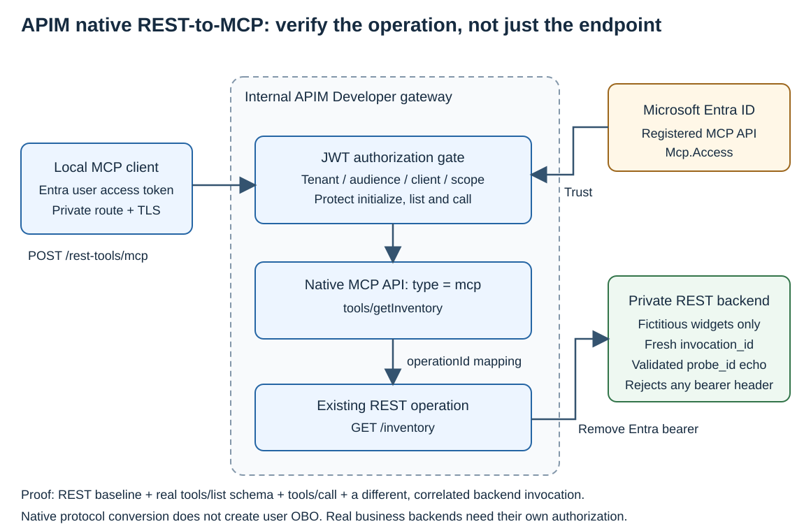
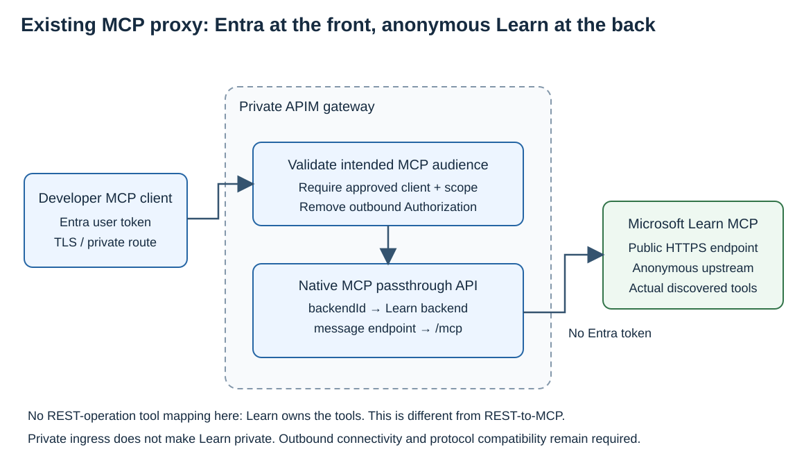

# APIM과 Container Apps MCP 실행 예제

[Azure MCP 운영 아키텍처](../../index.md)의 구성 요소를 직접 확인하는 sample입니다. GitHub·Azure·AKS·Learn은 연결 동작을 보여주기 위한 예제 서버이며 고객이 선택할 운영 전략의 목록이 아닙니다.

이 sample은 APIM Developer의 수동 MCP/REST 경로와 Container Apps의 OBO를 비교합니다. Foundry portal의 AI gateway 자동 연계나 hosted agent + Toolbox 통합 배포를 수행한 예제는 아닙니다. 해당 자동 연계에는 별도의 v2 SKU 및 지원 범위가 적용됩니다.

아래 명령을 한 단계씩 실행합니다. 사용이 끝나면 마지막의 Azure·Entra 정리 절차를 수행합니다.

## 실습 구성

| 구성 요소 | 역할 |
|---|---|
| API Management Developer | 기존 REST operation을 MCP tool로 노출, Learn MCP 프록시 |
| Internal Container Apps | 공식 Azure MCP와 Python MCP 호스팅 |
| Microsoft Entra ID | MCP API access token, caller 제한, ARM OBO |
| AKS | 로컬 AKS MCP가 조회할 클러스터와 선택적 개발용 터널 |
| ACR / private DNS | `azd` remote build와 VNet 내 이름 해석 |

Azure MCP와 Python MCP는 같은 internal Container Apps 환경에 배포합니다. APIM에는 inventory용 REST-to-MCP API와 Learn용 MCP 프록시 API를 각각 만듭니다. AKS MCP binary는 Azure에 원격 서버로 올리지 않고 개발 PC에서 실행합니다.

### Access token과 OBO 흐름

| 연결 | 사용하는 인증 |
|---|---|
| 로컬 client → Python MCP / APIM | Custom MCP API용 access token, `Mcp.Access` scope |
| 로컬 client → 공식 Azure MCP | Native Azure MCP API용 access token, `Mcp.Tools.ReadWrite` scope |
| Azure·Python MCP → ARM | 사용자를 대신해 발급받은 ARM용 OBO access token |
| 로컬 client → GitHub MCP | GitHub OAuth 또는 PAT |
| Client / APIM → Learn MCP | 익명 upstream 호출 |

OBO는 **MCP API용 사용자 token을 받아 ARM용 token을 별도로 발급받는 흐름**입니다. 원래 MCP token을 ARM·GitHub·Learn에 그대로 전달하지 않습니다. Native Azure MCP의 managed identity는 confidential client를 인증하는 데 사용하며, ARM에서는 OBO 사용자의 Azure RBAC가 적용됩니다.

Entra 앱의 사전 승인과 caller 제한도 구분합니다. 사전 승인은 consent 설정이고, 허용할 client는 APIM 정책·Python API·Container Apps authentication에서 검사합니다. 로컬 PC에서 내부 MCP까지의 접속 경로와 private DNS는 3번 단계에서 설정합니다.

### 예제에서 사용하는 버전

| 항목 | 사용하는 버전·방식 |
|---|---|
| MCP protocol | 날짜 기반 revision. Python 연결은 `2026-07-28`, APIM 연결은 응답으로 협상한 이전 revision 사용 |
| Python SDK | `mcp==2.2.0` — SDK 버전이며 protocol 이름 “MCP 2.0”과 다름 |
| 메시지 형식 | JSON-RPC `2.0` |
| 공식 Azure MCP | `2.0.5`, read-only tool과 remote OBO |
| AKS MCP | `0.0.20`, local stdio-only |

`2026-07-28` 연결은 `server/discover`와 요청별 metadata를 사용합니다. APIM의 HTTP 호출에서는 호환되는 `initialize` 절차를 직접 실행하고, 반환된 `protocolVersion`을 다음 요청에 사용합니다.

### 필요한 도구와 권한

- Azure CLI, Azure Developer CLI **1.29+**, Bicep.
- Node.js **22.19+**, npm, Python **3.13**, `curl`, `jq`.
- `kubectl`, `kubelogin`, GitHub CLI(`gh`).
- Azure resource group 생성·리소스 배포·role assignment 권한.
- Entra app registration과 해당 사용자의 ARM delegated consent를 설정할 권한.
- GitHub를 사용하는 단계에는 GitHub 로그인과 대상 repository 읽기 권한.

명령은 **Bash** 기준입니다. 로컬 Docker는 필요하지 않습니다. `azd`가 ACR에 container build를 제출합니다.

### 비용

기본 구성은 Korea Central의 APIM Developer 1개, AKS Free control plane과 `Standard_D4as_v5` 노드 1개, Container Apps Consumption workload profile, ACR Basic입니다. APIM과 AKS node는 도구를 호출하지 않는 동안에도 비용이 발생합니다.

[Azure 가격 계산기](https://azure.microsoft.com/pricing/calculator/)에서 배포 region과 실제 실행 시간을 기준으로 산정합니다. APIM과 VM 외에 디스크·네트워크·ACR·Container Apps 비용도 포함합니다. Developer SKU와 단일 노드는 실습용 구성입니다.

## 1. azd로 환경 배포

### 1-1. 소스와 로그인

```bash
git clone https://github.com/hellices/devguidesample.git
cd devguidesample/docs/services/azure-architecture/mcp-configuration/samples/apim-entra-lab

set -euo pipefail
umask 077
az login
azd auth login
gh auth login
npm ci --no-audit --no-fund
```

PR을 검토 중이면 해당 PR branch를 checkout한 뒤 진행합니다. 이후 명령은 모두 **이 sample 디렉터리**에서 실행합니다.

### 1-2. 새 환경 선택

```bash
azd env new mcpdemo01
azd env set AZURE_SUBSCRIPTION_ID "$(az account show --query id -o tsv)"
azd env set AZURE_LOCATION koreacentral
```

`mcpdemo01` 대신 사용하지 않은 이름을 지정합니다. 이 sample은 소문자·숫자 6~10자로 된 환경 이름을 사용합니다. 만들어지는 기본 RG는 `rg-<환경 이름>`입니다.

Azure CLI와 `azd`의 로그인·선택 구독은 따로 관리되므로 위와 같이 구독을 명시합니다. 기존 환경을 정리한 후 새로 시작하려면 마지막 정리 절차를 마치고 다른 이름을 사용하세요.

### 1-3. Preview와 배포

```bash
python3 scripts/identity.py prepare
azd provision --preview
azd up
```

`azure.yaml`에는 실제 Container Apps service와 `docker.remoteBuild: true`가 선언되어 있습니다. `azd up`은 Bicep provisioning → ACR build → service deploy를 진행합니다.

| 단계 | 확인할 내용 |
|---|---|
| Directory 준비 / `preup` hook | 이 환경의 Entra 앱 3개와 현재 사용자 ARM delegated consent 설정 |
| Bicep provisioning | 새 RG, APIM, Container Apps, AKS, ACR, private DNS 생성 |
| `postprovision` hook | Native Azure MCP의 managed identity와 confidential-client federation 연결 |
| Service deploy | Python image remote build, Container App의 실제 image·port·readiness 설정 |

`azd`는 provisioning hook보다 먼저 Bicep 필수 입력을 읽습니다. 따라서 Preview 전에는 `identity.py prepare`를 명시적으로 실행합니다. 이 명령은 Entra 객체와 동의를 설정하며, `azd up`의 `preup` hook에서도 동일한 준비를 수행합니다. Hook은 ARM 리소스를 배포하는 별도 배포 스크립트가 아닙니다.

RG 외에 AKS node RG와 Container Apps managed RG도 생성됩니다. Entra app은 RG에 속하지 않습니다. `.azure/`에는 실제 식별자와 실습 credential이 저장되므로 공유·캡처하지 않습니다.

배포가 중단되면 실패한 단계의 오류를 해결한 후 같은 환경에서 다시 실행합니다. `azd provision`만 수행하면 Python service는 placeholder image 상태이며, `azd deploy mcp`가 실제 앱을 배포합니다.

### 1-4. 배포 결과 확인

```bash
export AZURE_SUBSCRIPTION_ID="$(azd env get-value AZURE_SUBSCRIPTION_ID)"
export RG="$(azd env get-value AZURE_RESOURCE_GROUP)"
export TENANT_ID="$(azd env get-value AZURE_TENANT_ID)"
export APIM_NAME="$(azd env get-value MCP_APIM_NAME)"
export AKS_NAME="$(azd env get-value MCP_AKS_NAME)"
export PYTHON_MCP_URL="$(azd env get-value MCP_PYTHON_URL)"
export AZURE_MCP_URL="$(azd env get-value MCP_AZURE_URL)"
export REST_MCP_URL="$(azd env get-value MCP_APIM_REST_URL)"
export LEARN_MCP_URL="$(azd env get-value MCP_APIM_LEARN_URL)"
export REST_URL="$(azd env get-value MCP_REST_URL)"
export PRIVATE="$PWD/.private/$(azd env get-value AZURE_ENV_NAME)"
mkdir -p "$PRIVATE"

az resource list --subscription "$AZURE_SUBSCRIPTION_ID" \
  --resource-group "$RG" --query "[].{type:type,location:location}" -o table
```

목록에서 APIM, Container Apps environment, Container App 2개, AKS, ACR를 확인합니다. 전체 environment 설정을 출력하는 `azd env get-values`는 credential을 포함할 수 있으므로 화면 공유 때 사용하지 않습니다.

2026-09-13에 실행한 같은 구성의 배포 출력입니다. `azd up`이 provisioning, ACR remote build, service deployment까지 수행했습니다.


## 2. 로컬 MCP 서버 연결


MCP Inspector는 한 번에 한 요청을 보내는 공식 MCP client입니다. 아래 명령은 서버에 연결해 tool 목록 또는 지정 tool의 결과를 표시합니다.

### 2-1. Microsoft Learn

```bash
npx --no-install mcp-inspector --cli \
  https://learn.microsoft.com/api/mcp --transport http --method tools/list
```

`microsoft_docs_search`, `microsoft_docs_fetch`, `microsoft_code_sample_search`를 확인합니다. Learn은 이 연결에 access token을 요구하지 않습니다.

```bash
npx --no-install mcp-inspector --cli \
  https://learn.microsoft.com/api/mcp --transport http \
  --method tools/call --tool-name microsoft_docs_search \
  --tool-arg 'query=Azure API Management MCP'
```

응답에서 문서 제목·URL을 확인합니다. HTTP 연결이 성공해도 MCP 응답이 `isError: true`라면 호출은 실패한 것입니다.

### 2-2. Azure MCP

```bash
npx --no-install mcp-inspector --cli --config inspector.json \
  --server azure --method tools/list
```

`group_list`, `group_resource_list`가 표시됩니다. 이 경로는 로컬 Azure CLI credential을 사용합니다. 뒤에서 실행할 remote OBO 경로와 다릅니다.

```bash
npx --no-install mcp-inspector --cli --config inspector.json \
  --server azure --method tools/call \
  --tool-name group_resource_list \
  --tool-arg "subscription=$AZURE_SUBSCRIPTION_ID" --tool-arg "resource-group=$RG"
```

`results.resources`에서 방금 배포한 RG의 리소스를 확인합니다.

### 2-3. GitHub

GitHub는 GitHub OAuth/PAT를 사용합니다. Entra access token을 GitHub에 전달하지 않습니다. 로그인한 `gh` credential을 비공개 MCP client 설정으로 저장합니다.

```bash
gh auth token | jq -Rs '{
  mcpServers: {github: {
    url: "https://api.githubcopilot.com/mcp/",
    type: "streamable-http",
    headers: {
      Authorization: ("Bearer " + rtrimstr("\n")),
      "X-MCP-Readonly": "true",
      "X-MCP-Tools": "search_repositories"
    }
  }}
}' > "$PRIVATE/github.json"

npx --no-install mcp-inspector --cli --config "$PRIVATE/github.json" \
  --server github --method tools/call --tool-name search_repositories \
  --tool-arg 'query=repo:hellices/devguidesample'
```

공개 repository 검색 결과를 확인합니다. 이 credential 파일은 Git에 추가하지 않으며 실습 후 삭제합니다. VS Code 연결은 [MCP 설정 예제](https://github.com/hellices/devguidesample/blob/main/docs/services/azure-architecture/mcp-configuration/samples/apim-entra-lab/mcp.example.json)를 로컬 설정에 병합해 사용할 수 있습니다.

## 3. 로컬 PC에서 private MCP endpoint에 접속

AKS MCP에서 사용할 kubeconfig를 이 환경의 비공개 디렉터리에 저장합니다. 기존 기본 kubeconfig는 변경하지 않습니다.

```bash
export KUBECONFIG="$PRIVATE/kubeconfig"
az aks get-credentials --subscription "$AZURE_SUBSCRIPTION_ID" \
  --resource-group "$RG" --name "$AKS_NAME" --file "$KUBECONFIG" --overwrite-existing
kubelogin convert-kubeconfig --login azurecli --kubeconfig "$KUBECONFIG"
kubectl create namespace mcp-lab --dry-run=client -o yaml | kubectl apply -f -
```

### 3-1. VPN 경로가 있는 경우

회사 네트워크에서 Azure VNet까지 VPN/ExpressRoute 경로와 private DNS가 준비되어 있다면 endpoint에 직접 접속합니다. URL은 인증서가 발급된 hostname을 그대로 사용합니다.

```bash
: > "$PRIVATE/transport.conf"
export MCP_PROXY=""
```

### 3-2. VPN 없이 개발용 터널을 사용하는 경우

이 선택지는 AKS API에 대한 권한으로 `kubectl port-forward`를 사용합니다. 전체 VNet을 공개하지 않고, pod의 loopback에서 실행하는 CONNECT listener를 로컬 PC에 연결합니다.

```bash
kubectl -n mcp-lab create configmap mcp-tunnel-code \
  --from-file=connect_proxy.py=network/connect_proxy.py

HOSTS="$(printf '%s\n' "$PYTHON_MCP_URL" "$AZURE_MCP_URL" "$REST_MCP_URL" \
  | sed -E 's#https://([^/]+).*#\1#' | sort -u | paste -sd, -)"
kubectl -n mcp-lab create configmap mcp-endpoints --from-literal="hosts=$HOSTS"
kubectl apply -f network/tunnel.yaml
kubectl -n mcp-lab wait --for=condition=Ready pod/mcp-tunnel --timeout=180s
```

원래 터미널에서 실습 kubeconfig의 절대 경로를 출력해 복사합니다.

```bash
printf '%s\n' "${KUBECONFIG:?3번 단계에서 실습 kubeconfig를 먼저 준비하세요}"
```

새 터미널은 원래 터미널의 환경 변수를 상속하지 않습니다. **복사한 경로를 새 터미널에서 입력**한 뒤 터널을 유지합니다. 빈 값·상대 경로·존재하지 않는 파일이면 실행하지 않습니다.

```bash
read -r -p "실습 kubeconfig의 절대 경로: " KUBECONFIG
if [[ "$KUBECONFIG" == /* && -f "$KUBECONFIG" ]]; then
  export KUBECONFIG
  kubectl --kubeconfig "$KUBECONFIG" -n mcp-lab port-forward \
    --address 127.0.0.1 pod/mcp-tunnel 18080:8080
else
  printf '%s\n' '존재하는 실습 kubeconfig 파일의 절대 경로를 입력하세요.' >&2
  false
fi
```

원래 터미널에서 curl에 사용할 proxy를 지정합니다.

```bash
printf '%s\n' 'proxy = "http://127.0.0.1:18080"' > "$PRIVATE/transport.conf"
export MCP_PROXY="http://127.0.0.1:18080"
```

포트가 이미 사용 중이면 다른 로컬 포트를 선택하고 두 명령의 포트를 함께 바꿉니다. 이 설정은 curl에만 적용되며 VS Code의 네트워크 설정을 자동으로 변경하지 않습니다.

### 3-3. AKS MCP로 pod 조회

공식 AKS MCP 0.0.20 release에서 OS/CPU에 맞는 executable을 다운로드하고 SHA-256을 확인합니다. 아래는 macOS arm64 예입니다.

```bash
export AKS_MCP_BIN="$PRIVATE/aks-mcp"
gh release download v0.0.20 --repo Azure/aks-mcp \
  --pattern aks-mcp-darwin-arm64 --output "$AKS_MCP_BIN"
printf '%s  %s\n' \
  '1104b6abfeec05de836b67f309c47bdfff4aaa1d21f78505a4a1c090a0ef5c61' \
  "$AKS_MCP_BIN" | shasum -a 256 -c - &&
  chmod 700 "$AKS_MCP_BIN"

jq -n --arg binary "$AKS_MCP_BIN" --arg kubeconfig "$KUBECONFIG" '{
  mcpServers:{aks:{type:"stdio",command:$binary,
    args:["--access-level","readonly","--enabled-components","az_cli,kubectl","--allow-namespaces","mcp-lab"],
    env:{KUBECONFIG:$kubeconfig}}}
}' > "$PRIVATE/aks.json"
npx --no-install mcp-inspector --cli --config "$PRIVATE/aks.json" \
  --server aks --method tools/call --tool-name call_kubectl \
  --tool-arg 'command=kubectl get pods -n mcp-lab -o json'
```

`mcp-tunnel` pod가 표시됩니다. VPN 경로를 선택해 pod를 만들지 않았다면 namespace·pod 목록이 다른 것은 정상입니다. 이 버전의 AKS MCP는 **local stdio-only**입니다.

다음은 실제 GitHub repository 검색, AKS pod 조회와 Learn 검색 응답의 발췌입니다. Learn의 APIM 경유 호출은 7번 단계에서 실행합니다.


## 4. Entra access token 준비

### 4-1. Token 없이 접근

```bash
curl --silent --show-error --max-time 90 --config "$PRIVATE/transport.conf" \
  --header 'Content-Type: application/json' \
  --header 'Accept: application/json, text/event-stream' \
  --data-binary @requests/initialize.json \
  --suppress-connect-headers --dump-header "$PRIVATE/unauthorized.headers" --output "$PRIVATE/unauthorized.body" \
  "$REST_MCP_URL"

head -n 1 "$PRIVATE/unauthorized.headers"
```

예상 결과는 **401**입니다. APIM이 반환한 `WWW-Authenticate`에서 `resource_metadata` URL을 확인할 수 있습니다. 해당 metadata는 공개되어도 되지만 MCP tool 실행에는 access token이 필요합니다.

### 4-2. API별 token 발급

```bash
CUSTOM_ID="$(azd env get-value MCP_CUSTOM_API_CLIENT_ID)"
AZURE_API_ID="$(azd env get-value MCP_AZURE_API_CLIENT_ID)"

az account get-access-token --tenant "$TENANT_ID" \
  --scope "api://$CUSTOM_ID/Mcp.Access" -o json \
  | jq -r '"header = \"Authorization: Bearer \(.accessToken)\""' \
  > "$PRIVATE/custom-auth.conf"

az account get-access-token --tenant "$TENANT_ID" \
  --scope "api://$AZURE_API_ID/Mcp.Tools.ReadWrite" -o json \
  | jq -r '"header = \"Authorization: Bearer \(.accessToken)\""' \
  > "$PRIVATE/azure-auth.conf"
```

Token을 터미널에 출력하지 않고 curl 설정에 저장합니다. 이 두 token의 audience는 서로 다릅니다. 발급이 거부되면 API scope, consent, Conditional Access 요구사항을 확인하고 필요한 대화형 로그인을 수행합니다.

이 절은 **token을 사전 발급하는 연결 방식**입니다. MCP client의 discovery·PKCE 자동 로그인을 확인하려면 [인증 단계별 확인](authentication-checks.md)을 따릅니다.

## 5. REST API를 APIM MCP tool로 호출



### 5-1. 원래 REST 응답

```bash
curl --silent --show-error --max-time 90 \
  --config "$PRIVATE/transport.conf" --config "$PRIVATE/custom-auth.conf" \
  "$REST_URL" | jq '{source, widgets, authorization_present}'
```

예상 응답은 가상 widget 3개, `source: inventory-rest`, `authorization_present: false`입니다. APIM은 사용자 token을 검증한 후 비민감 REST backend로 보낼 때 Authorization header를 제거합니다.

### 5-2. MCP initialize

```bash
curl --silent --show-error --max-time 90 \
  --config "$PRIVATE/transport.conf" --config "$PRIVATE/custom-auth.conf" \
  --header 'Content-Type: application/json' \
  --header 'Accept: application/json, text/event-stream' \
  --data-binary @requests/initialize.json --suppress-connect-headers --dump-header "$PRIVATE/init.headers" \
  --output "$PRIVATE/init.body" "$REST_MCP_URL"
```

응답은 JSON 또는 SSE의 `data:` 줄입니다. 다음 함수는 **출력 형식만 JSON으로 정리**하며, 요청 실행이나 성공 판정을 하지 않습니다.

```bash
mcp_json() {
  jq -Rrs 'if test("^\\s*\\{") then fromjson
    else [split("\n")[] | select(startswith("data: ")) |
      ltrimstr("data: ") | fromjson] |
      if length == 1 then .[0] else error("응답 본문과 Content-Type을 확인하세요") end end' "$1"
}
mcp_json "$PRIVATE/init.body" | jq '.result | {protocolVersion, serverInfo}'

VERSION="$(mcp_json "$PRIVATE/init.body" | jq -r .result.protocolVersion)"
SESSION="$(awk 'tolower($1)=="mcp-session-id:" {gsub("\r","",$2);print $2}' "$PRIVATE/init.headers")"
```

여기서는 이전 revision과 호환되는 `initialize` 절차를 사용합니다. 요청한 revision과 실제 반환된 `protocolVersion`이 다를 수 있으므로 응답 값을 다음 요청에 사용합니다. 최신 `2026-07-28`의 `server/discover`와 혼동하지 않습니다.

### 5-3. Tool 목록

```bash
curl --silent --show-error --max-time 90 \
  --config "$PRIVATE/transport.conf" --config "$PRIVATE/custom-auth.conf" \
  --header 'Content-Type: application/json' \
  --header 'Accept: application/json, text/event-stream' \
  --header "MCP-Protocol-Version: $VERSION" --header "Mcp-Session-Id: $SESSION" \
  --data-binary @requests/initialized.json "$REST_MCP_URL"

curl --silent --show-error --max-time 90 \
  --config "$PRIVATE/transport.conf" --config "$PRIVATE/custom-auth.conf" \
  --header 'Content-Type: application/json' \
  --header 'Accept: application/json, text/event-stream' \
  --header "MCP-Protocol-Version: $VERSION" --header "Mcp-Session-Id: $SESSION" \
  --data-binary @requests/tools-list.json --output "$PRIVATE/tools.body" "$REST_MCP_URL"
mcp_json "$PRIVATE/tools.body" | jq '.result.tools[] | {name,inputSchema}'
```

`getInventory`와 APIM이 만든 `inputSchema`를 확인합니다. 이 tool은 별도 MCP server가 아니라 APIM의 REST operation `get-inventory`에 연결됩니다.

### 5-4. Tool 호출

```bash
curl --silent --show-error --max-time 90 \
  --config "$PRIVATE/transport.conf" --config "$PRIVATE/custom-auth.conf" \
  --header 'Content-Type: application/json' \
  --header 'Accept: application/json, text/event-stream' \
  --header "MCP-Protocol-Version: $VERSION" --header "Mcp-Session-Id: $SESSION" \
  --data-binary @requests/inventory.json --output "$PRIVATE/inventory.body" "$REST_MCP_URL"
mcp_json "$PRIVATE/inventory.body" | jq '.result'
```

`isError`가 `true`가 아니고 `content`에 가상 재고가 포함되는지 봅니다. 반환된 `invocation_id`는 REST backend에서 요청마다 생성합니다. **HTTP 200과 빈 tool 목록만으로 완료한 것으로 판단하지 않습니다.**

2026-09-13에는 REST URL과 MCP tool 모두 같은 가상 widget 3개를 반환했습니다. `authorization_present: false`로 backend에 Entra token을 전달하지 않은 것도 확인했습니다.


## 6. Azure MCP에서 OBO로 Azure 조회


### 6-1. Native Azure MCP

MCP Inspector로 새 연결을 엽니다. Client가 initialize와 session 처리를 수행합니다. 이전 APIM session ID를 재사용하지 않습니다.

```bash
az account get-access-token --tenant "$TENANT_ID" \
  --scope "api://$AZURE_API_ID/Mcp.Tools.ReadWrite" -o json \
  | jq --arg url "$AZURE_MCP_URL" '{mcpServers:{azure:{
      url:$url,type:"streamable-http",headers:{Authorization:("Bearer "+.accessToken)}
    }}}' > "$PRIVATE/azure-remote.json"

HTTPS_PROXY="$MCP_PROXY" HTTP_PROXY="$MCP_PROXY" \
  npx --no-install mcp-inspector --cli --config "$PRIVATE/azure-remote.json" \
  --server azure --method tools/list
```

`group_resource_list`가 보이면 해당 tool로 배포한 RG를 조회합니다.

```bash
HTTPS_PROXY="$MCP_PROXY" HTTP_PROXY="$MCP_PROXY" \
  npx --no-install mcp-inspector --cli --config "$PRIVATE/azure-remote.json" \
  --server azure --method tools/call --tool-name group_resource_list \
  --tool-arg "subscription=$AZURE_SUBSCRIPTION_ID" --tool-arg "resource-group=$RG"
```

Native Azure MCP는 incoming user token을 검증하고, managed identity federation으로 confidential client를 인증한 뒤 ARM용 OBO token을 받습니다. 반환된 resource 목록은 호출한 사용자의 Azure RBAC를 따릅니다.

### 6-2. Python MCP의 OBO tool

Python MCP용 client 설정을 만들고 `read_lab_resource_group`을 호출합니다.

```bash
az account get-access-token --tenant "$TENANT_ID" \
  --scope "api://$CUSTOM_ID/Mcp.Access" -o json \
  | jq --arg url "$PYTHON_MCP_URL" '{mcpServers:{python:{
      url:$url,type:"streamable-http",protocolEra:"modern",modernLogLevel:"off",
      headers:{Authorization:("Bearer "+.accessToken)}
    }}}' > "$PRIVATE/python-remote.json"

HTTPS_PROXY="$MCP_PROXY" HTTP_PROXY="$MCP_PROXY" \
  npx --no-install mcp-inspector --cli --config "$PRIVATE/python-remote.json" \
  --server python --method tools/list

HTTPS_PROXY="$MCP_PROXY" HTTP_PROXY="$MCP_PROXY" \
  npx --no-install mcp-inspector --cli --config "$PRIVATE/python-remote.json" \
  --server python --method tools/call --tool-name read_lab_resource_group
```

응답에는 `exists: true`, region, `provisioning_succeeded: true`가 포함됩니다. 이 tool은 배포 시 지정한 RG만 조회합니다. OBO 오류가 나면 delegated permission·consent·confidential-client credential을 확인하며, 관리 ID의 권한으로 호출을 대체하지 않습니다.

Python 연결에는 Inspector의 `protocolEra: modern`을 지정했습니다. Python SDK 2.2.0 server의 `2026-07-28` 요청 방식을 사용하며, APIM과 native Azure MCP에서 실행한 이전 revision의 initialize/session 절차와 구분합니다.

다음 실제 응답에서는 native Azure MCP의 ARM 조회 결과와 Python MCP의 `exists`, `region`, `provisioning_succeeded`를 비교할 수 있습니다.


## 7. APIM을 통해 기존 Learn MCP 호출



이번에는 공개 Learn URL이 아니라 APIM의 `$LEARN_MCP_URL`에 연결합니다.

```bash
az account get-access-token --tenant "$TENANT_ID" \
  --scope "api://$CUSTOM_ID/Mcp.Access" -o json \
  | jq --arg url "$LEARN_MCP_URL" '{mcpServers:{learn:{
      url:$url,type:"streamable-http",headers:{Authorization:("Bearer "+.accessToken)}
    }}}' > "$PRIVATE/learn-proxy.json"

HTTPS_PROXY="$MCP_PROXY" HTTP_PROXY="$MCP_PROXY" \
  npx --no-install mcp-inspector --cli --config "$PRIVATE/learn-proxy.json" \
  --server learn --method tools/list
```

세 Learn tool이 표시되면 검색 요청을 보냅니다.

```bash
HTTPS_PROXY="$MCP_PROXY" HTTP_PROXY="$MCP_PROXY" \
  npx --no-install mcp-inspector --cli --config "$PRIVATE/learn-proxy.json" \
  --server learn --method tools/call --tool-name microsoft_docs_search \
  --tool-arg 'query=Azure API Management MCP'
```

APIM에서 Entra 인증을 수행하지만 upstream Learn 요청은 익명입니다. 이 구성은 REST operation을 tool로 만드는 5번 시나리오와 달리 **기존 MCP server를 프록시**합니다.

## 8. 401과 403 확인

### 8-1. 다른 API용 token 제출

Native Azure MCP용 token으로 APIM에 요청합니다.

```bash
curl --silent --show-error --max-time 90 \
  --config "$PRIVATE/transport.conf" --config "$PRIVATE/azure-auth.conf" \
  --header 'Content-Type: application/json' \
  --header 'Accept: application/json, text/event-stream' \
  --data-binary @requests/initialize.json \
  --suppress-connect-headers --dump-header "$PRIVATE/wrong-audience.headers" \
  --output "$PRIVATE/wrong-audience.body" "$REST_MCP_URL"
head -n 1 "$PRIVATE/wrong-audience.headers"
```

예상 결과는 **401**입니다. 서명이 유효한 token이어도 대상 API의 audience와 다르면 APIM이 거부합니다.

### 8-2. Native MCP의 caller 제한

App registration의 사전 승인은 caller ACL이 아닙니다. **이 개발 환경에서만** Azure CLI client를 잠시 제외해 403을 확인합니다. 아래 블록 전체를 한 번에 실행합니다. 원본 백업은 매번 새 파일에 보관하며, 설정 변경 전에 등록한 `EXIT` trap이 성공·오류·일반적인 중단 시 복구를 시도합니다.

```bash
(
  set -euo pipefail
  APP_NAME="$(azd env get-value MCP_AZURE_APP_NAME)"
  AUTH_API="https://management.azure.com/subscriptions/$AZURE_SUBSCRIPTION_ID/resourceGroups/$RG/providers/Microsoft.App/containerApps/$APP_NAME/authConfigs/current?api-version=2025-01-01"
  ORIGINAL="$(mktemp "$PRIVATE/native-auth-original.XXXXXX")"
  RESTRICTED="$(mktemp "$PRIVATE/native-auth-restricted.XXXXXX")"

  az rest --method get --url "$AUTH_API" --headers Accept=application/json \
    --subscription "$AZURE_SUBSCRIPTION_ID" \
    | jq -e 'if (.properties.identityProviders.azureActiveDirectory.validation.defaultAuthorizationPolicy.allowedApplications
      | index("04b07795-8ddb-461a-bbee-02f9e1bf7b46")) == null
      then error("Azure CLI client must be allowed before this scenario")
      else {properties} end' > "$ORIGINAL"
  jq -e '.properties.identityProviders.azureActiveDirectory.validation.defaultAuthorizationPolicy.allowedApplications
    |= map(select(. != "04b07795-8ddb-461a-bbee-02f9e1bf7b46"))
    | if (.properties.identityProviders.azureActiveDirectory.validation.defaultAuthorizationPolicy.allowedApplications | length) > 0
      then . else error("Keep at least one allowed client") end' \
    "$ORIGINAL" > "$RESTRICTED"
  printf '원본 백업: %s\n' "$ORIGINAL"

  restore_native_auth() {
    local status="$1"
    local restore_status=0
    trap - EXIT
    if az rest --method put --url "$AUTH_API" \
      --subscription "$AZURE_SUBSCRIPTION_ID" \
      --body @"$ORIGINAL" --output none; then
      printf '%s\n' '원래 인증 설정을 복구했습니다.'
    else
      restore_status=$?
      printf '복구 실패: 검증 종료 코드=%s, 복구 종료 코드=%s, 원본=%s\n' \
        "$status" "$restore_status" "$ORIGINAL" >&2
    fi
    if [[ "$status" -ne 0 ]]; then
      exit "$status"
    fi
    exit "$restore_status"
  }
  trap 'restore_native_auth "$?"' EXIT
  trap 'exit 130' INT
  trap 'exit 143' TERM

  az rest --method put --url "$AUTH_API" \
    --subscription "$AZURE_SUBSCRIPTION_ID" \
    --body @"$RESTRICTED" --output none
  read -r -p "설정 반영을 기다린 뒤 Enter를 누르세요(기존 실증에서는 약 60초): "
  STATUS="$(curl --silent --show-error --max-time 90 \
    --config "$PRIVATE/transport.conf" --config "$PRIVATE/azure-auth.conf" \
    --header 'Content-Type: application/json' \
    --header 'Accept: application/json, text/event-stream' \
    --data-binary @requests/initialize.json \
    --suppress-connect-headers --dump-header "$PRIVATE/client-denied.headers" \
    --output "$PRIVATE/client-denied.body" --write-out '%{http_code}' "$AZURE_MCP_URL")"
  printf 'HTTP %s\n' "$STATUS"
  if [[ "$STATUS" != 403 ]]; then
    printf '%s\n' '403이 아닙니다. 복구 후 설정 반영 상태와 응답을 확인하세요.' >&2
    exit 1
  fi
)
```

복구 성공 메시지와 종료 상태를 확인합니다. 403이 아니라면 응답과 반영 시간을 확인한 뒤 **복구가 끝난 상태에서** 전체 블록을 다시 실행합니다. Timeout 등 검증 오류의 종료 코드는 유지하며, 복구 자체의 오류도 별도로 표시합니다.

강제 종료나 네트워크 장애로 복구하지 못했다면, 같은 sample 디렉터리와 azd environment에서 아래 명령을 실행합니다. 출력해 둔 원본 백업 경로를 사용하며 기존 백업을 덮어쓰지 않습니다.

```bash
(
  set -euo pipefail
  read -r -p "원본 백업 파일의 절대 경로: " ORIGINAL
  [[ "$ORIGINAL" == /* && -s "$ORIGINAL" ]] || {
    printf '%s\n' '원본 백업 파일의 절대 경로가 필요합니다.' >&2
    exit 1
  }
  SUBSCRIPTION_ID="$(azd env get-value AZURE_SUBSCRIPTION_ID)"
  GROUP="$(azd env get-value AZURE_RESOURCE_GROUP)"
  APP_NAME="$(azd env get-value MCP_AZURE_APP_NAME)"
  API_CLIENT_ID="$(azd env get-value MCP_AZURE_API_CLIENT_ID)"
  if ! jq -e --arg id "$API_CLIENT_ID" \
    '.properties.identityProviders.azureActiveDirectory.registration.clientId == $id' \
    "$ORIGINAL" > /dev/null; then
    printf '%s\n' '백업과 선택한 azd environment의 API 앱이 다릅니다.' >&2
    exit 1
  fi
  AUTH_API="https://management.azure.com/subscriptions/$SUBSCRIPTION_ID/resourceGroups/$GROUP/providers/Microsoft.App/containerApps/$APP_NAME/authConfigs/current?api-version=2025-01-01"
  az rest --method put --url "$AUTH_API" --subscription "$SUBSCRIPTION_ID" \
    --body @"$ORIGINAL" --output none
)
```

6-1의 `tools/list`를 다시 실행하여 정상 연결을 확인합니다. 다른 사용자의 RBAC를 비교하려면 그 사용자의 scope consent와 Azure RBAC를 준비한 뒤 같은 tool을 호출합니다.

2026-09-13에는 무인증·wrong audience 요청에서 401, 제외된 client에서 403을 확인했습니다. 원래 allowlist로 복구한 후에는 native Azure MCP의 도구가 다시 조회되었습니다.


## 9. 환경 정리

1. `kubectl port-forward` 터미널에서 `Ctrl+C`로 터널을 종료합니다.
2. 선택한 azd environment를 확인하고 ARM 리소스를 제거합니다.

```bash
azd env list
azd down
```

3. Entra 앱은 별도로 제거합니다.

```bash
python3 scripts/identity.py remove --confirm "$(azd env get-value AZURE_ENV_NAME)"
```

4. RG와 AKS·Container Apps managed RG가 삭제되었는지 확인한 뒤 `.private/`의 token·kubeconfig를 정리합니다. Directory cleanup을 끝내기 전에 `.azure/`를 삭제하지 않습니다.

`expiresOn` tag는 자동 삭제 설정이 아닙니다. `azd down`이 실패하면 삭제 상태를 확인하고 마무리해야 비용이 멈춥니다.

## 관련 자료

- [운영 아키텍처와 인증 설계](../../index.md)
- [2026-09-13 실행 기록](../../validation/index.md)
- [샘플 구성 파일과 주의사항](README.md)
