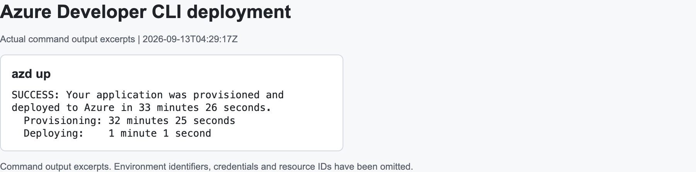
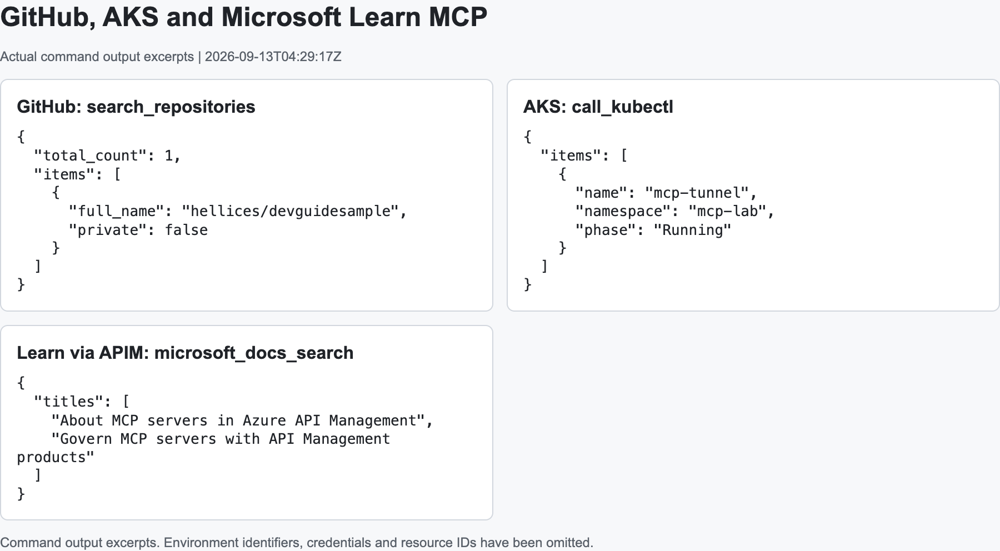
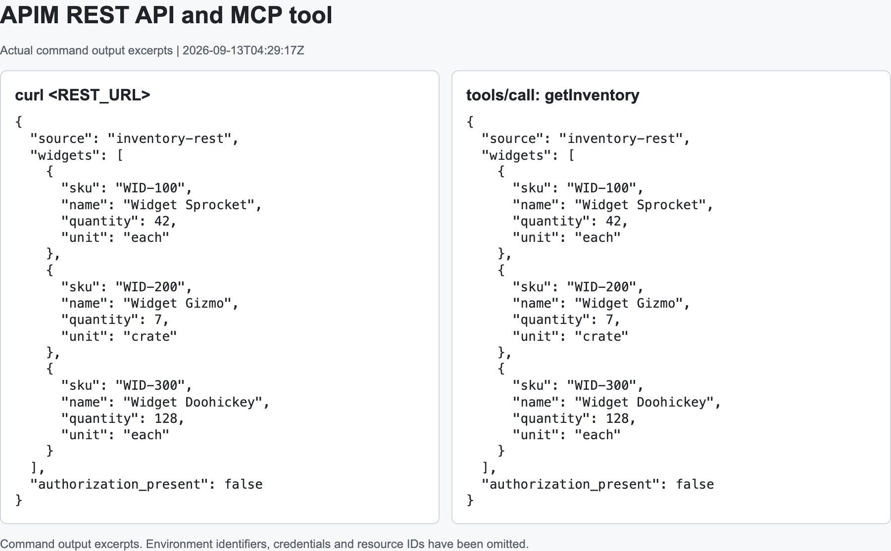
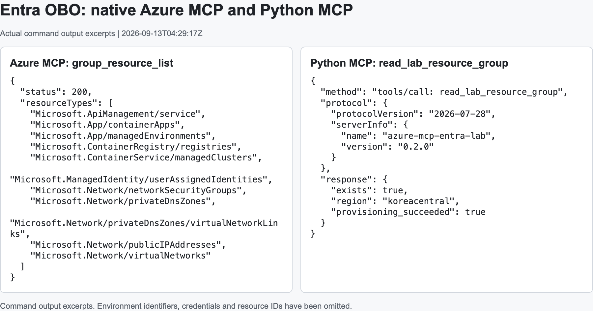
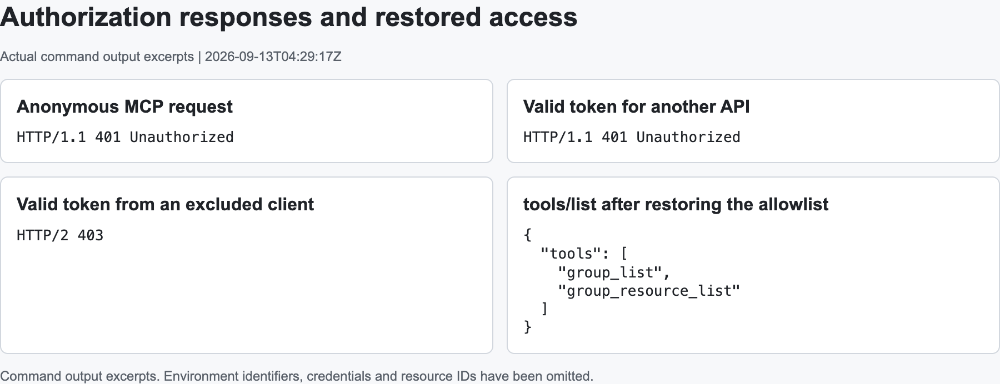

# azd 배포와 MCP 호출 결과 — APIM REST-to-MCP, Azure OBO, Learn 프록시

## 구성

운영 전략은 [Azure MCP 운영 아키텍처](../index.md), 구체적인 배포·호출은 [sample walkthrough](https://github.com/hellices/devguidesample/blob/main/docs/services/azure-architecture/mcp-configuration/samples/apim-entra-lab/walkthrough.md)를 사용합니다. 이 문서는 2026-09-13의 Container Apps·APIM 실행 이력과 관측값을 보관하며, Foundry hosted agent + Toolbox 통합 구성의 실행 결과는 포함하지 않습니다.

| 항목 | 구성 |
|---|---|
| 배포 | Azure Developer CLI 1.29.0, `azure.yaml` + Bicep |
| Region | Korea Central |
| API Management | Developer, internal VNet |
| Container Apps | Internal workload-profiles environment, Consumption profile |
| MCP 서버 | Azure MCP 2.0.5, Python MCP SDK 2.2.0 |
| 로컬 client | MCP Inspector 2.5.0, Azure MCP 2.0.5, AKS MCP 0.0.20 |
| 접근 경로 | 로컬 PC → loopback port-forward → VNet의 MCP endpoint |

APIM의 **REST-to-MCP**와 **기존 MCP 프록시**는 별도 API입니다. 전자는 기존 REST operation을 `getInventory` tool로 연결하고, 후자는 Microsoft Learn MCP backend에 연결합니다.

## 배포 순서

기존 환경을 삭제하고 새로운 azd environment를 만들었습니다. Entra app과 service principal도 별도로 정리한 후 새로 등록했습니다.

```bash
azd env new <새-환경-이름>
azd env set AZURE_SUBSCRIPTION_ID <구독-ID>
azd env set AZURE_LOCATION koreacentral
python3 scripts/identity.py prepare
azd provision --preview
azd up
```

`azd`가 provisioning, ACR remote build, Container App deployment를 수행합니다. Directory hook은 Entra app·delegated consent·federation만 관리합니다. 새 환경의 preview에는 RG, APIM, Container Apps, ACR, AKS, VNet 생성이 표시되었습니다.

`azd up`은 **33분 26초**에 완료되었습니다. 출력에서 provisioning 32분 25초, service deployment 1분 1초를 확인했습니다. APIM 생성에는 약 28분이 걸렸으며, 이는 이번 실행의 관측값이지 배포 시간 보장은 아닙니다.



아래 캡처는 실행한 CLI와 MCP 응답에서 필요한 부분을 발췌해 표시한 것입니다. Credential, tenant·subscription ID, 환경 hostname과 resource ID는 제외했습니다. [공개용 요청·응답 발췌 JSON](https://github.com/hellices/devguidesample/blob/main/docs/services/azure-architecture/mcp-configuration/samples/apim-entra-lab/assets/captures/2026-09-13-responses.json)에도 같은 내용을 보관했습니다. 원본 실행 로그와 로컬 상태는 공개 자료에 포함하지 않습니다.

## 로컬 MCP 연결

### Microsoft Learn

`tools/list` 응답에는 다음 세 tool이 있었습니다.

```text
microsoft_docs_search
microsoft_docs_fetch
microsoft_code_sample_search
```

`microsoft_docs_search`에 `Azure API Management MCP`를 전달하면 관련 Microsoft Learn 문서 제목과 URL이 반환되었습니다. Access token 없이 호출했습니다.

### GitHub

GitHub credential과 read-only tool 설정을 사용했습니다. `search_repositories`에 `repo:hellices/devguidesample`을 전달한 응답은 다음과 같습니다.

```json
{
  "total_count": 1,
  "items": [
    {
      "full_name": "hellices/devguidesample",
      "private": false
    }
  ]
}
```

GitHub 연결에는 Entra token을 사용하지 않았습니다.

### Azure MCP

로컬 Azure MCP의 `tools/list`에는 `group_list`, `group_resource_list`가 표시되었습니다. 로컬 실행은 Azure CLI credential을 사용하며, remote Azure MCP의 OBO와는 인증 방식이 다릅니다.

`group_resource_list`에 새 RG를 지정했을 때 `status: 200`과 그 RG의 resource 목록이 반환되었습니다. AKS MCP의 `call_kubectl`에서는 새 클러스터의 `mcp-lab` namespace에 있는 `mcp-tunnel` pod가 `Running`으로 표시되었습니다.



## APIM REST-to-MCP 호출

먼저 REST URL을 직접 호출한 다음, `initialize` → `notifications/initialized` → `tools/list` → `tools/call` 순서로 같은 데이터를 조회했습니다.

| 요청 | 응답 |
|---|---|
| `GET /rest/inventory` | 가상 widget 3개와 `authorization_present: false` |
| MCP `initialize` | `protocolVersion: 2025-06-18`, server `Azure API Management` |
| MCP `tools/list` | `getInventory`, 추가 입력이 없는 `inputSchema` |
| MCP `tools/call` | REST 응답과 같은 inventory 데이터 |



`getInventory`는 기존 REST operation에 연결된 native MCP tool입니다. 별도의 MCP 서버가 inventory를 대신 제공하는 구성은 아닙니다. 두 호출 모두 REST backend에 Entra Authorization header를 전달하지 않았습니다.

## Azure와 Python MCP의 OBO

공식 Azure MCP에는 `Mcp.Tools.ReadWrite`, Python MCP에는 `Mcp.Access` scope의 access token을 사용했습니다.

| 요청 | 관측 |
|---|---|
| Native Azure MCP `group_resource_list` | `status: 200`, 새 RG에 속한 Azure 리소스 반환 |
| Python MCP 연결 | Protocol `2026-07-28`, server version `0.2.0` |
| Python MCP `read_lab_resource_group` | `exists: true`, `region: koreacentral`, `provisioning_succeeded: true` |
| Python MCP `learn_search` | 실제 Microsoft Learn 문서 제목 반환 |



Native Azure MCP는 managed identity federation으로 confidential client를 인증하고 사용자 token으로 OBO를 수행했습니다. Python 예제는 서버 측 client secret으로 confidential client를 인증했습니다.

## 기존 Learn MCP 프록시

APIM의 Learn MCP URL에서 세 Learn tool이 조회되었고, `microsoft_docs_search`에 `Azure API Management MCP`를 전달한 결과 관련 문서 제목·URL이 반환되었습니다. 이 요청은 Entra로 APIM 접근을 인증한 뒤 공개 Learn backend를 익명으로 호출한 것입니다.

## 인증 오류와 설정 복구

| 조건 | 응답 |
|---|---|
| APIM MCP에 access token 없이 요청 | `401 Unauthorized` |
| Native Azure MCP용 token을 APIM에 제출 | `401 Unauthorized` |
| Native MCP에서 Azure CLI client를 allowlist에서 제외 | `403` |
| 원래 allowlist 복구 후 `tools/list` | `group_list`, `group_resource_list` |



Client allowlist 변경 직후에는 이전 설정이 잠시 적용되었습니다. 이번 실행에서는 변경 후 60초를 기다린 요청에서 403을 확인했고, 원래 설정으로 복구한 뒤 다시 도구를 조회했습니다. 반영 시간은 환경에 따라 달라질 수 있습니다.

CONNECT proxy를 사용할 때 curl의 header 파일에는 proxy의 `200 Connection Established`가 먼저 기록될 수 있습니다. 실습 명령의 `--suppress-connect-headers`는 이 응답을 제외하여 실제 MCP endpoint의 401·403을 읽도록 합니다.

## OAuth 단계별 재확인

2026-09-13 13:35 UTC에 기존 RG·Entra 앱을 재사용해 HTTP 요청과 Azure CLI로 확인했습니다. 리소스나 인증 설정은 변경하지 않았습니다.

| 단계 | 관측 |
|---|---|
| APIM·Python MCP challenge | 무인증 401, `resource_metadata` 있음. PRM 200, endpoint에 맞는 `resource`와 Entra authorization server 반환 |
| Native Azure MCP fallback | 401 header에 `resource_metadata` 없음. Root well-known은 200, `/mcp`를 붙인 metadata 경로는 401. 광고한 resource는 HTTPS server origin |
| Entra discovery | v2 OIDC metadata 200, authorization·token·JWKS endpoint 있음. 확인한 RFC 8414 후보 두 경로는 404 |
| PKCE 지원 선언 | OIDC 응답에 `code_challenge_methods_supported` 없음 |
| 앱 등록 | v2 token·등록 public client 사전 승인 확인. API 앱에는 `api://...`만 있고 HTTPS MCP identifier URI는 없음 |
| Canonical URL을 token 대상으로 요청 | Azure CLI에서 `AADSTS500011`. 기존 `api://.../Mcp.Access` scope 요청은 성공 |
| 정상·다른 audience token | APIM initialize 200, protocol `2025-06-18`; APIM·Python에서 wrong audience 401 |
| Python OBO 재호출 | `2026-07-28` 요청에서 `resultType: complete`, `isError: false`, RG 존재·region·provisioning 상태 반환 |

**PKCE 기능과 metadata 선언은 다릅니다.** [Entra는 S256을 지원](https://learn.microsoft.com/entra/identity-platform/v2-oauth2-auth-code-flow#request-an-authorization-code)하지만, [MCP 규격](https://modelcontextprotocol.io/specification/2026-07-28/basic/authorization/security-considerations#authorization-code-protection)은 해당 선언이 없으면 client가 authorization을 진행하지 않도록 요구합니다.

| 확인 완료 | 아직 완료로 볼 수 없는 것 |
|---|---|
| 사전 token 발급, challenge·PRM 조회, API token 검증, Python의 ARM OBO | MCP client의 discovery→authorization code+PKCE→token→호출 전체 흐름 |
| 앱의 현재 identifier URI와 canonical URL 대상 CLI 발급 결과 | `resource`·scope를 함께 사용하는 브라우저 PKCE 교환 전체 |
| 기존 APIM·Container Apps·Entra 환경 | 배포 대상이 없었던 Toolbox consumer 인증, token refresh 수명주기 |

실행 명령은 [인증 확인 절차](https://github.com/hellices/devguidesample/blob/main/docs/services/azure-architecture/mcp-configuration/samples/apim-entra-lab/authentication-checks.md), 공개용 결과는 [auth-stages JSON](https://github.com/hellices/devguidesample/blob/main/docs/services/azure-architecture/mcp-configuration/samples/apim-entra-lab/assets/captures/2026-09-13-auth-stages.json)에 있습니다. Raw metadata·응답·오류는 `.private/`에만 저장했습니다.

## 구성 과정에서 확인한 사항

### azd의 필수 입력과 directory 준비

`azd provision --preview`는 provisioning hook보다 먼저 Bicep 필수 입력을 읽습니다. 처음부터 app ID와 credential을 provisioning hook에서 준비하려고 하면 입력 누락으로 중단됩니다.

이 sample은 preview 전에 directory 준비를 명시적으로 수행하고, `azd up`에는 `preup` hook을 사용합니다. Entra에서는 scope를 먼저 저장한 후 `preAuthorizedApplications`가 그 scope ID를 참조하도록 구성했습니다.

### Container App의 최초 배포와 업데이트

최초 provisioning에는 placeholder image를 사용합니다. `azd deploy`가 실제 Python image를 배포할 때 ingress port와 readiness probe도 함께 맞춰야 합니다.

`azure.yaml`의 service `module`을 `python-app`으로 지정하여 `azd`가 image뿐 아니라 해당 Bicep 구성을 함께 배포하도록 했습니다. 이후 `azd provision`에서도 azd가 저장한 service image를 사용합니다.

### APIM MCP backend 설정

APIM의 native MCP proxy는 backend resource와 `backendId`로 연결했습니다. 실행 환경의 endpoint 형식은 다음과 같았습니다.

```bicep
mcpProperties: {
  transportType: 'streamable'
  endpoints: {
    message: { uriTemplate: '/mcp' }
  }
}
```

일부 Learn 관리 예제와 Bicep type은 endpoint 배열을 표시하지만, 이 API 버전의 runtime과 [공식 AI-Gateway sample](https://github.com/Azure-Samples/AI-Gateway/blob/main/labs/mcp-from-graphql/src/mcp-api/api.bicep)은 keyed object를 사용합니다. 해당 필드의 type 차이는 코드 주석에 명시했습니다.

### MCP Inspector와 VS Code 설정 형식

Inspector 예제에서는 `mcpServers` 아래에 `type: streamable-http`를 사용합니다. VS Code 예제의 `servers`·input 변수와는 파일 구조가 다르므로 구분해서 사용합니다. CLI로 server executable에 여러 flag를 전달할 때는 config 파일을 사용하면 client 옵션과 server 옵션을 명확히 나눌 수 있습니다.

## 관련 자료

시나리오 확인 후 개발용 port-forward는 종료했습니다. 새 Azure 환경은 후속 실습을 위해 유지하며, 사용이 끝나면 [sample의 정리 절차](https://github.com/hellices/devguidesample/blob/main/docs/services/azure-architecture/mcp-configuration/samples/apim-entra-lab/walkthrough.md)로 ARM 리소스와 Entra 앱을 각각 제거합니다.

- [MCP 관리·연결·인증 설계](../index.md)
- [Entra 인증과 OBO 가이드](../authentication/index.md)
- [아키텍처 SVG와 Azure 서비스 비교](../hosting-reference/index.md)
