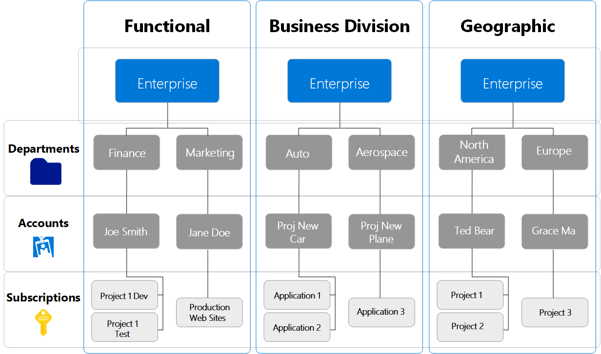

# EA·Azure 구독·RI의 관계와 역할 부여

**EA는 기업의 청구 계약, Azure 구독은 리소스를 사용하는 단위, RI는 예약 할인 상품입니다.**
따라서 **구독을 만드는 역할**, **RI를 구매하는 역할**, **구매한 예약을 관리하는 역할**을 구분하면 됩니다.
이 문서는 EA 고객이 Azure portal을 사용하는 일반적인 권한 부여 경로를 설명합니다.

## 1. EA와 Azure 구독은 어떻게 연결되는가

아래는 Microsoft Learn에 실린 **EA 계층의 원본 그림**입니다.

© Microsoft. [공식 문서][ea-roles]의 [원본 PNG][ea-image]를 수정 없이 사용했습니다.
라이선스: [CC BY 4.0][docs-license]. 그림의 인명과 프로젝트명은 원문의 예시입니다.

- **Enterprise / Enrollment**: EA 청구 계정입니다. Portal에서는 **Billing account**로 표시합니다.
- **Department**: 부서별로 계정을 묶는 선택 사항입니다.
- **Account / Enrollment account**: 계정마다 **Account Owner 한 명**이 있으며, 그 아래에 구독을 만듭니다. 하나의 EA Enrollment에는 여러 계정을 둘 수 있지만, 한 계정에 여러 Account Owner를 지정하지는 못합니다.
- **Subscription**: VM·Storage 같은 Azure 리소스를 사용하는 구독입니다.

즉, **EA 청구 계정 → 부서(선택) → 계정 → 구독**의 관계입니다.
([EA 역할과 계층][ea-roles], [EA 청구 범위][billing-scopes])

### 구독을 만들고 관리하는 역할은 누가 주는가

| 역할 | 하는 일 | 누가 부여하는가 |
|---|---|---|
| **Enterprise Administrator — EA 관리자** | EA 계정·관리자를 관리하고, 활성 계정 아래에 구독 생성 | 기존 EA 관리자. 최초 관리자는 EA 개설 시 설정 |
| **Department Administrator — 부서 관리자** | 자기 부서의 계정과 Account Owner 관리. 이 역할만으로 구독을 생성하지는 못함 | EA 관리자 또는 해당 부서의 기존 부서 관리자. 읽기 전용 역할은 부여 불가 |
| **Account Owner — 계정 소유자** | 자기 계정 아래에 구독 생성 | EA 관리자 또는 해당 부서의 부서 관리자 |
| **Owner — 구독 소유자** | 해당 구독의 리소스 운영과 역할 부여 | 구독 생성 시 지정. 이후에는 기존 구독 Owner 또는 해당 구독의 권한 관리자 |

EA 관리자는 **Cost Management + Billing**에서 EA 역할을 부여합니다.
구독의 Owner 등 Azure 역할(Azure RBAC)은 해당 **Subscription → Access control (IAM)**에서 부여합니다.
**EA의 Account Owner와 구독의 Owner는 같은 이름의 역할이 아닙니다.**
([EA 역할 부여][ea-administration], [구독 생성과 Owner 지정][create-subscription], [Azure 역할 부여][assign-role])

## 2. RI와 Reservations는 무엇이며, 어떤 역할을 받아야 하는가

여기서 **RI는 Azure Reserved VM Instances**, 즉 VM 사용료에 적용하는 예약 할인 상품입니다.
Azure portal의 **Reservations**는 이러한 Azure 예약을 구매·조회·관리하는 메뉴입니다.
**Reservations 자체가 역할 이름인 것은 아닙니다.**
([RI 설명][ri-overview], [Reservations 메뉴와 권한][reservation-access])

구매할 때 청구에 사용할 구독을 선택하지만, 구매 결과로 **Reservation order(예약 주문)**와
그 아래 **Reservation(예약)**이 만들어집니다. 예약은 주문의 권한을 상속하며,
구매 후 구독 권한을 계속 상속하지는 않습니다.
따라서 **구독 Owner를 받았다고 기존 RI의 관리 권한까지 자동으로 생기는 것은 아닙니다.**
([예약 주문과 예약][manage-reservation], [구독과 분리된 예약 권한][reservation-access])

### 필요한 역할과 부여자

| 하려는 일 | 받아야 하는 역할과 대상 | 누구에게 요청하는가 |
|---|---|---|
| **RI 구매** | 구매에 사용할 적격 구독의 **Reservation Purchaser**. 해당 구독의 **Owner**도 구매 가능 | 해당 **구독 Owner** 또는 구독의 권한 관리자 |
| **구매한 RI 조회** | 해당 **예약 주문의 Reader** | 해당 **예약 주문의 Owner** 또는 예약의 권한 관리자 |
| **구매한 RI의 일반 설정 변경** | 해당 **예약 주문의 Contributor** | 해당 **예약 주문의 Owner** 또는 예약의 권한 관리자 |
| **RI 관리와 다른 사람에게 역할 부여** | 해당 **예약 주문의 Owner** | 기존 **예약 주문 Owner** 또는 예약의 권한 관리자 |

표의 **권한 관리자**는 해당 대상에 역할 할당 권한을 가진
`User Access Administrator`·`Role Based Access Control Administrator` 등을 뜻합니다.
`Contributor`는 일반 설정을 변경하는 역할이고, 다른 사람에게 역할을 주는 역할은 아닙니다.
([예약의 조회·관리·위임][reservation-access], [Azure 역할의 차이][azure-roles], [역할 할당 조건][assign-role])

**Reservation Purchaser는 구매자가 받는 역할이지, 다른 사람에게 구독 역할을 부여하는 역할이 아닙니다.**
이 역할의 역할 할당 관련 권한은 `Microsoft.Authorization/roleAssignments/read`이며,
역할 부여에 필요한 `Microsoft.Authorization/roleAssignments/write`는 포함하지 않습니다.
([Reservation Purchaser 역할 정의][reservation-purchaser-role], [역할 할당 조건][assign-role])

**예약 주문의 Owner를 모르겠다면 EA 관리자에게 요청하면 됩니다.**
쓰기 가능한 EA 관리자는 해당 EA의 예약을 관리할 수 있고,
**Cost Management + Billing → EA 청구 계정 → Products + services → Reservations + Hybrid Benefit**에서
예약을 선택한 뒤 **Grant access**로 소유권을 확보하고 IAM 역할을 부여하는 경로를 사용할 수 있습니다.
읽기 전용 EA 관리자 역할만으로는 이 작업을 할 수 없습니다.
([EA 관리자의 예약 접근·소유권 확보][reservation-access])

구매·변경 시에는 다음 조건도 구분합니다.

- **일반 구매자의 구독 역할**: 적격 구독의 built-in **Owner** 또는 **Reservation Purchaser**가 필요합니다.
  같은 권한을 흉내 낸 custom role은 구매에 사용할 수 없습니다. ([구매 조건][buy-reservation])
- **EA 구매 정책**: EA 관리자는 **Reserved Instances** 정책을 비활성화하여 구매자를 EA 관리자로 제한할 수 있습니다.
  따라서 일반 구매자는 구독 역할뿐 아니라 이 정책의 허용 여부도 확인해야 합니다. ([구매 조건][buy-reservation])
- **중앙 구매팀의 EA 관리자**: 구매 가이드는 EA 관리자에게도 적어도 하나의 EA 구독에
  **Owner** 또는 **Reservation Purchaser** 권한이 필요하다고 명시합니다.
  정책을 비활성화하면 이 구독 역할 요건까지 면제된다고 설명하지 않습니다. ([구매 조건][buy-reservation])
- **Shared에서 특정 구독으로 할인 범위를 바꿀 때는 대상 구독의 Owner도 필요**합니다.
  위 표의 일반 설정 변경을 교환·환불·갱신의 모든 조건으로 확대하지 않습니다. ([예약 변경 조건][manage-reservation])

!!! note "EA 관리자 구매 조건의 확인 범위"

    [EA 역할표의 각주 6][ea-roles]은 EA 관리자의 청구 계정 범위 구매와 구매 정책 flag의 예외를 설명합니다.
    반면 [예약 구매 가이드][buy-reservation]는 중앙 구매팀의 EA 관리자에게 구독 역할 요건을 명시합니다.
    **구매 정책 예외와 구독 RBAC 요건 면제를 같은 의미로 해석하지 않습니다.**
    위 안내는 구매 가이드의 준비 요건을 따르며, EA 역할만으로 구매하는 모든 경로의 조건을 확정하지 않습니다.
    구독 역할 없이 구매하려는 경우에는 적용할 경로의 요건을 Microsoft에 확인해야 합니다.
    이 조건 차이가 남아 있으므로 문서의 전체 검증 상태는 `needs-review`로 유지합니다.

## 3. 테넌트 전체의 Reservations 담당자를 따로 두려면

한 예약 주문이 아니라 **해당 Microsoft Entra 테넌트의 모든 예약**을 담당하게 하려면
테넌트의 예약 범위에 다음 역할을 부여합니다.

- **Reservations Administrator**: 예약 관리와 예약 역할 위임
- **Reservations Contributor**: 예약 관리. 다른 사람에게 예약 역할을 위임할 수 없음
- **Reservations Reader**: 예약 조회

이 역할은 특정 예약에 한정할 수도 있지만, 여기서는 **테넌트의 모든 예약**을 대상으로 부여합니다.
예약 주문 범위의 일반 `Contributor`와 테넌트 예약 관리용 `Reservations Contributor`를 구분합니다.

공식 Portal 절차에서는 **Global Administrator가 User Access Administrator로 접근 권한을 승격한 뒤**
**Reservations → Role assignment**에서 이 역할을 부여합니다.
EA 관리자는 **EA 계약 범위**, 이 예약 역할은 **테넌트 범위**를 대상으로 한다는 차이가 있습니다.
([테넌트 예약 역할][reservation-access], [Portal과 PowerShell의 테넌트 역할 부여 절차][tenant-reservation-roles], [EA 청구 범위][billing-scopes])

**정리하면, RI 구매를 위한 Reservation Purchaser(또는 Owner) 역할은 해당 구독 Owner 또는 구독의 권한 관리자에게 요청합니다. 구매한 RI의 관리 권한은 예약 주문 Owner 또는 EA 관리자에게 요청합니다.**
테넌트 전체 예약 관리자를 지정하는 경우에만 위의 테넌트 권한 부여 경로를 따로 확인하면 됩니다.

[ea-roles]: https://learn.microsoft.com/en-us/azure/cost-management-billing/manage/understand-ea-roles
[billing-scopes]: https://learn.microsoft.com/en-us/azure/cost-management-billing/costs/understand-work-scopes
[ea-administration]: https://learn.microsoft.com/en-us/azure/cost-management-billing/manage/direct-ea-administration
[create-subscription]: https://learn.microsoft.com/en-us/azure/cost-management-billing/manage/create-enterprise-subscription
[buy-reservation]: https://learn.microsoft.com/en-us/azure/cost-management-billing/reservations/prepare-buy-reservation
[ri-overview]: https://learn.microsoft.com/en-us/azure/virtual-machines/prepay-reserved-vm-instances
[reservation-access]: https://learn.microsoft.com/en-us/azure/cost-management-billing/reservations/view-reservations
[manage-reservation]: https://learn.microsoft.com/en-us/azure/cost-management-billing/reservations/manage-reserved-vm-instance
[assign-role]: https://learn.microsoft.com/en-us/azure/role-based-access-control/role-assignments-portal
[azure-roles]: https://learn.microsoft.com/en-us/azure/role-based-access-control/rbac-and-directory-admin-roles
[tenant-reservation-roles]: https://learn.microsoft.com/en-us/azure/cost-management-billing/reservations/manage-reservations-rbac-powershell
[reservation-purchaser-role]: https://learn.microsoft.com/en-us/azure/role-based-access-control/built-in-roles/management-and-governance#reservation-purchaser
[ea-image]: https://learn.microsoft.com/en-us/azure/cost-management-billing/manage/media/understand-ea-roles/ea-hierarchies.png
[docs-license]: https://github.com/MicrosoftDocs/azure-docs/blob/main/LICENSE
