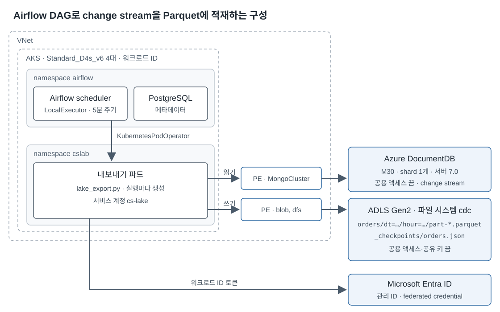

# Azure DocumentDB change stream을 Airflow DAG로 ADLS Gen2 Parquet에 적재하기

[상위 실습](../index.md)은 change stream을 상시 consumer로 읽었습니다. 이 문서는
AKS에 설치한 Airflow가 5분마다 파드를 띄워 그동안 쌓인 이벤트를 ADLS Gen2에
Parquet 파일로 쓰는 구성을 실제 구독에서 측정한 결과입니다. 확인한 질문은 다음과
같습니다.

- 이벤트가 파일로 저장되기까지 얼마나 걸리는가
- 업로드와 checkpoint 사이에서 파드가 죽으면 중복 행이 생기는가
- DAG를 멈춘 사이 400 MB 활성 change log보다 많이 쌓여도 이어 읽을 수 있는가
- Parquet 파일은 얼마나 커지는가

배포와 실행 방법은 sample의
[README](https://github.com/hellices/devguidesample/blob/main/docs/services/azure-documentdb/change-streams/samples/python-aks/README.md)와
코드에 있습니다.

## 구성



| 구성 요소 | 내용 |
| --- | --- |
| DocumentDB | M30(2 vCore, 8 GiB), shard 1개, 스토리지 32 GiB, 서버 7.0.0 |
| AKS | Kubernetes 1.35, Standard_D4s_v6 노드 4개 |
| Airflow | Helm chart 1.22.0, Airflow 3.2.2, `LocalExecutor`, 차트에 포함된 PostgreSQL |
| DAG | `KubernetesPodOperator` 태스크 하나. 5분 주기, `max_active_runs=1`, 재시도 3회 |
| 내보내기 파드 | Python 3.12, PyMongo 4.18.2, pyarrow 25.0.1. 청크당 100,000건, snappy 압축 |
| ADLS Gen2 | Standard_LRS, 계층 구조 네임스페이스, 공용 액세스와 공유 키 끔 |

스토리지에는 blob과 dfs 프라이빗 엔드포인트를 둘 다 만들었습니다. Learn은 Data
Lake Storage에서 dfs 엔드포인트만 만들면 blob 엔드포인트를 쓰는 작업이 실패할 수
있다고 설명합니다. 파드는 `azure.workload.identity/use: "true"` 레이블이 있어야
워크로드 ID 토큰을 받습니다.

실행 한 번은 checkpoint의 resume token에서 재개해 실행을 시작한 시각까지의 이벤트를
읽습니다. 100,000건마다 청크를 올린 뒤 checkpoint를 ETag 조건으로 갱신합니다. 청크
파일 이름은 그 청크를 시작한 resume token의 해시라서 재시도는 같은 파일을 덮어씁니다.

## 결과 요약

| 질문 | 결과 |
| --- | --- |
| 지연 | 초당 약 1,000건 부하에서 이벤트 기록부터 파일 저장까지 p50 156초, p99 302초, 최대 311초 |
| 재시도 중복 | 첫 청크 업로드 직후 프로세스를 죽인 뒤 재시도한 결과 230,000건 중 중복 0, 누락 0 |
| 활성 change log 초과 | 문서 본문 2.6 GB가 넘는 백로그를 누락·중복 없이 이어 읽음. 단 `maxAwaitTimeMS=1000`에서는 같은 위치에서 code 50으로 반복 실패 |
| 처리 속도 | 1 KB 문서는 초당 약 13,000–18,000건, 4 KB 문서 백로그는 초당 약 3,600건. 실행마다 파드 기동과 정리에 약 7초 |
| 파일 크기 | 이벤트에 실린 문서 크기와 거의 같음. 시험 데이터의 랜덤 채움 문자열은 snappy로 줄지 않았고 zstd로 다시 쓰면 71% 줄어듦 |

모든 시나리오에서 이벤트가 빠짐없이 한 번씩 파일에 들어갔습니다. 검증은
`verify_lake.py`가 Parquet 파일 전체를 생성기가 만든 이벤트와 대조했습니다. 중복은
같은 resume token이 두 행 이상인 경우입니다. 저장 지연은 파일 last-modified(초
단위)에서 이벤트 `wallTime`을 뺀 값입니다.

## 5분 주기 지연

부하는 문서 780,000개, 1 KB 채움, 초당 1,000건 제한으로 31분 동안 실행했습니다. DAG는
5분 주기로 계속 돌았습니다. 생성기가 실제로 낸 속도는 초당 958건이었습니다. 이벤트
1,794,000건이 모두 파일에 들어갔고 중복, 누락, 문서별 순서 역전은 0건이었습니다.

| 지표 | p50 | p95 | p99 | 최대 |
| --- | --- | --- | --- | --- |
| 이벤트 기록부터 파일 저장까지 | 156초 | 290초 | 302초 | 311초 |
| 이벤트 기록부터 파드가 읽기까지 | 154초 | 284초 | 296초 | 301초 |

- 지연 분포는 주기 간격과 거의 같습니다. 직전 실행 직후에 기록된 이벤트는 약 5분을
  기다리고 실행 직전에 기록된 이벤트는 몇 초 만에 저장됩니다.
- 실행 한 번은 이벤트 약 300,000건을 16–24초에 썼습니다. Airflow가 실행을 시작해
  파드를 정리하기까지는 21–30초였습니다. 차이인 약 7초가 파드 예약, 기동, 연결과
  정리에 쓰였습니다.
- 파일은 21개였고 대부분 100,000행, 약 69 MB였습니다. 실행 끝의 나머지 청크는 더
  작았습니다.
- 생성기만 돌 때 클러스터 CPU는 1분 평균 약 23–25%였습니다. 내보내기가 도는 분에도
  같은 범위여서 1분 단위에서는 읽기 부하가 드러나지 않았습니다.

## 업로드 직후 장애와 재시도

DAG를 멈춘 상태에서 문서 100,000개(이벤트 230,000건)를 쓰고 첫 시도만 첫 청크 업로드
직후 종료하도록 실행했습니다. 첫 시도는 checkpoint를 쓰기 전에 종료 코드 137로
끝났습니다. Airflow가 30초 뒤 재시도했고 두 번째 시도는 같은 checkpoint에서 시작해
첫 청크를 같은 경로에 덮어썼습니다.

| 기대 이벤트 | 저장된 이벤트 | 중복 | 누락 | 파일 |
| --- | --- | --- | --- | --- |
| 230,000 | 230,000 | 0 | 0 | 3 |

## 활성 change log를 넘긴 재개

DAG를 멈춘 상태에서 생성기가 31분 동안 문서 600,000개를 4 KB씩 채워 이벤트
1,380,000건을 썼습니다. 문서 본문만 2.6 GB가 넘어 Learn이 설명하는 활성 change log
400 MB의 6배 이상입니다. 그동안 클러스터 스토리지 사용률은 약 30%에서 44%로
올랐습니다.

### maxAwaitTimeMS가 재개를 막음

DAG를 다시 켜자 첫 시도와 재시도 모두 약 13초 만에 실패했습니다. 청크는 하나도
쓰지 못했고 checkpoint도 그대로였습니다.

```text
pymongo.errors.ExecutionTimeout: Query exceeded command timeout of 1000ms
full error: {'ok': 0.0, 'code': 50, 'codeName': 'ExceededTimeLimit', ...}
```

당시 코드는 `max_await_time_ms=1000`으로 stream을 열었습니다. 같은 checkpoint에서
읽기만 하는 프로브로 비교했습니다.

| `maxAwaitTimeMS` | 결과 |
| --- | --- |
| 1000 | 58,000번째 이벤트 뒤 `getMore`에서 code 50으로 실패 |
| 지정 안 함 | 1,380,000건을 311초에 모두 읽음(초당 4,436건). 0.5초 넘는 `getMore` 65회, 최대 7.4초 |

- 이 클러스터는 `maxAwaitTimeMS`를 새 이벤트를 기다리는 시간이 아니라 `getMore`
  전체의 실행 제한으로 적용했습니다. 그 시간을 넘긴 `getMore`는 빈 배치 대신 오류를
  돌려주었습니다.
- 지정하지 않은 실행에서 처음 느려진 `getMore`도 58,000번째 이벤트 뒤였습니다(1.4초).
  느린 `getMore`는 그 뒤로도 불규칙하게 나타났습니다.
- 같은 위치에서 매번 실패하므로 Airflow 재시도로는 넘어가지 못합니다. 고치지 않으면
  이후 주기 실행도 모두 같은 지점에서 실패합니다.
- 새 이벤트가 없을 때 `try_next()`는 값을 지정했을 때와 지정하지 않았을 때 모두
  1.0초 뒤 `None`을 돌려주었습니다. 따라서 값을 빼도 실행 종료 조건은 그대로
  동작합니다.

### 수정 후 결과

`lake_export.py`가 기본적으로 `max_await_time_ms`를 지정하지 않도록 바꾼 뒤 Airflow의
세 번째 시도가 같은 checkpoint에서 시작했습니다.

| 지표 | 값 |
| --- | --- |
| 저장된 이벤트 | 1,380,000건(기대값과 같음), 중복 0, 누락 0, 문서별 순서 역전 0 |
| 내보내기 시간 | 380.5초(초당 약 3,600건). Airflow 태스크 전체 398초 |
| 파일 | 14개, 대부분 100,000행·약 374 MB, 합계 5.13 GB |
| 내보내기 파드 메모리 | 20초 간격 측정에서 최대 약 1.9 GiB |
| 클러스터 CPU(1분 평균) | 따라잡는 동안 15–32%, 직전 약 5% |

바로 다음 주기 실행은 새 이벤트 0건으로 1.2초 만에 끝났습니다.

## 파일 크기

백로그 재개 시험의 Parquet 합계 5.13 GB는 생성기가 쓴 문서 본문 2.6 GB의 약 두 배입니다. 가장 큰
파일(100,000행, 374 MB)을 열어 원인을 확인했습니다.

| 열 | 압축 전 | snappy 압축 후 | 비율 |
| --- | --- | --- | --- |
| `full_document` | 382.3 MB | 371.1 MB | 0.97 |
| 나머지 6개 열 합계 | 7.2 MB | 2.7 MB | 0.38 |

- 파일 크기의 99%가 문서 본문입니다. 이 파일의 행은 insert 43,567건, update 47,720건,
  delete 8,713건이었고 delete를 뺀 91,287행에 문서 전체가 들어 있었습니다. 문서는
  BSON 기준 평균 4,129바이트였습니다.
- change stream은 변경마다 문서 전체를 보냅니다. 이 클러스터는 update에도
  `fullDocument`를 넣습니다. 그래서 문서 하나가 insert와 update에 한 번씩 저장됩니다.
  문서가 실린 이벤트 약 1,260,000건 × 약 4.1 KB가 약 5.2 GB이고 Parquet 합계와 거의
  같습니다.
- 크기 대부분은 생성기가 채운 4,000자 랜덤 16진 문자열입니다. 반복이 없어 snappy는
  거의 줄이지 못했습니다.

같은 파일을 다른 방식으로 다시 써 비교했습니다.

| 방식 | 크기 |
| --- | --- |
| snappy(현재) | 374 MB |
| gzip | 210 MB |
| zstd level 3 | 107 MB |
| zstd level 9 | 111 MB |
| snappy, 채움 문자열 제거 | 4.8 MB |

zstd는 insert와 update에 반복된 같은 채움 문자열까지 찾아 줄였습니다. 채움 문자열을
빼면 100,000행이 4.8 MB여서 Parquet의 열 구조가 더하는 크기는 작습니다. 실제 문서는
랜덤 문자열보다 잘 압축되므로 이번 숫자는 압축 측면의 최악에 가깝습니다.

## 판단

- 몇 분 지연을 받아들일 수 있고 결과가 Parquet 파일이어야 하면 이 방식이 단순합니다.
  상시 파드가 없고 중간 메시지 계층도 없습니다.
- 정확히 한 번의 결과는 파일 이름과 checkpoint 순서로 얻습니다. checkpoint를 먼저 쓰고
  파일을 나중에 쓰면 그 사이 장애로 이벤트를 잃습니다.
- `max_active_runs=1`과 ETag 조건은 둘 다 필요합니다. 첫째는 Airflow 안에서 실행이
  겹치지 않게 하고 둘째는 수동 Job 같은 외부 실행이 checkpoint를 덮어쓰지 못하게 합니다.
- change stream을 여는 코드에 짧은 `maxAwaitTimeMS`를 주지 않습니다. 평소에는 문제가
  없다가 백로그가 커진 뒤에야 code 50으로 드러나고 재시도로도 풀리지 않습니다. Learn의
  C# 예제도 `MaxAwaitTime`을 1초로 둡니다. 값을 꼭 줘야 하면 같은 클러스터에서 백로그
  재개를 시험해 정합니다.
- DAG를 오래 멈추면 Learn이 말하는 재개 범위(최대 35일 또는 클러스터 초기화 시점 중
  이른 쪽)를 넘을 수 있습니다. 멈춘 기간을 모니터링합니다. Learn은 보관된 로그를
  처리하는 작업을 트래픽이 적은 시간에 하라고 권장합니다. 백로그 재개 시험에서 따라잡는 동안
  클러스터 CPU가 15–32%로 올랐습니다.
- 파일은 이벤트 이력이므로 문서 하나가 여러 번 저장됩니다. 문서별 최신 상태만 필요하면
  뒤 단계에서 `doc_id` 기준으로 합칩니다. update를 바뀐 필드만으로 줄이는 방법은 이
  클러스터가 `updateDescription`을 돌려주지 않아 쓸 수 없습니다.
- 압축은 zstd를 먼저 검토합니다. 문서가 크면 청크 크기(`CS_CHUNK_EVENTS`)를 줄여
  파일 크기와 파드 메모리를 맞춥니다.

## 한계

- 단일 shard M30 클러스터, 컬렉션 하나, 측정 하루의 결과입니다.
- change log의 실제 크기는 조회할 수 없어 문서 본문 크기로 추정했습니다.
- `maxAwaitTimeMS`가 `getMore` 실행 제한으로 적용되는 동작은 Learn에 설명이 없습니다.
  이 클러스터에서 관측한 결과입니다.
- 압축 비교는 백로그 재개 시험의 파일 하나를 다시 써서 얻었습니다. zstd로 쓸 때의 시간과 CPU는
  측정하지 않았습니다.
- 파일 저장 지연은 초 단위 last-modified로 계산했습니다.
- Parquet 스키마는 원본 문서를 JSON 문자열 열 하나로 둡니다. 분석 쿼리에서 열로
  펼치는 작업은 다루지 않았습니다.
- 차트에 포함된 PostgreSQL은 시험용입니다. 운영에서는 외부 데이터베이스를 씁니다.

## 공식 참고 자료

- [Change streams in Azure DocumentDB](https://learn.microsoft.com/azure/documentdb/change-streams)
- [Use private endpoints for Azure Storage](https://learn.microsoft.com/azure/storage/common/storage-private-endpoints)
- [Use Microsoft Entra Workload ID with AKS](https://learn.microsoft.com/azure/aks/workload-identity-overview)
