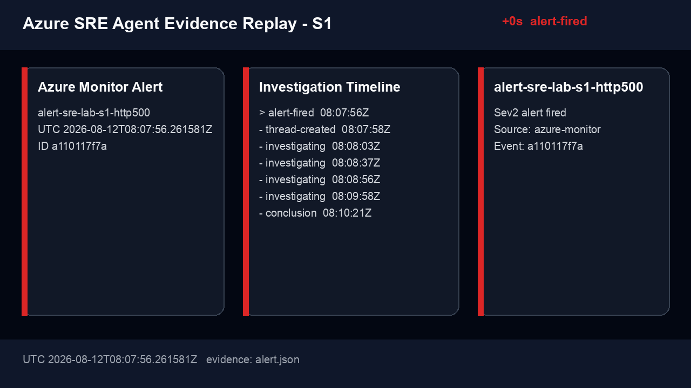

# Azure SRE Agent Evidence Capture Implementation Plan

> **For agentic workers:** REQUIRED SUB-SKILL: Use superpowers:subagent-driven-development (recommended) or superpowers:executing-plans to implement this plan task-by-task. Steps use checkbox (`- [ ]`) syntax for tracking.

**Goal:** Capture real Azure Monitor and Azure SRE Agent incident state transitions, preserve redacted evidence, and render reproducible PNG/GIF/Markdown investigation timelines.

**Architecture:** A standard-library Python collector polls Azure Alerts Management and the SRE Agent data-plane APIs, writing immutable raw snapshots under the Git-ignored evidence directory. A normalizer converts snapshots to a typed, redacted event timeline, and a Pillow renderer creates deterministic 1280×720 frames and an animated GIF that the report embeds.

**Tech Stack:** Python 3.12, Azure CLI, Azure SRE Agent REST API, Azure Alerts Management REST API, Pillow, pytest, Bash, Markdown, Mermaid.

## Global Constraints

- Raw API JSON stays under `monitor/sre-agent-event-lab/evidence/` and is never committed.
- Rendered assets go under scenario directories such as `monitor/sre-agent-event-lab/assets/captures/s1/`.
- Never write bearer tokens, connection strings, instrumentation keys, cookies, PATs, or credential payloads to disk.
- Keep full resource, alert, thread, and message IDs only in raw/normalized JSON; GIF footers show short hashes.
- Poll at a bounded interval and stop at a configurable deadline.
- Treat 401/403 as fatal RBAC errors, honor `Retry-After` for 429/5xx, and preserve the last successful snapshot.
- Never invent missing tool/action events; render an explicit unknown or timeout state.
- A capture is complete when it contains alert-fired, thread-created, investigating, and conclusion events, or explicitly records which state was missing.

---

## File Map

| File | Responsibility |
|---|---|
| `monitor/sre-agent-event-lab/scripts/capture_agent.py` | Authenticate through Azure CLI, poll alert/thread/message APIs, write raw snapshots |
| `monitor/sre-agent-event-lab/scripts/capture_model.py` | Typed event model, redaction, normalization, state classification |
| `monitor/sre-agent-event-lab/scripts/render_capture.py` | Render deterministic PNG frames, GIF, Mermaid, and Markdown timeline |
| `monitor/sre-agent-event-lab/scripts/capture-scenario.sh` | Safe operator wrapper that reads Agent setup and scenario timeline |
| `monitor/sre-agent-event-lab/scripts/tests/test_capture_model.py` | Normalization, redaction, state, and missing-event tests |
| `monitor/sre-agent-event-lab/scripts/tests/test_render_capture.py` | Frame count, dimensions, GIF, Mermaid, and secret scan tests |
| `monitor/sre-agent-event-lab/app/requirements-dev.txt` | Pillow dependency for tests and capture rendering |
| `monitor/sre-agent-event-lab/README.md` | Automated capture and optional Portal recording commands |
| `docs/superpowers/reports/2026-08-12-azure-sre-agent-event-testing-results.md` | Per-scenario GIF, conclusion frame, timeline, and evidence references |

---

### Task 1: Collect and normalize actual incident evidence

**Files:**
- Create: `monitor/sre-agent-event-lab/scripts/capture_agent.py`
- Create: `monitor/sre-agent-event-lab/scripts/capture_model.py`
- Create: `monitor/sre-agent-event-lab/scripts/tests/test_capture_model.py`

**Interfaces:**
- `capture_agent.py --scenario s1 --alert-id ID --output-dir PATH --timeout 1200 --interval 15`
- `capture_model.normalize_capture(alert: dict, snapshots: list[dict]) -> list[dict]`
- Each normalized event has `event_id`, `timestamp`, `state`, `title`, `summary`, `source`, and `source_file`.

- [ ] **Step 1: Write failing normalization and redaction tests**

Test a fixture containing:

```python
snapshots = [{
    "captured_at": "2026-08-12T05:10:00Z",
    "threads": [{"id": "thread-1", "title": "[SRE-LAB-S1] HTTP 500", "status": "Running"}],
    "messages": [{
        "id": "message-1",
        "createdAt": "2026-08-12T05:10:01Z",
        "role": "assistant",
        "content": "Authorization: Bearer secret-token",
    }],
}]
```

Assert the normalized timeline includes alert-fired and thread-created, removes `secret-token`, preserves the message ID, and reports a missing conclusion.

- [ ] **Step 2: Run RED**

```bash
monitor/sre-agent-event-lab/app/.venv/bin/python -m pytest \
  monitor/sre-agent-event-lab/scripts/tests/test_capture_model.py -q
```

Expected: import failure because `capture_model.py` does not exist.

- [ ] **Step 3: Implement typed normalization and redaction**

Use dataclasses and standard library only. Redact keys matching:

```python
SENSITIVE_KEYS = {
    "authorization", "cookie", "token", "access_token",
    "connectionstring", "connection_string", "instrumentationkey",
    "pat", "password", "secret",
}
```

Also replace bearer-token and connection-string patterns inside strings with `[REDACTED]`. Sort by parsed UTC timestamp and deduplicate with `(source, event_id, state)`.

- [ ] **Step 4: Implement bounded API collection**

Use `subprocess.run` to call:

```bash
az account get-access-token --resource https://azuresre.dev --query accessToken -o tsv
az rest --method get --url \
  "https://management.azure.com/subscriptions/95933ae5-0201-4a21-a1fc-8051a7437982/providers/Microsoft.AlertsManagement/alerts?api-version=2019-03-01"
```

Keep access tokens only in memory. Call:

- `GET /api/v1/threads`
- `GET /api/v1/threads/{threadId}`
- `GET /api/v1/threads/{threadId}/messages`

Write each successful response atomically to `thread-snapshots/0001.json`. Match a thread by alert title and creation time after the alert fired time.

- [ ] **Step 5: Run GREEN and commit**

```bash
monitor/sre-agent-event-lab/app/.venv/bin/python -m pytest \
  monitor/sre-agent-event-lab/scripts/tests/test_capture_model.py -q
git add monitor/sre-agent-event-lab/scripts/capture_agent.py \
  monitor/sre-agent-event-lab/scripts/capture_model.py \
  monitor/sre-agent-event-lab/scripts/tests/test_capture_model.py
git commit -m "feat(monitor): capture SRE Agent incident evidence" \
  -m "Co-authored-by: Copilot <223556219+Copilot@users.noreply.github.com>"
```

---

### Task 2: Render actual evidence as PNG, GIF, Mermaid, and Markdown

**Files:**
- Create: `monitor/sre-agent-event-lab/scripts/render_capture.py`
- Create: `monitor/sre-agent-event-lab/scripts/tests/test_render_capture.py`
- Modify: `monitor/sre-agent-event-lab/app/requirements-dev.txt`

**Interfaces:**
- `render_capture.py TIMELINE_JSON OUTPUT_DIR`
- Produces numbered PNGs, `investigation.gif`, `timeline.mmd`, and `timeline.md`.

- [ ] **Step 1: Add Pillow and write failing renderer tests**

Add:

```text
Pillow~=11.3.0
```

Test a four-event fixture and assert:

- four 1280×720 PNG files;
- animated GIF with four frames;
- final frame duration is 3000 ms;
- Mermaid contains the alert and Agent participants;
- rendered files do not contain any forbidden secret pattern.

- [ ] **Step 2: Run RED**

```bash
monitor/sre-agent-event-lab/app/.venv/bin/pip install -r \
  monitor/sre-agent-event-lab/app/requirements-dev.txt
monitor/sre-agent-event-lab/app/.venv/bin/python -m pytest \
  monitor/sre-agent-event-lab/scripts/tests/test_render_capture.py -q
```

Expected: import failure because `render_capture.py` does not exist.

- [ ] **Step 3: Implement deterministic rendering**

Use a 1280×720 RGB canvas and DejaVu Sans when available, otherwise Pillow's default font. Render:

- scenario/state header;
- alert card;
- elapsed timeline;
- latest Agent event;
- short SHA-256 hashes for alert/thread IDs.

Save frames with stable filenames based on state order, then create a looping GIF with 1500 ms regular frames and 3000 ms conclusion/timeout frame.

- [ ] **Step 4: Generate Mermaid and Markdown**

`timeline.mmd` must use `sequenceDiagram` with participants `AzureMonitor`, `SREAgent`, and `Evidence`. `timeline.md` must list UTC, elapsed seconds, state, source, and summary.

- [ ] **Step 5: Run GREEN and commit**

```bash
monitor/sre-agent-event-lab/app/.venv/bin/python -m pytest \
  monitor/sre-agent-event-lab/scripts/tests/test_render_capture.py -q
git add monitor/sre-agent-event-lab/app/requirements-dev.txt \
  monitor/sre-agent-event-lab/scripts/render_capture.py \
  monitor/sre-agent-event-lab/scripts/tests/test_render_capture.py
git commit -m "feat(monitor): render SRE investigation captures" \
  -m "Co-authored-by: Copilot <223556219+Copilot@users.noreply.github.com>"
```

---

### Task 3: Integrate scenario capture and report documentation

**Files:**
- Create: `monitor/sre-agent-event-lab/scripts/capture-scenario.sh`
- Modify: `monitor/sre-agent-event-lab/README.md`
- Modify: `docs/superpowers/reports/2026-08-12-azure-sre-agent-event-testing-results.md`

**Interfaces:**
- `capture-scenario.sh s1 EVIDENCE_DIR` reads `agent-setup.json` and `timeline.json`.
- Produces Git-ignored raw evidence and commit-safe assets under `assets/captures/s1/`.

- [ ] **Step 1: Implement the safe wrapper**

Validate the subscription, resource group tag, Agent setup file, alert ID, and timeline timestamps. Invoke collector, normalizer, and renderer. Fail if the normalized timeline contains a forbidden secret or fewer than four explicit states.

- [ ] **Step 2: Document automated capture**

Add exact commands:

```bash
monitor/sre-agent-event-lab/scripts/capture-scenario.sh \
  s1 monitor/sre-agent-event-lab/evidence/s1-20260812T051000Z
```

Document the generated files and how to validate frame count with Pillow.

- [ ] **Step 3: Document optional Portal recording**

Document a 30–60 second macOS window-only recording procedure and an `ffmpeg` conversion command, while stating that Portal video never replaces API evidence.

- [ ] **Step 4: Integrate captures into the report**

Each scenario section must embed:

```markdown

```

Also link the conclusion PNG, Mermaid source, normalized evidence location, and regeneration command.

- [ ] **Step 5: Verify and commit**

```bash
monitor/sre-agent-event-lab/app/.venv/bin/python -m pytest \
  monitor/sre-agent-event-lab/scripts/tests -q
bash -n monitor/sre-agent-event-lab/scripts/*.sh
rg -n 'Bearer |InstrumentationKey=|connectionString|access_token' \
  monitor/sre-agent-event-lab/assets/captures && exit 1 || true
git diff --check
git add monitor/sre-agent-event-lab/scripts/capture-scenario.sh \
  monitor/sre-agent-event-lab/README.md \
  docs/superpowers/reports/2026-08-12-azure-sre-agent-event-testing-results.md \
  monitor/sre-agent-event-lab/assets/captures
git commit -m "docs(monitor): add SRE Agent investigation captures" \
  -m "Co-authored-by: Copilot <223556219+Copilot@users.noreply.github.com>"
```
