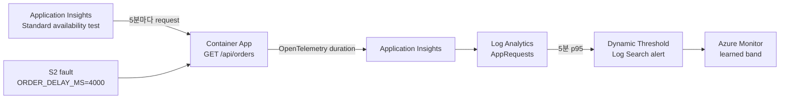

# Azure Monitor Dynamic Threshold Lab Case Implementation Plan

> **For agentic workers:** REQUIRED SUB-SKILL: Use superpowers:subagent-driven-development (recommended) or superpowers:executing-plans to implement this plan task-by-task. Steps use checkbox (`- [ ]`) syntax for tracking.

**Goal:** Extend the existing SRE Agent S2 latency scenario into a deployable, multi-day Azure Monitor Dynamic Threshold case with a real baseline producer, a shadow alert rule, and truthful validation guidance.

**Architecture:** A new focused Bicep module deploys an Application Insights Standard availability test and a workspace-scoped Dynamic Threshold Log Search alert. The availability test calls `/api/orders` every five minutes, the existing OpenTelemetry pipeline writes request durations to `AppRequests`, and the dynamic rule evaluates five-minute p95 values without an Action Group. The existing static S2 rule remains unchanged for deterministic same-day testing.

**Tech Stack:** Bicep, Azure Monitor scheduled query rules, Application Insights Standard availability tests, Log Analytics KQL, Python/pytest, Markdown, Mermaid.

## Global Constraints

- Keep all three existing one-minute static scheduled-query alert rules unchanged.
- The Dynamic Threshold rule must evaluate every 5 minutes over a 20-minute window.
- Use Medium sensitivity and require 2 failures in 4 evaluation periods.
- Keep the Dynamic Threshold rule in shadow mode with no Action Group.
- Use `/api/orders` p95 `DurationMs` as the numeric signal.
- Do not claim that an alert can fire before 3 days and 30 samples.
- State that weekly seasonality requires at least 3 weeks.
- Do not fabricate historical telemetry or observed screenshots.
- Reuse Microsoft's official Dynamic Threshold chart and identify its source.
- Keep `ORDER_DELAY_MS=0` recovery explicit and preserve the lab's existing cost and cleanup warnings.

---

## File Structure

- `monitor/sre-agent-event-lab/infra/dynamic-threshold-case.bicep`
  owns only the baseline web test and the shadow dynamic alert.
- `monitor/sre-agent-event-lab/infra/lab.bicep`
  wires the case module to the existing workload and observability outputs.
- `monitor/sre-agent-event-lab/infra/main.bicep`
  exposes the web-test and alert names through `azd`.
- `monitor/sre-agent-event-lab/infra/tests/test_dynamic_threshold_case.py`
  protects the infrastructure contract independently of the static alert tests.
- `monitor/sre-agent-event-lab/dynamic-thresholds.md`
  becomes the runnable two-phase S2 case.
- `monitor/sre-agent-event-lab/README.md`
  advertises the multi-day case and its additional billable resources.
- `monitor/azure-monitor-dynamic-thresholds-brief.md`
  links the customer brief to the hands-on case.
- `monitor/sre-agent-event-lab/scripts/tests/test_dynamic_threshold_case_docs.py`
  protects learning-period, safety, image-attribution, and navigation claims.
- `monitor/sre-agent-event-lab/scripts/tests/test_lab_guides.py`
  updates the cost cadence assertion to distinguish the unchanged static rules
  from the new five-minute dynamic rule.

---

### Task 1: Deploy the Baseline Producer and Shadow Dynamic Rule

**Files:**
- Create: `monitor/sre-agent-event-lab/infra/dynamic-threshold-case.bicep`
- Create: `monitor/sre-agent-event-lab/infra/tests/test_dynamic_threshold_case.py`
- Modify: `monitor/sre-agent-event-lab/infra/lab.bicep`
- Modify: `monitor/sre-agent-event-lab/infra/main.bicep`

**Interfaces:**
- Consumes: `observability.outputs.workspaceId`,
  `observability.outputs.appInsightsResourceId`,
  `workload.outputs.containerAppFqdn`, and
  `workload.outputs.telemetryServiceName`.
- Produces: Bicep outputs `baselineWebTestName string` and
  `dynamicThresholdAlertName string`, re-exported by `lab.bicep` and
  `main.bicep` as `AZURE_BASELINE_WEB_TEST_NAME` and
  `AZURE_DYNAMIC_THRESHOLD_ALERT_NAME`.

- [ ] **Step 1: Write the failing infrastructure contract test**

Create `monitor/sre-agent-event-lab/infra/tests/test_dynamic_threshold_case.py`:

```python
import re
from pathlib import Path


INFRA = Path(__file__).parents[1]
CASE_BICEP = INFRA / "dynamic-threshold-case.bicep"
LAB_BICEP = INFRA / "lab.bicep"
MAIN_BICEP = INFRA / "main.bicep"


def test_standard_web_test_produces_one_bounded_baseline_request():
    template = CASE_BICEP.read_text()

    assert "Microsoft.Insights/webTests@2022-06-15" in template
    assert "kind: 'standard'" in template
    assert "Frequency: 300" in template
    assert "Timeout: 15" in template
    assert "RetryEnabled: false" in template
    assert "RequestUrl: 'https://${containerAppFqdn}/api/orders'" in template
    assert "ExpectedHttpStatusCode: 200" in template
    assert "'hidden-link:${appInsightsResourceId}': 'Resource'" in template
    assert template.count("Id: 'us-va-ash-azr'") == 1


def test_dynamic_rule_uses_the_s2_numeric_p95_signal():
    template = CASE_BICEP.read_text()

    assert "Microsoft.Insights/scheduledQueryRules@2025-01-01-preview" in template
    assert "criterionType: 'DynamicThresholdCriterion'" in template
    assert "alertSensitivity: 'Medium'" in template
    assert "operator: 'GreaterThan'" in template
    assert "metricMeasureColumn: 'P95DurationMs'" in template
    assert "percentile(DurationMs, 95)" in template
    assert "by bin(TimeGenerated, 5m)" in template
    assert 'AppRoleName == "{0}"' in template
    assert '| where Name has "/api/orders"' in template
    assert "threshold:" not in template


def test_dynamic_rule_uses_five_minute_evaluation_and_two_of_four_failures():
    template = CASE_BICEP.read_text()

    assert "evaluationFrequency: 'PT5M'" in template
    assert "windowSize: 'PT20M'" in template
    assert "minFailingPeriodsToAlert: 2" in template
    assert "numberOfEvaluationPeriods: 4" in template
    assert re.search(r"actions:\s*\{\s*actionGroups:\s*\[\]\s*\}", template)


def test_dynamic_rule_targets_the_existing_workspace():
    template = CASE_BICEP.read_text()

    assert re.search(r"scopes:\s*\[\s*workspaceResourceId\s*\]", template)
    assert re.search(
        r"targetResourceTypes:\s*\[\s*'Microsoft\.OperationalInsights/workspaces'\s*\]",
        template,
    )


def test_case_module_is_wired_and_outputs_are_reexported():
    lab = LAB_BICEP.read_text()
    main = MAIN_BICEP.read_text()

    for value in (
        "workspaceResourceId: observability.outputs.workspaceId",
        "appInsightsResourceId: observability.outputs.appInsightsResourceId",
        "containerAppFqdn: workload.outputs.containerAppFqdn",
        "serviceName: workload.outputs.telemetryServiceName",
    ):
        assert value in lab

    assert "output baselineWebTestName string" in lab
    assert "output dynamicThresholdAlertName string" in lab
    assert "output AZURE_BASELINE_WEB_TEST_NAME string" in main
    assert "output AZURE_DYNAMIC_THRESHOLD_ALERT_NAME string" in main
```

- [ ] **Step 2: Run the targeted test and verify it fails**

Run:

```bash
cd monitor/sre-agent-event-lab
app/.venv/bin/python -m pytest infra/tests/test_dynamic_threshold_case.py -q
```

Expected: FAIL with `FileNotFoundError` for
`infra/dynamic-threshold-case.bicep`.

- [ ] **Step 3: Add the focused Bicep module**

Create `monitor/sre-agent-event-lab/infra/dynamic-threshold-case.bicep`:

```bicep
@description('Azure region for the Dynamic Threshold case resources.')
param location string

@description('Stable alphanumeric suffix used for resource names.')
param suffix string

@description('Resource ID of the Log Analytics workspace backing Application Insights.')
param workspaceResourceId string

@description('Resource ID of the Application Insights component linked to the web test.')
param appInsightsResourceId string

@description('Public FQDN of the deployed Container App.')
param containerAppFqdn string

@description('Deployment-unique OpenTelemetry service name.')
param serviceName string

@description('Tags applied to Dynamic Threshold case resources.')
param tags object

var baselineWebTestName = 'webtest-sre-lab-orders-${suffix}'
var dynamicThresholdAlertName = 'alert-sre-lab-s2-dynamic-latency'
var latencyQuery = format('''
AppRequests
| where AppRoleName == "{0}"
| where Name has "/api/orders"
| summarize P95DurationMs=percentile(DurationMs, 95) by bin(TimeGenerated, 5m)
''', serviceName)

resource baselineWebTest 'Microsoft.Insights/webTests@2022-06-15' = {
  name: baselineWebTestName
  location: location
  kind: 'standard'
  tags: union(tags, {
    'hidden-link:${appInsightsResourceId}': 'Resource'
  })
  properties: {
    Description: 'Produces one bounded /api/orders request every five minutes for the Dynamic Threshold lab.'
    Enabled: true
    Frequency: 300
    Kind: 'standard'
    Locations: [
      {
        Id: 'us-va-ash-azr'
      }
    ]
    Name: baselineWebTestName
    Request: {
      FollowRedirects: false
      HttpVerb: 'GET'
      ParseDependentRequests: false
      RequestUrl: 'https://${containerAppFqdn}/api/orders'
    }
    RetryEnabled: false
    SyntheticMonitorId: baselineWebTestName
    Timeout: 15
    ValidationRules: {
      ExpectedHttpStatusCode: 200
      SSLCheck: true
    }
  }
}

resource dynamicLatencyAlert 'Microsoft.Insights/scheduledQueryRules@2025-01-01-preview' = {
  name: dynamicThresholdAlertName
  location: location
  kind: 'LogAlert'
  tags: tags
  properties: {
    actions: {
      actionGroups: []
    }
    autoMitigate: true
    checkWorkspaceAlertsStorageConfigured: false
    criteria: {
      allOf: [
        {
          alertSensitivity: 'Medium'
          criterionType: 'DynamicThresholdCriterion'
          failingPeriods: {
            minFailingPeriodsToAlert: 2
            numberOfEvaluationPeriods: 4
          }
          metricMeasureColumn: 'P95DurationMs'
          operator: 'GreaterThan'
          query: latencyQuery
          timeAggregation: 'Maximum'
        }
      ]
    }
    description: 'Shadow-mode Dynamic Threshold for abnormal /api/orders p95 latency.'
    displayName: '[SRE-LAB-S2-DYNAMIC] Request p95 latency outside learned range'
    enabled: true
    evaluationFrequency: 'PT5M'
    scopes: [
      workspaceResourceId
    ]
    severity: 3
    skipQueryValidation: false
    targetResourceTypes: [
      'Microsoft.OperationalInsights/workspaces'
    ]
    windowSize: 'PT20M'
  }
}

output baselineWebTestName string = baselineWebTest.name
output dynamicThresholdAlertName string = dynamicLatencyAlert.name
```

- [ ] **Step 4: Wire the module into the resource-group deployment**

Add this module after the existing `alerts` module in
`monitor/sre-agent-event-lab/infra/lab.bicep`:

```bicep
module dynamicThresholdCase 'dynamic-threshold-case.bicep' = if (deployContainerApp) {
  name: 'sre-lab-dynamic-threshold-case'
  params: {
    location: location
    suffix: suffix
    workspaceResourceId: observability.outputs.workspaceId
    appInsightsResourceId: observability.outputs.appInsightsResourceId
    containerAppFqdn: workload.outputs.containerAppFqdn
    serviceName: workload.outputs.telemetryServiceName
    tags: tags
  }
}
```

Add these outputs at the end of the same file:

```bicep
output baselineWebTestName string = deployContainerApp ? dynamicThresholdCase!.outputs.baselineWebTestName : ''
output dynamicThresholdAlertName string = deployContainerApp ? dynamicThresholdCase!.outputs.dynamicThresholdAlertName : ''
```

- [ ] **Step 5: Re-export the case resource names through azd**

Add these outputs with the other `AZURE_*` outputs in
`monitor/sre-agent-event-lab/infra/main.bicep`:

```bicep
output AZURE_BASELINE_WEB_TEST_NAME string = lab.outputs.baselineWebTestName
output AZURE_DYNAMIC_THRESHOLD_ALERT_NAME string = lab.outputs.dynamicThresholdAlertName
```

Add these compatibility outputs with the lower-case deployment outputs:

```bicep
output baselineWebTestName string = lab.outputs.baselineWebTestName
output dynamicThresholdAlertName string = lab.outputs.dynamicThresholdAlertName
```

- [ ] **Step 6: Run the contract tests and Bicep builds**

Run:

```bash
cd monitor/sre-agent-event-lab
app/.venv/bin/python -m pytest \
  infra/tests/test_dynamic_threshold_case.py \
  infra/tests/test_alerts_bicep.py \
  -q
az bicep build --file infra/dynamic-threshold-case.bicep --stdout >/dev/null
az bicep build --file infra/main.bicep --stdout >/dev/null
```

Expected: all tests PASS and both Bicep commands exit 0 with no diagnostics.

- [ ] **Step 7: Commit the infrastructure case**

```bash
git add \
  monitor/sre-agent-event-lab/infra/dynamic-threshold-case.bicep \
  monitor/sre-agent-event-lab/infra/lab.bicep \
  monitor/sre-agent-event-lab/infra/main.bicep \
  monitor/sre-agent-event-lab/infra/tests/test_dynamic_threshold_case.py
git commit -m "feat(monitor): add dynamic threshold latency case" \
  -m "Co-authored-by: Copilot <223556219+Copilot@users.noreply.github.com>"
```

---

### Task 2: Publish the Two-Phase Hands-On Case

**Files:**
- Modify: `monitor/sre-agent-event-lab/dynamic-thresholds.md`
- Modify: `monitor/sre-agent-event-lab/README.md`
- Modify: `monitor/azure-monitor-dynamic-thresholds-brief.md`
- Create: `monitor/sre-agent-event-lab/scripts/tests/test_dynamic_threshold_case_docs.py`
- Modify: `monitor/sre-agent-event-lab/scripts/tests/test_lab_guides.py`

**Interfaces:**
- Consumes: azd outputs `AZURE_BASELINE_WEB_TEST_NAME` and
  `AZURE_DYNAMIC_THRESHOLD_ALERT_NAME` from Task 1; existing environment
  variables `RESOURCE_GROUP`, `APP_NAME`, `CONTAINER_APP_FQDN`,
  `WORKSPACE_CUSTOMER_ID`, and `TELEMETRY_SERVICE_NAME` from
  `scripts/lab-env.sh`; existing `scripts/loadgen.py`.
- Produces: a runnable day-one and day-three guide, plus navigation from the
  customer brief and lab README.

- [ ] **Step 1: Write the failing documentation contract tests**

Create
`monitor/sre-agent-event-lab/scripts/tests/test_dynamic_threshold_case_docs.py`:

```python
from pathlib import Path


REPO_ROOT = Path(__file__).parents[4]
LAB_ROOT = REPO_ROOT / "monitor" / "sre-agent-event-lab"
GUIDE = LAB_ROOT / "dynamic-thresholds.md"
README = LAB_ROOT / "README.md"
BRIEF = REPO_ROOT / "monitor" / "azure-monitor-dynamic-thresholds-brief.md"
OFFICIAL_CHART = (
    "https://learn.microsoft.com/en-us/azure/azure-monitor/alerts/media/"
    "alerts-dynamic-thresholds/threshold-picture-8bit.png"
)


def test_case_is_explicitly_multi_day_and_does_not_promise_day_one_alerts():
    text = GUIDE.read_text()

    assert "Phase 1 — 당일" in text
    assert "Phase 2 — 3일 이후" in text
    assert "3일" in text
    assert "30 samples" in text
    assert "3주" in text
    assert "당일에는 alert 발화를 기대하지 않습니다" in text


def test_case_reuses_s2_and_has_explicit_recovery():
    text = GUIDE.read_text()

    assert "/api/orders" in text
    assert "P95DurationMs=percentile(DurationMs, 95)" in text
    assert "ORDER_DELAY_MS=4000" in text
    assert "ORDER_DELAY_MS=0" in text
    assert "scripts/loadgen.py" in text
    assert "trap restore_delay EXIT INT TERM" in text


def test_case_keeps_the_dynamic_rule_in_shadow_mode():
    text = GUIDE.read_text()

    assert "Action Group을 연결하지 않은 shadow mode" in text
    assert "AZURE_DYNAMIC_THRESHOLD_ALERT_NAME" in text
    assert "AZURE_BASELINE_WEB_TEST_NAME" in text


def test_case_uses_and_attributes_the_official_chart():
    text = GUIDE.read_text()

    assert OFFICIAL_CHART in text
    assert "Source:" in text
    assert "alerts-dynamic-thresholds" in text
    assert "```mermaid" in text


def test_customer_brief_and_lab_readme_link_to_the_case():
    relative_case = "sre-agent-event-lab/dynamic-thresholds.md"

    assert relative_case in BRIEF.read_text()
    assert "[dynamic-thresholds.md](dynamic-thresholds.md)" in README.read_text()


def test_readme_names_the_additional_billable_resources():
    text = README.read_text()

    assert "5분 주기 Dynamic Threshold 로그 검색 경고 규칙 1개" in text
    assert "Standard availability test 1개" in text
```

In
`monitor/sre-agent-event-lab/scripts/tests/test_lab_guides.py`, replace
`test_readme_states_one_minute_alert_evaluation` with:

```python
def test_readme_distinguishes_static_and_dynamic_alert_evaluation_costs():
    text = README.read_text()

    assert "1분 주기 정적 로그 검색 경고 규칙 3개" in text
    assert "5분 주기 Dynamic Threshold 로그 검색 경고 규칙 1개" in text
```

- [ ] **Step 2: Run the targeted tests and verify they fail**

Run:

```bash
cd monitor/sre-agent-event-lab
app/.venv/bin/python -m pytest \
  scripts/tests/test_dynamic_threshold_case_docs.py \
  scripts/tests/test_lab_guides.py::test_readme_distinguishes_static_and_dynamic_alert_evaluation_costs \
  -q
```

Expected: FAIL because the current guide has no two-phase walkthrough, the
brief has no hands-on link, and the README still describes only three static
rules.

- [ ] **Step 3: Replace the conceptual extension with the runnable case**

Replace `monitor/sre-agent-event-lab/dynamic-thresholds.md` with:

````markdown
# Azure Monitor Dynamic Thresholds 실습: S2 latency

이 실습은 기존 S2의 `/api/orders` 지연을 재사용해 Dynamic Threshold가 실제
baseline을 학습한 뒤 p95 latency anomaly를 탐지하는 과정을 확인합니다.
정적 S2 rule은 당일 재현용으로 그대로 두고, Dynamic rule은 Action Group을
연결하지 않은 shadow mode로 병렬 운영합니다.

> 이 실습은 최소 3일 동안 Azure 리소스를 유지하므로 비용이 발생합니다.
> 끝나면 반드시 README의 `azd down --purge` 절차로 정리하세요.

## 전체 흐름



## 공식 Preview Chart

[](https://learn.microsoft.com/en-us/azure/azure-monitor/alerts/media/alerts-dynamic-thresholds/threshold-picture-8bit.png)

*Source: [Create a Log Search alert rule with dynamic threshold](https://learn.microsoft.com/en-us/azure/azure-monitor/alerts/alerts-dynamic-thresholds).*

## 배포되는 설정

| 항목 | 설정 |
|---|---|
| Baseline | Standard availability test가 한 location에서 `/api/orders`를 5분마다 호출 |
| Signal | `P95DurationMs=percentile(DurationMs, 95)`의 5분 bin |
| Dynamic rule | 5분 evaluation, 20분 window, Medium sensitivity |
| Alert 조건 | 최근 4회 중 2회가 learned upper bound 초과 |
| Action | 없음(shadow mode) |
| Static safety net | 기존 S2 `p95 > 2000ms` rule 유지 |

## Phase 1 — 당일: 배포와 baseline 확인

README의 `azd up`을 완료한 뒤 환경을 읽습니다.

```bash
cd monitor/sre-agent-event-lab
source ./scripts/lab-env.sh

BASELINE_WEB_TEST_NAME="$(azd env get-value AZURE_BASELINE_WEB_TEST_NAME)"
DYNAMIC_ALERT_NAME="$(azd env get-value AZURE_DYNAMIC_THRESHOLD_ALERT_NAME)"
```

두 리소스가 활성화되었고 Dynamic rule에 Action Group이 없는지 확인합니다.

```bash
az resource show \
  --resource-group "${RESOURCE_GROUP}" \
  --resource-type Microsoft.Insights/webtests \
  --name "${BASELINE_WEB_TEST_NAME}" \
  --api-version 2022-06-15 \
  --query "{enabled:properties.Enabled,frequency:properties.Frequency,url:properties.Request.RequestUrl}" \
  --output table

az resource show \
  --resource-group "${RESOURCE_GROUP}" \
  --resource-type Microsoft.Insights/scheduledQueryRules \
  --name "${DYNAMIC_ALERT_NAME}" \
  --api-version 2025-01-01-preview \
  --query "{enabled:properties.enabled,frequency:properties.evaluationFrequency,actions:properties.actions.actionGroups}" \
  --output json
```

몇 차례 호출된 뒤 numeric series가 생성되는지 확인합니다.

```bash
az monitor log-analytics query \
  --workspace "${WORKSPACE_CUSTOMER_ID}" \
  --analytics-query "AppRequests
| where AppRoleName == '${TELEMETRY_SERVICE_NAME}'
| where Name has '/api/orders'
| where TimeGenerated > ago(2h)
| summarize P95DurationMs=percentile(DurationMs, 95) by bin(TimeGenerated, 5m)
| order by TimeGenerated desc" \
  --output table
```

당일에는 alert 발화를 기대하지 않습니다. Microsoft가 명시한 최소 조건은
3일과 30 samples이며, weekly seasonality 학습에는 최소 3주가 필요합니다.

## Phase 2 — 3일 이후: learned band와 anomaly 검증

먼저 72시간 이상의 실제 범위와 30개 이상의 samples가 있는지 확인합니다.

```bash
az monitor log-analytics query \
  --workspace "${WORKSPACE_CUSTOMER_ID}" \
  --analytics-query "AppRequests
| where AppRoleName == '${TELEMETRY_SERVICE_NAME}'
| where Name has '/api/orders'
| where TimeGenerated > ago(4d)
| summarize Samples=count(), FirstSample=min(TimeGenerated), LastSample=max(TimeGenerated)
| extend AgeHours=datetime_diff('hour', LastSample, FirstSample)" \
  --output table
```

`AgeHours >= 72`와 `Samples >= 30`을 모두 확인한 뒤 지연을 주입합니다. 아래
trap은 명령 실패나 Ctrl+C에도 `ORDER_DELAY_MS=0` 복구를 시도합니다.

```bash
mkdir -p evidence

restore_delay() {
  az containerapp update \
    --resource-group "${RESOURCE_GROUP}" \
    --name "${APP_NAME}" \
    --set-env-vars ORDER_DELAY_MS=0 \
    --output none
}
trap restore_delay EXIT INT TERM

az containerapp update \
  --resource-group "${RESOURCE_GROUP}" \
  --name "${APP_NAME}" \
  --set-env-vars ORDER_DELAY_MS=4000 \
  --output none

for RUN in 1 2 3 4; do
  python3 scripts/loadgen.py \
    "https://${CONTAINER_APP_FQDN}/api/orders" \
    --requests 20 \
    --concurrency 5 \
    --expect-status 200 \
    --output "evidence/dynamic-threshold-s2-${RUN}.json"
  if [[ "${RUN}" -lt 4 ]]; then
    sleep 300
  fi
done

restore_delay
trap - EXIT INT TERM
```

Azure Portal에서 해당 Dynamic rule의 **Preview chart**와 alert history를
확인합니다. 실제 alert가 없으면 성공으로 간주하지 말고 다음을 구분합니다.

- `AgeHours < 72` 또는 `Samples < 30`: 학습 조건 미충족
- p95 points 없음: availability test 또는 telemetry 수집 실패
- points는 있으나 band 안쪽: anomaly 크기·지속 시간이 현재 모델에 부족
- band 밖 points가 2-of-4를 충족했지만 alert 없음: rule state와 query 오류 확인

복구 후 아래 쿼리로 p95가 정상 범위로 돌아오는지 확인합니다.

```bash
az monitor log-analytics query \
  --workspace "${WORKSPACE_CUSTOMER_ID}" \
  --analytics-query "AppRequests
| where AppRoleName == '${TELEMETRY_SERVICE_NAME}'
| where Name has '/api/orders'
| where TimeGenerated > ago(45m)
| summarize P95DurationMs=percentile(DurationMs, 95) by bin(TimeGenerated, 5m)
| order by TimeGenerated desc" \
  --output table
```

## 완료 기준

- 실제 3일·30 samples 조건을 충족한 telemetry를 확인했습니다.
- Preview chart에서 learned allowed range와 주입 구간을 확인했습니다.
- alert fired 또는 미발화 원인을 evidence로 기록했습니다.
- `ORDER_DELAY_MS=0`인 healthy revision으로 복구했습니다.
- 운영 연결은 false-positive/negative 검토 후에만 Action Group을 추가합니다.

## 공식 자료

- [Create a Log Search alert rule with dynamic threshold](https://learn.microsoft.com/azure/azure-monitor/alerts/alerts-dynamic-thresholds)
- [Application Insights availability tests](https://learn.microsoft.com/azure/azure-monitor/app/availability)
- [ARM templates for log alerts](https://learn.microsoft.com/azure/azure-monitor/alerts/resource-manager-alerts-log)
````

- [ ] **Step 4: Update navigation and cost disclosure**

In `monitor/sre-agent-event-lab/README.md`, replace the alert-rule cost bullet
with:

```markdown
- 1분 주기 정적 로그 검색 경고 규칙 3개와 5분 주기 Dynamic Threshold 로그 검색 경고 규칙 1개
- `/api/orders` baseline을 5분마다 만드는 Application Insights Standard availability test 1개
```

Replace the troubleshooting paragraph that links the conceptual extension
with:

```markdown
S2 latency를 재사용해 실제 baseline 학습과 anomaly를 확인하는 multi-day
Dynamic Threshold 실습은 [dynamic-thresholds.md](dynamic-thresholds.md)에
있습니다. 당일 배포 단계와 3일 이후 검증 단계가 분리되어 있습니다.
```

In `monitor/azure-monitor-dynamic-thresholds-brief.md`, insert this section
before `## Official resources`:

```markdown
## Hands-on case

The repository's [S2 latency case](sre-agent-event-lab/dynamic-thresholds.md)
deploys a five-minute baseline producer and a shadow Dynamic Threshold rule,
then separates day-one setup from validation after the documented minimum
learning period.
```

- [ ] **Step 5: Run targeted and complete lab tests**

Run:

```bash
cd monitor/sre-agent-event-lab
app/.venv/bin/python -m pytest \
  scripts/tests/test_dynamic_threshold_case_docs.py \
  scripts/tests/test_lab_guides.py::test_readme_distinguishes_static_and_dynamic_alert_evaluation_costs \
  -q
app/.venv/bin/python -m pytest app infra scripts/tests -q
bash -n scripts/*.sh
az bicep build --file infra/main.bicep --stdout >/dev/null
```

Expected: all pytest tests PASS, shell syntax validation exits 0, and the
root Bicep template builds without diagnostics.

- [ ] **Step 6: Validate changed-document links and branch scope**

Run:

```bash
python3 - <<'PY'
from pathlib import Path
import re
import urllib.request

root = Path.cwd()
docs = [
    root / "dynamic-thresholds.md",
    root / "README.md",
    root.parent / "azure-monitor-dynamic-thresholds-brief.md",
]
urls = set()
for doc in docs:
    text = doc.read_text()
    for target in re.findall(r"\[[^\]]+\]\(([^)]+)\)", text):
        if target.startswith("https://"):
            urls.add(target)
        elif not target.startswith("#"):
            local = (doc.parent / target.split("#", 1)[0]).resolve()
            assert local.exists(), f"missing local link: {doc} -> {target}"

for url in sorted(urls):
    request = urllib.request.Request(url, method="HEAD", headers={"User-Agent": "Mozilla/5.0"})
    with urllib.request.urlopen(request, timeout=20) as response:
        assert response.status < 400, (url, response.status)
print(f"validated {len(urls)} official URLs")
PY

git diff --check
git status --short
```

Expected: all local links resolve, all official URLs return below 400,
`git diff --check` is silent, and `git status --short` lists only the Task 2
documentation and test files.

- [ ] **Step 7: Commit the hands-on case**

```bash
git add \
  monitor/azure-monitor-dynamic-thresholds-brief.md \
  monitor/sre-agent-event-lab/README.md \
  monitor/sre-agent-event-lab/dynamic-thresholds.md \
  monitor/sre-agent-event-lab/scripts/tests/test_dynamic_threshold_case_docs.py \
  monitor/sre-agent-event-lab/scripts/tests/test_lab_guides.py
git commit -m "docs(monitor): add dynamic threshold hands-on case" \
  -m "Co-authored-by: Copilot <223556219+Copilot@users.noreply.github.com>"
```

