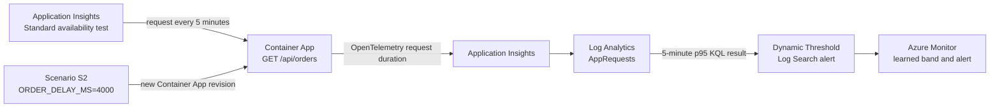

# Azure Monitor Dynamic Threshold Lab Case Design

## Goal

Extend the existing Azure SRE Agent Event Lab with a truthful, runnable
Dynamic Threshold case. The case must let a reader deploy the workload on day
one, accumulate a real baseline in Azure Monitor, and return after the minimum
learning period to validate a latency anomaly.

The case reuses scenario S2 because `/api/orders` request duration is a
continuous signal with a stable baseline and an existing, deterministic fault:
`ORDER_DELAY_MS=4000`.

## Scope

The implementation will:

- keep the existing static S2 alert for immediate, same-day validation;
- add a Log Search alert with a Dynamic Threshold for `/api/orders` p95
  duration;
- deploy the dynamic rule without an Action Group so it starts in shadow mode;
- generate a small, regular request baseline using an Application Insights
  Standard availability test;
- document day-one setup and delayed anomaly validation as separate phases;
- reuse Microsoft's official Dynamic Threshold chart and add one repository-
  specific Mermaid data-flow diagram;
- add automated checks for the infrastructure contract and documentation.

It will not fabricate historical telemetry, promise that an alert can fire on
day one, replace the existing static rules, or automate SRE Agent invocation
from the shadow rule.

## Architecture

The Standard availability test provides bounded, service-managed traffic even
when the operator is not running `loadgen.py`. Application telemetry continues
to land in the existing workspace-backed Application Insights resource. The
dynamic rule evaluates a numeric p95 result from `AppRequests` every five
minutes.

## Components and Changes

### Baseline producer

Add one `Microsoft.Insights/webtests` resource that calls the public
`/api/orders` endpoint every five minutes from one location. One location is
intentional: the test is a baseline producer, not a production availability
monitor, and it minimizes lab traffic and cost.

The test depends on the deployed Container App FQDN and is created only when
the workload is deployed. Its own default availability alert is not part of
this case.

### Dynamic Log Search alert

Add a dedicated Dynamic Threshold scheduled query rule rather than changing
the existing S2 static rule. The query:

- filters `AppRequests` to the lab service and `/api/orders`;
- summarizes p95 `DurationMs` into five-minute bins;
- returns the numeric measure column consumed by the dynamic criterion.

Initial settings:

- evaluation frequency: 5 minutes;
- lookback window: 20 minutes;
- sensitivity: Medium;
- direction: Greater than the learned range;
- failing periods: 2 of 4;
- severity: 3;
- no Action Group.

These values follow the existing extension guidance and keep the rule in
shadow mode while it learns. The operator may attach an Action Group only
after reviewing alert quality.

### Guided validation

The guide has two explicit phases:

1. **Day one:** deploy, confirm the availability test is producing successful
   requests, confirm p95 points exist, and inspect the Dynamic Threshold
   preview. The guide states that no alert is expected yet.
2. **Day three or later:** verify that at least three days and 30 samples exist,
   inject `ORDER_DELAY_MS=4000`, send the existing bounded S2 burst, and inspect
   the learned band, alert state, and recovery after rollback.

Three weeks remains the requirement for weekly seasonality; the three-day
return validates eligibility and a basic learned range, not weekly behavior.

### Visual material

The customer brief and case guide will embed the official Microsoft Learn
Dynamic Threshold chart from:

`https://learn.microsoft.com/azure/azure-monitor/alerts/media/alerts-dynamic-thresholds/threshold-picture-8bit.png`

The case guide will also include the Mermaid diagram above to connect the
official concept to this repository's concrete resources. No custom screenshot
will be presented as an observed result unless it was captured from a real run.

## Data and Control Flow

1. The availability test calls `/api/orders` every five minutes.
2. OpenTelemetry exports request duration to Application Insights.
3. The workspace stores the request as `AppRequests`.
4. The scheduled query produces one p95 value per five-minute bin.
5. Azure Monitor compares evaluated values with its learned range.
6. After learning eligibility is confirmed, scenario S2 creates a new revision
   with a four-second delay.
7. The request p95 moves outside the upper learned bound for the configured
   failing periods.
8. Rolling back the delay restores normal telemetry and allows the alert to
   resolve.

## Failure Handling and Safety

- Infrastructure deployment fails visibly if the web test or dynamic rule is
  unsupported in the selected region or rejected by the Azure API.
- Validation commands distinguish "not enough history" from deployment or
  query failures; they do not treat missing data as success.
- The guide checks the current Container App revision and telemetry freshness
  before injecting the delay.
- The existing scenario cleanup trap remains responsible for restoring
  `ORDER_DELAY_MS=0`.
- The dynamic rule has no Action Group, preventing notifications or automated
  remediation during learning.
- The guide keeps the existing lab expiration and cleanup instructions because
  this case intentionally runs for several days.

## Verification

Automated checks will validate:

- the Bicep files compile with the repository's existing tooling;
- the web test targets `/api/orders`, uses a five-minute frequency, and is
  linked to the existing Application Insights resource;
- the dynamic rule uses `DynamicThresholdCriterion`, a five-minute evaluation
  frequency, the expected p95 query, Medium sensitivity, and 2-of-4 failing
  periods;
- the shadow rule has no Action Group;
- the guide names the three-day/30-sample and three-week constraints and does
  not claim day-one alert evidence;
- all documentation links and referenced local paths resolve.

Manual Azure validation will record day-one telemetry and preview evidence.
An actual Dynamic Threshold alert is only recorded after the delayed phase
succeeds against real Azure history.

## Deliverables

- Bicep resources and outputs for the baseline producer and shadow rule.
- A focused Dynamic Threshold hands-on guide tied to scenario S2.
- README navigation from the customer brief and SRE Agent lab.
- Targeted infrastructure and documentation tests.

