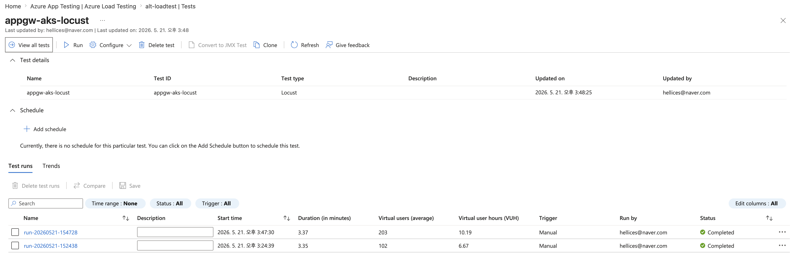
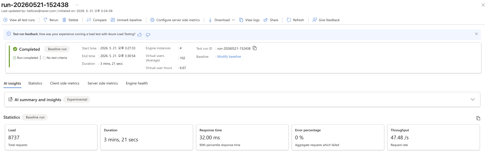
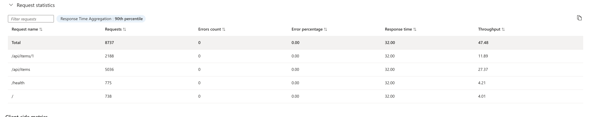
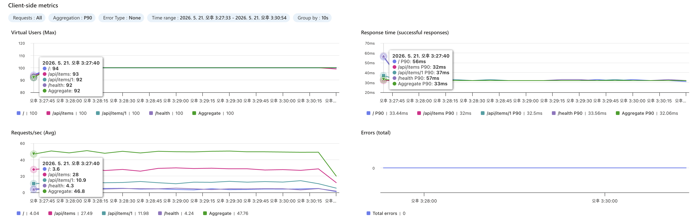
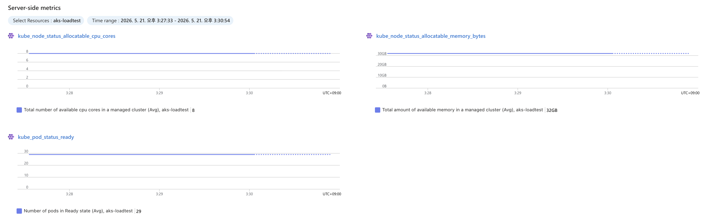
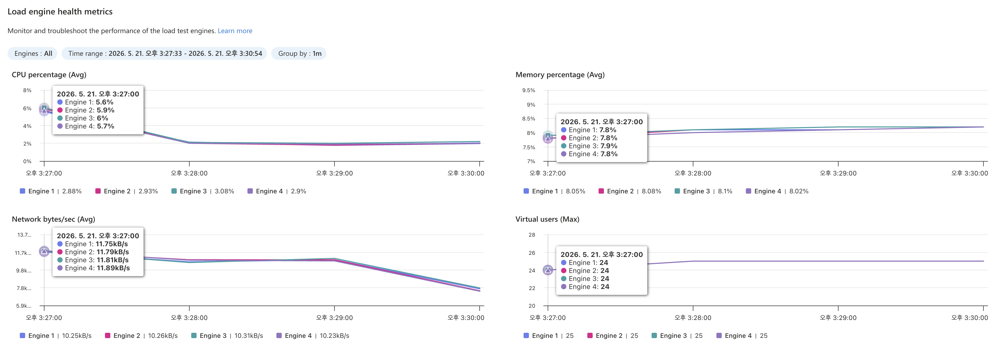
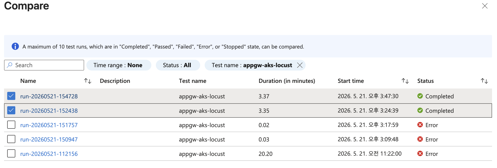
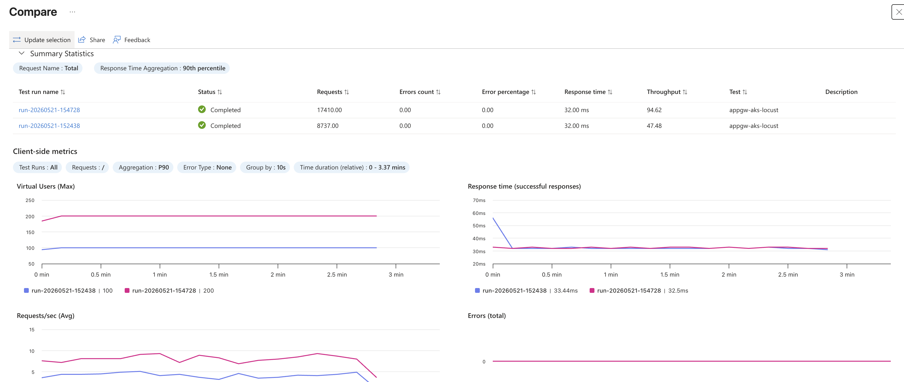

# Korea Central Private 환경의 Locust 부하테스트 구성 가이드

## 📌 문제 상황

Korea Central에 배포된 **Private Application Gateway → AKS** 구조에 대해 Locust 기반 부하테스트를 수행해야 한다.
Azure Load Testing(현 Azure App Testing)은 Korea Central을 지원하지 않아 **Japan East에 별도 구성**이 필요하며, VNet Peering을 통해 Private AppGW에 접근해야 한다.

> ⚠️ **Azure Load Testing은 2026년 기준 Korea Central / Korea South에서 사용 불가**하며, 가장 가까운 지원 리전은 **Japan East**이다.

> 📌 이 가이드는 **AKS + AGIC + Private AppGW가 이미 구성**되어 있다고 가정한다. 테스트 타깃이 없는 경우 [부록 A](#-부록-a-테스트-타깃-구성-aks--agic--backend)를 먼저 수행한다.

## 🔍 구성 개요

```
┌──────────────────────────────┐     VNet Peering     ┌──────────────────────────────────┐
│         Japan East           │ ◄──────────────────► │         Korea Central             │
│                              │    (Azure Backbone)  │                                   │
│  Azure Load Testing          │                      │  VNet-Infra (기존)                │
│   └─ VNet-ALT (10.1.0.0/16) │                      │   ├─ snet-appgw                   │
│      └─ snet-loadtest        │                      │   │   └─ AppGW (Private IP only)  │
│         (10.1.0.0/24)        │                      │   │       10.0.1.10                │
│         Locust Engine ×4     │ ─── HTTP ──────────► │   └─ snet-aks                     │
│                              │                      │       └─ Backend Pods              │
└──────────────────────────────┘                      └──────────────────────────────────┘
```

| 구성 요소 | 리전 | 용도 | 비고 |
|-----------|------|------|------|
| 기존 VNet | koreacentral | AKS + AppGW가 배포된 서비스 VNet | 이미 존재 |
| VNet-ALT | japaneast | 부하테스트 엔진 전용 | 신규 생성 |
| snet-loadtest | japaneast | ALT VNet Injection 서브넷 | 신규 생성 |

## 📋 사전 요구사항

- AKS 클러스터 + AGIC addon + Private Application Gateway가 배포되어 있을 것
- AppGW Private Frontend IP를 통해 Backend에 접근 가능할 것 (예: `10.0.1.10`)

```bash
# Azure CLI extension
az extension add --name load --upgrade

# Provider 등록 (VNet injection에 Microsoft.Batch 필요)
az provider register --namespace Microsoft.LoadTestService
az provider register --namespace Microsoft.Batch
```

## 🚀 구성 절차

### Step 1. 부하테스트용 VNet 생성 (Japan East)

기존 인프라 VNet과 CIDR이 겹치지 않는 VNet을 Japan East에 생성한다.

```bash
RG="<기존-리소스-그룹>"               # 기존 인프라 RG (또는 별도 RG)
INFRA_VNET_NAME="<기존-VNet-이름>"    # 기존 서비스 VNet
TARGET_IP="10.0.1.10"                # AppGW Private Frontend IP

# Japan East - 부하테스트 VNet
az network vnet create -g "$RG" -n vnet-alt \
  --address-prefix 10.1.0.0/16 -l japaneast -o none

az network vnet subnet create -g "$RG" --vnet-name vnet-alt \
  -n snet-loadtest --address-prefix 10.1.0.0/24 -o none
```

> 💡 기존 VNet CIDR과 겹치면 Peering이 실패한다. 기존 VNet이 `10.0.0.0/16`이면 `10.1.0.0/16` 등으로 충돌을 피한다.

### Step 2. VNet Peering 연결

부하테스트 VNet에서 기존 인프라 VNet의 Private IP로 접근하기 위해 양방향 Peering을 구성한다.

```bash
VNET_INFRA_ID=$(az network vnet show -g "$RG" -n "$INFRA_VNET_NAME" --query id -o tsv)
VNET_ALT_ID=$(az network vnet show -g "$RG" -n vnet-alt --query id -o tsv)

az network vnet peering create -g "$RG" -n peer-infra-to-alt \
  --vnet-name "$INFRA_VNET_NAME" --remote-vnet "$VNET_ALT_ID" --allow-vnet-access -o none

az network vnet peering create -g "$RG" -n peer-alt-to-infra \
  --vnet-name vnet-alt --remote-vnet "$VNET_INFRA_ID" --allow-vnet-access -o none
```

Peering 상태 확인:

```bash
az network vnet peering show -g "$RG" -n peer-alt-to-infra \
  --vnet-name vnet-alt --query peeringState -o tsv
# → Connected
```

### Step 3. Azure Load Testing 리소스 + Locust 테스트 생성

```bash
# ALT 리소스 생성
az load create --name alt-loadtest -g "$RG" -l japaneast -o none

# Locust 테스트 생성 (VNet injection)
ALT_SUBNET_ID=$(az network vnet subnet show -g "$RG" \
  --vnet-name vnet-alt -n snet-loadtest --query id -o tsv)

az load test create \
  --load-test-resource alt-loadtest -g "$RG" \
  --test-id appgw-aks-locust \
  --test-type Locust \
  --test-plan locustfile.py \
  --engine-instances 4 \
  --subnet-id "$ALT_SUBNET_ID" \
  -o none

# 추가 파일 업로드
az load test file upload \
  --load-test-resource alt-loadtest -g "$RG" \
  --test-id appgw-aks-locust \
  --path requirements.txt \
  --file-type ADDITIONAL_ARTIFACTS \
  -o none
```

### 샘플 코드 설명

#### locustfile.py

```python
from locust import HttpUser, task, between, tag


class AppGWUser(HttpUser):
    wait_time = between(1, 3)

    @tag("health")
    @task(1)
    def health_check(self):
        with self.client.get("/health", catch_response=True) as resp:
            if resp.status_code == 200:
                resp.success()
            else:
                resp.failure(f"Health check failed: {resp.status_code}")

    @tag("api")
    @task(5)
    def get_items(self):
        self.client.get("/api/items")

    @tag("api")
    @task(3)
    def get_item_by_id(self):
        self.client.get("/api/items/1")

    @tag("api")
    @task(2)
    def create_item(self):
        self.client.post("/api/items", json={"name": "load-test-item", "value": "test"})

    @tag("static")
    @task(1)
    def get_root(self):
        self.client.get("/")
```

#### Task Weight와 호출 비율

`@task(weight)` 데코레이터의 숫자가 각 API의 **상대적 호출 비율**을 결정한다.

| Task | Weight | 기대 비율 | 실제 결과 (200 users) |
|------|--------|----------|----------------------|
| `get_items` (GET /api/items) | 5 | 41.7% | `/api/items`: 57.9% |
| `get_item_by_id` (GET /api/items/1) | 3 | 25.0% | `/api/items/1`: 25.2% |
| `create_item` (POST /api/items) | 2 | 16.7% | ↑ 합산됨 |
| `health_check` (GET /health) | 1 | 8.3% | `/health`: 8.6% |
| `get_root` (GET /) | 1 | 8.3% | `/`: 8.3% |

> 📌 ALT 결과에서 `/api/items`는 GET(weight 5) + POST(weight 2) = weight 7 (58.3%)로 합산된다. Locust가 기본적으로 **URL 경로 기준으로 그룹핑**하기 때문이다.

#### ALT 환경변수 설정

ALT에서 Locust 설정은 `LOCUST_` prefix가 붙은 환경변수로 전달한다.

| 환경변수 | 용도 | 예시 |
|---------|------|------|
| `LOCUST_HOST` | 테스트 타깃 URL | `http://10.0.1.10` |
| `LOCUST_USERS` | 동시 가상 사용자 수 | `200` |
| `LOCUST_SPAWN_RATE` | 초당 사용자 생성 속도 | `20` |
| `LOCUST_RUN_TIME` | 테스트 실행 시간 (초) | `180` |

> ⚠️ `LOCUST_RUN_TIME`은 **초 단위 정수**만 허용된다. `3m` 같은 문자열은 ALT 환경변수 검증에서 거부된다.

#### 테스트 결과 예시 (실측)

| 항목 | 100 Users | 200 Users |
|------|-----------|-----------|
| Total Requests | 8,737 | 17,410 |
| Success Rate | 100% | 100% |
| Avg Latency | 29.9ms | 29.6ms |
| P50 / P90 / P99 | 29 / 32 / 55ms | 29 / 32 / 55ms |
| RPS | ~48.5 | ~96.7 |

> 💡 cross-region latency (~30ms)가 baseline으로 포함된다. 동일 리전에서 측정하면 latency가 크게 줄어든다.

### Step 4. 부하 테스트 실행

```bash
az load test-run create \
  --load-test-resource alt-loadtest -g "$RG" \
  --test-id appgw-aks-locust \
  --test-run-id run-001 \
  --env LOCUST_HOST=http://${TARGET_IP} LOCUST_USERS=200 LOCUST_SPAWN_RATE=20 LOCUST_RUN_TIME=180 \
  --no-wait -o none
```

#### ✅ 실행 상태 확인

```bash
az load test-run show \
  --load-test-resource alt-loadtest -g "$RG" \
  --test-run-id run-001 \
  --query "{status:status, testResult:testResult}" -o table
```

| Status | 설명 |
|--------|------|
| `PROVISIONING` | VNet injection 엔진 프로비저닝 중 (~2분) |
| `EXECUTING` | Locust 테스트 실행 중 |
| `DONE` | 완료 → Portal에서 결과 확인 |

결과는 **Azure Portal → App Testing → alt-loadtest → Test runs**에서 확인한다.

## 📊 Azure App Testing이 제공하는 것

오픈소스 Locust를 직접 실행하면 Python 스크립트 + CLI/Web UI로 테스트하지만, Azure App Testing(ALT)은 **Managed 인프라 위에서 Locust를 실행**하면서 추가 분석 기능을 제공한다.

### 오픈소스 Locust vs Azure App Testing

| 기능 | 오픈소스 Locust | Azure App Testing |
|------|----------------|-------------------|
| 인프라 관리 | 직접 서버 프로비저닝/스케일링 | `engineInstances` 파라미터 하나로 자동 |
| Private 네트워크 접근 | VPN/SSH 터널 직접 구성 | VNet injection 내장 |
| 결과 저장 | CSV 파일, 별도 수집 필요 | Portal에 자동 저장, 이력 관리 |
| 서버 메트릭 상관 분석 | 별도 도구 필요 (Grafana 등) | AKS/App Insights 메트릭 동일 화면에 오버레이 |
| 테스트 비교 | CSV를 직접 파싱해서 비교 | Portal에서 run 선택 → 자동 오버레이 차트 |
| 엔진 모니터링 | 없음 (직접 모니터링) | Engine health 탭 (CPU/Memory/Network) |
| CI/CD 통합 | 스크립트 직접 작성 | `az load test-run create`로 파이프라인 내장 |
| 비용 | 인프라 비용 (VM/K8s) | VUH (Virtual User Hour) 단위 과금 |

### Portal에서 제공하는 분석 탭

테스트 완료 후 Portal에서 5개 탭으로 결과를 분석할 수 있다.

테스트 목록에서 각 run의 상태, VUH, Duration을 확인할 수 있다.



run을 클릭하면 상세 페이지로 이동한다. 상단에 요약 카드(Load, Duration, Response time, Error %, Throughput)가 표시되고, 하단에 5개 분석 탭이 제공된다.



#### 1) Statistics — 엔드포인트별 통계

오픈소스 Locust의 CLI 통계 출력과 유사하지만, **P50/P90/P95/P99 백분위 전환**이 가능하고 결과가 영구 저장된다.

| Request name | Requests | Error % | Response time (P90) | Throughput |
|-------------|----------|---------|--------------------|-----------| 
| Total | 8,737 | 0.00 | 32.00 ms | 47.48 /s |
| `/api/items` | 5,036 | 0.00 | 32.00 ms | 27.37 /s |
| `/api/items/1` | 2,188 | 0.00 | 32.00 ms | 11.89 /s |
| `/health` | 775 | 0.00 | 32.00 ms | 4.21 /s |
| `/` | 738 | 0.00 | 32.00 ms | 4.01 /s |



#### 2) Client-side metrics — 시계열 차트

오픈소스 Locust Web UI의 차트를 대체한다. Locust Web UI는 실시간 조정이 가능하지만 **테스트 종료 후 데이터가 사라진다**. ALT는 완료 후에도 시계열 데이터가 보존된다.

- **Virtual Users (Max)**: 시간대별 동시 사용자 수
- **Response time**: 엔드포인트별 P90 응답 시간 (`/api/items`: 32ms, `/api/items/1`: 32.5ms)
- **Requests/sec (Avg)**: endpoint별 초당 요청 수 (`/api/items`: ~28/s, `/api/items/1`: ~11/s)
- **Errors (total)**: 시간대별 누적 에러 수



#### 3) Server-side metrics — 서버 측 메트릭 통합

> 오픈소스 Locust에는 없는 기능. ALT의 핵심 차별점.

**Configure server side metrics**에서 AKS 리소스를 연결하면, 부하 테스트 시간대의 서버 메트릭이 **같은 화면에 오버레이**된다.

- `kube_node_status_allocatable_cpu_cores`: 노드 가용 CPU (예: 8 cores)
- `kube_node_status_allocatable_memory_bytes`: 노드 가용 메모리 (예: 32GB)
- `kube_pod_status_ready`: Ready 상태 pod 수 (예: 29)

App Insights를 연동하면 dependency call duration, exception rate 등 **애플리케이션 수준 메트릭**도 확인 가능하다. "P99 latency가 올라간 시점에 DB dependency call이 느려졌다"같은 **원인 분석**을 단일 화면에서 수행할 수 있다.



#### 4) Engine health — 테스트 엔진 모니터링

> 오픈소스 Locust에는 없는 기능. 분산 테스트에서 엔진 자체가 병목인지 판별할 때 유용하다.

4개 엔진의 CPU, Memory, Network, Virtual users를 개별 추적한다.

| 메트릭 | 100 Users 실측 | 판단 기준 |
|--------|---------------|----------|
| CPU % (Avg) | ~3% (엔진당) | 80% 초과 시 엔진 병목 → `engineInstances` 증가 |
| Memory % (Avg) | ~8% (엔진당) | 지속 상승 시 메모리 누수 의심 |
| Virtual users (Max) | 25 (엔진당) | 100 users / 4 engines = 25 (균등 분배 확인) |



#### 5) Compare — 테스트 run 비교

> 오픈소스 Locust에는 없는 기능. 회귀 테스트와 용량 산정의 핵심 도구.

서로 다른 test run을 선택하면 **Summary Statistics + 오버레이 차트**가 자동 생성된다.



| Test run | Requests | Response time (P90) | Throughput |
|----------|----------|--------------------|-----------| 
| 100 Users | 8,737 | 32.00 ms | 47.48 /s |
| 200 Users | 17,410 | 32.00 ms | 94.62 /s |

오버레이 차트로 Virtual Users, Response time, RPS, Errors를 시간축 위에 겹쳐 볼 수 있다. 부하를 점진적으로 올리며 비교하면 **latency가 급증하거나 에러가 발생하기 시작하는 지점**이 서비스의 용량 한계가 된다.



### 활용 시나리오

- **용량 산정**: 100 → 200 → 400 users로 올리며 Compare → saturation point 도출
- **회귀 테스트**: 배포 전후 동일 조건 run → Compare로 성능 저하 감지
- **병목 분석**: Client-side latency 상승 시점 + Server-side CPU/Memory 상관 확인
- **SLA 검증**: fail criteria 설정 → P90 > 500ms 또는 error > 1% 시 자동 중단

## 🐞 배포 시 주의사항

| 이슈 | 원인 | 해결 |
|------|------|------|
| `ALTVNET001: Microsoft.Batch registration` | VNet injection에 Batch provider 필요 | `az provider register --namespace Microsoft.Batch` |
| VNet Peering 실패 | ALT VNet CIDR이 기존 VNet CIDR과 겹침 | 기존 VNet CIDR 확인 후 겹치지 않는 대역 사용 |
| 테스트 엔진에서 타깃 접근 불가 | Peering이 `Connected`가 아님 | 양방향 Peering 상태 확인, NSG 규칙 점검 |
| Locust `Connection refused` | TARGET_HOST가 잘못되었거나 AppGW 비정상 | Private IP, AppGW 상태, Backend Health 확인 |

## 💡 대안: AKS에 Locust 직접 배포

Azure Load Testing 대신 **동일 AKS 클러스터에 Locust를 배포**하면 cross-region 제약 없이 테스트할 수 있다.

```
┌─ Korea Central ─────────────────────────┐
│  VNet (10.0.0.0/16)                     │
│   ├─ AppGW (10.0.1.10)                 │
│   └─ AKS                               │
│        ├─ ns: default  → backend pods   │
│        └─ ns: loadtest → locust master  │
│                          + workers ×4   │
└─────────────────────────────────────────┘
```

| 항목 | Azure Load Testing (Japan East) | Locust on AKS (Korea Central) |
|------|--------------------------------|-------------------------------|
| 네트워크 구성 | VNet ×2 + Peering 필수 | 추가 구성 없음 |
| Latency 정확도 | ~30ms baseline 포함 | 정확한 내부 측정 |
| 스케일링 | `engineInstances` 변경만으로 최대 400 | HPA + autoscaler 직접 구성 |
| Locust Web UI | 사용 불가 | 사용 가능 |
| 비용 | vCU-hour 과금 | Node 비용 (Spot 활용 가능) |
| 결과 분석 | Portal 자동 집계 + App Insights 연동 | CSV 또는 별도 수집 |

**AKS 직접 배포를 선택하는 경우:**
- Private 환경에서 정확한 latency 측정이 중요할 때
- Korea Central 단일 리전으로 구성해야 할 때
- Locust Web UI로 실시간 부하 조정이 필요할 때

**Azure Load Testing을 선택하는 경우:**
- CI/CD 파이프라인에서 자동 회귀 부하테스트가 필요할 때
- 여러 팀이 반복적으로 사용하고 결과 트렌드를 비교할 때
- App Insights와 서버 메트릭 상관 분석이 필요할 때

## 🧹 리소스 정리

```bash
# 부하테스트 리소스만 정리 (기존 인프라는 유지)
az load delete --name alt-loadtest -g "$RG" --yes -o none
az network vnet peering delete -g "$RG" -n peer-infra-to-alt --vnet-name "$INFRA_VNET_NAME" -o none
az network vnet peering delete -g "$RG" -n peer-alt-to-infra --vnet-name vnet-alt -o none
az network vnet delete -g "$RG" -n vnet-alt -o none
```

---

## 📦 부록 A: 테스트 타깃 구성 (AKS + AGIC + Backend)

AKS + AGIC + Private AppGW 환경이 없는 경우 아래 절차로 구성한다.

### A-1. 리소스 그룹 + 네트워크

```bash
RG="rg-loadtest-sample"
az group create -n "$RG" -l koreacentral -o none

az network vnet create -g "$RG" -n vnet-infra \
  --address-prefix 10.0.0.0/16 -l koreacentral -o none
az network vnet subnet create -g "$RG" --vnet-name vnet-infra \
  -n snet-appgw --address-prefix 10.0.1.0/24 -o none
az network vnet subnet create -g "$RG" --vnet-name vnet-infra \
  -n snet-aks --address-prefix 10.0.4.0/22 -o none
```

> 💡 `/22` 서브넷은 4의 배수 주소에서 시작해야 한다. `10.0.2.0/22`는 **CIDR 규칙 위반**이므로 `10.0.4.0/22`를 사용한다.

### A-2. AKS + AGIC 생성

```bash
AKS_SUBNET_ID=$(az network vnet subnet show -g "$RG" --vnet-name vnet-infra -n snet-aks --query id -o tsv)
APPGW_SUBNET_ID=$(az network vnet subnet show -g "$RG" --vnet-name vnet-infra -n snet-appgw --query id -o tsv)

az aks create -g "$RG" -n aks-loadtest -l koreacentral \
  --node-count 2 \
  --node-vm-size standard_b4ms \
  --network-plugin azure \
  --vnet-subnet-id "$AKS_SUBNET_ID" \
  --service-cidr 172.16.0.0/16 \
  --dns-service-ip 172.16.0.10 \
  --enable-managed-identity \
  --enable-addons ingress-appgw \
  --appgw-name appgw-loadtest \
  --appgw-subnet-id "$APPGW_SUBNET_ID" \
  --generate-ssh-keys \
  -o none
```

> ⚠️ `--service-cidr`를 명시하지 않으면 기본값 `10.0.0.0/16`이 VNet CIDR과 충돌한다.

### A-3. AGIC 권한 부여

AGIC identity에 VNet `Network Contributor` 역할을 부여해야 AppGW가 정상 생성된다.

```bash
VNET_INFRA_ID=$(az network vnet show -g "$RG" -n vnet-infra --query id -o tsv)
AGIC_OBJ_ID=$(az aks show -g "$RG" -n aks-loadtest \
  --query "addonProfiles.ingressApplicationGateway.identity.objectId" -o tsv)

az role assignment create \
  --assignee-object-id "$AGIC_OBJ_ID" \
  --assignee-principal-type ServicePrincipal \
  --role "Network Contributor" \
  --scope "$VNET_INFRA_ID" \
  -o none

# 권한 반영을 위해 AGIC pod 재시작
kubectl delete pod -n kube-system -l app=ingress-appgw
```

### A-4. AppGW Private Frontend IP 구성

AGIC가 AppGW를 생성한 후 (5~10분 소요) private frontend IP를 추가한다.

```bash
NODE_RG=$(az aks show -g "$RG" -n aks-loadtest --query nodeResourceGroup -o tsv)

# AppGW Succeeded 상태 대기
while true; do
  state=$(az network application-gateway show -g "$NODE_RG" -n appgw-loadtest \
    --query provisioningState -o tsv 2>/dev/null || echo "NotFound")
  [[ "$state" == "Succeeded" ]] && break
  echo "AppGW: $state (waiting...)"
  sleep 10
done

# Private frontend IP 추가
az network application-gateway frontend-ip create \
  -g "$NODE_RG" \
  --gateway-name appgw-loadtest \
  --name appGwPrivateFrontendIp \
  --private-ip-address 10.0.1.10 \
  --subnet "$APPGW_SUBNET_ID" \
  -o none
```

### A-5. Backend App 배포

```bash
az aks get-credentials -g "$RG" -n aks-loadtest --overwrite-existing
kubectl apply -f loadtest/k8s/deployment.yaml
kubectl rollout status deployment/backend-app --timeout=120s
```

Ingress에 private IP가 할당되었는지 확인:

```bash
$ kubectl get ingress backend-app-ingress
NAME                  CLASS    HOSTS   ADDRESS     PORTS   AGE
backend-app-ingress   <none>   *       10.0.1.10   80      16s
```

> 📌 Ingress annotation `appgw.ingress.kubernetes.io/use-private-ip: "true"`가 설정되어 있어야 AGIC가 private frontend IP를 사용한다.

### 부록 A 트러블슈팅

| 이슈 | 원인 | 해결 |
|------|------|------|
| `InvalidCIDRNotation` | `/22` 서브넷이 4의 배수가 아닌 주소에서 시작 | `10.0.4.0/22` 사용 |
| `ServiceCidrOverlapExistingSubnetsCidr` | AKS 기본 service CIDR이 VNet CIDR과 동일 | `--service-cidr 172.16.0.0/16` 명시 |
| `ApplicationGatewayInsufficientPermissionOnSubnet` | AGIC identity에 서브넷 join 권한 없음 | VNet에 `Network Contributor` 부여 |
| AppGW 404 Not Found | AGIC가 ARM으로 AppGW를 비동기 생성 | 권한 부여 → pod 재시작 → 5~10분 대기 |
| Ingress ADDRESS 비어 있음 | Private frontend IP 추가 전 상태 | Private IP 추가 후 Ingress 재생성 |

부록 A 완료 후 본문 [Step 1](#step-1-부하테스트용-vnet-생성-japan-east)부터 진행한다.

---

## 📎 참고 자료

- [Quickstart: Locust 스크립트로 부하 테스트 생성 및 실행](https://learn.microsoft.com/azure/app-testing/load-testing/quickstart-create-run-load-test-with-locust)
- [Private 엔드포인트 테스트 (VNet injection)](https://learn.microsoft.com/azure/app-testing/load-testing/how-to-test-private-endpoint)
- [환경변수로 부하 테스트 매개변수화](https://learn.microsoft.com/azure/app-testing/load-testing/how-to-parameterize-load-tests)
- [대규모 부하 구성](https://learn.microsoft.com/azure/app-testing/load-testing/how-to-high-scale-load)
- [서버 측 메트릭 모니터링](https://learn.microsoft.com/azure/app-testing/load-testing/how-to-monitor-server-side-metrics)
- [AGIC Private IP 구성](https://learn.microsoft.com/azure/application-gateway/ingress-controller-private-ip)
- [AKS + AGIC addon](https://learn.microsoft.com/azure/application-gateway/ingress-controller-overview)
- [VNet Peering](https://learn.microsoft.com/azure/virtual-network/virtual-network-peering-overview)
