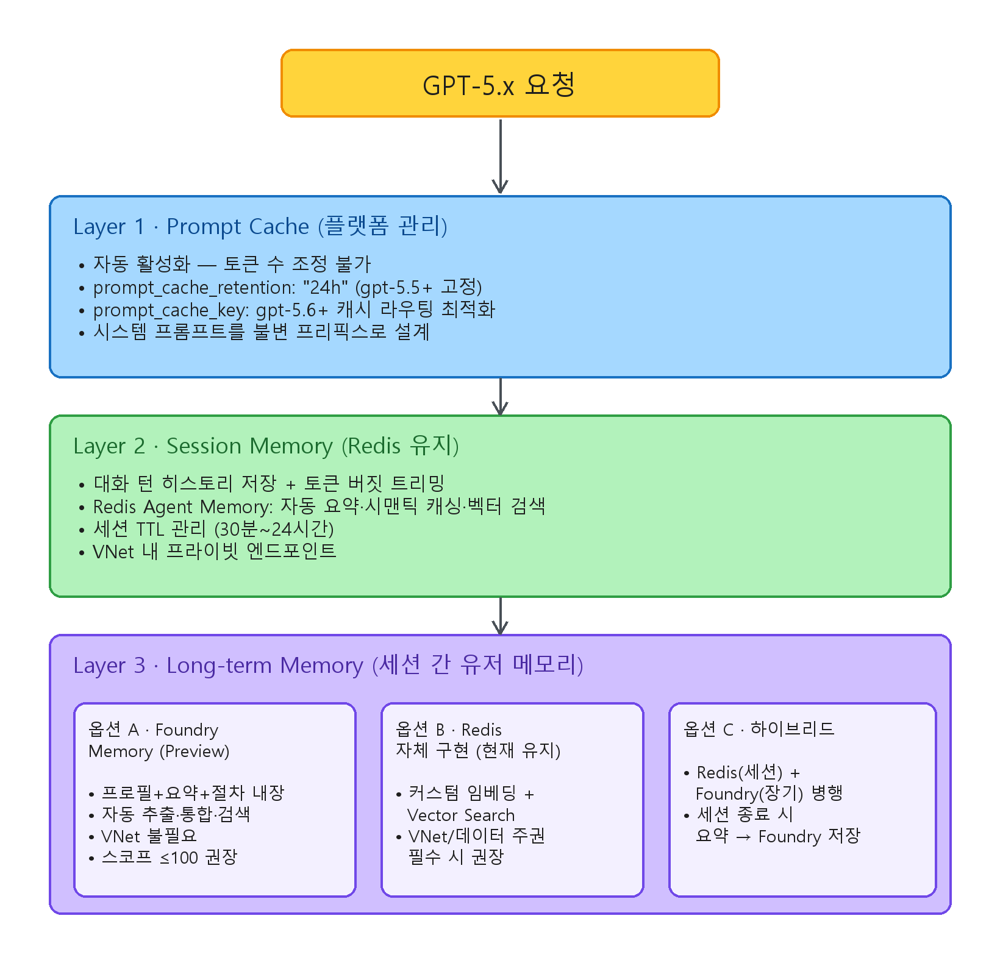

# Azure Foundry GPT-5.x 메모리 레이어 아키텍처 가이드

> 공식 Microsoft Learn 문서 기반 검증 완료. 2026년 7월 22일 기준.

---

## 메모리 레이어 전체 구조

GPT-5.x 모델을 Azure Foundry에서 운영할 때, 메모리는 세 계층으로 나뉩니다.

| 레이어 | 범위 | 지속성 | 관리 주체 |
|--------|------|--------|-----------|
| **① Prompt Cache (컨텍스트 메모리)** | 요청 간 프롬프트 프리픽스 KV 텐서 | in_memory: 5~10분 / 24h: 최대 24시간 | Azure 플랫폼 (자동, opt-out 불가) |
| **② Session Memory (대화 상태)** | 단일 세션 내 턴 히스토리 | 세션 수명 (개발자가 TTL 관리) | 개발자 (Redis 등 외부 저장소) |
| **③ Long-term Memory (유저 메모리)** | 세션 간 사용자 프로필·요약·절차 | default_ttl_seconds 설정 (0 = 무제한) | Foundry Memory Service 또는 자체 구현 |

---

## ① Prompt Cache (컨텍스트 메모리)

### 동작 원리

Prompt Caching은 동일한 프롬프트 프리픽스의 KV 텐서를 GPU 메모리(또는 GPU-local 스토리지)에 유지하여, 반복 요청 시 재연산을 생략합니다. **모든 지원 모델에서 기본 활성화, opt-out 불가능**합니다.

요청이 들어오면 프롬프트 프리픽스(일반적으로 처음 256 토큰)의 해시 기반으로 라우팅하고, 캐시된 KV 텐서와 일치하면 cache hit가 발생합니다.

### 캐시 조건 (공식 문서 기준)

- **최소 프롬프트 길이**: 1,024 토큰 이상
- **프리픽스 일치**: 처음 1,024 토큰이 바이트 단위로 완전 동일해야 cache hit
- **추가 캐시 단위**: 1,024 토큰 이후 **128 토큰 단위**로 캐시 적중
- **1글자라도 변경** 시 cache miss (`cached_tokens: 0`)

### 캐시 토큰 수 직접 조정 — 불가

**캐시되는 토큰 수를 사용자가 직접 지정하거나 제한할 수 없습니다.** 캐시 범위는 프롬프트 프리픽스 일치 길이에 의해 자동 결정됩니다. 다만 아래 두 파라미터로 **캐시 동작을 간접 제어**할 수 있습니다.

### 제어 가능한 파라미터

#### `prompt_cache_retention` — 캐시 유지 시간

| 모델 | 허용 값 | 기본값 | 비고 |
|------|---------|--------|------|
| gpt-5.4 이하 (gpt-5.4, 5.3-codex, 5.2, 5.1 계열, 5, 5-codex, 4.1) | `"in_memory"`, `"24h"` | `"in_memory"` | 비 ZDR 조직은 2026.05.29부터 기본값 `"24h"`로 변경됨 |
| gpt-5.5 이상 | `"24h"` 만 허용 | `"24h"` | `"in_memory"` 미지원. ZDR 조직 포함 전체 적용 |

- **in_memory**: 비활성 5~10분 후 클리어. 최대 1시간 내 항상 제거. Azure 구독 간 공유 안 됨.
- **24h**: GPU-local 스토리지로 KV 텐서를 오프로드하여 최대 24시간 유지. 원본 프롬프트 텍스트는 디스크에 절대 저장되지 않음.

```json
{
  "model": "gpt-5.4",
  "messages": [...],
  "prompt_cache_retention": "24h"
}
```

#### `prompt_cache_key` — 캐시 라우팅 키 (gpt-5.6+ 전용)

프리픽스 해시와 결합되는 stable key. 동일 시스템 프롬프트를 공유하는 고빈도 워크로드에서 캐시 적중률을 높입니다.

- 동일 프리픽스 + 키 조합이 **~15 req/min 초과** 시 일부 요청이 cache miss 발생 가능
- 고빈도 시 **여러 키로 분산**하되, 키-프리픽스 매핑을 안정적으로 유지
- API 버전 제약 없음 (v1 API에서 동작)

```json
{
  "model": "gpt-5.6-sol",
  "messages": [...],
  "prompt_cache_key": "support-agent-system-v2",
  "prompt_cache_retention": "24h"
}
```

### 캐시 적중 확인

응답의 `usage.prompt_tokens_details.cached_tokens` 필드로 확인합니다.

```json
{
  "usage": {
    "prompt_tokens": 15000,
    "completion_tokens": 1518,
    "total_tokens": 16518,
    "completion_tokens_details": {
      "reasoning_tokens": 576
    },
    "prompt_tokens_details": {
      "cached_tokens": 12800
    }
  }
}
```

### 캐시 대상 콘텐츠 유형

| 유형 | 세부 |
|------|------|
| Messages | system, developer, user, assistant 메시지 전체 |
| Images | URL 링크 또는 base64 인코딩. `detail` 파라미터도 동일해야 함 |
| Tool definitions | messages 배열 + 도구 정의 |
| Structured outputs | 스키마가 시스템 메시지 프리픽스에 추가됨 |

### 비용 구조

| 모델 | 캐시 쓰기 (Cache Write) | 캐시 읽기 (Cache Read) |
|------|------------------------|----------------------|
| gpt-5.5 이하 | 추가 과금 없음 (입력 토큰 가격에 포함) | 할인된 입력 토큰 가격 |
| gpt-5.6 이상 | **별도 과금** (비캐시 입력 토큰의 약 1.25배) | 할인된 입력 토큰 가격 |
| Provisioned 배포 | gpt-5.6+는 별도 과금 | 최대 100% 할인 |

**참고**: gpt-5.6의 Usage 응답에 `cache_write_tokens` 필드가 누락되는 이슈가 보고됨 (Microsoft 확인 중). 실제 과금은 적용됨.

**주요 모델 참고 가격** (Global Standard, 서드파티 소스 기준 — 공식 가격은 Azure 포탈 확인 필요):

| 모델 | Input / 1M | Cached Input / 1M | Output / 1M |
|------|-----------|-------------------|-------------|
| gpt-5.5 | $5.00 | $0.50 | $30.00 |
| gpt-5.4 | $2.50~$5.00 | $0.50 | $15.00~$30.00 |
| gpt-5.2 | $1.75 | $0.17 | — |
| gpt-5.1 | $1.25 | $0.13 | $10.00 |
| gpt-5-nano | $0.05 | $0.005 | $0.40 |
| gpt-5.6 | **가격 미확정** (현재 $0.01/1M 표시 — 청구 오류 가능성, MS 조사 중) | — | — |

### 캐시 최적화 전략

1. **시스템 프롬프트·few-shot 예시를 프롬프트 앞부분에 고정** — 가변 콘텐츠(사용자 입력, 타임스탬프 등)는 뒤에 배치
2. **프리픽스 바이트 일관성 유지** — 공백, 줄바꿈, 이스케이프 문자까지 동일하게 유지
3. **`prompt_cache_key` 분산** (gpt-5.6+) — 동일 키로 ~15 req/min 초과 시 키를 분할하되 프리픽스-키 매핑은 안정적으로 유지
4. **데이터 레지던시 확인** — in_memory는 모든 리전 호환. 24h 확장 캐시는 Data Zone/Regional 배포 경계 내 유지

### ⚠️ 알려진 이슈 (2026년 7월 22일 기준)

| 이슈 | 상태 | 영향 | 워크어라운드 |
|------|------|------|-------------|
| **gpt-5.6 + Responses API 캐싱 미작동** | Microsoft 수정 중 (7/10 확인, "late next week" 예고) | `cached_tokens: 0` 반환. Chat Completions API (~95% 히트율)는 정상 | Chat Completions API 사용 |
| **gpt-5.6 `cache_write_tokens` 필드 누락** | API 버전 이슈 가능성, MS 조사 중 | Usage 응답에 cache write 토큰 수 미표시 (과금은 적용) | 최신 API 버전 사용 확인 |
| **Explicit Caching 미지원** | Azure 미지원 (지원 일정 미정) | `prompt_cache_options`, `prompt_cache_breakpoint` 파라미터 수락하나 동작 안 함 | Implicit caching만 사용 |
| **gpt-5.6 가격 불확실** | 미터 ID가 Retail Prices API에 미등록 | 모든 토큰 카테고리 $0.01/1M 표시 (의도적 여부 불명) | Azure Billing 지원 티켓 오픈 |

---

## ② Session Memory (세션 유저 메모리) — Redis 아키텍처

### 현재 아키텍처 (Redis 기반)

Redis를 사용하여 세션 내 대화 히스토리를 직접 관리하는 패턴입니다. Foundry 플랫폼은 세션 메모리를 자체 관리하지 않으므로, 이 계층은 개발자 책임입니다.

```
┌─────────────┐     ┌──────────────────┐     ┌──────────────────┐
│   Client     │────▶│   App Server      │────▶│  Azure OpenAI    │
│              │     │  (오케스트레이션)   │     │  GPT-5.x         │
└─────────────┘     └────────┬─────────┘     └──────────────────┘
                             │
                    ┌────────▼────────┐
                    │  Azure Managed   │
                    │  Redis           │
                    │                  │
                    │  • 대화 턴 히스토리 │
                    │  • 세션 메타데이터  │
                    │  • 시맨틱 캐시     │
                    │  • 벡터 인덱스     │
                    └─────────────────┘
```

### Redis에서 관리해야 하는 것

- **대화 턴 히스토리**: messages 배열 전체 또는 요약본 (JSON 직렬화)
- **세션 메타데이터**: 세션 ID, 사용자 ID, 생성/마지막활동 시간, 현재 토큰 사용량
- **토큰 버짓 관리**: 컨텍스트 윈도우 초과 방지를 위한 메시지 트리밍·요약 로직

### GPT-5.x 모델별 컨텍스트 윈도우 (공식 문서 검증)

| 모델 | 총 컨텍스트 | 입력 한도 | 출력 한도 | 릴리즈일 |
|------|------------|-----------|-----------|----------|
| gpt-5.6-sol / terra / luna | 1,050,000 | 922,000 | 128,000 | 2026-07-09 |
| gpt-5.5 | 1,050,000 | 922,000 | 128,000 | 2026-04-24 |
| gpt-5.4 | 1,050,000 | 922,000 | 128,000 | 2026-03-05 |
| gpt-5.4-pro | 1,050,000 | 922,000 | 128,000 | 2026-03-05 |
| gpt-5.4-mini | 400,000 | 272,000 | 128,000 | 2026-03-17 |
| gpt-5.4-nano | 400,000 | 272,000 | 128,000 | 2026-03-17 |
| gpt-5.3-codex | 400,000 | 272,000 | 128,000 | 2026-02-24 |
| gpt-5.3-chat (Preview) | 128,000 | 111,616 | 16,384 | 2026-03-03 |
| gpt-5.2 | 400,000 | 272,000 | 128,000 | 2025-12-11 |
| gpt-5.2-chat (Preview) | 128,000 | 111,616 | 16,384 | 2025-12-11 |
| gpt-5.1 | 400,000 | 272,000 | 128,000 | 2025-11-13 |
| gpt-5.1-chat (Preview) | 128,000 | 111,616 | 16,384 | 2025-11-13 |
| gpt-5.1-codex / codex-mini | 400,000 | 272,000 | 128,000 | 2025-11-13 |
| gpt-5.1-codex-max | 400,000 | 272,000 | 128,000 | 2025-12-04 |
| gpt-5 | 400,000 | 272,000 | 128,000 | 2025-08-07 |
| gpt-5-mini | 400,000 | 272,000 | 128,000 | 2025-08-07 |
| gpt-5-nano | 400,000 | 272,000 | 128,000 | 2025-08-07 |
| gpt-5-chat (Preview) | 128,000 | 111,616 | 16,384 | 2025-08-07 |

### 토큰 버짓 관리 패턴

```python
import tiktoken

# 모델별 입력 한도 매핑
MODEL_INPUT_LIMITS = {
    "gpt-5.6-sol":   922_000,
    "gpt-5.6-terra": 922_000,
    "gpt-5.6-luna":  922_000,
    "gpt-5.5":       922_000,
    "gpt-5.4":       922_000,
    "gpt-5.4-mini":  272_000,
    "gpt-5.4-nano":  272_000,
    "gpt-5.3-codex": 272_000,
    "gpt-5.3-chat":  111_616,
    "gpt-5.2":       272_000,
    "gpt-5.1":       272_000,
    "gpt-5":         272_000,
}

def trim_history(
    messages: list,
    model: str = "gpt-5.6-sol",
    system_prompt_tokens: int = 2_000,
    response_buffer: int = 16_000,
) -> list:
    """최신 메시지 우선으로 토큰 버짓 내에서 히스토리 트리밍"""
    max_input = MODEL_INPUT_LIMITS.get(model, 272_000)
    available = max_input - system_prompt_tokens - response_buffer

    enc = tiktoken.encoding_for_model(model)
    trimmed = []
    total = 0
    for msg in reversed(messages):
        tokens = len(enc.encode(msg["content"]))
        if total + tokens > available:
            break
        trimmed.insert(0, msg)
        total += tokens
    return trimmed
```

### Redis Agent Memory (Build 2026 발표 — Azure Managed Redis)

Build 2026에서 Redis는 Azure Managed Redis에 **Agentic Memory** 기능을 발표했습니다. 기존 Redis 세션 캐시를 확장하여 에이전트 워크로드에 특화된 기능을 제공합니다.

| 기능 | 설명 |
|------|------|
| **Working Memory** | 세션 범위 라이브 메시지 저장. 자동 요약·트리밍 |
| **Long-term Memory** | 대화에서 추출된 사실·선호도를 벡터 임베딩으로 장기 저장 |
| **Semantic Caching (LangCache)** | 유사 프롬프트에 대해 이전 응답 재사용. 토큰 비용 절감 |
| **Contextual Grounding** | 대명사/참조 해소 ("그것" → 실제 엔티티) |
| **Deduplication** | 콘텐츠 해싱 기반 중복 메모리 방지 |
| **Memory Promotion** | 고신호 사실을 Working → Long-term으로 자동 승격 |

**통합 인터페이스**: REST API, MCP Server, Python client library
**프레임워크 연동**: Microsoft Agent Framework, Semantic Kernel과 네이티브 통합

### Redis 운영 고려사항

1. **TTL 설정**: 세션 비활성 시 자동 만료 (일반적으로 30분~24시간)
2. **Semantic Caching**: 유사 쿼리 캐시로 반복 토큰 비용 절감 — 단, 잘못된 재사용 방지를 위해 유사도 임계값 튜닝 필요
3. **Vector Search**: Redis Vector Search로 관련 대화 시맨틱 검색
4. **메모리 압력**: `maxmemory-policy` 설정 (에이전트 워크로드에서 `allkeys-lru` 또는 `volatile-lru` 권장)
5. **VNet/Private Endpoint**: Azure Managed Redis는 VNet 통합 완전 지원

---

## ③ Foundry Memory Service (장기 유저 메모리)

### 개요

Azure AI Foundry Agent Service에 내장된 **매니지드 장기 메모리 서비스**입니다. Redis 기반 자체 구현의 장기 메모리 부분을 대체할 수 있습니다.

**상태**: Public Preview (2026.06.02 최신 프리뷰)
**API 버전**: `2025-11-15-preview`
**SDK**: `azure-ai-projects >= 2.0.0`

### 메모리 유형 3가지 (모두 기본 활성화)

| 유형 | 설명 | 검색 타이밍 |
|------|------|------------|
| **User Profile Memory** | 사용자 선호·설정·접근성 등 지속 컨텍스트 | 대화 시작 시 정적 주입 (items 파라미터 없이 search) |
| **Chat Summary Memory** | 이전 대화 주제·맥락의 증류 요약 | 턴마다 현재 메시지 기반 시맨틱 검색 |
| **Procedural Memory** (Latest Preview) | 반복 워크플로·실행 패턴 학습. 에이전트 trajectory에서 성공 패턴 추출 | 유사 작업 요청 시 검색 |

### 메모리 처리 파이프라인

```
대화 → [Extraction] → [Consolidation] → [Storage]
                                              ↓
                          검색 요청 → [Retrieval] → 에이전트 컨텍스트 주입
```

1. **Extraction**: LLM이 대화에서 선호도·사실·컨텍스트를 자동 추출
2. **Consolidation**: 중복/겹치는 토픽을 병합하고, 충돌 정보를 해소
3. **Retrieval**: 하이브리드 검색(시맨틱 + 메타데이터)으로 관련 메모리 반환

### Memory Store 생성

```python
from azure.ai.projects import AIProjectClient
from azure.ai.projects.models import (
    MemoryStoreDefaultDefinition,
    MemoryStoreDefaultOptions,
)
from azure.identity import DefaultAzureCredential

client = AIProjectClient(
    endpoint=os.environ["FOUNDRY_PROJECT_ENDPOINT"],
    # 형식: https://{ai-services-account}.services.ai.azure.com/api/projects/{project-name}
    credential=DefaultAzureCredential(),
)

options = MemoryStoreDefaultOptions(
    chat_summary_enabled=True,
    user_profile_enabled=True,
    procedural_memory_enabled=True,        # Latest preview에서 추가
    default_ttl_seconds=30 * 24 * 60 * 60, # 30일. 0 = 무제한
    user_profile_details="민감 정보(나이, 재무정보, 위치, 인증정보) 수집 금지",
)

definition = MemoryStoreDefaultDefinition(
    chat_model="gpt-5.4",                  # Chat 모델 배포명
    embedding_model="text-embedding-3-small", # 임베딩 모델 배포명
    options=options,
)

memory_store = client.beta.memory_stores.create(
    name="production_memory",
    definition=definition,
    description="Production user memory with 30-day TTL",
)
```

### 에이전트에 메모리 연결

```python
from azure.ai.projects.models import MemorySearchPreviewTool, PromptAgentDefinition

tool = MemorySearchPreviewTool(
    memory_store_name="production_memory",
    scope="{{$userId}}",   # 런타임 자동 해석:
                            #   1순위: x-memory-user-id 헤더 값
                            #   2순위: Entra 토큰의 {tid}_{oid}
    update_delay=1,         # 비활성 1초 후 메모리 업데이트 (기본 300초)
)

agent = client.agents.create_version(
    agent_name="SupportAgent",
    definition=PromptAgentDefinition(
        model="gpt-5.4",
        instructions="이전 대화 맥락을 활용하여 응답하세요.",
        tools=[tool],
    ),
)
```

### 메모리 검색 API

```python
from azure.ai.projects.models import MemorySearchOptions

# 정적 메모리 (User Profile) 검색 — items 없이 호출
static = client.beta.memory_stores.search_memories(
    name="production_memory",
    scope="user_123",
)

# 컨텍스트 메모리 (시맨틱 검색) — 최신 메시지 기반
contextual = client.beta.memory_stores.search_memories(
    name="production_memory",
    scope="user_123",
    items=[{"role": "user", "content": "이전 주문 내역 알려줘", "type": "message"}],
    options=MemorySearchOptions(max_memories=5),
)
```

### 메모리 CRUD (Latest Preview)

```python
# 생성
created = client.beta.memory_stores.create_memory(
    name="production_memory",
    scope="user_123",
    content="사용자는 한국어 응답을 선호함",
    kind="user_profile",  # user_profile | chat_summary | procedural
)

# 조회
item = client.beta.memory_stores.get_memory(
    name="production_memory",
    memory_id=created.memory_id,
)

# 수정
updated = client.beta.memory_stores.update_memory(
    name="production_memory",
    memory_id=created.memory_id,
    content="사용자는 한국어 응답 + 기술 용어 영문 표기를 선호함",
)

# 목록
memories = client.beta.memory_stores.list_memories(
    name="production_memory",
    scope="user_123",
)

# 삭제
client.beta.memory_stores.delete_memory(
    name="production_memory",
    memory_id=created.memory_id,
)
```

**참고**: Latest Preview에서 API 경로가 `/items` → `/memories`로 변경됨.

### 직접 Remember/Forget 명령

사용자가 "이것 기억해" / "이것 잊어"라고 하면 즉시 반영됩니다. 응답의 output에 `memory_command_call` 항목으로 결과가 반환됩니다.

```python
response = openai_client.responses.create(
    input="내 선호 좌석은 통로측이라는 걸 기억해",
    conversation=conversation.id,
    extra_body={"agent_reference": {"name": agent.name, "type": "agent_reference"}},
)

for item in response.output:
    if getattr(item, "type", None) == "memory_command_call":
        print(item.arguments)  # {"action": "remember", "content": "선호 좌석: 통로측"}
        print(item.status)     # "completed"
```

**주의**: Direct memory command도 스토어의 TTL 설정에 종속됩니다.

### REST API 엔드포인트

```
POST /memory_stores?api-version=2025-11-15-preview                          # 스토어 생성
GET  /memory_stores?api-version=2025-11-15-preview                          # 스토어 목록
POST /memory_stores/{name}:update_memories?api-version=2025-11-15-preview   # 메모리 업데이트
POST /memory_stores/{name}:search_memories?api-version=2025-11-15-preview   # 메모리 검색
POST /memory_stores/{name}/memories?api-version=2025-11-15-preview          # 메모리 항목 생성
GET  /memory_stores/{name}/memories/{id}?api-version=2025-11-15-preview     # 메모리 항목 조회
POST /memory_stores/{name}/memories/{id}?api-version=2025-11-15-preview     # 메모리 항목 수정
DELETE /memory_stores/{name}/memories/{id}?api-version=2025-11-15-preview   # 메모리 항목 삭제
POST /memory_stores/{name}:delete_scope?api-version=2025-11-15-preview      # 스코프 전체 삭제
DELETE /memory_stores/{name}?api-version=2025-11-15-preview                  # 스토어 삭제
```

### 제약 사항

| 항목 | 한도 |
|------|------|
| 메모리 스토어당 최대 스코프 | 100 |
| 스코프당 최대 메모리 항목 | 10,000 |
| 메모리 검색 요청 | 1,000 req/min |
| 메모리 업데이트 요청 | 1,000 req/min |
| VNet 통합 | **미지원** |
| update_delay 기본값 | 300초 (5분). 0으로 설정 시 즉시 처리 |

### 지원 리전 (19개)

Australia East, Brazil South, Canada East, East US 2, France Central, Italy North, Japan East, Korea Central, North Central US, Norway East, South Africa North, South India, Sweden Central, Switzerland North, UAE North, UK South, West US, West US 2, West US 3

### 보안 요구사항

- Azure AI Content Safety + Prompt Injection Detection 필수 구성
- 정기적 공격/적대적 테스트 수행
- 메모리 삭제 감사 로그 유지 (컴플라이언스)

---

## Redis vs Foundry Memory Service 비교

| 기준 | Redis (자체 구현) | Foundry Memory Service |
|------|-------------------|----------------------|
| **세션 메모리** | ✅ 직접 제어 (TTL, 구조, 트리밍) | 세션 메모리 자체는 미제공 (장기 메모리 전용) |
| **장기 유저 메모리** | 직접 구현 필요 (벡터 임베딩 + 검색) | ✅ 내장 (프로필·요약·절차 3종) |
| **메모리 추출/통합** | LLM 파이프라인 직접 구축 | ✅ 자동 (Extraction → Consolidation → Retrieval) |
| **시맨틱 캐싱** | ✅ LangCache (Build 2026) | ❌ 별도 구성 필요 |
| **벡터 검색** | ✅ Redis Vector Search | ✅ 하이브리드 검색 내장 |
| **운영 부담** | 높음 (인프라 + 파이프라인 관리) | 낮음 (매니지드) |
| **VNet/프라이빗 엔드포인트** | ✅ 완전 지원 | ❌ 미지원 |
| **데이터 주권 제어** | ✅ 완전 제어 | 제한적 (19개 리전) |
| **성숙도** | GA | Public Preview |
| **스케일 한도** | 사실상 무제한 | 스코프 100, 항목 10K/스코프 |
| **비용 모델** | Redis 인스턴스 비용 (고정) | Chat + Embedding 모델 토큰 비용 (사용량 비례) |
| **멀티모달 메모리** | 직접 구현 | ✅ 이미지 이해·보존 지원 (Build 2026 발표) |

---

## 권장 아키텍처: 하이브리드 접근

현재 Redis 기반 세션 메모리를 운영 중이라면, 세 계층을 분리하되 각각의 강점을 활용하는 하이브리드 아키텍처를 권장합니다.



<!-- editable source: hybrid-architecture.excalidraw (https://excalidraw.com 에서 열어 편집) -->

### 전환/마이그레이션 체크리스트

- [ ] **Foundry Memory Service GA 여부** 확인 (현재 Public Preview — 프로덕션 주의)
- [ ] **VNet 요구사항** — 필수라면 Redis 유지. Foundry Memory는 VNet 미지원
- [ ] **스케일 한도** — 스코프 100 / 항목 10K/스코프가 워크로드에 충분한지 검증
- [ ] **prompt_cache_retention** — `"24h"` 설정으로 캐시 비용 절감 확인 (gpt-5.5+는 기본 24h)
- [ ] **gpt-5.6 Responses API** — 캐싱 버그 해결 전까지 Chat Completions API 사용
- [ ] **gpt-5.6 가격** — Azure Billing 지원 티켓으로 정확한 가격 확인 후 비용 계획
- [ ] **API 버전** — Memory Store는 `2025-11-15-preview`, SDK는 `azure-ai-projects >= 2.0.0`
- [ ] **보안** — Content Safety + Prompt Injection Detection 구성 후 메모리 서비스 활성화

---

## 참조 링크

- [Prompt caching — Microsoft Foundry](https://learn.microsoft.com/en-us/azure/foundry/openai/how-to/prompt-caching)
- [Foundry Models sold by Azure](https://learn.microsoft.com/en-us/azure/foundry/foundry-models/concepts/models-sold-directly-by-azure)
- [Memory in Foundry Agent Service](https://learn.microsoft.com/en-us/azure/foundry/agents/concepts/what-is-memory)
- [Create and use memory](https://learn.microsoft.com/en-us/azure/foundry/agents/how-to/memory-usage)
- [Foundry Memory Build 2026 발표](https://devblogs.microsoft.com/foundry/memory-build2026/)
- [Azure OpenAI Quotas and Limits](https://learn.microsoft.com/en-us/azure/foundry/openai/quotas-limits)
- [Redis Agent Memory](https://redis.io/agent-memory/)

---

*마지막 업데이트: 2026년 7월 22일 — 공식 문서 검증 완료*
