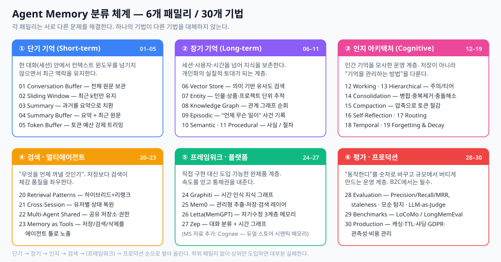

# 01. 메모리 분류 체계 — 무엇을 기억할 것인가



---

## 왜 메모리인가

메모리 없는 AI 애플리케이션은 **stateless**다. 매 상호작용이 처음부터 시작되고, 에이전트는 이전 맥락과 선호를 "잊는다". 메모리는 에이전트에게 다음 네 가지 성질을 부여한다.

| 성질 | 의미 | 커머스에서의 발현 |
|------|------|------------------|
| **Reflective** | 과거 행동과 결과로부터 학습 | 지난번 추천이 거절당한 이유를 반영 |
| **Interactive** | 진행 중인 대화의 맥락 유지 | "그거 말고 다른 색"이 무엇을 가리키는지 이해 |
| **Proactive / Reactive** | 이력 기반으로 니즈를 예측하거나 적절히 반응 | 재구매 주기 도래 시 선제 제안 |
| **Autonomous** | 저장된 지식으로 더 독립적으로 동작 | 매번 사이즈를 되묻지 않음 |

더 직설적으로 말하면, 메모리가 없는 에이전트는 매번 컨텍스트를 처음부터 재유도해야 하고 **개인화도 학습도 장기적 일관성도 성립하지 않는다.**

---

## 통합 정의 — Agent Memory 8유형

여러 분류 체계를 하나로 통합했다. **이 표가 이 리서치의 기준 정의(canonical definition)** 이며, 이후 모든 문서가 이 용어를 따른다.

| 유형 | 정의 | Scope | Lifetime | 대응 기법 |
|------|------|-------|----------|----------|
| **Working Memory** | 단일 턴/작업을 처리하는 동안의 스크래치패드. 긴 대화가 잘려도 requirement · proposal · decision · action 같은 핵심 요소만 뽑아 유지한다 | 요청 1건 | Request-scoped (요청 종료 시 소멸) | 12 Working Memory & Context Window |
| **Short-term Memory** | 단일 세션 동안의 대화 맥락. 프레임워크의 세션 객체(`AgentSession` 등)가 여기 해당하며, **세션 종료 또는 앱 재시작 시 사라진다** | 세션 1건 | Session TTL (30분~24시간) | 01–05 Buffer / Sliding Window / Summary / Summary Buffer / Token Buffer |
| **Semantic Memory** | 시점을 벗어난 **일반화된 사실**. "언제 어떻게 알게 됐는지"는 버리고 사실만 남긴다. 개인화의 실질적 핵심 | 유저 | Pinned 또는 long half-life | 10 Semantic, 07 Entity |
| **Episodic Memory** | 시점·맥락을 포함한 **완결된 사건 기록**. 성공과 실패를 모두 담아 "무슨 일이 있었나"에 답한다 | 유저 × 시점 | Medium half-life (수주) | 09 Episodic, 16 Self-Reflection |
| **Procedural Memory** | "어떻게 하는가" — 반복 워크플로, 툴 사용 패턴, 학습된 절차 | 에이전트 (유저 무관) | No decay (버전 관리) | 11 Procedural |
| **Entity / Graph Memory** | 엔티티(사람·상품·브랜드)와 **엔티티 간 관계**. 멀티홉 추론의 근거 | 전역 + 유저 | Edge timestamp 기준, decay 없음 | 08 Knowledge Graph, 24 Graphiti |
| **Persona Memory** | 에이전트 **자신**의 역할·톤·정체성 일관성 | 에이전트 | No decay | 시스템 프롬프트 / core memory 블록 |
| **Structured RAG** | 대화·이메일·문서·이미지에서 **밀도 높은 구조화 정보**를 추출. 의미 유사도가 아니라 정보의 내재 구조를 활용해 precision · recall · speed를 동시에 높인다 | 도메인 데이터 | 원본 데이터 수명에 종속 | 20 Retrieval Patterns (hybrid search) |

**핵심 구분 3가지**

| 대비 | 차이 |
|------|------|
| Working vs Short-term | Working은 **요청 1건** 안에서만 산다. Short-term은 **세션 전체**를 산다. 둘을 같은 것으로 다루면 토큰 예산 관리가 무너진다 |
| Semantic vs Episodic | Episodic = *"유저가 화요일에 생일을 알려줬다"* (사건). Semantic = *"유저의 생일은 3월 15일"* (증류된 사실) |
| Semantic vs Structured RAG | Semantic은 **대화에서 추출한** 비정형 사실. Structured RAG는 **원래 스키마가 있는** 데이터(주문·상품·배송)를 정밀 질의 |

> **Long-term Memory**는 위 표에서 별도 유형이 아니라 **Semantic + Episodic + Procedural + Entity를 묶는 상위 범주**로 다룬다. "장기 메모리를 쓴다"는 말은 설계 단계에서 아무 의미가 없다 — 넷 중 무엇인지 특정해야 한다.

---

## 유형별 저장소 선택지

가장 실무적인 결정이다. 유형마다 접근 패턴이 다르므로 저장소도 달라진다.

| 유형 | 1순위 저장소 | 대안 | Azure 매핑 | 선택 기준 |
|------|-------------|------|-----------|----------|
| **Working Memory** | 프로세스 인메모리 (dict / list) | — | (앱 프로세스 내부) | 외부 저장 불필요. 외부에 두면 오히려 지연만 추가 |
| **Short-term Memory** | **Redis** (Hash / List + TTL) | 인메모리 + sticky session | Azure Managed Redis, Azure Cache for Redis | 앱 인스턴스가 2개 이상이면 Redis가 사실상 필수 |
| **Semantic Memory** | **PostgreSQL + pgvector** | Qdrant, Chroma, Weaviate, Pinecone | Azure Database for PostgreSQL (pgvector), Azure AI Search | 정형 필터(`category=`, `created_at>`)가 필요하면 RDB+pgvector가 유리 |
| **Episodic Memory** | 벡터 인덱스 + **filterable 메타데이터** | RDB 이벤트 테이블 + 벡터 인덱스 | Azure AI Search (filterable/sortable fields), Cosmos DB | time-range 필터가 1급 시민이어야 함. 순수 벡터 DB는 이 부분이 약할 수 있음 |
| **Procedural Memory** | JSON / YAML 파일 (Git 관리) | RDB, 벡터 인덱스(task-type 매칭) | Blob Storage, Azure App Configuration | 개수가 적고 정적이면 파일로 충분. 코드처럼 버전 관리하는 것이 이득 |
| **Entity / Graph Memory** | **Neo4j** | Memgraph, NetworkX(소규모), 인메모리 트리플 | Cosmos DB for Apache Gremlin | 멀티홉 질의 빈도로 판단. 1-hop만 필요하면 RDB 조인이 더 싸다 |
| **Persona Memory** | 설정 파일 / 프롬프트 템플릿 | core memory 블록 | Azure App Configuration | 반드시 버전 관리 대상. DB에 넣을 이유가 거의 없다 |
| **Structured RAG** | **검색 엔진** | Elasticsearch, OpenSearch | Azure AI Search | 스키마가 명확 + 정밀 필터 + BM25가 필요할 때 |
| **Cold Archive** | 오브젝트 스토리지 + 압축 | SQLite, Parquet | Azure Blob Storage (Cool / Archive tier) | 조회 빈도 극히 낮음. 삭제 대신 보존해야 하는 데이터 |

### 티어별 저장소 매핑

| Tier | 지연 | 담는 것 | 저장소 | Azure |
|------|------|---------|--------|-------|
| **HOT** | < 1ms | 현재 세션, pinned 프로필 | 인메모리 dict, Redis | Azure Managed Redis |
| **WARM** | 5~50ms | 최근 세션, 활성 엔티티, 검색 대상 사실 | pgvector, Qdrant, 검색 엔진 | Azure DB for PostgreSQL, Azure AI Search |
| **COLD** | 100ms+ | 과거 이력, 압축 요약, 감사 로그 | 압축 아카이브, 오브젝트 스토리지 | Azure Blob Storage (Cool/Archive) |

### 최소 구성 vs 확장 구성

```
[ 최소 구성 — Phase 1 ]
  Redis          → Short-term Memory (세션 버퍼, TTL)
  PostgreSQL     → Semantic Memory (pgvector) + Episodic Memory (이벤트 테이블)
                   + 유저 메타데이터
  → 저장소 2개로 개인화의 80%를 커버한다

[ 확장 구성 — Phase 2~3 ]
  + 검색 엔진     → Structured RAG (상품 카탈로그, 주문 정밀 질의)
  + Graph DB      → Entity/Graph Memory (관계 기반 추천)
  + Object Store  → Cold Archive (감사·규제 보존)
```

---

## 구현 기법 6패밀리 30기법 (참조용)

위 유형들을 실제로 구현하는 기법의 전체 지도다.

| 패밀리 | 해결하는 문제 | 기법 번호 |
|--------|--------------|-----------|
| **Short-term** | 컨텍스트 윈도우를 채우지 않으면서 최근 턴 유지 | 01–05 |
| **Long-term** | 세션·사용자·시간을 넘어 지식 보존 | 06–11 |
| **Cognitive architectures** | Working / Hierarchical / Reflective 메모리 시스템 | 12–19 |
| **Retrieval & routing** | 무엇을 언제 회상할지 선택 | 20–23 |
| **Frameworks** | 프로덕션 레디 라이브러리 (Mem0, Letta, Zep, Graphiti) | 24–27 |
| **Evaluation & production** | 측정 · 벤치마크 · 배포 | 28–30 |

---

## Retention 정책 — 유형별로 다르게 간다

**같은 저장소에 넣더라도 retention 정책은 반드시 유형별로 분리해야 한다.** 이것을 하나로 통일하는 것이 커머스 개인화에서 가장 흔한 설계 실패다.

| 유형 | Retention 방식 | 파라미터 예시 |
|------|---------------|--------------|
| Working Memory | Request-scoped | 없음 |
| Short-term Memory | **TTL** | 30분 ~ 24시간 (세션 정의에 따름) |
| Semantic — 제약/식별 정보 | **Pinned** (decay 면제) | 사이즈, 알레르기, 결제수단 |
| Semantic — 취향/선호 | **Long half-life** | 90~180일 |
| Semantic — 세션 의도 | **Short half-life** | 30분 ~ 수시간 |
| Episodic Memory | **Medium half-life** + 접근 시 reinforcement | 14~60일 |
| Entity / Graph | **No decay**, edge timestamp로 시간 추론 | — |
| Procedural / Persona | **No decay**, 버전 관리 | — |
| Cold Archive | **Retention period** (규제 기준) | 3~5년 |

관련 개념은 [03. 파이프라인과 검색](03-pipeline-and-retrieval.md)에서 Temporal Memory · Forgetting & Decay · Consolidation으로 자세히 다룬다.

---

## Long-term 6종의 실질적 차이 (기법 06–11)

커머스 설계에서 가장 많이 혼동되는 부분이라 따로 정리한다.

| # | 기법 | 저장하는 것 | 답할 수 있는 질문 | 저장소 | Token Cost |
|---|------|-----------|-----------------|--------|-----------|
| 06 | **Vector Store** | 과거 메시지를 임베딩 | "의미가 비슷한 게 뭐였지?" | pgvector, Qdrant, Chroma | K개 상수 |
| 07 | **Entity** | 사람·상품·브랜드별 사실 레코드 | "이 유저의 사이즈는?" | RDB 테이블, KV 스토어 | 아주 작음 (엔티티당 1레코드) |
| 08 | **Knowledge Graph** | 엔티티 간 관계 (edge) | "이 브랜드를 좋아한 사람이 같이 산 것은?" | Neo4j, Cosmos DB Gremlin | 아주 작음 (subgraph) |
| 09 | **Episodic** | 시점·맥락을 포함한 완결된 상호작용 | "지난주에 무슨 일이 있었지?" | 벡터 인덱스 + filterable 메타데이터 | 아주 작음 (에피소드 요약) |
| 10 | **Semantic** | 시점을 벗어난 일반화된 사실 | "이 유저에 대해 내가 아는 것은?" | pgvector + 정형 컲럼 | 아주 작음 (top facts) |
| 11 | **Procedural** | "어떻게 하는지" — 절차·워크플로 | "이 유형의 요청은 어떻게 처리했더라?" | JSON/YAML 파일, RDB | 아주 작음 (절차 1개) |

**Semantic vs Episodic 구분이 핵심이다.**
- Episodic: *"유저가 화요일에 생일을 알려줬다"* → 사건 자체
- Semantic: *"유저의 생일은 3월 15일"* → 증류된 사실. **언제, 어떻게 알게 됐는지는 중요하지 않다**

이 둘의 조합이 강하게 권장된다. **"Episodic으로 포착 → Semantic으로 증류 → 주기적 Consolidation"** 3계층이 대부분의 프로덕션 메모리 시스템이 딛고 서는 기반이다.

---

## 커머스 관점 우선순위

실시간 추천 + 개인 맞춤 구매 유도라는 목표에 비춰 기법의 실효 순위를 매기면 다음과 같다.

### 반드시 필요 (Phase 1)
| 기법 | 이유 |
|------|------|
| 04 Summary Buffer / 05 Token Buffer | 세션 내 대화 예산 관리. 없으면 컨텍스트 오버플로 |
| 06 Vector Store | 모든 장기 기억의 기반 저장소 |
| 10 Semantic Memory | 선호·제약(사이즈/알레르기/예산)의 저장 형태 |
| 21 Cross-Session | 재방문 유저 식별과 상태 복원 — 개인화의 전제 |
| 20 Retrieval Patterns | 검색 품질이 체감 품질을 좌우 |

### 강하게 권장 (Phase 2)
| 기법 | 이유 |
|------|------|
| 18 Temporal Memory | **커머스의 핵심**. "지금 사고 싶은 것"과 "원래 취향"은 decay 속도가 다르다 |
| 09 Episodic Memory | 조회/구매/반품 이벤트를 시점과 함께 보관 |
| 14 Consolidation | 중복·모순 누적으로 인한 검색 품질 저하 방지 |
| 19 Forgetting & Decay | 저장소 무한 증식 억제, 비용 통제 |
| 28 Evaluation | 개선 여부를 숫자로 증명 |
| 30 Production Patterns | PII·GDPR·티어링·관측성 |

### 선택적 (Phase 3+)
| 기법 | 판단 기준 |
|------|----------|
| 07 Entity / 08 KG / 24 Graphiti | 상품·브랜드 관계 기반 추천이 필요할 때 |
| 13 Hierarchical Layers | 유저 수와 지연 요구가 커졌을 때 |
| 11 Procedural / 16 Self-Reflection | 에이전트가 다단계 작업(반품 처리 등)을 수행할 때 |
| 17 Memory Routing | 저장소가 3개 이상으로 늘고 나서. **읽기 경로에 넣으면 안 됨** (LLM 분류 200~500ms) |
| 22 Multi-Agent Shared | 에이전트가 여러 개로 분화됐을 때 |

### 우선순위가 낮은 것
- **01 Conversation Buffer** — 프로토타입용. 토큰이 무한 증가하므로 프로덕션 부적합
- **26 Letta/MemGPT 전면 채택** — 자체 프레임워크를 이미 운영 중이라면 아키텍처 강제가 부담. 개념(3계층, 자기수정)만 차용 권장

---

## 다음 문서

- [02. 아키텍처 패턴](02-architecture-patterns.md) — 이 메모리들을 어떤 구조로 담을 것인가
- [06. 커머스 적용 설계](06-commerce-application.md) — 실시간 추천/구매 유도로 직결되는 설계

---

## 참고 자료

1. [Microsoft — 13-agent-memory](https://github.com/microsoft/ai-agents-for-beginners/tree/main/13-agent-memory) — 메모리 유형 정의, Structured RAG
2. [Agent Memory Techniques](https://github.com/NirDiamant/Agent_Memory_Techniques) — 30기법 / 6패밀리 · [비교 매트릭스](https://github.com/NirDiamant/Agent_Memory_Techniques/blob/main/docs/comparison.md)
3. [Memory Mechanism of LLM-Based Agents 서베이 (arXiv:2404.13501)](https://arxiv.org/abs/2404.13501) — 학술적 분류 체계
