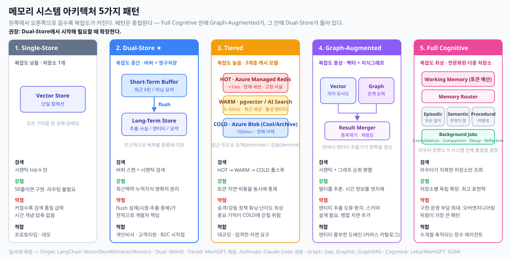

# 02. 아키텍처 패턴 — 어떤 구조로 담을 것인가



메모리를 어떻게 조직하느냐가 **무엇을 기억하는지, 얼마나 빨리 찾는지, 얼마나 확장되는지**를 결정한다. 프로덕션 에이전트 시스템에서 반복적으로 관찰되는 다섯 가지 패턴이 있다.

---

## 1. Single-Store — 단일 벡터 저장소

모든 기억(대화 턴, 추출 사실, 유저 선호, 에피소드 요약)을 **하나의 컬렉션**에 임베딩한다. 검색 시 전체 저장소를 시맨틱 검색해 top-k를 프롬프트에 주입한다.

**구성**: 벡터 컬렉션 1개 (Chroma/Pinecone/Qdrant/Weaviate) + 임베딩 모델 + 코사인 유사도 쿼리

**데이터 흐름**
1. 매 턴 후 응답(또는 턴 요약)을 임베딩해 저장
2. 새 턴 전에 현재 유저 메시지로 저장소 질의
3. top-k 결과를 "관련 기억"으로 시스템 프롬프트에 삽입

| 강점 | 약점 |
|------|------|
| 50줄 이내로 구현 | 메모리 유형 구분 없음 (사실/에피소드/절차 혼재) |
| 라우팅 로직 불필요 | 저장소가 커질수록 검색 품질 급락 — 무관한 기억이 결과를 오염 |
| 단일 유저 챗봇에서는 의외로 잘 동작 | 시간 순서·decay 없음. 6개월 전 사실과 5분 전 사실이 동일 가중 |
| | 압축·통합 없음 → 무한 증식 |

**적합**: 프로토타입, 데모, 학습용
**실사례**: LangChain `VectorStoreRetrieverMemory`, 기본 RAG-over-chat-history

---

## 2. Dual-Store — 버퍼 + 영구 저장소 ★

"최근에 무슨 일이 있었나"(대화 버퍼)와 "에이전트가 무엇을 아는가"(장기 저장소)를 분리한다. 둘 사이를 **flush 메커니즘**이 연결한다.

**구성**
- **Short-term buffer**: 최근 메시지 인메모리 리스트 (sliding window 또는 summary buffer)
- **Long-term store**: 영구 벡터 DB / 문서 저장소. 추출된 지식이 누적
- **Flush 메커니즘**: N턴마다 / 세션 종료 시 / 메모리 압력이 높을 때 실행. 버퍼에서 내구성 있는 기억을 추출해 장기 저장소에 기록

**데이터 흐름**
1. 새 유저 메시지 → 단기 버퍼
2. 에이전트는 **항상** 버퍼 전체를 컨텍스트로 봄
3. 동시에 현재 메시지로 장기 저장소 시맨틱 검색 → top-k 주입
4. 주기적으로 flush: 엔티티 추출 / 에피소드 요약 / 사실 식별 → 장기 저장소 기록
5. flush 후 오래된 버퍼 항목을 트리밍 또는 요약

| 강점 | 약점 |
|------|------|
| 최근 맥락과 누적 지식이 명확히 분리 | flush 설계(언제·무엇을 추출·어떻게 중복 제거)를 직접 해야 함 |
| 버퍼가 즉시 맥락을 보장 | 저장소 2개 관리·백업 |
| 장기 저장소가 독립적으로 성장 | 명시적 라우팅 없음 → 매 턴 장기 저장소를 항상 검색 |
| flush 자체가 자연스러운 압축 단계 | |

**적합**: 개인 비서, 고객 지원 봇, **즉시 맥락 + 세션 간 영속성이 모두 필요한 모든 시스템**
**실사례**: Mem0 아키텍처(자동 추출 → 영구 저장), LangChain `ConversationSummaryBufferMemory` + `VectorStoreRetrieverMemory` 조합

> **B2C 커머스의 현실적 출발점.** "의심스러우면 Dual-Store에서 시작해 진화시켜라"가 일반 조언으로 통용된다.

---

## 3. Tiered — Hot / Warm / Cold 계층

CPU 캐시 계층(L1/L2/메인메모리)에서 착안했다. 접근 빈도·최신성·중요도에 따라 기억이 티어 사이를 이동한다.

| 티어 | 저장소 | Azure 매핑 | 내용 | 지연 | 규모 |
|------|--------|-----------|------|------|------|
| **HOT** | 인메모리 dict / Redis | Azure Managed Redis | 현재 세션, pinned 사실, 워킹 컨텍스트 | < 1ms | 보통 20개 미만 |
| **WARM** | 벡터 DB / KV 스토어 | Azure Database for PostgreSQL (pgvector), Azure AI Search, Cosmos DB | 최근 세션, 활성 엔티티, warm 요약 | ~10ms | 수백~수천 |
| **COLD** | 오브젝트 스토리지 / 압축 아카이브 | Azure Blob Storage (Cool / Archive tier) | 과거 세션, 아카이브 엔티티, 압축 요약 | ~100ms | 수백만 |

**Tier Manager (정책 엔진)** — 매 턴 후 또는 스케줄에 따라 실행

```
승격(promote) 규칙
  - 접근 횟수 > 임계값        → 더 뜨거운 티어로
  - 에이전트가 명시적으로 pin  → HOT
  - 최근 N턴 내 참조됨        → HOT 유지

강등(demote) 규칙
  - M턴 동안 미접근           → 더 차가운 티어로
  - 관련도 점수 낮음          → 강등 또는 아카이브
  - 세션 종료                 → WARM으로
  - decay score < 컷오프         → COLD로
```
**데이터 흐름**
1. 새 기억은 항상 HOT으로 진입
2. 매 턴 종료 시 tier manager가 HOT 항목을 강등 규칙과 대조
3. 미접근 항목은 WARM으로, 정체된 WARM은 COLD로
4. COLD 항목이 검색되면(HOT/WARM이 답 못 했을 때) WARM 또는 HOT으로 재승격
5. 프롬프트 = 시스템 프롬프트 + HOT 전체 + WARM top-k

| 강점 | 약점 |
|------|------|
| 컨텍스트 윈도우 효율 최대 | 구현·튜닝 난이도 최상 |
| COLD가 무제한 이력을 저렴하게 수용 | 승격/강등 정책 캘리브레이션이 까다로움 |
| 인간 기억 모사 — 잦은 접근이 기억을 강화 | 정책이 공격적이면 중요 기억이 COLD에 갇힘 |
| 티어별 성능 특성이 명확 | 저장소 3개 관리 |

**적합**: 방대한 이력을 가진 장수 에이전트, 엄격한 지연 요구가 있는 프로덕션, 다수 유저를 서빙하는 엔터프라이즈 어시스턴트
**실사례**: MemGPT의 archival/recall/core 계층, Anthropic의 Claude Code 7계층 메모리 계층 구조

---

## 4. Graph-Augmented — 벡터 + 지식 그래프

모든 지식이 평문에 깔끔히 들어가지는 않는다. 엔티티 간 관계는 **따라갈 수 있는 그래프 엣지**로 표현하는 편이 낫다.

**구성**
- **Vector store**: 임베딩된 텍스트 청크 (대화 발췌, 요약, 문서 조각). 시맨틱 유사도 검색
- **Knowledge graph**: 엔티티=노드, 관계=엣지 (Neo4j / NetworkX / 인메모리 트리플 dict). `Project X에서 일하는 사람 전부 찾기` 같은 순회 질의
- **Entity extractor**: 매 턴 후 실행되는 LLM 기반 또는 NER 파이프라인. 엔티티·관계를 식별해 **양쪽 저장소를 동시에 갱신**
- **Result merger**: 양쪽 결과를 병합·중복 제거·재랭킹 후 주입

**데이터 흐름**
1. 매 턴 후 엔티티 추출기가 새 엔티티·관계 탐색
2. 텍스트 청크는 벡터 저장소로, 엔티티-관계 트리플은 그래프로
3. 검색 시 유저 메시지가 **두 개의 병렬 질의**를 트리거 (벡터 시맨틱 + 그래프 엔티티/관계)
4. Result merger가 병합·중복 제거 후 랭킹된 컨텍스트 블록 생성
5. 컨텍스트 블록을 프롬프트에 주입

| 강점 | 약점 |
|------|------|
| 자유 텍스트 회상 + 구조적 순회 양쪽 확보 | 엔티티 추출이 불완전 — LLM이 누락하거나 환각 |
| 멀티홉 추론 가능 | 저장소 2개를 동기화 유지해야 함 |
| 그래프가 엔티티 중복 제거·관계 갱신을 자연스럽게 지원 | 그래프 스키마 설계 필요 |
| 엣지에 타임스탬프를 실어 시간 추론이 용이 | merger 로직이 지연·복잡도 추가 |

**적합**: 엔티티가 풍부한 도메인(CRM, 프로젝트 관리, 리서치), 엔티티 간 관계가 중요한 멀티유저 시스템
**실사례**: Zep의 시간 지식 그래프, Graphiti(에피소드→시맨틱 그래프 추출), Microsoft GraphRAG, 커스텀 Neo4j + 벡터 파이프라인

> **커머스 적합성 높음.** 상품·브랜드·카테고리·대체재 관계가 본질적으로 그래프다. 다만 Phase 1에서 도입하면 과설계다.

---

## 5. Full Cognitive Architecture — 완전 인지 구조

메모리 유형별 전문 저장소 + 읽기/쓰기를 지휘하는 라우터 + 활성 컨텍스트를 큐레이션하는 워킹 메모리 매니저. 인지과학의 인간 기억 모델에서 착안했다.

**구성**

| 컴포넌트 | 역할 |
|---------|------|
| **Working memory (컨텍스트 윈도우 매니저)** | 시스템 프롬프트 / pin된 기억 / 검색된 기억 / 대화 버퍼에 **토큰 예산을 배분**. 예산 초과 시 중요도 낮은 것부터 evict |
| **Memory router** | 규칙 기반 또는 LLM 기반 분류기. "Alice의 생일은 3월 5일" → semantic, "어제 프로젝트 일정을 논의했다" → episodic, "CSV 내보내기 요청 시 export_csv 툴 사용" → procedural. 검색 질의도 라우팅 |
| **Episodic memory** | 타임스탬프·참여자·주제·결과 등 풍부한 메타데이터를 가진 완결 에피소드. "무슨 일이 있었나" |
| **Semantic memory** | 상호작용에서 증류된 일반화 사실·엔티티 레코드·도메인 지식. "무엇이 참인가". 흔히 지식그래프+벡터 (패턴 4가 패턴 5 안에 중첩) |
| **Procedural memory** | 학습된 절차·툴 사용 패턴·워크플로. "어떻게 하는가". JSON/YAML 구조화 저장소 또는 실행 가능한 템플릿 |
| **Background processes** | 비동기 유지보수 — Consolidation(병합·강화), Compaction(요약·중복제거·모순 정리), Decay & Forgetting(중요도 감소·아카이브/삭제), Reflection(자기 행동에 대한 메타 관찰 생성), Entity extraction |

**데이터 흐름**
1. 유저 메시지 도착 → 워킹 메모리 매니저가 현재 토큰 예산 계산
2. 라우터가 질의 의도를 분류해 검색할 저장소 선택
3. 각 저장소 결과를 랭킹해 워킹 메모리에 주입
4. 에이전트가 조립된 컨텍스트로 응답 생성
5. 응답 후 라우터가 새 정보를 분류해 적절한 저장소에 기록
6. 백그라운드 프로세스가 통합·압축·건강성 유지 수행

| 강점 | 약점 |
|------|------|
| 가장 표현력 높고 유연 — 어떤 메모리 워크로드도 수용 | 구현 복잡도 최상 |
| 메모리 유형별로 접근 패턴에 최적화 | **라우터 정확도가 시스템 전체를 좌우** — 오라우팅이 전체 품질을 망침 |
| 백그라운드 프로세스가 무한 증식·품질 저하 방지 | 백그라운드 프로세스의 운영 오버헤드 |
| 인지과학 모델과 대응 → 디버깅 시 직관적 멘탈 모델 | 단순 유스케이스에는 과설계 위험 |

**적합**: 프로덕션급 AI 어시스턴트, 수개월~수년 지식을 축적하는 장수 에이전트, 인지 구조를 탐구하는 리서치 플랫폼
**실사례**: Letta/MemGPT(core + recall + archival + inner monologue), Anthropic Claude Code 메모리 계층, SOAR, ACT-R

---

## 패턴 비교표

| 패턴 | 복잡도 | 저장소 | 적합 | 검색 | 확장성 | 대표 시스템 |
|------|--------|--------|------|------|--------|------------|
| **Single-store** | 낮음 | 벡터 DB 1개 | 프로토타입·데모·학습 | 시맨틱만 | 나쁨 (크기에 따라 저하) | LangChain VectorStoreRetrieverMemory |
| **Dual-store** | 중간 | 버퍼 + 벡터 DB | 개인 비서, 지원 봇 | 버퍼 스캔 + 시맨틱 | 보통 | Mem0, Summary Buffer + Vector Store |
| **Tiered** | 높음 | Hot + Warm + Cold | 장수 에이전트, 엔터프라이즈 | 계층 검색 + 승격 | 좋음 (COLD가 저렴) | MemGPT 계층, CPU 캐시 모델 |
| **Graph-augmented** | 중상 | 벡터 DB + 지식그래프 | 엔티티 풍부 도메인, 멀티홉 Q&A | 시맨틱 + 그래프 순회 | 좋음 | Zep, Graphiti, GraphRAG |
| **Full cognitive** | 최상 | Working+Episodic+Semantic+Procedural | 프로덕션 어시스턴트, 리서치 | 라우터 기반 멀티스토어 | 매우 좋음 (독립 확장) | Letta/MemGPT, SOAR, Claude Code |

---

## 패턴 선택 결정 트리

```
시작
  │
  ├─ 프로토타입 또는 학습 프로젝트인가?
  │    YES → Single-store
  │
  ├─ 세션 간 영속성이 필요한가?
  │    NO  → Single-store + 인메모리 버퍼
  │    YES ↓
  │
  ├─ 엔티티/관계 추적이 필요한가?
  │    NO  → Dual-store
  │    YES ↓
  │
  ├─ 엔티티에 대한 멀티홉 추론이 필요한가?
  │    NO  → Dual-store + 엔티티 추출
  │    YES → Graph-augmented
  │
  ├─ 엄격한 지연 또는 토큰 예산 요구가 있는가?
  │    YES → Tiered (또는 Tiered + Graph)
  │
  ├─ 여러 메모리 유형(episodic + semantic + procedural)이 모두 필요한가?
  │    YES → Full cognitive architecture
  │
  └─ 애매하면 Dual-store로 시작해 진화시킨다.
```

**핵심 원칙**: 필요를 충족하는 **가장 단순한 패턴**에서 시작한다. 패턴은 자연스럽게 중첩된다 — Full cognitive 안에 Graph-augmented가, 그 안에 Dual-store가 들어 있다. 나중에 진화시킬 수 있다.

---

## B2C 커머스 에이전트에 대한 판단

| 단계 | 권장 패턴 | 근거 |
|------|----------|------|
| **Phase 1** | Dual-Store | 세션 버퍼 + 유저별 장기 프로필. 최소 구현으로 개인화 시작 |
| **Phase 2** | Dual-Store + Tiered (HOT/WARM만) | 유저 수 증가 시 지연·비용 방어. COLD는 나중에 |
| **Phase 3** | + Graph-Augmented | 상품·브랜드 관계 기반 추천이 필요해질 때 |
| **Phase 4** | 필요 시 Full Cognitive | 라우터 도입은 저장소가 3개 이상, 오라우팅 모니터링 체계가 갖춰진 후 |

**Full Cognitive를 처음부터 짓지 말 것.** 이 패턴의 최대 약점으로 지목되는 것이 "오버엔지니어링 위험"이며, 라우터 오분류는 **조용히 실패한다**(데이터가 엉뚱한 저장소에 들어가 영영 검색되지 않음). 자체 프레임워크를 운영 중인 팀이라면 라우팅 계층을 얹기 전에 로깅·평가 체계부터 갖추는 편이 안전하다.

---

## 다음 문서

- [03. 파이프라인과 검색](03-pipeline-and-retrieval.md) — 각 패턴 내부에서 데이터가 흐르는 방식
- [05. 프로덕션과 평가](05-production-evaluation.md) — Tiered 패턴의 운영 구현

---

## 참고 자료

1. [Microsoft — 13-agent-memory](https://github.com/microsoft/ai-agents-for-beginners/tree/main/13-agent-memory)
2. [Agent Memory Techniques — 아키텍처 패턴](https://github.com/NirDiamant/Agent_Memory_Techniques/blob/main/docs/architecture.md) — 5패턴 원문
3. [MemGPT 논문 (arXiv:2310.08560)](https://arxiv.org/abs/2310.08560) — Tiered / Full Cognitive 패턴의 원형
4. [Memory Mechanism of LLM-Based Agents 서베이 (arXiv:2404.13501)](https://arxiv.org/abs/2404.13501)
