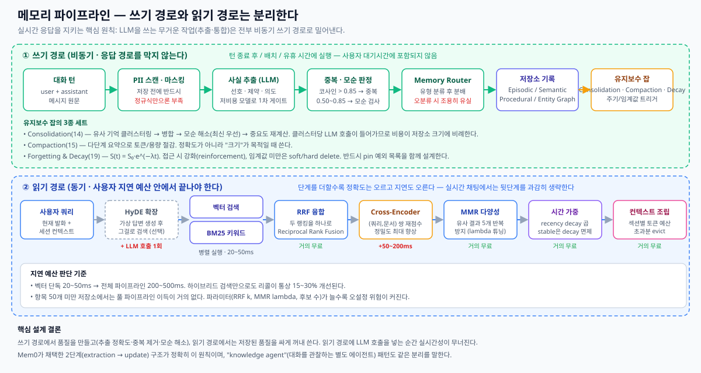

# 03. 파이프라인과 검색 — 쓰기 경로 / 읽기 경로



**이 문서의 결론을 먼저 말하면**: 메모리 품질은 **쓰기 경로**에서 만들어지고, 실시간성은 **읽기 경로**에서 지켜진다. 두 경로를 섞으면 둘 다 잃는다.

---

## 1. 쓰기 경로 (비동기)

**"knowledge agent"** 패턴 — 메인 대화를 관찰하는 별도 에이전트를 두는 방식 — 과 Mem0의 **2단계 파이프라인(extraction → update)** 은 사실상 같은 구조다.

### self-improving 루프

1. **가치 있는 정보 식별** — 대화 중 일반 지식 또는 유저 선호로 저장할 만한 부분인지 판단
2. **추출 및 요약** — 본질적 학습 또는 선호를 증류
3. **지식 베이스에 저장** — 나중에 검색 가능하도록 (보통 벡터 DB) 영속화
4. **향후 질의 증강** — 새 질의 시 관련 정보를 검색해 유저 프롬프트에 덧붙여 주 에이전트에 제공 (RAG와 유사)

### Mem0의 2단계 파이프라인

- **Extraction**: 에이전트 스레드에 추가된 메시지를 Mem0 서비스로 전송 → LLM이 대화 이력을 요약하고 새 기억을 추출
- **Update**: LLM 주도로 해당 기억을 **추가할지 / 수정할지 / 삭제할지** 결정 → 벡터·그래프·키밸류를 아우르는 하이브리드 데이터 스토어에 저장

### 실제 구현할 단계

| 단계 | 하는 일 | 주의점 |
|------|--------|--------|
| **1. 원본 수집** | 대화 턴 + 행동 이벤트를 동일 스키마로 정규화 | 대화만이 입력이 아니다. 클릭·장바구니·구매도 메모리 입력이다 |
| **2. PII 스캔·마스킹** | 저장 **전에** 민감정보 탐지·레닥션 | 정규식은 이메일·주민번호는 잡지만 **이름·주소 같은 맥락 의존 PII는 놓친다**. 프로덕션은 전용 서비스 필요 |
| **3. 사실 추출 (LLM)** | 선언적 사실을 추출. "아 맞다 지난달에 맥으로 바꿨어요" → "유저는 macOS를 사용한다" | 의견을 사실로 오추출하거나 암묵 지식을 놓칠 수 있음. 턴당 200~500ms + 비용 |
| **4. 중복 판정** | 새 사실 임베딩 vs 기존 사실 코사인 유사도 | **> 0.85 → 중복** (기존 confidence 부스트). **0.50~0.85 → LLM으로 모순 검사** |
| **5. 모순 해소** | 충돌 시 구버전 아카이브 + 신버전 저장 | 전략: 최신 우선 / 최고 confidence 우선 / 유저 확인 우선 |
| **6. 라우팅·저장** | 유형별 저장소로 분배 | 오분류 시 **조용히 실패**한다. 라우팅 로그 필수 |

### 지연·비용 최적화

- **Latency Management**: 유저 상호작용을 느리게 하지 않으려면, **더 싸고 빠른 모델**로 먼저 "저장/검색할 가치가 있는가"를 판정하고, 필요할 때만 무거운 추출/검색 프로세스를 호출한다.
- **Knowledge Base Maintenance**: 지식 베이스가 커지면 **덜 쓰이는 정보를 "cold storage"로 이동**해 비용을 관리한다.

---

## 2. 백그라운드 유지보수 3종

### Consolidation (기법 14) — 품질을 위한 병합

신경과학의 수면 중 기억 통합에서 착안. 수백 회 상호작용 후 저장소는 **중복**(유저가 직업을 5번의 다른 대화에서 언급), **모순**(3월엔 Python 선호, 6월엔 Rust로 전환), **노이즈**(필터링 없이 저장된 무관한 곁가지)로 가득 찬다.

**동작**
1. 트리거 발화 (저장소 크기 임계 초과 / 스케줄 간격 경과 / 수동)
2. 시맨틱 유사도 또는 공유 엔티티로 후보 클러스터링
3. 클러스터 내 중복을 통합 엔트리로 병합
4. 모순을 설정된 전략(보통 최신 우선)으로 해소
5. 중요도 점수 재계산 — 낮은 것은 아카이브/프루닝
6. 통합본이 기존 저장소를 대체

**한계**
- **병합은 설계상 비가역·손실적.** 삭제된 기억은 복구 불가
- 중복 그룹마다 LLM 호출 → **1만 개 저장소면 사이클당 수백 회 API 호출**
- 유사도 임계값이 취약 — 낮으면 무관한 것이 병합되고, 높으면 진짜 중복이 통과
- 시간적 뉘앙스 유실. "Python 선호"와 "Rust로 전환"은 항상 모순이 아니다 (용도가 다를 수 있음)
- 실행 중 에이전트를 느리게 함 → **비동기 또는 유휴 시간대 실행 필수**

### Compaction (기법 15) — 크기를 위한 압축

요약·엔티티 추출·증류로 저장 기억을 압축한다. **정확도가 아니라 토큰 예산이 주 제약일 때** 사용한다. Consolidation과 목적이 다르며, 많은 시스템이 둘 다 쓴다.

### Forgetting & Decay (기법 19) — 의도적 망각

Ebbinghaus 망각 공선(1885)의 exponential decay를 적용한다.

```
S(t) = S₀ · e^(−λ · t)
```

- λ가 클수록 빨리 잊는다. 실무 half-life는 **도메인에 따라 1~30일**
- **접근 시 강화(reinforcement)**: 검색될 때마다 강도 부스트 → 자주 유용한 기억은 오래 살아남음
- **프루닝 임계값**: 미만이면 soft delete(아카이브) 또는 hard delete
- **저장 압력 모니터**가 임계값을 동적으로 조정 → 용량 한계 근접 시 더 공격적으로 망각

**반드시 알아야 할 실패 모드**
| 실패 | 설명 | 대응 |
|------|------|------|
| 중요 정보 소실 | 알레르기·법적 요구·안전 규칙이 decay로 프루닝됨 | **pin / decay 면제 목록**을 반드시 설계 |
| 저빈도 고중요 기억 | 연 1회 규정 절차처럼 다음 사용 전에 decay 완료 | 접근 빈도 ≠ 중요도임을 인정하고 별도 중요도 축 부여 |
| 파라미터 상호작용 | half-life · 강화 부스트 · 프루닝 임계값이 비직관적으로 얽힘 | 반복 튜닝 전제 |
| 모순 미해소 | 구버전과 신정정본이 공존, decay만으로는 해결 안 됨 | Consolidation을 **프루닝보다 먼저** 실행 |
| 클록 스큐 | 분산 환경에서 "지금 − 마지막접근" 계산이 어긋나 예기치 않은 망각 | 시각 동기화 / 논리적 타임스탬프 |

> **조합 권장**: Consolidation을 먼저 돌려 관련 기억을 강한 통합 엔트리로 병합한 뒤, Decay로 약한 개별 항목을 프루닝한다.

---

## 3. Temporal Memory (기법 18) — 지우지 않고 시간을 반영

Forgetting & Decay가 **프루닝**이라면, Temporal Memory는 **검색 시 스코어링**이다. 모든 것을 보관하되 오래된 것을 하위 랭크로 내린다.

**저장 필드**: `created_at`, `event_time`(사건 실제 발생 시각), `last_accessed`

**네 가지 검색 모드**
| 모드 | 용도 |
|------|------|
| **표준 질의** | 시맨틱 관련도 × temporal decay 배수 |
| **Time-range** | "지난 24시간 대화" — 시맨틱 검색 전에 시간 창으로 필터 |
| **"As of" 질의** | 특정 과거 시점에 에이전트가 알던 상태 재구성 (이후 생성 기억 제외) |
| **Timeline** | 관련 기억을 시간순 집계 + LLM 서사 요약 |

**Decay function 선택**
- **Exponential decay** — 강한 최신성 선호
- **Linear decay** — 완만한 노화
- **No decay** — 시간 비민감 질의

**한계**
- **에버그린 사실이 부당하게 페널티를 받는다** (수식·API 문서·회사 정책). decay 면제 또는 매우 긴 half-life 필요
- half-life와 recency weight 선택에 실험이 필요. 너무 짧으면 건망증, 너무 길면 무의미
- 매 질의마다 전체 후보에 decay score 계산 → **10만 항목 이상에서 순수 벡터 검색 대비 지연 증가**
- 정확한 타임스탬프를 전제. 순서 뒤바뀐 도착이나 클록 스큐가 잘못된 최신성 점수를 만듦

> **핵심 조합 (기법 10 + 18)**: 사실에 `stable` / `volatile` 라벨을 붙여, stable(유저 이름·사이즈)은 decay를 우회하고 volatile(진행 중인 관심사·마감)만 정상 decay시킨다. 이 **selective decay**가 영구 정보가 파묻히는 것을 막는다.

### Temporal vs Forgetting — 무엇을 쓸까

| 선택 기준 | Temporal Memory (18) | Forgetting & Decay (19) |
|----------|---------------------|------------------------|
| 데이터 보존 | 전부 보관, 랭킹만 하향 | 임계 미만 영구 삭제 |
| 목적 | 최신 정보 우선 노출 | 저장 크기·비용 통제 |
| 나중에 다시 필요할 수 있다면 | ✅ 안전 | ❌ 위험 |
| 컴플라이언스/감사 보존 필요 | ✅ | ❌ |
| 수개월간 수만 건 누적 | 검색 지연 증가 | ✅ 무한 증식 방지 |

**실무 결론**: 둘 다 쓴다. Temporal로 랭킹하고, Decay로 하한선 아래를 정리한다.

---

## 4. 읽기 경로 — 하이브리드 검색 (기법 20)

검색 전략이 에이전트 성능에 미치는 영향은 깊다. 단일 방식 대신 여러 리트리버를 병렬로 돌리고 융합한다.

### 파이프라인 단계

| 단계 | 기술 | 효과 | 비용 |
|------|------|------|------|
| **0. 쿼리 변환 (선택)** | **HyDE** — LLM이 가상 답변을 생성하고 그것으로 검색. 짧은 질의와 긴 저장 기억 사이의 어휘 격차를 메움 | 어휘 불일치 해소 | **LLM 호출 1회 추가** |
| **1a. 시맨틱 검색** | 임베딩 코사인 유사도 | 의미 기반 회상 | 20~50ms |
| **1b. BM25 어휘 검색** | 용어 빈도 기반 랭킹 | **정확 키워드 매칭**. 도메인 특수 용어에 강함 | 병렬 실행 |
| **2. RRF 융합** | Reciprocal Rank Fusion으로 두 랭킹 결합 | 의미 + 키워드 동시 포착 | 거의 무료 |
| **3. Cross-Encoder 리랭크** | (query, document) 쌍을 함께 스코어링 — 임베딩 유사도보다 정밀 | top-K 내 false positive 제거 | **+50~200ms (가장 비쌈)** |
| **4. MMR 다양성** | Maximal Marginal Relevance — 관련도와 다양성 균형 | 거의 동일한 결과 5개 반복 방지 | 거의 무료 |
| **5. 시간 가중** | decay 배수 적용 (기법 18) | 최신 정보 우선 | 거의 무료 |
| **6. 컨텍스트 조립** | 섹션별 토큰 예산 배분, 초과분 evict | 컨텍스트 오버플로 방지 | 거의 무료 |

### 성능·한계 수치

- 벡터 검색 단독: **20~50ms**
- 풀 파이프라인(vector + BM25 + rerank + MMR): **200~500ms**
- 하이브리드 검색만으로 통상 벤치마크에서 **리콜 15~30% 개선**
- **50개 미만 저장소**에서는 풀 파이프라인 이득이 거의 없다. 기본 코사인 검색으로 충분
- 튜닝 파라미터가 많다(RRF의 k 상수, MMR lambda, 단계별 후보 수) → 오설정 위험

### HyDE의 위험

LLM이 **잘못된 가상 답변**을 생성하면, 검색은 정답이 아니라 오답과 비슷한 문서를 찾는다. 실시간 경로에서는 특히 위험하다.

---

## 5. Memory Routing (기법 17) — 읽기 경로에 넣으면 안 되는 이유

라우터는 내용 유형(episodic / semantic / procedural)을 분류해 올바른 저장소로 보낸다. 개념적으로는 우아하지만 **실시간 비용이 크다**.

**한계**
- **모든 읽기·쓰기가 LLM 분류 호출을 트리거 → 연산당 200~500ms 추가.** 고처리량 시스템에서 누적
- 분류기가 틀리면 데이터가 엉뚱한 저장소에 들어가고, **시스템이 그곳을 검색하지 않으므로 결과가 0건**이 된다
- 여러 유형에 걸친 콘텐츠("어제 회의에서 환불 기간을 14일로 정했다")는 멀티라벨 분류가 필요
- LLM 분류기에 **confidence score가 없다** → 불확실할 때 폴백을 트리거할 판단 근거가 없음
- 폴백 모드(전 저장소 검색)는 저장소·엔트리 수가 늘수록 비싸짐

**실무 대응**
1. **쓰기 경로에만 라우터를 둔다.** 비동기이므로 200~500ms가 문제되지 않는다
2. 읽기 경로는 **규칙 기반 사전 필터**(질의에 시간 표현이 있으면 episodic 포함 등)로 대체
3. 라우팅 결정을 전부 로깅해 분류기를 개선한다

---

## 6. Working Memory & 토큰 예산 (기법 12)

컨텍스트 윈도우를 **섹션별 예산**으로 나눠 관리한다.

```
[ 시스템 프롬프트 ]  고정
[ 코어/pin 기억   ]  유저 고정 프로필 — 항상 포함, 작게 유지
[ 검색된 기억     ]  턴마다 동적 — top-K
[ 대화 버퍼       ]  최근 k 메시지
[ 응답 여유분     ]  출력 토큰 확보
```

예산 초과 시 **중요도가 낮은 섹션부터 evict**한다. 우선순위 큐로 salience 랭킹을 유지하는 방식이 일반적이다.

---

## 커머스 적용 요약

| 결정 | 선택 | 근거 |
|------|------|------|
| 사실 추출 위치 | **비동기 쓰기 경로** | 턴당 200~500ms를 사용자에게 전가하지 않음 |
| Cross-Encoder 리랭크 | 실시간 경로에서 **제외**. 프리페치 추천에는 사용 | +50~200ms |
| HyDE | **제외** | LLM 호출 1회 + 오답 유도 위험 |
| Memory Router | **쓰기 경로만** | 읽기에서는 200~500ms 부담 |
| 하이브리드(vector+BM25+RRF) | **포함** | 병렬 실행 20~50ms, 리콜 개선폭 대비 저렴 |
| MMR | **포함** | 거의 무료. 추천 다양성 확보에 직결 |
| 시간 가중 | **포함, 단 selective decay** | 사이즈/알레르기는 pinned, 세션 의도는 짧은 half-life |
| Consolidation | **야간 배치** | 클러스터당 LLM 호출 비용 |

---

## 다음 문서

- [04. 프레임워크 비교](04-frameworks.md) — 직접 만들 것인가 가져다 쓸 것인가
- [05. 프로덕션과 평가](05-production-evaluation.md) — 이 파이프라인을 규모에서 운영하기

---

## 참고 자료

- [Agent_Memory_Techniques — 14 Memory Consolidation](https://github.com/NirDiamant/Agent_Memory_Techniques/tree/main/all_techniques/14_memory_consolidation)
- [Agent_Memory_Techniques — 17 Memory Routing](https://github.com/NirDiamant/Agent_Memory_Techniques/tree/main/all_techniques/17_memory_routing)
- [Agent_Memory_Techniques — 18 Temporal Memory](https://github.com/NirDiamant/Agent_Memory_Techniques/tree/main/all_techniques/18_temporal_memory)
- [Agent_Memory_Techniques — 19 Forgetting and Decay](https://github.com/NirDiamant/Agent_Memory_Techniques/tree/main/all_techniques/19_forgetting_and_decay)
- [Agent_Memory_Techniques — 20 Memory Retrieval Patterns](https://github.com/NirDiamant/Agent_Memory_Techniques/tree/main/all_techniques/20_memory_retrieval_patterns)
- [microsoft/ai-agents-for-beginners — 13-agent-memory](https://github.com/microsoft/ai-agents-for-beginners/tree/main/13-agent-memory) — knowledge agent 패턴, latency/cost 최적화
- Ebbinghaus, H. (1885). *Memory: A Contribution to Experimental Psychology.*
- Robertson &amp; Zaragoza (2009). *The Probabilistic Relevance Framework: BM25 and Beyond.*
- Carbonell &amp; Goldstein (1998). *The Use of MMR, Diversity-Based Reranking.* ACM SIGIR
- Gao et al. (2022). *Precise Zero-Shot Dense Retrieval without Relevance Labels (HyDE).* [arXiv:2212.10496](https://arxiv.org/abs/2212.10496)
- Zhong et al. (2024). *MemoryBank: Enhancing Large Language Models with Long-Term Memory.* [arXiv:2305.10250](https://arxiv.org/abs/2305.10250)
