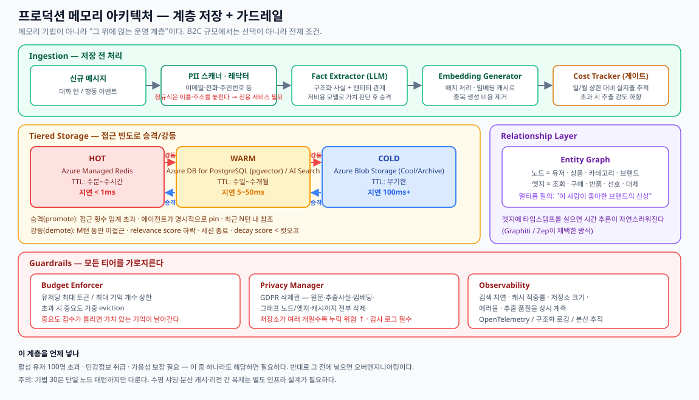

# 05. 프로덕션 운영과 평가



메모리 기법을 "동작하는 데모"에서 "수만 명을 견디는 시스템"으로 옮기는 계층이다. 이것은 메모리 기법이 아니라 **그 위에 얹는 ops layer** 이며, 어떤 메모리 기법과도 조합된다.

**언제 필요한가** — 아래 중 하나라도 해당하면 필요하다.
- 활성 유저 100명 초과
- 민감정보(PII) 취급
- 가용성 보장 필요

반대로 그 전에 도입하면 명백한 오버엔지니어링이다.

---

## 1. Ingestion — 저장 전 처리

| 단계 | 내용 | 실패 지점 |
|------|------|----------|
| **PII Scan & Redact** | 저장 전 민감정보 탐지·마스킹 | 정규식은 이메일·주민번호는 잡지만 **이름·주소 같은 context-dependent PII를 놓친다.** 프로덕션은 전용 PII 서비스가 필요 |
| **Fact Extraction (LLM)** | 구조화 사실 + 엔티티 관계 추출 | 의견을 사실로 오추출. 저비용 모델로 "저장 가치" 1차 게이트를 두는 것이 정석 |
| **Embedding Generation** | 벡터 생성 | 배치 처리 + embedding cache로 중복 생성 비용 제거 |
| **Cost Tracker** | 모든 연산의 실지출 기록 | 일/월 spend cap 대비 추적. 초과 시 추출 강도를 낮추는 게이트로 동작 |

---

## 2. Tiered Storage

| Tier | 저장소 | TTL | Latency | 담는 것 |
|------|--------|-----|---------|---------|
| **HOT** | 인메모리 / Redis | 수분~수시간 | < 1ms | 현재 세션, pinned 사실 |
| **WARM** | Postgres + pgvector / 벡터 DB | 수일~수개월 | 5~50ms | 최근 세션, 활성 엔티티 |
| **COLD** | 압축 아카이브 / 오브젝트 스토리지 | 무기한 | 100ms+ | 전체 이력, 압축 요약 |

**Promotion / Demotion 규칙**

```
promote  ← 접근 횟수 > 임계값 | 명시적 pin | 최근 N턴 내 참조
demote   → M턴 미접근 | relevance score 하락 | 세션 종료 | decay score < cutoff
```

**검색 순서**: HOT → WARM → COLD 폴스루. COLD가 히트하면 압축을 풀고 WARM으로 승격한다.

**한계**
- 3개 계층의 promotion / demotion / consistency를 직접 관리해야 한다
- Importance score가 부정확하면 가치 있는 기억이 evict되거나 저가치 기억이 살아남는다
- **단일 노드 패턴까지만 커버된다.** 수평 샤딩, 분산 캐시, 리전 간 복제는 별도 인프라 설계가 필요

---

## 3. Guardrails

### Budget Enforcer
- 유저당 **max tokens / max memory count** 상한
- 초과 시 importance-weighted eviction

### Privacy Manager — GDPR Right to Erasure
삭제 요청 시 **모든 계층에서 완전 삭제**해야 한다.

```
삭제 대상 체크리스트
  □ 원문 대화 로그
  □ 추출된 사실 레코드
  □ 임베딩 벡터
  □ 그래프 노드 및 엣지
  □ HOT 캐시 엔트리
  □ COLD 아카이브
  □ 백업 스냅샷 (정책에 따라)
  □ 삭제 감사 로그 기록
```

저장소가 여러 개일수록 누락 위험이 커진다. 벡터 DB · 그래프 DB · 캐시에 걸친 삭제는 **신중한 조율(coordination)** 이 필요하다.

### Observability
계측 대상 지표:
- retrieval latency (p50 / p95 / p99)
- cache hit rate
- store size (유저당 / 전체)
- error rate
- extraction quality

구조화 로깅 + 분산 추적 + 대시보드. OpenTelemetry가 표준 선택지다.

### Cost Management
| 비용 축 | 통제 방법 |
|---------|----------|
| Embedding 생성 | 배치 처리, embedding 캐싱 |
| Vector storage | Tiered storage, 차원 축소 |
| LLM extraction | 선택적 처리, 소형 모델 사용 |

### Latency Optimization
- 예상 기억 prefetch
- connection pooling
- 인덱스 튜닝
- **async memory operations** — 응답 경로를 막지 않는 쓰기

---

## 4. 그 외 필수 요소

| 항목 | 내용 |
|------|------|
| **TTL 정책** | 휘발성 정보("유저가 지금 회의 중")는 수동 정리 없이 자동 만료 |
| **Horizontal Sharding** | user ID 또는 namespace 해시로 노드 분산. 단일 노드 용량 초과 시 |
| **Backup & Recovery** | 스케줄 스냅샷 + WAL. **복구 절차를 실제로 테스트해 둘 것** |

---

## 5. 평가 — Memory Evaluation

"동작하는 것 같다"를 숫자로 바꾸는 단계다.

### 측정 지표

| 지표 | 측정 대상 | 의미 |
|------|----------|------|
| **Precision@K** | 검색된 기억 중 관련 있는 비율 | 쓰레기가 섞여 들어오는가 |
| **Recall@K** | 관련 기억 전체 중 검색된 비율 | 놓치는 게 있는가 |
| **MRR** | 정답이 상위에 오는 정도 | 랭킹 품질 |
| **Faithfulness** | 검색된 기억으로 만든 답변의 정확도 (LLM-as-Judge) | 기억은 맞았는데 답이 틀렸는가 |
| **Temporal Accuracy** | 최신 사실이 superseded된 사실보다 상위에 오는가 | staleness 탐지 |
| **Contradiction Rate** | 저장소 내 모순 사실 비율 | 일관성 |
| **Memory Coverage** | 대화의 중요 정보가 손실 없이 포착되는가 | 추출 누락 |

### 진단 관점
실패를 세 갈래로 분리할 수 있다는 것이 이 프레임워크의 핵심 가치다.
1. **Retrieval 실패** — 엉뚱한 기억을 찾음
2. **Faithfulness 실패** — 기억은 맞는데 답변이 틀림
3. **Staleness 실패** — 오래된 사실을 제공

### 한계
- Ground-truth 라벨링된 평가 데이터셋 구축에 **수작업 비용**이 든다. 합성 데이터셋은 실제 대화 분포를 반영하지 못할 수 있다
- LLM judge는 관대하거나 일관성이 없을 수 있고, 생성 모델과 **blind spot을 공유**할 수 있다. Cross-model judging이 완화책이지만 완전 해결은 아니다
- Contradiction detection은 noisy하다. 정당한 갱신(이직·이사)을 모순으로 오탐하거나, 미묘한 논리 충돌을 놓친다
- **End-to-end task success를 측정하지 못한다.** 검색과 faithfulness를 고립적으로 볼 뿐, "메모리가 좋아져서 실제 성과가 좋아졌는가"는 별도 지표가 필요하다

---

## 6. 표준 벤치마크 — LoCoMo / LongMemEval

| 벤치마크 | 규모 | 특징 |
|---------|------|------|
| **LoCoMo** | 10개 멀티세션 대화, 약 2,000 QA 쌍 | 5개 질문 카테고리 |
| **LongMemEval** | 500 인스턴스 user-assistant 채팅 이력 | 5가지 핵심 메모리 능력 |

**질문 유형 5종**
| 유형 | 테스트하는 능력 |
|------|---------------|
| Single-hop | 직접적 사실 회상 |
| Multi-hop | 세션을 가로지르는 사실 연결 |
| Temporal | 시간 인식 추론 |
| Open-ended | 흩어진 사실로부터 종합 |
| Adversarial | 오도하는 컨텍스트에 대한 저항 |

**스코어링**: BLEU (n-gram overlap), ROUGE-L (최장 공통 부분수열), token F1, LLM judge (의미적 정확성)

**No-memory baseline과 비교**하여 검색이 실제로 더한 가치를 측정하는 것이 핵심이다.

### 한계 — 반드시 알아야 할 것
- LoCoMo 대화는 **친구 사이의 일상 잡담**이다. 커머스·기술지원·엔터프라이즈 워크플로에는 점수가 그대로 옮겨가지 않는다
- 전체 2,000문항을 LLM judge로 돌리면 **회당 $5~15** 수준의 비용이 발생한다 (GPT-4o-mini 기준)
- 텍스트 오버랩 지표(BLEU/ROUGE/F1)는 **표현이 다른 정답에 페널티**를 준다
- 데이터셋이 작아 overfitting 가능. Temporal 질문은 특정 시간 포맷을 전제
- **write 성능·지연·비용을 측정하지 않는다.** 검색과 답변 품질만 본다

> **실무 운용**: LoCoMo/LongMemEval은 **초기 시스템 선정**에, 커스텀 평가는 **지속적 모니터링과 회귀 테스트**에 쓴다. 벤치마크는 바닥선(floor)이지 천장(ceiling)이 아니다.

---

## 7. 도입 순서 권고

```
1. 커스텀 평가 하네스부터 만든다        ← 개선 여부를 판단할 수단이 먼저
2. 현재 시스템의 baseline 수치를 찍는다
3. PII 스캔 + GDPR 삭제 경로를 넣는다   ← 규제 리스크는 미룰수록 비싸진다
4. 관측성을 붙인다                      ← 문제를 볼 수 있어야 고친다
5. TTL / decay 정책을 적용한다          ← 저장소 증식 억제
6. HOT/WARM 티어링을 도입한다           ← 지연·비용이 실제로 문제가 된 뒤에
7. COLD 아카이브와 샤딩                 ← 규모가 실제로 커진 뒤에
```

**1번과 2번을 건너뛰면 이후 모든 최적화가 추측이 된다.**

---

## 참고 도구

| 용도 | 도구 |
|------|------|
| 검색 평가 지표 | RAGAS |
| LLM-as-Judge 평가 | DeepEval |
| 추적·모니터링 | OpenTelemetry → **Azure Monitor / Application Insights**, LangSmith |
| 캐싱 | **Azure Managed Redis**, Azure Cache for Redis |
| 영속화 | Azure Database for PostgreSQL, Azure SQL, Cosmos DB |
| 아카이브 | Azure Blob Storage (Cool / Archive tier) |
| 벡터 검색 | Azure AI Search, pgvector, Qdrant, Chroma |
| 관리형 대체 | Zep (프로덕션 인프라 내장), Mem0 Platform |

---

## 다음 문서

- [06. 커머스 적용 설계](06-commerce-application.md)

---

## 참고 자료

- [Agent_Memory_Techniques — 30 Production Memory Patterns](https://github.com/NirDiamant/Agent_Memory_Techniques/tree/main/all_techniques/30_production_memory_patterns)
- [Agent_Memory_Techniques — 28 Memory Evaluation](https://github.com/NirDiamant/Agent_Memory_Techniques/tree/main/all_techniques/28_memory_evaluation)
- [Agent_Memory_Techniques — 29 Memory Benchmarks (LoCoMo)](https://github.com/NirDiamant/Agent_Memory_Techniques/tree/main/all_techniques/29_memory_benchmarks_LoCoMo)
- Maharana et al. (2024). *Evaluating Very Long-Term Conversational Memory of LLM Agents.* arXiv:2402.17753 · [LoCoMo GitHub](https://github.com/snap-research/LoCoMo)
- Wu et al. (2024). *LongMemEval: Benchmarking Chat Assistants on Long-Term Interactive Memory.* arXiv:2410.10813 · [LongMemEval GitHub](https://github.com/xiaowu0162/LongMemEval)
- Zheng et al. (2023). *Judging LLM-as-a-Judge with MT-Bench and Chatbot Arena.* arXiv:2306.05685
- [GDPR Article 17 — Right to erasure](https://gdpr-info.eu/art-17-gdpr/)
