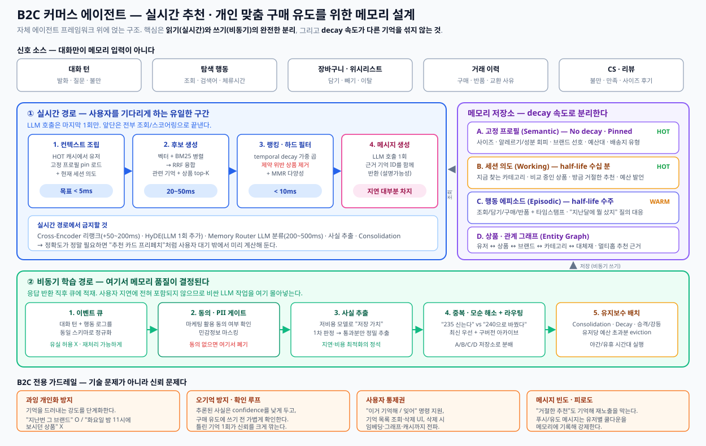

# 06. 커머스 적용 설계 — 실시간 추천과 개인 맞춤 구매 유도



앞선 문서들의 내용을 **B2C 커머스 에이전트**라는 목표에 맞춰 하나의 설계로 수렴시킨다.

**목표**
1. **실시간 추천** — 대화·행동 맥락에 맞는 상품을 즉시 제안
2. **개인 맞춤 구매 유도 메시지** — 유저별 맥락을 근거로 한 설득력 있는 메시지

**전제**: 자체 에이전트 프레임워크를 이미 운영 중이며, 메모리 계층을 직접 설계·소유한다.

---

## 1. 설계 원칙 4가지

| 원칙 | 내용 |
|------|------|
| **읽기와 쓰기를 분리한다** | LLM을 쓰는 무거운 작업(extraction, consolidation, routing)은 전부 비동기 쓰기 경로로. 실시간 경로에는 LLM 호출을 **응답 생성 1회**만 남긴다 |
| **Retention을 유형별로 분리한다** | "지금 사고 싶은 것"과 "원래 사이즈"를 같은 decay 정책에 넣으면 개인화가 무너진다 |
| **대화만이 메모리 입력이 아니다** | 조회·장바구니·구매·반품·CS 이벤트가 대화보다 강한 신호다. 처음부터 동일 스키마로 흡수해야 한다 |
| **틀린 기억은 없는 기억보다 나쁘다** | 커머스에서 오기억 1회는 신뢰를 크게 깎는다. Confidence를 반드시 함께 저장하고, 낮으면 확인 루프를 태운다 |

---

## 2. 메모리 스키마

### A. User Profile (Semantic Memory)

가장 중요한 저장소. **제약(constraint)과 선호(preference)를 반드시 구분한다.**

```jsonc
{
  "user_id": "u_123",
  "facts": [
    {
      "fact_id": "f_001",
      "type": "constraint",        // constraint | preference | intent | context
      "key": "allergy",
      "value": "땅콩",
      "confidence": 1.0,
      "source": "explicit",        // explicit | inferred | behavioral
      "pinned": true,              // decay 면제
      "created_at": "2026-03-01T...",
      "updated_at": "2026-03-01T...",
      "supersedes": null
    },
    {
      "fact_id": "f_002",
      "type": "preference",
      "key": "brand_affinity",
      "value": "브랜드A",
      "confidence": 0.7,
      "source": "behavioral",      // 구매 3회에서 추론
      "pinned": false,
      "half_life_days": 120
    }
  ]
}
```

| type | 의미 | 정책 | 예시 |
|------|------|------|------|
| **constraint** | 위반하면 안 되는 하드 조건 | `pinned: true`, decay 면제, **추천 단계에서 하드 필터** | 알레르기, 사이즈, 예산 상한, 배송 불가 지역 |
| **preference** | 소프트 선호 | long half-life (90~180일), 랭킹 가중치 | 브랜드 선호, 색상 취향, 가격대 |
| **intent** | 지금의 구매 의도 | short half-life (수십 분~수시간) | "겨울 코트 찾는 중", "선물용" |
| **context** | 상황 정보 | medium half-life | 자녀 연령, 반려동물 유무, 직업 |

> **constraint를 랭킹 가중치로 다루면 안 된다.** 알레르기·사이즈는 점수가 아니라 **필터**여야 한다. 이 구분이 커머스 메모리 설계에서 가장 중요하다.

### B. Session Intent (Working / Short-term Memory)

```jsonc
{
  "session_id": "s_456",
  "user_id": "u_123",
  "current_category": "outerwear",
  "compared_items": ["p_1", "p_2", "p_3"],
  "rejected_recommendations": ["p_9", "p_12"],   // 재노출 방지
  "stated_budget": 200000,
  "turn_summary": "겨울 코트, 방수 기능 원함, 20만원대",
  "ttl_seconds": 3600
}
```

`rejected_recommendations`는 자주 빠뜨리는 필드다. **거절한 추천을 기억하지 않으면 같은 상품을 반복 제안해 피로도를 만든다.**

### C. Behavior Episodes (Episodic Memory)

```jsonc
{
  "episode_id": "e_789",
  "user_id": "u_123",
  "event_type": "purchase",     // view | cart_add | cart_remove | purchase | return | cs_contact
  "product_id": "p_55",
  "event_time": "2026-07-14T...",
  "metadata": { "size": "M", "price": 189000, "return_reason": null },
  "half_life_days": 30
}
```

**반품 사유는 특히 가치가 높다.** "사이즈가 작았다"는 반품 1건이 프로필의 `size` 사실을 갱신해야 한다.

### D. Product Graph (Entity / Graph Memory)

```
(User)-[:PURCHASED {at}]->(Product)
(User)-[:VIEWED {at, dwell_sec}]->(Product)
(User)-[:RETURNED {at, reason}]->(Product)
(Product)-[:BELONGS_TO]->(Category)
(Product)-[:MADE_BY]->(Brand)
(Product)-[:SUBSTITUTE_OF]->(Product)
(Product)-[:COMPLEMENTS]->(Product)
```

Phase 3 이후. 1-hop만 필요하면 RDB 조인이 더 싸다는 점을 잊지 말 것.

---

## 3. 저장소 배치

| 데이터 | 저장소 | Tier | 근거 |
|--------|--------|------|------|
| Session Intent | Redis (Hash + TTL) | HOT | 세션 스코프, sub-ms 필요 |
| Pinned constraints | Redis (유저별 캐시) | HOT | 매 턴 무조건 로드되므로 캐싱 필수 |
| User Profile 전체 | PostgreSQL + pgvector | WARM | 정형 필터(`type=constraint`) + 시맨틱 검색 동시 필요 |
| Behavior Episodes | PostgreSQL 이벤트 테이블 + 벡터 인덱스 | WARM | **time-range 필터가 1급 시민**이어야 함 |
| 상품 카탈로그 | 검색 엔진 (Azure AI Search 등) | WARM | Structured RAG — 속성 필터 + BM25 + 벡터 |
| Product Graph | Neo4j / Cosmos DB Gremlin | WARM | Phase 3 |
| 과거 이력·감사 로그 | Blob Storage (Cool/Archive) | COLD | 규제 보존 |

**Phase 1 최소 구성은 Redis + PostgreSQL 두 개다.** 이것으로 개인화의 대부분을 커버할 수 있다.

---

## 4. 실시간 경로 — 지연 예산

| 단계 | 작업 | 목표 지연 | LLM 호출 |
|------|------|----------|---------|
| 1. Context Assembly | Redis에서 pinned constraints + session intent 로드 | **< 5ms** | 없음 |
| 2. Candidate Generation | 벡터 + BM25 병렬 → RRF 융합. 관련 기억 top-K + 상품 top-N | **20~50ms** | 없음 |
| 3. Ranking & Hard Filter | constraint 위반 상품 제거 → temporal decay 가중 → MMR 다양성 | **< 10ms** | 없음 |
| 4. Message Generation | 응답·추천 메시지 생성 | 모델 지연 | **1회** |
| | **메모리 오버헤드 합계** | **35~65ms** | |

### 실시간 경로에서 금지

| 금지 항목 | 비용 | 대안 |
|----------|------|------|
| Cross-Encoder 리랭크 | +50~200ms | 프리페치 추천 카드에서만 사용 |
| HyDE 쿼리 확장 | LLM 1회 + 오답 유도 위험 | 사용 안 함 |
| Memory Router (LLM 분류) | 200~500ms | 쓰기 경로로 이동. 읽기는 규칙 기반 사전 필터 |
| Fact Extraction | 200~500ms | 응답 후 비동기 큐로 |
| Consolidation | 클러스터당 LLM 호출 | 야간 배치 |

정확도가 정말 필요한 경우 **"추천 카드 프리페치"** 처럼 사용자 대기 밖에서 미리 계산해 둔다.

---

## 5. 비동기 학습 경로

```
응답 반환 → 이벤트 큐 적재 → (worker)
  ↓
1. 정규화        대화 턴 + 행동 로그를 동일 스키마로
2. 동의·PII 게이트  마케팅 활용 동의 확인, 민감정보 마스킹, 미동의 시 폐기
3. 사실 추출      저비용 모델로 "저장 가치" 1차 판정 → 통과분만 정밀 추출
4. 중복·모순 해소  코사인 > 0.85 중복 / 0.50~0.85 모순 검사 → 최신 우선, 구버전 아카이브
5. 라우팅·저장    A/B/C/D 저장소로 분배
  ↓
(야간 배치)
6. Consolidation · Decay · 승격/강등 · 유저당 예산 초과분 eviction
```

### 행동 신호 → 사실 변환 규칙 예시

| 행동 신호 | 추출 사실 | type | confidence |
|----------|----------|------|-----------|
| 동일 브랜드 3회 구매 | `brand_affinity: 브랜드A` | preference | 0.7 |
| "사이즈 작음"으로 반품 | `size: 기존값 → 한 단계 위` | constraint | 0.9 |
| 특정 카테고리 10분 이상 체류 | `intent: 해당 카테고리 탐색 중` | intent | 0.6 |
| 장바구니 담고 3회 이탈 | `price_sensitivity: high` | preference | 0.5 |
| 명시 발언 "땅콩 알레르기 있어요" | `allergy: 땅콩` | constraint | 1.0 |

**명시 발언(explicit)과 행동 추론(behavioral)의 confidence를 반드시 구분한다.** 추론된 사실을 구매 유도 메시지에 직접 인용하면 오기억 리스크가 커진다.

---

## 6. Retention 정책

| 데이터 | 정책 | 값 |
|--------|------|-----|
| Session Intent | TTL | 30분 ~ 1시간 |
| constraint (알레르기·사이즈·예산) | **Pinned** — decay 면제 | — |
| preference (브랜드·색상) | Long half-life | 90~180일 |
| intent (지금 찾는 것) | Short half-life | 30분 ~ 수시간 |
| context (자녀 연령 등) | Medium half-life | 180일+ |
| Behavior Episodes | Medium half-life + 접근 시 reinforcement | 14~60일 |
| rejected_recommendations | Session TTL + 유저별 쿨다운 로그는 30일 | — |
| Product Graph | No decay (edge timestamp로 시간 추론) | — |
| 감사 로그 | Retention period | 규제 기준 |

**Decay 파라미터는 반드시 실험으로 정한다.** half-life가 짧으면 건망증, 길면 시간 인식의 의미가 없어진다.

---

## 7. 추천·메시지 생성에서 메모리 활용

### 추천 파이프라인

```
1) HARD FILTER   ← constraint (알레르기·사이즈·예산·배송지)
                    위반 상품은 후보에서 제거. 점수화하지 않는다.
2) CANDIDATE     ← 세션 의도 + 최근 에피소드 + 상품 카탈로그 (하이브리드 검색)
3) RANKING       ← preference 가중치 × temporal decay × 비즈니스 규칙(재고·마진)
4) DIVERSITY     ← MMR. rejected_recommendations 제외
5) EXPLAIN       ← 각 추천에 근거 memory_id를 부착
```

**5번(근거 부착)이 구매 유도 메시지 품질을 결정한다.** 근거 없이 생성하면 그럴듯한 거짓말이 섞인다.

### 구매 유도 메시지 — 개인화 강도 단계화

| 단계 | 근거로 쓰는 기억 | 표현 예시 | 안전도 |
|------|----------------|----------|--------|
| **L1 — 일반** | 없음 | "이번 주 인기 상품이에요" | 안전 |
| **L2 — 카테고리** | intent | "겨울 아우터 찾고 계셨죠" | 안전 |
| **L3 — 선호** | preference (confidence ≥ 0.7) | "평소 즐겨 보시던 브랜드A 신상이에요" | 보통 |
| **L4 — 이력** | episode (explicit) | "지난번 구매하신 코트와 잘 어울려요" | 주의 |
| **L5 — 정밀** | 세부 행동 로그 | "화요일 밤 11시에 보시던 그 상품이 할인 중이에요" | **금지** |

**L5는 하지 않는다.** 기술적으로 가능하다는 것과 해도 된다는 것은 다르다. 과잉 개인화는 이탈을 부른다.

### 확인 루프 (Confirmation Loop)

`confidence < 0.7`인 추론 사실을 구매 유도에 쓰기 전에는 가볍게 확인한다.

```
❌ "M 사이즈로 준비해드릴게요"            (추론된 사실을 단정)
✅ "지난번처럼 M으로 보여드릴까요?"        (확인 + 자연스러움)
```

---

## 8. 안티패턴

| 안티패턴 | 왜 문제인가 | 대응 |
|---------|-----------|------|
| 모든 기억에 동일 decay 적용 | 세션 의도가 취향을 밀어내거나, 그 반대가 발생 | 유형별 retention 분리 |
| constraint를 랭킹 가중치로 처리 | 알레르기 상품이 상위에 노출될 수 있음 | 하드 필터로 처리 |
| 거절 이력 미기록 | 같은 추천 반복 → 피로도 | `rejected_recommendations` 필수 |
| 추론 사실을 단정적으로 인용 | 오기억 1회로 신뢰 붕괴 | confidence 기반 확인 루프 |
| 실시간 경로에 LLM 추출 | 지연 폭증 | 비동기 쓰기 경로로 이동 |
| 대화만 메모리 입력으로 취급 | 커머스에서 행동 신호가 더 강함 | 이벤트를 1급 입력으로 |
| Memory Router를 읽기 경로에 배치 | 200~500ms + 조용한 실패 | 쓰기 경로 전용 |
| 삭제 요청 시 임베딩·그래프 누락 | GDPR 위반 | 전 계층 삭제 체크리스트 |
| 평가 없이 개인화 강도만 올림 | 개선인지 악화인지 판단 불가 | baseline 먼저 |

---

## 9. 프라이버시와 규제

| 항목 | 요구사항 |
|------|---------|
| **마케팅 활용 동의** | 구매 유도 메시지에 쓸 기억은 동의 범위 안에서만. 비동기 경로 초입에서 게이트 |
| **삭제권 (Right to Erasure)** | 원문·추출사실·임베딩·그래프 노드/엣지·캐시·아카이브까지 전파. 감사 로그 남길 것 |
| **사용자 통제권** | "이거 기억해 / 잊어" 명령 지원, 기억 목록 조회·삭제 UI |
| **민감 카테고리** | 건강·종교·정치 관련 추론은 저장 자체를 금지 목록으로 관리 |
| **메시지 빈도 제한** | 유저별 쿨다운을 메모리에 기록해 강제. 피로도가 곧 이탈 |

---

## 10. 단계별 로드맵

### Phase 0 — 기반 (선행 필수)
- [ ] 커스텀 평가 하네스 구축 (Recall@K / Precision@K / Faithfulness)
- [ ] 현재 시스템 baseline 측정
- [ ] 이벤트 스키마 정의 (대화 + 행동 통합)
- [ ] PII 스캔 + 동의 게이트

> **Phase 0을 건너뛰면 이후 모든 개선이 추측이 된다.**

### Phase 1 — Dual-Store 개인화
- [ ] Redis: Session Intent (TTL)
- [ ] PostgreSQL + pgvector: User Profile (constraint / preference 구분)
- [ ] 비동기 사실 추출 워커
- [ ] Cross-Session 복원 (재방문 유저 식별)
- [ ] 하이브리드 검색 (vector + BM25 + RRF)
- [ ] 추천 하드 필터 (constraint 위반 제거)
- **기대 효과**: 되묻지 않는 에이전트, 기본 개인화 추천

### Phase 2 — 시간 인식과 유지보수
- [ ] Temporal Memory — 유형별 half-life, 선택적 decay
- [ ] Behavior Episodes 저장 + time-range 질의
- [ ] Consolidation 야간 배치 (중복·모순 해소)
- [ ] Forgetting & Decay + pin 예외 목록
- [ ] rejected_recommendations 및 쿨다운
- [ ] 개인화 강도 L1~L4 단계화
- **기대 효과**: "지금의 의도"와 "원래 취향"을 구분하는 추천, 구매 유도 메시지 품질 향상

### Phase 3 — 규모와 관계
- [ ] HOT/WARM 티어링 + promotion/demotion
- [ ] Structured RAG (상품·주문 정밀 질의)
- [ ] Product Graph (관계 기반 추천, 크로스셀)
- [ ] 관측성 대시보드 + 비용 추적
- [ ] GDPR 삭제 전 계층 전파 자동화
- **기대 효과**: 대규모 트래픽에서 지연·비용 통제, 멀티홉 추천

### Phase 4 — 선택적 고도화
- [ ] Memory Routing (쓰기 경로)
- [ ] Procedural Memory (반품·교환 워크플로 학습)
- [ ] Self-Reflection (실패한 추천으로부터 학습)
- [ ] COLD 아카이브 + 샤딩

---

## 11. 평가 지표 — 기술 + 비즈니스

기술 지표만 좋아지고 비즈니스 지표가 그대로면 메모리 투자는 실패한 것이다. **반드시 함께 본다.**

| 층위 | 지표 | 확인하는 것 |
|------|------|-----------|
| **Retrieval** | Recall@K, Precision@K, MRR | 올바른 기억을 찾는가 |
| **Faithfulness** | LLM-as-Judge 정확도 | 기억을 올바르게 사용하는가 |
| **Freshness** | Temporal Accuracy, staleness rate | 오래된 사실을 내놓는가 |
| **Consistency** | Contradiction rate | 모순이 쌓이는가 |
| **System** | p95 검색 지연, 캐시 적중률, 유저당 저장소 크기, 월 비용 | 감당 가능한가 |
| **Product** | 추천 CTR, 추천 경유 전환율(CVR), 객단가(AOV) | 실제로 팔리는가 |
| **Trust** | 추천 거절률, 메시지 옵트아웃률, "그거 아닌데" 발화 빈도 | 신뢰를 잃고 있지 않은가 |

**Trust 지표를 반드시 추적한다.** CTR이 오르면서 옵트아웃률이 함께 오른다면 과잉 개인화 신호다.

### 권장 실험 설계
```
A: 메모리 없음 (baseline)
B: Phase 1 메모리 (constraint 필터 + preference 랭킹)
C: Phase 2 메모리 (+ temporal decay + 거절 이력)

→ 각 그룹의 CTR / CVR / 옵트아웃률을 동시에 비교
→ 기술 지표 개선분이 비즈니스 지표로 전이되는지 확인
```

---

## 참고 자료

1. [Microsoft — 13-agent-memory](https://github.com/microsoft/ai-agents-for-beginners/tree/main/13-agent-memory) — 메모리 유형, Structured RAG, self-improving 패턴
2. [Agent Memory Techniques](https://github.com/NirDiamant/Agent_Memory_Techniques) — 기법 09 · 10 · 18 · 19 · 20 · 21 · 30
3. [Mem0](https://github.com/mem0ai/mem0) — user_id 스코프 개인화 참고 구현
4. [GDPR Article 17 — Right to erasure](https://gdpr-info.eu/art-17-gdpr/)
