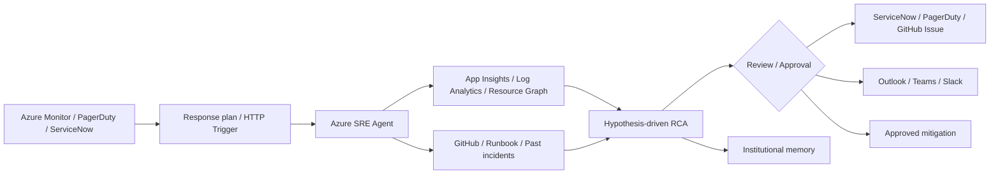
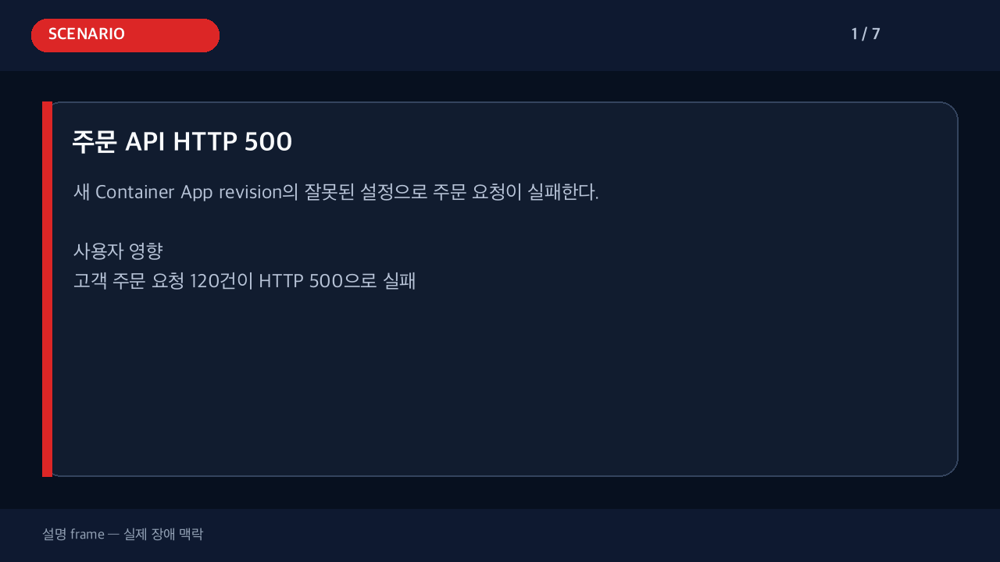

# Azure SRE Agent: Alert에서 원인 분석·티켓·알림까지

Azure SRE Agent는 Azure Monitor alert를 시작점으로 telemetry, resource configuration, deployment history, source code, runbook, 과거 incident를 연결해 **root cause와 안전한 조치 방안**을 제시하는 AI 기반 reliability assistant다.

> 이 문서는 제품 기능을 소개하고 실제 운영 패턴을 보여주는 입문 자료다.  
> 수치·원본 timeline·점수는 [실제 동작 검증 부록](../docs/superpowers/reports/2026-08-12-azure-sre-agent-event-testing-results.md)에서 확인할 수 있다.

## 왜 필요한가

일반적인 장애 대응은 alert를 확인한 뒤 여러 도구를 오가며 사람이 직접 맥락을 조합한다.

| 기존 대응 | Azure SRE Agent를 적용한 대응 |
|---|---|
| Alert를 읽고 담당자가 조사 시작 | Incident가 response plan 또는 trigger로 Agent에 전달 |
| Monitor, App Insights, Activity Log, GitHub를 각각 확인 | Agent가 필요한 도구를 선택해 evidence를 수집 |
| 원인을 사람의 머릿속에서 추론 | Hypothesis를 세우고 evidence로 검증·기각 |
| 채팅·티켓·메일을 사람이 다시 작성 | 같은 structured summary를 ticket·email·Teams로 전달 |
| 해결 경험이 담당자에게만 남음 | Root cause와 resolution이 Agent memory에 축적 |

Microsoft Learn은 이를 “observability tools, incident platforms, source code repositories를 하나의 automated workflow로 연결하는 방식”으로 설명한다.

- [Microsoft Learn: Overview of Azure SRE Agent](https://learn.microsoft.com/azure/sre-agent/overview)

## 한눈에 보는 동작



```text
Detect → Investigate → Recommend/Act → Communicate → Learn
```

### Detect

- Azure Monitor Alerts
- PagerDuty
- ServiceNow
- HTTP Trigger를 지원하는 외부 시스템
- Scheduled task 기반 proactive check

### Investigate

Connector를 추가하지 않아도 managed identity와 Azure RBAC를 통해 다음 Azure 자료를 조사할 수 있다.

- Application Insights requests, exceptions, dependencies
- Log Analytics
- Azure Monitor metrics
- Azure Resource Graph와 resource configuration
- Azure Activity Log와 deployment history
- AKS diagnostics와 Azure CLI

### Correlate

- GitHub/Azure DevOps repository와 최근 변경
- Runbook·architecture 문서·wiki
- 유사한 과거 incident와 resolution

### Recommend or act

- **ReadOnly:** 조사만 수행
- **Review:** 조사 후 변경 전에 사람의 승인 요청
- **Autonomous:** 허용된 action을 자동 수행

처음 도입할 때는 Review mode로 조사 품질과 tool selection을 검증하는 것이 안전하다.

### Communicate and learn

- ServiceNow/PagerDuty incident update
- GitHub Issue 또는 Azure DevOps work item
- Outlook email
- Teams/Slack notification
- Root cause와 resolution을 Agent memory에 축적

## Log search가 아니라 가설 기반 조사

Azure SRE Agent는 단순히 “error log를 찾아서 나열”하지 않는다.

1. affected resource와 incident window를 정의한다.
2. 가능한 root-cause hypothesis를 만든다.
3. metrics, traces, changes, code로 각각 검증한다.
4. 맞지 않는 hypothesis를 버린다.
5. full evidence chain과 uncertainty를 포함해 결론을 설명한다.


*출처: [Microsoft Learn — Root Cause Analysis in Azure SRE Agent](https://learn.microsoft.com/azure/sre-agent/root-cause-analysis)*

## Incident를 어떤 Agent가 처리할지 정한다

Response plan은 severity, impacted service, incident type, title keyword로 incident를 분류하고 적절한 custom agent와 autonomy level을 연결한다.


*출처: [Microsoft Learn — Set Up Incident Response](https://learn.microsoft.com/azure/sre-agent/tutorial-incident-response)*

주의할 점:

- 처음 incident platform을 연결하면 quickstart plan이 같이 생성될 수 있다.
- custom response plan과 중복 처리되지 않도록 quickstart plan을 확인한다.
- 신규 workflow는 Review mode로 시작한다.

## 과거 경험과 runbook을 다시 사용한다

Agent는 connected repository, knowledge document, 유사 incident memory를 조사에 사용한다. 같은 장애가 반복되면 처음부터 모든 discovery를 반복하지 않고 기존 맥락을 활용할 수 있다.


*출처: [Microsoft Learn — Set Up Incident Response](https://learn.microsoft.com/azure/sre-agent/tutorial-incident-response)*

---

# 대표 운영 패턴: 주문 API HTTP 500

## 1. 상황

새 Container App revision의 잘못된 설정으로 `/api/orders`가 HTTP 500을 반환한다.

```text
서비스: ca-sre-event-lab-vnet
영향: 주문 요청 120건 실패
탐지: Azure Monitor scheduled-query alert
안전 모드: Review
```

### 운영자가 기대하는 것

Agent가 다음 질문에 근거를 들어 답해야 한다.

1. 어떤 resource와 endpoint가 영향을 받았는가?
2. 정확한 장애 시작 시각은 언제인가?
3. 외부 dependency 문제인가, application 문제인가?
4. 어떤 deployment/configuration change가 장애와 연결되는가?
5. 현재 서비스는 복구됐는가?
6. 가장 작은 reversible mitigation은 무엇인가?

## 2. 이벤트 전달

이번 lab은 공개 API로 재현 가능한 공식 HTTP Trigger 패턴을 사용했다.

```text
Azure Monitor alert
  → Action Group
  → Logic App managed identity bridge
  → Azure SRE Agent HTTP Trigger
  → Review-mode investigation thread
```

실제 production에서는 Azure Monitor response plan, PagerDuty, ServiceNow를 직접 incident platform으로 사용할 수도 있다.

## 3. 실제 Agent 조사

아래 storyboard는 **설명 frame**과 **실제 Agent API evidence frame**을 구분한다.



### 실제 확인한 evidence

| 조사 단계 | 확인한 내용 |
|---|---|
| Incident boundary | `ca-sre-event-lab-vnet`, `GET /api/orders` |
| Telemetry | HTTP 500 request 120건 |
| Change correlation | revision `0000010`, `FAILURE_MODE=http500` |
| Source/context | connected repository와 Activity Log |
| Recovery | `FAILURE_MODE=none` revision이 traffic 처리 |
| Safety | Agent가 resource를 직접 변경하지 않음 |

### 실제 결과

| 지표 | 결과 |
|---|---:|
| Alert → Agent thread | 2초 |
| Thread → 구조화 결론 | 143초 |
| Root-cause 평가 | 10/10 |

Agent의 결론:

```text
Root cause:
Container App revision 0000010이 FAILURE_MODE=http500으로 배포됨.

Impact:
GET /api/orders 요청 120건이 HTTP 500으로 실패.

Mitigation:
정상 설정 revision으로 traffic을 복귀.

Current status:
후속 revision에서 5xx가 관찰되지 않음.
```

## 4. 운영 결과: Ticket

분석 결과는 사람이 다시 작성하지 않고 ticket template으로 변환할 수 있다.

- [실제 GitHub Issue #43](https://github.com/hellices/devguidesample/issues/43)
- [Issue metadata](sre-agent-event-lab/assets/notifications/github-issue.json)
- [Issue 화면 캡처](sre-agent-event-lab/assets/notifications/github-issue.png)
- [Issue body 원문](sre-agent-event-lab/assets/notifications/s1-github-issue.md)

Production 선택지:

| 시스템 | 사용 패턴 |
|---|---|
| ServiceNow | Incident 생성·discussion update·acknowledge·resolve |
| PagerDuty | Triggered incident pickup·acknowledge·resolve |
| GitHub | Issue 생성·관련 code/PR 연결 |
| Azure DevOps | Work item 생성·repository/commit 연결 |
| Jira | Managed connector 또는 MCP ticketing tool |

## 5. 운영 결과: Email

이번 lab에서는 외부 수신자와 OAuth consent 없이 email을 실제 전송하지 않는다. 같은 conclusion으로 Outlook-compatible draft와 preview를 생성한다.


- [HTML email](sre-agent-event-lab/assets/notifications/s1-incident-summary.html)
- [RFC 5322 `.eml`](sre-agent-event-lab/assets/notifications/s1-incident-summary.eml)

Production에서는 Outlook connector의 Send email operation을 사용한다.

- `To`: User-defined로 on-call distribution list에 고정
- `Subject`, `Body`: Agent-defined
- Review workflow: write action은 승인 후 실행
- Autonomous workflow: 승인 bypass 가능성을 고려해 별도 최소권한 connector 사용

---

# Connector로 기존 운영 도구에 연결

Azure 내부 telemetry는 built-in tool만으로 조사할 수 있다. Connector는 외부 시스템과 persistent context가 필요할 때 추가한다.


*출처: [Microsoft Learn — Managed connectors](https://learn.microsoft.com/azure/sre-agent/managed-connectors)*

## 필요한 operation만 노출

예를 들어 Jira connector에서 Search/Get은 허용하고 Create Issue는 제외할 수 있다.


*출처: [Microsoft Learn — Managed connectors](https://learn.microsoft.com/azure/sre-agent/managed-connectors)*

## 민감한 parameter를 고정

Email 수신자, Jira project key처럼 Agent가 임의로 바꾸면 안 되는 값은 User-defined parameter로 lock한다.


*출처: [Microsoft Learn — Managed connectors](https://learn.microsoft.com/azure/sre-agent/managed-connectors)*

> Managed connector는 configuring user의 credential을 사용한다. 모든 Agent user가 enabled operation을 호출할 수 있으므로 operation과 parameter를 최소 범위로 제한해야 한다.

---

# 같은 조사 패턴이 적용되는 다른 장애

## Latency anomaly

**상황:** HTTP 200이지만 `/api/orders` p95가 4초로 상승.

**Agent가 구분해야 할 것:**

- availability incident인가?
- external dependency가 느린가?
- application configuration이 지연을 만들었는가?

**실제 결과:** 90개 request가 약 4초였고 exception/dependency latency 없이 `ORDER_DELAY_MS=4000` revision을 root cause로 식별했다.

[S2 storyboard](sre-agent-event-lab/assets/storyboards/s2/investigation-guide.gif)

## RBAC dependency failure

**상황:** workload identity의 Blob Data Reader role이 삭제되어 Blob 403과 API 503 발생.

**Agent가 연결해야 할 것:**

- Activity Log의 role assignment deletion
- App Dependencies의 Blob 403
- Application의 503 mapping
- original least-privilege scope

**실제 결과:** role deletion과 첫 failure 사이 0.4초 causal chain을 찾았다. 단, old app FQDN을 recovery check에 사용한 오류가 있었고 이후 deployment-unique telemetry로 보정했다.

[S3 storyboard](sre-agent-event-lab/assets/storyboards/s3/investigation-guide.gif)

---

# Static Alert에서 Dynamic Threshold로

이번 당일 실험은 장애를 반드시 발생시키기 위해 static threshold를 사용했다. 운영에서는 numeric signal의 정상 패턴을 학습하는 Dynamic Threshold를 shadow mode로 추가할 수 있다.

- 최소 3일·30 samples 전에는 alert가 발화하지 않음
- 최근 10일을 baseline으로 사용
- weekly seasonality는 최소 3주 필요
- Log Search alert의 1분 dynamic evaluation은 지원되지 않음
- 기존 Action Group과 SRE workflow를 재사용 가능

자세한 설계: [Dynamic Thresholds와 SRE Agent 연계](../docs/superpowers/specs/2026-08-12-azure-monitor-dynamic-thresholds-sre-integration-design.md)

---

# 도입 체크리스트

## Context

- [ ] 조사 대상 subscription/resource group을 최소 범위로 연결
- [ ] Application Insights/Log Analytics telemetry 확인
- [ ] 실제 배포 branch의 source repository 연결
- [ ] runbook과 escalation policy upload

## Incident routing

- [ ] Azure Monitor, PagerDuty, ServiceNow 중 incident platform 선택
- [ ] severity/service/title filter 정의
- [ ] quickstart plan 중복 여부 확인
- [ ] Review mode로 첫 response plan 실행

## Safety

- [ ] Agent identity는 Reader부터 시작
- [ ] write action은 최소 scope와 reversible operation만 허용
- [ ] connector operation allowlist
- [ ] recipient/project key 같은 parameter lock
- [ ] Agent action과 approval audit 확인

## Quality

- [ ] affected resource·onset·impact가 정확한가?
- [ ] hypothesis와 evidence chain이 있는가?
- [ ] uncertainty와 missing evidence를 표시하는가?
- [ ] mitigation이 최소 범위이고 안전한가?
- [ ] 실제 복구를 올바른 endpoint에서 확인하는가?

# 한계와 운영 원칙

- AI가 잘못된 결론이나 부적절한 mitigation을 제안할 수 있다.
- connected source가 실제 배포 branch와 다르면 code correlation이 실패한다.
- 같은 service name을 여러 workload가 공유하면 telemetry를 혼동할 수 있다.
- OAuth connector는 connection owner의 권한으로 동작한다.
- Autonomous mode에서는 일부 approval guardrail이 bypass될 수 있다.
- 제품 지역·tenant·preview 기능 가용성은 달라질 수 있다.

따라서 **충분한 evidence, 최소 권한, Review-first, 실제 복구 검증**이 운영 도입의 기본 원칙이다.

# 더 보기

- [실제 동작 검증 부록](../docs/superpowers/reports/2026-08-12-azure-sre-agent-event-testing-results.md)
- [Lab 운영 및 재현 가이드](sre-agent-event-lab/README.md)
- [Microsoft Learn — Azure SRE Agent](https://learn.microsoft.com/azure/sre-agent/)
- [Microsoft Learn — Incident response](https://learn.microsoft.com/azure/sre-agent/tutorial-incident-response)
- [Microsoft Learn — Connectors](https://learn.microsoft.com/azure/sre-agent/connectors)
- [Microsoft Learn — Managed connectors](https://learn.microsoft.com/azure/sre-agent/managed-connectors)
