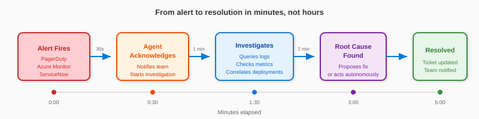
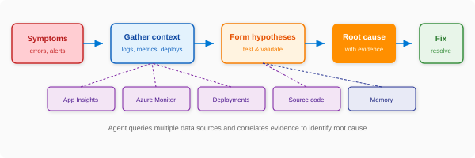
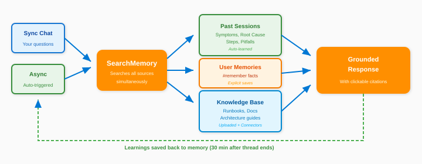
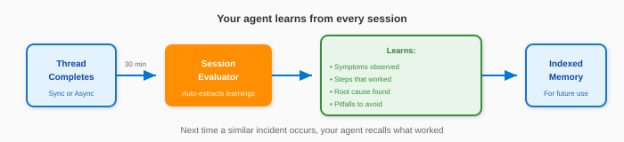
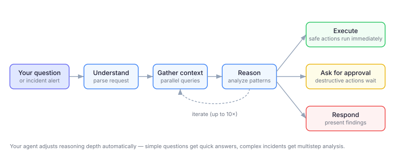
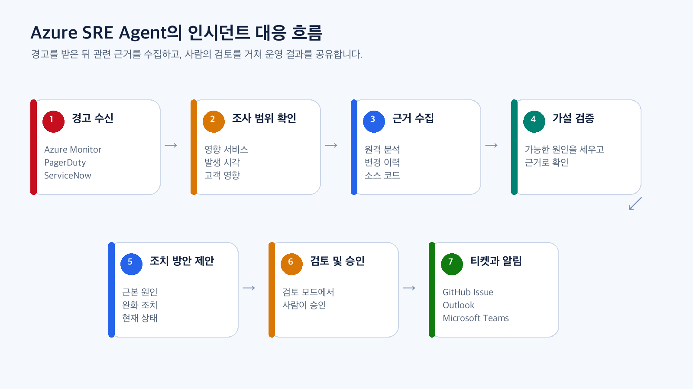
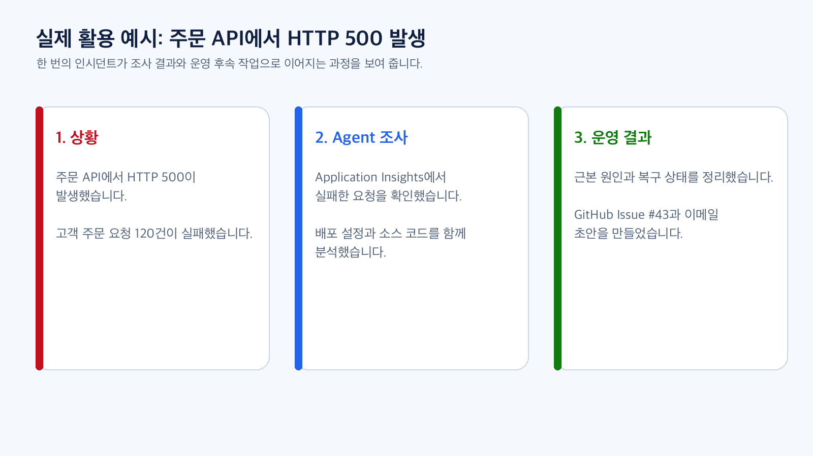
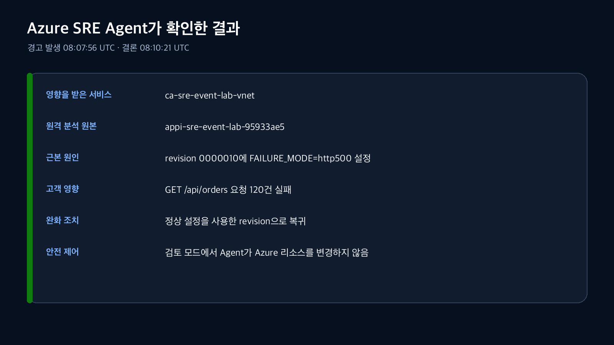
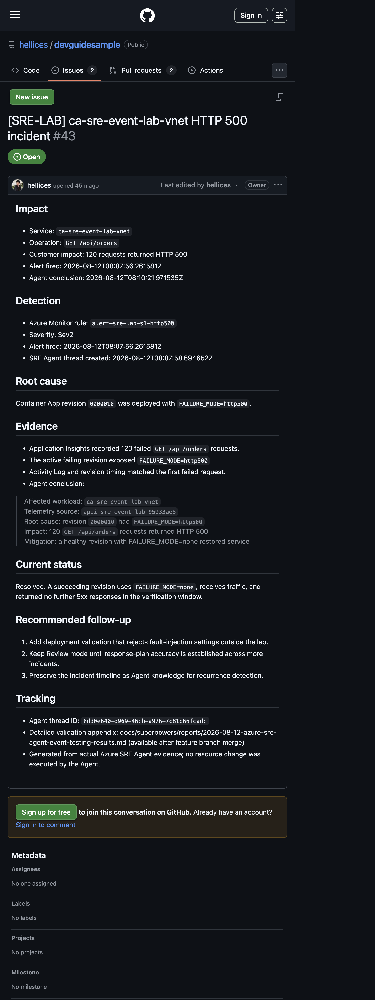
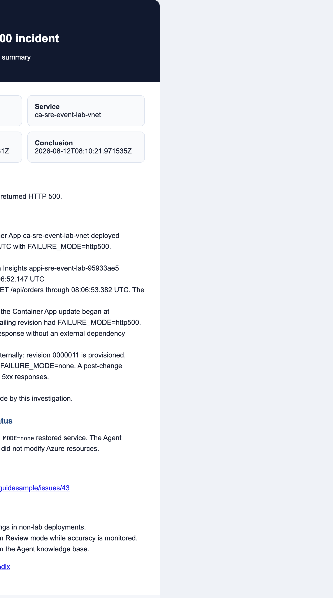

# Azure SRE Agent 소개

Azure SRE Agent는 Azure 운영 환경에서 발생한 인시던트를 자동으로 조사하고, 관련 근거를 바탕으로 근본 원인과 조치 방안을 제안하는 AI 기반 운영 도우미입니다.

이 문서에서는 Azure SRE Agent가 인시던트를 조사하는 방식과 실제 활용 예시를 소개합니다. 제품에서 제공하는 표준 기능과 이번 실증에서 확인한 내용을 구분해 설명합니다.

## Azure SRE Agent를 사용하면 무엇이 달라지나요?

운영자는 경고가 발생하면 여러 도구를 오가며 원인을 찾아야 합니다. Azure SRE Agent는 이 과정을 하나의 조사 흐름으로 연결합니다.

| 기존 장애 대응 | Azure SRE Agent를 활용한 대응 |
|---|---|
| 담당자가 경고를 확인한 뒤 조사를 시작합니다. | 대응 계획에 따라 에이전트가 자동으로 조사를 시작합니다. |
| 모니터링 화면, 로그, 변경 이력, 소스 코드를 각각 확인합니다. | 에이전트가 필요한 자료를 선택해 함께 분석합니다. |
| 담당자가 여러 가능성을 머릿속에서 비교합니다. | 에이전트가 가설을 세우고 근거를 통해 확인하거나 제외합니다. |
| 조사 결과를 티켓과 메일로 다시 작성합니다. | 같은 조사 결과를 GitHub Issue, Outlook, Microsoft Teams 등에 전달할 수 있습니다. |
| 해결 경험이 담당자 개인에게 남습니다. | 근본 원인과 해결 과정을 지식으로 축적할 수 있습니다. |

Azure SRE Agent는 단순히 오류 로그를 나열하지 않습니다. 어떤 서비스가 영향을 받았는지 확인하고, 원격 분석 데이터와 변경 이력, 소스 코드를 함께 살펴본 뒤 근본 원인과 다음 조치를 설명합니다.

## 인시던트가 발생하면 어떻게 조사하나요?



> 출처: [인시던트 대응 자동화](https://learn.microsoft.com/azure/sre-agent/incident-response)

Azure SRE Agent는 다음 순서로 인시던트를 조사합니다.

1. **경고를 받습니다.**

   Azure Monitor, PagerDuty 또는 ServiceNow에서 조사 요청을 받습니다. 이번 실증에서 사용한 별도 연결 방식은 뒤에서 설명합니다.

2. **조사 범위를 확인합니다.**

   영향을 받은 서비스, 발생 시각, 고객 영향을 먼저 정리합니다.

3. **관련 근거를 수집합니다.**

   Application Insights, Log Analytics, Azure Resource Graph, Azure Activity Log, 배포 이력, 소스 코드를 확인합니다.

4. **가설을 세우고 검증합니다.**

   가능한 원인을 여러 개 세운 뒤 수집한 근거와 맞지 않는 원인을 제외합니다.

5. **근본 원인과 조치 방안을 제안합니다.**

   확인한 근거, 현재 상태, 최소 범위의 완화 조치를 함께 설명합니다.

6. **사람이 검토하고 승인합니다.**

   검토 모드에서는 변경 작업을 실행하기 전에 담당자의 승인을 받습니다.

7. **조사 결과를 공유합니다.**

   ServiceNow, PagerDuty, GitHub, Outlook, Microsoft Teams 등 기존 운영 도구로 결과를 전달할 수 있습니다.

## 근본 원인은 어떻게 찾나요?



> 출처: [근본 원인 분석](https://learn.microsoft.com/azure/sre-agent/root-cause-analysis)

## 어떤 정보를 조사할 수 있나요?

Azure SRE Agent는 관리 ID와 Azure RBAC 권한을 사용해 Azure 리소스를 조사합니다.

| 분류 | 확인할 수 있는 정보 |
|---|---|
| 애플리케이션 상태 | Application Insights 요청, 예외, 종속성 호출 |
| 로그 | Log Analytics 작업 영역의 로그 |
| 인프라 상태 | Azure Monitor 메트릭, 리소스 구성, Resource Graph |
| 변경 이력 | Azure Activity Log, 배포 이력, Container Apps 수정 버전 |
| 소스와 문서 | GitHub, Azure DevOps, 운영 절차서, 기술 문서 |
| 과거 경험 | 유사한 인시던트, 이전의 근본 원인과 해결 방법 |

Azure 내부 원격 분석 데이터는 기본 도구만으로도 조회할 수 있습니다. 외부 시스템이나 특정 데이터 원본을 지속해서 사용해야 하는 경우에는 커넥터를 추가합니다.

## 과거 경험과 운영 문서는 어떻게 활용하나요?



> 출처: [메모리와 지식 관리](https://learn.microsoft.com/azure/sre-agent/memory)

## 조사가 끝난 뒤 무엇을 학습하나요?



> 출처: [메모리와 지식 관리](https://learn.microsoft.com/azure/sre-agent/memory)

## 어떤 시스템과 연결할 수 있나요?

### 인시던트 관리

- Azure Monitor 경고
- PagerDuty
- ServiceNow

### 소스와 작업 관리

- GitHub 저장소, Issue, Pull Request
- Azure DevOps 저장소와 Work Item
- Jira와 같은 관리형 커넥터(미리 보기) 또는 MCP 기반 티켓 시스템

### 알림과 협업

- Outlook 메일
- Microsoft Teams 채널
- Slack 채널

### 외부 관찰 도구

- Grafana
- Datadog
- Dynatrace
- New Relic
- Splunk
- MCP를 지원하는 사용자 지정 도구

커넥터에서는 사용할 작업만 선택할 수 있습니다. 메일 수신자나 Jira 프로젝트 키처럼 에이전트가 임의로 바꾸면 안 되는 값은 고정할 수 있습니다.

## 권한과 승인 절차는 어떻게 제어하나요?



> 출처: [에이전트 추론과 실행](https://learn.microsoft.com/azure/sre-agent/agent-reasoning)

요청이 복잡하면 이 과정을 여러 차례 반복하며 판단을 다듬습니다. 각 단계에 걸리는 시간은 상황과 작업 범위에 따라 달라지므로 고정된 처리 시간을 보장하지는 않습니다.

Azure SRE Agent는 실행 수준에 따라 권한을 제어합니다.

| 모드 | 동작 |
|---|---|
| 읽기 전용 모드 | 자료를 조회하고 분석하지만 변경 작업은 실행하지 않습니다. |
| 검토 모드(Review mode) | 조치 방안을 제안하고 담당자의 승인을 기다립니다. |
| 자율 모드 | 허용된 작업을 별도 승인 없이 실행합니다. |

처음 도입할 때는 **검토 모드로 시작하는 것을 권장합니다.** 조사 결과와 도구 선택이 실제 운영 절차에 맞는지 충분히 확인한 뒤 자동화 범위를 넓히는 편이 안전합니다.

커넥터를 설정할 때도 최소 권한 원칙을 적용해야 합니다.

- 읽기 작업과 쓰기 작업을 구분합니다.
- 필요한 작업만 에이전트에 노출합니다.
- 메일 수신자와 프로젝트 키처럼 중요한 값은 고정합니다.
- 삭제나 변경 작업은 승인을 받도록 설정합니다.
- 자율 모드에서는 일부 승인 절차가 생략될 수 있으므로 별도의 최소 권한 연결을 사용합니다.

## 팀에 맞게 어떻게 확장하나요?

기본 에이전트만으로 부족한 영역은 두 가지 방법으로 보완합니다.

| 구분 | 사용 방식 | 적합한 용도 |
|---|---|---|
| 스킬 | 관련 상황에서 에이전트가 자동으로 불러옵니다. | 팀 공통 문제 해결 절차와 실행 도구 |
| 사용자 지정 에이전트 | 담당자가 필요할 때 직접 호출합니다. | 데이터베이스, 보안처럼 특정 영역 전문 조사 |

스킬에는 절차를 담은 문서와 함께 Azure CLI, Kusto 쿼리, Python 스크립트 같은 도구를 연결할 수 있습니다. 따라서 방법을 설명하는 데서 그치지 않고 필요한 조회를 직접 수행합니다. 한 대화에서 동시에 활성화되는 스킬은 **최대 5개**이며, 이 수를 넘으면 오래된 스킬부터 해제되었다가 필요할 때 다시 불러옵니다.

사용자 지정 에이전트는 각자 도구와 커넥터, 사용할 스킬을 따로 지정합니다. 조사 과정에서 다른 전문 에이전트로 작업을 넘기도록 구성할 수도 있어, 인시던트 분류와 상세 조사, 결과 전달을 단계별로 나눌 수 있습니다.

## 인시던트를 담당자에게 어떻게 배분하나요?

대응 계획은 들어온 인시던트를 조건에 따라 적절한 사용자 지정 에이전트로 전달합니다. 다음 조건을 조합할 수 있습니다.

- 심각도 또는 우선순위(여러 값 동시 선택 가능)
- 영향을 받은 서비스
- 인시던트 유형
- 제목에 포함된 키워드

대응 계획마다 실행 수준을 따로 지정할 수 있어, 중요한 장애는 자동 조치를 허용하고 낮은 심각도는 검토 모드로 운영하는 방식이 가능합니다. 계획은 삭제하지 않고 사용 중지할 수 있으므로 정기 점검 기간에도 설정을 유지할 수 있습니다.

인시던트 플랫폼을 처음 연결하면 빠른 시작 대응 계획이 자동으로 만들어집니다. 사용자 정의 대응 계획을 만든 뒤에는 이 계획을 삭제해야 인시던트가 잘못 전달되거나 두 번 처리되지 않습니다.

## 제품에서 기본으로 지원하는 방식

제품의 표준 Azure Monitor 연계는 **Azure Monitor 인시던트 플랫폼 → 대응 계획 → Azure SRE Agent** 순서로 동작합니다. 이 방식에서는 Logic App과 같은 중간 연결이 필요하지 않습니다.

Azure SRE Agent는 다음 기능을 제품에서 기본으로 지원합니다.

- Azure Monitor, PagerDuty, ServiceNow를 통한 인시던트 수신
- 조건에 맞는 인시던트를 담당 에이전트로 전달하는 대응 계획
- Application Insights와 Log Analytics 조사
- GitHub와 Azure DevOps 소스 연결
- ServiceNow와 PagerDuty 상태 갱신
- Outlook과 Microsoft Teams 알림 커넥터
- 읽기 전용, 검토, 자율 실행 모드

자세한 제품 기능은 다음 자료에서 확인할 수 있습니다.

- [Azure SRE Agent 개요](https://learn.microsoft.com/azure/sre-agent/overview)
- [인시던트 대응 설정](https://learn.microsoft.com/azure/sre-agent/tutorial-incident-response)
- [근본 원인 분석](https://learn.microsoft.com/azure/sre-agent/root-cause-analysis)
- [커넥터](https://learn.microsoft.com/azure/sre-agent/connectors)
- [관리형 커넥터(미리 보기)](https://learn.microsoft.com/azure/sre-agent/managed-connectors)

## 이번 실증에서 사용한 방식



[편집 가능한 SVG 보기](sre-agent-event-lab/assets/briefing/sre-agent-process.svg)

이번 실증에서는 대응 계획을 공개 API로 자동 구성하는 데 제약이 있어 Azure SRE Agent의 HTTP Trigger를 사용했습니다.

```text
Azure Monitor 경고
  → Action Group
  → Logic App 관리 ID
  → Azure SRE Agent HTTP Trigger
  → 검토 모드 조사
```

이 연결은 실증 자동화를 위해 사용한 방식이며, 표준 Azure Monitor 연계에 필요한 필수 구성은 아닙니다.

이번 실증에서 실제로 확인한 기능은 다음과 같습니다.

- Azure Monitor 경고에서 Azure SRE Agent 조사 시작
- Application Insights와 Azure Activity Log 분석
- Container Apps 설정과 배포 이력 확인
- GitHub 저장소 검색
- 근본 원인과 조치 방안 작성
- 검토 모드에서 변경 작업을 실행하지 않는 안전 제어
- 실제 GitHub Issue 생성
- Outlook에서 열 수 있는 메일 초안 생성

다음 기능은 이번 실증에서 실제 연결하지 않았습니다.

- ServiceNow
- PagerDuty
- Outlook OAuth 커넥터
- Microsoft Teams 커넥터
- Azure Monitor 기본 대응 계획

## 실제 활용 예시: 주문 API에서 HTTP 500 발생

배포 설정 오류로 주문 API가 HTTP 500을 반환하는 상황을 만들고, Azure SRE Agent가 어떤 근거를 확인하는지 검증했습니다.



[편집 가능한 SVG 보기](sre-agent-event-lab/assets/briefing/s1-three-panel.svg)

### 상황

- 서비스: `ca-sre-event-lab-vnet`
- 영향: `GET /api/orders` 요청 120건 실패
- 탐지: Azure Monitor 경고
- 실행 수준: 검토 모드

### 에이전트에게 기대한 조사

1. 영향을 받은 서비스와 API를 정확히 찾아야 합니다.
2. 장애가 시작된 시각을 확인해야 합니다.
3. 외부 종속성 문제와 애플리케이션 문제를 구분해야 합니다.
4. 장애 직전에 변경된 배포 설정을 찾아야 합니다.
5. 서비스가 정상으로 돌아왔는지 확인해야 합니다.
6. 추가로 필요한 조치를 제안해야 합니다.

### 실제 확인 결과



- Azure Monitor 경고가 발생한 뒤 2초 안에 조사 대화가 생성됐습니다.
- Application Insights에서 실패한 요청 120건을 확인했습니다.
- Container Apps 수정 버전 `0000010`에서 `FAILURE_MODE=http500` 설정을 확인했습니다.
- 정상 설정을 사용한 후속 수정 버전으로 트래픽이 이동한 사실을 확인했습니다.
- 에이전트는 검토 모드에서 Azure 리소스를 직접 변경하지 않았습니다.

## 조사 결과를 티켓으로 전달하기

Azure SRE Agent가 정리한 근본 원인과 조치 방안을 작업 항목으로 전달할 수 있습니다. 이번 실증에서는 같은 조사 결과로 실제 GitHub Issue를 만들었습니다.



- [GitHub Issue #43 열기](https://github.com/hellices/devguidesample/issues/43)
- [Issue 본문 보기](sre-agent-event-lab/assets/notifications/s1-github-issue.md)

Issue에는 다음 내용을 포함했습니다.

- 고객 영향
- 탐지 시각과 조사 시작 시각
- 근본 원인
- 확인한 근거
- 현재 복구 상태
- 후속 권장 사항
- Azure SRE Agent 조사 식별자

실제 운영 환경에서는 ServiceNow, PagerDuty, Azure DevOps Work Item, Jira 등으로 같은 형식을 전달할 수 있습니다.

## 조사 결과를 메일로 공유하기

이번 실증에서는 외부 수신자에게 메일을 보내지 않았습니다. 대신 Azure SRE Agent의 조사 결과로 Outlook에서 열 수 있는 메일 초안과 화면 미리보기를 만들었습니다.



- [HTML 메일 보기](sre-agent-event-lab/assets/notifications/s1-incident-summary.html)
- [RFC 5322 메일 파일 보기](sre-agent-event-lab/assets/notifications/s1-incident-summary.eml)

실제 운영에서는 Outlook 커넥터의 메일 보내기 작업을 사용할 수 있습니다.

- 받는 사람은 담당자 또는 배포 목록으로 고정합니다.
- 제목과 본문은 에이전트가 조사 결과를 바탕으로 작성하도록 설정할 수 있습니다.
- 검토 모드에서는 담당자가 내용을 확인한 뒤 전송합니다.
- 자율 모드에는 중요한 수신자나 작업을 별도의 최소 권한 연결로 분리합니다.

## 다른 장애에도 같은 조사 방식을 적용할 수 있나요?

이번 실증에서는 세 가지 유형을 확인했습니다.

| 상황 | Azure SRE Agent가 확인한 내용 | 결과 |
|---|---|---|
| 주문 API HTTP 500 | 실패한 요청, 수정 버전, 설정 변경 | 설정 오류를 근본 원인으로 확인했습니다. |
| 주문 API 지연 | 성공한 요청의 응답 시간, 외부 종속성, 지연 설정 | `ORDER_DELAY_MS=4000`을 확인했습니다. |
| Blob 권한 오류 | 역할 삭제 이력, Blob 403, API 503 | 역할 삭제를 근본 원인으로 확인했습니다. 복구 확인 대상은 한 차례 잘못 선택해 한계로 기록했습니다. |

상세 수치, 시간 순서, 평가 기준은 [실제 동작 검증 결과](sre-agent-event-lab/validation-results.md)에서 확인할 수 있습니다.

## Dynamic Thresholds와 함께 사용할 수 있나요?

이번 실증은 같은 날 결과를 확인하기 위해 고정 임계값을 사용했습니다. 실제 운영에서는 Dynamic Thresholds를 함께 사용해 평소와 다른 패턴을 찾을 수 있습니다.

- 최소 3일과 30개 표본이 있어야 경고가 발생합니다.
- 최근 10일의 데이터를 기준으로 허용 범위를 계산합니다.
- 주간 패턴을 학습하려면 최소 3주가 필요합니다.
- 로그 검색 경고에서는 1분 단위 평가를 지원하지 않습니다.

처음에는 기존 고정 임계값을 유지하고, Dynamic Thresholds를 별도의 관찰용 경고로 추가하는 방식을 권장합니다. 충분한 학습 기간을 거친 뒤 오탐과 누락을 비교해 실제 대응 흐름에 연결합니다.

자세한 내용은 [Dynamic Thresholds 연계 가이드](sre-agent-event-lab/dynamic-thresholds.md)를 참고하세요.

## 도입 전에 확인해야 할 사전 조건

Azure SRE Agent를 만들기 전에 다음 조건을 먼저 확인하세요.

- 구독이 Azure SRE Agent 사용 대상으로 등록되어 있어야 합니다. 등록되지 않으면 에이전트를 만들 때 리전 목록이 비어 있습니다.
- 에이전트를 만드는 담당자에게 구독 Contributor 권한이 필요합니다. 리소스 공급자를 등록하고 리소스를 만들기 위한 권한입니다.
- 역할 할당을 직접 만들려면 Owner 또는 User Access Administrator 권한이 추가로 필요합니다.
- 사내 네트워크에서 에이전트 포털 도메인을 차단하지 않아야 합니다. 보안 프록시 환경에서는 사전에 허용 목록을 확인하세요.

에이전트가 조사에 사용하는 권한은 담당자의 권한과 다릅니다. 에이전트의 관리 ID는 기본적으로 읽기 권한만 가지며, 변경 작업을 하려면 필요한 범위에 권한을 따로 부여해야 합니다.

에이전트는 한 리전에 배포합니다. Korea Central을 포함해 여러 리전을 지원하지만, **만든 뒤에는 리전은 변경할 수 없습니다.** 다른 리전에서 운영하려면 해당 리전에 별도 에이전트를 만듭니다. 에이전트가 배포된 리전과 무관하게 다른 리전의 리소스를 조사할 수 있습니다.

AI 모델 공급자도 함께 확인하세요. 조사 대화와 요약 결과는 에이전트를 배포한 리전에 저장되지만, 모델 추론은 공급자에 따라 다른 국가에서 처리될 수 있습니다. 지역별 기본 공급자가 다르므로, 데이터 처리 위치에 대한 요건이 있는 조직은 도입 검토 단계에서 현재 설정된 공급자와 처리 범위를 확인하세요.

## 비용은 어떻게 발생하나요?

Azure SRE Agent는 Azure Agent Unit(AAU)을 기준으로 과금합니다. 비용은 두 가지로 나뉩니다.

| 구분 | 발생 방식 |
|---|---|
| 상시 비용 | 에이전트를 만든 시점부터 삭제할 때까지 시간 단위로 발생합니다. |
| 활성 비용 | 조사, 채팅, 예약 작업처럼 모델을 사용하는 작업에서 토큰 사용량에 따라 발생합니다. |

비용을 관리할 때는 다음을 기억하세요.

- 에이전트를 중지해도 상시 비용은 계속 발생합니다. 완전히 멈추려면 삭제해야 합니다.
- 월별 AAU 한도를 설정할 수 있습니다. 이 한도는 활성 비용에만 적용되며, 한도에 도달하면 다음 달까지 조사와 채팅을 사용할 수 없습니다. 상시 비용은 한도와 무관하게 계속 발생합니다.
- 사용하는 모델에 따라 단가가 크게 달라집니다.
- 스레드 유형별 사용량을 확인하고 내보낼 수 있어 팀별 비용 배분에 활용할 수 있습니다.
- Azure Monitor 로그 조회처럼 연결된 서비스의 비용은 별도로 발생합니다.

## 보안과 데이터는 어떻게 보호되나요?

Azure SRE Agent는 조사 도구를 격리된 샌드박스에서 실행하고, 자격 증명을 대화 맥락에 남기지 않습니다.

- 도구 실행 환경은 에이전트별로 분리되며, 호출마다 새 프로세스를 사용합니다.
- 자격 증명은 호출 시점에 짧은 수명 토큰으로 발급하고 재사용하지 않습니다.
- 조회한 원시 로그는 별도로 저장하지 않고, 조사 대화와 요약된 결과만 보존합니다.
- 관리 ID 권한이 부족하면 담당자 승인 후 사용자 자격 증명으로 실행하며, 이후 자격 증명을 캐시하지 않습니다.
- Azure CLI 기반 작업에는 안전 장치가 있어 삭제 계열 명령과 키 자격 증명 모음 접근은 차단됩니다.
- 읽기 전용으로 잠근 리소스는 변경하지 않습니다.

Log Analytics 작업 영역이나 AKS를 비공개 네트워크로만 노출한 환경이라면 에이전트의 네트워크 모드를 VNet 통합으로 설정해 사설 엔드포인트에 접근할 수 있습니다. 이 기능은 현재 미리 보기입니다. 공개 엔드포인트만 사용하는 환경에서는 별도 VNet 구성 없이도 조사할 수 있습니다.

## 인시던트 대응 외에 무엇을 자동화할 수 있나요?

### 예약 작업

일정에 따라 에이전트가 스스로 점검을 수행하도록 예약할 수 있습니다. 작업 내용은 자연어로 작성하며, 실행할 때마다 조사 대화와 요약 결과가 남습니다. 매일 서비스 상태 점검, 비용 이상 탐지, 보안 구성 점검, 배포 후 확인처럼 경고가 발생하기 전에 문제를 찾는 용도로 사용합니다.

### 심층 조사

영향 범위가 크거나 원인이 여러 개일 수 있는 상황에서는 심층 조사를 사용할 수 있습니다. 가설을 여러 개 세우고 검증 과정을 단계별로 보여주며, 제외한 가설도 함께 정리합니다. 일반 조사보다 토큰 사용량이 많으므로 중요한 인시던트에 선택적으로 사용하는 편이 좋습니다.

### 팀 지식 온보딩

에이전트에 팀 구조, 서비스 아키텍처, 문제 해결 절차를 미리 학습시킬 수 있습니다. 대화형 온보딩을 진행하거나 운영 문서를 업로드하면 이후 조사에서 해당 내용을 근거로 활용합니다.

### Agent Hooks

Agent Hooks를 사용하면 에이전트가 결과를 반환하기 직전이나 도구 실행 직후에 자체 검증을 추가할 수 있습니다. 위험한 명령을 차단하거나, 결론에 근거가 충분한지 확인해 다시 조사하도록 만들 수 있습니다. 실행 수준이 *무엇을 할 수 있는지*를 정한다면, Agent Hooks는 *어떻게 수행해야 하는지*를 정합니다.

### 도구 용량 관리

하나의 에이전트가 사용할 수 있는 도구는 기본 도구와 MCP 도구를 합쳐 최대 **80개**입니다. 외부 관찰 도구와 사내 시스템을 폭넓게 연결할 계획이라면 도구 수를 미리 설계하세요.

## 에이전트가 한 일을 어떻게 감사하나요?

에이전트의 활동은 조직이 소유한 Application Insights의 `customEvents` 테이블에 기록됩니다. 모델 호출, 도구 실행, Azure CLI 명령, 승인 결정, 인시던트 처리 결과를 각각 확인할 수 있어 KQL로 조회하고 보고서로 활용할 수 있습니다.

또한 인시던트 지표 화면에서 처리한 인시던트 수, 에이전트가 완화한 비율, 담당자가 처리한 비율, 절감한 시간, 근본 원인 분포를 확인할 수 있습니다. 도입 효과를 정량적으로 설명해야 할 때 활용하기 좋습니다.

## 도입 전에 무엇을 확인해야 하나요?

### 조사 범위

- [ ] 필요한 구독과 리소스 그룹만 연결하세요.
- [ ] Application Insights와 Log Analytics에 필요한 데이터가 들어오는지 확인하세요.
- [ ] 실제 배포에 사용한 소스 분기와 운영 절차서를 연결하세요.

### 인시던트 전달

- [ ] Azure Monitor, PagerDuty, ServiceNow 중 사용할 인시던트 플랫폼을 정하세요.
- [ ] 심각도, 서비스, 제목 기준으로 대응 계획을 만드세요.
- [ ] 사용자 정의 대응 계획을 만들었다면 빠른 시작 대응 계획을 삭제하세요.
- [ ] 처음에는 검토 모드로 시작하세요.

### 권한과 안전

- [ ] 읽기 권한부터 시작하세요.
- [ ] 변경 작업은 필요한 리소스 범위에만 허용하세요.
- [ ] 삭제와 변경 작업은 승인을 받도록 설정하세요.
- [ ] 커넥터에는 필요한 작업만 노출하세요.
- [ ] 메일 수신자와 프로젝트 키처럼 중요한 값은 고정하세요.

### 조사 품질

- [ ] 영향을 받은 서비스와 발생 시각이 정확한지 확인하세요.
- [ ] 결론에 근거가 포함되어 있는지 확인하세요.
- [ ] 확인하지 못한 내용과 불확실성을 표시하는지 확인하세요.
- [ ] 조치 방안이 최소 범위이며 되돌릴 수 있는지 확인하세요.
- [ ] 올바른 서비스와 API에서 복구를 확인하는지 확인하세요.

## 알아두어야 할 제한 사항

- AI가 잘못된 결론이나 적절하지 않은 조치 방안을 제시할 수 있습니다.
- 연결한 소스가 실제 배포 분기와 다르면 코드 변경을 정확히 찾지 못할 수 있습니다.
- 여러 서비스가 같은 원격 분석 이름을 사용하면 서로 다른 데이터를 혼동할 수 있습니다.
- 외부 커넥터는 연결을 설정한 사용자의 권한으로 동작할 수 있습니다.
- 자율 모드에서는 일부 승인 절차가 생략될 수 있습니다.
- 지역과 테넌트에 따라 사용할 수 있는 기능이 다를 수 있습니다.

따라서 충분한 근거, 최소 권한, 검토 모드 우선 적용, 실제 복구 확인을 운영 원칙으로 삼는 것이 좋습니다.

## 참고 자료

### 제품 개요와 조사 방식

- [Azure SRE Agent 개요](https://learn.microsoft.com/azure/sre-agent/overview)
- [인시던트 대응 설정](https://learn.microsoft.com/azure/sre-agent/tutorial-incident-response)
- [인시던트 대응 계획](https://learn.microsoft.com/azure/sre-agent/incident-response-plans)
- [근본 원인 분석](https://learn.microsoft.com/azure/sre-agent/root-cause-analysis)
- [심층 조사](https://learn.microsoft.com/azure/sre-agent/deep-investigation)
- [팀 온보딩](https://learn.microsoft.com/azure/sre-agent/team-onboard)
- [사용자 지정 에이전트](https://learn.microsoft.com/azure/sre-agent/sub-agents)
- [스킬](https://learn.microsoft.com/azure/sre-agent/skills)

### 도입과 운영

- [에이전트 만들기와 설정](https://learn.microsoft.com/azure/sre-agent/create-and-set-up)
- [지원 리전](https://learn.microsoft.com/azure/sre-agent/supported-regions)
- [가격과 청구](https://learn.microsoft.com/azure/sre-agent/pricing-billing)
- [예약 작업](https://learn.microsoft.com/azure/sre-agent/scheduled-tasks)
- [작업 감사](https://learn.microsoft.com/azure/sre-agent/audit-agent-actions)
- [인시던트 가치 추적](https://learn.microsoft.com/azure/sre-agent/track-incident-value)

### 보안과 확장

- [보안 개요](https://learn.microsoft.com/azure/sre-agent/security-overview)
- [권한](https://learn.microsoft.com/azure/sre-agent/permissions)
- [네트워크 통합](https://learn.microsoft.com/azure/sre-agent/network-integration)
- [데이터 보존과 개인 정보](https://learn.microsoft.com/azure/sre-agent/data-privacy)
- [Agent Hooks](https://learn.microsoft.com/azure/sre-agent/agent-hooks)
- [커넥터](https://learn.microsoft.com/azure/sre-agent/connectors)
- [관리형 커넥터(미리 보기)](https://learn.microsoft.com/azure/sre-agent/managed-connectors)
- [MCP 커넥터](https://learn.microsoft.com/azure/sre-agent/mcp-connectors)

### 실증 자료

- [실제 동작 검증 결과](sre-agent-event-lab/validation-results.md)
- [실험 환경과 재현 방법](sre-agent-event-lab/README.md)
