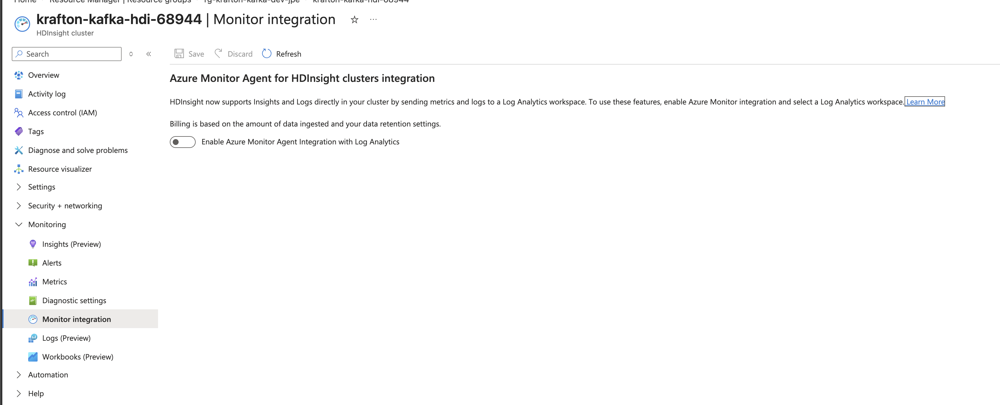

# HDInsight Kafka 모니터링 방식 비교 (Ambari / Monitor Integration / JMX Exporter / Kafka Exporter)

지표별(브로커 리소스, Consumer Lag, 클러스터 상태, JVM 내부) 수집 경로·저장 위치가 상이 → 단일 도구로 미커버.
관측 항목별 조회 도구 매핑 정리.

> **결론 (TL;DR)**
> - **노드 리소스 · 클러스터 상태 · 장기 로그** → Ambari + Monitor Integration (HDInsight 기본, 추가 설치 없음)
> - **브로커/토픽 처리량 · JVM internals · Consumer Group Lag** → HDInsight 기본 도구 **관측 불가**
> - → **JMX Exporter + Kafka Exporter (+Prometheus/Grafana)** 도입 권장
> - 설치·대시보드 구성: **[hdinsight-kafka-prometheus-grafana.md](./hdinsight-kafka-prometheus-grafana.md)**

## 1. 관측 항목 → 조회 도구 매핑

O = 기본 제공 / △ = 조건부·간접 제공 / X = 제공 안 함

| 관측 항목 | Ambari | Monitor Integration<br>(Log Analytics) | JMX Exporter<br>(+Prometheus/Grafana) | Kafka Exporter<br>(+Prometheus/Grafana) |
|---|:---:|:---:|:---:|:---:|
| **노드(호스트) CPU/메모리/디스크** | O | O | X | X |
| **브로커 JVM 요약 (Heap, GC, FD)** | X | O | O | X |
| **브로커 JVM 상세 (스레드, 메모리풀, GC 분포)** | X | X | O | X |
| **브로커별 처리량 (BytesIn/Out, Messages/sec)** | X | △ | O | X |
| **토픽/파티션별 메시지 지표** | X | X | O | X |
| **Consumer Group Lag** | X | X | X | O |
| **파티션 오프셋(현재/최신)** | X | X | △ | O |
| **Under-Replicated Partitions** | X | O | O | X |
| **클러스터/서비스 상태·알림** | O | O | X | X |
| **서비스 로그 (Kafka broker.log 등)** | △ | O | X | X |

> 주의: "브로커 CPU/메모리" = **브로커 실행 노드(호스트/VM)의 CPU/메모리**.
> Ambari·Monitor Integration 수집값은 호스트 단위 → Kafka 브로커 프로세스 격리값 아님.
> Worker 1노드 = 브로커 1개 구조 → 근사치 해석 가능.

---

## 2. 수집 위치·저장소별 정리

### Ambari (클러스터 내장, Ambari Metrics System)

- **접속**: `https://<클러스터이름>.azurehdinsight.net` → Ambari UI (Private Link 클러스터는 사설 IP로만 접근)
- **노드 리소스**: Hosts 탭에서 노드별 CPU/메모리/디스크/네트워크
- **클러스터 상태**: Dashboard, 서비스별 Alert
- **한계**: Kafka 브로커 처리량·토픽 지표·Consumer Lag 미제공(기본 대시보드). 데이터 보존 짧음(로컬 저장).

### Monitor Integration (Azure Monitor / Log Analytics)

- **활성화**: Azure Portal → 클러스터 → **Monitoring > Monitor integration** → Log Analytics 워크스페이스 연결

  

- **주요 테이블**:

  | 테이블 | 내용 |
  |--------|------|
  | `HDInsightAmbariSystemMetrics` | 노드별 CPU/메모리/디스크/네트워크 |
  | `HDInsightAmbariClusterAlerts` | Ambari 알림 |
  | `HDInsightKafkaMetrics` | Kafka JMX 지표 (브로커 처리량, 복제 상태, **JVM Heap/GC/FD 요약** 포함) |
  | `HDInsightKafkaLogs`, `HDInsightKafkaServerLog` | 브로커 로그 |
  | `HDInsightGatewayAuditLogs`, `HDInsightSecurityLogs` | 감사·보안 로그 |

- **장점**: 장기 보존, KQL 쿼리, 알림 규칙, 여러 클러스터 통합 조회
- **한계**: Consumer Lag 미제공. JVM internals 상세(스레드 상태, 메모리풀별, GC 분포)는 JMX Exporter 필요.

> **JVM 지표 수집 범위**: `Monitor integration` 활성화만으로 `HDInsightKafkaMetrics`의 `MetricNamespace == "JVMMetrics"` 자동 수집.
> 포함: `jvm_memoryheapused/max`, GC count/time, `OS_OpenFileDescriptorCount` 등.
> → Heap 사용률·GC 횟수·FD 수 = 별도 설치 없이 Log Analytics 조회 가능.
> 수집 확인: `HDInsightKafkaMetrics | where MetricNamespace == "JVMMetrics" | summarize count() by MetricName`

### Diagnostic Settings (진단 설정) — 별도 관찰 수단 아님

- Microsoft 공식 문서 기준, **HDInsight는 Azure Monitor 리소스 로그(진단 설정)를 로그 수집에 미사용.**
  로그 수집 = Log Analytics 에이전트(= Monitor Integration) 등 별도 경로.
- 진단 설정 = **플랫폼 메트릭 라우팅**만 가능 → 로그·노드/브로커 상세 지표 대체 불가.
- HDInsight 플랫폼 메트릭 = `GatewayRequests`, `CategorizedGatewayRequests`,
  `KafkaRestProxy.*`, `NumActiveWorkers`, `PendingCPU`, `PendingMemory` 수준.
  **노드/브로커 CPU·메모리는 플랫폼 메트릭 아님.**

### JMX Exporter / Kafka Exporter (오픈소스, 직접 구성) — 권장

HDInsight 기본 미제공 → 수동 설치. 둘 다 **Prometheus 스크래핑 + Grafana 시각화** 조합.
설치·대시보드: **[hdinsight-kafka-prometheus-grafana.md](./hdinsight-kafka-prometheus-grafana.md)**

- **JMX Exporter** — 브로커 JVM MBean을 Prometheus 형식으로 노출.
  **JVM internals**(Heap/GC/스레드) + **브로커/토픽/파티션 지표**(BytesIn/Out, Under-Replicated Partitions 등).
- **Kafka Exporter** — Kafka 프로토콜로 클러스터 접속. **Consumer Group Lag**·파티션 오프셋 특화.
  Consumer Lag = Ambari/Monitor Integration/JMX Exporter 모두 미제공 → **Lag 감시 사실상 필수**.

---

## 3. Log Analytics KQL — Broker headroom 조회

<details>
<summary>브로커 여유(headroom) KQL 예시 펼쳐보기 — 종합 스냅샷 / Request 여유 / JVM Heap·FD / 해석 가이드</summary>

Monitor integration 활성화 시 Log Analytics에서 아래 KQL로 브로커 여유 직접 조회.
`let` 바인딩은 포털에서 간헐적 해석 오류 → 아래 예시는 모두 **`let` 미사용 형태**.

### 브로커 여유 종합 스냅샷

호스트 CPU/IO/Load + Kafka request 처리 지표 + 복제 상태 일괄 조회.

```kusto
HDInsightAmbariSystemMetrics
| where TimeGenerated > ago(30m)
| where HostName startswith "wn"
| summarize
    CpuIdle=avg(CpuIdle),
    CpuIOWait=avg(CpuIOWait),
    Load1m=avg(OneMinuteLoad),
    DiskFreeGb=avg(DiskFree)
  by HostName
| join kind=leftouter (
    HDInsightKafkaMetrics
    | where TimeGenerated > ago(30m)
    | where HostName startswith "wn"
    | where MetricName in (
        "NetworkProcessorAvgIdlePercent",
        "RequestQueueSize",
        "ProduceTotalTimeMs",
        "FetchConsumerTotalTimeMs",
        "UnderReplicatedPartitions",
        "UnderMinIsrPartitionCount",
        "ReplicaMaxLag",
        "OfflineLogDirectoryCount"
    )
    | summarize AvgValue=avg(MetricValue) by HostName, MetricName
    | evaluate pivot(MetricName, any(AvgValue))
) on HostName
| project HostName, CpuIdle, CpuIOWait, Load1m, DiskFreeGb,
          NetworkProcessorAvgIdlePercent,
          RequestQueueSize,
          ProduceTotalTimeMs,
          FetchConsumerTotalTimeMs,
          UnderReplicatedPartitions,
          UnderMinIsrPartitionCount,
          ReplicaMaxLag,
          OfflineLogDirectoryCount
| order by HostName asc
```

### Request 처리 여유 (P95 포함)

```kusto
HDInsightKafkaMetrics
| where TimeGenerated > ago(30m)
| where HostName startswith "wn"
| where MetricName in (
    "NetworkProcessorAvgIdlePercent",
    "RequestHandlerAvgIdlePercent",
    "RequestQueueSize",
    "ProduceTotalTimeMs",
    "FetchConsumerTotalTimeMs",
    "UnderReplicatedPartitions",
    "UnderMinIsrPartitionCount",
    "ReplicaMaxLag"
)
| summarize
    AvgValue=avg(MetricValue),
    P95=percentile(MetricValue, 95),
    MaxValue=max(MetricValue)
  by HostName, MetricName
| order by HostName asc, MetricName asc
```

### JVM Heap / File Descriptor 여유

```kusto
HDInsightKafkaMetrics
| where TimeGenerated > ago(30m)
| where HostName startswith "wn"
| where MetricName in (
    "jvm_memoryheapused",
    "jvm_memoryheapmax",
    "OS_OpenFileDescriptorCount",
    "OS_MaxFileDescriptorCount"
)
| summarize arg_max(TimeGenerated, *) by HostName, MetricName
| summarize
    HeapUsed=maxif(MetricValue, MetricName == "jvm_memoryheapused"),
    HeapMax=maxif(MetricValue, MetricName == "jvm_memoryheapmax"),
    FdOpen=maxif(MetricValue, MetricName == "OS_OpenFileDescriptorCount"),
    FdMax=maxif(MetricValue, MetricName == "OS_MaxFileDescriptorCount")
  by HostName
| project HostName,
          HeapUsedPct=round(100.0 * todouble(HeapUsed) / todouble(HeapMax), 2),
          FdUsedPct=round(100.0 * todouble(FdOpen) / todouble(FdMax), 4)
| order by HostName asc
```

### 해석 가이드

| 지표 | 여유 있음 | 주의 |
|------|-----------|------|
| `CpuIdle` | 높음 | 20% 미만 지속 |
| `CpuIOWait` | 낮음 | 10% 이상 지속 시 스토리지 병목 의심 |
| `NetworkProcessorAvgIdlePercent` | 1에 가까움 | 낮아지면 네트워크 스레드 압박 |
| `RequestHandlerAvgIdlePercent` | 높음 | 낮아지면 요청 처리 병목 |
| `RequestQueueSize` | 0 근처 유지 | 지속적으로 쌓이면 처리 병목 |
| `ProduceTotalTimeMs`, `FetchConsumerTotalTimeMs` | 낮음 | 급증 시 처리 지연 |
| `UnderReplicatedPartitions`, `UnderMinIsrPartitionCount` | 0 | 0 초과 시 즉시 점검 |
| `ReplicaMaxLag`, `OfflineLogDirectoryCount` | 0 | 0 초과 시 복제/스토리지 이상 |
| `HeapUsedPct` | 낮음 | 75% 이상 지속 시 GC 압박 |
| `FdUsedPct` | 낮음 | 급증 시 연결/파일 핸들 한계 점검 |

</details>

---

## 4. 조합 권장

| 목적 | 권장 조합 |
|------|-----------|
| 노드 리소스·클러스터 상태 상시 확인 | Ambari + Monitor Integration |
| 장기 보존·알림·통합 대시보드 | Monitor Integration (Log Analytics) |
| JVM Heap/GC/FD 요약 | Monitor Integration으로 충분 (`HDInsightKafkaMetrics` / JVMMetrics namespace) |
| 브로커/토픽 상세 + JVM internals 튜닝 | JMX Exporter + Prometheus + Grafana |
| Consumer Lag 감시 | Kafka Exporter + Prometheus + Grafana |

> **권장 목표 상태**: Monitor Integration으로 노드/클러스터 baseline 확보 +
> **브로커/토픽 상세·JVM internals·Consumer Lag은 JMX/Kafka Exporter로 관측**.
> → 설치·대시보드: **[hdinsight-kafka-prometheus-grafana.md](./hdinsight-kafka-prometheus-grafana.md)**

---

## 5. 배포 가능한 Workbook / Dashboard 아티팩트

**Azure Monitor Workbook / Azure Dashboard** = Log Analytics에 이미 쌓인 지표(`HDInsightKafkaMetrics` 등)를
**Azure Portal에서 시각화**하는 리소스. Grafana/Prometheus 없이 포털만으로 조회.
→ **전제: Monitor Integration 활성화(2절)로 데이터가 워크스페이스에 수집 중이어야 함.** (Consumer Lag은 미포함 — Kafka Exporter 필요)

리포에 아티팩트 + 배포용 Bicep 포함:

| 파일 | 역할 |
|------|------|
| `monitor/assets/hdinsight-kafka-workbook.template.json` | Workbook 본문(패널 정의) |
| `monitor/assets/hdinsight-kafka-dashboard.properties.template.json` | Dashboard 본문 |
| `infra/main.bicep` / `infra/modules/monitoring.bicep` | 위 두 아티팩트를 Azure 리소스로 배포 |
| `infra/main.bicepparam` | 배포 파라미터 예시 |

### 포함된 시각화

| 패널 | 지표 |
|------|------|
| Cluster state | `ActiveControllerCount`, `OfflinePartitionsCount`, `UnderReplicatedPartitions` |
| Kafka throughput | `MessagesInPerSec`, `BytesInPerSec`, `BytesOutPerSec` |
| Broker JVM | `jvm_memoryheapused`, `jvm_memoryheapmax` |
| Latest broker state | broker/host별 heap 사용량, heap max, under-replicated partitions |

### 배포 방법

리포 루트에서 실행. `<subscription-id>` 등 플레이스홀더를 실제 Log Analytics workspace 값으로 치환.

1. `infra/main.bicepparam`의 `workspaceResourceId`를 실제 워크스페이스 리소스 ID로 치환
   (형식: `/subscriptions/<sub>/resourceGroups/<rg>/providers/Microsoft.OperationalInsights/workspaces/<name>`)
2. Bicep 배포 — Workbook·Dashboard 리소스가 대상 리소스 그룹에 생성:

   ```bash
   az deployment group create \
     --resource-group <target-rg> \
     --template-file infra/main.bicep \
     --parameters infra/main.bicepparam
   ```

3. 배포 후 확인
   - Workbook: Azure Portal → **Monitor → Workbooks →** `HDInsight Kafka Operations`
   - Dashboard: Azure Portal → **Dashboard →** `HDInsight Kafka Operations Dashboard`

> 이 배포는 **기존 Log Analytics workspace 참조**만 수행 → HDInsight 클러스터 생성/수정 없음.
> `<target-rg>` = Workbook/Dashboard를 만들 리소스 그룹(워크스페이스와 달라도 무방).

---

## 6. 출처

- HDInsight 모니터링 개요 — [Analyze and monitor with Azure Monitor logs](https://learn.microsoft.com/azure/hdinsight/hdinsight-hadoop-oms-log-analytics-tutorial)
- HDInsight Azure Monitor 참조(테이블/메트릭) — [Azure Monitor logs reference for HDInsight](https://learn.microsoft.com/azure/hdinsight/monitor-hdinsight-reference)
- "HDInsight는 리소스 로그/진단 설정을 사용하지 않는다" 근거 — [Monitoring HDInsight data reference](https://learn.microsoft.com/azure/hdinsight/monitor-hdinsight-reference)
- Ambari 모니터링 — [Manage HDInsight clusters by using Apache Ambari](https://learn.microsoft.com/azure/hdinsight/hdinsight-hadoop-manage-ambari)
- HDInsight 플랫폼 메트릭 목록 — [Supported metrics for Microsoft.HDInsight/clusters](https://learn.microsoft.com/azure/azure-monitor/reference/supported-metrics/microsoft-hdinsight-clusters-metrics)
- JMX Exporter — [prometheus/jmx_exporter (GitHub)](https://github.com/prometheus/jmx_exporter)
- Kafka Exporter — [danielqsj/kafka_exporter (GitHub)](https://github.com/danielqsj/kafka_exporter)

> 이 문서는 `rg-krafton-kafka-dev-jpe` 배포(`krafton-kafka-hdi-68944`) 기준 실측 기록.
> 리소스명·IP는 환경에 맞게 치환.
