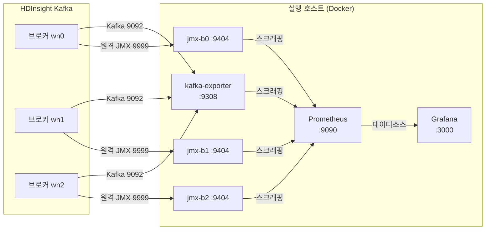
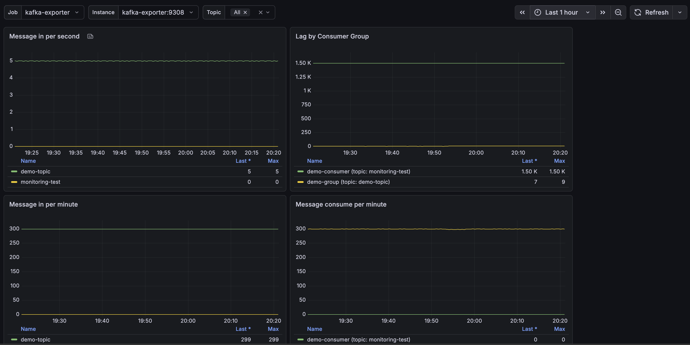
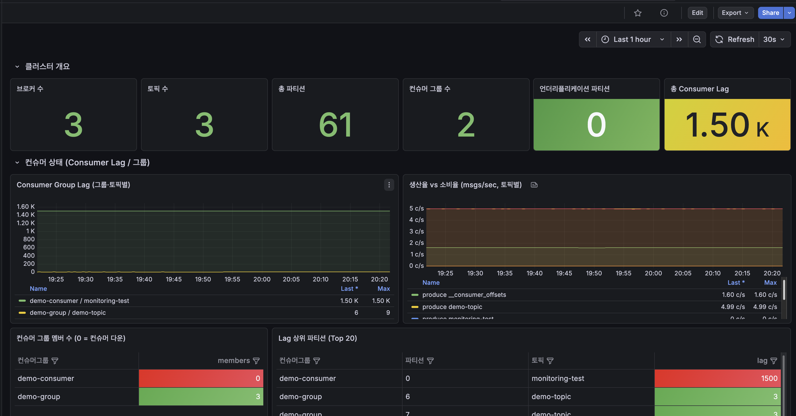
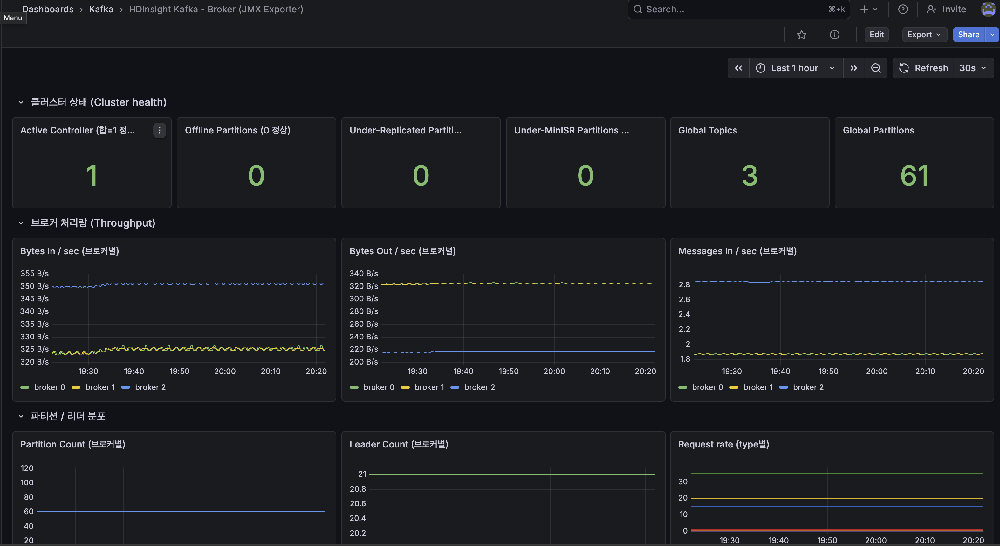

# HDInsight Kafka JMX Exporter / Kafka Exporter 설치 및 Grafana 대시보드 구성

**전제: HDInsight Kafka 클러스터 + Prometheus + Grafana 기구성.**
도구별 커버 범위·선택 근거("Why") → [hdinsight-kafka-monitoring.md](./hdinsight-kafka-monitoring.md).

> **문서 성격**: JMX Exporter·Kafka Exporter의 정식 사용법은 각 오픈소스 공식 문서([9절 출처](#9-출처)) 기준.
> 이 문서는 그 위에서 **HDInsight 환경(원격 JMX 9999, Private Link 등)에 맞춰 실전 구성한 요약본**.
> 아래 Grafana 대시보드도 커뮤니티 대시보드(7589) 외에는 **본 환경 지표에 맞춰 개별 구성**한 것 → 참고용, 환경별 조정 필요.

참조 설정·대시보드 파일: [`assets/prometheus-grafana/`](./assets/prometheus-grafana/)

```
assets/prometheus-grafana/
├── docker-compose.yml                    # 두 Exporter + Prometheus + Grafana 일괄 기동
├── prometheus.yml                        # 스크래핑 설정
├── jmx/
│   ├── kafka-rules.yml                    # JMX -> Prometheus 변환 룰 (16개)
│   └── b0.yml.example                     # 브로커별 설정 예시 (hostPort + 룰)
└── grafana/
    ├── provisioning/
    │   ├── datasources/prometheus.yml     # Prometheus 데이터소스 자동 등록
    │   └── dashboards/provider.yml        # 대시보드 폴더 자동 프로비저닝
    └── dashboards/
        ├── kafka-jmx-broker.json          # JMX 브로커 대시보드
        └── kafka-exporter-adv.json        # Kafka Exporter 상세 대시보드
```

---

## 1. 전제 조건

| 항목 | 값 |
|------|-----|
| HDInsight Kafka | 브로커 노드 IP(`<BROKER0_IP>` 등)와 JMX 포트(9999)를 확인. HDInsight 브로커는 `JMX_PORT=9999`가 설정되어 원격 접속 가능 |
| 실행 호스트 | 브로커와 **같은 VNet**에서 9092(Kafka)·9999(JMX)로 접근 가능한 Linux 호스트(VM 등). Docker / Docker Compose 설치 |
| Prometheus / Grafana | 본 가이드는 Exporter와 함께 Docker로 동반 기동. 기존 인스턴스 존재 시 스크래핑 대상·대시보드만 추가 |

> **원격 JMX 채택 이유**
> jmx_exporter 정석 = 브로커 JVM에 javaagent 부착 → 브로커 롤링 재시작 필요.
> HDInsight 브로커는 9999 포트 원격 JMX 개방 → 외부 호스트 `jmx_prometheus_httpserver` 접속으로
> 브로커 무변경·동일 `kafka_server_*`/JVM 지표 수집. (javaagent 방식은 [7절](#7-참고-공식-javaagent-방식) 참고)

---

## 2. 아키텍처



- **Kafka Exporter** 1개 — Kafka 프로토콜로 붙어 Consumer Lag / 오프셋 / 토픽·파티션 상태 노출.
- **JMX Exporter** 브로커당 1개 — 원격 JMX(9999)로 접속해 브로커 처리량 / 복제 / JVM 지표 노출.
- **Prometheus**가 둘을 스크래핑하고, **Grafana**가 Prometheus를 데이터소스로 시각화.

---

## 3. 구축 단계

### 3.1 JMX Exporter (브로커별 원격 JMX)

브로커 1대당 `jmx_prometheus_httpserver` 컨테이너 1개. 각 컨테이너 → `bN.yml` 로드 →
`hostPort: <브로커IP>:9999` 원격 JMX 접속 → 9404 포트에 Prometheus 메트릭 노출.

```bash
# jar 준비
mkdir -p jmx
curl -L -o jmx/jmx_prometheus_httpserver.jar \
  https://repo1.maven.org/maven2/io/prometheus/jmx/jmx_prometheus_httpserver/0.20.0/jmx_prometheus_httpserver-0.20.0.jar

# 브로커별 설정 bN.yml = hostPort 한 줄 + 변환 룰(kafka-rules.yml)
# BROKER0_IP / BROKER1_IP / BROKER2_IP 를 실제 브로커 IP로 export 해둔다
for i in 0 1 2; do
  ip_var="BROKER${i}_IP"
  { echo "hostPort: ${!ip_var}:9999"; cat jmx/kafka-rules.yml; } > jmx/b${i}.yml
done
```

- 변환 룰: [`jmx/kafka-rules.yml`](./assets/prometheus-grafana/jmx/kafka-rules.yml)
  (처리량 BytesIn/Out·MessagesIn, ReplicaManager URP/ISR, Controller, RequestMetrics 지연, JVM Heap/GC/Thread 등 16개)
- `hostPort`만 브로커별 상이, 룰 내용 동일. 예시: [`jmx/b0.yml.example`](./assets/prometheus-grafana/jmx/b0.yml.example)

### 3.2 Kafka Exporter (Consumer Lag)

`danielqsj/kafka-exporter` 컨테이너 1개. `--kafka.server`에 브로커 주소 나열.

```yaml
kafka-exporter:
  image: danielqsj/kafka-exporter:latest
  command:
    - --kafka.server=<BROKER0_IP>:9092
    - --kafka.server=<BROKER1_IP>:9092
    - --kafka.server=<BROKER2_IP>:9092
  ports:
    - "9308:9308"
```

노출 지표: `kafka_consumergroup_lag`, `kafka_consumergroup_members`, `kafka_topic_partition_*`, `kafka_broker_info` 등.

### 3.3 일괄 기동 (docker-compose)

두 Exporter + Prometheus + Grafana 일괄 기동: [`docker-compose.yml`](./assets/prometheus-grafana/docker-compose.yml).
`<BROKER*_IP>`, `<GRAFANA_ADMIN_PASSWORD>` 실제 값 치환 후:

```bash
# assets/prometheus-grafana/ 내용을 실행 호스트로 복사한 디렉터리에서
docker compose up -d
docker compose ps        # kafka-exporter, jmx-b0/b1/b2, prometheus, grafana = Up
```

### 3.4 Prometheus 스크래핑

[`prometheus.yml`](./assets/prometheus-grafana/prometheus.yml): `kafka-exporter:9308` +
`jmx-b0/b1/b2:9404` 스크래핑. JMX 잡에 `broker` 라벨 부여 → 브로커 구분.
**기존 Prometheus 존재 시** 이 `scrape_configs` 두 블록만 추가 후 reload.

---

## 4. Grafana 대시보드 구성

### 4.1 데이터소스·대시보드 자동 등록 (provisioning)

docker-compose가 Grafana에 자동 주입:

- 데이터소스: [`grafana/provisioning/datasources/prometheus.yml`](./assets/prometheus-grafana/grafana/provisioning/datasources/prometheus.yml) (uid `prometheus`)
- 대시보드 폴더: [`grafana/provisioning/dashboards/provider.yml`](./assets/prometheus-grafana/grafana/provisioning/dashboards/provider.yml) → `Kafka` 폴더
- `grafana/dashboards/*.json` 자동 로드

**기존 Grafana 존재 시** 아래 대시보드 Dashboards → Import + 데이터소스 지정.

### 4.2 대시보드 3종

| 대시보드 | 출처 | 지표 |
|----------|------|---------|
| **Kafka Exporter Overview** | Grafana.com **7589** (공식 커뮤니티) | 메시지 생산율, Consumer Group Lag, 토픽 파티션 수 |
| **HDInsight Kafka - Exporter 상세** | 커스텀 ([kafka-exporter-adv.json](./assets/prometheus-grafana/grafana/dashboards/kafka-exporter-adv.json)) | 컨슈머 그룹 **멤버 수(0=컨슈머 다운)**, Lag 상위 파티션, 언더리플리케이션·ISR·브로커별 리더 분포, 토픽별 보관 메시지 수 |
| **HDInsight Kafka - Broker (JMX Exporter)** | 커스텀 ([kafka-jmx-broker.json](./assets/prometheus-grafana/grafana/dashboards/kafka-jmx-broker.json)) | 브로커별 처리량(BytesIn/Out·MessagesIn), URP, ActiveController, 요청 지연, JVM Heap·스레드 |

**Kafka Exporter Overview(7589)** = 커뮤니티 대시보드 → 파일 아닌 ID로 import.
Grafana UI → Dashboards → **Import** → ID `7589` → 데이터소스 `Prometheus`.

---

## 5. 정상 동작 확인 체크리스트

Prometheus(`:9090`) 쿼리로 확인.

| # | 항목 | 쿼리 | 기대값 |
|---|------|------|--------|
| 1 | 스크래핑 타겟 | `up` | kafka-exporter 1 + kafka-jmx 3 = **4개 모두 1** |
| 2 | 브로커 수 | `kafka_brokers` | 브로커 대수 |
| 3 | 컨트롤러 | `kafka_controller_kafkacontroller_activecontrollercount` | 합계 = 1 |
| 4 | 언더리플리케이션 | `kafka_server_replicamanager_underreplicatedpartitions` | 정상 = 0 |
| 5 | Consumer Lag | `kafka_consumergroup_lag` | 그룹/토픽/파티션별 노출 |
| 6 | 컨슈머 멤버 수 | `kafka_consumergroup_members` | 그룹별 멤버 수(0 = 컨슈머 없음) |

---

## 6. 대시보드 화면

> 이미지는 [`assets/images/`](./assets/images/) 에 아래 파일명으로 저장 시 자동 표시.

### 6.1 Kafka Exporter Overview (7589)



메시지 생산율 / Consumer Group Lag / 토픽별 파티션 수.

### 6.2 HDInsight Kafka - Exporter 상세



클러스터 개요(브로커/토픽/파티션/그룹 수, URP, 총 Lag) · 컨슈머 상태(그룹별 Lag, 생산 vs 소비율, 멤버 수, Lag 상위 파티션) · 복제·리더십(URP·ISR·브로커별 리더 분포) · 토픽 상세.

### 6.3 HDInsight Kafka - Broker (JMX Exporter)



브로커별 처리량 · URP · ActiveController · 요청 지연 · JVM Heap/스레드.

---

## 7. 참고: 공식 javaagent 방식

원격 JMX(본문) 대안. Microsoft 문서 정석 = 브로커 JVM에 jmx_prometheus **javaagent** 부착.

1. **Ambari UI** → Kafka → Configs → Advanced **kafka-env** 템플릿에 추가:
   ```bash
   export KAFKA_OPTS="$KAFKA_OPTS -javaagent:/opt/jmx_exporter/jmx_prometheus_javaagent.jar=7071:/opt/jmx_exporter/kafka.yml"
   ```
2. **Script Action**으로 전 브로커 노드에 jar + `kafka.yml` 배포(예: `/opt/jmx_exporter/`).
3. Ambari **Kafka 롤링 재시작** → 각 브로커 7071 메트릭 노출 → Prometheus 스크래핑.

**제약(실측)**: HDInsight 게이트웨이가 Ambari config 쓰기(POST/PUT) 500 차단 → REST 자동화 불가.
Ambari Web UI(사설망 브라우저) 또는 Script Action 수동 적용 필요.
→ 본문은 브로커 재시작 불필요한 원격 JMX(9999) 방식 채택. 노출 지표는 양자 동일.

---

## 8. 참고: 폐쇄망 / Private Link 환경 팁

- **Docker 컨테이너 DNS**: 호스트가 systemd-resolved(127.0.0.53) 사용 시 컨테이너가 브로커 advertised FQDN 해석 실패 가능.
  `/etc/docker/daemon.json` 에 `{"dns":["168.63.129.16"],"dns-search":["<클러스터내부도메인>"]}` 추가 후
  `docker compose up -d --force-recreate` (restart만으로는 resolv.conf 미갱신).
  → 본문처럼 브로커 **IP** 지정 시 회피 가능.
- **아웃바운드**: 이미지 pull용 서브넷 아웃바운드 경로(NAT Gateway 등) 필요.
- **Azure Managed Grafana → 사설 Prometheus**: Managed Grafana(Public) → 사설 Prometheus 연결 경로 =
  내부 LB → Private Link Service → Managed Private Endpoint.
  데이터소스 URL = PLS alias FQDN 아님, **MPE 부여 사설 IP** 사용.

---

## 9. 출처

- JMX Exporter — [prometheus/jmx_exporter (GitHub)](https://github.com/prometheus/jmx_exporter)
- Kafka Exporter — [danielqsj/kafka_exporter (GitHub)](https://github.com/danielqsj/kafka_exporter)
- Kafka Exporter Overview 대시보드 — [Grafana.com Dashboard 7589](https://grafana.com/grafana/dashboards/7589)
- Ambari 구성 편집 — [Manage HDInsight clusters by using Apache Ambari](https://learn.microsoft.com/azure/hdinsight/hdinsight-hadoop-manage-ambari)
- HDInsight Script Action — [Customize HDInsight clusters using script actions](https://learn.microsoft.com/azure/hdinsight/hdinsight-hadoop-customize-cluster-linux)
- Azure Managed Grafana 사설 데이터소스 연결 — [Connect to a data source privately](https://learn.microsoft.com/azure/managed-grafana/how-to-connect-to-data-source-privately)
