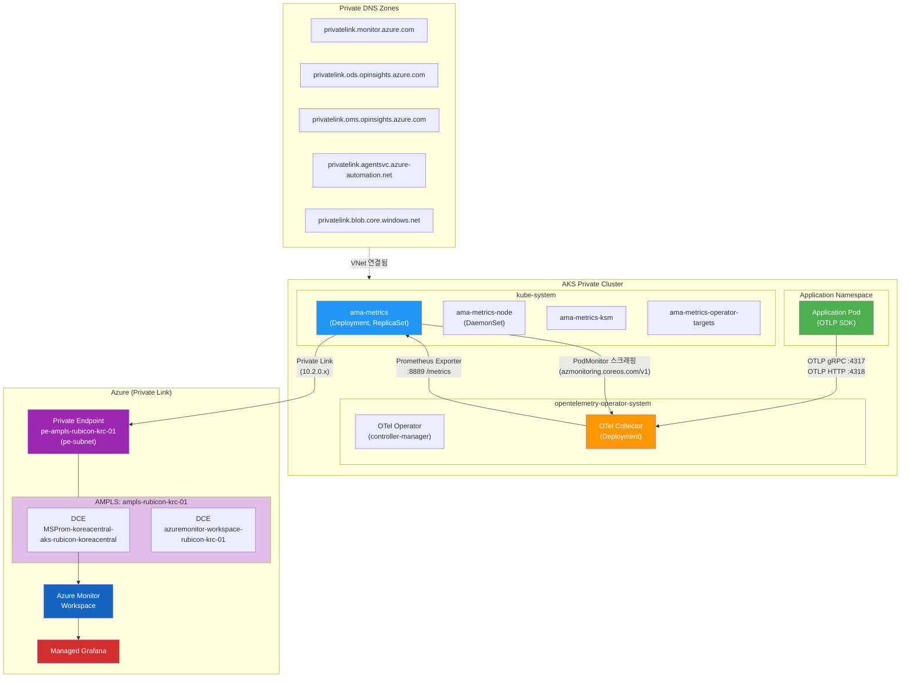
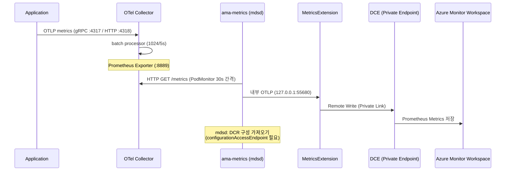
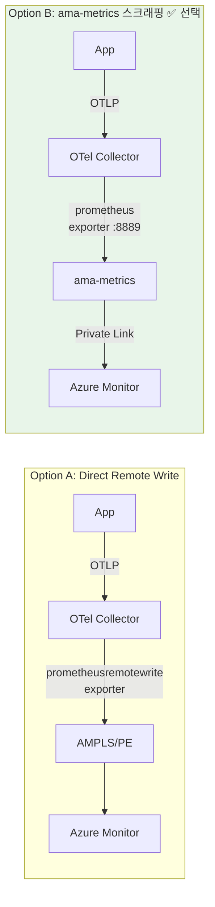
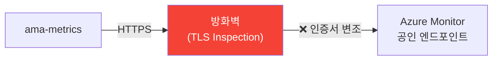
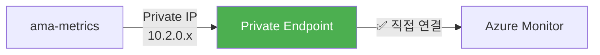
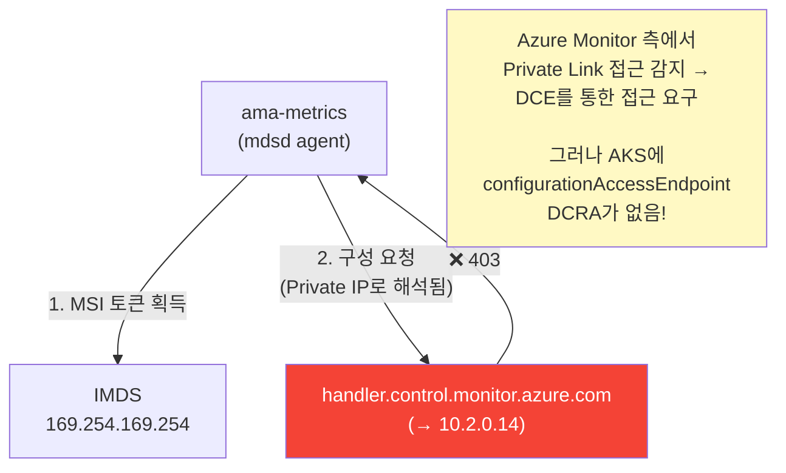

# AKS 폐쇄망 환경 OpenTelemetry + Azure Monitor 메트릭 파이프라인 구축

## 1. 환경 개요

| 항목 | 값 |
|------|-----|
| AKS 클러스터 | `aks-rubicon-koreacentral-01` (Private Cluster) |
| 리소스 그룹 | `rg-rubicon-koreacentral-01` |
| 구독 | `f752aff6-b20c-4973-b32b-0a60ba2c6764` |
| 리전 | Korea Central |
| VNet | `vnet-rubicon-koreacentral-01` |
| AKS 서브넷 | `aks-subnet` |
| PE 서브넷 | `pe-subnet` |
| Azure Monitor Workspace | `azuremonitor-workspace-rubicon-krc-01` |
| Managed Grafana | `grafanaworkspacerubicon` |
| 노드 Taint | `workload=general:NoSchedule`, `CriticalAddonsOnly=true:NoSchedule` |
| 네트워크 특성 | **폐쇄망** (방화벽 TLS Inspection, 아웃바운드 제한) |

---

## 2. 아키텍처

### 2.1 최종 구성 (Option B: ama-metrics 스크래핑 방식)



### 2.2 데이터 흐름 상세



### 2.3 검토했던 두 가지 옵션



**Option B를 선택한 이유:**
- ama-metrics가 이미 AKS에 내장 (Managed Prometheus addon)
- DCR/DCE 등 인증이 자동 구성됨
- PodMonitor만 추가하면 연동 완료

---

## 3. 구축 단계

### 3.1 OTel Operator 설치

```bash
# CRD + RBAC + Deployment 포함 매니페스트 적용
kubectl apply -f opentelemetry-operator.yaml

# 확인
kubectl get po -n opentelemetry-operator-system
# opentelemetry-operator-controller-manager-764d64944f-t5q9s  Running
```

### 3.2 OTel Collector + PodMonitor 배포

`otel-collector.yaml`:

```yaml
apiVersion: opentelemetry.io/v1beta1
kind: OpenTelemetryCollector
metadata:
  name: otel-collector
  namespace: opentelemetry-operator-system
spec:
  mode: deployment
  replicas: 1
  tolerations:
    - key: "workload"
      operator: "Equal"
      value: "general"
      effect: "NoSchedule"
  config:
    receivers:
      otlp:
        protocols:
          grpc:
            endpoint: 0.0.0.0:4317
          http:
            endpoint: 0.0.0.0:4318
    processors:
      batch:
        send_batch_size: 1024
        timeout: 5s
    exporters:
      prometheus:
        endpoint: 0.0.0.0:8889
        resource_to_telemetry_conversion:
          enabled: true
    service:
      pipelines:
        metrics:
          receivers: [otlp]
          processors: [batch]
          exporters: [prometheus]
---
# ⚠️ API Group: azmonitoring.coreos.com (Azure 전용, 표준 monitoring.coreos.com 아님)
apiVersion: azmonitoring.coreos.com/v1
kind: PodMonitor
metadata:
  name: otel-collector-metrics
  namespace: opentelemetry-operator-system
spec:
  selector:
    matchLabels:
      app.kubernetes.io/component: opentelemetry-collector
      app.kubernetes.io/instance: opentelemetry-operator-system.otel-collector
      app.kubernetes.io/managed-by: opentelemetry-operator
  podMetricsEndpoints:
    # 앱 메트릭 (OTLP → Prometheus로 변환된 커스텀 메트릭)
    - port: prometheus        # OTel Collector의 prometheus exporter 포트 (8889)
      path: /metrics
      interval: 30s
    # OTel Collector 자체 메트릭
    - port: metrics           # OTel Collector 내부 메트릭 포트 (8888)
      path: /metrics
      interval: 30s
      metricRelabelings:
        - targetLabel: source
          replacement: otel-collector
          action: replace
```

```bash
kubectl apply -f otel-collector.yaml
```

### 3.3 AMPLS (Azure Monitor Private Link Scope) 생성

> **왜 필요한가?**  
> 폐쇄망 환경에서 ama-metrics → Azure Monitor 통신 시, 방화벽 TLS Inspection으로 인해 SSL Handshake 에러가 발생함.  
> AMPLS + Private Endpoint를 통해 Azure Monitor를 VNet 내부에서 Private IP로 접근 가능하게 해야 함.

**포털에서 생성:**

1. Azure Portal → **Azure Monitor Private Link Scope** → 만들기
2. 이름: `ampls-rubicon-krc-01`
3. 연결된 리소스 (DCE 2개 추가):
   - `MSProm-koreacentral-aks-rubicon-koreacentral` (RG: `rg-rubicon-koreacentral-01`)
   - `azuremonitor-workspace-rubicon-krc-01` (RG: `MA_azuremonitor-workspace-rubicon-krc-01_koreacentral_managed`)
4. Private Endpoint 생성:
   - 이름: `pe-ampls-rubicon-krc-01`
   - 서브넷: `pe-subnet`
   - Private DNS Zone 통합: 사용

### 3.4 Private DNS Zone 확인

AMPLS 생성 시 자동으로 5개 DNS Zone이 생성되고 VNet에 연결됨:

| Private DNS Zone | 용도 |
|---|---|
| `privatelink.monitor.azure.com` | 메트릭 수집 엔드포인트 |
| `privatelink.ods.opinsights.azure.com` | ODS 데이터 채널 |
| `privatelink.oms.opinsights.azure.com` | OMS 포털 |
| `privatelink.agentsvc.azure-automation.net` | 에이전트 서비스 |
| `privatelink.blob.core.windows.net` | Blob 스토리지 |

**DNS 해석 확인:**
```bash
# AKS 파드 내부에서
nslookup msprom-koreacentral-aks-rubicon-koreacentral-ruja.koreacentral-1.metrics.ingest.monitor.azure.com
# → 10.2.0.6 (Private IP ✅)

nslookup global.handler.control.monitor.azure.com
# → 10.2.0.14 (Private IP ✅)
```

### 3.5 DCR-DCE 연결 (포털)

**Portal에서:**
1. Azure Portal → **Monitor** → **데이터 수집 규칙 (Data Collection Rules)**
2. 구독/리소스 그룹 필터에서 모든 리소스 그룹 선택 (Managed RG 포함)
3. 각 DCR 선택 → 개요 → **데이터 수집 엔드포인트** → 편집 → DCE 선택

**대상 DCR 목록:**

| DCR 이름 | 리소스 그룹 | 연결할 DCE |
|---|---|---|
| `MSProm-koreacentral-aks-rubicon-koreacentral-01` | `rg-rubicon-koreacentral-01` | `MSProm-koreacentral-aks-rubicon-koreacentral` |
| `azuremonitor-workspace-rubicon-krc-01` | `MA_..._managed` | `azuremonitor-workspace-rubicon-krc-01` |

### 3.6 ⭐ configurationAccessEndpoint DCRA 생성 (핵심!)

> **DCRA (Data Collection Rule Association)란?**
>
> Azure Monitor의 세 가지 핵심 개념:
> - **DCR (Data Collection Rule)**: "어떤 데이터를, 어떻게 처리해서, 어디로 보낼지" 정의한 규칙
> - **DCE (Data Collection Endpoint)**: "데이터를 수집/전송하는 입구" (엔드포인트 URL)
> - **DCRA (Data Collection Rule Association)**: DCR이나 DCE를 **특정 리소스(예: AKS)에 바인딩**하는 연결 객체
>
> DCRA는 "이 규칙(DCR) 또는 이 입구(DCE)를 **이 AKS 클러스터에서 사용해라**"라는 매핑이다.
> DCR/DCE 자체를 만들어도, DCRA로 AKS에 연결하지 않으면 에이전트는 그것을 사용하지 않는다.
>
> 이 AKS에 걸린 DCRA 3개:
> | DCRA 이름 | 역할 | 연결 대상 |
> |---|---|---|
> | `ContainerInsightsExtension` | 컨테이너 로그 수집 규칙을 AKS에 연결 | DCR → AKS |
> | `ContainerInsightsMetricsExtension` | Prometheus 메트릭 수집 규칙을 AKS에 연결 | DCR → AKS |
> | **`configurationAccessEndpoint`** | 에이전트가 **구성(config)을 가져올 DCE**를 AKS에 연결 | DCE → AKS |
>
> 3번째가 Private Link 환경에서 핵심인 이유:
> 에이전트(mdsd)가 구성을 가져올 때 Public 엔드포인트 대신 Private Endpoint(DCE)를 경유하도록
> 명시적으로 알려줘야 하기 때문이다. 이 DCRA가 없으면 → 에이전트가 어떤 DCE를 써야 하는지 모름 → **403 거부**.

> **이것이 가장 중요한 단계.**  
> DCR에 DCE를 연결하는 것만으로는 부족함.  
> AKS 리소스에 `configurationAccessEndpoint` DCRA를 추가해야 에이전트가 Private Link를 통해 구성(configuration)을 가져올 수 있음.

#### 방법 1: 포털에서 설정

1. Azure Portal → **Monitor** → **데이터 수집 규칙 (Data Collection Rules)**
2. Prometheus DCR 선택 (예: `MSProm-koreacentral-aks-rubicon-koreacentral-01`)
3. 왼쪽 메뉴 → **리소스 (Resources)** 탭
4. AKS 클러스터 리소스의 **데이터 수집 엔드포인트** 열에서 DCE 선택
5. 저장 → `configurationAccessEndpoint` DCRA가 자동 생성됨

#### 방법 2: REST API로 설정

```bash
az rest --method put \
  --url "/subscriptions/f752aff6-b20c-4973-b32b-0a60ba2c6764/resourceGroups/rg-rubicon-koreacentral-01/providers/Microsoft.ContainerService/managedClusters/aks-rubicon-koreacentral-01/providers/Microsoft.Insights/dataCollectionRuleAssociations/configurationAccessEndpoint?api-version=2023-03-11" \
  --body '{"properties":{"dataCollectionEndpointId":"/subscriptions/f752aff6-b20c-4973-b32b-0a60ba2c6764/resourceGroups/rg-rubicon-koreacentral-01/providers/Microsoft.Insights/dataCollectionEndpoints/MSProm-koreacentral-aks-rubicon-koreacentral"}}'
```

**확인:**
```bash
az rest --method get \
  --url "/subscriptions/f752aff6-b20c-4973-b32b-0a60ba2c6764/resourceGroups/rg-rubicon-koreacentral-01/providers/Microsoft.ContainerService/managedClusters/aks-rubicon-koreacentral-01/providers/Microsoft.Insights/dataCollectionRuleAssociations?api-version=2023-03-11" \
  | python3 -c "
import sys,json
data=json.load(sys.stdin)
for a in data.get('value',[]):
    props = a.get('properties',{})
    print(f\"Name: {a['name']}\")
    print(f\"  DCR: {props.get('dataCollectionRuleId','N/A')}\")
    print(f\"  DCE: {props.get('dataCollectionEndpointId','N/A')}\")
    print()
"
```

**기대 결과 (DCRA 3개):**
| DCRA 이름 | DCR | DCE |
|---|---|---|
| `ContainerInsightsExtension` | `MSCI-koreacentral-...` | N/A |
| `ContainerInsightsMetricsExtension` | `MSProm-koreacentral-...` | N/A |
| **`configurationAccessEndpoint`** | N/A | **`MSProm-koreacentral-aks-rubicon-koreacentral`** ✅ |

---

## 4. 디버깅 히스토리

### 4.1 SSL Handshake 에러

```
❌ 증상: ama-metrics 로그에 "Error in SSL handshake" 반복
```



**원인:** 폐쇄망 방화벽이 TLS Inspection을 수행하여 Azure Monitor의 인증서를 변조 → SSL 핸드셰이크 실패

**해결:** AMPLS + Private Endpoint 생성 → DNS가 Private IP로 해석 → 방화벽을 우회하여 VNet 내부 통신



### 4.2 403 "Data collection endpoint must be used" 에러

```
❌ 증상: SSL 에러 해결 후 새로운 403 에러 발생
   "Data collection endpoint must be used to access configuration over private link."
```

**원인 분석:**



**핵심 포인트:**
- DNS가 Private IP로 해석되면, Azure Monitor 서버는 "이것은 Private Link 접근"임을 인식
- Private Link 접근 시, **DCE를 통한 구성 액세스**를 강제함
- AKS 클러스터 리소스에 `configurationAccessEndpoint` DCRA가 없으면 → 에이전트가 어떤 DCE를 사용해야 하는지 모름 → **403 거부**

**해결:**
```bash
# AKS 리소스에 configurationAccessEndpoint DCRA 생성
az rest --method put \
  --url "{AKS_ID}/providers/Microsoft.Insights/dataCollectionRuleAssociations/configurationAccessEndpoint?api-version=2023-03-11" \
  --body '{"properties":{"dataCollectionEndpointId":"{DCE_ID}"}}'
```

### 4.3 PodMonitor 포트 이름 불일치

```
❌ 증상: PodMonitor가 OTel Collector를 스크래핑하지 못함
```

**원인:** PodMonitor의 `port: prometheus-dev`가 실제 OTel Collector의 포트 이름 `prometheus`와 불일치

**해결:** `port: prometheus`로 수정

### 4.4 디버깅에 사용한 주요 명령어

```bash
# mdsd 에러 로그 확인
kubectl exec -n kube-system deploy/ama-metrics -- cat /opt/microsoft/linuxmonagent/mdsd.err

# mdsd 정보 로그 (DCR 로딩 성공 여부)
kubectl exec -n kube-system deploy/ama-metrics -- cat /opt/microsoft/linuxmonagent/mdsd.info | tail -30

# TokenConfig.json 존재 여부 (MetricsExtension 시작 조건)
kubectl exec -n kube-system deploy/ama-metrics -- cat /etc/mdsd.d/config-cache/metricsextension/TokenConfig.json

# 프로세스 확인 (mdsd, MetricsExtension, otelcollector 모두 떠야 함)
kubectl exec -n kube-system deploy/ama-metrics -- ps aux | grep -E "metrics|mdsd|otel"

# AKS 파드에서 DNS 해석 확인 (Private IP 반환 여부)
kubectl exec -n kube-system deploy/ama-metrics -- nslookup <endpoint>

# DCRA 목록 확인 (REST API)
az rest --method get --url "{AKS_ID}/providers/Microsoft.Insights/dataCollectionRuleAssociations?api-version=2023-03-11"

# DCR의 DCE 연결 상태 확인 (REST API)
az rest --method get --url "/subscriptions/{SUB}/resourceGroups/{RG}/providers/Microsoft.Insights/dataCollectionRules?api-version=2023-03-11"

# ama-metrics 재시작
kubectl rollout restart deploy/ama-metrics -n kube-system
kubectl rollout restart ds/ama-metrics-node -n kube-system
```

---

## 5. 정상 동작 확인 체크리스트

| # | 항목 | 확인 방법 | 기대 결과 |
|---|------|----------|----------|
| 1 | OTel Operator 실행 | `kubectl get po -n opentelemetry-operator-system` | Running |
| 2 | OTel Collector 실행 | `kubectl get po -n opentelemetry-operator-system -l app.kubernetes.io/component=opentelemetry-collector` | Running |
| 3 | ama-metrics 실행 | `kubectl get po -n kube-system -l rsName=ama-metrics` | Running |
| 4 | mdsd.err 에러 없음 | `kubectl exec ... cat mdsd.err` | 에러 로그 없음 |
| 5 | TokenConfig.json 존재 | `kubectl exec ... cat .../TokenConfig.json` | JSON 내용 출력 |
| 6 | MetricsExtension 실행 | `kubectl exec ... ps aux \| grep MetricsExtension` | 프로세스 존재 |
| 7 | DNS Private IP 해석 | `nslookup ...metrics.ingest.monitor.azure.com` | 10.2.0.x |
| 8 | DCRA 3개 존재 | REST API로 DCRA 조회 | configurationAccessEndpoint 포함 |

---

## 6. 향후 고려사항

### 6.1 Option A 전환 (직접 Remote Write)

현재 Option B (ama-metrics 스크래핑)로 동작 중이나, 향후 확장성을 위해 OTel Collector에서 직접 `prometheusremotewrite` exporter로 DCE에 전송하는 방식으로 전환 가능.

```yaml
# Option A 예시 (향후 적용)
exporters:
  prometheusremotewrite:
    endpoint: "https://<DCE-ingestion-endpoint>/dataCollectionRules/<DCR-ID>/streams/Microsoft-PrometheusMetrics/api/v1/write?api-version=2021-11-01-preview"
    auth:
      authenticator: azure_auth
```

### 6.2 Application Insights 연동

현재는 Prometheus 메트릭만 설정. 향후 App Insights 연동 시:
- AMPLS에 Application Insights 리소스 추가
- OTel Collector에 `azuremonitor` exporter 추가
- 추가 Private DNS Zone 필요할 수 있음

### 6.3 AMPLS 제한 사항

- 구독당 AMPLS 5개 제한
- AMPLS당 Private Endpoint 10개 제한
- AMPLS당 리소스 300개 제한
- VNet당 AMPLS 1개 권장 (DNS 충돌 방지)
