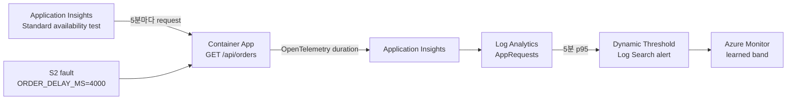
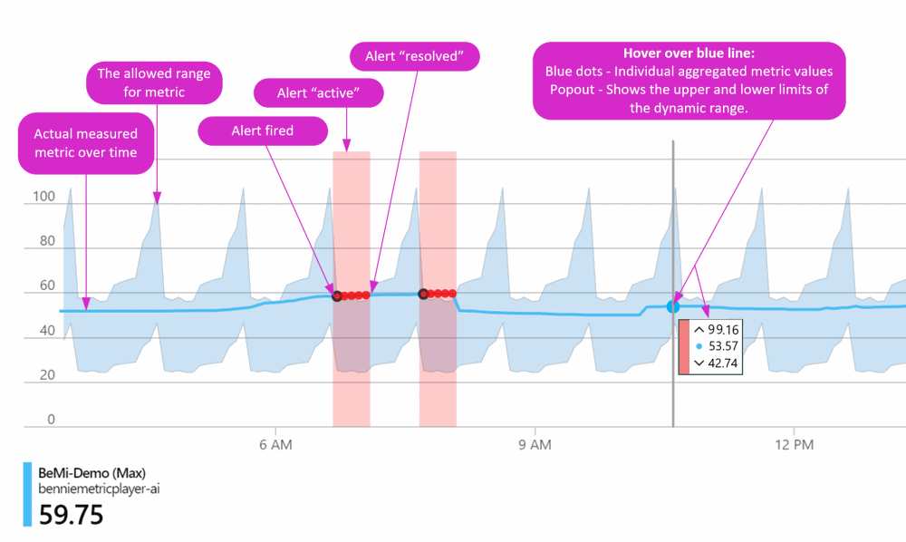

# Azure Monitor Dynamic Thresholds 실습: S2 latency

이 실습은 기존 S2의 `/api/orders` 지연을 재사용해 Dynamic Threshold가 실제
baseline을 학습한 뒤 p95 latency anomaly를 탐지하는 과정을 확인합니다.
정적 S2 rule은 당일 재현용으로 그대로 두고, Dynamic rule은 Action Group을 연결하지 않은 shadow mode로 병렬 운영합니다.

> 이 실습은 최소 3일 동안 Azure 리소스를 유지하므로 비용이 발생합니다.
> 끝나면 반드시 README의 `azd down --purge` 절차로 정리하세요.

## 전체 흐름



## 공식 Preview Chart



> 출처: [Create a Log Search alert rule with dynamic threshold](https://learn.microsoft.com/azure/azure-monitor/alerts/alerts-dynamic-thresholds)

## 배포되는 설정

| 항목 | 설정 |
|---|---|
| Baseline | Standard availability test가 한 location에서 `/api/orders`를 5분마다 호출 |
| Signal | `P95DurationMs=percentile(DurationMs, 95)`의 5분 bin |
| Dynamic rule | 5분 evaluation, 20분 window, Average aggregation, Medium sensitivity |
| Alert 조건 | 최근 4회 중 2회가 learned upper bound 초과(단, 겹치는 20분 window 때문에 같은 5분 이상치가 연속 평가에 다시 집계될 수 있음) |
| Action | 없음(shadow mode) |
| Static safety net | 기존 S2 `p95 > 2000ms` rule 유지 |

여기서 2-of-4는 서로 독립된 네 번의 측정을 뜻하지 않습니다. 20분 window가
5분마다 겹치므로, 같은 5분 bin 이상치 하나가 연속된 네 평가에 다시 포함될 수
있습니다. 또한 Log Search Dynamic Threshold는 1분 evaluation을 지원하지 않습니다.

## Phase 1 — 당일: 배포와 baseline 확인

README의 `azd up`을 완료한 뒤 환경을 읽습니다.

```bash
cd monitor/sre-agent-event-lab
source ./scripts/lab-env.sh
```

`lab-env.sh`는 이후 phase에서 다시 그대로 쓸 수 있도록 `APP_FQDN`,
`WORKSPACE_CUSTOMER_ID`, `BASELINE_WEB_TEST_NAME`,
`DYNAMIC_THRESHOLD_ALERT_NAME`을 현재 셸에 export합니다.

두 리소스가 활성화되었고 Dynamic rule에 Action Group이 없는지 확인합니다.

```bash
az resource show \
  --resource-group "${RESOURCE_GROUP}" \
  --resource-type Microsoft.Insights/webtests \
  --name "${BASELINE_WEB_TEST_NAME}" \
  --api-version 2022-06-15 \
  --query "{enabled:properties.Enabled,frequency:properties.Frequency,url:properties.Request.RequestUrl}" \
  --output table

az resource show \
  --resource-group "${RESOURCE_GROUP}" \
  --resource-type Microsoft.Insights/scheduledQueryRules \
  --name "${DYNAMIC_THRESHOLD_ALERT_NAME}" \
  --api-version 2025-01-01-preview \
  --query "{enabled:properties.enabled,frequency:properties.evaluationFrequency,actions:properties.actions.actionGroups}" \
  --output json
```

몇 차례 호출된 뒤 numeric series가 생성되는지 확인합니다.

```bash
az monitor log-analytics query \
  --workspace "${WORKSPACE_CUSTOMER_ID}" \
  --analytics-query "AppRequests
| where AppRoleName == '${TELEMETRY_SERVICE_NAME}'
| where Name has '/api/orders'
| where TimeGenerated > ago(2h)
| summarize P95DurationMs=percentile(DurationMs, 95) by bin(TimeGenerated, 5m)
| order by TimeGenerated desc" \
  --output table
```

당일에는 alert 발화를 기대하지 않습니다. Microsoft가 명시한 최소 조건은
3일과 30 samples이며, weekly seasonality 학습에는 최소 3주가 필요합니다.

## Phase 2 — 3일 이후: learned band와 anomaly 검증

3일 뒤 새 셸에서 다시 시작한다는 가정으로, 먼저 같은 preamble을 다시 실행합니다.

```bash
cd monitor/sre-agent-event-lab
source ./scripts/lab-env.sh
```

먼저 72시간 이상의 실제 범위와 30개 이상의 samples가 있는지 확인합니다.

```bash
az monitor log-analytics query \
  --workspace "${WORKSPACE_CUSTOMER_ID}" \
  --analytics-query "AppRequests
| where AppRoleName == '${TELEMETRY_SERVICE_NAME}'
| where Name has '/api/orders'
| where TimeGenerated > ago(4d)
| summarize P95DurationMs=percentile(DurationMs, 95) by bin(TimeGenerated, 5m)
| summarize Samples=count(), FirstSample=min(TimeGenerated), LastSample=max(TimeGenerated)
| extend AgeHours=datetime_diff('hour', LastSample, FirstSample)" \
  --output table
```

이 쿼리는 telemetry age만 보여 줍니다. 같은 azd 환경을 72시간 유지했다는
전제에서만 학습 준비 확인에 쓰세요. 그 사이 `azd up`을 다시 실행해 Dynamic
rule이 재생성되면 telemetry는 남아 있어도 규칙 학습이 다시 시작됩니다.

이 단계는 기존 S2 fault injection을 그대로 재사용하므로, `evidence/state.json`
에 `running` 또는 `failed` 시나리오가 남아 있지 않아야 합니다. 기존
`lab_state.py` 인터페이스로 먼저 확인합니다.

```bash
python3 scripts/lab_state.py show | jq -e '
  [(.scenarios // {})[]?.run_status // empty]
  | map(select(. == "running" or . == "failed"))
  | length == 0
' >/dev/null || {
  echo "evidence/state.json에 running 또는 failed 시나리오가 남아 있습니다. 먼저 기존 실행을 정리하세요." >&2
  exit 1
}
```

`alert-sre-lab-s2-latency` 정적 규칙은 그대로 유지되므로, 이번 지연 주입 중에는
기존 Action Group 경로와 Azure SRE Agent 조사도 함께 열릴 수 있습니다. 이는
Dynamic Threshold와 static safety net의 차이를 비교하기 위한 의도된 동작이며,
해당 조사는 해결하거나 무시 대상으로 기록해 두세요.

`AgeHours >= 72`와 `Samples >= 30`을 모두 확인한 뒤 지연을 주입합니다. 아래
trap은 명령 실패나 Ctrl+C에도 `ORDER_DELAY_MS=0` 복구를 시도합니다.

```bash
mkdir -p evidence
INJECTED=0

wait_for_new_healthy_revision() {
  local previous_revision="$1"
  local deadline=$(( SECONDS + 600 ))
  while (( SECONDS < deadline )); do
    NEW_REVISION="$(az containerapp show \
      --subscription "${SUBSCRIPTION_ID}" \
      --resource-group "${RESOURCE_GROUP}" \
      --name "${APP_NAME}" \
      --query properties.latestRevisionName -o tsv)"
    STATE="$(az containerapp revision list \
      --subscription "${SUBSCRIPTION_ID}" \
      --resource-group "${RESOURCE_GROUP}" \
      --name "${APP_NAME}" \
      --query "[?name=='${NEW_REVISION}'].{health:properties.healthState, active:properties.active} | [0]" -o json)"
    echo "${NEW_REVISION} ${STATE}"
    if [[ -n "${NEW_REVISION}" && "${NEW_REVISION}" != "${previous_revision}" ]] \
      && [[ "$(jq -r '.health // empty' <<<"${STATE}")" == "Healthy" ]] \
      && [[ "$(jq -r '.active // empty' <<<"${STATE}")" == "true" ]]; then
      return 0
    fi
    sleep 10
  done
  echo "새 revision이 시간 안에 정상이 되지 않았습니다." >&2
  return 1
}

restore_delay() {
  if (( ! INJECTED )); then
    echo "주입된 지연이 없어 복구를 건너뜁니다." >&2
    return 0
  fi

  RECOVERY_OLD_REVISION="$(az containerapp show \
    --subscription "${SUBSCRIPTION_ID}" \
    --resource-group "${RESOURCE_GROUP}" \
    --name "${APP_NAME}" \
    --query properties.latestRevisionName -o tsv)"

  az containerapp update \
    --subscription "${SUBSCRIPTION_ID}" \
    --resource-group "${RESOURCE_GROUP}" \
    --name "${APP_NAME}" \
    --set-env-vars ORDER_DELAY_MS=0 \
    --output none || {
      echo "복구 실패: ORDER_DELAY_MS=0 업데이트가 거부되었습니다." >&2
      return 1
    }

  wait_for_new_healthy_revision "${RECOVERY_OLD_REVISION}" || return 1
  curl -s --max-time 15 -o /dev/null -w '%{time_total}s %{http_code}\n' "https://${APP_FQDN}/api/orders"
}
trap restore_delay EXIT INT TERM

OLD_REVISION="$(az containerapp show \
  --subscription "${SUBSCRIPTION_ID}" \
  --resource-group "${RESOURCE_GROUP}" \
  --name "${APP_NAME}" \
  --query properties.latestRevisionName -o tsv)"

az containerapp update \
  --subscription "${SUBSCRIPTION_ID}" \
  --resource-group "${RESOURCE_GROUP}" \
  --name "${APP_NAME}" \
  --set-env-vars ORDER_DELAY_MS=4000 \
  --output none \
  && INJECTED=1

if (( INJECTED )); then
  wait_for_new_healthy_revision "${OLD_REVISION}" || exit 1
else
  echo "지연 주입이 실패해 anomaly 검증을 중단합니다." >&2
  exit 1
fi

for RUN in 1 2 3 4; do
  python3 scripts/loadgen.py \
    "https://${APP_FQDN}/api/orders" \
    --requests 20 \
    --concurrency 5 \
    --expect-status 200 \
    --output "evidence/dynamic-threshold-s2-${RUN}.json"
  if [[ "${RUN}" -lt 4 ]]; then
    sleep 300
  fi
done

restore_status=0
restore_delay || restore_status=$?
trap - EXIT INT TERM
(( restore_status == 0 )) || exit "${restore_status}"
```

Azure Portal에서 해당 Dynamic rule의 **Preview chart**와 alert history를
확인합니다. 실제 alert가 없으면 성공으로 간주하지 말고 다음을 구분합니다.

- `AgeHours < 72` 또는 `Samples < 30`: 학습 조건 미충족
- p95 points 없음: availability test 또는 telemetry 수집 실패
- points는 있으나 band 안쪽: anomaly 크기·지속 시간이 현재 모델에 부족
- band 밖 points가 2-of-4를 충족했지만 alert 없음: rule state와 query 오류 확인

복구 후 아래 쿼리로 p95가 정상 범위로 돌아오는지 확인합니다.

```bash
az monitor log-analytics query \
  --workspace "${WORKSPACE_CUSTOMER_ID}" \
  --analytics-query "AppRequests
| where AppRoleName == '${TELEMETRY_SERVICE_NAME}'
| where Name has '/api/orders'
| where TimeGenerated > ago(45m)
| summarize P95DurationMs=percentile(DurationMs, 95) by bin(TimeGenerated, 5m)
| order by TimeGenerated desc" \
  --output table
```

## 완료 기준

- 실제 3일·30 samples 조건을 충족한 telemetry를 확인했습니다.
- Preview chart에서 learned allowed range와 주입 구간을 확인했습니다.
- alert fired 또는 미발화 원인을 evidence로 기록했습니다.
- `ORDER_DELAY_MS=0`인 healthy revision으로 복구했습니다.
- 운영 연결은 false-positive/negative 검토 후에만 Action Group을 추가합니다.

## 공식 자료

- [Dynamic Thresholds 개념 정리](../azure-monitor-dynamic-thresholds-brief.md)
- [Create a Log Search alert rule with dynamic threshold](https://learn.microsoft.com/azure/azure-monitor/alerts/alerts-dynamic-thresholds)
- [Application Insights availability tests](https://learn.microsoft.com/azure/azure-monitor/app/availability)
- [ARM templates for log alerts](https://learn.microsoft.com/azure/azure-monitor/alerts/resource-manager-alerts-log)
