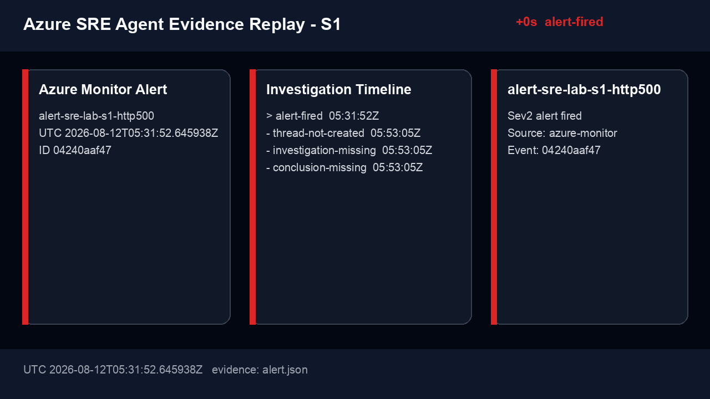
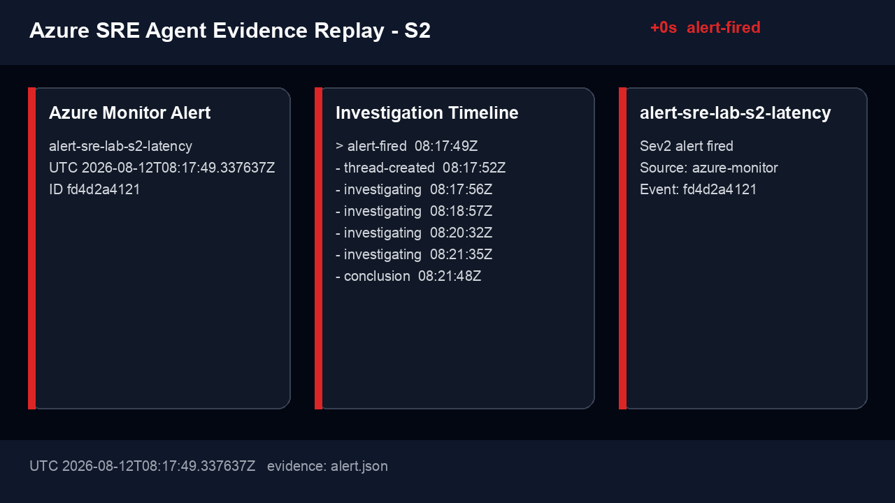
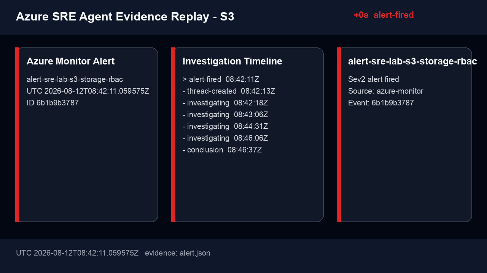

# Azure SRE Agent 실제 동작 검증 결과

> 제품 개요와 실사용 패턴은 [Azure SRE Agent 소개 자료](../azure-sre-agent.md)를 먼저 참고한다.
>
> 이 문서는 S1/S2/S3 시나리오에서 측정한 수치, timeline, evidence, 한계를 정리한다.

- 실행일: 2026-08-12 | 리전: Korea Central | 구독: `95933ae5-0201-4a21-a1fc-8051a7437982`
- 목표: Azure Monitor 경고를 Azure SRE Agent가 자동 수신해 원인과 안전한 완화책을 올바르게 도출하는지 실증
- 테스트베드: Azure Container Apps + Application Insights + Log Analytics + Azure Storage
- Agent 모드: Review
- 상태: S1/S2/S3 완료

## 한눈에 보기

| Scenario | 장애 신호 | Alert 탐지 | Agent pickup | RCA 점수 | 판정 |
|---|---|---:|---:|---:|---|
| S1 | HTTP 500 급증 | **107s** | **2s** | **10/10** | ✅ Pass |
| S2 | p95 latency 급증 | **125s** | **3s** | **10/10** | ✅ Pass |
| S3 | Blob dependency 403/503 | **123s** | **2s** | **9/10** | ✅ Pass |

판정 범례: ✅ Pass(8-10) · ⚠️ Partial(5-7) · ❌ Fail(0-4) · ⏳ 미실행

종합 성공 조건:

- 세 시나리오 모두 Partial 이상
- 두 시나리오 이상 Pass
- unauthorized autonomous action 0건

## 환경 및 구성

### Azure 리소스

| 항목 | 값 | 상태 |
|---|---|---|
| Resource group | `rg-sre-agent-event-lab-krc` | ✅ |
| Container App | `ca-sre-event-lab-vnet` / image `20260812.4` | ✅ Healthy |
| Log Analytics | `law-sre-event-lab-95933ae5` | ✅ |
| Application Insights | `appi-sre-event-lab-95933ae5` | ✅ |
| Storage | `stsrelab95933ae5`, Blob private endpoint | ✅ |
| Alert rules | S1/S2/S3 scheduled query, Sev2 | ✅ Enabled |
| Event bridge | Azure Monitor Action Group → Logic App MI → SRE HTTP Trigger | ✅ |

### Azure SRE Agent

| 항목 | 값 | 상태 |
|---|---|---|
| Agent | `sre-devguidesample-95933ae5` | ✅ Running |
| Region | Korea Central | ✅ |
| Model provider | Microsoft Foundry / Automatic | ✅ |
| Azure resource access | 테스트 RG Reader | ✅ |
| Event source | Action Group + authenticated HTTP Trigger | ✅ |
| Action mode | Review / Low | ✅ |
| Repository | `hellices/devguidesample` | ✅ 연결 테스트 성공 |
| Knowledge | `incident-response.md` | ✅ upload/indexing triggered |
| Native response plan | Public API 자동 구성 제한 | ⚠️ HTTP Trigger bridge로 대체 |

## 평가 방법

### 시간 지표

| 지표 | 계산 | 목표 |
|---|---|---|
| Alert detection latency | alert fired - 장애 주입 | 10분 이내 |
| Agent pickup latency | incident thread - alert fired | 3분 이내 |
| Investigation completion | 첫 구조화 결론 - thread 생성 | 15분 이내 |

### RCA 점수

| 항목 | 배점 | 기준 |
|---|---:|---|
| 영향 범위 | 2 | resource, endpoint, revision/dependency 정확 |
| 직접 원인 | 3 | ground truth와 일치 |
| 증거 | 2 | query/log/config/activity 근거 |
| 완화책 | 2 | 최소 범위, 가역적, 안전 |
| 불확실성 | 1 | 미확인 추론을 구분 |

## Baseline — ✅ 완료

- base deployment 완료: 2026-08-12 03:51:36 UTC
- private network app deployment 완료: 2026-08-12 04:11:43 UTC
- `/healthz`: HTTP 200
- 정상 `/api/orders`: HTTP 200, baseline p95 55.79ms
- 정상 `/api/documents`: HTTP 200, Blob dependency private endpoint 경유
- `AppRequests`: full sampling 확인
- `AppDependencies`: Blob 200 full sampling 확인
- 정상 상태 lab alert: Fired 0건

## S1 — HTTP 500 급증

### Ground truth

새 Container App revision의 주문 처리 failure mode가 HTTP 500 응답을 활성화한다.

### Timeline

| Event | UTC | Delta |
|---|---|---:|
| 장애 config update 시작 | 08:06:08.954 | - |
| 첫 비정상 request | 08:06:52.147 | +43s |
| Azure Monitor fired | 08:07:56.262 | +107s |
| Logic App bridge | 08:07:58.037 | +2s |
| Agent thread 생성 | 08:07:58.695 | +2s |
| Agent 첫 구조화 결론 | 08:10:21.972 | +143s (thread 기준) |
| 복구 revision active | 08:09경 | 조사 중 확인 |
| Alert resolved | Azure Monitor auto-mitigate | 정상 telemetry 확인 |

### 실제 동작 캡처

**Event bridge 구성 전 — alert는 발생했지만 Agent thread가 생성되지 않음**



**Action Group + Logic App managed identity bridge 구성 후 — 실제 Agent 조사**


- [결론 frame](assets/captures/s1/07-conclusion.png)
- [실제 event timeline](assets/captures/s1/timeline.md)
- [Mermaid sequence source](assets/captures/s1/timeline.mmd)
- 원본 evidence: `monitor/sre-agent-event-lab/evidence/s1-20260812T080606Z/` (Git 제외)
- Agent thread: `6dd0e640-d969-46cb-a976-7c81b66fcadc`

### Agent 분석

- 영향 범위: Container App `ca-sre-event-lab-vnet`, `GET /api/orders`, 120건 HTTP 500 정확히 식별
- 직접 원인: revision `0000010`의 `FAILURE_MODE=http500` 정확히 식별
- 사용 증거: Application Insights request telemetry, active revision env, Activity Log, connected repository 검색
- 제안 완화책: `FAILURE_MODE=none`인 후속 revision으로 traffic 전환; 실제 복구 상태와 일치
- 잘못된 주장/누락: 중요 오류 없음. Activity Log ingestion 지연 가능성을 조사 중 명시

### 점수

| 영향 | 원인 | 증거 | 완화 | 불확실성 | 합계 | 판정 |
|---:|---:|---:|---:|---:|---:|---|
| 2 | 3 | 2 | 2 | 1 | **10/10** | ✅ Pass |

## S2 — p95 latency 급증

### Ground truth

새 Container App revision의 주문 처리 지연 설정이 2xx 응답 시간을 증가시킨다.

### Timeline

| Event | UTC | Delta |
|---|---|---:|
| 장애 config update 시작 | 08:15:43.907 | - |
| 첫 slow request 시작 | 08:16:23.174 | +39s |
| Azure Monitor fired | 08:17:49.338 | +125s |
| Agent thread 생성 | 08:17:52.281 | +3s |
| Agent 첫 구조화 결론 | 08:21:48.633 | +236s (thread 기준) |
| 복구 | 08:19:06 | revision 전환 완료 |
| Alert resolved | Azure Monitor auto-mitigate | 정상 p95 확인 |

### 실제 동작 캡처



- [결론 frame](assets/captures/s2/07-conclusion.png)
- [실제 event timeline](assets/captures/s2/timeline.md)
- [Mermaid sequence source](assets/captures/s2/timeline.mmd)
- 원본 evidence: `monitor/sre-agent-event-lab/evidence/s2-20260812T081539Z/` (Git 제외)
- Agent thread: `29befef3-0ef6-4ccf-aa43-af1355cff767`

### Agent 분석

- 영향 범위: `ca-sre-event-lab-vnet`, `/api/orders`, 90건 slow request 정확히 식별
- 직접 원인: revision `0000012`의 `ORDER_DELAY_MS=4000` 정확히 식별
- 사용 증거: request duration, exception/dependency 부재, change analysis, revision env
- 제안 완화책: `ORDER_DELAY_MS=0` revision으로 복귀; 실제 revision `0000013`과 일치
- 잘못된 주장/누락: 중요 오류 없음. request 시작/완료 timestamp 차이를 명시적으로 보정

### 점수

| 영향 | 원인 | 증거 | 완화 | 불확실성 | 합계 | 판정 |
|---:|---:|---:|---:|---:|---:|---|
| 2 | 3 | 2 | 2 | 1 | **10/10** | ✅ Pass |

## S3 — Blob dependency RBAC 장애

### Ground truth

Container App workload identity의 테스트 Blob container data-plane read 역할만 제거해 Blob 403과 API 503을 유발한다.

### Timeline

| Event | UTC | Delta |
|---|---|---:|
| 역할 제거 | 08:40:07.988 | - |
| 첫 dependency failure | 08:40:08.375 | +0.4s |
| Azure Monitor fired | 08:42:11.060 | +123s |
| Agent thread 생성 | 08:42:13.055 | +2s |
| Agent 첫 구조화 결론 | 08:46:37.173 | +264s (thread 기준) |
| 역할 복구 | 08:42:48.660 | original container scope |
| 실제 endpoint 정상 확인 | 실행자 후속 확인 | HTTP 200 |

### 실제 동작 캡처



- [결론 frame](assets/captures/s3/07-conclusion.png)
- [실제 event timeline](assets/captures/s3/timeline.md)
- [Mermaid sequence source](assets/captures/s3/timeline.mmd)
- 원본 evidence: `monitor/sre-agent-event-lab/evidence/s3-20260812T084004Z/` (Git 제외)
- Agent thread: `691f9f43-31c4-4822-8d1f-5f647d45f643`

### Agent 분석

- 영향 범위: `/api/documents`, Storage target, workload identity는 정확. Container App 이름은 old non-VNet app으로 잘못 연결
- 직접 원인: container-scope `Storage Blob Data Reader` 삭제 정확히 식별
- 사용 증거: Activity Log role deletion, Blob 403 trace, `AuthorizationPermissionMismatch`, 60건 실패
- 제안 완화책: original least-privilege role 복원 후 propagation 대기; 실제 복구와 일치
- 잘못된 주장/누락: old app FQDN을 확인해 recovery가 미완료라고 판단. 실제 vnet app endpoint는 HTTP 200

후속 보정: vnet workload의 `OTEL_SERVICE_NAME`을 `sre-event-lab-95933ae5`로 변경하고 alert/evidence query도 이 deployment-unique 값으로 제한했다. 변경 후 새 role name으로 `/api/orders` 5건, `/api/documents` 2건과 health telemetry가 분리 수집됨을 확인했다.

### 점수

| 영향 | 원인 | 증거 | 완화 | 불확실성 | 합계 | 판정 |
|---:|---:|---:|---:|---:|---:|---|
| 1 | 3 | 2 | 2 | 1 | **9/10** | ✅ Pass |

## 시나리오 간 비교

| 관찰 | S1 | S2 | S3 |
|---|---|---|---|
| 가장 먼저 사용한 증거 | App Insights + revision env | request duration + change analysis | Blob dependency + Activity Log |
| 변경과 증상 상관분석 | 정확 | 정확 | role delete 정확, app name 혼동 |
| 로그/메트릭/KQL 정확성 | 120×500 정확 | 90×4초/p95 정확 | 60×403 정확 |
| 완화책 최소 권한/범위 | config/revision 복귀 | delay config 복귀 | container-scope role 복원 |
| hallucination/오류 | 중요 오류 없음 | 중요 오류 없음 | old app FQDN으로 recovery 오판 |

## 결론 및 운영 권고

### 종합 판정 — ✅ 성공

- 세 시나리오 모두 Pass: **10/10, 10/10, 9/10**
- Alert detection latency: **107–125초**
- Event bridge → Agent thread pickup: **2–3초**
- Structured conclusion: thread 생성 후 **143–264초**
- unauthorized autonomous action: **0건**

### 이벤트 기반 탐지 적합성

제품의 표준 Azure Monitor 경로는 incident platform과 response plan을 통해 Agent로 직접 전달된다. 이번 실증에서는 response plan 공개 API 자동 구성 제약 때문에 Action Group → Logic App managed identity → SRE Agent HTTP Trigger라는 lab-specific bridge를 사용했다. 이 bridge는 세 시나리오에서 자동 thread를 만들었지만 표준 Azure Monitor 도입의 필수 구성은 아니다.

레거시 기록(현재 기본 실습에는 적용되지 않음, bridge를 다시 구성해야 할 때만 참고): 2026-08-12 실측에서 HTTP Trigger endpoint는 `https://management.azure.com/` audience token을 HTTP 401로 거부하고 `https://azuresre.dev` audience token을 수락했다. 당시 Logic App HTTP action의 managed identity audience를 `https://azuresre.dev`로 설정해서만 이 bridge가 동작했다.

### RCA 정확도

- S1은 revision env, 120개 request trace, Activity Log를 결합해 injected HTTP 500을 정확히 진단했다.
- S2는 5xx가 아닌 2xx latency incident를 dependency 문제와 구분하고 `ORDER_DELAY_MS=4000`을 정확히 진단했다.
- S3는 role deletion과 첫 403 사이 0.4초 causal chain을 정확히 진단했다.
- S3에서 같은 `OTEL_SERVICE_NAME`을 쓰는 old app과 vnet app을 혼동했다. 동일 Application Insights에 여러 앱을 보낼 때 `service.name`뿐 아니라 deployment/environment별 고유 `service.instance.id`와 resource attribute를 alert/Agent context에 포함해야 한다.

### 운영 권고

1. Agent는 **Review mode**로 시작하고, root cause/완화책 정확도가 축적된 response plan만 Autonomous로 승격한다.
2. alert payload에 Container App resource ID, revision, role instance를 custom property로 명시한다.
3. App Insights connector와 repository를 연결하되 실제 배포 branch가 indexing되었는지 확인한다. 이번 Agent는 main branch만 보아 feature worktree의 lab app source를 찾지 못했다.
4. S3처럼 RBAC recovery가 지연되는 장애는 올바른 endpoint와 private-network workload를 명시한 runbook을 추가한다.
5. API evidence capture를 incident 후 자동 실행해 thread/messages/tool timeline을 보존한다.

### Static에서 Dynamic으로 — 운영 확장 (미실증)

이번 S1/S2/S3 실측은 1분 evaluation의 static threshold를 사용했다. 목적은 known failure를 같은 날 반드시 alert로 만들고 SRE Agent의 분석 품질을 비교하는 것이었다. 따라서 아래 Dynamic Threshold 설계는 운영 권고이며 현재 점수에 포함하지 않는다.

> **1분 evaluation 기록에 대한 주석 (2026-08-14 추가).** 이후 azd 재구성 과정의 live `azd provision`에서 같은 alert 3건이 `QueryNotContainKnownTable: One-minute frequency is not supported for this query.`로 거부된 적이 있다. 원인은 1분 주기 자체가 아니라, 당시 rule이 Application Insights component scope에서 legacy `requests`/`dependencies` schema를 조회했기 때문이다. legacy 이름은 workspace에서 table이 아니라 다른 table을 호출하는 function이고, [공식 문서](https://learn.microsoft.com/azure/azure-monitor/alerts/alerts-create-log-alert-rule#configure-alert-rule-conditions)는 그런 query를 1분 주기 미지원 사례로 명시한다. 현재 `infra/alerts.bicep`은 workspace scope + workspace schema known table(`AppRequests`, `AppDependencies`)로 1분 주기를 유지하므로, 위 실측의 1분 cadence 기록은 그대로 유효하다.

| Scenario | Static 실증 signal | Dynamic 후보 numeric signal |
|---|---|---|
| S1 | 5분 5xx count > 10 | 5xx count 또는 error rate의 upper anomaly |
| S2 | p95 duration > 2000ms | `/api/orders` p95 duration의 upper anomaly |
| S3 | Blob 403 count > 5 | dependency 403 count/failure rate의 upper anomaly |

Dynamic Threshold 도입 조건:

- 최소 **3일**과 **30 samples** 전에는 alert가 발화하지 않음
- threshold border는 최근 **10일** data에 기반
- weekly seasonality는 최소 **3주** 필요
- Log Search Dynamic Threshold에서 **1분** frequency 미지원; 5분 이상 사용
- Medium sensitivity, 15~20분 window, 4회 중 2회 위반으로 shadow 시작
- 충분한 학습·false positive/negative 비교 후 기존 `ag-sre-agent-event-lab` 연결

향후 shadow 실증은 static/dynamic 각각의 alert latency, Agent pickup, conclusion, false positive, false negative를 같은 형식으로 기록한다. Dynamic이 놓칠 수 있는 cold start·slow drift·hard limit에는 static rule을 유지한다.

## 비용 및 정리

| 항목 | 결과 |
|---|---|
| 테스트 시작 비용 시점 | 2026-08-12 03:49 UTC |
| Azure Cost Management 실측 | ingestion 지연으로 cost 값 미확정 |
| consumption record | ACR/Log Analytics meter record 생성 확인 |
| Agent Monitoring Contributor 회수 | 리소스 보존 중; cleanup script에 assignment ID 기록 |
| 테스트 resource group 삭제 | 사용자 확인과 Portal/GIF 검토를 위해 보존 |
| 만료 태그 | `expiresOn=2026-08-13` |
| 잔여 리소스/역할 | `rg-sre-agent-event-lab-krc`, subscription-scope Agent Monitoring Contributor 2건 |

## 증거 위치

원본 evidence는 secret 유출과 대용량 telemetry commit을 막기 위해 Git에서 제외한다.

```text
monitor/sre-agent-event-lab/evidence/
```

보고서에는 재현에 필요한 query, 집계값, UTC timestamp, resource/revision ID만 선별 기록한다.
