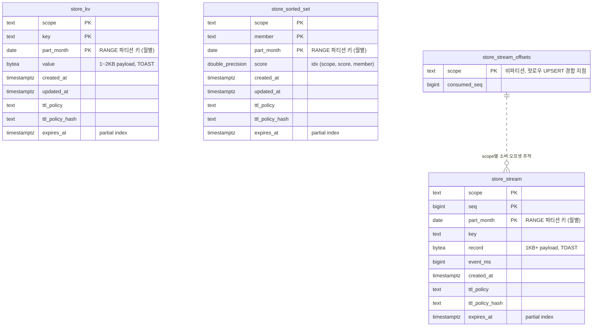

# PostgreSQL CPU 100% 재현 및 원인 분석 — 부하 스크립트

[cpu100-connection-churn-reproduction.md](../cpu100-connection-churn-reproduction.md)의 실험에 사용한 도구. 전부 Python 3.9+ / psycopg2 기반.

## 공통 설정

```bash
pip install psycopg2-binary
export PGHOST=<server>.postgres.database.azure.com
export PGPASSWORD=<password>
export PGUSER=pgadmin      # 기본값
export PGDATABASE=postgres # 기본값
```

스키마: `psql -f schema.sql` (store 4테이블 + 월별 파티션 + 인덱스)

## 스키마 ERD



- 테이블 간 FK 없음 — `scope`를 논리 키로 공유하는 독립 테이블 4종 (Redis의 KV/Stream/SortedSet 유사 구조)
- `store_kv`/`store_stream`/`store_sorted_set`: `part_month` RANGE 파티션 (테이블당 12개 월 파티션, 자식마다 인덱스 4~5개 전파)
- `store_stream_offsets`: 비파티션 단일 테이블. `ON CONFLICT (scope) DO UPDATE` 트래픽이 집중되는 핫로우


## 스크립트 목록

| 스크립트 | 실험 (문서 §) | 용도 |
|----------|:---:|------|
| `retry_spiral.py` | §3.1 | **재시도 나선**: 적은 태스크율 + per-request connect + timeout/재시도 → 커넥션 눈사태 |
| `churn_storm.py` | §3.2, §3.5 | connect→INSERT→close 반복 폭풍 (5432/6432 비교) |
| `pool_thrash.py` | §3.3 | minIdle=0 풀 + 버스트 → 풀이 스스로 연결 개폐 반복 |
| `replay.py` | §6 기각1 | 운영 쿼리 믹스 재현 (버스트 스케줄러 포함) |
| `hyp.py` | §6 기각2 | read 믹스 / prefix 스캔 / 커넥션 churn(6432) 가설 테스트 |
| `session_storm.py` | §6 기각3 | 스레드당 1세션 유지 + 주기적 write |
| `pooled_client.py` | §6 기각3 | ThreadedConnectionPool 다인스턴스 시뮬레이션 |
| `idle_holder.py` | §6 기각4 | 쿼리 없는 idle 세션 대량 유지 |
| `bouncer_storm.py` | §6 참고 | PgBouncer 클라이언트 연결 대량 유지 |
| `bloat.py` | §6 기각7 | 핫로우 UPSERT 지속으로 dead tuple/bloat 누적 |

## 사용 예

```bash
# §3.1 재시도 나선 (태스크 40/s per process, 5 프로세스 권장)
python3 retry_spiral.py 40 780 5 2   # rate duration conn_timeout retries

# §3.2 churn 폭풍 (프로세스당 워커 60, 8 프로세스 권장)
python3 churn_storm.py 60 900        # workers duration [host] [sslmode]

# §3.3 pool thrashing
python3 pool_thrash.py 10 20 0 900   # instances max_size min_idle duration

# §6.1 쿼리 믹스 replay
python3 replay.py --port 6432 --workers 120 --base-rate 3000 --burst-rate 6000 --duration 480
```

> ⚠️ 세션 수천 개를 만드는 시나리오는 대상 서버를 OOM으로 다운시킬 수 있음 (문서 §4 참고). 재현 전용 서버에서만 실행.
