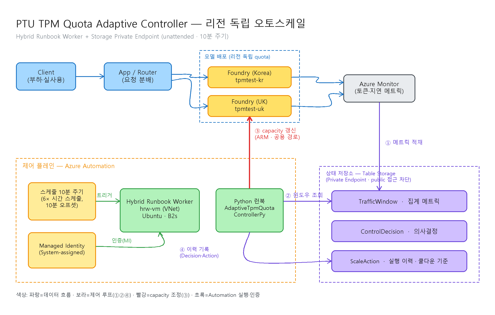

# Adaptive PTU TPM Quota 조정 가이드 (with Sample Test)

## 문제 상황

동일 워크로드를 처리하는 2개 모델 배포(Korea/UK)가 있으며, 각 리전의 사용률(utilization)에 따라 모델별 TPM quota(= deployment SKU capacity)를 안정적으로 자동 조정하는 adaptive 자동화가 필요하다.

- 현재 테스트 환경: Global Standard deployment 2개
- 목표 운영 환경: PTU deployment 기반 자동화
- 핵심 목표: TPM quota 조정 자동화, 성능 안정화, 플래핑 방지

> **핵심 설계 결정 — Reserved quota 공유 상한 하 비례 재분배**
>
> 두 리전(Korea/UK)은 사용자가 **Reservation한 총 TPM quota**(예: 20,000 TPM)를 나눠 쓰며, 두 배포 capacity의 **합은 이 Reserved 총량을 어떤 시점에도 초과할 수 없다.** 초과하는 증설 요청은 거부된다.
> 따라서 각 리전을 독립으로 올리는 방식이 아니라, **고정된 Reserved 총량을 트래픽 비율에 맞춰 두 리전에 재분배**한다.
> - **감축 먼저, 증설 나중**: 총량이 꽉 찬 상태에서 증설을 먼저 하면 실패하므로, 여유를 내주는 리전을 **먼저 감축**해 headroom을 확보한 뒤 증설한다.
> - **loss 최소화**: 증설은 우선 미할당 버퍼로 충당(무손실)하고, 버퍼가 부족할 때만 잉여 리전에서 회수하되 감축·증설을 같은 사이클에서 연속 처리해 총 가용량이 줄어드는 구간을 최소화한다.
> - **리전 최소 보장**: 각 리전은 Reserved 총량의 25% 이상을 항상 유지한다.
>
> ※ 위 수치(총량 20,000 TPM, 리전 최소 보장 25% 등)는 **샘플 값**이며, 런북 상단 파라미터로 조정 가능한 **변수**다. Reserved 총량(`RESERVED_TOTAL_TPM`), capacity 환산(`TPM_PER_CAPACITY_UNIT`), 최소 보장 비율(`MIN_CAPACITY_RATIO`), 목표/상하한 사용률(`AIM_UTIL`/`TARGET_UTIL_HIGH`/`TARGET_UTIL_LOW`), 스텝(`MAX_STEP_UNITS`), 쿨다운(`COOLDOWN_MINUTES`) 등을 운영 환경에 맞게 바꿔 쓰면 된다.

## 아키텍처

Azure Automation은 **스케줄러 + 실행/인증 호스트** 역할이며, 실제 제어 로직은 Python 런북(Azure SDK)이 담당한다. 제어 루프는 **① 메트릭 적재 → ② 윈도우 조회 → ③ 목표 재분배·capacity 갱신(감축→증설, 쿨다운 가드) → ④ 이력 기록** 순으로 동작한다.

- 데이터 플레인(파랑): Client → App/Router → Foundry(KR/UK) → Azure Monitor
- 제어 플레인(초록): 스케줄이 Hybrid Runbook Worker를 트리거하고, Worker가 VNet 안에서 Python 런북을 실행(관리 ID 인증)
- 상태 저장소(보라): Table Storage(TrafficWindow/ControlDecision/ScaleAction)에 **Private Endpoint**로 접근 (Storage `publicNetworkAccess=Disabled`)
- capacity 조정(빨강): 런북이 Reserved 총량 제약 하에 **감축→증설 순서**로 Foundry 배포 SKU capacity를 ARM(공용 경로)으로 갱신

## Azure 리소스 구성

### 필수

1. Azure AI Foundry model deployment (Korea)
2. Azure AI Foundry model deployment (UK)
3. Azure Storage Account (Table Storage)
4. Azure Automation Account
5. Managed Identity (Runbook 실행 주체)
6. Azure Monitor 또는 Log Analytics

### 권장

1. Application Insights
2. Azure Key Vault
3. Action Group

## 데이터 모델 (Table Storage)

### TrafficWindow

- 목적: n분 단위 메트릭 집계 저장
- PartitionKey: region (korea | uk)
- RowKey: windowStartUtc (ISO8601)
- 컬럼: requestCount, inputTokens, outputTokens, p95LatencyMs, errorRate, assignedTpm

### ControlDecision

- 목적: 리전별 제어 의사결정 저장
- PartitionKey: date (yyyyMMdd)
- RowKey: `{timestamp}-{region}-{guid}`
- 컬럼: region, utilization, avgConsumedTpm, capacityBefore, capacityTarget, decision(up|down|hold), reason, cooldownBlocked, executed

### ScaleAction

- 목적: 리전별 실제 capacity 조정 실행 결과 저장
- PartitionKey: date (yyyyMMdd)
- RowKey: `{timestamp}-{region}-{guid}`
- 컬럼: region, requestPayload, capacityBefore, capacityTarget, changed, responseStatus, success, errorMessage, durationMs

## 안정적 자동화 운영 원칙

짧은 주기로 빈번하게 조정하면 오히려 불안정해질 수 있으므로, 제어 루프는 안정성을 우선한다.

1. 관측 주기와 조정 주기를 분리
2. 단일 포인트가 아닌 이동평균으로 판단
3. 쿨다운 동안 재조정 금지
4. 1회 최대 변경폭 제한
5. 리전별 최소/최대 capacity 경계값 강제(최소 = Reserved 총량의 25%)
6. 두 리전 capacity 합은 Reserved 총량을 항상 준수(초과 증설 불가)
7. 재분배는 감축을 먼저 실행해 headroom 확보 후 증설

## 운영 파라미터 (변수화)

제어 knob은 리전별 **capacity unit**(배포 SKU capacity)이며, `TPM_PER_CAPACITY_UNIT`로 TPM과 매핑한다. 두 리전 capacity의 합은 `RESERVED_TOTAL_TPM`(Reserved quota)을 넘을 수 없다.

| 파라미터 | 의미 | 권장 시작값 |
|---|---|---|
| METRIC_WINDOW_MINUTES | 메트릭 집계 윈도우(분) | 5 |
| SMOOTHING_WINDOWS | 이동평균 윈도우 개수 | 3 |
| TPM_PER_CAPACITY_UNIT | capacity 1 unit ≈ TPM | 1000 |
| RESERVED_TOTAL_TPM | Reservation한 총 TPM 상한(합산 불변) | 20000 |
| TOTAL_CAPACITY_UNITS | Reserved 총량의 capacity 환산(= RESERVED_TOTAL_TPM / TPM_PER_CAPACITY_UNIT) | 20 |
| TARGET_UTIL_HIGH | 이 사용률 초과 → 증설 압력 | 0.75 |
| TARGET_UTIL_LOW | 이 사용률 미만 → 감축(잉여 회수) | 0.30 |
| AIM_UTIL | 조정 후 목표 사용률 | 0.60 |
| MAX_STEP_UNITS | 1회 최대 capacity 변경폭 | 5 |
| MIN_CAPACITY_RATIO | 리전별 최소 보장 비율(Reserved 총량 대비) | 0.25 |
| MIN_CAPACITY | 리전별 최소 보장 capacity(= ceil(TOTAL × 0.25)) | 5 |
| MAX_CAPACITY | 리전별 최대 capacity. 2리전 기본값 = TOTAL − MIN_CAPACITY, N리전은 `TOTAL − (N−1)·MIN_CAPACITY` | 15 |
| COOLDOWN_MINUTES | 조정 후 재조정 금지 시간(분) | 20 |

> 불변식: 항상 `Σ cap_r ≤ TOTAL_CAPACITY_UNITS`. 리전 최대는 `TOTAL − (N−1)·MIN_CAPACITY`로 일반화되며(2리전이면 `TOTAL − MIN_CAPACITY`), 최소는 총량의 25%를 보장한다.
>
> **리전 확대 시**: 코드 변경은 `REGIONS`(PS `$Regions`) 매핑에 항목을 추가하는 것으로 끝난다. 리전별 최대는 `region_max(n)`(PS `Get-RegionMax`)이 리전 수 n으로 자동 일반화하고, 총량 제약·감축→증설 순서·MIN 보장은 그대로 유지된다.
>
> **PayGo fallback 병행 시**: 상위 트래픽이 PTU 초과분을 PayGo(표준) 배포로 흘리는 구성에서는 PTU util을 100%에 근접(TARGET_UTIL_HIGH·AIM_UTIL ≈ 1.0)시켜도 무방하다. 초과분은 fallback LLM이 흡수하므로, 비용 최적화 관점에서 적정 PTU/PayGo 비중을 도출하는 것이 목표다.

## 샘플 테스트 Sizing (권장)

샘플 테스트 목적이므로 비용과 변동성을 낮추는 보수적 크기로 시작한다.

### 권장 시작값

1. 모델 배포 수: 2개 (Korea, UK)
2. Reserved 총량: 20,000 TPM (= 20 capacity unit)
3. 초기 capacity: 10 / 10 (합 20 = Reserved 총량 만재, 버퍼 0)
4. 리전 최소 capacity: 5 (Reserved 총량의 25%)
5. 리전 최대 capacity: 15 (= 총량 − 상대 리전 최소)
6. 1회 조정폭: 최대 5 unit
7. 사용률 밴드: LOW 30% ~ HIGH 75% (AIM 60%)
8. 쿨다운: 20분

### 부하 프로파일 (샘플)

Reserved 총량이 만재(10/10)인 상태에서 트래픽을 기울여 리전 간 재분배를 유도한다.

1. Baseline 20분: 양 리전 util 40~60% (유지 구간, 재분배 없음)
2. 기울기 30분: Korea util 85%+(PayGo fallback 병행 시 ≈100%까지 허용) / UK util 20% → UK 먼저 감축 후 Korea 증설(감축→증설)
3. 역전 30분: UK util 85%+ / Korea util 20% → 반대 방향 재분배(쿨다운 경과 후)
4. 진동 30분: 10분 단위 고/저 교차 → 쿨다운/스텝 제한으로 왕복 억제

### 샘플 성공 기준

1. 두 리전 capacity 합이 Reserved 총량을 항상 준수(초과 0회)
2. 재분배 시 감축이 증설보다 먼저 실행됨(증설 선행 실패 0회)
3. 고사용률 리전 증설분이 잉여 리전 감축분으로 충당됨(loss 최소)
4. 쿨다운 중 불필요한 재조정이 발생하지 않음
5. ControlDecision, ScaleAction 이력이 누락 없이 기록됨
6. 메트릭 열화(조회 실패) 시 RI 균등분배 fallback으로 전환되어 미할당 버퍼 없이 총량을 소진함

### 파라미터 적용 규칙

1. 스케줄 주기는 METRIC_WINDOW_MINUTES의 배수
2. COOLDOWN_MINUTES는 스케줄 주기보다 크게 설정
3. 초기에는 MAX_STEP_UNITS를 낮게 시작해 플래핑 여부 검증

## Adaptive 제어 로직 (Reserved 총량 공유)

두 리전을 **하나의 Reserved 총량 예산**으로 함께 평가하고, 목표를 먼저 산출한 뒤 총량 제약을 지키는 순서로 실행한다.

1. 각 배포의 현재 capacity를 SDK로 조회(폐루프 기준값)
2. 최근 SMOOTHING_WINDOWS 구간의 분당 소비 TPM 이동평균 산출

$$
consumedTpm_r = \frac{1}{N}\sum_{i=1}^{N} \frac{inputTokens_i + outputTokens_i}{METRIC\_WINDOW\_MINUTES}
$$

3. 리전별 사용률과 AIM_UTIL 기준 필요 capacity(need) 산출

$$
utilization_r = \frac{consumedTpm_r}{capacity_r \times TPM\_PER\_CAPACITY\_UNIT}
\qquad
need_r = \left\lceil \frac{consumedTpm_r}{AIM\_UTIL \times TPM\_PER\_CAPACITY\_UNIT} \right\rceil
$$

4. 목표 capacity 산출 (Reserved 총량 제약)
- **여유 있음** ($\sum_r need_r \le TOTAL$): 각 리전에 need만 배정, 나머지는 미할당 버퍼로 둔다
- **경합** ($\sum_r need_r > TOTAL$): 각 리전에 MIN을 먼저 보장하고, 남은 용량을 소비 TPM 비율로 배분

$$
target_r = MIN\_CAPACITY + \left\lfloor (TOTAL - n \cdot MIN\_CAPACITY)\times\frac{consumedTpm_r}{\sum_j consumedTpm_j} \right\rfloor
$$

5. dead-band·스텝 완충
- 경합이 아니고 사용률이 [LOW, HIGH] 안이면 유지(hold)로 churn 방지
- 목표로의 이동을 ±MAX_STEP_UNITS로 제한
- 리전 최소/최대(MIN_CAPACITY ~ MAX_CAPACITY = TOTAL − MIN) 경계 적용

6. 쿨다운 가드
- 해당 리전의 마지막 '실제 변경(changed=true)' ScaleAction이 COOLDOWN_MINUTES 이내면 조정 차단

7. 총량 제약 실행 (감축 먼저 → 증설 나중)
- 현재 headroom = TOTAL − Σ(현재 capacity)
- planned < 현재인 리전(잉여 회수)을 **먼저 감축** → headroom 증가
- planned > 현재인 리전을 **사용률 높은 순**으로, 남은 headroom 한도 안에서만 증설
- headroom이 없으면 이번 사이클 증설은 보류(다음 사이클 수렴), 어떤 시점에도 합 ≤ TOTAL 보장

8. 실행 및 기록
- capacity 갱신 API 호출(azure-mgmt-cognitiveservices)
- ControlDecision, ScaleAction 기록(경합 여부·headroom 제한 사유 포함)
- 다음 주기에서 개선 여부 재평가

## Runbook Workflow

한 사이클은 두 리전을 함께 처리한다(공유 총량 재분배):

1. (수집) 각 배포의 현재 capacity 조회 + Table 최근 윈도우로 이동평균 사용률 계산
2. (산출) 리전별 need 계산 → Reserved 총량 제약으로 목표(target) 배분(여유/경합 분기)
3. (완충) dead-band·스텝·쿨다운 가드로 이번 사이클 planned 결정
4. (실행 1) planned < 현재인 리전을 먼저 감축 → headroom 확보
5. (실행 2) planned > 현재인 리전을 사용률 높은 순으로 headroom 한도 내 증설
6. (기록) 리전별 ControlDecision / ScaleAction 기록
7. (안전) 개별 API 실패 시 기록 후 계속, 합이 총량을 넘지 않도록 보장
8. (fallback) 메트릭 조회 열화 시 소비 기반 재분배 대신 **RI 균등분배**(총량을 리전 수로 균등)로 전환 → 판단 근거가 없을 때도 미할당 버퍼 없이 RI에 맞는 PTU를 최대 소진(감축→증설 순서·총량 불변식 유지)

## 테스트 시나리오

### Test-1 Baseline

- 양 리전 util 40~60% 유지, 총량 만재(10/10)
- 불필요 조정 0회 확인

### Test-2 재분배 (감축→증설)

- Korea util 85%+ / UK util 20% 유도 (PayGo fallback 병행 시 Korea ≈100%도 정상으로 판정)
- UK 감축이 Korea 증설보다 먼저 실행되고, 합이 총량을 유지하는지 확인

### Test-3 증설 선행 방지

- 총량 만재 상태에서 Korea 증설 요청 발생
- 감축 없이 증설을 시도하지 않음(증설 선행 실패 0회) 확인

### Test-4 경합 비례 배분

- 양 리전 동시 고부하(합 need > 총량)
- 소비 TPM 비율대로 target이 배분되고 합 ≤ 총량 확인

### Test-5 플래핑 억제

- 10분 단위로 사용률 고/저 교차
- 쿨다운/스텝 제한으로 왕복 조정 억제 확인

### Test-6 장애 복원력

- capacity 변경 API 실패 강제
- 재시도/기록/안전 종료 및 총량 불변식 유지 확인
- 메트릭(Table) 조회 실패 강제 → RI 균등분배 fallback 전환 및 총량 불변식 유지 확인

## 테스트 결과

실제 Azure 리소스(Foundry 배포 2개 + Storage Table)에 대해 라이브 검증한 결과다. Reserved 총량 = 20 unit(20000 TPM), baseline 10/10.

| # | 시나리오 | 입력(소비 TPM/min) | 판단 | capacity 변화 | 합 | 결과 |
|---|----------|--------------------|------|----------------|-----|------|
| A | 경합 비례 배분(dry-run) | KR 9000 / UK 7000 | contention=True | 10/10 → 11/9 | 20 | 소비 비율대로 재분배, 합 ≤ 총량 |
| B | 재분배 실제 조정 | KR 9000 / UK 저부하 | contention=True | 10/10 → 13/7 | 20 | **UK 감축이 먼저 실행되어 headroom 확보 후 KR 증설**, SDK로 실 capacity 13/7 확인 |
| C | 수렴·안정 | B 직후 동일 부하 | hold/hold | 13/7 유지 | 20 | 조정 후 util이 dead-band(69%/52%)에 안착 → 불필요 조정 0회 |
| D | 쿨다운 가드 | 큰 부하 변화 재유도 | hold/hold | 13/7 유지 | 20 | target(14/6) 산출됐으나 쿨다운(20분)으로 차단 → 플래핑 억제 |

- **총량 불변식**: 모든 사이클에서 KR+UK 합 = 20 ≤ Reserved 총량(초과 0회).
- **감축 선행**: Test-B에서 증설 선행 실패 없이 감축→증설 순서로 폐루프 조정 완료.
- 오프라인 시뮬레이션(Azure SDK 스텁)에서도 baseline·경합·유휴 등 케이스 전부 합 ≤ 20, 감축 선행 순서 준수 확인.

## 완료 기준

1. 두 리전 capacity 합이 Reserved 총량을 항상 준수(초과 0회)
2. 재분배가 감축→증설 순서로 수행되고, 증설 선행 실패가 0회
3. 조정 후 고부하 리전의 p95 latency 또는 error rate 개선 관찰
4. 플래핑 없이 안정적 제어(쿨다운/스텝 준수)
5. 모든 판단/실행 이력 저장

## 파일 구성

- 메인 문서: [ptu-lb-test.md](ptu-lb-test.md)
- 아키텍처 다이어그램(원본): [ptu_architecture.excalidraw](ptu_architecture.excalidraw)
- 아키텍처 다이어그램(이미지): [ptu_architecture.png](ptu_architecture.png)
- 다이어그램 렌더러(유틸): [render_excalidraw.py](render_excalidraw.py)
- **Runbook(기본, Python): [runbooks/adaptive_tpm_quota_controller.py](runbooks/adaptive_tpm_quota_controller.py)**
- Runbook 의존성: [runbooks/requirements.txt](runbooks/requirements.txt)
- Runbook(선택, PowerShell 동등 이식본): [runbooks/optional_adaptive_tpm_quota_controller.ps1](runbooks/optional_adaptive_tpm_quota_controller.ps1)

> 기본 구현은 Python 런북이다. PowerShell 버전은 동일한 Reserved 총량 공유 재분배 로직(감축→증설, 실제 actuation·쿨다운 포함)을 Az 모듈(Az.Accounts / Az.CognitiveServices / AzTable)로 이식한 **선택적 대체 구현**으로, PowerShell 선호 환경을 위한 참조본이다. Storage가 Private Endpoint 구성이면 이 런북도 프라이빗 경로가 닿는 워커(예: Windows Hybrid Worker)에서 실행해야 한다.

## 배포 구성 (프로덕션 아키텍처)

무인(unattended) 자동 운영을 위한 권장 구성이다. 핵심 제약은 Storage `publicNetworkAccess=Disabled` 환경에서 Automation 클라우드 샌드박스(공용 인프라)가 Table에 접근할 수 없다는 점이며, **VNet 내 Hybrid Runbook Worker + Table Private Endpoint**로 해결한다. Foundry capacity 갱신은 ARM(`management.azure.com`) 관리 평면이라 항상 공용 경로로 동작하므로 Foundry용 Private Endpoint는 필요 없다.

### 제약과 해결

| 제약 | 원인 | 해결 |
|---|---|---|
| 샌드박스가 Storage에 접근 불가 | Storage public 접근 차단 + 샌드박스는 공용 인프라에서 실행 | VNet 내 Hybrid Runbook Worker + Table Private Endpoint |
| Foundry 접근용 PE 필요 여부 | capacity 갱신은 ARM 관리 평면(항상 공용) | Foundry PE 불필요, Table PE만 구성 |
| 10분 주기 스케줄 | Automation 네이티브 스케줄 최소 간격이 1시간 | 10분 오프셋 시간 스케줄 6개(`sched-min-00/10/20/30/40/50`) |

### 네트워크 · 워커

1. VNet(예: `10.20.0.0/16`) — 워커 서브넷과 PE 서브넷(PE 네트워크 정책 비활성)을 분리
2. Private DNS Zone `privatelink.table.core.windows.net` 생성 후 VNet에 링크
3. Storage Table Private Endpoint(group-id=`table`) → 사설 IP로 해석
4. Hybrid Worker VM(Ubuntu, 공용 IP 없음, System-assigned MI) + `HybridWorkerForLinux` 확장 → Hybrid Worker Group에 등록
5. VM에 `python3` + `azure-identity` / `azure-data-tables` / `azure-mgmt-cognitiveservices` 설치 (인증은 IMDS로 VM MI 사용)

### 권한 (RBAC)

- Hybrid Worker VM MI: **Storage Table Data Contributor**(Storage) + **Cognitive Services Contributor**(양 Foundry)
- 인증 경로: `DefaultAzureCredential` → IMDS → VM System-assigned MI

### 런북 · 스케줄

1. `runbooks/adaptive_tpm_quota_controller.py`를 Automation Python 3 런북으로 게시하고 Hybrid Worker Group에서 실행
2. 6개 시간 스케줄을 `runOn=<worker-group>`으로 연결해 10분 주기를 구현
   - `az automation`에는 `job-schedule` 서브커맨드가 없으므로 REST로 연결: `az rest --method put --url ".../jobSchedules/{guid}?api-version=2023-11-01"`
3. 최초 배포는 `--dry-run`으로 판단 로직을 검증한 뒤 실제 실행으로 전환

### 배포 검증 체크리스트

- 런북 잡이 워커에서 **Completed**로 종료
- 워커가 사설 경로로 Table을 읽고 Foundry capacity를 실제 변경 → 테스트 후 baseline(10/10) 복원
- 고사용률 리전 단독 증설 · 저사용률 리전 단독 감축 · 쿨다운 중 재조정 차단 확인
- ControlDecision · ScaleAction 이력이 누락 없이 기록

### 비용 참고

- Hybrid Worker VM은 상시 과금된다. 미사용 시 중지: `az vm deallocate -g <rg> -n <vm>`
